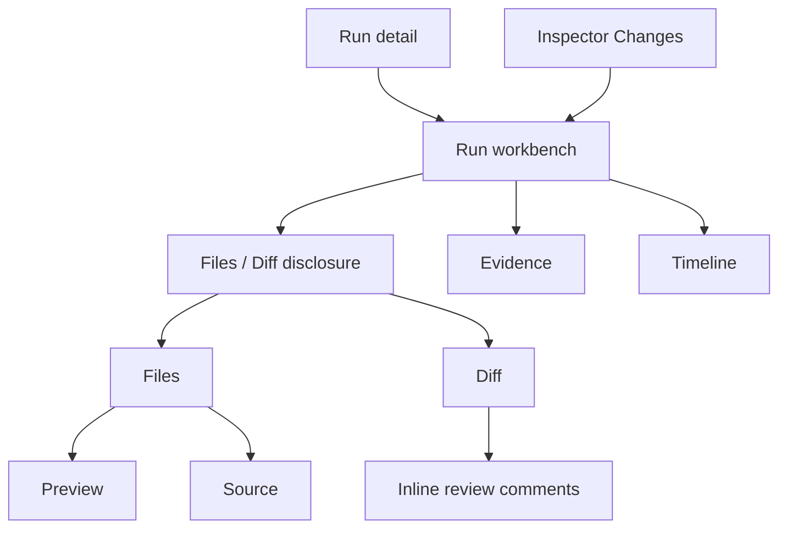
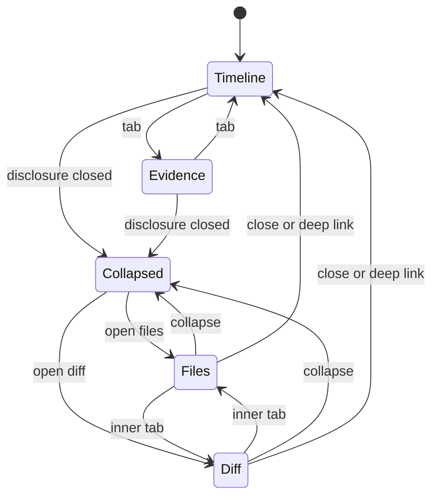

# Run workbench

- **Type:** block.
- **Routes:** shared by `/runs/{runId}` and `/scratch-runs/{runId}`.
- **Status:** Implemented for flow/agent and scratch run detail: Markdown
  (+Mermaid) preview, directory-grouped changed files, a file copy control, and
  a collapsed-by-default Files/Diff disclosure below the primary run work.
- **Source:** current components
  `web/components/workbench/workbench-panel.tsx`,
  `web/components/workbench/workbench-tabs.tsx`,
  `web/components/workbench/file-tree.tsx`,
  `web/components/workbench/code-view.tsx`,
  `web/components/workbench/run-diff.tsx`, and
  `web/components/workbench/diff-view.tsx`.

## JTBD

When I need to inspect code produced by a run, I want one workbench that can
switch between source files, rendered previews, diffs, evidence, and timeline
without losing the selected file or run context.

When I review changes, I want syntax highlighting, Markdown preview, Mermaid
rendering, file status icons, line comments, and scoped diffs, so I can review a
real branch rather than a raw patch dump.

When a consensus node finishes or escalates, I want the synthesized plan, debate
log, verifier rows, and draft references to appear as evidence — so I can audit
why the final answer exists before I act on it.

## Roles & capabilities

| Role | Sees / does |
| --- | --- |
| Project viewer | Opens run-scoped Diff, Evidence, and Timeline. |
| Project member | Opens Files and source views through `readRepoFiles`; comments on review diffs when the HITL gate allows it. |
| Project admin / owner | Uses member capabilities plus delivery actions through the inspector/review panel. |
| Global admin | Bypasses project role checks as owner-equivalent. |

The workbench must preserve ADR-053: source-file browsing reads git-tracked
content only. Untracked and ignored files stay hidden unless a future opt-in
design explicitly changes that trust boundary.

## Navigation

- **Entry:** secondary tabs from [`flow-run.md`](flow-run.md) and
  [`scratch-run.md`](scratch-run.md), changed-file clicks from
  [`run-inspector.md`](run-inspector.md), review-node calls to action, and
  deep links carrying query state.
- **Within:** Timeline and Evidence remain regular secondary tabs. Files and
  Diff live inside one **Files / Diff** disclosure, collapsed by default; opening
  `?wb=files` or `?wb=diff` expands the block and selects the requested inner
  tab. Flow runs may also expose Graph as a fullscreen or main-page view; Graph
  should not compete with the main Flow landing.
- **Exit:** back to the primary run center, inspector actions, or linked
  artifacts.

## URL state contract

Both `/runs/{runId}` and `/scratch-runs/{runId}` use the same query-state
contract:

| Param | Owner | Meaning |
| --- | --- | --- |
| `wb=files\|diff\|evidence\|timeline` | Workbench | Selected workbench surface. `files` and `diff` open the Files/Diff disclosure and select its inner tab; `timeline` and `evidence` select the regular secondary tab. Invalid values fall back to the route default. |
| `file=<repo-relative-path>` | Files | Selected tracked file for Files source/preview only. This path triggers `readRepoFiles`. |
| `fileView=preview\|source` | Files | Preview/source mode for the selected file. |
| `diffFile=<repo-relative-path>` | Diff | Selected changed file in the Diff tab. This must not trigger source-file reads. |
| `diffview=split\|unified` | Diff | Diff renderer mode. |
| `diffbody=rich\|raw` | Diff | Selected-file rendering mode inside the per-file diff: rich rendered/highlighted view or raw source view. It must not replace the file renderer with a raw unified patch dump. |
| `diffFiles=shown\|hidden` | Diff | Changed-file tree visibility. The tree is rooted at project-relative paths and includes an in-place file-name filter. The default is `shown`; hiding the tree keeps the selected file body visible. |
| `scope=run\|since-last-review\|last-node\|uncommitted` | Diff / inspector | Diff and change-summary scope. |
| `node=<node-id>` | Flow result | Selected Flow node for non-scratch Flow runs. Ignored by standalone agent runs. |
| `inspector=<state>` | Run shell | Inspector open/collapsed or selected inspector tab, depending on implementation detail. |
| `flow=fullscreen` | Flow result | Opens the fullscreen Flow graph view. |

`file` and `diffFile` are intentionally separate. A user with run-diff access
may not have source browsing access; the Diff tab must not route through
`?file=` or accidentally invoke the Files pane's `readRepoFiles` gate.

## Layout & regions

The workbench keeps run work secondary to the conversation/result center. Its
regular tab bar covers surfaces that are useful as lightweight context, while
large code-review surfaces sit in one expandable block.

1. **Timeline** - chronological run ledger: node attempts, assignments, HITL,
   crashes, recoveries, promotions, token/cost chunks, and returned human work.
2. **Evidence** - artifact graph, logs, reports, AI judgments, human notes,
   commit sets, checkpoints, previews, plans, payload states, and filters.
   Evidence explains why a run is ready or blocked. M41 consensus adds a
   `plan` artifact kind for `consensus_plan`, keeps `debate_log` as
   `human_note`, and links verifier rows/draft child runs without exposing
   unbounded draft bodies inline.
3. **Files / Diff disclosure** - one collapsed-by-default block below the regular
   tabs. It mounts both the Files and Diff panes so file-tree expansion, selected
   file, and diff selection survive collapse and inner-tab switches. Deep links
   with `?wb=files` or `?wb=diff` open the disclosure automatically.
4. **Diff** - a code-review-style pane with a fixed-height scroll frame:
   changed-file rail on the left, selected file body on the right, sticky
   icon controls, additions / deletions, rich/raw body toggle, split/unified
   toggle for rich mode, show/hide file-rail control, refresh control on live
   run diffs, scope toggle, truncation banner, dirty-state banner, inline review
   comments on the canonical run scope, outdated thread section, and
   selected-file persistence. Comment composition is available as soon as the
   server-provided review context allows it; loading existing threads may show a
   warning but must not remove the root-comment affordance. The current
   implementation shows one selected file at a time; grouped/collapsible
   multi-file sections are a later refinement.
5. **Files** - git-tracked file tree, search/filter, file-type icons, selected
   file header, copy/open controls, and `Preview / Source` toggle where a
   preview exists. Markdown preview supports GFM, Mermaid, syntax-highlighted
   code blocks, anchors, and copy buttons. Source mode uses server-rendered
   Shiki highlighting and line numbers.

The workbench should coordinate with the inspector: selecting a changed file in
the inspector selects the same file in Files or Diff; selecting a file in Files
shows its change status and review comments.

## States

Content-level states:

| Surface | States |
| --- | --- |
| Files | empty selection, loading, rendered source, preview, binary, too large, not found, unauthorized |
| Diff | loading, empty, ready, truncated, dirty, scope unavailable, review-comment error |
| Evidence | empty, loading payload, payload gone, payload error |
| Timeline | empty, live, terminal snapshot |

### Consensus evidence (M41 — Implemented)

Consensus evidence uses the existing Evidence tab and artifact routes:

- `consensus_plan` renders as a `plan` artifact with the same Markdown/Mermaid
  preview path as other textual artifacts.
- `debate_log` renders as a `human_note` artifact and links back to the
  consensus node attempt.
- Verifier rows from `consensus_round_verdicts` appear as compact agreement /
  disagreement evidence attached to the node attempt, with round, verifier,
  target, parse status, and material-axis chips.
- Draft child runs link to their own run pages; draft body excerpts are capped
  in parent evidence and HITL context.

**Acceptance criteria.**

- Filtering by artifact kind includes `plan` without changing the layout of the
  existing evidence filters.
- `consensus_plan` and `debate_log` are visible from the selected consensus node
  and from the Evidence tab with matching labels.
- Verifier evidence shows parse failures as disagree evidence, not as missing
  rows or generic runtime errors.
- Deep links and file/diff query params continue to work when the Evidence tab
  contains consensus artifacts.

## Data & APIs

- Files: `GET /api/runs/{runId}/files` for tree data and RSC `?file=` reads
  through `readBlob`.
- Diff: `GET /api/runs/{runId}/diff?scope=run|since-last-review|last-node|uncommitted`.
- Review comments: `GET /api/runs/{runId}/review-comments`,
  `POST /api/runs/{runId}/review-comments`,
  `PATCH /api/runs/{runId}/review-comments/{commentId}`,
  `DELETE /api/runs/{runId}/review-comments/{commentId}`.
- Evidence: `buildEvidenceGraph(runId)` and artifact payload routes.
- Timeline: `getRunTimeline(runId)`.
- Live updates: `GET /api/runs/{runId}/stream` triggers targeted refetches
  instead of timer polling.

## i18n

`workbench`, `evidence`, `run`, and review-comment keys under `workbench.diff`.
M41 adds `plan` artifact-kind labels, consensus verifier/target labels, round
labels, and parse-status labels. EN + RU parity required.

## Linked artifacts

- Screens / blocks: [`flow-run.md`](flow-run.md), [`scratch-run.md`](scratch-run.md),
  [`run-inspector.md`](run-inspector.md).
- Behavior: [`../../system-analytics/runs.md`](../../system-analytics/runs.md),
  [`../../system-analytics/flow-graph.md`](../../system-analytics/flow-graph.md),
  [`../../system-analytics/hitl.md`](../../system-analytics/hitl.md),
  [`../../system-analytics/consensus.md`](../../system-analytics/consensus.md).
- ADRs: [ADR-053](../../decisions.md#adr-053-workbench-file-tree-git-tracked-only-member-gated-reads),
  [ADR-066](../../decisions.md#adr-066-editor-and-diff-rendering-stack-shiki-git-diff-view-codemirror),
  [ADR-072](../../decisions.md#adr-072-pr-grade-review-comments-review_comments-table-snapshot-anchoring-runner-side-rework-compose-open-gate-guard),
  [ADR-082](../../decisions.md#adr-082-review-diff-completeness-with-dirty-state-protocol-and-scope-switcher),
  [ADR-109](../../decisions.md#adr-109-consensus-flow-graph-node--engine-owned-unanimous-draft-verification-and-human-resolution).
- Source: `web/components/workbench/workbench-panel.tsx`,
  `web/components/workbench/code-view.tsx`,
  `web/components/workbench/run-diff.tsx`,
  `web/components/workbench/diff-view.tsx`,
  `web/lib/diff/prepare.ts`, `web/lib/worktree.ts`.
