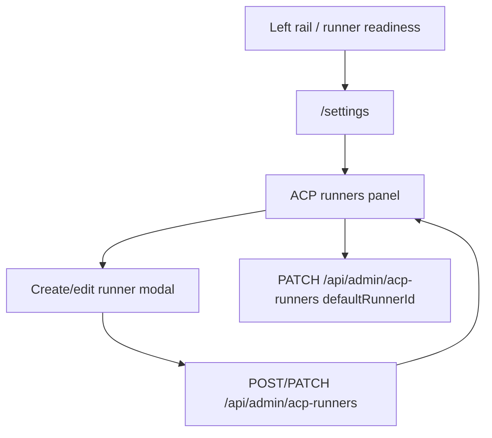
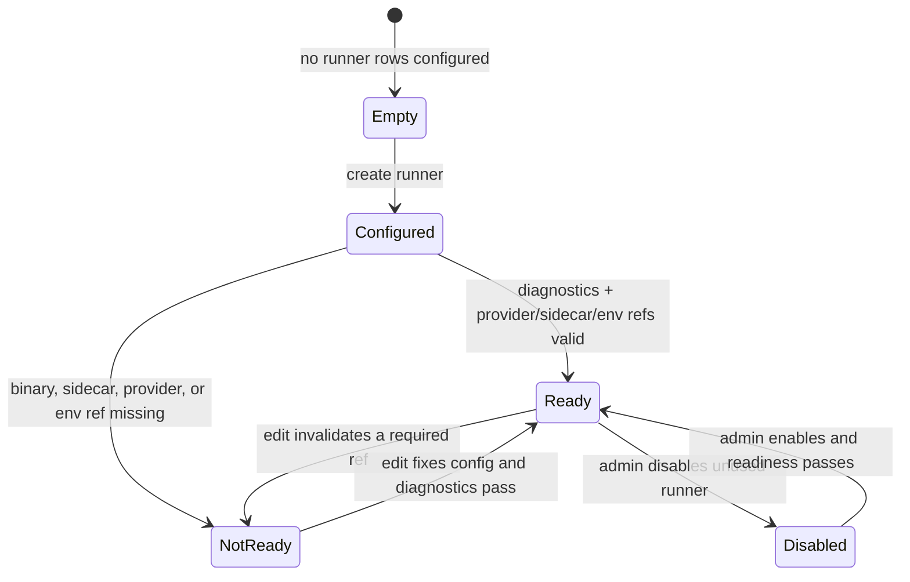

# Settings — ACP runners

- **Type:** screen / admin block.
- **Route:** `/settings` (global admin only; ACP runner catalog section).
- **Status:** Implemented.
- **Source:** `web/app/(app)/settings/page.tsx`,
  `web/components/settings/{acp-runners-panel,acp-runner-modal}.tsx`.

## JTBD

When I administer the platform, I want to manage which ACP-capable coding
agents can launch on this host, how each runner reaches its provider, and which
environment references it passes to the spawned adapter — so project and Flow
launches use a known, editable runtime profile.

## Roles & capabilities

| Role | Access |
| --- | --- |
| Global admin | Full ACP runner catalog, create/edit/delete, enable/disable, default-runner selection |
| Everyone else | Settings nav is hidden or read-only/forbidden; admin API routes re-check `requireGlobalRole("admin")` |

The hidden nav item is convenience only. Runner writes are authorized by the
admin API routes, and launch paths consume only enabled, Ready runner rows.

## Navigation

- **Entry:** the admin block of the [left rail](chrome/left-rail.md), the
  runner readiness popover, and any "configure runner" action that lands on
  `/settings`.
- **Within:** "Add runner", preset actions, and per-row edit open the
  `AcpRunnerModal`; default-runner selection stays on the panel.
- **Exit:** project and run launch surfaces use the saved runner ids, but do not
  edit platform runner definitions.

## Layout & regions

The ACP runner catalog appears as an admin data-management block: configured
runners, adapter/readiness details, default-runner controls, and row actions.
Edits happen in `AcpRunnerModal`.

The modal contains:

- identity and adapter/model controls;
- provider-specific fields (`baseUrl`, `authToken`, `apiKey`, Google fields,
  wire API);
- **env overrides** — editable rows where the left field is the child adapter
  env var name and the right field is either a raw value or an `env:NAME`
  reference resolved by the supervisor host at launch;
- permission policy, sidecar, enabled state, and delete affordances.

Env override rows accept literal values. For example, a Claude runner may store
`ANTHROPIC_MODEL -> claude-opus-4-1` to pass that exact value, or
`ANTHROPIC_MODEL -> env:CLAUDE_CODE_MODEL` to make the supervisor resolve
`CLAUDE_CODE_MODEL` from its own process environment.

## States

## Data & APIs

- Read: `/api/admin/acp-runners` plus settings page server data.
- Mutations: `POST /api/admin/acp-runners`,
  `PATCH /api/admin/acp-runners/{runnerId}`,
  `DELETE /api/admin/acp-runners/{runnerId}`,
  `PATCH /api/admin/acp-runners` for the platform default runner.
- Launch consumption: runner rows are snapshotted into run launch data; env
  refs are preserved in snapshots and resolved only by the supervisor process.
- Behavior: [`../system-analytics/acp-runners.md`](../system-analytics/acp-runners.md)
  and [`../system-analytics/executors.md`](../system-analytics/executors.md).

## i18n

`settings` namespace: runner catalog labels, modal fields, provider labels,
readiness text, env override labels, validation errors, and actions.

## Linked artifacts

- ADR: [ADR-065](../decisions.md#adr-065) — platform ACP runner catalog and
  admin CRUD pattern.
- Behavior: [`../system-analytics/acp-runners.md`](../system-analytics/acp-runners.md),
  [`../system-analytics/executors.md`](../system-analytics/executors.md).
- API: [`../api/web.openapi.yaml`](../api/web.openapi.yaml),
  [`../api/supervisor.openapi.yaml`](../api/supervisor.openapi.yaml).
- Source: `web/components/settings/acp-runners-panel.tsx`,
  `web/components/settings/acp-runner-modal.tsx`,
  `web/lib/acp-runners/runner-form.ts`,
  `supervisor/src/runner-provisioner.ts`.
