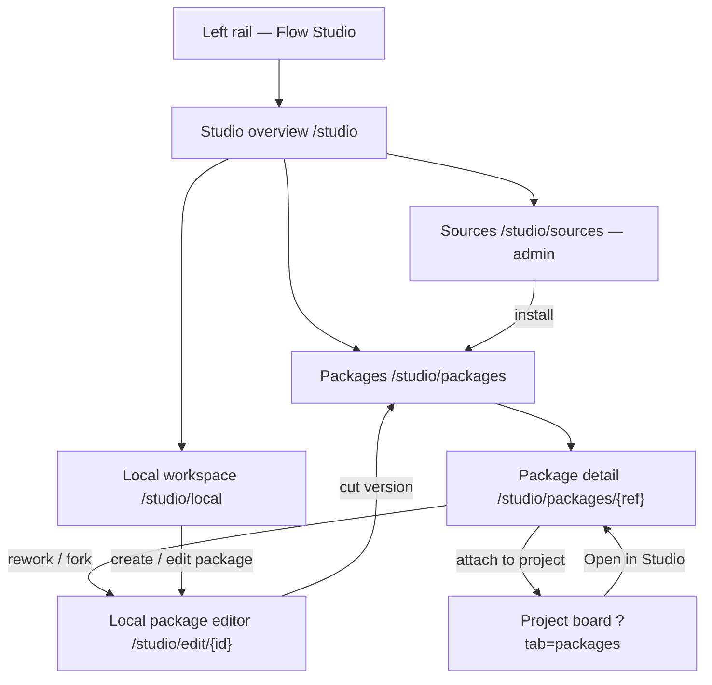
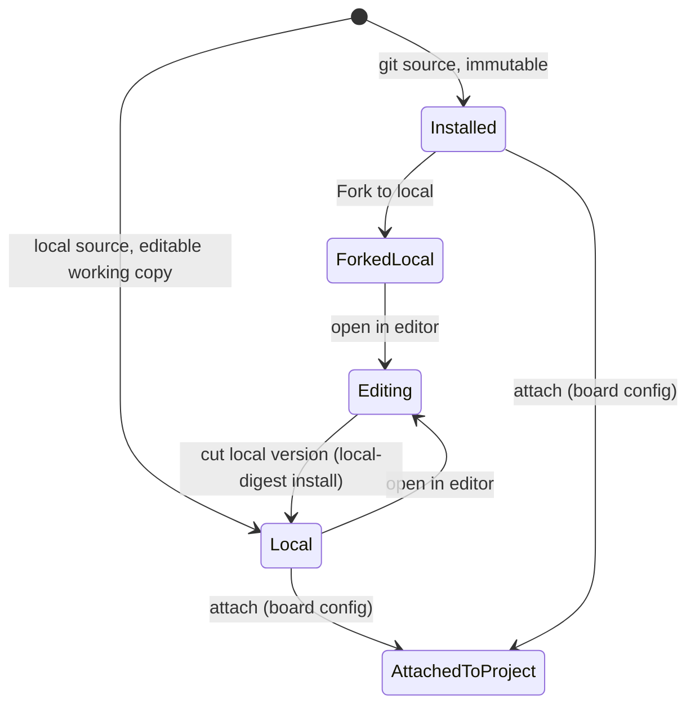

# Flow Studio — redesign (area)

- **Type:** area design doc + index (one IA area: the Studio).
- **Routes:** `/studio`, `/studio/sources`, `/studio/packages`,
  `/studio/packages/{ref}` (+ `/flows/{flowId}`, `/skills/{...path}`,
  `/agents/{stem}`, `/subagents/{stem}` detail sub-surfaces),
  `/studio/edit/{...}`, `/studio/local`.
- **Status:** **Implemented** for overview · sources · packages · package detail ·
  local workspace · local package editor. The package viewer now uses wide flow
  preview cards with frontmatter, and `/studio/local` owns editable local package
  creation/import/delete. Remaining planned pieces: standalone artifact kind
  pickers, move-to-package, and upstream write-back. Supersedes the current `/flows`
  (`web/app/(app)/flows/page.tsx`) and consolidates package management that is
  today scattered across admin `/settings`, the project board `?tab=packages`,
  and the `/projects/{slug}/packages/{flowRefId}` viewer.
- **Per-screen templates:** [`package-viewer.md`](./package-viewer.md) (package
  detail + flow/skill/agent detail), [`editor.md`](./editor.md) (local package
  editor), [`local-workspace.md`](./local-workspace.md) (local packages list).
- **Behavior SSOT:** [`../../system-analytics/flow-studio.md`](../../system-analytics/flow-studio.md),
  [`../../system-analytics/packages.md`](../../system-analytics/packages.md),
  [`../../system-analytics/agents.md`](../../system-analytics/agents.md).

This doc is the **surface SSOT for the Studio redesign**. Per the screens
contract, each per-screen file (one per route, full template) is authored in the
same phase that ships that screen; until then this area README carries the
design. Status tags follow R6: a piece is **Implemented** (exists today,
relocated), **Planned** (new in this redesign), or **Phase 2**.

## Why — what's wrong today

The live `/flows` page and the surrounding surfaces have four concrete problems:

1. **Unbalanced, flows-only landing.** `/flows` is a two-column grid (authored
   drafts | installed flows). One draft drowns in whitespace on the left while
   six flow cards overflow far past the footer on the right.
2. **Flow ≠ package conflation.** "Installed packages (6)" actually lists *five
   flows from one `aif` package* + one `bugfix` flow. Nothing groups by package.
3. **No unified home.** Adding a git **source**, **installing**, **attaching**
   to a project, **browsing** a package, and **authoring** an artifact live in
   four different places (admin Settings · board tab · package viewer · `/flows`).
4. **Authoring is flow-only and project-scoped.** Only `kind=flow` has a create
   form + editor; `skill`/`rule` are schema-only and `agent`/`mcp` are not even
   authored kinds. Skills/agents/MCP-templates are editable solely as files
   bundled *inside* a flow. There is no instance-level "local artifacts" space
   and no "move into a package".

Where each capability lives **today** (all Implemented):

| Capability | Today | Source |
| --- | --- | --- |
| Add git source · discover · install by tag | admin `/settings` | `components/settings/package-sources-panel.tsx`, `package-source-modal.tsx` |
| Attach / detach / upgrade / trust → project | board `?tab=packages` | `components/board/panels/project-packages-section.tsx`, `flow-packages-panel.tsx`, `package-actions.tsx` |
| Package bill-of-materials | `/projects/{slug}/package-installs/{attachmentId}` | that page |
| Browse package (graph + yaml + files) + Fork | `/projects/{slug}/packages/{flowRefId}` | `package-viewer.tsx`, `flow-graph-view-section.tsx`, `code-editor.tsx`, `package-fork-button.tsx` |
| Author/edit a Flow (Graph · YAML · Diff + file editors) | `/flows/{projectSlug}/{capId}` | `flow-editor-tabs.tsx`, `flow-graph-editor.tsx`, `package-files-editor.tsx`, `artifact-editors/*` |
| Attach agents + triggers | board `?tab=agents` | `components/board/panels/agents-attach-panel.tsx` |
| MCP catalogs | `/mcps` (platform) · `?tab=mcps` (project) | `mcp-servers-panel.tsx`, `mcp-server-modal.tsx` |

## The model (locked decisions)

- **One unified Studio section** replaces `/flows`; it walks
  **sources → packages → artifacts → authoring** in one IA.
- **Editable local package is the spine.** A local-source install already
  produces an immutable `local-<digest>` revision (ADR-088). The redesign adds
  the *editable* layer above it: a **local package working copy** that holds many
  artifacts (flows, agents, skills, MCP templates, rules). The **"virtual
  package"** is just the default local package for loose artifacts.
- **Config vs content split.** *Project context* keeps configuration
  (attach/detach/upgrade/trust/enable/version-or-strategy) — it stays on the
  board `?tab=packages`. *Studio* owns content (the designer + every artifact
  editor). They are joined by a **project filter** in Studio and an **"Open in
  Studio / Rework"** deep-link from each attached package.
- **Editing an installed (git) package is immutable → Fork into a local
  package.** Forking clones the bundle into a local editable package; you rework
  it and **cut a local version**; projects attach by version/strategy.
- **Standalone artifact authoring.** Create a Flow / Agent / Skill / MCP template
  / Rule directly (not only as a file inside a flow).
- **"Move to package"** relocates an artifact between local packages.
- **Write-back to a git source** (push a new upstream tag) is **Phase 2**.

## Information architecture

The Studio is a new top-level rail destination (the rail item is
**"Флоу-студия / Flow Studio"**). It is a member-level surface; **Sources** stays
global-admin-gated, while local package creation/edit/delete is member-gated.

| Route | Screen | Scope | Replaces / relates |
| --- | --- | --- | --- |
| `/studio` | Overview | member | new home; replaces `/flows` landing |
| `/studio/sources` | Sources + discovery + install | admin | relocates `package-sources-panel` from `/settings` |
| `/studio/packages` | Packages list (grouped by package) | member | replaces the "installed" column of `/flows` |
| `/studio/packages/{ref}` | Package detail (BoM · wide flow previews · versions · attach · rework) | member | merges `package-installs/{id}` + `packages/{flowRefId}` viewer |
| `/studio/edit/{localPackageId}/[[...path]]` | Local package editor (canvas/properties + files/YAML/diff) | member | edits a git-backed `local_packages` working dir |
| `/studio/local` | Local packages workspace | member | named local packages: create, import, edit, delete unattached |

## Node visual language (icons + color coding)

Adopt the Heym node aesthetic: compact cards with a colored **icon chip**,
title, optional subtitle (runner/model), and **named outcome handles** mapped to
MAIster's typed `transitions`. Final hues bind to the existing dark/green token
palette (muted, not rainbow); these are roles, not hex.

| Node type | Icon | Color role |
| --- | --- | --- |
| `ai_coding` | bot / sparkle | teal (primary agent accent) |
| `judge` | gavel | violet |
| `cli` | terminal `>_` | slate |
| `check` | shield-check | amber |
| `human` | person | magenta |

| Gate kind | Icon | Color |
| --- | --- | --- |
| `command_check` | `>_` | slate |
| `skill_check` | puzzle | green |
| `ai_judgment` | gavel | violet |
| `artifact_required` | file | blue |
| `external_check` | link | cyan |
| `human_review` | person | magenta |

- Blocking gate → **solid** chip; advisory → **outline** chip.
- Default outcome edge → solid; **rework / back-edge → dashed + amber** with the
  outcome label drawn on the edge.
- Node status (in run/preview context) keeps the existing
  `FlowGraphView` coloring; the static editor canvas has no status ring.

## Surfaces

### 1. Studio overview — `/studio` (Implemented — Phase A)

- **JTBD:** "When I open the Studio, I want one place that shows my sources,
  packages, and local artifacts so I can jump to whatever I'm reworking."
- **Roles:** authenticated users see Studio package/local inventory; package
  actions such as Attach/Rework require a manageable project, and only global
  admin sees the Sources entry.
- **Layout:** an eyebrow + title; an at-a-glance strip (sources · packages ·
  local artifacts · projects using them); a **needs-attention** list (untrusted
  installs, drafts with validation errors, available upgrades); cards linking
  into Sources / Packages / Local. No two-column flow dump.
- **Data:** read of `package_sources`, `package_installs`,
  `project_package_attachments`, local packages, authored drafts.

### 2. Sources — `/studio/sources` (Implemented — Phase A; relocated panel)

- **JTBD:** "When I administer the instance, I want to register git monorepo
  sources, discover their packages, and install one by tag."
- **Roles:** global admin only (`requireGlobalRole("admin")`); others get no nav
  entry and an `UNAUTHORIZED` route.
- **Layout:** the existing `PackageSourcesPanel` (sources table + add/edit modal +
  refresh/discover) plus the discovered-packages list and an **Install** action
  (tag picker) — surfaced in Studio instead of buried in the `/settings` stack.
- **Data & APIs:** `POST/PATCH/DELETE /api/admin/package-sources`,
  `POST /api/admin/package-sources/{id}/refresh`,
  `GET/POST /api/admin/package-installs` — unchanged from
  [`packages.md`](../../system-analytics/packages.md).

### 3. Packages — `/studio/packages` (Implemented — Phase A; reuses install data)

- **JTBD:** "When I manage packages, I want every package the instance knows —
  installed (git + local) **grouped by package, not flattened to flows** — so I
  can see versions, trust, and which projects use each."
- **Layout:** a filterable list (by source, kind present, project-usage,
  trust). Each row is **one package** (e.g. `aif` with its 5 flows + skills +
  agents), showing version(s), trust, attach count. The local/virtual packages
  appear here too, badged **Local**. Row → package detail.
- **Data:** `GET /api/admin/package-installs` + per-project attachment joins;
  local packages from the new local-package store.

### 4. Package detail — `/studio/packages/{ref}` (Redesigned in M36 — Phase 1; full template: [`package-viewer.md`](./package-viewer.md))

- **JTBD:** "When I open a package, I want its full bill-of-materials, a
  read-only preview of any flow, its versions and trust, where it's attached,
  and the actions to rework it."
- **Layout & regions** (M36 Flow Package Viewer, Phase 1 — read-only; details +
  states in [`package-viewer.md`](./package-viewer.md)):
  - **Header:** name · source · version(s) · trust · Local/Installed badge.
  - **Bill-of-materials → tab bar + paged cards:** one **tab per kind** (flows ·
    skills · agents · MCPs · rules), each with a count; a **0-count tab is
    hidden**. Non-flow tabs render a cards grid. The **Flows** tab renders wide
    stacked cards with a static graph preview, node/gate stats, and a separate
    frontmatter block (`metadata.title`, `summary`, `labels`, `route_when`,
    `links`, `sources`). Active tab + page live in the URL (`?tab=&page=`),
    deep-linkable and refresh-stable.
  - **Detail sub-surfaces (shipped):** **flow** (static canvas with selectable
    nodes + wide side inspector + central YAML toggle/fallback), **skill**
    (master–detail bundle browser: file list + markdown Preview/Code toggle,
    image preview + SKILL.md frontmatter), **agent** (metadata panel — **no
    runner** — + rendered prompt), **subagent** (frontmatter summary +
    markdown Preview/Code definition).
  - **Lifecycle actions:** **Attach to project** (deep-links to board config),
    **Trust** (admin), **Versions** (list). **Rework** forks an installed package
    into a local package and opens `/studio/edit/{localPackageId}`; the **Import
    (⤓)** affordance is absent on installed (immutable) packages.
- **Data & APIs:** the package-install manifest + the M36 bill-of-materials
  contract (`getStudioPackageBom`), confined bundle file/image reads
  (`installed_path`, server-only), and `POST /api/studio/packages/{ref}/fork` for
  the Studio rework path. The older project-scoped fork route still backs the
  project viewer.

### 5. Local package editor — `/studio/edit/{localPackageId}/[[...path]]`

The Heym-style big-canvas editor over a git-backed local package working dir.
Read-write for members holding the package edit lock; a competing session opens
read-only. The preview twin (region 4) is the read-only variant of the same
canvas.

- **Top bar (compact):** identity (package · artifact · kind) · validation chip
  (valid / N issues) · lock/readiness chip · actions (**Save**, **Cut version**)
  · toggles **[Files] [YAML] [Diff]**. YAML replaces the central canvas when
  toggled; invalid YAML keeps the last valid canvas graph until the YAML parses.
- **Left:** collapsible **Files** drawer (the artifact's bundled files / package
  artifacts); the **global app rail collapses to an icon rail with flyouts**
  (chrome change in [`../chrome/left-rail.md`](../chrome/left-rail.md)) so the
  canvas can go near-full-width without losing navigation.
- **Center:** the **big canvas** — palette (add node/gate), connect, **drag-move
  (persisted to `presentation`, ADR-064)**, zoom/fit/minimap, color-coded node
  cards with icons + named-outcome handles + dashed rework edges.
- **Right:** **Properties panel** — grouped, editable attributes for the
  selected node/gate/edge: **Identity** (id · type · title) · **Behavior**
  (prompt / command / judge rubric, per kind) · **Runner & settings** ·
  **Gates** · **Transitions/outcomes** · **Artifacts** (requires / produces) ·
  **Presentation** (color · size). Nothing selected → flow-level settings.
- **Per-kind editors** (reuse `artifact-editors/*`): skill/agent/rule frontmatter
  form, shell editor + heuristic lint, `form_schema` builder + live preview, MCP
  template form.
- **Data & APIs:** local package working-dir routes —
  `PUT/DELETE /api/studio/local-packages/{id}/files/{path}` for file writes,
  `POST /api/studio/local-packages/{id}/cut-version` for local digest installs,
  and lock refresh/release routes for the edit session.

### 6. Local workspace — `/studio/local` (Implemented)

- **JTBD:** "When I have an idea, I want to author a standalone Flow / Agent /
  Skill / MCP / Rule at instance level, edit it, and later move it into a real
  package."
- **Layout:** a local packages list with **New package**, **Import**, and **Edit**
  entry points. Multiple named local packages are supported. Rows show the slug,
  a **Project default** or **Unattached** badge, and a destructive **Delete**
  action only for unattached non-default packages. Delete opens an inline
  confirmation and removes both the row and working dir. Project-default or
  project-attached packages and packages with a live edit lock cannot be deleted.
  Standalone artifact kind pickers and move-to-package remain planned.
- **Data:** the `local_packages` store (ADR-096) — a platform-scoped, git-backed
  working dir the file/graph editors edit in place under a session lock; cut
  versions reuse the installer. **Not** the `authored_capabilities` draft
  machinery (Variant B keeps platform scope clean); the authored kind enum is
  **not** extended.

## Data-model deltas (drives the plan)

- **Reused:** `package_installs` (local source → `local-<digest>`),
  `project_package_attachments`, `authored_capabilities` draft/CAS/publish, the
  Studio editors, the fork mechanism.
- **New / changed:**
  - **Implemented:** an **editable local package** entity (a working copy
    grouping many artifacts). **Variant B:** a `local_packages` table whose row
    points at a mutable **working directory**; the file/graph editors edit files
    in it and **"cut version"** runs the existing installer over the dir →
    `local-<digest>` `package_installs`. (Not an `authored_capabilities`
    extension — symmetric with the git-package → install → attach pipeline,
    matches the file-based editors, keeps platform scope clean.)
  - **Planned:** **Standalone artifact kinds** — **files** in the working dir
    (`flows/ agents/ skills/ mcps/ rules/ schemas/`), each via its per-kind file
    editor. **Variant B is file-based — the authored kind enum
    (`authored-schema.ts`) is NOT extended** (ADR-096 supersedes the earlier
    "add `agent`/`mcp` kinds" note); only the MCP-template editor is genuinely
    new, and it sources from the platform MCP catalog (`platform_mcp_servers`).
  - **Implemented:** **Cut local version** — install the local package working
    copy as a `local-<digest>` `package_installs` revision (reuses the installer).
  - **Planned:** **Move to package** — relocate an artifact between local packages.
  - **Implemented:** **Editor scope** shifts from per-flow authored cap to
    per-package working copy (a flow's `schemas/` etc. become sibling artifacts
    referenced by the node settings, picked in the properties panel).

## AS-IS → TO-BE component mapping

| Existing | Becomes |
| --- | --- |
| `flows/page.tsx` (two-column) | `studio/overview.tsx` (at-a-glance + areas) |
| `package-sources-panel.tsx` on `/settings` | same panel mounted at `/studio/sources` |
| `project-packages-section` + `flow-packages-panel` | **stay on the board** (config); gain "Open in Studio" deep-link |
| `package-installs/{id}` + `packages/{flowRefId}` viewer | merge → `studio/packages/{ref}` detail |
| `flow-editor-tabs` + `package-files-editor` | `studio/edit` — canvas + right properties + top-bar drawers |
| `flow-graph-view-section` (static) | the shared read-only canvas in package detail |
| `/flows/new` | "New artifact" in `/studio/local` + per-package "New" |

## Linked artifacts

- **Behavior:** [`flow-studio.md`](../../system-analytics/flow-studio.md) (editor
  write path, fork, two-axis trust, version_binding),
  [`packages.md`](../../system-analytics/packages.md) (sources/install/attach),
  [`agents.md`](../../system-analytics/agents.md) (platform agents),
  [`flow-graph.md`](../../system-analytics/flow-graph.md) (node/gate taxonomy).
- **ADRs:** ADR-088 (packages), ADR-067/068/069/070 (Flow Studio + MCP),
  ADR-075 (viewer/fork/kind-by-path), ADR-064 (`presentation` layout).
- **Reference aesthetic:** Heym (`heym.run`) — source-available node canvas.
- **Source (existing):** see the AS-IS table above.
