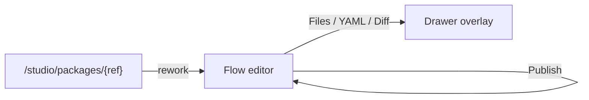
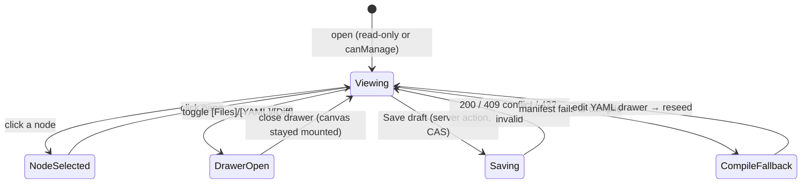

# Flow editor (Studio)

- **Type:** screen (artifact editor).
- **Route(s):** `/flows/{projectSlug}/{capId}` (Phase B, project-authored caps).
  **Phase C adds `/studio/edit/{localPackageId}/{path}`** — the same 3-pane editor
  over a local package's git-backed working dir (ADR-096), acquired under a
  session edit-lock (a second session is read-only). Git packages are NOT edited
  here — they get a read-only preview + "Fork to local" on the package detail.
- **Status:** Implemented (Phase B). Supersedes the tabs-in-a-form editor; the
  read-only twin is the shared `FlowGraphView` (per-project package viewer + run
  workbench), which inherits the node visual scheme.
- **Source:** `web/app/(app)/flows/[projectSlug]/[capId]/page.tsx`,
  `web/components/flows/flow-editor-tabs.tsx`,
  `web/components/flows/editor/editor-top-bar.tsx`,
  `web/components/flows/flow-graph-editor.tsx`,
  `web/components/flows/node-form/node-side-form.tsx`,
  `web/components/board/flow-graph-view.tsx` (shared node body),
  `web/lib/flows/node-visuals.ts`,
  `web/lib/flows/editor/node-form.ts` (`validateDecideDraft`),
  `web/lib/flows/edge-style.ts` (outcome edge roles).

## JTBD

When I am authoring or reworking a flow, I want a big editing canvas with
readable, color-coded node cards, named outcome handles, and a focused properties
panel — so I can build and understand the graph without fighting cramped tabs or a
narrow viewport.

## Roles & capabilities

| Role | Sees | Notes |
| --- | --- | --- |
| Project `viewer` / global viewer with read | Read-only canvas + drawers; no Save/Publish | the `disabled` path; top-bar action buttons are hidden |
| Project `owner`/`admin` or global `admin` (`manageCatalog`) | Full edit: canvas, properties, Save draft, Publish | gated by `canManage`; Publish also requires a valid package |

The route resolves the authored capability against the project + `manageCatalog`;
the gate is server-side, the hidden action buttons are convenience only.

## Navigation

- **Entry:** the package detail "Rework / Open in editor" affordance, the legacy
  `/flows` editor links, or a direct URL.
- **Exit:** back to the project / Studio; **Publish** commits a local revision
  (stays on the editor); drawer toggles open/close in place.

## Layout & regions

A 3-pane shell (top bar + canvas + right properties), with toggled drawers and a
collapsible app rail ([`../chrome/left-rail.md`](../chrome/left-rail.md)):

1. **Top bar (compact)** — identity (project · cap · kind) · lifecycle chip
   (Draft/Published) · validation chip (valid / N issues, from the pure
   `validateEditorManifest`) · readiness chip · **Save draft** · **Publish** ·
   drawer toggles `[Files] [YAML] [Diff]`.
2. **Canvas (dominant, full height)** — the `FlowEditorToolbar` palette (Add
   node ×5 / Add gate ×6 / Remove), color-coded node cards (icon chip + status
   chip), named-outcome handles, dashed amber rework edges, `<MiniMap>` +
   `<Controls>`. Drag persists `presentation` x/y (ADR-064).
3. **Right properties panel (collapsible, ~320–360 px)** — `NodeSideForm` grouped
   under **Identity · Behavior · Runner · Gates · Routing · Transitions ·
   Presentation** + `EditorValidationSummary`. Nothing selected → empty hint. The
   **Routing** group is the M38 `decide` sub-panel (below).
4. **Drawers (overlay)** — `[YAML]` (CodeEditor), `[Diff]` (FlowDraftDiffText),
   `[Files]` (the existing `PackageFilesEditor`, re-homed not redesigned — Phase C
   redesigns it). The canvas stays mounted while a drawer is open.

### Node visual language

Each node/gate carries a colored icon chip + a type-tinted card; the canonical
scheme (icon + hue → `--cv-*` canvas-palette token) lives in
[`../../system-analytics/flow-studio.md`](../../system-analytics/flow-studio.md)
§"Node visual language" and is implemented in `web/lib/flows/node-visuals.ts`. The
icon shape is the primary type signal; the status chip (run/preview only) composes
with it. Blocking gates render a solid chip, advisory an outline; rework /
back-edges render dashed + amber.

### Dynamic routing — `decide` sub-panel (M38 — Implemented)

The **Routing** group in the properties panel edits the node's `decide` table
(ADR-103). It is offered when the node can produce a routable signal — it declares
`output.result` **or** carries a verdict-producing gate (`ai_judgment`/`skill_check`).

- **Source select** — `none` (plain routing) · `output` · `verdict`.
  - `output` reveals a **nested dot-path** text field (e.g. `output.triage.outcome`).
  - `verdict` reveals the **cases table**.
- **Cases table** (verdict only) — an ordered, add/remove list of rows, each a
  `when` predicate (`<field> <op> <number>`, e.g. `confidence >= 0.8`) → **target
  outcome**; plus exactly one **default → target** row. Rows mirror the transitions
  table affordances (icon add/remove, danger-toned remove glyph per the
  `web/CLAUDE.md` UI-affordance conventions).
- **`on_mismatch` control** — offered when the node declares `output.result`:
  `none` (hard `CONFIG`-fail) · `retry` (self re-run) · a transition outcome →
  target. Inline help notes `retry`/`<outcome>` requires a `rework` block.
- **Validation** — `validateDecideDraft` surfaces issues (bad dot-path, missing
  default, duplicate default, target ∉ transitions, `on_mismatch` without `rework`)
  in `EditorValidationSummary`, mapped to the node id.

**Canvas rendering.** A node with **no** `decide` (plain routing) renders its single
`success` edge as today. A node **with** `decide` renders a compact **decision table
glyph** on the card and **outcome-labeled edges** — one labeled edge per producible
outcome (the verdict cases/default targets, or the declared `output` transition
keys), styled via `edge-style.ts` (success/forward green-gray, rework amber-dashed).
The read-only `FlowGraphView` twin inherits the same outcome-labeled edges.

## States

## Data & APIs

Unchanged draft/publish backend (no new route in Phase B):

- Save draft → `updateAuthoredFlowAction` (server action; `expectedDraftVersion`
  CAS) — injectable via the load/save seam (default action).
- Publish → `publishAuthoredFlowAction` (gated on a valid package).
- Canvas/diff are server-compiled from the draft manifest at page load.
- **(Phase C — Designed, ADR-096)** local-package edits at
  `/studio/edit/{id}/{path}` save through the working-dir seam
  (`PUT /api/studio/local-packages/{id}/files/{path}`, atomic + path-confined)
  under a session lock; **"cut version"** (`POST .../cut-version`) replaces
  Publish — it installs the working dir as a `local-<digest>` `package_installs`
  revision a member then attaches.

Behavior SSOT: [`../../system-analytics/flow-studio.md`](../../system-analytics/flow-studio.md)
(authored-flow lifecycle, hard-gate, CAS) — not restated here (R7).

## i18n

`flowEditor` (top-bar labels, drawer labels, rail toggle, node/gate visual
labels, the existing node-form / toolbar / validation keys, plus the M38
`flowEditor.nodeForm.decide*` routing-panel keys), `flows` (page header + save
hint). EN + RU parity required.

## Linked artifacts

- ADRs: [#adr-064](../../decisions.md#adr-064) (authored `presentation` layout),
  [#adr-092](../../decisions.md#adr-092) (unified Studio + editable-local-package
  direction),
  [#adr-103](../../decisions.md#adr-103-output-driven-dynamic-routing-decide--onmismatch-rework--engine-170)
  (M38 `decide` routing panel + outcome-labeled edges).
- Spec: [`../../../.ai-factory/specs/feature-flow-studio-editor.md`](../../../.ai-factory/specs/feature-flow-studio-editor.md).
- Behavior: [`../../system-analytics/flow-studio.md`](../../system-analytics/flow-studio.md).
- Area: [`README.md`](README.md).
- Source: see the Header.
