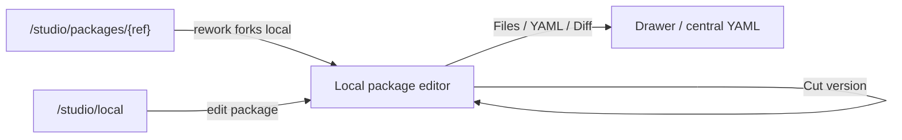
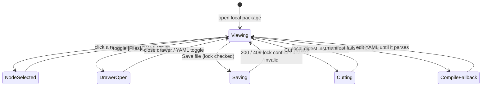

# Flow editor (Studio)

- **Type:** screen (artifact editor).
- **Route(s):** `/studio/edit/{localPackageId}/[[...path]]` (implemented local
  package editor over a git-backed working dir, ADR-096). The legacy
  `/flows/{projectSlug}/{capId}` project-authored-cap route remains the older
  authored-flow editor path. Git packages are NOT edited in place — package
  detail **Rework** forks to a local package and then opens this route.
- **Status:** Implemented for local package editing. Supersedes the tabs-in-a-form
  editor; the read-only twin is the shared `FlowGraphView` (package viewer + run
  workbench), which inherits the node visual scheme and node tooltips.
- **Source:** `web/app/(app)/flows/[projectSlug]/[capId]/page.tsx`,
  `web/components/flows/flow-editor-tabs.tsx`,
  `web/components/flows/editor/editor-top-bar.tsx`,
  `web/components/flows/flow-graph-editor.tsx`,
  `web/components/flows/node-form/node-side-form.tsx`,
  `web/components/board/flow-graph-view.tsx` (shared node body),
  `web/lib/flows/node-visuals.ts`,
  `web/lib/flows/editor/node-form.ts` (`validateDecideDraft`),
  `web/lib/flows/edge-style.ts` (outcome edge roles).

## JTBD

When I am authoring or reworking a flow, I want a big editing canvas with
readable, color-coded node cards, named outcome handles, and a focused properties
panel — so I can build and understand the graph without fighting cramped tabs or a
narrow viewport.

When I add a consensus node, I want participants, material axes, rounds,
synthesizer, and mandatory outputs to be edited in the same right-panel pattern
as every other node — so I can author a multi-agent agreement point without
dropping into raw YAML for routine changes.

## Roles & capabilities

| Role | Sees | Notes |
| --- | --- | --- |
| Authenticated viewer without the local package edit lock | Read-only canvas + files/YAML/diff | lock state explains who holds the package |
| Member holding the edit lock | Full edit: canvas, properties, Save, Cut version | writes go through local-package file APIs; cut version installs a local digest |

The route resolves the local package server-side and reads the current lock state;
write routes enforce member authorization and the edit lock.

## Navigation

- **Entry:** the package detail **Rework** affordance (forks installed package to
  local, then opens this editor), the `/studio/local` package row, or a direct
  URL.
- **Exit:** back to Studio/local package detail; **Cut version** commits a local
  digest install (stays on the editor); drawer/toggle state changes in place.

## Layout & regions

A 3-pane shell (top bar + canvas + right properties), with toggled drawers and a
collapsible app rail ([`../chrome/left-rail.md`](../chrome/left-rail.md)):

1. **Top bar (compact)** — identity (package · selected artifact · kind) · lock
   state · validation chip (valid / N issues, from the pure
   `validateEditorManifest`) · readiness chip · **Save** · **Cut version** ·
   toggles `[Files] [YAML] [Diff]`.
2. **Canvas (dominant, full height)** — the `FlowEditorToolbar` palette (Add
   node ×6 after M41 `consensus` / Add gate ×6 / Remove), color-coded node cards (icon chip + status
   chip), named-outcome handles, dashed amber rework edges, `<MiniMap>` +
   `<Controls>`. Drag persists `presentation` x/y (ADR-064).
3. **Right properties panel (collapsible, ~440–500 px on desktop)** — grouped
   under **Identity · Behavior · Runner · Gates · Routing · Transitions ·
   Presentation** + `EditorValidationSummary`. Selecting a node happens on the
   canvas; nothing selected → flow/package-level settings. The **Routing** group
   is the M38 `decide` sub-panel (below).
4. **Drawers / toggles** — `[Files]` and `[Diff]` use the existing package-file
   and diff surfaces. `[YAML]` replaces the center canvas with the selected
   flow.yaml in CodeEditor. Invalid YAML does not blank the canvas; the last valid
   compiled graph remains available until the YAML parses again.

### Node visual language

Each node/gate carries a colored icon chip + a type-tinted card; the canonical
scheme (icon + hue → `--cv-*` canvas-palette token) lives in
[`../../system-analytics/flow-studio.md`](../../system-analytics/flow-studio.md)
§"Node visual language" and is implemented in `web/lib/flows/node-visuals.ts`. The
icon shape is the primary type signal; the status chip (run/preview only) composes
with it. Blocking gates render a solid chip, advisory an outline; rework /
back-edges render dashed + amber.

### Dynamic routing — `decide` sub-panel (M38 — Implemented)

The **Routing** group in the properties panel edits the node's `decide` table
(ADR-103). It is offered when the node can produce a routable signal — it declares
`output.result` **or** carries a verdict-producing gate (`ai_judgment`/`skill_check`).

- **Source select** — `none` (plain routing) · `output` · `verdict`.
  - `output` reveals a **nested dot-path** text field (e.g. `output.triage.outcome`).
  - `verdict` reveals the **cases table**.
- **Cases table** (verdict only) — an ordered, add/remove list of rows, each a
  `when` predicate (`<field> <op> <number>`, e.g. `confidence >= 0.8`) → **target
  outcome**; plus exactly one **default → target** row. Rows mirror the transitions
  table affordances (icon add/remove, danger-toned remove glyph per the
  `web/CLAUDE.md` UI-affordance conventions).
- **`on_mismatch` control** — offered when the node declares `output.result`:
  `none` (hard `CONFIG`-fail) · `retry` (self re-run) · a transition outcome →
  target. Inline help notes `retry`/`<outcome>` requires a `rework` block.
- **Validation** — `validateDecideDraft` surfaces issues (bad dot-path, missing
  default, duplicate default, target ∉ transitions, `on_mismatch` without `rework`)
  in `EditorValidationSummary`, mapped to the node id.

**Canvas rendering.** A node with **no** `decide` (plain routing) renders its single
`success` edge as today. A node **with** `decide` renders **outcome-labeled edges** —
one labeled edge per producible outcome (the verdict cases/default targets, or the
declared `output` transition keys; these are already transition keys, compile-enforced)
— styled via `edge-style.ts` / `topology.ts` outcome roles (forward green-gray,
rework amber-dashed, a `deny`/`fail` verdict branch red). The read-only
`FlowGraphView` twin inherits the same outcome-labeled edges.

### Package authoring IA (M39 Stream A — Implemented, ADR-105 — create wizards deferred)

Stream A reworks the `/studio/edit/{id}/{path}` local-package editor for
correctness and first-class kinds (behavior SSOT:
[`../../system-analytics/local-packages.md`](../../system-analytics/local-packages.md)
§"M39 Stream A"). Deltas over the Phase B/C editor above:

- **Package-home landing.** With no flow file selected, the editor shows a package
  **overview** — the `PackageManifestForm` (`maister-package.yaml`, new `manifest`
  kind, + raw-YAML toggle) + the file tree + orientation — instead of an empty flow
  canvas. This removes the spurious "YAML is invalid" banner (and the
  rework→empty-yaml symptom) that fired when `syncYamlToCanvas("")` ran on a
  pathless open.
- **Real ownership + End edit.** `heldByMe` is computed from real lock ownership
  (no read-only flash), and a **Done / End edit** action releases the session lock
  and navigates back to `/studio/local`.
- **Commit state.** A top-bar **"Commit state"** action + dirty indicator opens the
  shared `ChangeReviewDialog` (diff + prefilled commit message); the commit
  **validates the changed artifacts and hard-blocks on invalid** (see
  local-packages §"Commit is the validation gate").
- **Canvas selection + node tooltip.** The read-only `FlowGraphView` gains
  click-to-select (canvas → inspector, with the node picker as the a11y fallback)
  and a node property tooltip/popover (type · prompt/model summary · transitions ·
  gates) sourced from `FlowNodeData`, mirrored in the editor.
- **First-class kinds.** Each of the four authorable kinds
  (flows / platform agents / subagents / skills) gets a per-kind form editor + a
  raw-file view, dispatched by inferred kind. Platform agents live at
  package-root `maister-agents/`; subagents at `capability/<id>/agents/` (lenient
  schema) — see [`../../system-analytics/agents.md`](../../system-analytics/agents.md).
  **Create is a generic Add-File today** — the per-kind create wizards (New Flow /
  Platform Agent / Subagent / Skill, with seeded templates) are **deferred** (#134,
  A4); `newSubagentTemplate` exists but is not yet wired into a create flow.

### Consensus node properties (M41 — Implemented)

The `consensus` node is authorable through the same canvas and right-panel
surface, not a bespoke wizard. The toolbar adds one consensus node type with the
canonical node visual from `node-visuals.ts`; the read-only `FlowGraphView`
uses the same icon, hue, tooltip, handles, and compact node body.

- **Canvas card** — shows node label, `consensus` type chip, participant count,
  round mode/max, and a concise `WaitingOnChildren`/HITL state when previewing a
  run. Tooltips name the node as "Consensus", explain read-only draft fan-out,
  and list the first few material axes with a capped "+N more" suffix.
- **Properties / Identity** — node id, label, prompt, description, and
  transitions follow existing node controls.
- **Properties / Consensus** — participant rows (`id`, **Participant source**,
  read-only workspace mode), material axes add/remove list, rounds segmented
  control (`single_pass`/`iterate`) with a numeric max, `on_no_consensus`
  fixed to `escalate`, and **Synthesizer source**. The source pickers are
  grouped as **Runners** (existing member runner route) and **Agents**
  (package-local `maister-agents/*.md` files); unmatched free text remains
  available with an `as runner` / `as agent` toggle.
- **Properties / Schema refs (Implemented)** — `settings.form_schema` and
  `output.result.schema` use schema reference pickers over package-local
  `schemas/*.json` files. The picker can create, paste, or edit schema JSON
  through the shared package draft; the saved manifest stores
  `./schemas/<name>.json`, while the package file path remains
  `schemas/<name>.json`.
- **Properties / Outputs** — the default fills must create
  `consensus_plan` (`kind: plan`, current) and `debate_log`
  (`kind: human_note`, current). Validation blocks deletion or kind drift for
  these mandatory outputs.
- **Validation summary** — surfaces participant count, duplicate ids, missing
  axes, missing synthesizer, unsupported workspace mode, over-fanout, and
  engine-floor errors against the selected node.

**Acceptance criteria.**

- Adding a consensus node from the palette creates valid default YAML that still
  renders on the canvas and in `FlowGraphView`.
- The right properties panel can fill in every required consensus field without
  raw YAML editing.
- Schema reference fields can select, create, paste, and edit `schemas/*.json`
  without leaving the existing Save path; no new API/DB/runtime contract is
  introduced.
- Tooltip and canvas text remain clipped/capped rather than resizing the node or
  overlapping handles on dense graphs.
- EN and RU labels exist for every consensus control, validation message,
  source picker, schema reference control, tooltip, and artifact-kind label.

### Structured node-form controls + assistant `/`-autosuggest (Implemented)

The properties panel replaces comma-separated text fields with structured
controls; the persisted `flow.yaml` shapes are unchanged.

- **MultiSelectField** — `skills` and `mcps` render as removable chips + an
  add-combobox over a package-derived catalog (free-add allowed for forward
  refs); `rework.workspacePolicies` is a fixed-enum multiselect (no free-add).
- **StringListField** — `restrictions`, `roles`, `assignees`, `decisions`,
  `material_axes`, `rework.allowedTargets`, and `hooks.pathGuard.allowedPaths`
  render as one text row per item with a per-row danger trash button and an
  add-row affordance; an empty list omits the field.
- **`/`-autosuggest `action.prompt` composer** — the node prompt is the shared
  `CapabilityComposer`; typing `/` offers package skills and inserts a canonical
  `@skill:<slug>` token (the runtime adapts the wire form per runner). A package
  viewer with no catalog degrades to a plain read-only textarea.

The **AI assistant** (a right-hand drawer opened by the top-bar "AI" toggle,
mutually exclusive with the node-properties inspector) mirrors this: its
first-prompt input is the same `/`-autosuggest composer, and the follow-up
composer's **Send** is overlaid bottom-right over the input (attachment/busy
chips bottom-left); Enter sends, Shift+Enter adds a newline. The assistant
receives the complete, drift-guarded Flow DSL grammar on **every** turn (launch
and follow-up; the heavier per-package flow dump is launch-only), so `consensus`
is authored as a first-class node — see
[`../../system-analytics/flow-studio.md`](../../system-analytics/flow-studio.md)
§"Assistant grammar + structured node-form controls".

**Acceptance criteria.**

- Skills/mcps render as chips with an add affordance; workspace policies accept
  only the three enum values; list fields add and remove rows.
- The node prompt composer stores `@skill:<slug>`; an existing plain-text prompt
  renders unchanged until a token is inserted.
- Read-only viewer mounts degrade to text/chips with no fetch.
- EN and RU labels exist for every new multiselect, string-list, and composer
  control.

## States

## Data & APIs

The local editor works against the local-package working-dir seam:

- Page load reads `local_packages`, lists files from the confined working dir,
  and server-compiles the selected flow manifest for the initial canvas.
- Save writes through `PUT /api/studio/local-packages/{id}/files/{path}` (or
  `DELETE` for removed files), with path confinement, atomic writes, and edit-lock
  enforcement.
- Lock refresh/release routes keep a single editing session writable; a second
  session is read-only until it acquires the lock.
- Cut version uses `POST /api/studio/local-packages/{id}/cut-version` to install
  the working dir as a `local-<digest>` `package_installs` revision a member then
  attaches.

Behavior SSOT: [`../../system-analytics/flow-studio.md`](../../system-analytics/flow-studio.md)
(authored-flow lifecycle, hard-gate, CAS) — not restated here (R7).

## i18n

`flowEditor` (top-bar labels, drawer labels, rail toggle, node/gate visual
labels, the existing node-form / toolbar / validation keys, the M38
`flowEditor.nodeForm.decide*` routing-panel keys, and M41
`flowEditor.nodeForm.consensus*` participant/axis/round/synthesizer/output keys,
reference-picker keys under `flowEditor.nodeForm.schemaRef*`, and the
`flowEditor.nodeForm.{promptComposer,multiSelect,stringList}*` structured-control
keys),
`flows` (page header + save hint). EN + RU parity required.

## Linked artifacts

- ADRs: [#adr-064](../../decisions.md#adr-064) (authored `presentation` layout),
  [#adr-092](../../decisions.md#adr-092) (unified Studio + editable-local-package
  direction),
  [#adr-103](../../decisions.md#adr-103-output-driven-dynamic-routing-decide--onmismatch-rework--engine-170)
  (M38 `decide` routing panel + outcome-labeled edges),
  [#adr-109](../../decisions.md#adr-109-consensus-flow-graph-node--engine-owned-unanimous-draft-verification-and-human-resolution)
  (M41 consensus node).
- Spec: [`../../../.ai-factory/specs/feature-flow-studio-editor.md`](../../../.ai-factory/specs/feature-flow-studio-editor.md).
- Spec: [`../../../.ai-factory/specs/feature-flow-studio-reference-pickers.md`](../../../.ai-factory/specs/feature-flow-studio-reference-pickers.md)
  (Implemented reference picker polish).
- Behavior: [`../../system-analytics/flow-studio.md`](../../system-analytics/flow-studio.md),
  [`../../system-analytics/consensus.md`](../../system-analytics/consensus.md).
- Area: [`README.md`](README.md).
- Source: see the Header.
