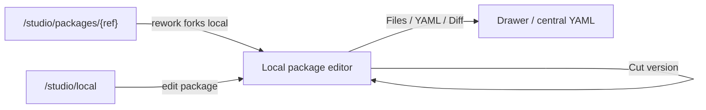
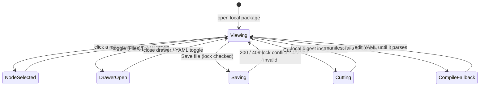

# Flow editor (Studio)

- **Type:** screen (artifact editor).
- **Route(s):** `/studio/edit/{localPackageId}/[[...path]]` (implemented local
  package editor over a git-backed working dir, ADR-096). The legacy
  `/flows/{projectSlug}/{capId}` project-authored-cap route remains the older
  authored-flow editor path. Git packages are NOT edited in place — package
  detail **Rework** forks to a local package and then opens this route.
- **Status:** Implemented for local package editing. Supersedes the tabs-in-a-form
  editor; the read-only twin is the shared `FlowGraphView` (package viewer + run
  workbench), which inherits the node visual scheme and node tooltips.
- **Source:** `web/app/(app)/flows/[projectSlug]/[capId]/page.tsx`,
  `web/components/flows/flow-editor-tabs.tsx`,
  `web/components/flows/editor/editor-top-bar.tsx`,
  `web/components/flows/flow-graph-editor.tsx`,
  `web/components/flows/node-form/node-side-form.tsx`,
  `web/components/board/flow-graph-view.tsx` (shared node body),
  `web/lib/flows/node-visuals.ts`,
  `web/lib/flows/editor/node-form.ts` (`validateDecideDraft`),
  `web/lib/flows/edge-style.ts` (outcome edge roles).

## JTBD

When I am authoring or reworking a flow, I want a big editing canvas with
readable, color-coded node cards, named outcome handles, and a focused properties
panel — so I can build and understand the graph without fighting cramped tabs or a
narrow viewport.

## Roles & capabilities

| Role | Sees | Notes |
| --- | --- | --- |
| Authenticated viewer without the local package edit lock | Read-only canvas + files/YAML/diff | lock state explains who holds the package |
| Member holding the edit lock | Full edit: canvas, properties, Save, Cut version | writes go through local-package file APIs; cut version installs a local digest |

The route resolves the local package server-side and reads the current lock state;
write routes enforce member authorization and the edit lock.

## Navigation

- **Entry:** the package detail **Rework** affordance (forks installed package to
  local, then opens this editor), the `/studio/local` package row, or a direct
  URL.
- **Exit:** back to Studio/local package detail; **Cut version** commits a local
  digest install (stays on the editor); drawer/toggle state changes in place.

## Layout & regions

A 3-pane shell (top bar + canvas + right properties), with toggled drawers and a
collapsible app rail ([`../chrome/left-rail.md`](../chrome/left-rail.md)):

1. **Top bar (compact)** — identity (package · selected artifact · kind) · lock
   state · validation chip (valid / N issues, from the pure
   `validateEditorManifest`) · readiness chip · **Save** · **Cut version** ·
   toggles `[Files] [YAML] [Diff]`.
2. **Canvas (dominant, full height)** — the `FlowEditorToolbar` palette (Add
   node ×5 / Add gate ×6 / Remove), color-coded node cards (icon chip + status
   chip), named-outcome handles, dashed amber rework edges, `<MiniMap>` +
   `<Controls>`. Drag persists `presentation` x/y (ADR-064).
3. **Right properties panel (collapsible, ~440–500 px on desktop)** — grouped
   under **Identity · Behavior · Runner · Gates · Routing · Transitions ·
   Presentation** + `EditorValidationSummary`. Selecting a node happens on the
   canvas; nothing selected → flow/package-level settings. The **Routing** group
   is the M38 `decide` sub-panel (below).
4. **Drawers / toggles** — `[Files]` and `[Diff]` use the existing package-file
   and diff surfaces. `[YAML]` replaces the center canvas with the selected
   flow.yaml in CodeEditor. Invalid YAML does not blank the canvas; the last valid
   compiled graph remains available until the YAML parses again.

### Node visual language

Each node/gate carries a colored icon chip + a type-tinted card; the canonical
scheme (icon + hue → `--cv-*` canvas-palette token) lives in
[`../../system-analytics/flow-studio.md`](../../system-analytics/flow-studio.md)
§"Node visual language" and is implemented in `web/lib/flows/node-visuals.ts`. The
icon shape is the primary type signal; the status chip (run/preview only) composes
with it. Blocking gates render a solid chip, advisory an outline; rework /
back-edges render dashed + amber.

### Dynamic routing — `decide` sub-panel (M38 — Implemented)

The **Routing** group in the properties panel edits the node's `decide` table
(ADR-103). It is offered when the node can produce a routable signal — it declares
`output.result` **or** carries a verdict-producing gate (`ai_judgment`/`skill_check`).

- **Source select** — `none` (plain routing) · `output` · `verdict`.
  - `output` reveals a **nested dot-path** text field (e.g. `output.triage.outcome`).
  - `verdict` reveals the **cases table**.
- **Cases table** (verdict only) — an ordered, add/remove list of rows, each a
  `when` predicate (`<field> <op> <number>`, e.g. `confidence >= 0.8`) → **target
  outcome**; plus exactly one **default → target** row. Rows mirror the transitions
  table affordances (icon add/remove, danger-toned remove glyph per the
  `web/CLAUDE.md` UI-affordance conventions).
- **`on_mismatch` control** — offered when the node declares `output.result`:
  `none` (hard `CONFIG`-fail) · `retry` (self re-run) · a transition outcome →
  target. Inline help notes `retry`/`<outcome>` requires a `rework` block.
- **Validation** — `validateDecideDraft` surfaces issues (bad dot-path, missing
  default, duplicate default, target ∉ transitions, `on_mismatch` without `rework`)
  in `EditorValidationSummary`, mapped to the node id.

**Canvas rendering.** A node with **no** `decide` (plain routing) renders its single
`success` edge as today. A node **with** `decide` renders **outcome-labeled edges** —
one labeled edge per producible outcome (the verdict cases/default targets, or the
declared `output` transition keys; these are already transition keys, compile-enforced)
— styled via `edge-style.ts` / `topology.ts` outcome roles (forward green-gray,
rework amber-dashed, a `deny`/`fail` verdict branch red). The read-only
`FlowGraphView` twin inherits the same outcome-labeled edges.

## States

## Data & APIs

The local editor works against the local-package working-dir seam:

- Page load reads `local_packages`, lists files from the confined working dir,
  and server-compiles the selected flow manifest for the initial canvas.
- Save writes through `PUT /api/studio/local-packages/{id}/files/{path}` (or
  `DELETE` for removed files), with path confinement, atomic writes, and edit-lock
  enforcement.
- Lock refresh/release routes keep a single editing session writable; a second
  session is read-only until it acquires the lock.
- Cut version uses `POST /api/studio/local-packages/{id}/cut-version` to install
  the working dir as a `local-<digest>` `package_installs` revision a member then
  attaches.

Behavior SSOT: [`../../system-analytics/flow-studio.md`](../../system-analytics/flow-studio.md)
(authored-flow lifecycle, hard-gate, CAS) — not restated here (R7).

## i18n

`flowEditor` (top-bar labels, drawer labels, rail toggle, node/gate visual
labels, the existing node-form / toolbar / validation keys, plus the M38
`flowEditor.nodeForm.decide*` routing-panel keys), `flows` (page header + save
hint). EN + RU parity required.

## Linked artifacts

- ADRs: [#adr-064](../../decisions.md#adr-064) (authored `presentation` layout),
  [#adr-092](../../decisions.md#adr-092) (unified Studio + editable-local-package
  direction),
  [#adr-103](../../decisions.md#adr-103-output-driven-dynamic-routing-decide--onmismatch-rework--engine-170)
  (M38 `decide` routing panel + outcome-labeled edges).
- Spec: [`../../../.ai-factory/specs/feature-flow-studio-editor.md`](../../../.ai-factory/specs/feature-flow-studio-editor.md).
- Behavior: [`../../system-analytics/flow-studio.md`](../../system-analytics/flow-studio.md).
- Area: [`README.md`](README.md).
- Source: see the Header.
