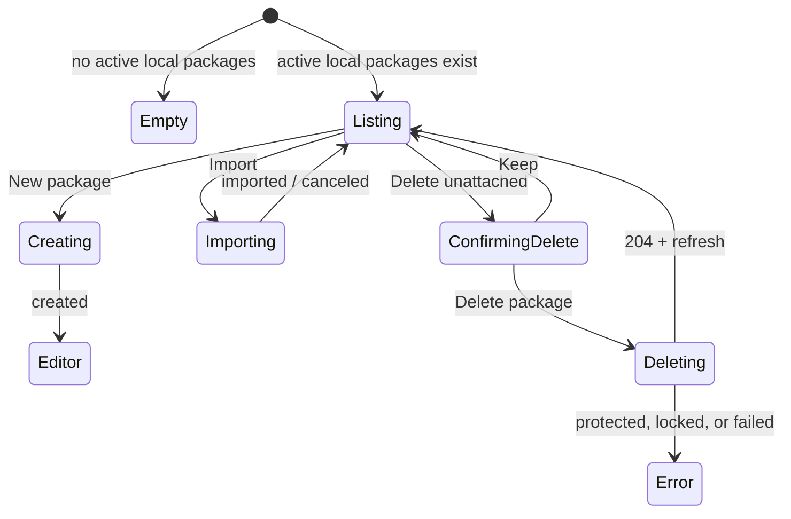

# Local packages workspace — `/studio/local`

- **Type:** screen template.
- **Route:** `/studio/local`.
- **Status:** Implemented.
- **Scope:** authenticated member surface; disk handles and lock sessions stay
  server-side.
- **Behavior SSOT:** [`../../system-analytics/flow-studio.md`](../../system-analytics/flow-studio.md),
  [`../../system-analytics/packages.md`](../../system-analytics/packages.md).

## JTBD

When I am working on package content locally, I want a simple list of editable
local packages so I can create one, import content, open the editor, or remove
throwaway packages that are not attached anywhere.

## Layout

- Header with back-link to Studio, title, and short description.
- Toolbar with **New package**. Creating a package scaffolds a git-backed working
  directory and opens `/studio/edit/{localPackageId}`.
- List rows for active local packages:
  - package name and slug;
  - badge: **Project default** for project-owned defaults, otherwise
    **Unattached**;
  - **Import** action for archive/package import into the local package;
  - row click opens the local package editor.
- **Delete** is shown only for packages that are both unattached and not a
  project default. It opens an inline danger confirmation. Confirming deletes the
  `local_packages` row and its working directory.

## Delete Guards

The UI hides delete for packages that are known to be protected, but the server
is authoritative:

- a package with `project_id` or `is_default` cannot be deleted;
- a package with a live edit lock cannot be deleted;
- the delete query repeats those conditions so a concurrent attach/lock turns
  into a `CONFLICT` instead of deleting the working dir.

## States

## Data & APIs

- List: `listLocalPackages()` returns active local package rows; the page projects
  only client-safe fields (`id`, `name`, `slug`, `isDefault`, `canDelete`).
- Create: `POST /api/studio/local-packages`.
- Delete: `DELETE /api/studio/local-packages/{id}`.
- Import: `POST /api/studio/local-packages/{id}/import`.
- Edit: `/studio/edit/{localPackageId}/[[...path]]`.

## i18n

User-facing strings live under `studio.local.*` in `web/messages/en.json` and
`web/messages/ru.json`, including delete confirmation and guarded-state labels.

## Linked Artifacts

- Components: `components/studio/local-packages-list.tsx`,
  `components/studio/import-dialog.tsx`.
- Server: `lib/local-packages/service.ts`,
  `app/api/studio/local-packages/[id]/route.ts`.
