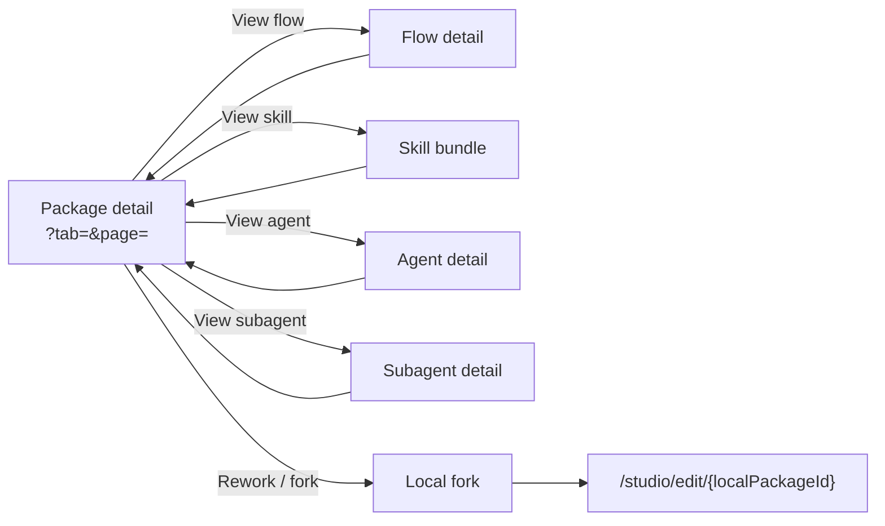

# Package viewer — `/studio/packages/{ref}` + detail surfaces

- **Type:** per-screen template (the Studio package detail + its flow / skill /
  agent / subagent detail sub-surfaces).
- **Routes:**
  - `/studio/packages/{ref}` — package detail (tabbed bill-of-materials).
  - `/studio/packages/{ref}/flows/{flowId}` — read-only flow detail.
  - `/studio/packages/{ref}/skills/{...path}` — skill bundle browser.
  - `/studio/packages/{ref}/agents/{stem}` — agent detail.
  - `/studio/packages/{ref}/subagents/{stem}` — subagent detail.
- **Status:** **Designed→Implemented on merge** (M36 Flow Package Viewer,
  Phase 1), with the local-fork rework path now wired. Supersedes the chip-list
  bill-of-materials and the deferred-to-Phase-B embedded canvas in the [area
  README](./README.md) §"Surfaces / 4. Package detail".
- **Scope:** authenticated users can view package content; actions such as Attach
  and Rework require a manageable project. Installed package content remains
  **read-only**; editing starts by forking into a local package and opening
  `/studio/edit/{localPackageId}`.
- **Behavior SSOT:**
  [`../../system-analytics/flow-studio.md`](../../system-analytics/flow-studio.md)
  (fork / two-axis trust / version binding),
  [`../../system-analytics/packages.md`](../../system-analytics/packages.md)
  (install / attach / bundle reads),
  [`../../system-analytics/agents.md`](../../system-analytics/agents.md)
  (platform-agent definition shape — the runner is **never** a package property),
  [`../../system-analytics/flow-graph.md`](../../system-analytics/flow-graph.md)
  (node / gate taxonomy rendered in the flow detail).
- **ADRs:** ADR-092 (Studio IA / node-visual scheme), ADR-075 (package
  viewer / fork / kind-by-path). No new ADR.

`ref` is the package **name** (Phase A semantics); two sources exposing the same
name surface a collision picker rather than silently choosing one. The
`installed_path` is resolved **server-side only** and never enters a client prop
or DTO — every disk read happens in the RSC/server layer and only rendered
content + metadata cross to the browser.

## 1. Package detail — `/studio/packages/{ref}`

Replaces the flat chip lists with a **tabbed, paged, card-based** bill-of-materials.

- **Header (kept):** name · Local/Installed badge · newest version label · source
  URL · lifecycle actions (**Attach to project**, **Trust** (admin)) ·
  **Rework**. Rework forks the installed package into a local package, then opens
  the local editor. The **Import (⤓)** affordance is intentionally **ABSENT** on
  installed packages — only local packages can import external archives.
- **Bill-of-materials → tab bar + cards grid + paging:**
  - One **tab per kind** — Flows · Skills · Agents · Subagents · MCPs · Rules —
    each with a member **count**. A kind whose count is **0 is hidden** (never an
    empty tab). All counts hidden ⇒ a single "nothing to browse" empty state.
    **Agents** are platform-agents from the package-root `maister-agents/`
    (`inventory.platformAgents`, strict platform-agent frontmatter, rich view).
    **Subagents** are the flow-internal Claude subagents from
    `capability/**/agents/` (`inventory.agents`) — materialized into the run's
    `.claude/agents/` at launch, NOT platform-agents. This split is
    package-viewer-scoped; the standalone `/agents` catalog (ADR-089) is a
    separate subsystem and unchanged.
  - The active non-flow tab renders a **cards grid** (no bare id chips). Each card
    carries a name, a kind-specific meta line and a **View** link into the
    relevant detail surface.
  - The active **Flows** tab renders **wide stacked preview cards**. Each card
    carries the flow title/id, engine chip, node/gate/frontmatter stats, summary,
    a separate frontmatter block (`metadata.labels`, `route_when`, `links`,
    `sources`), a **View** link, and a right-side static graph preview. If the
    manifest cannot compile, the preview area degrades to a typed placeholder
    while the card still renders.
  - **Paging:** numbered page links; page size 12. Counts equal the totals across
    pages.
  - **URL state:** active tab + page live in the query (`?tab=skills`, `?page=2`),
    read from `searchParams`, so they survive refresh / back-forward and are
    deep-linkable. A deep-link to an emptied tab falls back to the first non-empty
    kind.
  - **Return links:** detail sub-surfaces return to their originating package
    kind tab (`?tab=flows|skills|agents|subagents`) rather than the package's
    default tab.
- **Card meta per kind:**
  - **Flow:** wide preview card: `N nodes`, `M gates`, frontmatter present/missing,
    optional `metadata.title`/`summary`, labels, route condition, links, sources,
    and static graph preview.
  - **Skill:** the `SKILL.md` frontmatter `description` as the card description,
    plus `K files · S subfolders`.
  - **Agent (platform):** when-to-call (trigger labels) as the card description +
    `risk_tier · workspace` as the meta line — **never the runner**. Links to the
    rich platform-agent detail (`/agents/<stem>`, reads `maister-agents/<stem>.md`;
    invalid frontmatter degrades to the raw `.md`).
  - **Subagent:** the lenient frontmatter `description` + a "materialized into
    .claude/ at run" meta line. Links to the markdown subagent detail
    (`/subagents/<stem>`) — never strict-parsed.
  - **MCP / Rule:** name (+ the rule file path for rules).
- **Degraded members:** a member unreadable on disk comes back id-only (empty
  meta / zero counts); the card renders the name and **omits** the meta line
  rather than showing blank text.

## 2. Flow detail — `/studio/packages/{ref}/flows/{flowId}`

A read-only flow surface: the static canvas + selectable nodes + a per-node
properties inspector.

- **Graph:** the static `FlowGraphViewSection` (NO `runContext` — no SSE, no
  `/graph-status`, no status ring). The stored `flow.yaml` is read off the bundle,
  compiled to topology + presentation layout server-side. Nodes are selectable on
  the canvas and show the same settings tooltip used by run/workbench canvases.
- **Node inspector:** the right rail is wider than the previous package viewer
  rail (desktop `440px`, widening at `xl`) and shows the selected node's full
  configuration — prompt / command, settings, enforcement, gates,
  transitions/outcomes, rework, declared input/output — with no add/remove
  controls and no save. There is no stale node list beside the graph.
- **YAML toggle / states:**
  - The `flow.yaml` button replaces the central canvas with a read-only YAML view
    instead of opening a separate side panel.
  - Compile/parse **fails** → the graph region shows a "graph unavailable —
    showing the raw flow.yaml only" notice; the YAML view still renders. Never a
    500.
  - Unknown `flowId` or a missing bundle (no compiled graph **and** no readable
    yaml) → `notFound()`.
  - Compilable flow → graph + inspector + the raw `flow.yaml` (read-only editor).

The same graph body is shared with run/workbench canvases; tooltips and node
selection are data-driven and do not expose bundle paths to the client.

## 3. Skill bundle — `/studio/packages/{ref}/skills/{...path}`

A master–detail bundle browser for one skill (`{...path}` is the skill id, which
may contain `/`).

- **Frontmatter header:** the skill's `SKILL.md` `name` + `description` (parsed
  server-side); absent/unreadable → a "no SKILL.md frontmatter" line.
- **File list:** every regular file under the skill's `skills/<id>/` subtree
  (nested files included), each with its inferred kind badge.
- **File view (`?file=` — deep-linkable):** text/image state is deep-linkable per
  file, and text editors are keyed by the selected path so switching the left
  file always refreshes the right pane.
  - **markdown** → `Preview / Code` toggle (`?view=code`); Preview renders the
    markdown body and lifts YAML frontmatter into a separate metadata block;
    Code uses the read-only CodeMirror host.
  - **code / text** → the read-only CodeMirror host;
  - **image** (`.png/.jpg/.jpeg/.gif/.webp/.svg/.bmp/.ico/.avif`) → an inline
    `` preview from a **server-rendered data URI** (bytes confined, path never
    exposed);
  - other binary / too-large / not-found → the typed placeholder banner.
  - Every `?file=` path is **confined before any fs call** via the shared
    `readInstalledPackageFile` / `readInstalledPackageImage` confinement (no
    bespoke path handling): the bundle-relative value is prefixed with the
    package-relative skill path, then traversal / leading-`/` / leading-`-` / NUL /
    symlink-escape are all rejected.
- **Degraded:** a missing bundle dir degrades to a "bundle not available" notice
  (never throws).

## 4. Agent detail — `/studio/packages/{ref}/agents/{stem}`

A read-only agent surface parsed from the package-root `maister-agents/<stem>.md`
via the shared `parseAgentDefinition` (the canonical platform-agent dir — ADR-105).

- **Metadata panel:** description · when-to-call (trigger labels) · risk_tier ·
  workspace (+ workspace_ref) · mode · capability profile · recommended cron /
  events. **The runner is NEVER shown** — it is resolved per-project at launch,
  not a property of the package definition.
- **Prompt:** the rendered agent prompt body.
- **Degraded:** a malformed/unparseable definition degrades to an "agent
  definition could not be read" notice; a missing file → `notFound()`. Never a
  500.

## 5. Subagent detail — `/studio/packages/{ref}/subagents/{stem}`

A read-only view of a flow-internal Claude subagent from
`capability/**/agents/<stem>.md`.

- **Header:** lenient frontmatter `name` + `description` where present, plus the
  "materialized into .claude/ at run" meta line.
- **Definition:** `Preview / Code` markdown viewer. Preview separates YAML
  frontmatter into a metadata block and renders the markdown body; Code shows the
  exact source definition in the read-only editor.
- **Back link:** returns to `/studio/packages/{ref}?tab=subagents`.

## i18n

Every user-facing string is `next-intl` under `studio.viewer.*` (EN + RU, exact
key parity), including localized enum/status labels for trigger, risk tier,
workspace, and mode — no raw enum is rendered. The generic file-state strings
(binary / too-large / not-found / empty) are shared with the per-project viewer's
`packages.viewer.*` namespace.

## Linked artifacts

- **Area:** [`./README.md`](./README.md) (Studio IA, node-visual scheme).
- **Behavior:** flow-studio · packages · agents · flow-graph system-analytics
  docs (linked above).
- **Components:** `components/studio/{package-tabs,element-card,package-detail,
  studio-flow-viewer,flow-node-inspector,fork-to-edit-button,skill-bundle-view,
  agent-view}.tsx`,
  `components/flows/package-viewer.tsx` (file-state + image preview),
  `components/board/flow-graph-view*.tsx`,
  `lib/flows/graph/node-tooltips.ts`.
- **Server reads:** `lib/flows/package-content.ts` (confined file/image reads),
  `lib/studio/{flow-detail,package-path,load}.ts`, the frozen
  `lib/queries/packages.ts` bill-of-materials contract.
