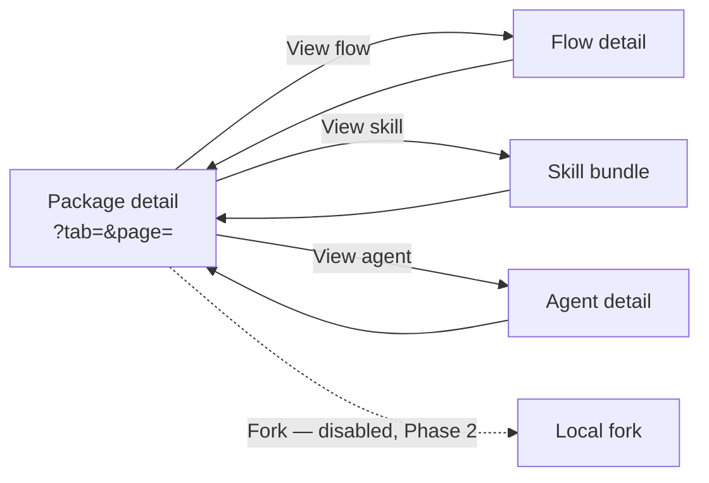

# Package viewer — `/studio/packages/{ref}` + detail surfaces

- **Type:** per-screen template (the Studio package detail + its flow / skill /
  agent detail sub-surfaces).
- **Routes:**
  - `/studio/packages/{ref}` — package detail (tabbed bill-of-materials).
  - `/studio/packages/{ref}/flows/{flowId}` — read-only flow detail.
  - `/studio/packages/{ref}/skills/{...path}` — skill bundle browser.
  - `/studio/packages/{ref}/agents/{stem}` — agent detail.
- **Status:** **Designed→Implemented on merge** (M36 Flow Package Viewer,
  Phase 1). Supersedes the chip-list bill-of-materials and the deferred-to-Phase-B
  embedded canvas in the [area README](./README.md) §"Surfaces / 4. Package detail".
- **Scope:** member-level (anyone with `manageCatalog` on ≥1 project, same gate as
  the package detail). **Read-only** — installed packages are immutable; editing
  forks land in Phase 2.
- **Behavior SSOT:**
  [`../../system-analytics/flow-studio.md`](../../system-analytics/flow-studio.md)
  (fork / two-axis trust / version binding),
  [`../../system-analytics/packages.md`](../../system-analytics/packages.md)
  (install / attach / bundle reads),
  [`../../system-analytics/agents.md`](../../system-analytics/agents.md)
  (platform-agent definition shape — the runner is **never** a package property),
  [`../../system-analytics/flow-graph.md`](../../system-analytics/flow-graph.md)
  (node / gate taxonomy rendered in the flow detail).
- **ADRs:** ADR-092 (Studio IA / node-visual scheme), ADR-075 (package
  viewer / fork / kind-by-path). No new ADR.

`ref` is the package **name** (Phase A semantics); two sources exposing the same
name surface a collision picker rather than silently choosing one. The
`installed_path` is resolved **server-side only** and never enters a client prop
or DTO — every disk read happens in the RSC/server layer and only rendered
content + metadata cross to the browser.

## 1. Package detail — `/studio/packages/{ref}`

Replaces the flat chip lists with a **tabbed, paged, card-based** bill-of-materials.

- **Header (kept):** name · Local/Installed badge · newest version label · source
  URL · lifecycle actions (**Attach to project**, **Trust** (admin)) · a
  **Fork-to-local** affordance rendered **disabled with a "Phase 2" hint** (wired
  in Phase 2). The **Import (⤓)** affordance is intentionally **ABSENT** —
  installed packages are immutable; only local packages get Import (Phase 2).
- **Flow preview (kept):** the read-only static graph per compilable flow
  (`FlowGraphViewSection`, `runContext` omitted → pure topology + presentation
  layout, no status ring), or a "nothing to preview" note.
- **Bill-of-materials → tab bar + cards grid + paging:**
  - One **tab per kind** — Flows · Skills · Agents · MCPs · Rules — each with a
    member **count**. A kind whose count is **0 is hidden** (never an empty tab).
    All counts hidden ⇒ a single "nothing to browse" empty state.
  - The active tab renders a **cards grid** (no bare id chips). Each card carries a
    name, a kind-specific meta line, a **View** link into the relevant detail
    surface, and a **disabled Fork** chip (Phase-2 hint).
  - **Paging:** numbered page links; page size 12. Counts equal the totals across
    pages.
  - **URL state:** active tab + page live in the query (`?tab=skills`, `?page=2`),
    read from `searchParams`, so they survive refresh / back-forward and are
    deep-linkable. A deep-link to an emptied tab falls back to the first non-empty
    kind.
- **Card meta per kind:**
  - **Flow:** `N nodes · M gates · graph <engine>` (engine omitted when absent).
  - **Skill:** `K files · S subfolders`.
  - **Agent:** when-to-call (trigger labels) as the card description +
    `risk_tier · workspace` as the meta line — **never the runner**.
  - **MCP / Rule:** name (+ the rule file path for rules).
- **Degraded members:** a member unreadable on disk comes back id-only (empty
  meta / zero counts); the card renders the name and **omits** the meta line
  rather than showing blank text.

## 2. Flow detail — `/studio/packages/{ref}/flows/{flowId}`

A read-only flow surface: the static canvas + a per-node inspector.

- **Graph:** the static `FlowGraphViewSection` (NO `runContext` — no SSE, no
  `/graph-status`, no status ring). The stored `flow.yaml` is read off the bundle,
  compiled to topology + presentation layout server-side.
- **Node inspector:** reuses `NodeSideForm` in a **read-only mode** (new
  `readOnly` prop). A node picker selects the inspected node (the static canvas has
  no click-to-select); the form then shows the node's **full** configuration —
  prompt / command, settings, enforcement, gates, transitions/outcomes, rework,
  declared input/output — as read-only text / disabled fields, with **no
  add/remove controls and no save** (nothing truncated).
- **YAML fallback / states:**
  - Compile/parse **fails** → the graph region shows a "graph unavailable —
    showing the raw flow.yaml only" notice; the read-only YAML still renders. Never
    a 500.
  - Unknown `flowId` or a missing bundle (no compiled graph **and** no readable
    yaml) → `notFound()`.
  - Compilable flow → graph + inspector + the raw `flow.yaml` (read-only editor).

The `readOnly` prop **defaults to false/undefined**, so the live Flow Studio
editor's render and behavior are byte-identical when it is not set.

## 3. Skill bundle — `/studio/packages/{ref}/skills/{...path}`

A master–detail bundle browser for one skill (`{...path}` is the skill id, which
may contain `/`).

- **Frontmatter header:** the skill's `SKILL.md` `name` + `description` (parsed
  server-side); absent/unreadable → a "no SKILL.md frontmatter" line.
- **File list:** every regular file under the skill's `skills/<id>/` subtree
  (nested files included), each with its inferred kind badge.
- **File view (`?file=` — deep-linkable):** reuses `PackageFileView`:
  - **markdown / code / text** → the read-only CodeMirror host;
  - **image** (`.png/.jpg/.jpeg/.gif/.webp/.svg/.bmp/.ico/.avif`) → an inline
    `` preview from a **server-rendered data URI** (bytes confined, path never
    exposed);
  - other binary / too-large / not-found → the typed placeholder banner.
  - Every `?file=` path is **confined before any fs call** via the shared
    `readInstalledPackageFile` / `readInstalledPackageImage` confinement (no
    bespoke path handling): the bundle-relative value is prefixed with the
    package-relative skill path, then traversal / leading-`/` / leading-`-` / NUL /
    symlink-escape are all rejected.
- **Degraded:** a missing bundle dir degrades to a "bundle not available" notice
  (never throws).

## 4. Agent detail — `/studio/packages/{ref}/agents/{stem}`

A read-only agent surface parsed from `agents/<stem>.md` via the shared
`parseAgentDefinition`.

- **Metadata panel:** description · when-to-call (trigger labels) · risk_tier ·
  workspace (+ workspace_ref) · mode · capability profile · recommended cron /
  events. **The runner is NEVER shown** — it is resolved per-project at launch,
  not a property of the package definition.
- **Prompt:** the rendered agent prompt body.
- **Degraded:** a malformed/unparseable definition degrades to an "agent
  definition could not be read" notice; a missing file → `notFound()`. Never a
  500.

## i18n

Every user-facing string is `next-intl` under `studio.viewer.*` (EN + RU, exact
key parity), including localized enum/status labels for trigger, risk tier,
workspace, and mode — no raw enum is rendered. The generic file-state strings
(binary / too-large / not-found / empty) are shared with the per-project viewer's
`packages.viewer.*` namespace.

## Linked artifacts

- **Area:** [`./README.md`](./README.md) (Studio IA, node-visual scheme).
- **Behavior:** flow-studio · packages · agents · flow-graph system-analytics
  docs (linked above).
- **Components:** `components/studio/{package-tabs,element-card,package-detail,
  flow-node-inspector,skill-bundle-view,agent-view}.tsx`,
  `components/flows/package-viewer.tsx` (file-state + image preview),
  `components/flows/node-form/node-side-form.tsx` (`readOnly` mode).
- **Server reads:** `lib/flows/package-content.ts` (confined file/image reads),
  `lib/studio/{flow-detail,package-path,load}.ts`, the frozen
  `lib/queries/packages.ts` bill-of-materials contract.
