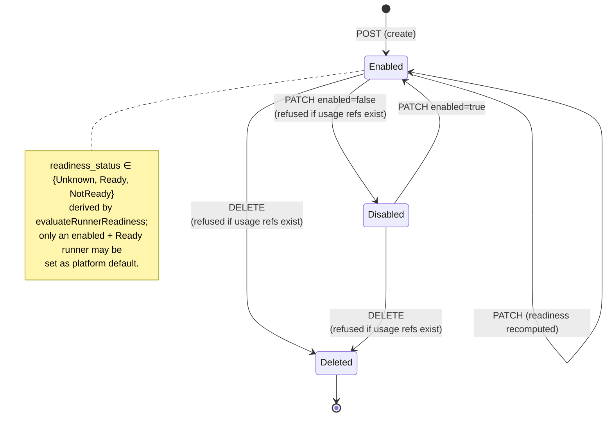
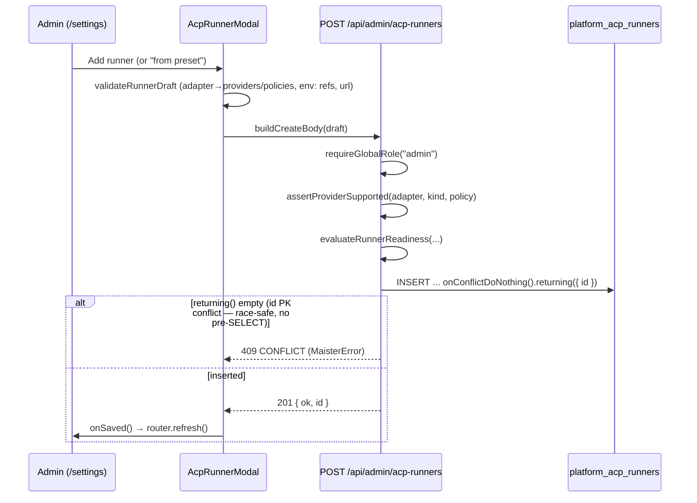
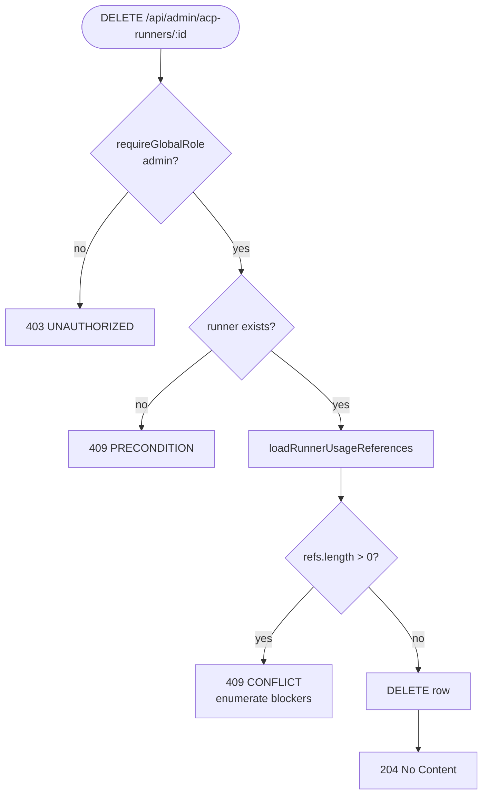

# Platform ACP runner catalog domain

## Purpose

The platform ACP runner catalog is the admin-owned, host-scoped registry of
launchable agent runtimes (`platform_acp_runners`). It answers a single
question: *which adapter + model + provider + permission policy combinations
may a run use on this host?* This domain owns the **CRUD lifecycle** of that
catalog — create, read, update, delete, enable/disable, and platform-default
selection — exposed on the admin-gated `/settings` page. It does NOT own runner
**resolution** at launch (see [executors.md](executors.md)), readiness
**evaluation** (see [readiness.md](readiness.md)), the host-roots/host-tools
surface of the same page (see [instance-config.md](instance-config.md)), or model
**discovery/application** for the `model` field (see
[model-catalog.md](model-catalog.md), ADR-076). The
decision record for the delete guard and the in-`/settings` CRUD surface is
[ADR-065](../decisions.md#adr-065).

## Domain entities

- **`platform_acp_runners`** — one row per runner: `{ id, adapter, capability_agent,
  model, provider (jsonb), permission_policy, sidecar_id?, readiness_status,
  readiness_reasons, enabled, created_at, updated_at }`. Persisted; see
  [db/projects-domain.md](../db/projects-domain.md).
- **`provider`** — discriminated union. Implemented kinds:
  `anthropic | anthropic_compatible | openai | openai_compatible |
  google_gemini | google_vertex | google_gateway | agent_native`.
  Secret material is stored ONLY as `env:NAME` references
  (`^env:[A-Za-z_][A-Za-z0-9_]*$`). See [configuration.md](../configuration.md).
- **Adapter support** — static adapter registry in
  `web/lib/acp-runners/adapter-support.ts`: `claude` → providers `anthropic |
  anthropic_compatible`, policies `default | dangerously_skip_permissions`;
  `codex` → providers `openai | openai_compatible`, policy `default` only;
  `gemini` → Google provider kinds, policy `default`; `opencode` →
  `agent_native`, policy `default`. Gemini/OpenCode are code-owned adapter
  families, not operator-created arbitrary commands.
- **Runner presets** — static templates (`platformRunnerPresetRows()`) offered
  as create-form prefills; not catalog rows until instantiated.
- **`platform_runtime_settings.default_runner_id`** — NOT-NULL FK to a runner
  row (no cascade); the singleton platform default.
- **Usage references** — `loadRunnerUsageReferences()` computes every live and
  historical pointer at a runner (platform/project/flow defaults, flow-step
  remaps, active runs, historical run snapshots, scratch runs). The delete and
  disable guards key on this set.

## Gemini/OpenCode adapter-family contract (Implemented with readiness gates, ADR-084)

Gemini CLI and OpenCode widen the runner catalog without changing its
ownership. They are new adapter families, not a new runner kind.

| Adapter | Provider kinds | Permission policies | Binary contract | Initial readiness |
| --- | --- | --- | --- | --- |
| `gemini` | `google_gemini`, `google_vertex`, `google_gateway` | `default` | `gemini --acp` | `NotReady` until CLI-native auth and SDK initialize/newSession smoke pass |
| `opencode` | `agent_native` | `default` | `opencode acp` | Basic SDK initialize/newSession smoke passed locally; broader permissions/MCP/resume/model gates remain readiness constraints |

Readiness reasons must distinguish these states:

- adapter id unsupported by this build;
- binary missing from PATH;
- explicit binary override path missing or non-executable;
- binary executable but version probe failed;
- binary executable but first-run state directory is not writable;
- provider kind unsupported by adapter;
- explicitly configured auth env ref missing;
- protocol initialize/newSession smoke missing or failed;
- resume/checkpoint strategy unsupported or unproven;
- model application channel unsupported or advisory-only;
- strict capability class unsupported by the resolved adapter.

The admin UI may let operators create disabled Gemini/OpenCode runners before
all smoke gates pass, but it must not allow them as platform default or launch
targets until readiness is `Ready`.

## State machine

A runner row's observable lifecycle. `readiness_status` is recomputed
server-side on every create/update; `enabled` and deletion are explicit admin
actions. (All transitions Implemented.)

## Process flows

### Create (admin → POST)

### Delete guard (admin → DELETE)

## Expectations

- A `platform_acp_runners.id` MUST be unique and match `^[A-Za-z0-9._-]+$`; a
  duplicate-id `POST` MUST return `MaisterError("CONFLICT")` (409), never a raw
  DB unique-violation 500. (Implemented)
- `DELETE /api/admin/acp-runners/{runnerId}` MUST return **204** only when
  `loadRunnerUsageReferences` returns zero references; otherwise it MUST return
  `MaisterError("CONFLICT")` (409) and MUST NOT delete the row. (Implemented)
- The DELETE guard MUST block on ANY usage reference kind — symmetric with the
  `assertCanDisable` guard used for `enabled=false`. (Implemented)
- `DELETE`/`PATCH` against an unknown `runnerId` MUST return
  `MaisterError("PRECONDITION")` (409). (Implemented)
- Every catalog write (`POST`/`PATCH`/`DELETE`) MUST require global role
  `admin`; a non-admin MUST receive 403 before any mutation. (Implemented)
- Secret material MUST persist only as `env:NAME` references; a raw token MUST
  be rejected with `MaisterError("CONFIG")` (422) and MUST NEVER be returned to
  the client or logged. (Implemented)
- `readiness_status`/`readiness_reasons` MUST be computed by
  `evaluateRunnerReadiness` on every `POST`/`PATCH`; caller-provided readiness
  MUST be ignored. (Implemented)
- A runner's `adapter`/`capability_agent` MUST be immutable after creation; the
  `PATCH` body MUST NOT accept an `adapter` field. (Implemented)
- `provider.kind` and `permission_policy` MUST be members of the runner's
  adapter support set; a mismatch MUST be rejected with
  `MaisterError("CONFIG")` (422). (Implemented)
- For `gemini` and `opencode`, readiness MUST remain `NotReady` unless
  diagnostics prove the binary can execute in the supervisor environment and
  the adapter-specific ACP smoke evidence required for the workflow has passed.
  The proof is explicit diagnostics data: `adapter.smoke.status` must be `ok`.
  (Implemented with ADR-078 gates)
- OpenCode installed-but-not-initializable MUST be distinct from OpenCode
  missing: a first-run writable-state failure is a readiness reason, not a raw
  500. (Implemented, ADR-078)
- Gemini `loadSession` MUST NOT satisfy MAIster checkpoint readiness until an
  SDK smoke proves it preserves the checkpoint invariant. (Implemented gate,
  ADR-078)
- Setting `platform_runtime_settings.default_runner_id` MUST target an
  `enabled`, `Ready` runner; otherwise `MaisterError("PRECONDITION")` (409). (Implemented)
- The runner catalog MUST be readable and mutable only from the admin-gated
  `/settings` page, which MUST be reachable from the admin section of
  `web/components/chrome/left-rail.tsx`. (Implemented)
- After any catalog mutation the UI MUST re-fetch authoritative state via
  `router.refresh()` (no optimistic readiness). (Implemented)

## Edge cases

- **Duplicate id on create** → `MaisterError("CONFLICT")` (409) via a race-safe
  insert (`onConflictDoNothing()` + empty `returning()`), never a pre-insert
  `SELECT` — two concurrent POSTs both passing a SELECT would surface a raw
  Postgres `23505` as a 500. See [error-taxonomy.md](../error-taxonomy.md).
- **Delete of a referenced runner** → `MaisterError("CONFLICT")` (409) listing
  the blocking kinds (platform/project/flow default, flow-step remap, active
  run, historical run snapshot, scratch run); the NOT-NULL FK
  `default_runner_id` is a second, DB-level guard for the platform-default case.
- **Unknown runnerId** on PATCH/DELETE → `MaisterError("PRECONDITION")` (409).
- **Adapter/provider/policy mismatch** → `MaisterError("CONFIG")` (422).
- **Raw (non-`env:`) secret** in a provider field → `MaisterError("CONFIG")` (422).
- **Gemini/OpenCode runner created before smoke passes** → row may be saved as
  disabled or `NotReady`, but launch/default selection is refused.
- **OpenCode binary exists but cannot create its state directory** → `NotReady`
  with an operator-visible writable-state reason; no launch attempt.
- **Gemini checkpoint requested before `loadSession` is proven compatible** →
  readiness refusal or `CHECKPOINT`, never a silent `newSession` fallback.
- **Preset prefill referencing a `sidecar_id` absent from the catalog** → the
  create modal falls back to "none" with no error (UI-side, not a server error).

## Linked artifacts

- **API contract:** [`api/web.openapi.yaml`](../api/web.openapi.yaml) —
  `getAdminAcpRunners`, `postAdminAcpRunner`, `patchAdminAcpRunner`,
  `deleteAdminAcpRunner`.
- **Decision:** [ADR-065](../decisions.md#adr-065), [ADR-084](../decisions.md#adr-084-acp-adapter-families-for-gemini-cli-and-opencode).
- **Related domains:** [executors.md](executors.md) (resolution + routing),
  [readiness.md](readiness.md) (readiness evaluation),
  [instance-config.md](instance-config.md) (host roots / host tools on the same
  page), [capability-catalog.md](capability-catalog.md),
  [model-catalog.md](model-catalog.md) (model discovery + application, ADR-076).
  **(Designed, M27)** The platform MCP server admin CRUD (`platform_mcp_servers`
  table, `/api/admin/mcp-servers` routes, settings panel) mirrors this runner
  CRUD pattern precisely — same usage-guard delete, same `onConflictDoNothing`
  duplicate-id protection, same `env:NAME` secret policy, same `admin`-only gate
  (ADR-065 precedent). See [`mcp-management.md`](mcp-management.md).
- **Errors:** [error-taxonomy.md](../error-taxonomy.md) —
  `CONFIG | CONFLICT | PRECONDITION`.
- **Source:** `web/app/api/admin/acp-runners/route.ts`,
  `web/app/api/admin/acp-runners/[runnerId]/route.ts`,
  `web/lib/acp-runners/usage.ts`, `web/lib/acp-runners/runner-form.ts`,
  `web/components/settings/acp-runners-panel.tsx`,
  `web/components/settings/acp-runner-modal.tsx`,
  `web/components/chrome/left-rail.tsx`,
  `web/app/(app)/settings/page.tsx`.
