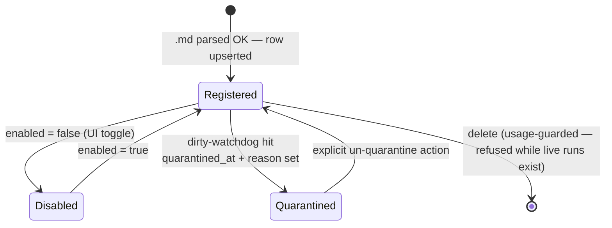
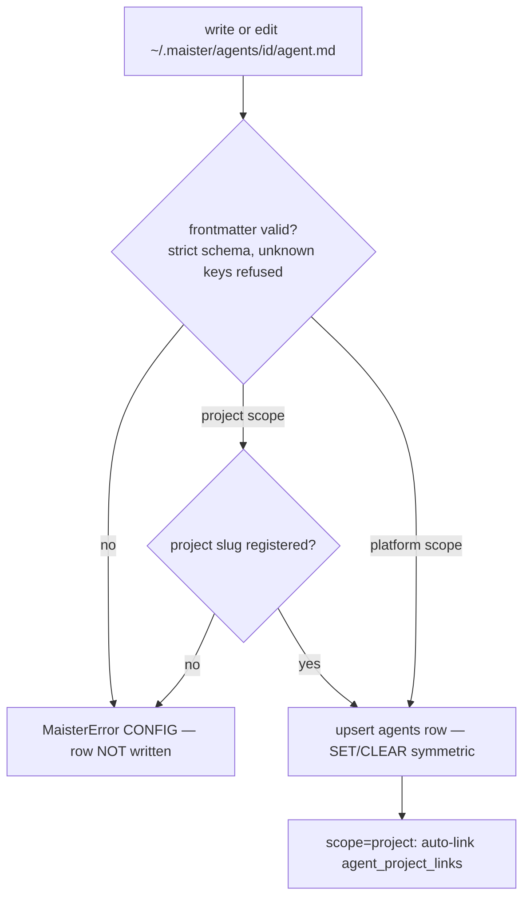
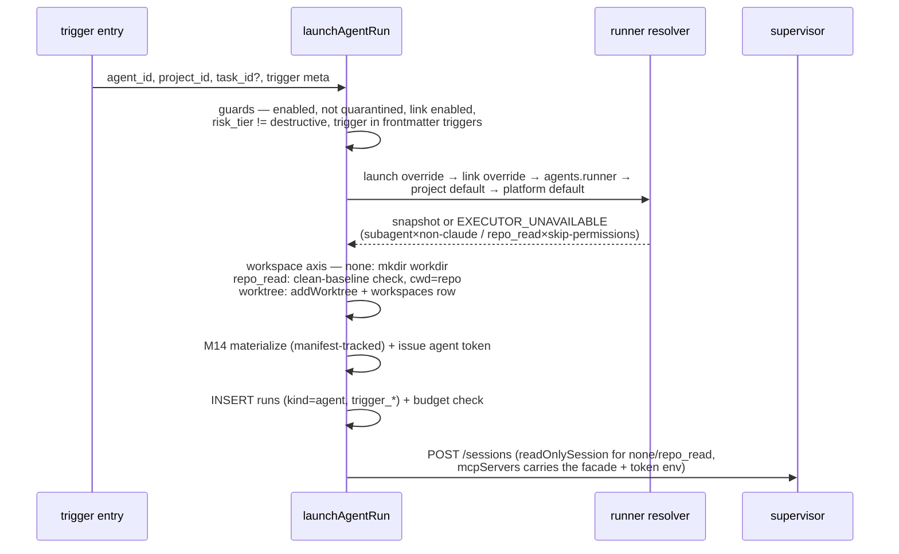
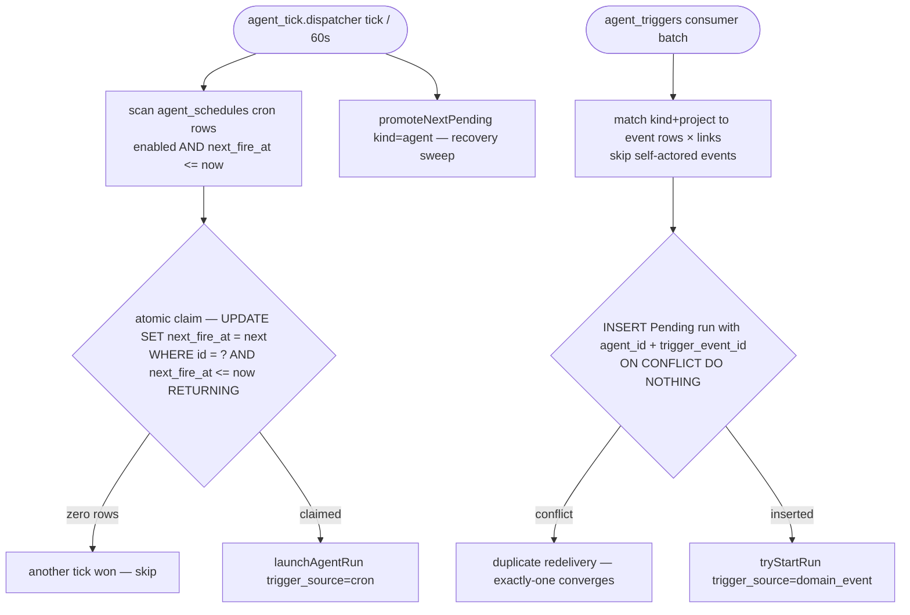
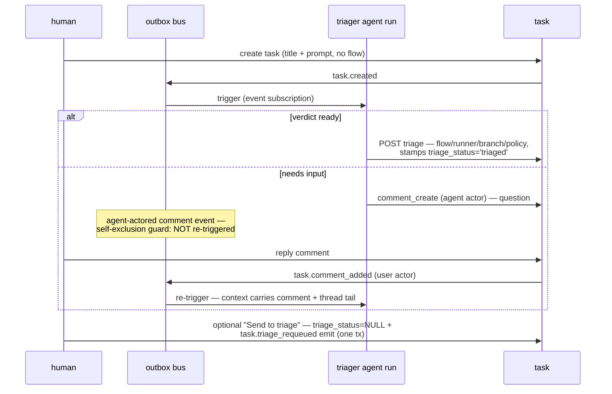
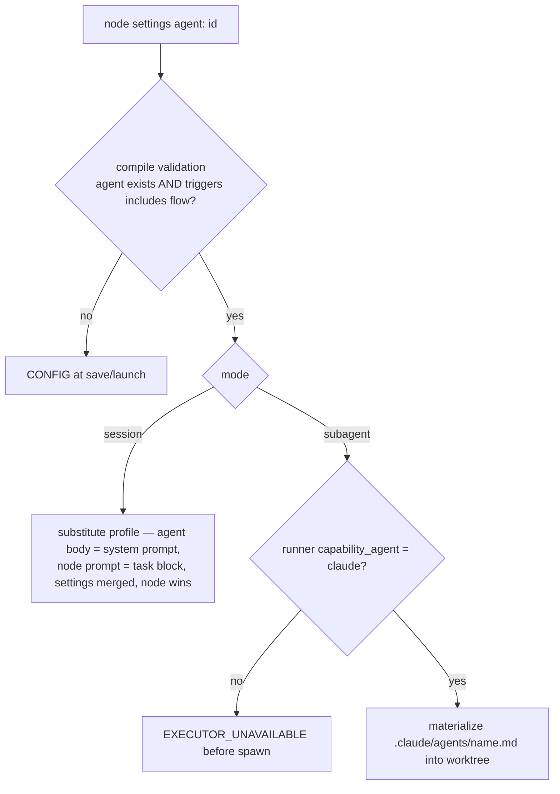
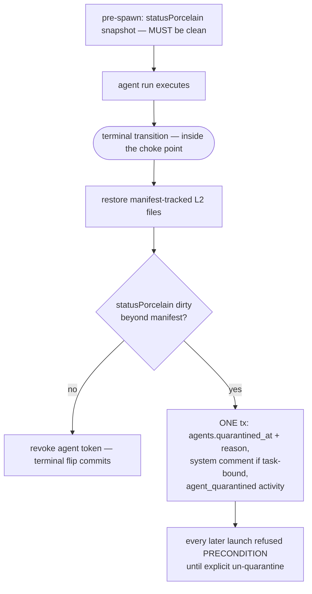

# Platform agents domain

## Purpose

Platform agents (**Implemented**, ADR-089/ADR-090, M34; Stage 3 of the
platform-agents staged design) are first-class `.md`-defined actors — a
triager, reviewers, monitors — registered in a host catalog, attached to
projects, executed as ACP sessions on the existing `runs` substrate under a
separate concurrency budget, and triggered from five sources (manual, cron,
domain event, webhook, flow binding). Boundary: this domain owns the agent
catalog (`agents`, `agent_project_links`), trigger bindings
(`agent_schedules` rework), the agent-run launch path (workspace axis,
runner chain, read-only enforcement, quarantine), agent tokens, and the
triage verdict surface on tasks. It does NOT own the run state machine
([runs.md](runs.md)), the outbox mechanics ([domain-events.md](domain-events.md)),
the social substrate it writes through ([social-board.md](social-board.md)),
the clock ([scheduler.md](scheduler.md)), or capability enforcement
(materialize-only per ADR-041/ADR-043 — [flow-settings.md](flow-settings.md)).

## Domain entities

- **`agents`** (Implemented) — parsed index over the canonical `.md` definition
  at `~/.maister/agents/<id>/agent.md`: `{ id (PK, dir name), scope
  (platform|project), project_id? (NOT NULL iff scope=project), name,
  description, runner_id?, workspace (none|repo_read|worktree), mode
  (session|subagent), triggers jsonb, capability_profile jsonb?, risk_tier
  (read_only|standard|destructive), source_path, enabled, quarantined_at?,
  quarantine_reason? }`. The `.md` is the source of truth; re-registration
  re-syncs every column (SET/CLEAR symmetric). Nothing agent-related lives
  inside project repos. See [db/agents-domain.md](../db/agents-domain.md).
- **`agent_project_links`** (Implemented) — attachment + per-project overrides:
  `{ agent_id, project_id, enabled, runner_override_id? }`,
  `UNIQUE(agent_id, project_id)`. Project-scope agents are auto-linked to
  their bound project at registration.
- **`agent_schedules`** (Implemented rework of the dead M24 table) — trigger
  bindings per (agent, project): `trigger_type='cron'` rows carry
  `cron_expr + timezone + next_fire_at + last_fired_at`;
  `trigger_type='event'` rows carry `event_match.kinds` (subset of the
  ADR-086 taxonomy). `agent_ref` (text), `scheduler_job_id`, and
  `desired_state` are dropped (`continuous` is the future Mγ stage).
- **Agent runs** (Implemented) — `runs` rows with `run_kind='agent'`, nullable
  `agent_id`, `trigger_source (manual|cron|domain_event|webhook|flow)`,
  `trigger_event_id?` (claim key), `trigger_payload?` (≤ 32 KB). Budgeted by
  `MAISTER_MAX_CONCURRENT_AGENTS` (default 3), separate from the
  flow/scratch pool. Task-bound agent runs never flip `tasks.status` and
  never bump `attempt_number`.
- **Agent tokens** (Implemented) — `project_tokens` rows with
  `token_kind='agent'` + `agent_id`, issued per launch with the fixed scope
  set `tasks:read, tasks:triage, comments:read, comments:create,
  relations:read, relations:create, relations:delete`, revoked at the run's
  terminal transition / link detach / GC. Token actor =
  `{ type: 'agent', id: agent_id }` (the ADR-083 pair's first writer).
- **Triage verdict surface** (Implemented) — `tasks.flow_id` nullable
  (simple-intent creation) + verdict columns `runner_id`, `target_branch`,
  `promotion_mode`, `triage_status` (`'triaged'` | NULL); the
  `unconfigured` launchability value; the `task.triage_requeued` emitter.
  See [tasks.md](tasks.md).

## State machine

Agent catalog lifecycle (`agents` row; the agent-run lifecycle is the
standard run FSM in [runs.md](runs.md) — no new run statuses). All
transitions Implemented.

## Process flows

### (a) Registration / re-sync (Implemented)

UI CRUD writes the `.md` into the host catalog, then parses and upserts the
row; a re-sync re-reads the directory. Parsing never executes content.

### (b) Standalone launch (manual / cron / domain_event / webhook share this path) (Implemented)

All four standalone triggers converge on one launch service; only the entry
and the trigger metadata differ.

### (c) Cron + event dispatch (Implemented)

The seeded singleton `agent_tick.dispatcher` job (60 s) claims due cron rows
atomically; the `agent_triggers` outbox consumer claims event matches by
run-row insert. Both recover stranded `Pending` agent runs via
`promoteNextPending(kind='agent')` on the tick.

### (d) Triage Q&A loop (Implemented)

The triager converges over several turns by asking questions as ordinary
task comments; structural loop-termination is the self-exclusion guard.

### (e) Flow binding (Implemented)

`agent: <id>` on an `ai_coding` node (engine ≥ 1.5.0) resolves the catalog
profile at compile/launch; execution stays inside the flow run's session —
no separate agent-run row in this stage.

### (f) Dirty-watchdog + quarantine (Implemented)

For `none`/`repo_read` runs the no-write invariant is verified at the
terminal transition, inside the terminal choke point.

## Expectations

- Registration MUST refuse an invalid definition with `MaisterError("CONFIG")`
  without writing or updating the `agents` row, and MUST never execute
  definition content.
- Re-registration MUST sync every parsed frontmatter field with SET/CLEAR
  symmetry: a removed field resets its column to the default.
- A standalone launch MUST resolve the runner through exactly
  `launchOverride → link override → agents.runner_id → project default →
  platform default`, and MUST refuse `mode=subagent` on a non-`claude`
  capability runner and `workspace ∈ {none, repo_read}` on
  `permission_policy=dangerously_skip_permissions` with
  `EXECUTOR_UNAVAILABLE` before spawn.
- `run_kind='agent'` runs MUST be admitted only by the
  `MAISTER_MAX_CONCURRENT_AGENTS` budget (default 3) and MUST NOT consume
  `flow`/`scratch` slots; each pool promotes its own `Pending` FIFO.
- An event-triggered spawn MUST claim by inserting the `Pending` run with
  `(agent_id, trigger_event_id)` under the partial UNIQUE index; duplicate
  redelivery MUST converge to exactly one run.
- The `agent_triggers` consumer MUST skip an event whose
  `(actor_type, actor_id)` equals `('agent', <matched agent id>)` —
  the triager's own comments never re-trigger it.
- A cron fire MUST be claimed by the atomic
  `UPDATE … SET next_fire_at = <next> WHERE id = ? AND next_fire_at <=
  now() RETURNING` with exactly one winner; a missed window fires once and
  never backfills.
- A `repo_read` launch MUST require an empty `statusPorcelain(repo_path)`
  baseline (`PRECONDITION` otherwise); `none`/`repo_read` runs MUST create
  no `workspaces` row and no git worktree.
- A `readOnlySession` session MUST auto-deny write-class permission
  requests, auto-approve only the read-safe allow-list, and MUST create no
  `hitl_requests` rows.
- The dirty-watchdog and the agent-token revoke MUST run inside the terminal
  choke point with no `runs` writes after the terminal flip; a
  beyond-manifest dirty result MUST quarantine in ONE transaction
  (`agents.quarantined_at` + system comment when task-bound +
  `agent_quarantined` activity).
- Disabled, quarantined, or `risk_tier='destructive'` (while ADR-041 stays
  blocked) agents MUST be refused with `PRECONDITION` at every launch entry
  point: manual, cron, domain_event, webhook, flow binding.
- Agent tokens MUST be per-launch ephemeral with exactly the fixed scope
  set, revoked at terminal/detach/GC; the token value MUST never be logged,
  streamed, or client-visible, and token-derived writes MUST carry the
  `{ type: 'agent', id }` actor with `token_audit_log.actor_label =
  'agent:<id>'`.

## Edge cases

- **Invalid frontmatter / unknown project slug / id collision** →
  `MaisterError("CONFIG")` at registration; the catalog row is untouched.
- **Runner tier resolves to missing/disabled/not-ready runner, or an
  incompatibility rule fires** → `MaisterError("EXECUTOR_UNAVAILABLE")`
  before spawn; no run row.
- **Agent budget full** → run enters `Pending` with a per-kind queue
  position; the flow pool is unaffected (ADR-089).
- **Crash between claim and spawn** (cron claim committed or event run row
  inserted, process dies) → the run row is `Pending`;
  `promoteNextPending(kind='agent')` on the next `agent_tick.dispatcher`
  tick recovers it. A cron claim that died before the run INSERT is a lost
  fire (claim + insert share one transaction, so the window is the post-commit
  spawn only).
- **Human edits the parent checkout during a `repo_read` run** → possible
  false-positive quarantine (`MaisterError("PRECONDITION")` on later
  launches); accepted per ADR-090 — reason recorded, un-quarantine is one
  click, and the clean-baseline precondition keeps the window small.
- **Agent crash with L2 files materialized in the parent checkout** → the
  manifest makes the terminal-sweep restore idempotent; files are deny-rule
  content, never user data.
- **Webhook body over 32 KB or invalid JSON** → rejected at the boundary
  (422); no run row.
- **Launch attempt on an `unconfigured` (flowless) task** →
  `MaisterError("PRECONDITION")`; the run-schedules dispatcher records
  `skipped_unconfigured`; the board popover collects the missing fields.
- **Delete agent while live runs exist** → refused (usage guard), mirroring
  runner-catalog delete semantics.

## Linked artifacts

- **Decisions:** [ADR-089](../decisions.md#adr-089-platform-agent-catalog-with-per-agent-runner-and-a-five-source-trigger-model),
  [ADR-090](../decisions.md#adr-090-agent-workspace-axis-with-three-layer-read-only-enforcement-and-quarantine);
  boundary kept from ADR-041/ADR-043 (materialize-only).
- **Vision record:** [`../pv/agents-as-environment-actors.md`](../pv/agents-as-environment-actors.md)
  (Stage-0 brainstorm; superseded by ADR-089/088 with three amendments).
- **DB:** [`db/agents-domain.md`](../db/agents-domain.md),
  [`db/runs-domain.md`](../db/runs-domain.md),
  [`database-schema.md`](../database-schema.md) (migrations `0049`/`0050`).
- **Triggers:** [`scheduler.md`](scheduler.md) (`agent_tick.dispatcher`),
  [`domain-events.md`](domain-events.md) (`agent_triggers` consumer,
  `task.triage_requeued` emitter), [`run-schedules.md`](run-schedules.md)
  (`skipped_unconfigured`).
- **Tasks surface:** [`tasks.md`](tasks.md) (simple-intent creation, verdict
  columns, `unconfigured`, card pre-launch editing).
- **External surface:** [`external-operations.md`](external-operations.md)
  (triage + relations ops, agent tokens, MCP tools) and
  [`../api/external/operations.openapi.yaml`](../api/external/operations.openapi.yaml).
- **HTTP:** [`../api/web.openapi.yaml`](../api/web.openapi.yaml) (admin
  agents CRUD, launch, webhook event route, run DTO fields);
  [`../api/supervisor.openapi.yaml`](../api/supervisor.openapi.yaml)
  (`readOnlySession`).
- **Flow binding:** [`flow-graph.md`](flow-graph.md) +
  [`../flow-dsl.md`](../flow-dsl.md) (`agent:` node field, engine `1.5.0`).
- **Source (Implemented):** `web/lib/agents/*` (`definition.ts`, `registry.ts`,
  `launch.ts`, `dirty-watchdog.ts`, `triggers.ts`),
  `web/lib/scheduler/handlers/agent-tick.ts`,
  `web/lib/domain-events/consumers.ts` (`agent_triggers`),
  `supervisor/src/*` (`readOnlySession`).
