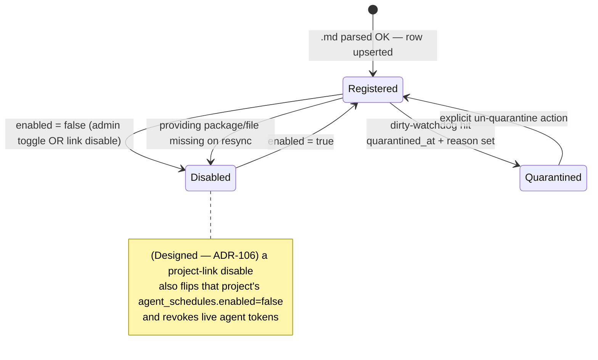
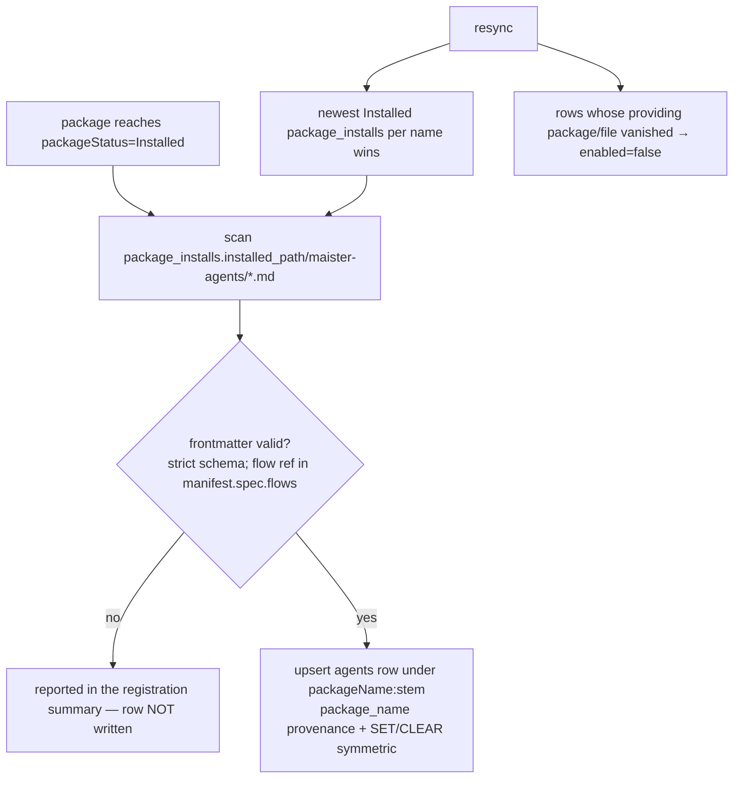
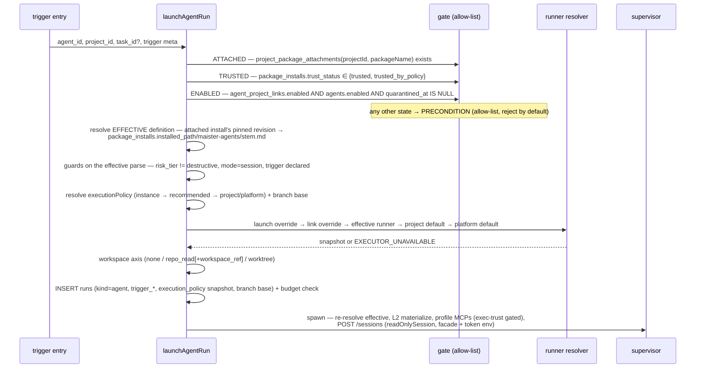
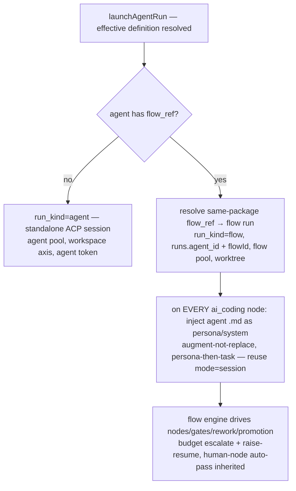
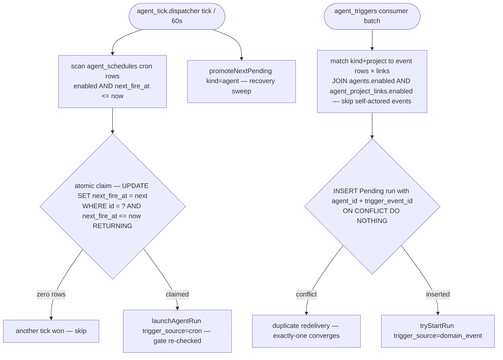
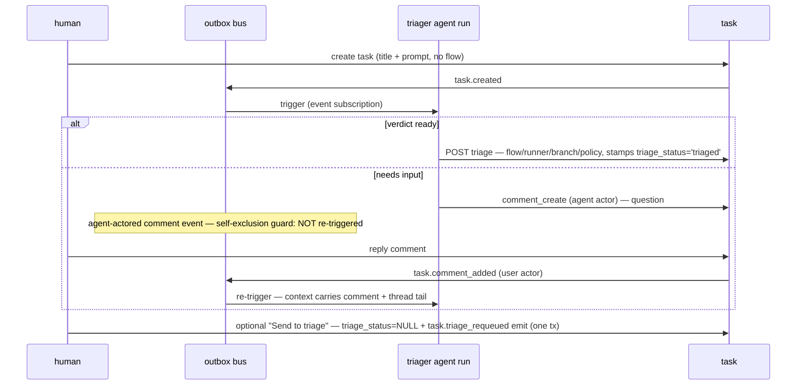
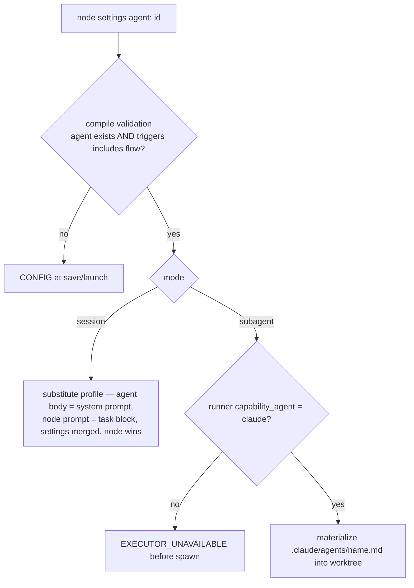
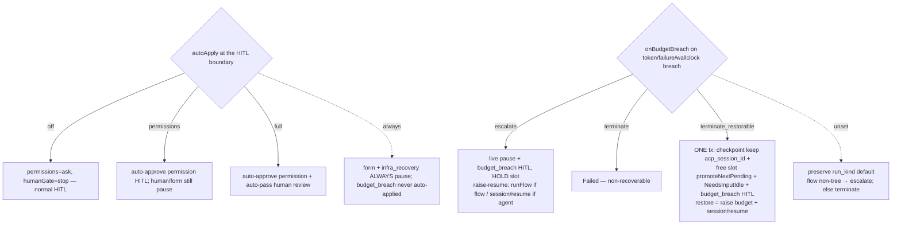
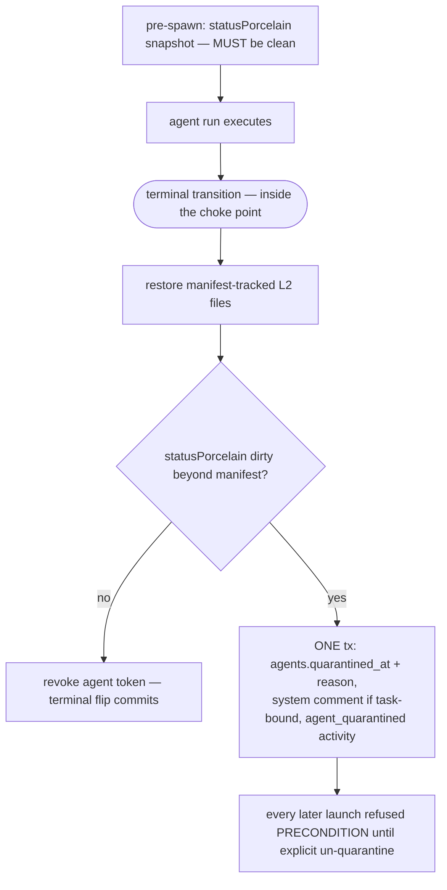

# Platform agents domain

## Purpose

Platform agents (M34, ADR-089/090) are first-class `.md`-defined actors — a
triager, reviewers, monitors, coders — shipped as `maister-agents/<stem>.md`
files INSIDE flow packages (same trust contour, versioning, and Studio authoring
path), projected into a platform catalog, attached to projects, executed on the
existing `runs` substrate, and triggered from five sources (manual, cron, domain
event, webhook, flow binding). Boundary: this domain owns the agent catalog
(`agents`, `agent_project_links`), trigger bindings (`agent_schedules`), the
agent-run launch path (per-project effective-definition resolution, workspace
axis, runner chain, read-only enforcement, quarantine), the per-agent runner
policy, agent tokens, and the triage verdict surface on tasks. It does NOT own
the run state machine ([runs.md](runs.md)), the execution-policy axis model
([execution-policy.md](execution-policy.md)), the budget terminal path
([execution-policy.md](execution-policy.md) + ADR-101/102), the outbox mechanics
([domain-events.md](domain-events.md)), the social substrate it writes through
([social-board.md](social-board.md)), the clock ([scheduler.md](scheduler.md)),
or capability enforcement (materialize-only per ADR-041/043 —
[flow-settings.md](flow-settings.md)).

**Status convention.** M39 (ADR-106) re-keys agent identity from per-flow to
**per-package** and adds optional same-package flow enrichment, a per-agent
runner policy, branch base, and trigger-toggle coupling. Those pieces are tagged
**(Designed — ADR-106)** below: they are the Phase-0 contract the M39 code phases
implement. At this branch's Phase-0 HEAD the runtime still runs the M34 **per-flow**
model (id `<flowRefId>:<stem>`, registration scanning `flow_revisions.installed_path`)
— tagged **(Implemented)** where it differs. The unchanged mechanics (workspace
axis, dirty-watchdog, agent tokens, triage loop, cron/event dispatch) stay
**(Implemented)**.

**Platform agents vs Claude subagents — two kinds.** A package's `.md` agents
split into package-root `maister-agents/<stem>.md` (**platform-agent**
definitions — strict frontmatter, rich view + structural editor, catalogued) and
`capability/**/agents/*.md` (**Claude subagents** — lenient + open frontmatter,
materialized into the run's `.claude/agents/` at launch, NOT catalogued). The
subagent schema types the known Claude-Code fields
(`name`/`description`/`tools`/`model`/`color`) AND preserves unknown/custom keys as
passthrough (contrast the strict platform-agent schema, where unknown → `CONFIG`);
the New-Subagent template uses `model: inherit` with `tools` omitted.

**Canonical platform-agent directory (M39 Stream A — Implemented, ADR-105).** The
registry/effective-definition/lifecycle read paths converged onto package-root
`maister-agents/<stem>.md` — the same directory the Studio viewer/BOM/attach read.
Root `agents/` is no longer a platform-agent location (existing `agents/`-shipping
packages break — owner-accepted). Subagents keep `capability/<id>/agents/` and are
a distinct first-class authored `subagent` kind (path-distinguishable by depth;
LENIENT schema — `lib/agents/subagent-definition.ts`).

**Package identity & gating (Designed — ADR-106).** The catalog row's provenance
is `package_name` (= `package_installs.name`), the id is `<packageName>:<stem>`,
and the EFFECTIVE definition for a launch in project P resolves through P's
ATTACHED install of that package → `package_installs.installed_path/maister-agents/<stem>.md`.
The launch gate is the three-term allow-list **attached + trusted + enabled**
(below). This closes the F4 split: under M34 a package-root agent was registered
per-flow against `flow_revisions.installed_path` (a per-flow cache subdir that did
not contain the package-root `maister-agents/`).

## Domain entities

- **`agents`** (Implemented; M39 deltas Designed) — catalog projection over
  `maister-agents/<stem>.md` inside the providing package's NEWEST Installed
  revision: `{ id (PK, package-qualified <packageName>:<stem>), package_name
  (NOT NULL — was flow_ref_id), version_label, origin (git|authored), name,
  description, runner_id?, workspace (none|repo_read|worktree), workspace_ref?,
  mode (session|subagent), triggers jsonb, capability_profile jsonb?, risk_tier
  (read_only|standard|destructive), recommended jsonb? (extended with
  executionPolicy), flow_ref? (NEW — same-package flow id), branch_base? (NEW),
  source_path, enabled, quarantined_at?, quarantine_reason? }`. Index
  `agents_package_name_idx` (was `agents_flow_ref_idx`). The package file is the
  source of truth; registration after install finalize (and `resync`) re-syncs
  every column (SET/CLEAR symmetric); rows whose providing package vanished are
  disabled, never deleted. See [db/agents-domain.md](../db/agents-domain.md).
- **`agent_project_links`** (Implemented; M39 deltas Designed) — attachment +
  per-project INSTANCE overrides: `{ agent_id, project_id, enabled,
  runner_override_id?, branch_base? (NEW), execution_policy_override? jsonb (NEW)
  }`, `UNIQUE(agent_id, project_id)`. Attach requires the providing package
  attached+trusted in the project; the attach panel pre-fills from the
  definition's `recommended` block. The instance row overrides EVERY policy field
  (runner, branch base, autoApply, onBudgetBreach).
- **`agent_schedules`** (Implemented) — trigger bindings per (agent, project):
  `trigger_type='cron'` rows carry `cron_expr + timezone + next_fire_at +
  last_fired_at`; `trigger_type='event'` rows carry `event_match.kinds` (subset of
  the ADR-086 taxonomy). Created/replaced only through the project-link
  `schedules` patch (delete-all-then-reinsert), seeded in the UI from
  `recommended`. (Designed — ADR-106) An agent disable cascades `enabled=false`
  onto these rows.
- **Per-agent runner policy** (Designed — ADR-106) — `recommended.executionPolicy:
  { autoApply?: 'off'|'permissions'|'full'; onBudgetBreach?:
  'escalate'|'terminate'|'terminate_restorable' }` SEEDS the defaults; the
  instance (`agent_project_links.execution_policy_override`) overrides. Resolved
  and snapshotted onto `runs.execution_policy` at spawn — a projection over the
  rich `ExecutionPolicy` axis model ([execution-policy.md](execution-policy.md)).
- **Agent runs** (Implemented) — `runs` rows with `run_kind='agent'`, nullable
  `agent_id`, `trigger_source (manual|cron|domain_event|webhook|flow)`,
  `trigger_event_id?` (claim key), `trigger_payload?` (≤ 32 KB). Budgeted by
  `MAISTER_MAX_CONCURRENT_AGENTS` (default 3), separate from the flow/scratch pool.
  (Designed — ADR-106) A with-`flow_ref` launch produces a `run_kind='flow'` run
  carrying `runs.agent_id` (the persona + policy source) — NOT a `run_kind='agent'`
  run. Task-bound agent runs never flip `tasks.status` and never bump
  `attempt_number`.
- **Agent tokens** (Implemented) — `project_tokens` rows with `token_kind='agent'`
  + `agent_id`, issued per launch with the fixed scope set `tasks:read,
  tasks:triage, comments:read, comments:create, relations:read, relations:create,
  relations:delete`, revoked at terminal / link detach / link disable / GC. Token
  actor = `{ type: 'agent', id: agent_id }`.
- **Triage verdict surface** (Implemented) — `tasks.flow_id` nullable +
  verdict columns; the `unconfigured` launchability value; the
  `task.triage_requeued` emitter. See [tasks.md](tasks.md).

## State machine

Agent catalog lifecycle (`agents` row; the agent-run lifecycle is the standard run
FSM in [runs.md](runs.md) — no new run statuses).

## Process flows

### (a) Registration / re-sync — per package (Designed — ADR-106; supersedes the M34 per-flow scan)

Definitions ship inside flow packages; package-level registration runs at the end
of `installPackageRevision` AFTER the member flow installs, scanning the PACKAGE
ROOT `maister-agents/` dir and projecting one catalog row per file under
`<packageName>:<stem>`. Parsing never executes content; invalid files are
reported, never written.

### (b) Standalone launch (manual / cron / domain_event / webhook share this path) (Implemented; gating + policy snapshot Designed — ADR-106)

The four standalone triggers converge on one launch service; only the entry and
trigger metadata differ. The launch gate is the **attached + trusted + enabled**
allow-list, resolved against the project's ATTACHED package install.

### (c) Optional-flow enrichment — "agent drives a flow" (Designed — ADR-106)

When the effective agent declares a same-package `flow_ref`, launch branches on
the discriminant BEFORE routing: it launches that flow as a normal **flow run**
(`run_kind='flow'`, flow pool, worktree, the flow engine drives nodes/gates/
rework/promotion) carrying `runs.agent_id` (the persona + policy source) +
`flowId`, and injects the agent's `.md` body as the persona/system layer on EVERY
`ai_coding` node — augment, not replace (the node keeps its own task prompt; order
persona-then-task), reusing the `mode=session` flow-binding injection across all
nodes. Without `flow_ref` the launch is the standalone `run_kind='agent'` ACP
session of flow (b).

### (d) Cron + event dispatch (Implemented; disable-coupling Designed — ADR-106)

The seeded singleton `agent_tick.dispatcher` job (60 s) claims due cron rows
atomically; the `agent_triggers` outbox consumer claims event matches by run-row
insert. Both recover stranded `Pending` agent runs via
`promoteNextPending(kind='agent')` on the tick.

### (e) Triage Q&A loop (Implemented)

The triager converges over several turns by asking questions as ordinary task
comments; structural loop-termination is the self-exclusion guard.

### (f) Per-node flow binding (Implemented)

`agent: <id>` on an `ai_coding` node (engine ≥ 1.5.0) resolves the catalog profile
at compile/launch; execution stays inside the flow run's session — no separate
agent-run row. (Distinct from (c): there the AGENT declares its own flow; here a
flow NODE binds one agent for that node.)

### (g) Runner policy: auto-apply + budget breach (Designed — ADR-106)

The agent's effective `executionPolicy` (instance override → `recommended` →
project/platform default) is snapshotted onto `runs.execution_policy` at spawn, a
projection over the rich axis model. `autoApply` drives the HITL boundary;
`onBudgetBreach` drives the budget terminal path
([execution-policy.md](execution-policy.md), `keepalive-sweeper.ts`).

### (h) Dirty-watchdog + quarantine (Implemented)

For `none`/`repo_read` runs the no-write invariant is verified at the terminal
transition, inside the terminal choke point.

### (i) Subagent materialization for scratch (Designed — FR-C4)

Today subagent `.md` materialization happens only for flow-bound `subagent` nodes
(flow (f) calls `resolveFlowBoundAgent`). The Unified Capability Composer extracts
that write into a shared materialize step and invokes it for scratch runs too — so
a claude scratch session surfaces the project's coder subagents as `@<name>`
references alongside skills. Claude-only by descriptor (codex omits subagent
files; references stay advisory-only). Materialization is part of the staged
launch and is cleaned up with the worktree/session on a failed launch.

## Expectations

- Identity MUST be package-qualified `<packageName>:<stem>` (packageName =
  `package_installs.name`); registration MUST scan
  `package_installs.installed_path/maister-agents/*.md`, project once per package,
  never execute `.md` content, and never write an invalid definition. *(Designed —
  ADR-106; HEAD: per-flow `<flowRefId>:<stem>`.)*
- Re-registration MUST sync every parsed column with SET/CLEAR symmetry;
  `resyncAgents` MUST project the newest Installed `package_installs` per `name`
  and disable (never delete) rows whose providing package or file vanished.
- An agent's `flow` MUST be a member of `package_installs.manifest.spec.flows[].id`
  or be reported invalid + never written; a later upgrade that removes it MUST
  re-flag on resync so launch refuses `PRECONDITION`. *(Designed — ADR-106.)*
- A launch MUST pass the allow-list — package ATTACHED
  (`project_package_attachments` for `(projectId, packageName)`) + install TRUSTED
  (`package_installs.trust_status ∈ {trusted, trusted_by_policy}`) + agent ENABLED
  (`agent_project_links.enabled` AND `agents.enabled` AND `quarantined_at IS
  NULL`) — any other state refused `PRECONDITION`. *(Designed — ADR-106.)*
- The EFFECTIVE definition MUST resolve through the attached install's pinned
  revision → `package_installs.installed_path/maister-agents/<stem>.md`, at launch
  and again at spawn; `projectId` MUST be server-derived, never a body field.
- Launch MUST branch on has-`flow_ref`: no flow → `run_kind='agent'` (standalone
  ACP session, `MAISTER_MAX_CONCURRENT_AGENTS` pool); flow → `run_kind='flow'`
  (the same-package flow run, `runs.agent_id` + `flowId`, the agent `.md` injected
  on EVERY `ai_coding` node, augment-not-replace, persona-then-task). *(Designed —
  ADR-106.)*
- The effective `executionPolicy` MUST resolve instance override → agent
  `recommended` → project/platform default and snapshot onto `runs.execution_policy`
  at spawn; the HITL and budget-terminal paths MUST read the snapshot, never
  re-derive from the catalog. *(Designed — ADR-106.)*
- `autoApply` MUST map to the `permissions`/`humanGate` axes (off → ask/stop;
  permissions → auto_approve/stop; full → auto_approve/auto_pass); `form` and
  `infra_recovery` HITL MUST always pause, and `budget_breach` MUST never be
  auto-applied. *(Designed — ADR-106.)*
- `onBudgetBreach` MUST drive the budget terminal — `escalate` = live pause + hold
  slot (raise-resume `runFlow` for flow, `session/resume` for agent); `terminate`
  → `Failed`; `terminate_restorable` → ONE-tx checkpoint + free slot +
  `NeedsInputIdle` + `budget_breach` HITL, restore = raise + `session/resume`;
  UNSET MUST preserve the run_kind default. *(Designed — ADR-106.)*
- `branch_base` MUST resolve `agent_project_links.branch_base` →
  `recommended.branch_base` → the project main branch, and snapshot onto the run
  at launch. *(Designed — ADR-106.)*
- Disabling an agent's project link MUST disable its `agent_schedules` rows AND
  revoke live agent tokens; enabling MUST re-enable the schedules but NOT the
  revoked ephemeral tokens. *(Designed — ADR-106.)*
- A cron fire MUST be claimed by the atomic `UPDATE … SET next_fire_at = <next>
  WHERE id = ? AND next_fire_at <= now() RETURNING` (one winner, no backfill); an
  event spawn MUST claim by inserting the `Pending` run with `(agent_id,
  trigger_event_id)` under the partial UNIQUE index (duplicate redelivery
  converges to one); the `agent_triggers` consumer MUST skip an event whose
  `(actor_type, actor_id)` equals the matched agent.
- A `none`/`repo_read` run MUST require a clean `statusPorcelain` baseline
  (`PRECONDITION` otherwise) unless `workspace_ref` resolves; the `readOnlySession`
  MUST auto-deny write-class permissions and create no `hitl_requests`; the
  dirty-watchdog + token revoke MUST run inside the terminal choke point with no
  `runs` writes after the terminal flip; agent tokens MUST stay per-launch
  ephemeral with the fixed scope set and the `{type:'agent', id}` actor, never
  logged/streamed/client-visible.

## Edge cases

- **Invalid frontmatter (incl. the dead `scope`/`project` keys, or a `flow` not in
  the package manifest)** → reported in the registration summary; the catalog row
  is untouched. Id collisions are impossible by construction (package-qualified).
- **Providing package not attached/trusted in the project, or the agent disabled/
  quarantined, or the pinned version missing the agent file** →
  `MaisterError("PRECONDITION")` at launch (the allow-list).
- **A package upgrade removes an agent's referenced `flow_ref`** → resync re-flags
  the agent invalid; a with-flow launch refuses `PRECONDITION`.
- **`workspace_ref` unresolvable (unknown branch, payload without `branch`/`ref`,
  non-`run.*` event, cron/manual trigger)** → `MaisterError("PRECONDITION")` at
  launch — no auto-fetch in v1.
- **Runner tier resolves to a missing/disabled/not-ready runner, or an
  incompatibility rule fires** → `MaisterError("EXECUTOR_UNAVAILABLE")` before
  spawn; no run row.
- **Budget breach with `onBudgetBreach='terminate_restorable'`** → the run lands in
  the recoverable `NeedsInputIdle` (NOT `Failed`), its slot frees (a queued run
  promotes), and a budget raise + `session/resume` restores it. *(Designed —
  ADR-106.)*
- **Agent budget full** → run enters `Pending` with a per-kind queue position; the
  flow pool is unaffected.
- **Crash between claim and spawn** → the run row is `Pending`;
  `promoteNextPending(kind='agent')` on the next tick recovers it.
- **Human edits the parent checkout during a `repo_read` run** → possible
  false-positive quarantine; accepted per ADR-090 (reason recorded, un-quarantine
  is one click).
- **Providing package removed from the cache** → `resync` disables the catalog rows
  (attachments and run history keep their FK anchor); there is no agent delete
  endpoint — definitions leave through their package.

## Linked artifacts

- **Decisions:** [ADR-089](../decisions.md#adr-089-platform-agent-catalog-with-per-agent-runner-and-a-five-source-trigger-model),
  [ADR-090](../decisions.md#adr-090-agent-workspace-axis-with-three-layer-read-only-enforcement-and-quarantine),
  [ADR-106](../decisions.md#adr-106-package-based-platform-agents--package-identity-attachment-gating-optional-flow-enrichment-and-per-agent-runner-policy)
  (package identity, gating, optional-flow, runner policy); boundary kept from
  ADR-041/043 (materialize-only); policy axes ADR-095/101/102.
- **DB:** [`db/agents-domain.md`](../db/agents-domain.md),
  [`db/runs-domain.md`](../db/runs-domain.md),
  [`database-schema.md`](../database-schema.md) (migrations `0049`/`0050`/`0062`).
- **Execution policy:** [`execution-policy.md`](execution-policy.md) (preset + axis
  model, budget terminal path, `*FromSnapshot` resolvers).
- **Triggers:** [`scheduler.md`](scheduler.md) (`agent_tick.dispatcher`),
  [`domain-events.md`](domain-events.md) (`agent_triggers` consumer,
  `task.triage_requeued` emitter), [`run-schedules.md`](run-schedules.md).
- **Tasks surface:** [`tasks.md`](tasks.md) (simple-intent creation, verdict
  columns, `unconfigured`, card pre-launch editing).
- **External surface:** [`external-operations.md`](external-operations.md) (triage
  + relations ops, agent tokens, MCP tools).
- **HTTP:** [`../api/web.openapi.yaml`](../api/web.openapi.yaml) (admin catalog
  list/read/toggle/un-quarantine/resync, project attach/enable/launch, webhook
  event route, run DTO fields);
  [`../api/supervisor.openapi.yaml`](../api/supervisor.openapi.yaml)
  (`readOnlySession`).
- **Flow binding + agent frontmatter:** [`flow-graph.md`](flow-graph.md) +
  [`../flow-dsl.md`](../flow-dsl.md) (`agent:` node field; agent `.md` frontmatter
  `flow`/`branch_base`/`recommended.executionPolicy`, engine `1.5.0`).
- **Screen:** [`../screens/projects/project-settings-agents.md`](../screens/projects/project-settings-agents.md)
  (project-settings Agents panel — attach/enable, triggers, runner override,
  autoApply/onBudgetBreach, branch base).
- **Source (Implemented):** `web/lib/agents/*` (`definition.ts`, `registry.ts`,
  `effective.ts`, `launch.ts`, `flow-binding.ts`, `project-links.ts`,
  `triggers.ts`, `dirty-watchdog.ts`, `tokens.ts`),
  `web/lib/packages/attach.ts` (registration wiring, Designed — ADR-106),
  `web/lib/runs/keepalive-sweeper.ts` (budget terminal),
  `web/lib/scheduler/handlers/agent-tick.ts`, `web/lib/domain-events/consumers.ts`.
