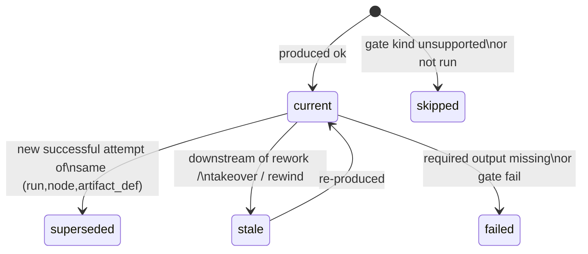
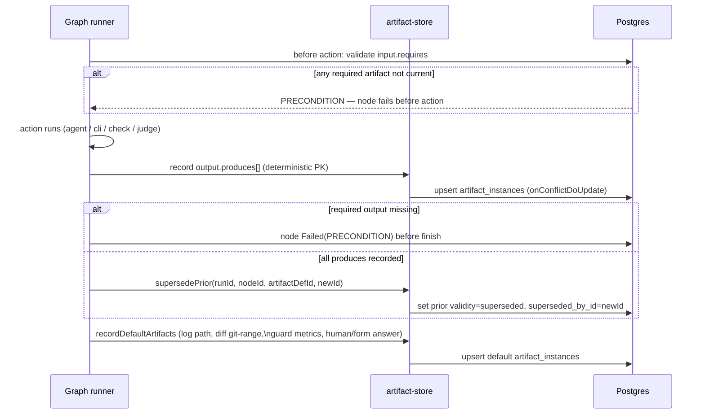
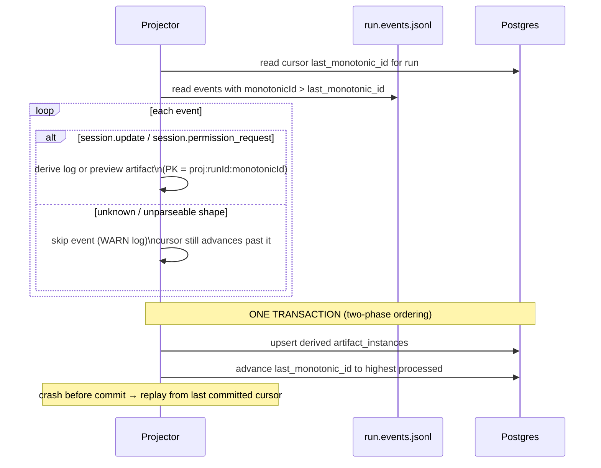
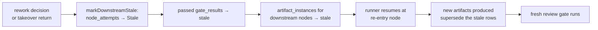
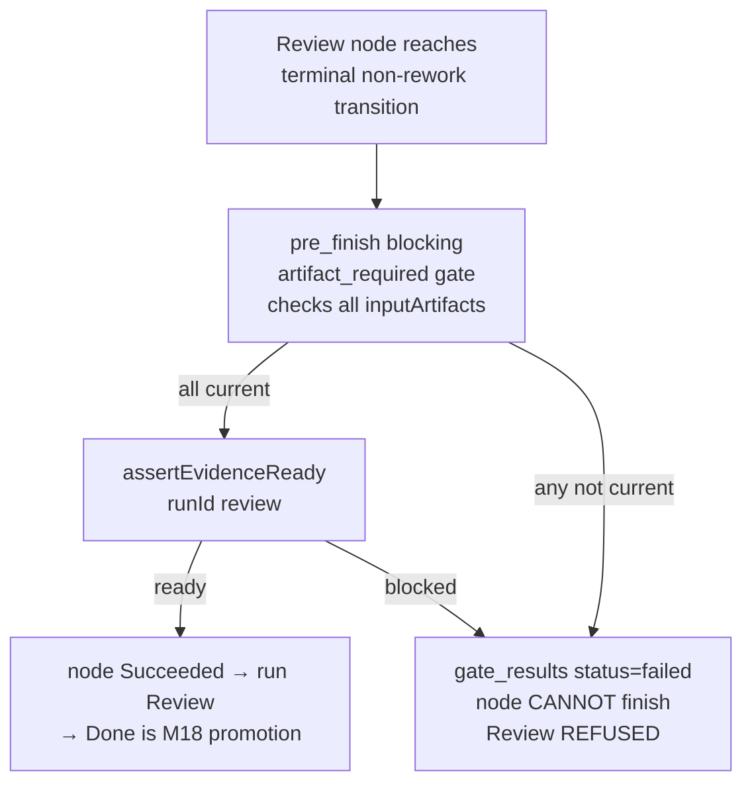
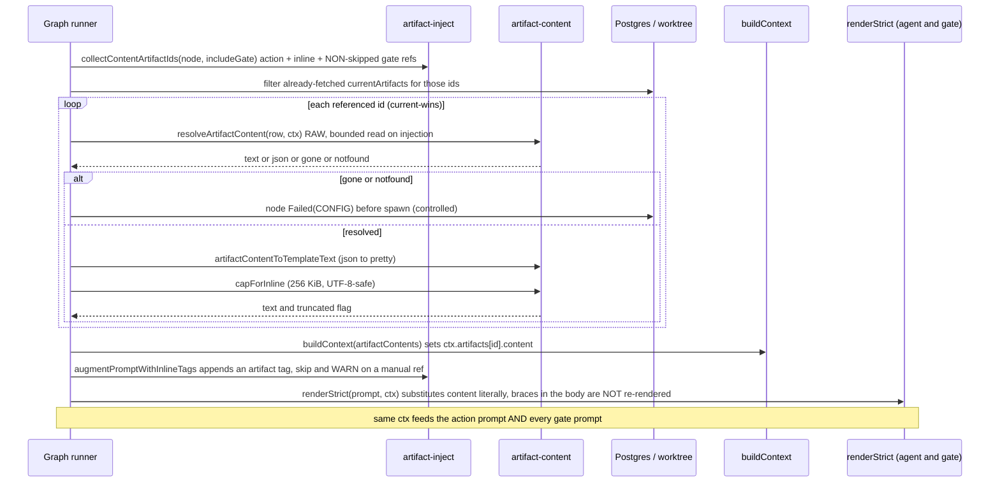

# Typed artifacts and evidence graph (M12)

> **Status: Implemented (M12), as of 2026-06-02.** The artifact model, validity
> FSM, runner-inline recording, the ADR-022 projector, the read-only API routes,
> and the evidence-graph explorer all shipped across Phases 1–8 and are reconciled
> as-built here (Phase 9, T9.1). Tags below tagged `(M14 …)`/`(Designed)` refer to
> later scope (capability enforcement of `visibility`/`retention`) and remain
> unbuilt.

## Purpose

This domain covers how Flow runs produce, track, and gate on **typed evidence**:
structured metadata records (`artifact_instances`) pointing at payloads on
disk, in git, or inline in the DB. Artifacts make the evidence behind a run
visible and queryable without re-reading the worktree. The review-approval path
is blocked until all required evidence is present and `current`. The
evidence-graph explorer in the run-detail UI renders the full provenance chain
from task input through node attempts to artifacts, gates, and the review
decision.

Domain boundary: the artifact write paths (runner-inline + ADR-022 projector),
the validity lifecycle, the read-only evidence API, and the review-refusal
mechanism. The **promotion artifact** (M18) is in scope here as a *recorded
output* (Implemented) — the flow-merge / PR promotion *control flow* lives in
[`workspaces.md`](workspaces.md). Out of scope: content-addressed blob storage,
external ingestion beyond M16, capability enforcement
(`visibility`/`retention` — M14).

Locked decisions: [ADR-037](../decisions.md#adr-037-typed-artifact-model)
(typed artifact model), [ADR-038](../decisions.md#adr-038-hybrid-write-path-for-artifact_instances-refines-adr-022)
(hybrid write path, Phase-0 re-confirmation), [ADR-039](../decisions.md#adr-039-xyflowreact--dagrejsdagre-as-the-evidence-graph-renderer)
(React Flow renderer).

## Domain entities

- **`artifact_instances`** — the queryable evidence index (Implemented). One row
  per artifact occurrence. Payloads are NOT stored in Postgres — they live on
  disk (run dir), in the worktree, or in git. See
  [`../db/artifacts-domain.md`](../db/artifacts-domain.md).
- **`artifact_projection_cursors`** — per-run replay cursor for the ADR-022
  projector (Implemented). One row per run (`scope = "run"`). See
  [`../db/artifacts-domain.md`](../db/artifacts-domain.md).
- **Artifact kind** — one of the closed catalog:
  `diff | log | test_report | lint_report | ai_judgment | human_note |
  commit_set | checkpoint | preview | generic_file`, plus
  `mutation_report` **(M29 — Implemented)**. The DB `kind` column is text with a
  TS-level enum, so the addition needs no migration.
- **Mutation report (M29 — Implemented)** — the deterministic post-condition
  evidence of an `artifact_required` gate with `must_touch`/`must_not_touch`
  assertions
  ([ADR-074](../decisions.md#adr-074-artifact-post-conditions--deterministic-mutation-sensor-on-artifact_required-gates)).
  Recorded on EVERY evaluation (pass and fail): `producer: "gate"`,
  `kind: "mutation_report"`, locator `{ kind: "inline", text: <report JSON> }`,
  recorded BEFORE the terminal gate transition. First writer of
  `artifact_instances.hash` (sha256 of the locator `text`) and `size_bytes`
  (its byte length) — both stay nullable for legacy rows.
  `artifact_def_id = gate.output.id` when declared (declared kind must be
  `mutation_report`), else `null` with deterministic id
  `run:<nodeAttemptId>:mutation:<gateId>`. Intentionally NOT part of
  `getCurrentRequiredForGitArtifacts` re-pinning (kinds `diff`/`commit_set`
  only).
- **Artifact validity** — `current | stale | superseded | failed | skipped`.
  See state machine below.
- **Locator** — typed discriminated jsonb written server-side only. Six shapes:
  `git-range`, `git-log`, `file`, `gate-verdict`, `hitl-response`, `inline`.
- **Producer** — who wrote the row: `runner | projector | takeover | gate |
  human`. The `gate` producer also records a `test_report` artifact when an
  `external_check` gate report is ingested via the M16 operations API, surfacing
  the external verdict in the evidence graph.
- **Promotion artifact (Implemented, M18)** — when a flow run is promoted from
  `Review` the promotion service records the promoted change as a **`commit_set`**
  (and/or **`diff`**) artifact over the `base→run` range (locator `git-range`),
  carrying `pr_url`/`pr_number` **in the payload** for `pull_request` promotions.
  **No new artifact kind** (`pr_link` is NOT introduced — resolved decision Q3);
  `local_merge` promotions record the same artifact with no `pr_url`. See
  [`workspaces.md`](workspaces.md) and [ADR-058](../decisions.md#adr-058-branch-targeting-at-launch-shared-promotion-service-promote-time-readiness-re-gate-m18m15-carve).
- **Artifact definition** (`artifact_def_id`) — manifest `output.produces[].id`
  for declared artifacts; `NULL` for default/projector-derived rows.
- **Content accessor (`artifacts.<id>.content`) (Implemented — P2,
  [ADR-120](../decisions.md#adr-120-artifact-body-injection-into-prompts))** — a
  render-time template var resolving the **`current`** artifact's body (the
  resolved diff/log/plan/test-report text, or pretty-printed JSON for a
  `gate-verdict`/`hitl-response` locator). Graph `nodes[]` only (D4). Distinct from
  the metadata accessors (`.kind`/`.uri`/`.validity`/`.nodeId`, M12), which carry no
  body. Capped at the **injection seam** only (256 KiB,
  `MAISTER_ARTIFACT_INLINE_MAX_BYTES`) — never on the payload route. Both this
  accessor AND the `inline` flag below require `compat.engine_min >= 2.2.0` (D5).
- **`input.requires[].inline: true` (Implemented — P2,
  [ADR-120](../decisions.md#adr-120-artifact-body-injection-into-prompts))** — an
  auto-placement flag on an `{ artifact, kind, inline: true }` requires entry: the
  runner appends a deterministic `<artifact id="X" kind="K">…</artifact>` block
  (carrying a `{{ artifacts.X.content }}` template tag) to the rendered prompt,
  dedup-guarded against a manual reference (D2). Valid ONLY on prompt-bearing nodes
  `ai_coding`/`judge`/`orchestrator`; on `cli`/`check`/`human`/`form` it is refused
  at manifest validation (`CONFIG`, D12).
- **Evidence-readiness guard** (`assertEvidenceReady`) — per-def-current: a
  `required_for:[phase]` def is satisfied iff a `current` row of that def
  exists; stale/superseded history never blocks (`supersedePrior` retires ALL
  prior rows of a def when it is re-produced). Also re-evaluates blocking
  `artifact_required` gates; returns `ready` or `blocked + reasons`.
- **Review refusal** — the `assertEvidenceReady(runId, "review")` guard fires on
  ANY terminal non-rework transition (`resolveTransition(node, outcome) === null
  && !isRework`), regardless of node type — the review/approval node may be
  `human` OR `agent`/`cli`/`check`. When a `requiredFor:[review]` def has no
  `current` row (or a blocking `artifact_required` gate fails), the terminal
  transition cannot complete: the node is marked `Failed` and the run goes
  `Failed`. The producer of the missing evidence must re-run so the guard passes
  before the terminal transition can succeed.

## State machine — artifact validity

Each `artifact_instances` row transitions through `validity` as follows. Rows
are NEVER deleted (supersession and staleness only mutate `validity`).

Transitions:
- `(none) → current`: runner or projector records an artifact successfully.
- `current → superseded`: a new successful attempt of the same `(run, node,
  artifact_def)` supersedes the prior row; `superseded_by_id` is set on the old
  row.
- `current → stale`: `markArtifactsStale(runId, downstreamNodeIds)` is called
  on rework / takeover return / rewind. Stale artifacts MUST be re-produced
  before review can approve.
- `stale → current`: the node re-runs and the artifact is re-produced.
- `current → failed`: the §3.6 backstop finds a declared output NOT re-produced
  by the current node attempt while a PRIOR attempt's row is still `current`
  (`failArtifact` retires the stale prior row and the node fails); or a
  **blocking** `artifact_required` gate whose required input is unavailable marks
  any `stale` row of each missing def `failed` (`failStaleArtifactsForDef`).
- `(none) → skipped`: an unknown/unsupported gate kind (the `default` case) that
  declares an `output.id` records a `skipped` artifact row (producer `gate`) via
  `recordSkippedArtifact` instead of leaving the output silently absent —
  forward-compat for gate kinds a future engine introduces.

## Process flows

### Artifact production (runner-inline)

The majority of artifact writes happen inline at node boundaries:

### Projector replay (event-stream evidence)

The ADR-022 projector derives tool-call activity `log` and `preview` URLs from
the run-scoped `run.events.jsonl`. It runs as a PULL at runner sync points and
at startup.

**Phase-0 re-confirmation correction (ADR-038):** The events log is
`.maister/<projectSlug>/runs/<runId>/run.events.jsonl` (one file per run,
shared across all steps/sessions). `monotonicId` is run-global, strictly
increasing across the whole file. The projector cursor (`artifact_projection_cursors`)
is one row per run (`scope = "run"`), not per step.

Attribution: `event.sessionId` is joined to `node_attempts.acp_session_id`.
Events matching a known attempt → `node_attempt_id` is set. Unmatched events
are stored with `node_attempt_id NULL` (run-level) and are NOT retroactively
re-attributed.

### Downstream staleness on rework / takeover return

When a reviewer requests rework, or a manual takeover is returned:

For takeover return, `commit_set` + `diff` artifacts are recorded BEFORE
`markDownstreamStale` runs, so the evidence of the human's commits precedes the
downstream stale. AFTER `markDownstreamStale`, every still-`current`
`requiredFor:[review|merge]` git artifact (kind `diff`/`commit_set`, e.g. the
upstream `impl-diff`) is re-pinned to the post-takeover branch tip — re-recorded
as the FULL cumulative `baseRef..tip` diff (`getCurrentRequiredForGitArtifacts`)
and the pre-takeover row superseded — so review/merge evidence reflects the
reviewer's takeover commits.

### Review refusal

A review/approval node reaching a terminal non-rework transition triggers the
`assertEvidenceReady(runId, "review")` guard — this fires on ANY such transition
(`resolveTransition(node, outcome) === null && !isRework`), whether the node is
`human` OR `agent`/`cli`/`check`. A blocking `pre_finish` `artifact_required`
gate, when present, fails first if any `inputArtifacts` ref is not `current`:

The merge refusal guard (`assertEvidenceReady(runId, "merge")`) is **shipped
and unit-tested in M12** but wired at the flow-promotion path in M18. The M12
`promote` route is scratch-only and is NOT modified.

**(Implemented, M18) Promotion-artifact recording.** When the shared promotion
service finalizes a flow run (`Review → Done`), it records a `commit_set`
(and/or `diff`) artifact over the `base→run` range via the existing
`recordArtifact` + `git-range` locator path — exactly the same write path M12
already uses, with **no new artifact kind**. For a `pull_request` promotion the
`pr_url`/`pr_number` ride **in the artifact payload** (the closed kind catalog is
unchanged; `pr_link` is NOT added — resolved decision Q3). The record is an
AFTER-side write inside the finalize transaction, so a half-finished promotion
never leaves a stranded promotion artifact (see the two-phase claim in
[`workspaces.md`](workspaces.md)). The evidence-graph explorer renders this
artifact as the terminal promotion node.

`visibility`/`retention` are **declared and recorded** in M12. Access
enforcement and capability materialization are **M14 (Designed)**.

### Artifact body injection into prompts (Implemented — P2)

[ADR-120](../decisions.md#adr-120-artifact-body-injection-into-prompts). A graph
node forwards a prior artifact's **body** into its prompt — manually via
`{{ artifacts.<id>.content }}`, or automatically via
`input.requires: [{ artifact, kind, inline: true }]`. The runner collects the
referenced ids (a delimiter-aware template scan of `action.prompt` + `cli.command`
+ the field each `pre_finish` gate renders — `ai_judgment`→`prompt`,
`skill_check`/`command_check`→`command`, matching the gate executor exactly —
unioned with the `inline:true` requires), resolves each `current` row through the
SHARED resolver, converts + caps it, threads the final text into the node
`context`, and the shared `renderStrict` substitutes it into BOTH the action
prompt and the gate prompts.

**Expectations (P2):**

- `{{ artifacts.<id>.content }}` MUST resolve the body of the **`current`** row
  only; no current row + no `?? default` → strict `CONFIG`.
- The cap (256 KiB, `MAISTER_ARTIFACT_INLINE_MAX_BYTES`) MUST be applied ONLY at
  the injection seam, NEVER inside `resolveArtifactContent` and NEVER on the payload
  route; on the injection path a `file` OR `git-log` read MUST be bounded to the cap
  (at most `cap + 1` bytes) so a huge payload never loads fully into the web process
  and an oversized log truncates instead of throwing.
- The content scan MUST cover the field each gate EXECUTOR renders
  (`ai_judgment`→`prompt`, `skill_check`/`command_check`→`command`), so load-time
  detection cannot drift from runtime rendering.
- The runner MUST exclude execution-policy-skipped gates (`checks=skip`) from its
  resolution set, and MUST resolve every included ref strictly — a gone/notfound
  payload fails the node with a controlled `CONFIG` before spawn, never an
  uncontrolled mid-gate render throw.
- An `inline: true` artifact id MUST match `^[A-Za-z0-9_-]+$` (it is interpolated
  into the XML attribute + a dotted Mustache path); a non-slug id → `CONFIG` at load.
- A `file` locator MUST stay confined to `.maister/<slug>/runs/<runId>/` (lexical
  prefix + symlink-realpath); a traversal/escape resolves to `notfound` with no read
  of the outside path.
- `gate-verdict`/`hitl-response` MUST inject as pretty-printed JSON via
  `artifactContentToTemplateText`, never `[object Object]`/`undefined`.
- BOTH `inline: true` AND any `{{ artifacts.<id>.content }}` reference MUST require
  `compat.engine_min >= 2.2.0` (load-time scan); SET/CLEAR symmetric.
- `inline: true` MUST be valid only on `ai_coding`/`judge`/`orchestrator`; on
  `cli`/`check`/`human`/`form` → `CONFIG` at load (D12).
- When a node's `action.prompt` (the auto-append target) already references
  `artifacts.X.content`, the engine MUST NOT auto-append for `X` (single injection
  into the action prompt) and MUST emit a `WARN`; a content ref in a separately-
  rendered gate prompt does not suppress the append.
- Content MUST be injected only via the context var — a body containing literal
  `{{ … }}` renders verbatim (mustache re-render invariant), NEVER re-processed.
- The resolver MUST NOT read `process.env`; it adds no secret surface.
- The accessor is graph-only — a linear `steps[]` flow referencing
  `{{ artifacts.X.content }}` gets a strict `CONFIG` (never populated).

**Edge cases (P2):**

- **Payload gone/notfound on any RESOLVED ref** (`action.prompt`/`cli.command`/
  `inline`/a NON-skipped gate) → node `CONFIG`-fails before spawn, controlled (the
  `inline:true` missing-current-row path stays the existing `PRECONDITION`).
- **Payload gone/notfound on a POLICY-SKIPPED gate's ref** → the gate is excluded
  from the resolution set (`checks=skip`), so the ref is never resolved and never
  fails the node — the skipped gate does no content work.
- **Body over 256 KiB (`file`) or oversized `git-log`** → truncated + in-band marker
  AT INJECTION (git-log truncates instead of throwing); the same artifact over the
  payload API route returns FULL, untruncated (contract preserved).
- **Manual `{{…content}}` + `inline:true` for the same id** → single injection +
  `WARN` (manual wins).
- **Stale / non-`current` referenced id** → not satisfied → strict `CONFIG`.
- **Artifact body containing literal `{{ … }}`** → rendered verbatim, not
  re-resolved.

## Expectations

- Every `artifact_instances` row MUST belong to exactly one `run_id`; node-attempt
  rows MUST reference a live `node_attempts.id` (cascade-deleted with the run).
- An artifact's `id` MUST be deterministic for its origin so re-execution and
  projector replay **upsert** (never duplicate) — `onConflictDoUpdate` is the
  implementation mechanism.
- A node with `input.requires` referencing artifact `X` MUST fail
  (`PRECONDITION`) **before** action execution if no `current` `X` exists upstream.
- A node declaring `output.produces` `Y` MUST fail (`PRECONDITION`) **before
  finishing** if `Y` was not produced.
- A new successful attempt MUST set ALL prior same-`(node, def)` artifacts to
  `superseded` (regardless of their prior validity — `current`/`stale`/`failed`)
  + set their `superseded_by_id`; it MUST NEVER delete them. This retires the
  orphaned stale row of a re-produced def so readiness is per-def-current.
- Rework / rewind / fresh-attempt / takeover-return MUST set downstream artifacts
  (from the handoff node forward) to `stale`.
- A node declaring `output.produces` for a non-git, no-`path` kind
  (`lint_report`/`ai_judgment`/`human_note`/…) MUST record it from the node's
  captured output — a `file` locator to `<nodeId>.log` when that file exists,
  else an `inline` locator with the captured stdout — and MUST record nothing
  when there is no content (the §3.6 backstop then fails the node).
- Review MUST refuse (the node MUST NOT complete its terminal non-rework
  transition) when a `requiredFor:[review]` def has no `current` row, or a
  blocking `artifact_required` gate failed — the `assertEvidenceReady(runId,
  "review")` guard fires on ANY terminal non-rework transition regardless of node
  type (`human` OR `agent`/`cli`/`check`).
- The `artifact_required` gate MUST pass only when all `inputArtifacts` are
  `current`; otherwise `failed` (blocking) or recorded advisory.
- The projector MUST advance its cursor in the **same transaction** as its
  upserts; a crash MUST cause replay from the last committed `last_monotonic_id`
  with no duplicate rows.
- The projector MUST NOT drive any `runs.status` transition and MUST NOT use
  `fs.watch`/polling.
- Payload reads MUST be confined to the run directory; a file locator resolving
  outside it MUST 404, never read.
- Manifest validation MUST reject duplicate artifact ids, unknown required
  inputs, unsupported kinds, invalid paths/refs, and `requiredFor` artifacts no
  node produces — all `CONFIG`.

## Edge cases

- **Required input exists but is `stale`/`failed`/`superseded`** → not
  satisfied → node `Failed(PRECONDITION)`. `current` is the only satisfying
  validity.
- **Two attempts race on the same `(node, def)`** → deterministic PK +
  `onConflictDoUpdate`; `superseded_by_id` chain stays consistent. The last
  writer wins on the upsert; supersession is idempotent.
- **Projector hits an unparseable / unknown `session.update`** → skip that event,
  still advance the cursor (no poison-pill stall); WARN log emitted.
- **`git diff` base == head** → empty diff is a **valid** `current` artifact
  (`size_bytes = 0`). Not an error.
- **Payload file deleted (GC / manual) while row `current`** → payload route
  returns 410 `gone` (typed reason); index row stays for audit, `validity`
  unchanged.
- **Linear `steps[]` flow (engine 1.1.0)** → default artifacts recorded (log,
  guard metrics, human/form answer, diff); **no** declared-artifact validation
  runs (requires `compat.engine_min ≥ 1.2.0`).

## Log lines emitted

Code will emit the following structured log lines (module-local `pino` logger;
never `console.log`; secrets never logged):

| Level | Event | Fields |
| ----- | ----- | ------ |
| `INFO` | Artifact recorded | `{runId, nodeId, kind, id, producer}` |
| `INFO` | Artifact superseded | `{runId, nodeId, artifactDefId, newId, count}` |
| `INFO` | Artifacts staled | `{runId, nodeIds[], count}` |
| `INFO` | Artifact gate passed | `{runId, nodeAttemptId, gateId, inputArtifacts[]}` |
| `INFO` | Artifact gate failed | `{runId, nodeAttemptId, gateId, inputArtifacts[], missingOrStale[]}` |
| `INFO` | Projector batch applied + cursor advance | `{runId, from, to, count}` |
| `WARN` | Projector skipped unparseable event | `{runId, monotonicId, reason}` |
| `INFO` | Review refusal (evidence not ready) | `{runId, blockedBy[]}` |
| `DEBUG` | Content resolved (P2) | `{runId, artifactId, locatorKind}` |
| `WARN` | Content gone/notfound (P2) | `{runId, artifactId, result}` |
| `DEBUG` | Content capped for inline (P2) | `{artifactId, truncated}` |
| `WARN` | Inline dedup skip — manual ref present (P2) | `{nodeId, artifactId}` |
| `INFO` | Inline tags injected (P2) | `{nodeId, artifactIds[]}` |

All logs use the module-local pino logger per the existing pattern
(`import pino from "pino"`, e.g. `web/lib/flows/graph/gates-exec.ts`).

## Linked artifacts

- ADRs: [ADR-037](../decisions.md#adr-037-typed-artifact-model),
  [ADR-038](../decisions.md#adr-038-hybrid-write-path-for-artifact_instances-refines-adr-022),
  [ADR-039](../decisions.md#adr-039-xyflowreact--dagrejsdagre-as-the-evidence-graph-renderer),
  [ADR-074 (mutation sensor, M29)](../decisions.md#adr-074-artifact-post-conditions--deterministic-mutation-sensor-on-artifact_required-gates),
  [ADR-022](../decisions.md) (projector, lands with M12),
  [ADR-027](../decisions.md#adr-027-append-only-node_attempts-run-ledger),
  [ADR-028](../decisions.md#adr-028-full-featured-gate-execution-in-m11a-m15-re-scoped),
  [ADR-058](../decisions.md#adr-058-branch-targeting-at-launch-shared-promotion-service-promote-time-readiness-re-gate-m18m15-carve)
  (promotion artifact via `commit_set`/`diff`, Implemented M18),
  [ADR-120](../decisions.md#adr-120-artifact-body-injection-into-prompts)
  (artifact body injection: `{{ artifacts.X.content }}` + `inline:true`, engine
  2.2.0, Implemented P2).
- DB ERD: [`../db/artifacts-domain.md`](../db/artifacts-domain.md),
  [`../db/erd.md`](../db/erd.md).
- DB narrative: [`../database-schema.md`](../database-schema.md)
  (`artifact_instances`, `artifact_projection_cursors` sections).
- API: [`../api/web.openapi.yaml`](../api/web.openapi.yaml)
  (`GET /api/runs/{runId}/artifacts`, `GET /api/runs/{runId}/artifacts/{artifactId}/payload`).
- SSE consumer: [`../api/async/supervisor-sse.asyncapi.yaml`](../api/async/supervisor-sse.asyncapi.yaml).
- DSL: [`../flow-dsl.md`](../flow-dsl.md) (`output.produces[]`, `input.requires[]`,
  `artifact_required` gate).
- Configuration: [`../configuration.md`](../configuration.md)
  (engine 1.2.0, `compat.engine_min` gate, default-vs-declared matrix).
- Errors: [`../error-taxonomy.md`](../error-taxonomy.md)
  (`CONFIG` manifest violations, `PRECONDITION` missing evidence).
- Related domains: [`flow-graph.md`](flow-graph.md) (gate machinery, staleness),
  [`manual-takeover.md`](manual-takeover.md) (takeover-return artifact recording),
  [`workspaces.md`](workspaces.md) (promotion service that records the promotion
  artifact, Implemented M18).
- Source files (Implemented): `web/lib/db/schema.ts` (new tables),
  `web/lib/flows/graph/artifact-store.ts`, `web/lib/projector/artifact-projector.ts`,
  `web/lib/flows/graph/evidence-readiness.ts`,
  `web/app/api/runs/[runId]/artifacts/route.ts`,
  `web/app/api/runs/[runId]/artifacts/[artifactId]/payload/route.ts`,
  `web/components/board/evidence-graph.tsx`,
  `web/lib/queries/evidence-graph.ts`.
- Source files (Implemented — P2, ADR-120):
  `web/lib/flows/graph/artifact-content.ts` (shared `resolveArtifactContent` +
  `artifactContentToTemplateText` + `capForInline`),
  `web/lib/flows/graph/artifact-inject.ts` (`collectContentArtifactIds` +
  `augmentPromptWithInlineTags` + shared scan regex), `web/lib/flows/context.ts`
  (`artifactContents` → `ctx.artifacts[id].content`), `web/lib/flows/graph/runner-graph.ts`
  (collect + inject wiring), `web/lib/config.ts` + `web/lib/config.schema.ts`
  (engine 2.2.0 floor + `inline` grammar + D12 node-type restriction).
