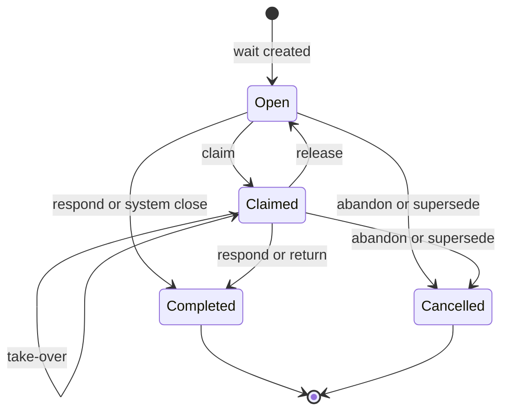
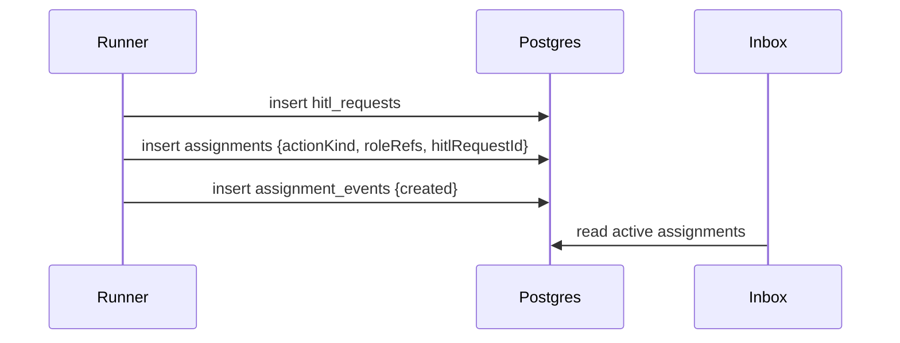
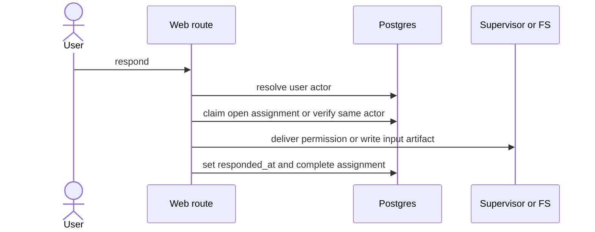
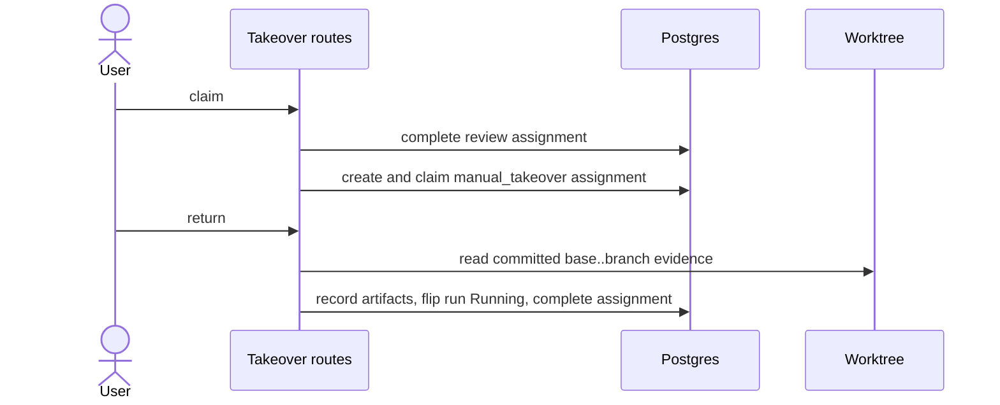

# Assignments domain

## Purpose

**Assignments** are the M13 durable work-ownership layer for every human-visible
wait. They make pending work queryable and claimable without changing the run
state machine. An assignment may be owned by a human user today; the actor model
also supports API-token systems, internal agents, and system actors for future
ingress.

## Domain entities

- **Flow role** — `project_flow_roles.role_ref`, a project-scoped routing label
  from `maister.yaml flow_roles[]`; never an authorization role.
- **Actor identity** — `actor_identities`, the audit identity for users,
  project API-token systems, internal agents, or system actors.
- **Assignment** — `assignments`, the current claimable work item linked to a
  run and optionally to a HITL request or node attempt.
- **Assignment event** — `assignment_events`, the append-only lifecycle ledger.

## State machine

## Process flows

### HITL wait creation

### Respond

### Manual takeover

## Expectations

- Assignments are the read model for pending work; `runs.status` remains the
  scheduler and cap source.
- `flow_roles[]` routes work but never authorizes it; route authorization still
  uses `requireProjectAction`.
- Responding to an unclaimed HITL auto-claims the assignment for the current
  actor before side effects.
- A response or return completes the assignment only after the existing durable
  side effect succeeds.
- Manual takeover creates a `manual_takeover` assignment and closes it only
  after return artifacts and the run-state flip commit.
- Abandon system-closes active assignments for the run.
- Legacy pending HITL rows without assignment rows remain visible as a
  compatibility fallback in portfolio counts.

## Edge cases

- Unknown Flow role refs fail fast with `CONFIG`.
- Same-actor claim/respond retries are idempotent.
- Different-actor claim/respond attempts return `CONFLICT` unless the explicit
  take-over route is used.
- Retryable supervisor or file-write failures keep the assignment claimed and
  the HITL row retryable.
- API-token and internal-agent actors are modeled for attribution only; M13 does
  not add token-authenticated assignment write routes.

## Linked artifacts

- ADR: [`ADR-040`](../decisions.md#adr-040-assignment-actors-and-role-owned-work-queue).
- DB: [`../db/assignments-domain.md`](../db/assignments-domain.md).
- API: [`../api/web.openapi.yaml`](../api/web.openapi.yaml).
- Code: `web/lib/assignments/service.ts`,
  `web/app/api/projects/[slug]/assignments/route.ts`,
  `web/app/api/assignments/[assignmentId]/*/route.ts`.
