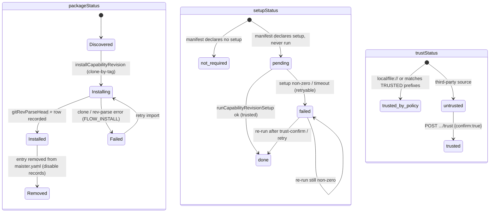
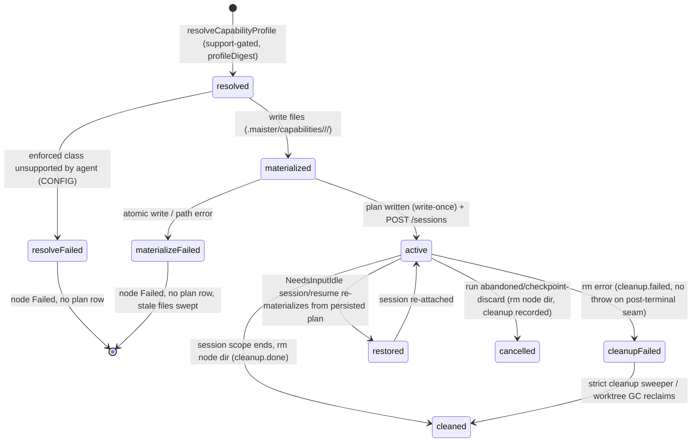
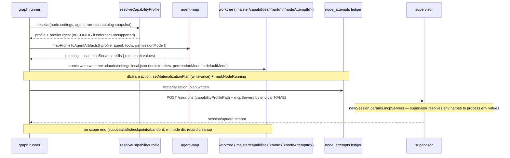
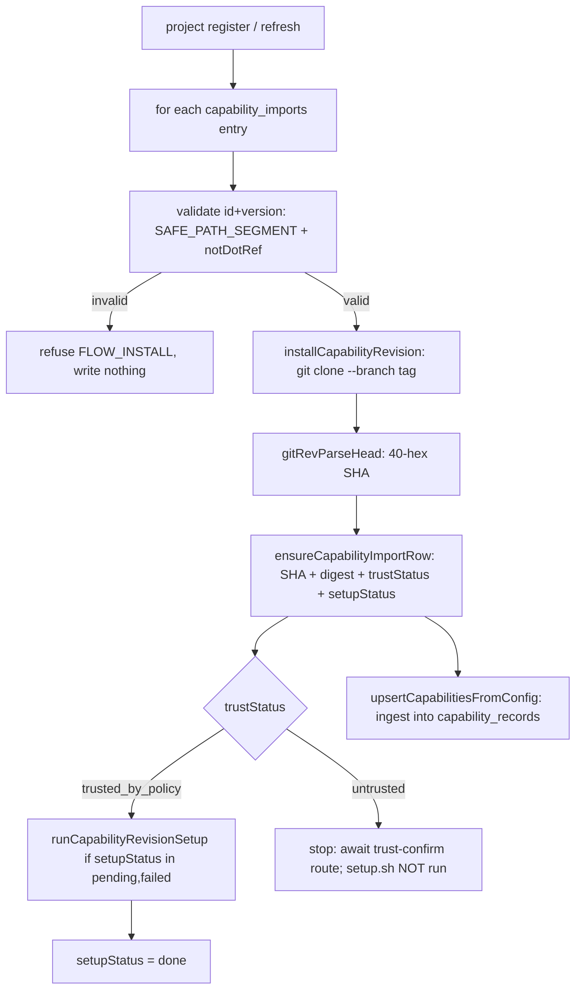
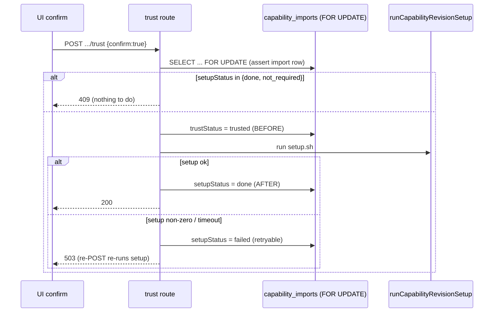

# Scoped capability materialization (M14)

> **Status: Implemented (M14).** Materialization and delivery are **Implemented
> (M14)** — the import pipeline, carve-b reference validation, agent-aware name
> mapping (`agent-map`), per-session native materialization (`materialize`), ACP
> `newSession params.mcpServers` delivery, the `node_attempts.materialization_plan`
> ledger, scoped cleanup, and the run-detail capability view have all shipped to
> the current branch. **Only the spike-gated `instructed → enforced` flip stays
> Designed/deferred** — `ENFORCEABILITY_BY_AGENT` stays all `instructed` this
> milestone, gated on a live-adapter spike that cannot run in CI (ADR-042). Read
> every "MUST" tied to the flip as the deferred contract; everything else is
> as-built. Locked decisions:
> [ADR-041](../decisions.md#adr-041-capability-registry-refs--agent-aware-mapping--runner-owned-native-materialization)
> (registry refs + agent-aware mapping + runner-owned native materialization),
> [ADR-042](../decisions.md#adr-042-conservative-spike-gated-enforcement-flip-claude-first)
> (conservative spike-gated flip, claude-first),
> [ADR-043](../decisions.md#adr-043-capability-import-reuses-the-flow-install-fetchtrustexecute-pipeline)
> (import reuses the flow-install pipeline),
> [ADR-044](../decisions.md#adr-044-capability-delivery-via-settingslocaljson--acp-newsession-cli-flag-mechanism-disproven)
> (delivery via `settings.local.json` + ACP `newSession`). Extends
> [flow-settings.md](flow-settings.md) (M11c), which froze the
> `ENFORCEABILITY_BY_AGENT` table this domain flips.

## Purpose

This domain covers how a Flow run turns the **declared** node capability
settings of M11c ([ADR-031](../decisions.md#adr-031-node-typed-settings-schema-carve-b))
into **materialized, scoped, and — where proven — enforced** runtime boundaries.
It owns four things: (1) the **project capability registry** —
`capability_records` populated from `maister.yaml` plus git-pinned
`capability_imports`; (2) **resolution** of a node's abstract capability refs
(`mcps:[github]`, `tools:[edit]`, `skills:[…]`, `restrictions:[…]`,
`settingsProfile`) against that registry into a deterministic per-agent profile;
(3) **native materialization** of concrete adapter config —
`<worktree>/.claude/settings.local.json` (tools/permissionMode) written **before**
the ACP session spawns, plus MCP servers delivered over ACP
`newSession params.mcpServers` carrying env-var **names only** — never a secret
VALUE on disk or the wire (ADR-044); and (4) the conservative, spike-gated flip of
`ENFORCEABILITY_BY_AGENT` cells from `instructed` to `enforced`. Scope is the
`web/` tier and the on-disk worktree only — the supervisor resolves
`StartSessionRequest.mcpServers` env names → values from its own `process.env` at
spawn (it also still accepts the non-secret `capabilityProfilePath` +
`adapterLaunch` paths). Out of scope and
deferred to **Phase 2**: a capability marketplace, sandboxing of untrusted import
sources, cross-project capability promotion, codex enforced mapping
(`config.toml` / `--sandbox`), and a Flow capability-designer UI.

## Domain entities

- **Capability record** (`capability_records`, Designed (M14) for the Flow-run
  wiring; the table itself ships from M11/scratch). One row per declared
  capability in a project. `kind ∈ {mcp, skill, rule, setting, restriction, tool,
  agent_definition, env_profile}`; `source ∈ {platform, project, flow-package}`;
  `enforceability ∈ {enforced, instructed, unsupported}`. Env values are redacted
  to key-names on ingest (R-SECRET). M14 ingests two previously-unwired kinds —
  `agent_definition` (from `maister.yaml agent_definitions[]`) and `env_profile`
  (from `env_profiles[]`) — generically. See
  [`../db/capabilities-domain.md`](../db/capabilities-domain.md).
- **Capability import** (`capability_imports`, **NEW** — Designed (M14)). One row
  per `(projectId, capabilityRefId, resolvedRevision)`, mirroring
  `flow_revisions`: `source`, `versionTag`, `resolvedRevision` (40-hex SHA),
  `manifestDigest`, `manifest` (jsonb), `installedPath`, `setupStatus`,
  `packageStatus`, `trustStatus`, `createdAt`/`updatedAt`. Records a git-pinned
  capability package fetched into `~/.maister/capabilities/<id>@<sha[:12]>/`.
  Migration `0019`. See [`../db/capabilities-domain.md`](../db/capabilities-domain.md).
- **Resolved capability profile** (Designed (M14)). The in-memory output of
  `resolveCapabilityProfile` — a deterministic, agent-support-gated selection of
  per-kind capabilities plus a `profileDigest` (stable across runs, changes when
  a resolved capability revision changes). For Flow runs it is NOT persisted in
  its own table; it is folded into the materialization plan (AD-2). The scratch
  path keeps using `scratch_capability_profiles` (scratch-only, unchanged).
- **Agent materialization** (M14; delivery mechanism Implemented + CI-verified,
  enforcement still gated — see
  [ADR-044](../decisions.md#adr-044-capability-delivery-via-settingslocaljson--acp-newsession-cli-flag-mechanism-disproven)).
  The pure output of `web/lib/capabilities/agent-map.ts`
  `mapProfileToAgentArtifacts({ profile, agent, tools?, permissionMode? })`:
  `{ settingsLocal, mcpServers, skills }` — **no secret values**. `settingsLocal`
  is the `<worktree>/.claude/settings.local.json` body the claude SDK reads as its
  highest-precedence "local" tier (`permissions.allow` = the node `tools`
  allow-list; `permissions.defaultMode` maps `permissionMode`
  ask→default / allow→bypassPermissions / deny→plan; `null` when neither applies).
  `mcpServers` carries env-var **names only** (`envKeys`) and is delivered over ACP
  `newSession params.mcpServers`, resolved name→value supervisor-side from
  `process.env` — secrets never reach the worktree, the wire, or the DB (no
  `.mcp.json`, no `adapterLaunch.env` secret values). The ONLY adapter-specific
  knowledge in the codebase. claude is materialized; codex returns empty
  (`{ settingsLocal: null, mcpServers: [], skills: [] }`, `instructed`-only this
  milestone).
- **Materialization plan** (`node_attempts.materialization_plan` jsonb, **NEW** —
  Designed (M14), migration `0019`). The ledger record of what was resolved and
  materialized for one node attempt (AD-1):
  `{ profileDigest, resolvedRevisions:[{refId,kind,sha}], materializedFiles:[paths],
  enforcedClasses, instructedClasses, refusedClasses, cleanup:{status,error?,at} }`.
  Mirrors the existing `enforcement_snapshot` column; NOT an `artifact_instances`
  kind. See [`../db/runs-domain.md`](../db/runs-domain.md).
- **Enforcement class** (Designed (M14) for the flip; defined in M11c). One of the
  six capability-bearing classes `mcps, tools, skills, restrictions,
  permissionMode, workspaceAccess`, each carrying an `enforcement` intent
  `strict | instruct | off`.

## State machines

### (a) Import lifecycle (Designed (M14))

A `capability_imports` row tracks three independent dimensions: `packageStatus`
(the fetch/install lifecycle), `setupStatus` (whether `setup.sh` has run), and
`trustStatus` (the trust gate). The diagram models them as orthogonal regions.

Setup execution is **physically separate** from fetch
([ADR-043](../decisions.md#adr-043-capability-import-reuses-the-flow-install-fetchtrustexecute-pipeline)):
`installCapabilityRevision` NEVER runs `setup.sh`; `runCapabilityRevisionSetup`
runs it ONLY when `trustStatus ∈ {trusted, trusted_by_policy}` AND
`setupStatus ∈ {pending, failed}` (idempotently re-runnable).

### (b) Per-node profile lifecycle (Designed (M14))

For one `ai_coding`/`judge` node attempt, the capability profile moves through
resolve → materialize → active → cleaned, with restore on resume and a recoverable
cleanup substate persisted in `materialization_plan.cleanup`.

The on-disk materialize happens **before** the `db.transaction` that writes the
plan + `markNodeRunning`; `POST /sessions` happens **after** commit. A death in
the spawn window is recovered by the existing `Running`-crash reconciler
([ADR-033](../decisions.md#adr-033-crash-reconciliation-model-startup--periodic-sweeper-allow-list-running-only));
on `session/resume`/re-dispatch the write-once plan row no-ops and files are restored
from the persisted plan, never re-resolved (immutability — AD-1).

## Process flows

### Resolve → materialize → spawn → cleanup (Designed (M14))

The runner-owned hot path for one AI node, after the M11c enforcement gate passes.

### Import: fetch → trust → setup (Designed (M14))

Mirrors the flow-install pipeline; fetch and execute are physically separate.

### Trust-confirm route — two-phase order (Designed (M14))

`POST /api/projects/[slug]/capabilities/[capabilityRefId]/trust`. Identifiers:
`slug` (url-param → project server-state), `capabilityRefId` (url-param,
validated against the project's import rows = server-state), body `{confirm:true}`
(no cross-resource locator). The **idempotency marker is `setupStatus`**, never
`trustStatus`.

## Launch/runtime enforcement refusal — ALLOW-LIST (Designed (M14))

The boundary stays the M11c machinery
([ADR-032](../decisions.md#adr-032-settings-enforcement-refusal-boundary)):
`evaluateNodeEnforcement` + `assertNodeLaunchable`, fired at BOTH the launch
precondition (`POST /api/runs`) and the per-node runtime build
(`runner-graph.ts`). M14 only changes the **data** — it flips proven cells in
`ENFORCEABILITY_BY_AGENT` from `instructed` to `enforced`, which activates the
previously-dead `EXECUTOR_UNAVAILABLE` branch. The guard is an **allow-list of
`enforced` cells**, never a deny-list. Launch proceeds iff every `strict`
capability-bearing setting on every `ai_coding`/`judge` node resolves to an
`enforced` cell for the resolved agent.

The set of `(agent, class) → enforced` cells is the **allow-list**, filled in
Phase 5 from the [ADR-042 verdict table](../decisions.md#adr-042-conservative-spike-gated-enforcement-flip-claude-first).
**claude-first:** only `claude` cells are candidates this milestone; **every
`codex` cell stays `instructed`** (codex enforced mapping → Phase 2).

| `(agent, class)` | materialized mechanism | enforced this milestone? |
| ---------------- | ---------------------- | ------------------------ |
| `claude, mcps` | ACP `newSession params.mcpServers` (env NAMES) | *(Phase 5 spike — claude-first candidate)* |
| `claude, tools` | `settings.local.json` `permissions.allow` | *(Phase 5 spike — claude-first candidate)* |
| `claude, skills` | `settings.local.json` `skillOverrides` (not emitted yet) | *(Phase 5 spike — claude-first candidate)* |
| `claude, restrictions` | `settings.local.json` `permissions.deny` (not emitted yet) | *(Phase 5 spike — claude-first candidate)* |
| `claude, permissionMode` | `settings.local.json` `permissions.defaultMode` (MUST re-run live) | *(Phase 5 spike — claude-first candidate)* |
| `claude, workspaceAccess` | `settings.local.json` `permissions.additionalDirectories` (not emitted yet) | *(Phase 5 spike — claude-first candidate)* |
| `codex, *` | profile/instructions handoff only | **No — stays `instructed` (Phase 2)** |

A cell flips iff its Phase-5 spike verdict is `enforced`; an unproven `claude`
cell stays `instructed` with a rationale comment. The contract only ever tightens
(`instructed → enforced`), never loosens. A `strict` declaration on a still-
`instructed` class refuses with `MaisterError("CONFIG")` (no agent can enforce);
once some agent enforces a class but the resolved executor's agent cannot, the
refusal is `MaisterError("EXECUTOR_UNAVAILABLE")`. No new error code
([ADR-008](../decisions.md#adr-008-typed-error-taxonomy-maistererror) closed
union).

## Capability resolution precedence (Designed, M27)

**(Designed, M27)** The uniform local-first resolution order applies to **all** capability kinds (`mcp`, `skill`, `rule`, `agent_definition`, `restriction`, and any future kind): **project > platform > flow-package**.

Winner per `(kind, capability_ref_id)`: the highest-precedence record in the chain is used; lower-precedence records with the same `(kind, refId)` are **shadowed — no merge, no duplicate emitted**. This is consistent with the runner-resolution chain (root CLAUDE.md §5) and supersedes the current `resolver.ts` behavior that returns all records for a ref-id without picking a winner, which produces latent duplicate-materialization bugs.

Concretely:
- A project-scoped MCP with `id=github` shadows a platform-scoped MCP with the same id.
- A platform-scoped skill shadows a flow-package-scoped skill of the same id.
- Same id + different params across scopes → higher-precedence record used; lower record not emitted.

This behavior is enforced inside `resolveCapabilityProfile` (`web/lib/capabilities/resolver.ts`) and tested in `resolver-precedence.test.ts` (see SDD M27 §9 test matrix). No duplicate capability record reaches materialization for the same `(kind, refId)`.

## Expectations

These are the steady-state invariants the M14 code MUST satisfy (Designed (M14) —
they hold once the milestone lands, not before).

- A node-settings capability ref (`mcps/skills/restrictions/settingsProfile/tools`)
  that names no `capability_records` row in the project registry MUST be refused
  with `MaisterError("CONFIG")` at BOTH project-register and run-launch, using the
  same ref-id map builder (closes the `config.ts:745` carve-b stub).
- A secret value (env-profile value OR an MCP-server credential) MUST NEVER appear
  in the materialized `.maister/capabilities/**` tree, in `settings.local.json`, in
  `materialization_plan`, on the web→supervisor wire, in logs/SSE, or in any UI
  payload; it MUST reach the adapter ONLY by env-var NAME — carried as
  `mcpServers[].envKeys` over ACP `newSession` and resolved name→value
  supervisor-side from `process.env` (no `.mcp.json`, no `adapterLaunch.env` secret
  values).
- `node_attempts.materialization_plan` MUST be written **write-once** (`IS NULL`
  guard) inside the SAME `db.transaction` as `markNodeRunning`, before
  `POST /sessions`.
- The on-disk materialize MUST happen BEFORE that transaction (a failure is a
  clean node-Failed with no plan row) and `POST /sessions` MUST happen AFTER
  commit (a death there is recoverable by the `Running`-crash reconciler).
- A `capability_imports` row MUST be unique on `(projectId, capabilityRefId,
  resolvedRevision)`, record a 40-hex `resolvedRevision`, and persist
  `trustStatus`/`setupStatus`/`packageStatus` as orthogonal dimensions.
- `installCapabilityRevision` MUST NEVER run `setup.sh`; `setup.sh` MUST run ONLY
  via `runCapabilityRevisionSetup` gated on `trustStatus ∈ {trusted,
  trusted_by_policy}` AND `setupStatus ∈ {pending, failed}`.
- Every capability/import `id` and `version` reaching a path or git op MUST pass
  `SAFE_PATH_SEGMENT` + `notDotRef` at the Zod schema AND inside
  `systemCapabilityCachePath`; a traversal id MUST throw
  `MaisterError("FLOW_INSTALL")` and write nothing outside the cache.
- The trust route's idempotency marker MUST be `setupStatus`: `409` ONLY when
  `setupStatus ∈ {done, not_required}`, NEVER merely because `trustStatus` is set;
  a `trusted`+`failed` row MUST re-run setup on re-POST.
- `ENFORCEABILITY_BY_AGENT` MUST only ever flip `instructed → enforced`; ALL six
  `codex` cells MUST stay `instructed` this milestone; the launch/runtime guard
  MUST stay an allow-list of `enforced` cells.
- Subsequent node attempts in the same run MUST re-materialize from the persisted
  `materialization_plan.resolvedRevisions` snapshot, NEVER a fresh catalog read,
  so a mid-run `capability_records` change cannot mutate a running run.
- Cleanup MUST be recoverable: post-terminal seams (abandon route, crash
  reconciler) MUST NEVER throw `CRASH`; a failure MUST record
  `materialization_plan.cleanup.failed` and stay operator-visible until the strict
  cleanup sweeper or the M19 worktree GC reclaims the dir.
- Reusing a `slash-in-existing` session for a second AI node MUST be permitted iff
  its `materialization_plan.profileDigest` equals the new node's resolved digest;
  a mismatch MUST start a fresh session at a declared boundary or refuse with
  `MaisterError("CONFIG")`.
- **(Designed, M27)** `resolveCapabilityProfile` MUST emit exactly ONE winner per
  `(kind, capability_ref_id)` using the precedence **project > platform >
  flow-package** across ALL capability kinds; a lower-precedence record with the
  same `(kind, refId)` MUST be shadowed (not merged, not emitted as a duplicate).
  This supersedes the current return-all/no-winner behavior and fixes the latent
  duplicate-materialization bug.

## Edge cases

- **Mid-run capability change** → the run snapshots resolved revisions at run
  start into `materialization_plan.resolvedRevisions`; later nodes re-materialize
  from the snapshot, so a bumped `capability_records` revision does NOT affect the
  in-flight run. The plan is immutable per attempt.
- **Long-living session profile-digest mismatch** → for `slash-in-existing`,
  reusing a session whose `profileDigest` differs from the new node's resolved
  digest is refused: either a fresh session starts at a Flow-declared boundary, or
  the launch/runtime build throws `MaisterError("CONFIG")` ("capability profile
  changes mid-session require a declared session boundary").
- **Cleanup failure** → the node dir `rm` fails (e.g. busy FS); the seam records
  `cleanup.failed` + ERROR-logs and does NOT throw (post-terminal seams never
  raise `CRASH`); the strict cleanup sweeper removes it later, and the M19
  worktree GC is the final backstop. Surfaced as a cleanup-failed indicator in the
  run-detail capability view.
- **Unsupported-agent downgrade** → a capability resolved for an agent that does
  not support its `enforced` class: at resolve time an `enforced`-required-but-
  unsupported class throws `MaisterError("CONFIG")`; an `instructed`/`off` class
  on an unsupporting agent is downgraded to the handoff (instructions only), never
  silently dropped.
- **Secret never in worktree** → an MCP server's credential is delivered as an env
  NAME (`mcpServers[].envKeys=["GITHUB_TOKEN"]`) over ACP `newSession`, resolved to
  its value only inside the supervisor's `process.env` at spawn; a grep of the
  worktree, the web→supervisor wire payload, the ledger, and the UI for the literal
  returns absent (standing regression).
- **Untrusted import carrying `setup.sh`** → `installCapabilityRevision` records
  `trustStatus='untrusted'` and does NOT run the script; a sentinel the script
  would write is absent until an explicit trust-confirm + setup run.
- **Process dies after materialize, before the plan transaction** → no plan row;
  the node is retried; stale node-dir files are cleaned by the retry's pre-write,
  and the `Running`-crash reconciler covers a death after commit.

## Linked artifacts

- ADRs: [ADR-041](../decisions.md#adr-041-capability-registry-refs--agent-aware-mapping--runner-owned-native-materialization)
  (registry refs + agent-aware mapping + runner-owned materialization, ledger
  column, secret boundary, recoverable cleanup),
  [ADR-042](../decisions.md#adr-042-conservative-spike-gated-enforcement-flip-claude-first)
  (conservative spike-gated flip, claude-first, verdict table),
  [ADR-043](../decisions.md#adr-043-capability-import-reuses-the-flow-install-fetchtrustexecute-pipeline)
  (import reuses fetch→trust→execute, trust route, path-safety),
  [ADR-044](../decisions.md#adr-044-capability-delivery-via-settingslocaljson--acp-newsession-cli-flag-mechanism-disproven)
  (delivery via `settings.local.json` + ACP `newSession`, CLI-flag disproven),
  [ADR-031](../decisions.md#adr-031-node-typed-settings-schema-carve-b) (typed
  settings, carve (b)),
  [ADR-032](../decisions.md#adr-032-settings-enforcement-refusal-boundary)
  (refusal boundary),
  [ADR-021](../decisions.md#adr-021-flow-package-lifecycle-multi-revision-trust-and-compatibility)
  (flow lifecycle + setup.sh deferral),
  [ADR-008](../decisions.md#adr-008-typed-error-taxonomy-maistererror) (error
  taxonomy).
- Companion spec: [flow-settings.md](flow-settings.md) (M11c — the frozen
  `ENFORCEABILITY_BY_AGENT` table and `evaluateNodeEnforcement` truth table this
  domain flips).
- DB: [database-schema.md](../database-schema.md) (narrative),
  [`../db/capabilities-domain.md`](../db/capabilities-domain.md)
  (`capability_records` + `capability_imports` ERD),
  [`../db/runs-domain.md`](../db/runs-domain.md)
  (`node_attempts.materialization_plan` column),
  [`../db/erd.md`](../db/erd.md) (consolidated).
- Config: [configuration.md](../configuration.md) (`capability_imports[]`,
  `agent_definitions[]`, `env_profiles[]`,
  `MAISTER_TRUSTED_CAPABILITY_SOURCE_PREFIXES`).
- DSL: [flow-dsl.md](../flow-dsl.md) (node-settings refs now registry-resolved).
- Errors: [error-taxonomy.md](../error-taxonomy.md) (`CONFIG`,
  `EXECUTOR_UNAVAILABLE`, `FLOW_INSTALL` M14 callers).
- API: [`../api/web.openapi.yaml`](../api/web.openapi.yaml) (capability
  trust-confirm route).
- Source (Designed — paths the code will live at): `web/lib/capabilities/{types,
  catalog,resolver,materialize,agent-map,import}.ts`,
  `web/lib/flows/enforcement.ts`, `web/lib/flows/graph/{runner-graph,ledger}.ts`,
  `web/lib/flow-paths.ts`, `web/app/api/runs/route.ts`,
  `web/app/api/projects/[slug]/capabilities/[capabilityRefId]/trust/route.ts`.
