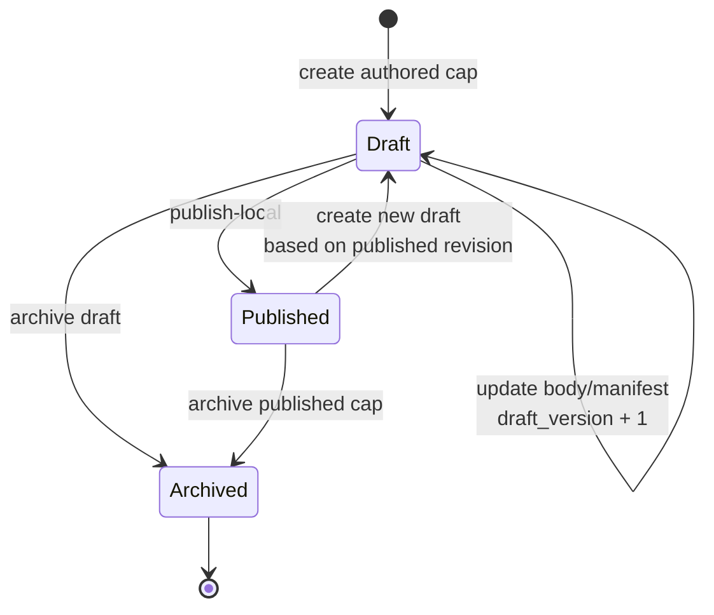
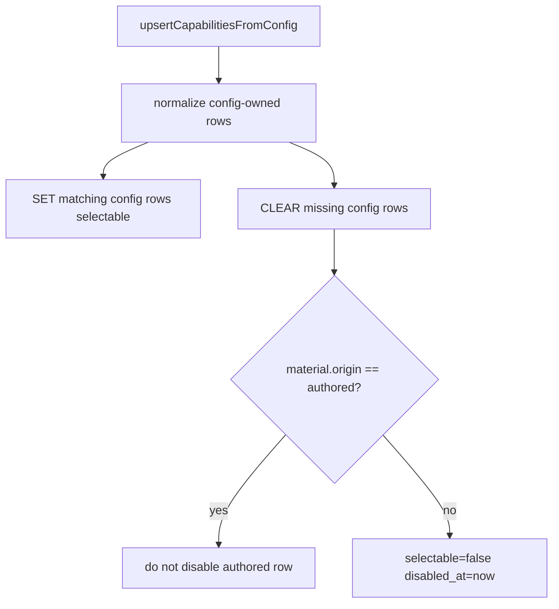
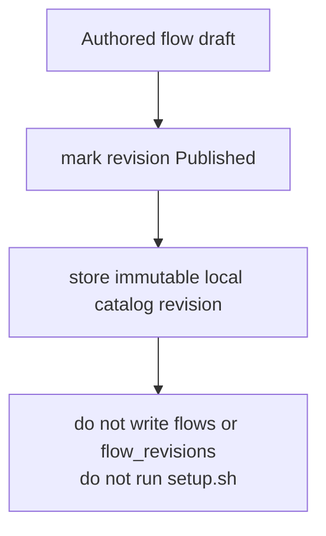
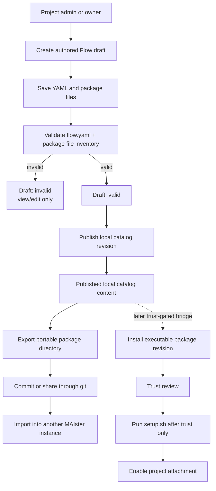

# Authored capability catalog domain

## Purpose

This domain (**Implemented, M25**) covers the local data model and read/write
groundwork for MAIster-authored rules, skills, and flows. It complements the
Implemented M14 capability registry/import pipeline without changing git
install, trust, setup, Flow package enablement, or runtime materialization.

## Domain entities

- **Authored capability** (`authored_capabilities`, Implemented, M25) — stable
  project-local identity for `rule`, `skill`, or `flow`, keyed by
  `(project_id, kind, slug)`.
- **Authored capability revision** (`authored_capability_revisions`, Implemented,
  M25) — versioned draft/published/archive snapshot with `draft_version`,
  lifecycle, canonical content hash, body, and manifest.
- **Capability projection** (`capability_records`, Implemented M14, authored
  projection Implemented M25) — published authored rule/skill rows appear as
  `source='project'` with `material.origin='authored'`.
- **Capability import** (`capability_imports`, Implemented M14) — git-pinned
  import ledger; M25 reads beside it but never mutates it from authored edits.

## Adapter compatibility widening (Designed, ADR-084/ADR-085)

Gemini, OpenCode, and MiMo are new capability-agent ids, not new capability
kinds. When their adapter families are implemented, every capability surface
must widen in lockstep:

- `capability_records.agents[]`, authored capability manifests, imported
  capability manifests, MCP `supportedAgents`, Flow node tool maps, and runner
  snapshots may include `gemini`, `opencode`, and `mimo`.
- Existing records that currently list `claude`/`codex` MUST NOT be silently
  rewritten to include new agents. Compatibility stays explicit unless a future
  migration/spec names a deterministic widening rule.
- New Gemini/OpenCode/MiMo capability classes start as `instructed` or `unsupported`;
  none start as `enforced`.
- `resolveCapabilityProfile` MUST refuse enforced-unsupported requirements for
  the selected adapter instead of downgrading them to instructions.
- MCP resolution keeps the existing explicit compatibility model: a required MCP
  whose `supportedAgents` excludes `gemini`, `opencode`, or `mimo` is a launch
  refusal for that adapter, not a best-effort omission.

Capability-resolution logs use structured fields: `projectId`, `runnerId`,
`adapter`, `capabilityRef`, `class`, `declared`, `capability`, and error code.
They never log capability bodies, env values, headers, or generated native
settings files.

## Composer read model: catalog enrichment + `getProjectCapabilityCatalog` (Designed — capability composer, FR-B)

The unified capability composer (scratch start, running scratch chat, AI-coding
node prompts) needs a **pure DB read** of the skills/subagents available for a
given project and runner, with human-readable metadata for the typeahead. This
domain owns that read model. Wire-form expansion and the raw-text matcher are
**not** restated here — they are the normalizer's job
([flow-settings.md](flow-settings.md) §FROZEN SPEC); the per-adapter placement
that decides which agent supports a surface is the runner registry's job
([acp-runners.md](acp-runners.md) §Per-adapter materialization target).

### Install-time enrichment (Designed — FR-B1)

The install/projection pass that writes `capability_records` (kind=skill) parses
each `SKILL.md` frontmatter and stores two fields into the **existing**
`material` jsonb alongside the current paths — **no migration** (dedicated
columns only if a later access pattern justifies them):

- **`description`** — from the `description` frontmatter key.
- **`argHint`** — from the `argument-hint` frontmatter key.

The `agents` table already carries `name` / `description` / `mode`, so subagent
metadata needs no enrichment pass.

Config-state symmetry MUST hold, matching the §Config resync authored carve-out
discipline: frontmatter present at install → stored; the same key absent on a
later reinstall → **cleared** (not stale-retained); re-setting an unchanged value
is **idempotent**. Enrichment writes `description`/`argHint` only; it never
touches `selectable`, trust, `material.origin`, or the path entries.

### Aggregator `getProjectCapabilityCatalog(projectId, capabilityAgent)` (Designed — FR-B2/FR-B3)

A new read aggregator returns one unified list across the two backing surfaces,
filtered to the project's **enabled + trusted** packages:

```ts
{
  kind: "skill" | "subagent";
  refId: string;          // capability_records id (skill) / agents id (subagent)
  slug: string;
  displayName: string;
  description: string;
  argHint?: string;       // skills only, from FR-B1
  canonicalToken: string; // @skill:<slug> | @agent:<slug> (storage layer)
  surfaceForm: string;    // wire layer for capabilityAgent (see normalizer)
  supported: boolean;     // honored by capabilityAgent
}
```

Sources, unioned:

- **skills** — `capability_records` with kind=skill (enriched per FR-B1).
- **subagents** — `agents` rows with `mode='subagent'`, enumerated via
  `getProjectAgentsView` ([project-links.ts](../../web/lib/agents/project-links.ts)).

**Runner filter + surface-form computation (FR-B3):**

- A **skill** is `supported` iff the per-adapter materialization-target map marks
  the runner as skill-capable; its `surfaceForm` is `/<slug>` (claude) ·
  `$<slug>` (codex).
- A **subagent** is `supported` **iff `capabilityAgent = claude`**; its
  `surfaceForm` is `@<name>`. Every non-claude runner result **excludes
  subagents** entirely (they are never emitted as unsupported rows for codex).
- The `surfaceForm` / `supported` derivation is the same `surfaceForm(kind, slug,
  agent)` table the normalizer reads ([flow-settings.md](flow-settings.md)
  §FROZEN SPEC), itself sourced from the adapter `supports` descriptor
  ([acp-runners.md](acp-runners.md) §Per-adapter materialization target) — not a
  claude/codex constant duplicated here.

Switching the `capabilityAgent` argument flips the surface forms **and** subagent
inclusion **with no other change** to the membership set: the same enabled+trusted
project capabilities are listed, only the wire forms re-derive and subagents drop
out for non-claude runners. This read backs the composer's intent-entry
autocomplete and its instant runner-switch re-filter
([scratch-runs.md](scratch-runs.md) §Intent entry).

## State machine



## Process flows

### Publish authored rule or skill


### Config resync authored carve-out



### Authored flow publication



### Platform Flow authoring and management



Platform `/flows` is the cross-project management surface for local authored
Flows and installed executable package attachments. It intentionally shows two
different objects in one place:

- **Authored Flow content** — editable local catalog content stored under
  `authored_capabilities` / `authored_capability_revisions`.
- **Installed Flow package attachment** — executable project attachment backed
  by M10 `flow_revisions` + `flows.enabled_revision_id`.

These objects are not interchangeable. Publishing authored content makes it
visible in the local catalog; it does not install, trust, enable, launch, or run
setup hooks.

**Editor upgrade (Implemented, [ADR-066](../decisions.md#adr-066-editor-and-diff-rendering-stack-shiki-git-diff-view-codemirror)).**
The authored-Flow editing surface (`flowYaml` raw text and `files[]` content,
formerly plain `<textarea>`s) is a CodeMirror 6 editor
(`@uiw/react-codemirror`, dynamic `ssr:false`):

- **Per-kind language** by file kind / path: yaml (`flow.yaml`), json
  (`schema`), markdown+frontmatter (`skill` / `rule` / `readme` /
  `agent_definition`), shell (`script` / `setup`); plus a `readOnly` mode for
  non-editable inspection.
- **Inline validation** through a `@codemirror/lint` source that runs
  **client-side** (the server validator `validateAuthoredFlowPackageBody` is
  `server-only` — `node:crypto`/`node:path`/`pino` — so it cannot run in the
  browser editor). The lint reuses the same client-safe primitives the server
  validator builds on: `parseYaml` (from `yaml`) maps a `YAMLParseError.linePos`
  to a **precise line marker** for YAML syntax errors, and `flowYamlV1Schema`
  (from `@/lib/config.schema`, client-safe) yields **file-level** diagnostics
  for manifest-shape issues (no doc position). `*.json` buffers get a
  JSON-parse syntax marker; other kinds use the CodeMirror language's built-in
  highlighting only. Graph / file / digest validation
  (`validateGraphManifest`, content hash) stays **server-side** on the
  save/load path and populates `packageBody.validation` (status + issueCount,
  shown in the panel); it is NOT duplicated in the live lint.
- **Context autocomplete** from static vocab: step types
  (`cli | agent | guard | human`), known `flow.yaml` keys, frontmatter / tool
  keys for typed files, and a static runner-name list (live runner-catalog
  autocomplete is a deferred follow-up).

The authored-draft lifecycle, the `manageCatalog` gate, the optimistic lock, the
`updateAuthoredFlowAction` / `updateAuthoredDraft` save path, and the validation
gates are unchanged — only the editing widget changes.

## Authored Flow package states

| State                             | Meaning                                                                        | User actions                                           | Runtime effects                                                                        |
| --------------------------------- | ------------------------------------------------------------------------------ | ------------------------------------------------------ | -------------------------------------------------------------------------------------- |
| `Draft: invalid`                  | Editable authored package content with parse/schema/graph/file issues.         | Save, edit, delete/archive, inspect validation issues. | None. Cannot publish, export, install, or launch.                                      |
| `Draft: valid`                    | Editable authored package content that passes manifest and package validation. | Save, edit, publish local, export.                     | None until publish/export is chosen.                                                   |
| `Published local catalog content` | Immutable project-local authored revision.                                     | Inspect, create a new draft, export.                   | No install cache write, no symlink, no setup, no launch enablement.                    |
| `Exported portable package`       | Git-ready directory containing `flow.yaml` and typed package files.            | Commit, copy, import elsewhere, hand to install flow.  | No execution. It is bytes only.                                                        |
| `Installed executable package`    | M10 package revision installed from a source/ref.                              | Trust, enable, upgrade, rollback, remove.              | Eligible for launch only after trust, setup, compatibility, and enablement gates pass. |
| `Enabled project attachment`      | Project Flow id points at an installed revision for new runs.                  | Launch tasks, disable, rollback, upgrade.              | New runs snapshot the enabled revision.                                                |

## Authoring permissions

All authored Flow write actions use project-scoped `manageCatalog`:

- Create draft.
- Save YAML.
- Add, update, or remove package files.
- Publish local catalog revision.
- Import a package directory as a draft.
- Export a published or valid draft package.

Global `admin` users may satisfy project authorization through the existing
project-role bypass. The UI must not use global role alone as the primary create
gate: a global `member` who is project `admin` or `owner` can create and manage
authored Flows for that project. Project `member` and `viewer` can inspect
visible inventory but cannot mutate authored content.

Server actions and HTTP routes resolve the project from server state before
parsing user-supplied YAML or package file content. Body fields such as
`projectSlug`, `capId`, and `expectedDraftVersion` are locators or concurrency
guards only; they are never authority.

## Package body contract

Authored Flow package content is represented in
`authored_capability_revisions.body` before adding any new artifact table. The
typed body is:

| Field             | Purpose                                                                    |
| ----------------- | -------------------------------------------------------------------------- |
| `flowYaml`        | Raw YAML draft text for `flow.yaml`.                                       |
| `manifest`        | Parsed manifest object when parsing succeeds.                              |
| `packageMetadata` | Slug, display name, description, version label, authorship/source notes.   |
| `files[]`         | Typed text artifacts included in the portable package.                     |
| `validation`      | Last validation status, issue list, manifest digest, package content hash. |

`files[]` uses explicit kinds: `asset`, `skill`, `rule`, `script`,
`agent_definition`, `schema`, `template`, `readme`, and `setup`. Unknown
portable text files import as `asset` so package bytes are not silently dropped.
File paths are safe relative paths only: no absolute paths, no `..` segment, no
duplicate normalized paths, and no file-vs-directory collisions. Package
content must be valid UTF-8 text; binary payloads are refused. Script/setup
files are represented as package content but are never executed by authoring,
publish, import, or export.

The canonical AIF package is a real portable package, extracted to the
external `maister-plugins` repo (`packages/aif`, ADR-088): each flow dir
includes `flow.yaml` plus schemas; the package ships `README.md`, `setup.sh`,
relevant AIF skills, and agent definitions under `capability/`. Managed source
directories such as `.codex/`, `.claude/`, `.agents/`, and
`.ai-factory/rules/` are source inputs; the package stores stable artifacts in
that external repo.

## Validation gates

Draft save may persist incomplete content, but it records validation status.
Local publish, export, installer bridge, and launch require:

- YAML parses to an object.
- `flow.yaml` satisfies the v1 manifest schema.
- graph validation passes (`nodes[]`/`steps[]`, transitions, gates, artifacts,
  engine compatibility).
- package file paths are safe and unique.
- package file kinds are supported.
- project-context references resolve on install/load/launch paths that provide
  project role and capability registries.
- setup/script artifacts remain inert until M10 trust/setup/enablement.

Invalid authored packages remain drafts and must be visibly non-runnable.

## User scenarios

| Scenario                                                 | Expected result                                                                                                                       |
| -------------------------------------------------------- | ------------------------------------------------------------------------------------------------------------------------------------- |
| Project admin creates a new Flow from `/flows/new`.      | Draft row is created after project `manageCatalog` authorization.                                                                     |
| Project owner with global `member` role creates a draft. | Allowed; project role is the governing axis.                                                                                          |
| Project member opens `/flows`.                           | Can inspect visible authored Flows and installed packages; cannot create/edit/publish.                                                |
| Admin saves malformed YAML.                              | Draft is saved only when the action supports draft save; validation shows parse/schema issues; publish/export controls stay disabled. |
| Admin publishes `{ foo: bar }`.                          | Refused before publication because it is not a valid Flow package.                                                                    |
| Admin exports a valid authored package.                  | A portable directory is written through temp + rename; no setup hook runs.                                                            |
| Admin imports an AIF flow dir (`maister-plugins/packages/aif/flows/<id>`). | Draft authored package contains the flow + schema artifacts of that dir (the bundle ships separately under `capability/`).            |
| Operator wants to launch authored content.               | They must export/install/trust/enable through the M10 package lifecycle first.                                                        |

## First-slice acceptance

The first accepted `/flows` slice must include red-to-green tests for:

- listing authorization filtering across global admin, project admin/owner,
  project member/viewer, and non-member.
- create/update/publish authorization boundaries.
- optimistic-lock conflict on stale `expectedDraftVersion`.
- malformed YAML and schema-invalid manifest handling.
- publish refusal for invalid packages.
- `/flows/new` project-role create gate.
- EN/RU rendering of visible enum/status/trust/enablement/validation values.

Every visible status, enum, role, trust state, validation state, and package
state renders through message keys. Raw enum strings are not user-facing copy.

## Expectations

- `Published` in M25 MUST mean project-local visibility only; external catalog
  publication is a later state/table.
- Draft updates MUST require matching `draft_version` and fail stale writes with
  `CONFLICT`.
- Published revisions MUST be immutable.
- Local publish of `rule` and `skill` MUST project authored-origin
  `capability_records` in the same transaction.
- `upsertCapabilitiesFromConfig` MUST never disable rows with
  `material.origin='authored'`.
- Same `(project_id, kind, slug)` collisions with non-authored project rows MUST
  be refused with `CONFLICT`.
- Authored flow publish MUST NOT mutate `flows`, `flow_revisions`, project
  enablement, install caches, or setup status.
- Authored content MUST NOT run executable hooks in M25.
- Existing git-installed capability imports MUST remain read-only from authored
  catalog routes.
- Authored Flow creation, editing, publishing, import, and export MUST use
  project-scoped `manageCatalog`.
- Local publish/export MUST require a valid Flow package; invalid content can
  remain a draft only.
- Authored Flow package content MUST be portable across MAIster installations
  through git-ready package directories.
- Gemini/OpenCode/MiMo support MUST preserve explicit capability-agent compatibility:
  authored/imported capability records are accepted only when their `agents[]`
  values are in the code-owned agent union, and launch resolution must refuse
  required capabilities unsupported by the selected adapter. (Designed, ADR-084)
- The install/projection pass MUST store `material.description` / `material.argHint`
  from `SKILL.md` frontmatter when present and **clear** them when the key is
  absent on reinstall, with no migration; re-running it on unchanged frontmatter
  MUST be idempotent. (Designed, FR-B1)
- `getProjectCapabilityCatalog` MUST return only enabled+trusted, runner-supported
  capabilities; a non-claude `capabilityAgent` MUST exclude `mode='subagent'`
  rows, and flipping `capabilityAgent` MUST change only `surfaceForm`/`supported`
  and subagent inclusion, never the underlying membership set. (Designed, FR-B2/FR-B3)

## Authored flow → executable bridge (Designed, M27)

**(Designed, M27)** M27 extends the ADR-061 catalog-only boundary: a published authored `flow` can now become **executable** without a manual export+install cycle. The in-app publish-local route calls `installAuthoredFlowPackageBridge(trusted_by_policy)`, which bridges the authored catalog revision directly into a `flows` + `flow_revisions` row (`trustStatus=trusted_by_policy`, `exec_trust=untrusted`). The catalog-only invariant (publish ≠ enable) is preserved: the bridged revision still requires an explicit `exec_trust` flip before `runRevisionSetup` or an MCP stdio `command` can run. Logic-trust alone (`trustStatus=trusted_by_policy`) never executes setup.sh. See ADR-068 and [`flow-packages.md`](flow-packages.md) §M27.

## Edge cases

- Stale `draft_version` returns `CONFLICT` and leaves the draft unchanged.
- Publishing without an active draft returns `PRECONDITION`.
- Same-slug collision with config-owned or import-owned project rows returns
  `CONFLICT` before any projection write.
- Config resync that removes a same-kind slug from `maister.yaml` disables only
  config-owned rows, not authored-origin projections.
- Archiving an authored cap disables only its authored-origin projection and
  preserves historic run snapshots.
- Authored flow publish returns local catalog data only; attempts to execute it
  through Flow package enablement remain a later milestone.
- Adding Gemini/OpenCode/MiMo to the agent union does not backfill old capability
  rows; operators must edit or republish records to declare compatibility unless
  a future migration explicitly says otherwise.

## Linked artifacts

- Spec: [`../../.ai-factory/specs/feature-m25-capability-catalog-groundwork.md`](../../.ai-factory/specs/feature-m25-capability-catalog-groundwork.md).
- API: [`../api/web.openapi.yaml`](../api/web.openapi.yaml).
- Existing capability domain: [`capabilities.md`](capabilities.md).
- Flow package lifecycle: [`flow-packages.md`](flow-packages.md) and
  [`../flow-installer.md`](../flow-installer.md).
- DB: [`../database-schema.md`](../database-schema.md),
  [`../db/capabilities-domain.md`](../db/capabilities-domain.md),
  [`../db/erd.md`](../db/erd.md).
- ADR: [ADR-061](../decisions.md#adr-061-local-authored-capability-catalog-lifecycle),
  [ADR-066 authored editor](../decisions.md#adr-066-editor-and-diff-rendering-stack-shiki-git-diff-view-codemirror) (Implemented),
  [ADR-084](../decisions.md#adr-084-acp-adapter-families-for-gemini-cli-and-opencode) (Designed).
- Source seams: `web/lib/capabilities/catalog.ts`,
  `web/lib/capabilities/materialize.ts`, `web/lib/capabilities/cleanup.ts`.
