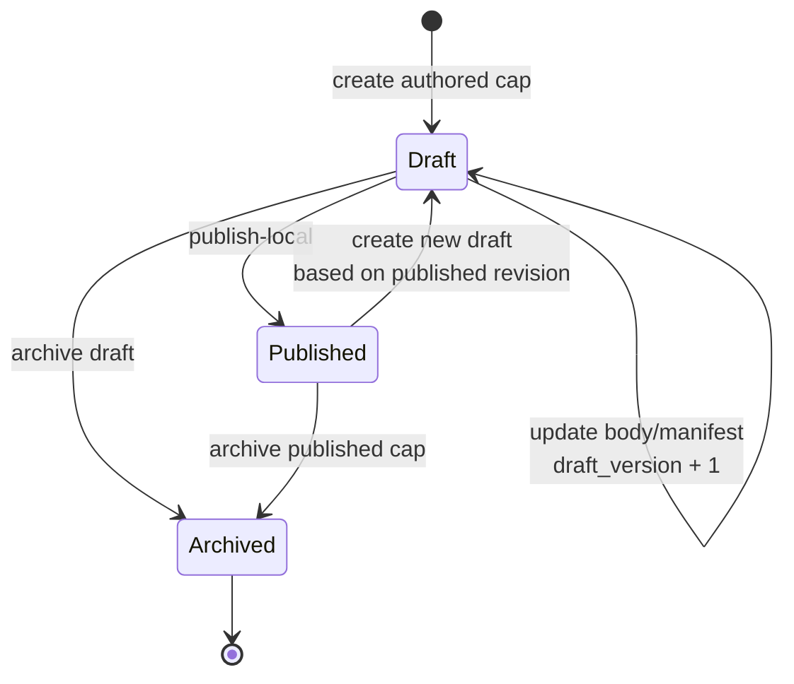
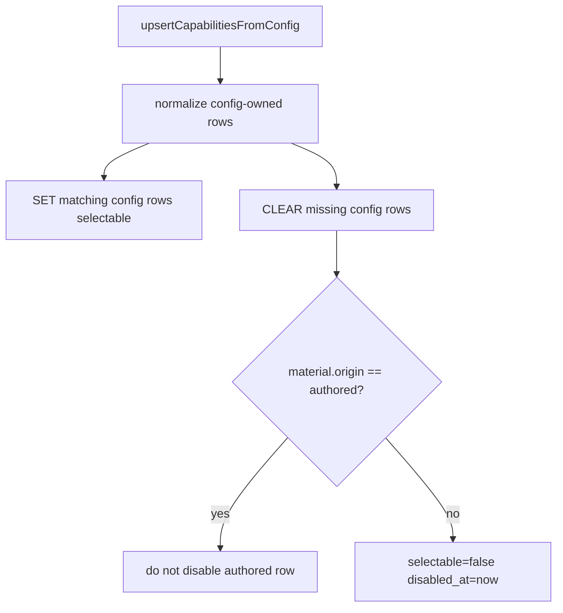
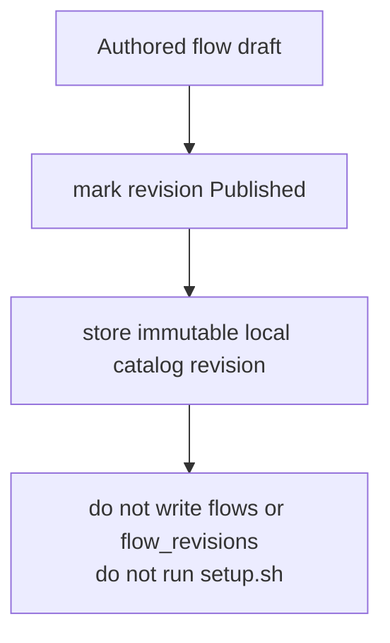

# Authored capability catalog domain

## Purpose

This domain (**Implemented, M25**) covers the local data model and read/write
groundwork for MAIster-authored rules, skills, and flows. It complements the
Implemented M14 capability registry/import pipeline without changing git
install, trust, setup, Flow package enablement, or runtime materialization.

## Domain entities

- **Authored capability** (`authored_capabilities`, Implemented, M25) — stable
  project-local identity for `rule`, `skill`, or `flow`, keyed by
  `(project_id, kind, slug)`.
- **Authored capability revision** (`authored_capability_revisions`, Implemented,
  M25) — versioned draft/published/archive snapshot with `draft_version`,
  lifecycle, canonical content hash, body, and manifest.
- **Capability projection** (`capability_records`, Implemented M14, authored
  projection Implemented M25) — published authored rule/skill rows appear as
  `source='project'` with `material.origin='authored'`.
- **Capability import** (`capability_imports`, Implemented M14) — git-pinned
  import ledger; M25 reads beside it but never mutates it from authored edits.

## State machine

## Process flows

### Publish authored rule or skill

### Config resync authored carve-out

### Authored flow publication

## Expectations

- `Published` in M25 MUST mean project-local visibility only; external catalog
  publication is a later state/table.
- Draft updates MUST require matching `draft_version` and fail stale writes with
  `CONFLICT`.
- Published revisions MUST be immutable.
- Local publish of `rule` and `skill` MUST project authored-origin
  `capability_records` in the same transaction.
- `upsertCapabilitiesFromConfig` MUST never disable rows with
  `material.origin='authored'`.
- Same `(project_id, kind, slug)` collisions with non-authored project rows MUST
  be refused with `CONFLICT`.
- Authored flow publish MUST NOT mutate `flows`, `flow_revisions`, project
  enablement, install caches, or setup status.
- Authored content MUST NOT run executable hooks in M25.
- Existing git-installed capability imports MUST remain read-only from authored
  catalog routes.

## Edge cases

- Stale `draft_version` returns `CONFLICT` and leaves the draft unchanged.
- Publishing without an active draft returns `PRECONDITION`.
- Same-slug collision with config-owned or import-owned project rows returns
  `CONFLICT` before any projection write.
- Config resync that removes a same-kind slug from `maister.yaml` disables only
  config-owned rows, not authored-origin projections.
- Archiving an authored cap disables only its authored-origin projection and
  preserves historic run snapshots.
- Authored flow publish returns local catalog data only; attempts to execute it
  through Flow package enablement remain a later milestone.

## Linked artifacts

- Spec: [`../../.ai-factory/specs/feature-m25-capability-catalog-groundwork.md`](../../.ai-factory/specs/feature-m25-capability-catalog-groundwork.md).
- API: [`../api/web.openapi.yaml`](../api/web.openapi.yaml).
- Existing capability domain: [`capabilities.md`](capabilities.md).
- Flow package lifecycle: [`flow-packages.md`](flow-packages.md) and
  [`../flow-installer.md`](../flow-installer.md).
- DB: [`../database-schema.md`](../database-schema.md),
  [`../db/capabilities-domain.md`](../db/capabilities-domain.md),
  [`../db/erd.md`](../db/erd.md).
- ADR: [ADR-061](../decisions.md#adr-061-local-authored-capability-catalog-lifecycle).
- Source seams: `web/lib/capabilities/catalog.ts`,
  `web/lib/capabilities/materialize.ts`, `web/lib/capabilities/cleanup.ts`.
