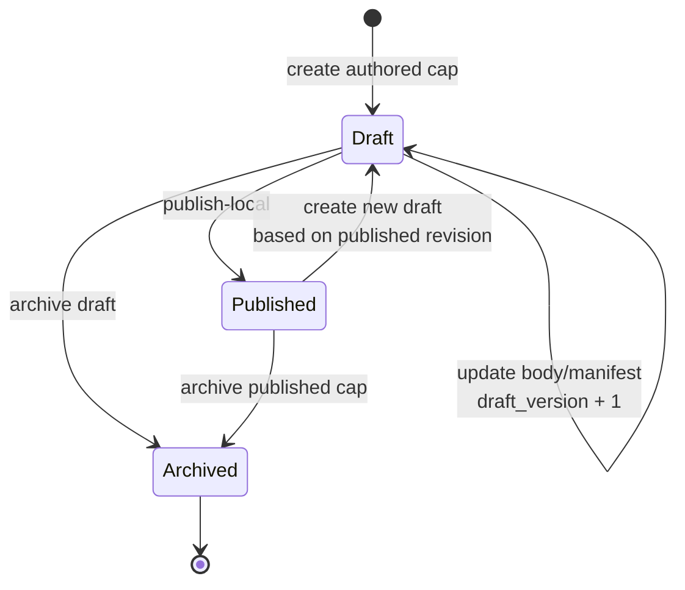
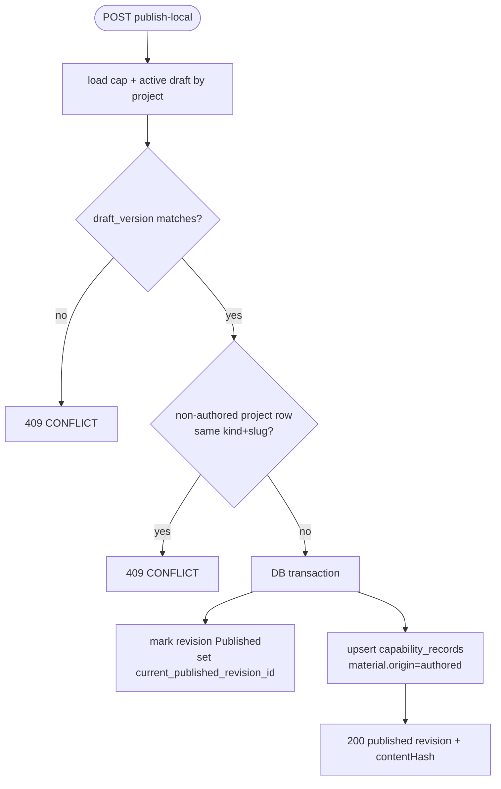
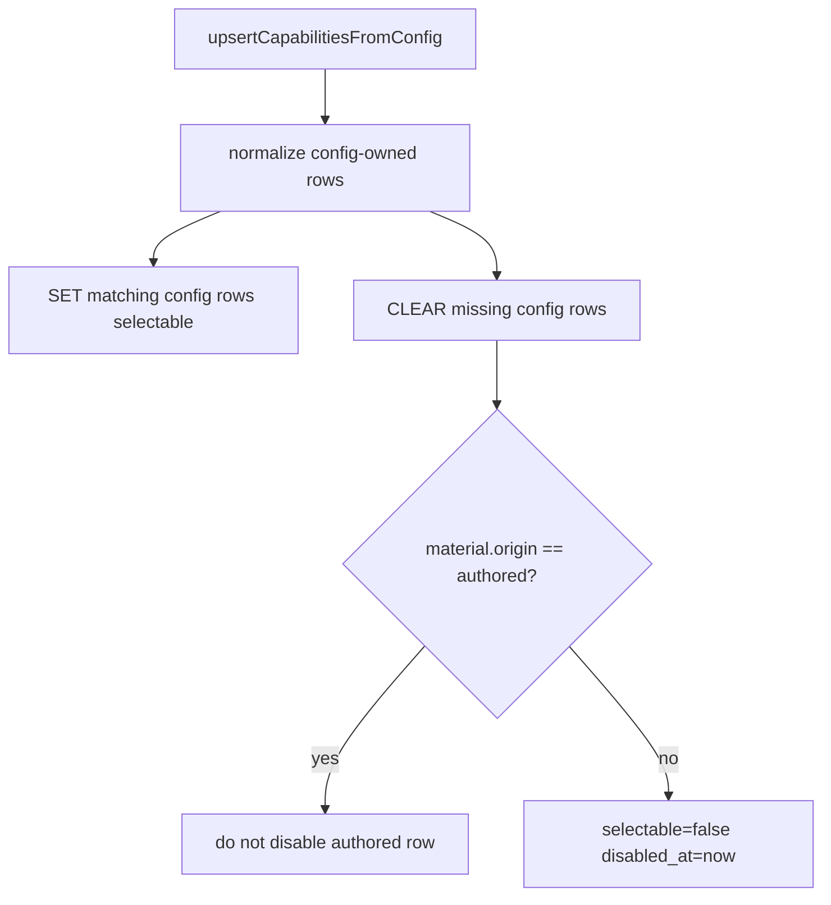
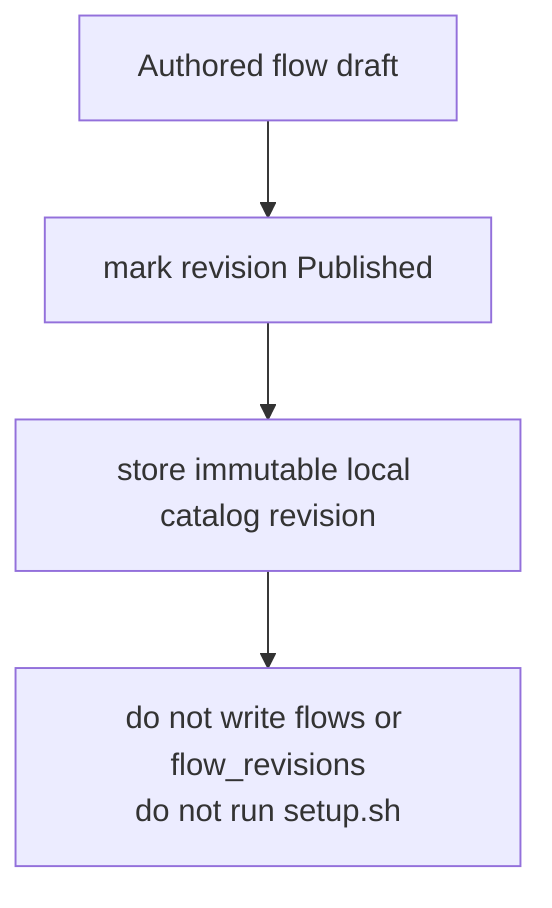
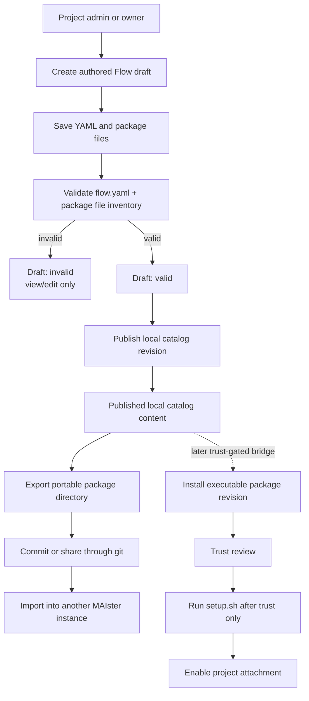

# Authored capability catalog domain

## Purpose

This domain (**Implemented, M25**) covers the local data model and read/write
groundwork for MAIster-authored rules, skills, and flows. It complements the
Implemented M14 capability registry/import pipeline without changing git
install, trust, setup, Flow package enablement, or runtime materialization.

## Domain entities

- **Authored capability** (`authored_capabilities`, Implemented, M25) — stable
  project-local identity for `rule`, `skill`, or `flow`, keyed by
  `(project_id, kind, slug)`.
- **Authored capability revision** (`authored_capability_revisions`, Implemented,
  M25) — versioned draft/published/archive snapshot with `draft_version`,
  lifecycle, canonical content hash, body, and manifest.
- **Capability projection** (`capability_records`, Implemented M14, authored
  projection Implemented M25) — published authored rule/skill rows appear as
  `source='project'` with `material.origin='authored'`.
- **Capability import** (`capability_imports`, Implemented M14) — git-pinned
  import ledger; M25 reads beside it but never mutates it from authored edits.

## State machine

## Process flows

### Publish authored rule or skill

### Config resync authored carve-out

### Authored flow publication

### Platform Flow authoring and management

Platform `/flows` is the cross-project management surface for local authored
Flows and installed executable package attachments. It intentionally shows two
different objects in one place:

- **Authored Flow content** — editable local catalog content stored under
  `authored_capabilities` / `authored_capability_revisions`.
- **Installed Flow package attachment** — executable project attachment backed
  by M10 `flow_revisions` + `flows.enabled_revision_id`.

These objects are not interchangeable. Publishing authored content makes it
visible in the local catalog; it does not install, trust, enable, launch, or run
setup hooks.

**Editor upgrade (Designed, [ADR-066](../decisions.md#adr-066-editor-and-diff-rendering-stack-shiki-git-diff-view-codemirror)).**
The authored-Flow editing surface (`flowYaml` raw text and `files[]` content,
today plain `<textarea>`s) becomes a CodeMirror 6 editor: per-kind language
(yaml / json / markdown+frontmatter / shell), inline validation reusing
`validateAuthoredFlowPackageBody`, and context autocomplete (step types, runner
names, known frontmatter/tool keys). The authored-draft lifecycle, `manageCatalog`
gate, optimistic lock, and validation gates are unchanged.

## Authored Flow package states

| State                             | Meaning                                                                        | User actions                                           | Runtime effects                                                                        |
| --------------------------------- | ------------------------------------------------------------------------------ | ------------------------------------------------------ | -------------------------------------------------------------------------------------- |
| `Draft: invalid`                  | Editable authored package content with parse/schema/graph/file issues.         | Save, edit, delete/archive, inspect validation issues. | None. Cannot publish, export, install, or launch.                                      |
| `Draft: valid`                    | Editable authored package content that passes manifest and package validation. | Save, edit, publish local, export.                     | None until publish/export is chosen.                                                   |
| `Published local catalog content` | Immutable project-local authored revision.                                     | Inspect, create a new draft, export.                   | No install cache write, no symlink, no setup, no launch enablement.                    |
| `Exported portable package`       | Git-ready directory containing `flow.yaml` and typed package files.            | Commit, copy, import elsewhere, hand to install flow.  | No execution. It is bytes only.                                                        |
| `Installed executable package`    | M10 package revision installed from a source/ref.                              | Trust, enable, upgrade, rollback, remove.              | Eligible for launch only after trust, setup, compatibility, and enablement gates pass. |
| `Enabled project attachment`      | Project Flow id points at an installed revision for new runs.                  | Launch tasks, disable, rollback, upgrade.              | New runs snapshot the enabled revision.                                                |

## Authoring permissions

All authored Flow write actions use project-scoped `manageCatalog`:

- Create draft.
- Save YAML.
- Add, update, or remove package files.
- Publish local catalog revision.
- Import a package directory as a draft.
- Export a published or valid draft package.

Global `admin` users may satisfy project authorization through the existing
project-role bypass. The UI must not use global role alone as the primary create
gate: a global `member` who is project `admin` or `owner` can create and manage
authored Flows for that project. Project `member` and `viewer` can inspect
visible inventory but cannot mutate authored content.

Server actions and HTTP routes resolve the project from server state before
parsing user-supplied YAML or package file content. Body fields such as
`projectSlug`, `capId`, and `expectedDraftVersion` are locators or concurrency
guards only; they are never authority.

## Package body contract

Authored Flow package content is represented in
`authored_capability_revisions.body` before adding any new artifact table. The
typed body is:

| Field             | Purpose                                                                    |
| ----------------- | -------------------------------------------------------------------------- |
| `flowYaml`        | Raw YAML draft text for `flow.yaml`.                                       |
| `manifest`        | Parsed manifest object when parsing succeeds.                              |
| `packageMetadata` | Slug, display name, description, version label, authorship/source notes.   |
| `files[]`         | Typed text artifacts included in the portable package.                     |
| `validation`      | Last validation status, issue list, manifest digest, package content hash. |

`files[]` uses explicit kinds: `asset`, `skill`, `rule`, `script`,
`agent_definition`, `schema`, `template`, `readme`, and `setup`. Unknown
portable text files import as `asset` so package bytes are not silently dropped.
File paths are safe relative paths only: no absolute paths, no `..` segment, no
duplicate normalized paths, and no file-vs-directory collisions. Package
content must be valid UTF-8 text; binary payloads are refused. Script/setup
files are represented as package content but are never executed by authoring,
publish, import, or export.

The canonical `plugins/aif` package must become a real portable package: it
includes `flow.yaml`, `README.md`, `setup.sh`, schemas, relevant AIF skills,
project rules, agent definitions, and CLI/helper scripts when those are part of
the portable experience. Managed source directories such as `.codex/`,
`.claude/`, `.agents/`, and `.ai-factory/rules/` are source inputs; the package
stores stable artifacts under `plugins/aif/`.

## Validation gates

Draft save may persist incomplete content, but it records validation status.
Local publish, export, installer bridge, and launch require:

- YAML parses to an object.
- `flow.yaml` satisfies the v1 manifest schema.
- graph validation passes (`nodes[]`/`steps[]`, transitions, gates, artifacts,
  engine compatibility).
- package file paths are safe and unique.
- package file kinds are supported.
- project-context references resolve on install/load/launch paths that provide
  project role and capability registries.
- setup/script artifacts remain inert until M10 trust/setup/enablement.

Invalid authored packages remain drafts and must be visibly non-runnable.

## User scenarios

| Scenario                                                 | Expected result                                                                                                                       |
| -------------------------------------------------------- | ------------------------------------------------------------------------------------------------------------------------------------- |
| Project admin creates a new Flow from `/flows/new`.      | Draft row is created after project `manageCatalog` authorization.                                                                     |
| Project owner with global `member` role creates a draft. | Allowed; project role is the governing axis.                                                                                          |
| Project member opens `/flows`.                           | Can inspect visible authored Flows and installed packages; cannot create/edit/publish.                                                |
| Admin saves malformed YAML.                              | Draft is saved only when the action supports draft save; validation shows parse/schema issues; publish/export controls stay disabled. |
| Admin publishes `{ foo: bar }`.                          | Refused before publication because it is not a valid Flow package.                                                                    |
| Admin exports a valid authored package.                  | A portable directory is written through temp + rename; no setup hook runs.                                                            |
| Admin imports `plugins/aif`.                             | Draft authored package contains flow, setup, README, schemas, skills, rules, agents, and CLI/helper artifacts.                        |
| Operator wants to launch authored content.               | They must export/install/trust/enable through the M10 package lifecycle first.                                                        |

## First-slice acceptance

The first accepted `/flows` slice must include red-to-green tests for:

- listing authorization filtering across global admin, project admin/owner,
  project member/viewer, and non-member.
- create/update/publish authorization boundaries.
- optimistic-lock conflict on stale `expectedDraftVersion`.
- malformed YAML and schema-invalid manifest handling.
- publish refusal for invalid packages.
- `/flows/new` project-role create gate.
- EN/RU rendering of visible enum/status/trust/enablement/validation values.

Every visible status, enum, role, trust state, validation state, and package
state renders through message keys. Raw enum strings are not user-facing copy.

## Expectations

- `Published` in M25 MUST mean project-local visibility only; external catalog
  publication is a later state/table.
- Draft updates MUST require matching `draft_version` and fail stale writes with
  `CONFLICT`.
- Published revisions MUST be immutable.
- Local publish of `rule` and `skill` MUST project authored-origin
  `capability_records` in the same transaction.
- `upsertCapabilitiesFromConfig` MUST never disable rows with
  `material.origin='authored'`.
- Same `(project_id, kind, slug)` collisions with non-authored project rows MUST
  be refused with `CONFLICT`.
- Authored flow publish MUST NOT mutate `flows`, `flow_revisions`, project
  enablement, install caches, or setup status.
- Authored content MUST NOT run executable hooks in M25.
- Existing git-installed capability imports MUST remain read-only from authored
  catalog routes.
- Authored Flow creation, editing, publishing, import, and export MUST use
  project-scoped `manageCatalog`.
- Local publish/export MUST require a valid Flow package; invalid content can
  remain a draft only.
- Authored Flow package content MUST be portable across MAIster installations
  through git-ready package directories.

## Edge cases

- Stale `draft_version` returns `CONFLICT` and leaves the draft unchanged.
- Publishing without an active draft returns `PRECONDITION`.
- Same-slug collision with config-owned or import-owned project rows returns
  `CONFLICT` before any projection write.
- Config resync that removes a same-kind slug from `maister.yaml` disables only
  config-owned rows, not authored-origin projections.
- Archiving an authored cap disables only its authored-origin projection and
  preserves historic run snapshots.
- Authored flow publish returns local catalog data only; attempts to execute it
  through Flow package enablement remain a later milestone.

## Linked artifacts

- Spec: [`../../.ai-factory/specs/feature-m25-capability-catalog-groundwork.md`](../../.ai-factory/specs/feature-m25-capability-catalog-groundwork.md).
- API: [`../api/web.openapi.yaml`](../api/web.openapi.yaml).
- Existing capability domain: [`capabilities.md`](capabilities.md).
- Flow package lifecycle: [`flow-packages.md`](flow-packages.md) and
  [`../flow-installer.md`](../flow-installer.md).
- DB: [`../database-schema.md`](../database-schema.md),
  [`../db/capabilities-domain.md`](../db/capabilities-domain.md),
  [`../db/erd.md`](../db/erd.md).
- ADR: [ADR-061](../decisions.md#adr-061-local-authored-capability-catalog-lifecycle),
  [ADR-066 authored editor](../decisions.md#adr-066-editor-and-diff-rendering-stack-shiki-git-diff-view-codemirror) (Designed).
- Source seams: `web/lib/capabilities/catalog.ts`,
  `web/lib/capabilities/materialize.ts`, `web/lib/capabilities/cleanup.ts`.
