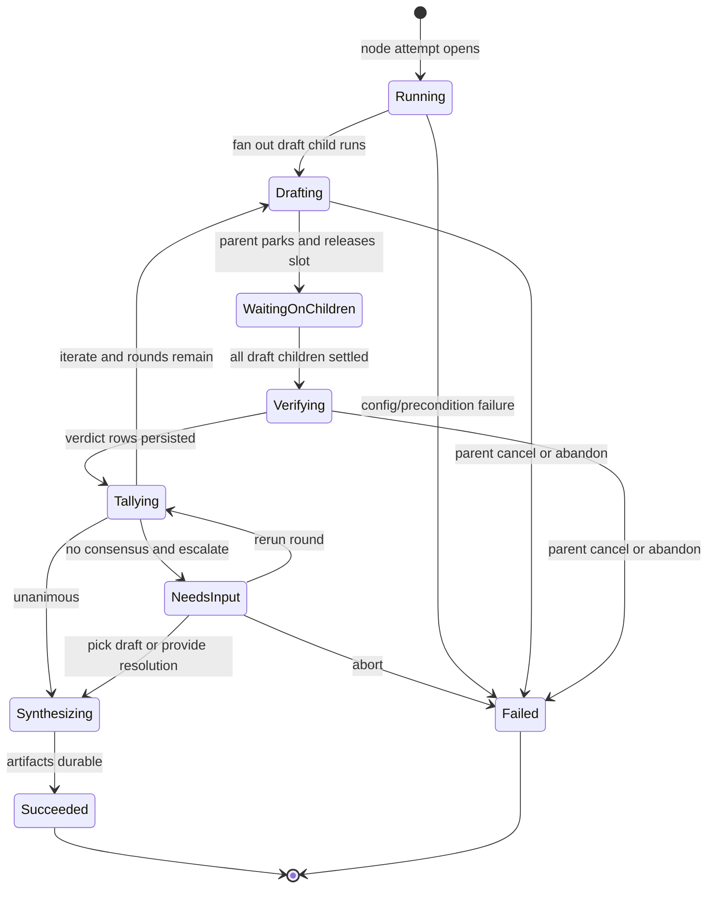
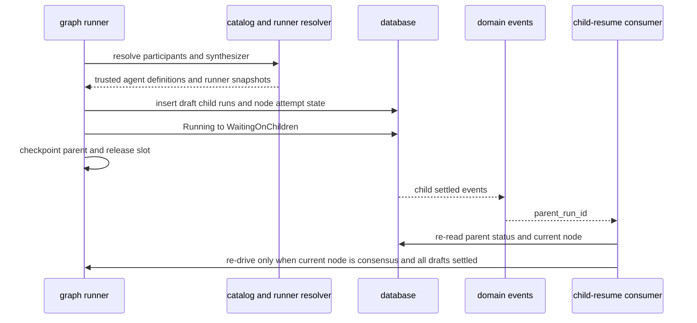
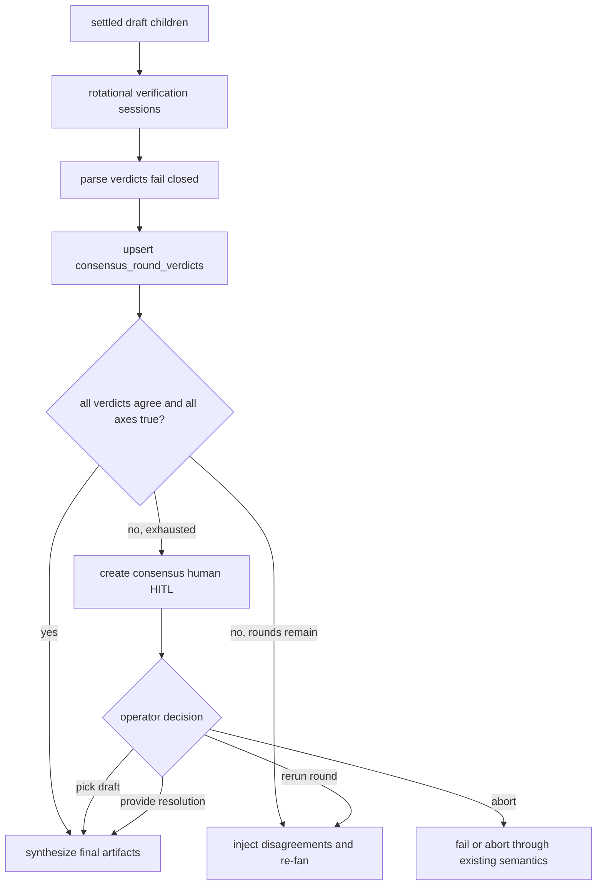
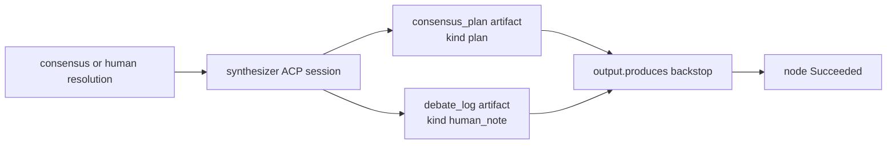

# Consensus node domain

> **Status: Implemented (M41).** Frozen SSOT:
> [`../../.ai-factory/specs/feature-m41-consensus-node.md`](../../.ai-factory/specs/feature-m41-consensus-node.md).
> Decision: [ADR-109](../decisions.md#adr-109-consensus-flow-graph-node--engine-owned-unanimous-draft-verification-and-human-resolution).
>
> **M42 (Designed):** participant/synthesizer `runner` uses the unified
> `flowRunnerConfigSchema` and resolves through portable per-slot bindings
> (`consensus:<nodeId>:<participantId>` / `consensus:<nodeId>:synthesizer`), not a
> direct `platform_acp_runners.id`; identical-intent participants stay distinct
> slots. See [`sessions.md`](sessions.md) /
> [ADR-114](../decisions.md#adr-114-unified-flow-runner-config-first-class-sessions-per-project-connect-time-bindings-and-run_sessions-as-the-sole-run-runner-source-of-truth).

## Purpose

The consensus node domain owns the `consensus` flow-graph node lifecycle: fan
out read-only draft child runs, park the parent while children execute, verify
drafts through rotational in-node ACP sessions, tally unanimous agreement over
author-declared material axes, escalate no-consensus cases to human HITL, and
synthesize the final answer artifacts. It does not own the base run state
machine ([runs.md](runs.md)), generic graph traversal ([flow-graph.md](flow-graph.md)),
or the orchestrator delegation MCP toolset ([orchestrator.md](orchestrator.md)).

## Domain entities

- **Consensus node** (Implemented) — a `type: consensus` graph node requiring
  `engine_min >= "1.9.0"`, recorded as `node_attempts.node_type = consensus`.
- **Participant** (Implemented) — ordered config entry with stable `id` and exactly
  one of `agent` or `runner`; resolved at launch through agent definition or
  runner resolution.
- **Draft child run** (Implemented) — governed `run_kind = agent` child row with
  `parent_run_id`, `root_run_id`, `delegation_snapshot`, `runner_snapshot`, and
  `launch_mode` populated by server code.
- **Consensus round** (Implemented) — one draft fan-out plus one rotational
  cross-verification pass.
- **Consensus verdict** (Implemented) — parsed verifier output for one
  verifier-target pair in one round.
- **`consensus_round_verdicts`** (Implemented) — verdict ledger table keyed by
  `(node_attempt_id, round, verifier_key, target_key)`.
- **Consensus HITL** (Implemented) — existing `human` HITL kind with a consensus
  schema discriminator and server-derived decision allow-list.
- **Consensus artifacts** (Implemented) — current `consensus_plan` (`kind = plan`)
  and current `debate_log` (`kind = human_note`).

## State machine

The consensus execution axis lives inside a normal graph node attempt and uses
the existing parent run statuses.

## Process flows

### Fan out, park, and resume

### Verify, tally, and escalate

### Synthesis and artifacts

## Expectations

- A `consensus` node MUST require `engine_min >= "1.9.0"` and MUST fail load
  with `MaisterError("CONFIG")` when the floor is missing.
- `participants[]` MUST contain at least 2 and at most
  `MAISTER_MAX_ORCHESTRATOR_FANOUT` entries, each with exactly one of `agent` or
  `runner`.
- Consensus draft children MUST be durable read-only child runs before the
  parent enters `WaitingOnChildren`.
- A consensus parent MUST wake only after every draft child in the current round
  reaches a settled state.
- A failed draft child MUST be treated as settled unavailable evidence unless
  parent cancellation or abandon is active.
- Cross-verification MUST rotate as `i audits (i + 1) mod N` and MUST persist
  one idempotent verdict row per verifier-target pair.
- Malformed verifier output MUST fail closed into a persisted disagree verdict,
  not throw away the node lifecycle.
- The tally MUST be unanimous over every verifier verdict and every declared
  `material_axes` boolean.
- No-consensus v1 MUST escalate through the existing HITL respond route with
  server-derived decisions and bounded context.
- Synthesis MUST write current `consensus_plan` and `debate_log` artifacts
  before the node transitions success.
- Consensus UI surfaces MUST use the existing Flow Studio, read-only graph,
  inbox, run-detail, and workbench patterns with EN/RU parity.
- Consensus runtime logs MUST use structured fields and MUST NOT include prompt
  bodies, draft bodies, free-form human resolution text, or artifact bodies.

## Edge cases

- **Invalid config** — too few participants, too many participants, empty axes,
  missing synthesizer, missing mandatory outputs, writable draft workspace, or
  engine floor below `1.9.0` fail as `MaisterError("CONFIG")`.
- **Stale participant or synthesizer** — a ref that parses but is no longer
  trusted or resolvable at launch fails as `MaisterError("PRECONDITION")`.
- **Draft child failure** — a failed child is settled unavailable evidence; the
  parent waits for sibling drafts before iterate/escalate.
- **Verifier malformed output** — invalid JSON, unknown axes, missing axes, and
  invalid disagreement rows persist as failed-closed disagree verdicts.
- **Capacity unavailable** — participant, verifier, or synthesizer admission
  failure uses existing queue/admission behavior or
  `MaisterError("EXECUTOR_UNAVAILABLE")`.
- **Duplicate HITL response** — a repeated or already-delivered response is
  idempotent; if the run remains `NeedsInput`, the response path schedules
  runner re-drive.
- **Resume race** — a child-settled event and a manual recovery racing to wake
  the parent converge through status/current-node guards; losers surface
  `MaisterError("CONFLICT")`.
- **Partial artifact write** — a failure after writing only one required artifact
  leaves the node resumable and not successful.

## Linked artifacts

- Decision: [ADR-109](../decisions.md#adr-109-consensus-flow-graph-node--engine-owned-unanimous-draft-verification-and-human-resolution).
- Spec: [`../../.ai-factory/specs/feature-m41-consensus-node.md`](../../.ai-factory/specs/feature-m41-consensus-node.md).
- DSL/config: [`../flow-dsl.md`](../flow-dsl.md), [`../configuration.md`](../configuration.md).
- Graph/runtime domains: [`flow-graph.md`](flow-graph.md), [`orchestrator.md`](orchestrator.md),
  [`hitl.md`](hitl.md), [`runs.md`](runs.md), [`scheduler.md`](scheduler.md),
  [`artifacts.md`](artifacts.md).
- DB docs: [`../database-schema.md`](../database-schema.md),
  [`../db/runs-domain.md`](../db/runs-domain.md).
- Screen docs: [`../screens/studio/editor.md`](../screens/studio/editor.md),
  [`../screens/runs/flow-run.md`](../screens/runs/flow-run.md),
  [`../screens/inbox.md`](../screens/inbox.md),
  [`../screens/runs/workbench.md`](../screens/runs/workbench.md).
- Source: `web/lib/flows/graph/runner-graph.ts`,
  `web/lib/flows/graph/consensus/*`, `web/lib/domain-events/orchestrator-resume.ts`
  or the generalized child-resume consumer, `web/lib/services/hitl.ts`,
  `web/lib/flows/hitl-validate.ts`, `web/lib/db/schema.ts`.
