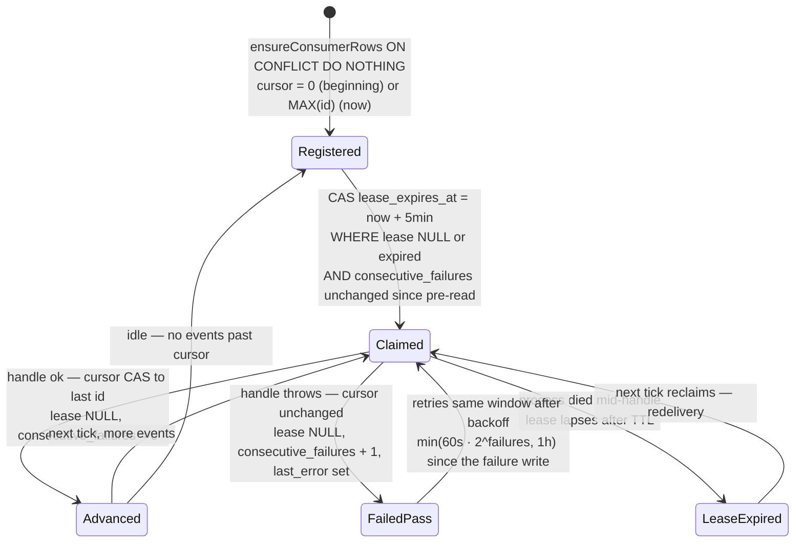
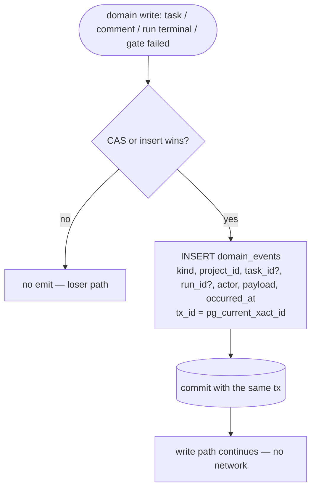
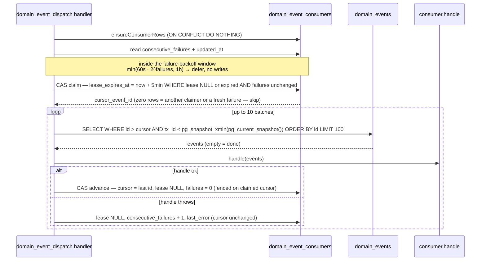
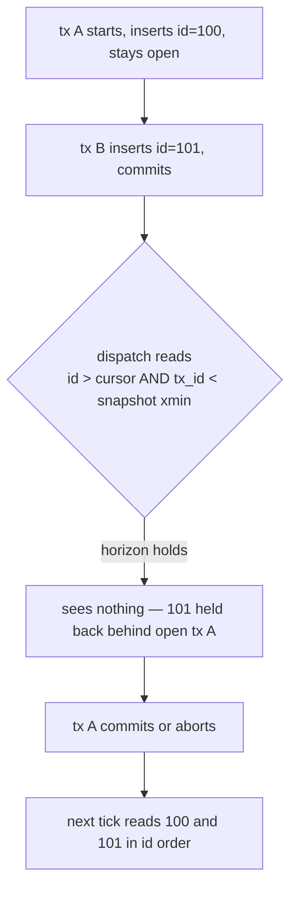

# Domain-event outbox domain

## Purpose

The domain-event outbox (**Implemented**, ADR-086, M32) is MAIster's shared
**trigger bus**: an immutable, append-only log of curated domain facts
(`domain_events`), written from the domain layer in the SAME transaction as the
state change, and a per-consumer cursor dispatcher running on the M24 clock.
Multiple independent consumers — the implemented `agent_triggers` dispatcher,
the outbound-webhooks drainer (after its later re-point), notifiers — each consume
the same log at their own pace with at-least-once delivery and cursor catch-up
after outages. Boundary: this domain owns the fact log, the consumer-cursor
mechanics, and the dispatch job; it does NOT own any delivery channel (webhooks
keep their own outbox until re-pointed — [outbound-webhooks.md](outbound-webhooks.md)),
the run state machine ([runs.md](runs.md)), the social-board audit feed
(`task_activity` stays the user-facing activity log, ADR-083), or the clock it
borrows ([scheduler.md](scheduler.md)).

## Domain entities

- **`domain_events`** (Implemented) — the append-only fact log. One row per
  emitted domain fact: `{ id (bigint identity, dispatch ordering key), kind,
  project_id, task_id?, run_id?, actor_type?, actor_id?, payload, occurred_at,
  created_at, tx_id (xid8, commit-visibility horizon) }`. The polymorphic
  `(actor_type, actor_id)` pair mirrors `task_activity` (ADR-083). No
  UPDATE/DELETE app paths; FKs cascade on project/task/run delete (events are
  trigger material, not the audit log). See [db/domain-events.md](../db/domain-events.md).
- **`domain_event_consumers`** (Implemented) — one cursor row per registered
  consumer: `{ consumer_id (PK), cursor_event_id, lease_expires_at?,
  last_dispatched_at?, last_error?, consecutive_failures }`. Claim/advance
  mechanics below. See [db/domain-events.md](../db/domain-events.md).
- **Kind taxonomy** (Implemented) — exactly 10 kinds:
  `task.created`, `task.comment_added`, `task.triage_requeued`, `run.done`,
  `run.failed`, `run.crashed`, `run.abandoned`, `run.review`, `run.escalated`,
  `gate.failed`. `run.review` (M37, ADR-100) is the settled-not-terminal signal a
  delegated child emits on reaching Review (wakes a parked orchestrator).
  `run.escalated` is the execution-policy B3 on-stuck signal (emitted when a
  human gate cannot auto-pass; migration `0056`). **(ADR-101 — Implemented)** the
  budget axis reuses this SAME kind (no new kind) with `reason=budget_exceeded`
  in its `payload` when a run/task-scope budget escalates to a `budget_breach`
  HITL.
  `task.triage_requeued` was registered with no emitter; its emitter is the
  M34 "Send to triage" action (Implemented — `triage_status = NULL` + emit +
  `triage_requeued` activity in one transaction, ADR-089). Extension rule:
  one taxonomy entry + emit site(s) in the owning domain transaction + one
  doc row + a CHECK update via migration.
  **(M37 — Implemented, ADR-098)** The four run-terminal kinds (`run.done`,
  `run.failed`, `run.crashed`, `run.abandoned`) have their `payload`
  **widened** with `parent_run_id` (the emitting run's `runs.parent_run_id`;
  `null` for a parentless run) without adding a kind — letting the
  orchestrator consumers route a child-terminal fact to its parent
  orchestrator and to any dependent auto-tasks.
  **(M37 — Implemented, ADR-100, migration 0060)** One new kind `run.review`
  is added (the CHECK extended to 9 kinds): a DELEGATED child reaching
  `Review` (a diff awaiting the coordinator). It is **settled but NOT
  terminal** (`Review → Done` via promote / `Review → Running` via rework),
  carries `parent_run_id`, and is emitted ONLY for a child with a parent (a
  top-level Review emits nothing). It wakes a parked orchestrator to
  collect/promote/rework and drives as-plan auto-promote. The payload stays
  ids/keys/statuses only (no secrets).
- **`domain_event_dispatch` job kind** (Implemented) — singleton dispatcher on
  the M24 clock (one seeded `domain_event_dispatch.default` job, cadence 60s,
  budget `domainEventDispatch: 1`, not user-creatable). See
  [scheduler.md](scheduler.md).
- **Consumer registry + `noop` consumer** (Implemented) — code-owned
  `DOMAIN_EVENT_CONSUMERS` array (`web/lib/domain-events/consumers.ts`); each
  entry declares `{ id, startFrom: "beginning" | "now", handle(events) }`. v1
  ships exactly one permanently-registered `noop` consumer (`startFrom: "now"`)
  as the live proof of the seam and an ops liveness signal.
- **`agent_triggers` consumer** (M34 — Implemented, ADR-089) — the first real
  consumer (`startFrom: "now"`): matches each event's kind + project against
  enabled `agent_schedules` event rows joined to enabled
  `agent_project_links`, skips events actored by the matched agent itself
  (the self-exclusion anti-loop guard), and claims each spawn by inserting
  the `Pending` agent run under the partial UNIQUE
  `(agent_id, trigger_event_id)` — at-least-once redelivery converges to
  exactly one run. See [agents.md](agents.md).
- **`auto_launch_run_plan` consumer** (M37 — Implemented, ADR-098/097) — the
  as-plan DAG consumer (`startFrom: "now"`) reacting to the SETTLED set
  (run-terminal kinds + `run.review`). Using the `parent_run_id` widened onto
  each settled payload, it: (1) **advances the producer task** — a successful
  as-plan child (`run.done`) flips its OWN `launch_mode='auto'` task `Done`,
  the `requires` success-gate's release condition; (2) **clears `requires`
  blockers + launches the dependent** — discovers the orchestrator's
  `parent_of` sibling tasks and, for each now-unblocked
  `launch_mode='auto'` dependent, calls `launchAgentRun` **directly**
  (cap admission happens inside that call, NOT via a separate
  `promoteNextPending` mark), idempotent under the per-task
  `hasAnyRun` belt; and (3) **auto-promotes an as-plan child** — on
  `run.review` for a `launch_mode='auto'` child it promotes it (system actor,
  `local_merge`) so the auto-DAG flows without a live coordinator (a merge
  conflict leaves the child in `Review`, logged; manual as-run children are
  coordinator-driven via `run_promote`, not promoted here). It branches on
  `run_kind`/parent-linkage BEFORE acting. See [orchestrator.md](orchestrator.md).
- **`orchestrator_resume` consumer** (M37 — Implemented, ADR-098/097) — the
  parked-coordinator wake consumer (`startFrom: "now"`), a SIBLING of
  `auto_launch_run_plan` and the ONLY consumer that wakes the parent. It
  reacts to the SETTLED set (run-terminal kinds + `run.review`): a child that
  ended `Failed`/`Crashed`/`Abandoned` ALWAYS wakes the parent; a child that
  settled success-side (`run.done` OR `run.review`) wakes it only once no
  pending (non-settled, `SETTLED_RUN_STATUSES`) sibling remains. The wake is a
  single-winner CAS `WaitingOnChildren → Running` + `session/resume` on the
  retained `acp_session_id`, closing the child's status + the `node_attempts`
  cursor in one transaction. It branches on `run_kind`/parent-linkage BEFORE
  driving any run into the flow resume driver (a child driven into the
  flow-only path would `Crash` context-less). See [agents.md](agents.md) and
  ADR-098/100.
- **`cost-rollup-reconcile` consumer** (ADR-117 — Implemented) — a low-latency
  fast-path that reconciles
  `run_cost_rollups` seconds after a terminal that *does* emit. Subscribes to the
  existing run-terminal kinds (`run.done | run.failed | run.crashed |
  run.abandoned`; NO new event kind), `startFrom: "now"` (forward-only — the
  `system_sweep` backstop owns historical backfill; see [scheduler.md](scheduler.md)
  and [observatory.md](observatory.md)). `handle(events[])` filters to terminal
  kinds, dedupes `runId`, and calls `reconcileRunCostRollups` for each **inside a
  per-run try/catch that logs WARN and never throws** — the dispatcher `break`s
  without advancing the cursor on a `handle` throw, so an always-failing run would
  otherwise stall the cursor (poison message). Self-exclusion is N/A (it spawns no
  run). It is a fast-path ONLY, never the completeness guarantee: scratch success
  emits no terminal event, so the `ended_at`-keyed sweep is what guarantees
  inclusion. Idempotent via `reconcileRunCostRollups` (delete-then-insert +
  `onConflictDoUpdate`).

## State machine

The consumer-cursor lifecycle (`domain_event_consumers` row). All transitions
Implemented.

A zombie dispatcher returning after its lease was reaped and the consumer
reclaimed cannot clobber the cursor: the advance is a CAS fenced on the cursor
value read at claim — it no-ops, converging to a duplicate delivery
(at-least-once), never a lost one.

## Process flows

### (a) Capture — same-transaction outbox INSERT (Implemented)

Capture rides the existing domain write path, exactly like the webhook outbox
(ADR-077). `emitDomainEvent` performs ONE INSERT into `domain_events` inside
the SAME transaction as the domain write — no reads, no joins, no network. It
fires only on the CAS-winner path; a losing CAS emits nothing. During the
webhooks-coexistence period, run-terminal and gate-failed sites emit BOTH the
webhook row and the domain row adjacently in the same transaction.

### (b) Dispatch tick — claim, read window, handle, advance (Implemented)

The `domain_event_dispatch` handler iterates registered consumers. Per
consumer: claim the cursor row by CAS lease, read the next window gated by the
xid8 commit horizon, invoke `handle(events)`, advance the cursor by fenced CAS.
Up to 10 batches of 100 per consumer per tick; the remainder waits for the next
tick.

### (c) Catch-up and the commit horizon (Implemented)

Missed ticks need no special path: events accumulate, the cursor stays put, and
the next tick drains the backlog in batches — recovery IS the cursor. The xid8
horizon (`tx_id < pg_snapshot_xmin(pg_current_snapshot())`) closes the
out-of-order-commit hole: identity `id` order is assignment order, not commit
order, so a plain `id > cursor` read could advance past a still-open
transaction's lower id and lose it forever. The horizon holds back ALL events
past the oldest active transaction until it resolves.

## Expectations

- The `emitDomainEvent` INSERT MUST share the transaction of its domain write
  and MUST fire only on the CAS-winner path; if the domain write does not
  commit, the event row MUST NOT exist.
- `domain_events` MUST be append-only: no UPDATE or DELETE application paths;
  any future pruning MUST honor `min(cursor_event_id)` across registered
  consumers (no pruning in this stage).
- `domain_events.kind` MUST be one of the 8 taxonomy kinds (CHECK-enforced);
  `task.triage_requeued` MUST be emitted only by the M34 "Send to triage"
  action (Implemented) — no other emitter.
- The dispatch read window MUST be exactly `id > cursor_event_id AND tx_id <
  pg_snapshot_xmin(pg_current_snapshot()) ORDER BY id LIMIT batch` — a
  late-committing lower id MUST hold back all later ids until it resolves.
- A consumer claim MUST be a CAS on `lease_expires_at` (claim only when NULL or
  expired); concurrent dispatch passes MUST yield exactly one active claimer
  per consumer.
- The cursor advance MUST be a CAS fenced on the `cursor_event_id` value read
  at claim; a zombie advance after lease reap + reclaim MUST no-op.
- Delivery MUST be at-least-once: a handler failure or a crash before advance
  MUST redeliver the same window on a later tick; consumers MUST be idempotent.
  **(M37 — Implemented, ADR-098/097)** the orchestrator engine registers TWO
  sibling consumers reacting to the SETTLED set (run-terminal kinds +
  `run.review`), each branching on `run_kind`/parent-linkage first:
  `auto_launch_run_plan` MUST clear `requires` blockers (released only on a
  producer's `Done`), launch each unblocked `launch_mode='auto'` dependent via
  `launchAgentRun` (cap admission inside that call), and auto-promote an
  as-plan child reaching `Review`; `orchestrator_resume` MUST be the only
  consumer that wakes the parent out of `WaitingOnChildren` (single-winner CAS
  + `session/resume`).
- A handler failure MUST increment `consecutive_failures`, set `last_error`,
  release the lease, and leave the cursor unchanged; a subsequent success MUST
  reset `consecutive_failures` to 0. Redelivery of the failed window MUST wait
  out an exponential backoff — `min(60s · 2^consecutive_failures, 1h)` anchored
  on the failure write's `updated_at` (a deferral performs no writes, so the
  anchor survives the window; the claim additionally CASes on
  `consecutive_failures` so a concurrently recorded failure is never retried
  inside its own window). Backoff delays the same window, never skips past it.
  There is NO auto-disable in this stage.
- Consumer registration MUST seed the cursor row idempotently (`ON CONFLICT DO
  NOTHING`) honoring `startFrom`: `"beginning"` = 0, `"now"` = current
  `MAX(id)`.
- `domain_event_dispatch` MUST be a seeded singleton (60s cadence, budget 1)
  and MUST be rejected by `createSchedulerJobSchema` (not user-creatable).
- During webhooks coexistence, every run-terminal and gate-failed
  `emitWebhookEvent` MUST have a paired `emitDomainEvent` in the same
  transaction (grep-gated), and the three webhook-less sites (`createTask`,
  `addTaskComment`, `runPass2`) MUST emit the domain event in their existing or
  newly-wrapped transaction.
- `domain_events.payload` MUST carry ids, keys, titles, and statuses only —
  never secrets, env values, tokens, or raw agent output. **(M37 — Implemented,
  ADR-098)** the four run-terminal payloads MUST additionally carry
  `parent_run_id` (the emitting run's `runs.parent_run_id`, `null` when
  parentless) WITHOUT introducing a new kind. **(M37 — Implemented, ADR-100,
  migration 0060)** the settled-not-terminal `run.review` kind MUST be emitted
  ONLY for a child with a parent and MUST carry `parent_run_id`.

## Edge cases

- **Long-running open transaction anywhere in the DB** → the horizon holds back
  all later events until it resolves (head-of-line stall, never loss). Domain
  transactions are short and migrations run offline; dispatch resumes on the
  next tick. No error.
- **Lease expiry mid-handle** (process death) → the next tick reclaims and
  redelivers the window; the consumer absorbs the duplicate (idempotence). No
  error.
- **Consumer removed from the registry** → its cursor row stays dormant
  (no claim, no advance); cleanup is deferred until pruning lands. No error.
- **Empty registry** → the dispatch handler no-ops with an INFO summary. No
  error.
- **Persistently failing consumer** → retries forever with exponential backoff
  (settling at one retry per hour at the cap, not one per tick — a stuck head
  batch with a paid side effect burns money hourly, not minutely);
  `consecutive_failures` + `last_error` + the pass summary's `deferred` count
  are the observability surface (WARN log per failing pass, INFO per deferral).
  Poison-pill policy is a first-real-consumer concern (Phase 2).
- **Project/task/run hard delete** → FK cascade removes the events; the
  durable audit trail is `task_activity` / run ledgers, not this log.

## Linked artifacts

- **Decision:** [ADR-086](../decisions.md#adr-086-domain-event-outbox-as-the-shared-trigger-bus).
- **Orchestrator consumers (M37 — Implemented):** [ADR-098](../decisions.md#adr-098-orchestrator-engine--supervisory-node-governed-run-tree-delegation-toolset-success-gated-task-dag-idle-checkpoint-waitresume)
  / [ADR-100](../decisions.md#adr-100-delegated-child-review-settle--promoterework)
  — the `auto_launch_run_plan` + `orchestrator_resume` sibling consumers, the
  run-terminal `parent_run_id` payload widening, the settled-not-terminal
  `run.review` kind (migration 0060), the success-gated `requires` relation,
  and the `WaitingOnChildren` resume.
- **Spec freeze:** [`../../.ai-factory/specs/domain-event-outbox.spec.md`](../../.ai-factory/specs/domain-event-outbox.spec.md).
- **DB:** [`db/domain-events.md`](../db/domain-events.md) and
  [`database-schema.md`](../database-schema.md) — the two tables (migration
  `0046`).
- **First real consumer (M34 — Implemented):** [`agents.md`](agents.md) — the
  `agent_triggers` consumer and the triage Q&A loop.
- **Background clock:** [`scheduler.md`](scheduler.md) — the
  `domain_event_dispatch` job kind, `domainEventDispatch: 1` budget, and the
  `domain_event_dispatch.default` 60s seed.
- **Coexisting sibling:** [`outbound-webhooks.md`](outbound-webhooks.md) — the
  webhook outbox keeps its own capture until its drainer is re-pointed at
  `domain_events` (it then becomes a registered consumer).
- **Actor model:** [`social-board.md`](social-board.md) — the polymorphic
  `(actor_type, actor_id)` pair (ADR-083).
- **Source (Implemented):** `web/lib/domain-events/*` (`taxonomy.ts`, `outbox.ts`,
  `consumers.ts`, `dispatch.ts`),
  `web/lib/scheduler/handlers/domain-event-dispatch.ts`.
