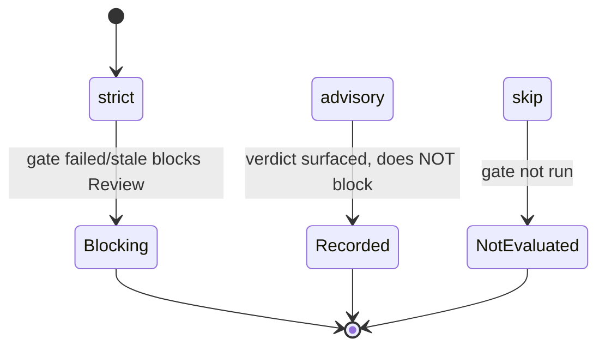
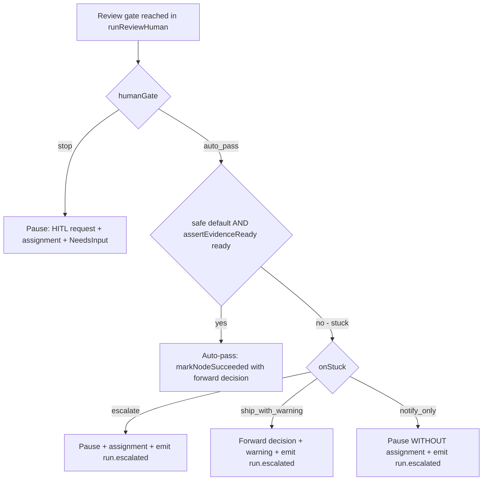
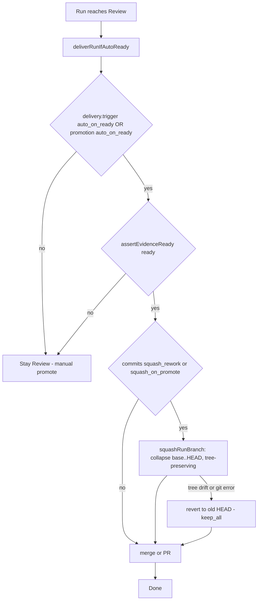

# Flow execution-control policy domain

> **Status: Implemented (2026-06-20).** The preset + nine composable axes, the
> immutable launch snapshot (`runs.execution_policy`), the fail-closed
> `*FromSnapshot` resolvers, the no-blind-ship guard, and all A/B/C axis
> mechanisms are shipped. Locked decision:
> [ADR-095](../decisions.md#adr-095-flow-execution-control-policy--snapshotted-preset--composable-autonomy-axes-fail-closed-no-blind-ship).
> Migrations `0055` (policy columns) + `0056` (`run.escalated` kind).

## Purpose

The execution policy is the contract that decides **where a flow run acts on its
own** — across machine self-correction (Group A), human escalation (Group B), and
output shaping (Group C) — and the discipline that keeps autonomy from ever
silently shipping unvalidated work. A run carries a `preset` that expands to nine
axes (each overridable), resolved once and snapshotted onto
`runs.execution_policy` at launch; every consumer reads that immutable snapshot
through a fail-closed resolver. `supervised` is today's behaviour — nothing
changes for an existing launch.

Domain boundary: the policy type + preset table + resolvers
(`web/lib/runs/execution-policy.ts`), the launch resolution/snapshot/authz
(`web/lib/services/runs.ts`), and the per-axis enforcement sites in the flow
engine, the supervisor, and the promote/delivery path. Out of scope: gate
*execution* (M11a — [`flow-graph.md`](flow-graph.md)), readiness
(M15 — [`readiness.md`](readiness.md)), the delivery policy's merge *mechanics*
(ADR-058/077 — [`outbound-webhooks.md`](outbound-webhooks.md) /
[`workspaces.md`](workspaces.md)), and the HITL substrate
([`hitl.md`](hitl.md)).

## Domain entities

- **`ExecutionPolicy`** — `{ preset, overrides? }`; the preset expands to the
  nine axes, overrides fold on top. Persisted as open jsonb on
  `runs.execution_policy` (snapshot), `projects.execution_policy_default`,
  `tasks.execution_policy` (defaults). See
  [`db/runs-domain.md`](../db/runs-domain.md).
- **Resolvers** — one fail-closed `<axis>FromSnapshot(snapshot)` per consumed
  axis; a null/absent/malformed snapshot resolves to the SAFE default.
- **`logExecPolicyAction`** — the typed audit boundary every autonomy action
  funnels through (`launched | check_downgraded | rework_exhausted |
  ralph_relaunch | escalated | permission_auto_approved | human_gate_auto_passed |
  dirty_auto_resolved | history_rewritten`).
- **`run.escalated`** — domain-event + webhook kind emitted on an on-stuck route
  (B3). See [`domain-events.md`](domain-events.md) +
  [`outbound-webhooks.md`](outbound-webhooks.md).

## Preset → axes

No preset alone trips the no-blind-ship guard: `checks` stays `strict` at every
level, so auto-pass / auto-promote always sit behind at least one validation
layer.

| Axis (group) | `supervised` | `assisted` | `unattended` |
| ------------ | ------------ | ---------- | ------------ |
| `reworkExhaustion` (A1) | escalate | escalate | escalate |
| `crashRetry` (A2) | fail | fail | ralph_loop |
| `checks` (A3) | strict | strict | strict |
| `permissions` (B1) | ask | auto_approve | auto_approve |
| `humanGate` (B2) | stop | stop | auto_pass |
| `onStuck` (B3) | escalate | escalate | escalate |
| `promotion` (C1) | manual | manual | auto_on_ready |
| `commits` (C2) | keep_all | keep_all | squash_rework |
| `dirtyResolve` (C3) | ask | proceed | proceed |

## State machine — `checks` strictness on a non-review gate (A3)

The check axis only relaxes the **promotion-block** of the non-review check
gates (`command_check | skill_check | artifact_required | external_check`); the
judge/`human_review` rework loop is never touched.

## Process flow — human gate (B2 auto-pass + B3 on-stuck routing)

When a review gate is reached, the disposition is pure
(`resolveHumanGateDisposition`); only `auto_pass` consults
`assertEvidenceReady`. The safe default is the forward (non-rework) decision.

## Process flow — output shaping at promote (C1 + C2)

## Expectations

- The resolved policy MUST be snapshotted onto `runs.execution_policy` at launch
  and read from that snapshot for the run's life; resume/recover/finalize NEVER
  re-resolve from a mutable default.
- Every `<axis>FromSnapshot` resolver MUST return the SAFE default on a null /
  absent / malformed snapshot (`checks→strict`, `crashRetry→fail`,
  `reworkExhaustion→escalate`, `permissions→ask`, `humanGate→stop`,
  `onStuck→escalate`, `promotion→manual`, `commits→keep_all`, `dirtyResolve→ask`).
- A launch whose resolved policy is a blind ship (relaxed `checks` + auto-pass
  human gate OR auto-promote) MUST be rejected with `MaisterError("PRECONDITION")`
  by `assertNoBlindShip`, server-side, before the run row is created.
- Any non-`supervised`-floor policy (auto_pass / auto_on_ready / relaxed checks /
  non-escalate on-stuck) MUST require the `launchUnattended` project action
  (≥ member); a viewer NEVER launches it.
- `humanGate=auto_pass` MUST auto-resolve a gate only when
  `assertEvidenceReady("review")` is ready AND a forward (non-rework) safe-default
  decision exists; otherwise it routes per `onStuck`, never silently passing.
- `crashRetry=ralph_loop` MUST relaunch at most `MAISTER_RALPH_MAX_ATTEMPTS`
  total attempts per task and MUST be idempotent under at-least-once redelivery
  (a relaunch fires only for the task's current latest flow run).
- `commits` squash MUST be tree-preserving: the post-rewrite `HEAD^{tree}` SHA
  equals the pre-rewrite SHA, else the branch reverts to its original HEAD and
  promotion proceeds on the unmodified history (`keep_all`). A botched history
  NEVER promotes. The squash runs pre-promotion for merge, rebase-merge, AND
  pull-request strategies (a PR branch is force-updated with `--force-with-lease`
  whenever the commit policy squashes — derived from the immutable policy, NOT a
  per-attempt squash result, so a reclaim after a transient push failure still
  force-updates the already-rewritten branch).
- `crashRetry=auto_retry` MUST re-dispatch a failed `retry_safe` node IN-RUN on a
  transient code (`SPAWN`/`EXECUTOR_UNAVAILABLE`/`CHECKPOINT`/`ACP_PROTOCOL`),
  bounded by `MAISTER_AUTO_RETRY_MAX_ATTEMPTS` total ledger attempts; an explicit
  per-node `retry_policy` takes precedence, deterministic codes never retry, and
  exhaustion fails the run.
- `dirtyResolve` MUST NEVER auto-`discard`; `commit`/`proceed` auto-resolve only
  at a review-gate pause when the worktree is dirty.
- Every autonomy action MUST funnel through `logExecPolicyAction`; an on-stuck
  route MUST emit `run.escalated` (domain-event + webhook).

## Edge cases

- **Corrupt / legacy-null policy snapshot** → every resolver fail-closes to its
  safe default (no exception); the run behaves as `supervised` for that axis.
- **Blind-ship combination at launch** → `MaisterError("PRECONDITION")`; the
  launch dialog also disables the conflicting option client-side.
- **`ship_with_warning` with no forward decision** → cannot ship; the disposition
  falls back to an escalate-pause.
- **Squash tree drift / git failure** → `squashRunBranch` reverts to the original
  HEAD and returns not-squashed; the promote keeps the full history. Never throws
  (`code` surfaced only in logs, not the promote result).
- **`commits=defer` / `commits=squash_on_promote`** → `defer` behaves as
  `keep_all` (no separate deferral step today); `squash_on_promote` is an explicit
  alias of `squash_rework` (both collapse `base..HEAD` pre-promotion).
- **Ralph relaunch when the global cap is full** → the new run is created
  `Pending` and auto-promotes when a slot frees (`MaisterError` never raised by
  the consumer; `handle` never throws).
- **Auto-promote with no run creator** → `deliverRunIfAutoReady` degrades the
  delivery snapshot to `manual` and leaves the run in `Review`.
- **`notify_only` pause** → a HITL request row exists (a response CAN resolve the
  run) but no assignment is created; only `run.escalated` notifies externally.

## Linked artifacts

- ADR: [ADR-095](../decisions.md#adr-095-flow-execution-control-policy--snapshotted-preset--composable-autonomy-axes-fail-closed-no-blind-ship).
- Source: `web/lib/runs/execution-policy.ts` (types + preset table + resolvers +
  `assertNoBlindShip`), `web/lib/runs/exec-policy-audit.ts` (audit boundary),
  `web/lib/flows/graph/runner-graph.ts` (A1/A3/B2/B3/C3 sites + the A2
  `auto_retry` `scheduleAutoRetry` synthesis via `resolveAutoRetryPolicy`),
  `web/lib/runs/ralph-loop.ts` (A2 `ralph_loop` consumer), `supervisor/src/acp-client.ts`
  (B1 L3), `web/lib/runs/auto-delivery.ts` (C1), `web/lib/worktree.ts`
  `squashRunBranch` + `web/lib/runs/promote.ts` (C2),
  `web/lib/runs/dirty-resolution.ts` `autoResolveDirtyAtReview` (C3).
- DB: `runs.execution_policy` + defaults — [`db/runs-domain.md`](../db/runs-domain.md),
  [`database-schema.md`](../database-schema.md); `run.escalated` —
  [`domain-events.md`](domain-events.md).
- Errors: [`error-taxonomy.md`](../error-taxonomy.md) (`PRECONDITION` for the
  no-blind-ship guard, `CONFIG` for `reworkExhaustion=fail`).
