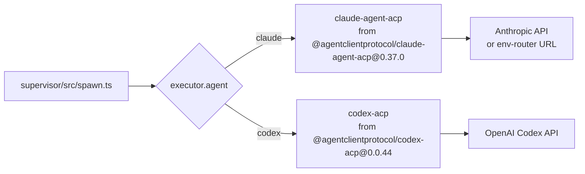
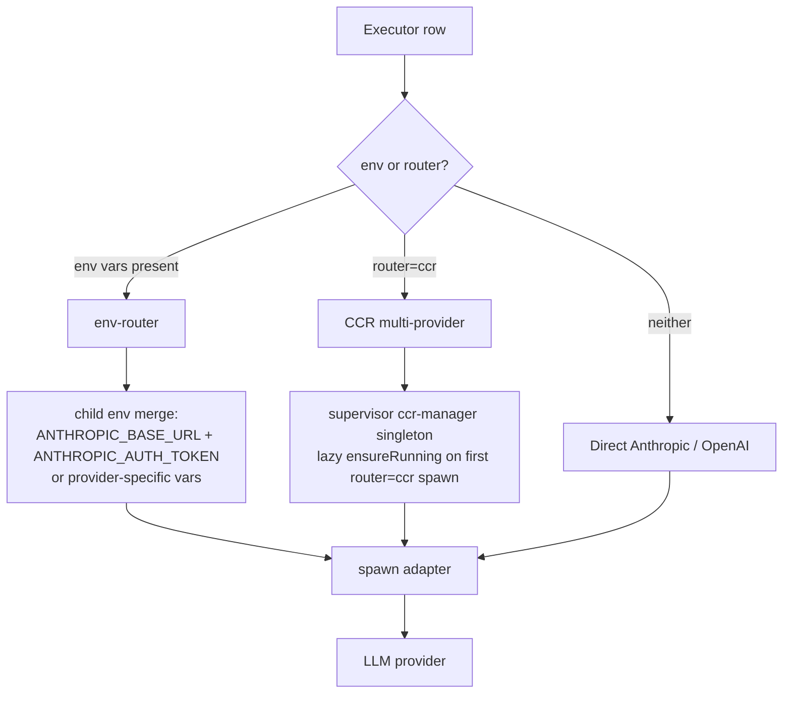
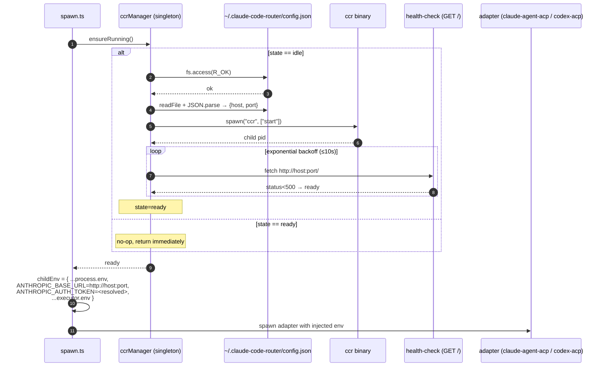
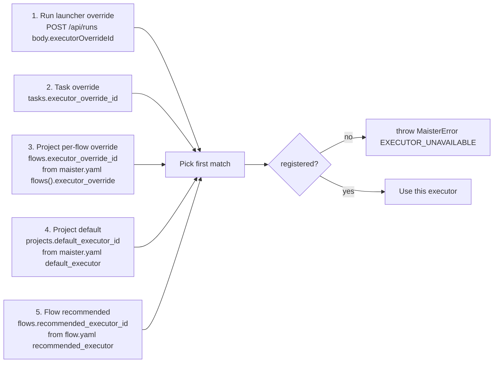
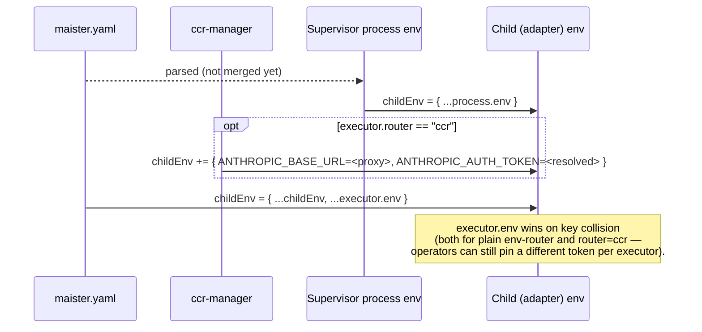

# Executors domain

## Purpose

An **executor** is the identity tuple `{agent, model, env?, router?}`
that names which coding-agent CLI MAIster spawns and which LLM provider
backs it. Executors are project-scoped (no cross-project sharing in
POC). The Flow Engine resolves which executor a given step should use
via a four-level chain.

## Domain entities

- **Executor row** — persisted as `executors` row, scoped to a project.
- **Executor agent** — `'claude' | 'codex'` on POC. Drives binary
  dispatch in `supervisor/src/spawn.ts`.
- **Model** — free-form string. The adapter validates against its own
  provider.
- **Env block** — optional `Record<string, string>` overlaid on the
  supervisor's process env when spawning the child. Used for env-router
  routing (e.g. `ANTHROPIC_BASE_URL` + `ANTHROPIC_AUTH_TOKEN`).
- **Router** — optional `'ccr'`. When set, the executor uses
  `@musistudio/claude-code-router@2.0.0` for in-session multi-provider
  routing.

## Binary dispatch

## Model routing modes

env-router is the default path — zero extra dependencies, configured
via `executor.env` in `maister.yaml`. CCR is opt-in per executor when
intelligent multi-provider routing within one session is required;
the supervisor owns the daemon lifecycle (see below).

### CCR lifecycle (router=ccr)

### CCR setup

CCR's own configuration file is the **single source of truth** for
host and port. MAIster reads it; MAIster NEVER writes it.

| What | Where |
| ---- | ----- |
| Provider keys, default model, routing rules | `~/.claude-code-router/config.json` (user-managed) |
| Host (default `127.0.0.1`) | top-level `HOST` key in that file |
| Port (default `3456`) | top-level `PORT` key in that file |
| Auth token sent to the adapter | `executor.env.ANTHROPIC_AUTH_TOKEN` ∨ `MAISTER_CCR_AUTH_TOKEN` env var |
| Test-only config path override | `MAISTER_CCR_CONFIG_PATH` env var |

There is **no** `MAISTER_CCR_PORT` env hatch. The port lives in the
config file; switching ports means editing `config.json` (and
restarting the supervisor so the manager re-reads it).

The auth token sent into the adapter as `ANTHROPIC_AUTH_TOKEN` MUST
be non-empty. CCR currently accepts any non-empty value because its
routing decisions are config-driven, not auth-driven, but the adapter
itself refuses to start without a token.

Failure modes — all surface as `EXECUTOR_UNAVAILABLE` (503) on the
web tier via the supervisor-client translation:

| Failure | Where it fires | Message contains |
| ------- | -------------- | ---------------- |
| Config file missing | `ccr-manager.ts` pre-flight before spawn | path + `docs/system-analytics/executors.md#ccr-setup` |
| Config file malformed JSON | parse step | parse reason |
| Daemon won't start (spawn error) | child `error` event | spawn error |
| Health check times out (10s) | exponential-backoff `GET /` | `failed to become ready within Xms` |
| `ANTHROPIC_AUTH_TOKEN` missing for `router=ccr` executor | `spawn.ts` after `ensureRunning()` | `set MAISTER_CCR_AUTH_TOKEN or put it in executor.env` |

The daemon is process-life-of-the-supervisor — spawned at most once
per supervisor process, killed on supervisor SIGTERM/SIGINT via the
existing shutdown handler (`main.ts`).

## Override resolution chain

The executor used by an `agent` step is the highest-priority value
that resolves to a registered executor for the project. The chain is
five tiers — per-task choice wins over per-flow rule (`task` tier 2 >
`flowOverride` tier 3).

### Computed vs launched executor

`resolveExecutor()` lives in `web/lib/executors.ts` and returns
`{executorId, tier}`. It is **pure** — no DB access, no logging side
effects. Callers fetch the rows and log the returned tier.

The function is callable two ways:

- **Launched executor** — `POST /api/runs` passes `override:
  body.executorOverrideId`. Tier 1 fires when the user picked an
  override at Launch click; otherwise the chain falls through to the
  highest tier that resolves.
- **Computed executor** — callers pass `override: undefined` (tier 1
  skipped). This is the contract M9's task-card "computed executor"
  badge calls to render *which executor a task would resolve to right
  now* without launching anything. The returned `tier` (`task`,
  `flowOverride`, `projectDefault`, or `flowRecommended`) drives the
  badge label.

Both paths share the same code; the only difference is whether tier 1
is supplied. Throws `EXECUTOR_UNAVAILABLE` when all available tiers
are nullish.

## Env merge semantics

Source of truth: `supervisor/src/spawn.ts` —
`const childEnv = { ...process.env, ...ccrLayer, ...(request.executor.env ?? {}) };`.

## Expectations

- Executor identity tuple is `{agent, model, env?, router?}`; `agent`
  enum is exactly `claude | codex` on POC.
- Executors are project-scoped; `executors.id` is unique within a
  project, NEVER shared across projects on POC.
- Adapter binary dispatch is deterministic from `executor.agent` via
  `BINARY_BY_AGENT` in `supervisor/src/spawn.ts` — no ambient lookup.
- Child env is `{ ...process.env, ...ccrLayer, ...executor.env }`;
  `executor.env` always wins on key collision (`ccrLayer` is empty
  unless `executor.router === "ccr"`).
- Override resolution is total: every `agent` step resolves to exactly
  one registered executor or fails with `EXECUTOR_UNAVAILABLE` (503).
- Override priority is exactly five tiers: launcher → task → per-flow
  → project default → flow recommended; per-task choice ALWAYS wins
  over per-flow rule.
- `resolveExecutor()` is pure (no DB / no logging) and callable with
  `override: undefined` for the M9 task-card computed-executor badge.
- env-router is the default mode and requires zero extra dependencies;
  CCR is opt-in only when `router: ccr` is set on the executor.
- CCR daemon lifecycle is supervisor-owned: lazy `ensureRunning()` on
  first `router=ccr` spawn, at most one daemon per supervisor process,
  graceful shutdown on supervisor SIGTERM/SIGINT.
- CCR host+port are read exclusively from
  `~/.claude-code-router/config.json` (defaults `127.0.0.1:3456`);
  the only env hatch is `MAISTER_CCR_CONFIG_PATH` for tests.
- Supervisor logs MUST record `hasEnv: boolean` and `routerInjected`
  for spawn telemetry; env values, API keys, tokens, and parsed CCR
  config content are NEVER logged or streamed.
- Adding a new `agent` enum value requires a coordinated change to
  `ExecutorAgentSchema` AND `BINARY_BY_AGENT` (Phase 2).

## Edge cases

- **Executor not registered** → `MaisterError("EXECUTOR_UNAVAILABLE")`
  (503). UI shows the registered list and lets the operator pick.
- **`agent` enum drift** — adding a third agent (`cursor`, `aider`)
  requires:
  1. Adding it to `ExecutorAgentSchema` in `supervisor/src/types.ts`.
  2. Adding the binary to `BINARY_BY_AGENT` in
     `supervisor/src/spawn.ts`.
  3. Phase 2 scope.
- **Adapter binary missing on PATH** → `MaisterError("SPAWN")` with
  `ENOENT` in the message.
- **`executor.env` contains a secret-looking key** — the supervisor
  logs only `hasEnv: true|false`, never the values. Verified by the
  integration test sentinel.
- **CCR config missing** → `ccr-manager` pre-flight throws
  `SupervisorError("EXECUTOR_UNAVAILABLE", "CCR config not found at
  …")` BEFORE the daemon spawns. Web tier surfaces 503 with the docs
  pointer (`docs/system-analytics/executors.md#ccr-setup`). Run
  stays in `Backlog`, the worktree is removed.
- **CCR config malformed JSON** → pre-flight parse fails with
  `EXECUTOR_UNAVAILABLE` carrying the parse reason; daemon never
  spawned.
- **CCR daemon won't reach ready in 10s** (e.g. port already bound,
  missing provider key) → child SIGTERMed, state `failed`,
  `EXECUTOR_UNAVAILABLE` with `failed to become ready within Xms`.
- **CCR daemon crashes mid-session** — the next `router=ccr` spawn
  re-runs `ensureRunning()` and brings a fresh daemon up; the
  previous adapter session sees ECONNREFUSED on its next request.
- **`ANTHROPIC_AUTH_TOKEN` missing for `router=ccr`** → after a
  successful `ensureRunning()`, `spawn.ts` throws
  `EXECUTOR_UNAVAILABLE` with the message naming both fallbacks
  (`MAISTER_CCR_AUTH_TOKEN` env OR `executor.env`).

## Linked artifacts

- ADRs: [ADR-003 ACP as runtime protocol](../decisions.md#adr-003-acp-as-the-agent-runtime-protocol),
  [ADR-004 Multi-executor](../decisions.md#adr-004-multi-executor-claude--codex-on-poc),
  [ADR-005 Model routing](../decisions.md#adr-005-model-routing-env-router-default-ccr-optional).
- Config reference: [`../configuration.md`](../configuration.md) §`maister.yaml v2`.
- ERD: [`../db/projects-domain.md`](../db/projects-domain.md) (executors table).
- API: [`../api/supervisor.openapi.yaml`](../api/supervisor.openapi.yaml)
  (`Executor` component).
- Source: `supervisor/src/types.ts` (Zod schemas),
  `supervisor/src/spawn.ts` (binary dispatch + env merge).
