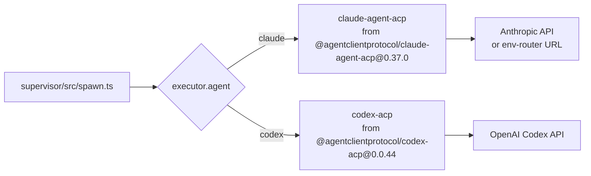
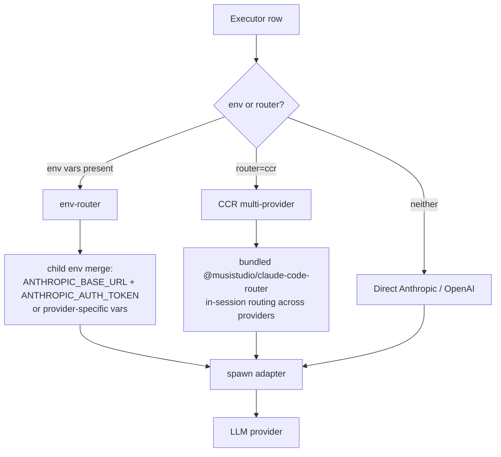
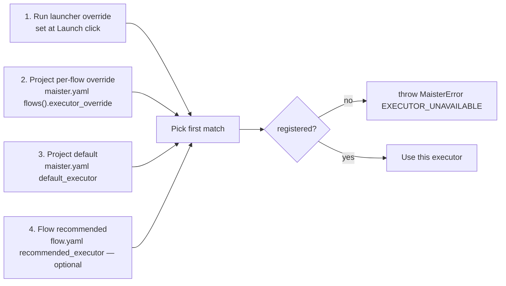
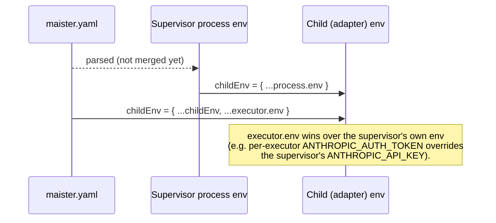

# Executors domain

## Purpose

An **executor** is the identity tuple `{agent, model, env?, router?}`
that names which coding-agent CLI MAIster spawns and which LLM provider
backs it. Executors are project-scoped (no cross-project sharing in
POC). The Flow Engine resolves which executor a given step should use
via a four-level chain.

## Domain entities

- **Executor row** — persisted as `executors` row, scoped to a project.
- **Executor agent** — `'claude' | 'codex'` on POC. Drives binary
  dispatch in `supervisor/src/spawn.ts`.
- **Model** — free-form string. The adapter validates against its own
  provider.
- **Env block** — optional `Record<string, string>` overlaid on the
  supervisor's process env when spawning the child. Used for env-router
  routing (e.g. `ANTHROPIC_BASE_URL` + `ANTHROPIC_AUTH_TOKEN`).
- **Router** — optional `'ccr'`. When set, the executor uses
  `@musistudio/claude-code-router@2.0.0` for in-session multi-provider
  routing.

## Binary dispatch

## Model routing modes

env-router is the default path — zero extra dependencies, configured
via `executor.env` in `maister.yaml`. CCR is opt-in per executor when
intelligent multi-provider routing within one session is required.

## Override resolution chain

The executor used by an `agent` step is the highest-priority value
that resolves to a registered executor for the project:

## Env merge semantics

Source of truth: `supervisor/src/spawn.ts` line ~66:
`const childEnv = { ...process.env, ...(request.executor.env ?? {}) };`.

## Edge cases

- **Executor not registered** → `MaisterError("EXECUTOR_UNAVAILABLE")`
  (503). UI shows the registered list and lets the operator pick.
- **`agent` enum drift** — adding a third agent (`cursor`, `aider`)
  requires:
  1. Adding it to `ExecutorAgentSchema` in `supervisor/src/types.ts`.
  2. Adding the binary to `BINARY_BY_AGENT` in
     `supervisor/src/spawn.ts`.
  3. Phase 2 scope.
- **Adapter binary missing on PATH** → `MaisterError("SPAWN")` with
  `ENOENT` in the message.
- **`executor.env` contains a secret-looking key** — the supervisor
  logs only `hasEnv: true|false`, never the values. Verified by the
  integration test sentinel.
- **CCR with no provider config** — CCR's own config file must be
  reachable in the child's home. Failure surfaces as the adapter
  exiting non-zero → `Crashed`.

## Linked artifacts

- ADRs: [ADR-003 ACP as runtime protocol](../decisions.md#adr-003-acp-as-the-agent-runtime-protocol),
  [ADR-004 Multi-executor](../decisions.md#adr-004-multi-executor-claude--codex-on-poc),
  [ADR-005 Model routing](../decisions.md#adr-005-model-routing-env-router-default-ccr-optional).
- Config reference: [`../configuration.md`](../configuration.md) §`maister.yaml v2`.
- ERD: [`../db/projects-domain.md`](../db/projects-domain.md) (executors table).
- API: [`../api/supervisor.openapi.yaml`](../api/supervisor.openapi.yaml)
  (`Executor` component).
- Source: `supervisor/src/types.ts` (Zod schemas),
  `supervisor/src/spawn.ts` (binary dispatch + env merge).
