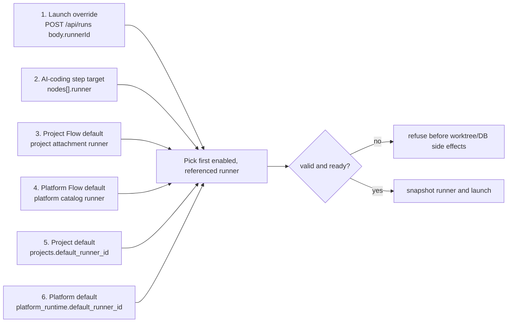
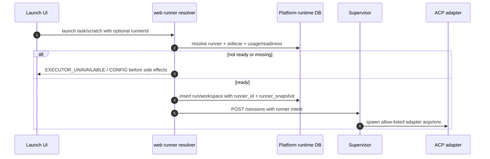

# ACP runners domain

## Purpose

An **ACP runner** is a platform-level launch profile. It tells MAIster which
ACP adapter to spawn, which model/provider route to use, which typed permission
policy applies, and which optional router sidecar must be ready before launch.

Runners are not project-scoped. Projects, Flow packages, Flow attachments,
AI-coding steps, task launches, scratch launches, and historical run snapshots
reference platform runner ids.

## Domain entities

- **Platform ACP runner** - operator-managed launch profile. Stored in
  `platform_acp_runners`.
- **Platform default runner** - exactly one enabled runner referenced from
  platform runtime settings. It is required.
- **Runner adapter** - code-owned support entry such as `claude` or `codex`.
  It exposes supported provider kinds, permission policies, diagnostics, and
  the stable `capability_agent` used by capability enforcement.
- **Router sidecar** - platform-managed helper process such as CCR. Stored in
  `platform_router_sidecars`; runners reference it by id.
- **Runner snapshot** - immutable JSON captured on run/workspace start. It
  contains the resolved launch profile, `capability_agent`, provider shape,
  sidecar reference, readiness decision, and safe display labels. It never
  stores raw secret values.
- **Usage reference** - a centralized index entry explaining why a runner or
  sidecar cannot be disabled/deleted or where it is used.

## Platform config shape

Platform runtime configuration is separate from project `maister.yaml`.

```yaml
platform:
  default_runner: claude-code

router_instances:
  - id: ccr-default
    kind: ccr
    lifecycle: managed
    command_preset: ccr_start
    config_path: ~/.claude-code-router/config.json
    base_url: http://127.0.0.1:3456
    healthcheck_url: http://127.0.0.1:3456/health
    auth_token: env:MAISTER_CCR_AUTH_TOKEN

acp_runners:
  - id: claude-code
    adapter: claude
    model: claude-sonnet-4-6
    provider:
      kind: anthropic
    permission_policy: default

  - id: claude-code-ccr
    adapter: claude
    model: glm-5.1
    provider:
      kind: anthropic_compatible
    router_instance: ccr-default
    permission_policy: default

  - id: claude-code-dangerous
    adapter: claude
    model: claude-sonnet-4-6
    provider:
      kind: anthropic
    permission_policy: dangerously_skip_permissions

  - id: codex-openai
    adapter: codex
    model: gpt-5-codex
    provider:
      kind: openai
    permission_policy: default

  - id: codex-qwen
    adapter: codex
    model: qwen3.6-plus
    provider:
      kind: openai_compatible
      base_url: https://dashscope-intl.aliyuncs.com/api/v2/apps/protocols/compatible-mode/v1
      api_key: env:DASHSCOPE_API_KEY
      wire_api: responses
    permission_policy: default
    readiness: NotReady
```

Rules:

- Runner ids are safe ids and unique platform-wide.
- Adapter ids resolve against the code-owned adapter registry.
- `capability_agent` is derived from the adapter registry and snapshotted on
  launch; it is not an operator-entered field.
- Sidecar refs must resolve to `router_instances[]`.
- Secret fields are references such as `env:NAME`, never literal tokens.
- The platform default cannot be disabled or deleted while it is default.
- A disabled runner can remain referenced by historical snapshots, but it
  cannot be selected for new launches.

## Project and Flow bindings

Project manifests reference platform runners; they do not define runner launch
profiles.

```yaml
schemaVersion: 2
project:
  name: myapp
  default_runner: inherit # or claude-code-ccr

flows:
  - id: bugfix
    source: github.com/org/flow-bugfix
    version: v1.2.3
    runner: inherit # or codex-openai
```

Flow package metadata may target a runner for an AI-coding step:

```yaml
nodes:
  - id: implement
    type: ai_coding
    runner_type: acp
    runner: claude-code-ccr
```

`runner_type` defaults to `acp` for this slice. Keeping the field explicit in
new Flow packages preserves room for future `cli` or headless runner families.

## Runtime resolution chain

MAIster resolves the runner for an AI-coding workspace/run with a strict
allow-list chain. It never guesses from a missing reference.



Resolution returns `{ runnerId, tier }`, where `tier` is one of
`launchOverride`, `stepTarget`, `projectFlowDefault`, `platformFlowDefault`,
`projectDefault`, or `platformDefault`.

## Flow load and attach remapping

When a Flow package is loaded into the platform catalog or attached to a
project, MAIster inspects AI-coding nodes. For `runner_type: acp`, each
`runner` value must resolve to a platform runner id or a persisted remapping.

Missing target behavior:

- Create a pending Flow reconfiguration requirement.
- Block platform Flow enablement or project Flow attachment until the operator
  maps the missing id to an existing platform runner or edits the Flow default.
- Log `{flowId, stepId, missingRunnerId}` at warning level.
- Do not silently fall back to platform or project defaults.

## Adapter registry

Adapter support is code-owned; operators cannot create arbitrary adapter
families in this slice.

| Adapter | Capability agent | Spawn binary | Ready launch families |
| --- | --- | --- | --- |
| `claude` | `claude` | `claude-agent-acp` | Claude direct, Claude CCR, Claude dangerous policy after adapter flag smoke |
| `codex` | `codex` | `codex-acp` | Codex OpenAI direct; third-party Responses-wire routes only after endpoint smoke |
| `gemini` | `gemini` | `gemini --acp` | Designed, ADR-084: Google Gemini/Vertex/Gateway only after SDK initialize/newSession/auth smoke |
| `opencode` | `opencode` | `opencode acp` | Designed, ADR-084: native OpenCode provider config only after binary, writable-state, stdio ACP, permission, MCP, resume, and model-channel smoke |

The adapter registry is the only source for `capability_agent`. Capability
selection, capability enforcement, native materialization, run detail, resume,
and recovery read the resolved runner snapshot or registry-derived identity.
No runtime path should read the retired `executors.agent` value as launch
truth.

Gemini/OpenCode support extends this registry rather than introducing a generic
"command runner". Operators may not enter arbitrary argv; MAIster owns the
allow-listed command shape, default arguments, binary override source,
adapter-specific ACP client capabilities, model channel, and resume strategy.

## Source-verified launch implications

Source references checked for this feature:

- Claude Code permission modes:
  <https://code.claude.com/docs/en/permission-modes>
- Codex config reference:
  <https://developers.openai.com/codex/config-reference/#configtoml>
- Codex custom-provider issue confirming project-local provider keys can be
  ignored and user-level config is the reliable route:
  <https://github.com/openai/codex/issues/21769>
- Z.AI Chat Completion endpoint:
  <https://docs.z.ai/api-reference/llm/chat-completion>
- Qwen Cloud OpenAI compatibility:
  <https://docs.qwencloud.com/api-reference/toolkitframework/openai-compatible/overview>

### Claude Code

Claude Code documents `--dangerously-skip-permissions` as equivalent to
`--permission-mode bypassPermissions`, and documents `--permission-mode` values
including `bypassPermissions`.

MAIster stores the policy as:

```yaml
permission_policy: dangerously_skip_permissions
```

The adapter provisioner maps this to an allow-listed argument sequence only
after the installed `claude-agent-acp` pass-through behavior is smoke-tested.
Until that smoke is green, dangerous-policy presets are visible but `NotReady`.

### Codex

Codex provider configuration belongs in user-level `CODEX_HOME` config/profile
files. Project-local `.codex/config.toml` files cannot override provider
selection, `model_provider`, or `model_providers`.

Codex custom providers use:

```toml
model = "qwen3.6-plus"
model_provider = "qwen"

[model_providers.qwen]
name = "Qwen Responses"
base_url = "https://dashscope-intl.aliyuncs.com/api/v2/apps/protocols/compatible-mode/v1"
env_key = "DASHSCOPE_API_KEY"
wire_api = "responses"
```

`wire_api = "responses"` is the only supported Codex value and is the default
when omitted. MAIster must materialize an isolated `CODEX_HOME` or selected
profile per runner launch rather than relying on project-local config to switch
providers.

### z.ai GLM

Z.AI documents OpenAI-compatible Chat Completions endpoints at
`https://api.z.ai/api/paas/v4/` and a GLM Coding Plan endpoint at
`https://api.z.ai/api/coding/paas/v4`. Those docs show
`/chat/completions`, not a verified Responses API endpoint. Therefore GLM
presets are stored as candidates but remain `NotReady` for Codex ACP until a
Responses-wire bridge or exact endpoint smoke passes.

### Qwen

Qwen Cloud documents both Chat Completions and a Responses-compatible endpoint.
Responses uses
`https://dashscope-intl.aliyuncs.com/api/v2/apps/protocols/compatible-mode/v1`
and `/responses`. Qwen Codex presets may become ready only after the installed
`codex-acp` launch path runs successfully with the generated isolated
`CODEX_HOME` profile and the selected model.

### Gemini CLI

Gemini CLI support is designed around the vendor ACP entrypoint
`gemini --acp`, which speaks ACP over stdio JSON-RPC. Gemini provider shapes are
separate from Anthropic/OpenAI-compatible shapes: direct Gemini API,
Vertex-hosted Gemini, and a future gateway route each carry only env-ref auth
fields. The supervisor converts those references to process env or an ACP
`authenticate` call only after the adapter-specific smoke proves the required
path.

Gemini documentation exposes `loadSession`, but MAIster's checkpoint contract is
currently built on ACP `session/resume`. Therefore Gemini checkpoint readiness is
`NotReady` until an SDK smoke proves that `loadSession` preserves the same
workspace/session invariant MAIster needs. There is no fallback from a failed
Gemini resume to `newSession`.

Gemini's ACP filesystem proxy activates only when the client advertises FS
capabilities. MAIster must keep client capabilities adapter-specific and must
not advertise generic read/write support until confined ACP FS methods exist.

### OpenCode

OpenCode support is designed around `opencode acp`. Public docs describe stdio
JSON-RPC/nd-JSON transport; local `opencode acp --help` also exposes server-like
flags (`--port`, `--hostname`, `--mdns`, `--cors`), so the implementation must
prove the effective default transport with the real ACP SDK client before any
OpenCode runner becomes `Ready`.

OpenCode provider/account configuration remains native to OpenCode in this
slice. MAIster records `agent_native` provider intent and optional env refs; it
does not synthesize a Claude/Codex provider file for OpenCode. A binary found in
PATH is not enough: readiness must also prove first-run state initialization in
the supervisor environment, because the local sandbox observed OpenCode failing
while creating its user state directory even though the Homebrew binary was
installed.

OpenCode docs say ACP mode carries configured MCP servers, agents, permissions,
formatters, and linters. MAIster still records every capability class as
`instructed` or `unsupported` until a live spike proves enforcement.

### CCR

CCR stores runtime configuration in `~/.claude-code-router/config.json`.
Documented fields include `HOST`, `APIKEY`, `Providers`, `Router`,
`NON_INTERACTIVE_MODE`, and env interpolation. The current supervisor manager
already validates `/health` instead of generic `/` to avoid mistaking another
process on the port for CCR.

In the first platform-admin slice, sidecar config is intentionally flexible for
admins:

- typed command preset, not raw shell strings;
- lifecycle mode (`managed`, `external`);
- config path;
- base URL/port;
- healthcheck URL;
- auth token env ref;
- provider config refs;
- readiness state and refresh action.

Raw secret values and raw arbitrary commands are not accepted.

## Spawn intent

The web tier resolves a runner and sends a normalized, supervisor-safe intent.
The supervisor remains the only process that maps that intent to child
environment and argv.



Spawn logs include runner id, adapter id, model label, provider kind, sidecar
boolean, permission policy, and readiness reason codes. They never include env
values, token values, parsed sidecar config content, or generated config file
bodies.

## Usage references

Runner and sidecar management uses one usage-reference service. It returns
typed references for:

- platform default runner;
- project default runners;
- platform Flow defaults;
- project Flow attachment defaults;
- Flow-step remaps;
- active runs/workspaces;
- scratch runs;
- historical run snapshots;
- runner -> sidecar refs.

Disable/delete guards, usage panels, readiness summaries, and future caches
must call this service. If a cache is introduced, rebuild/invalidation must be
deterministic on runner, sidecar, project, Flow, remapping, run, and workspace
writes.

## Readiness

Runner readiness combines:

- adapter binary availability;
- binary source (`PATH` vs explicit supervisor override), executable path, and
  cheap version probe result when available;
- first-run writable-state initialization for adapters that create user state at
  startup;
- adapter support for provider kind and permission policy;
- adapter-specific ACP initialize/newSession smoke and advertised protocol
  capabilities;
- adapter-specific auth path and required env refs;
- adapter-specific model application channel;
- adapter-specific resume/checkpoint strategy;
- sidecar existence and readiness when referenced;
- required env refs present in supervisor environment;
- no disabled/default constraint violations;
- no unsupported capability-agent materialization path;
- source-verified provider wire shape.

Unsupported configurations are shown as `NotReady` with reason codes. Launch
refuses before `git worktree add`, before run/workspace DB side effects, and
before supervisor child spawn.

Readiness computation logs at DEBUG with `runnerId`, `adapter`, `providerKind`,
binary source, and reason codes only. Supervisor diagnostics logs at INFO/WARN
with `adapter`, binary source, executable path if non-secret, exit code, and a
bounded stderr tail. No log may contain env values, provider tokens, generated
config bodies, or raw ACP payloads.

## Edge cases

- **No platform default** - startup/bootstrap and settings save fail with
  `CONFIG`.
- **Default runner disabled** - save is refused; existing historical runs keep
  rendering from snapshots.
- **Runner id missing from Flow step** - Flow enable/attach creates required
  remap dialog; launch does not fall through.
- **Sidecar referenced by runner** - sidecar disable/delete is refused while
  runner usage references exist.
- **Raw token in config/API** - request is rejected at validation boundary.
- **Codex provider is Chat Completions-only** - preset remains `NotReady`
  because Codex requires Responses wire.
- **Gemini binary present but `loadSession` unproven** - normal prompts may
  remain disabled or checkpoint-ineligible according to readiness policy;
  checkpoint resume returns `CHECKPOINT` with an actionable reason, never a
  silent `newSession` fallback.
- **OpenCode installed but first-run state is not writable** - diagnostics
  report binary availability and a distinct writable-state readiness reason;
  launch remains refused.
- **New adapter declares a strict capability class** - launch refuses with
  `CONFIG` when no adapter can enforce the class, or `EXECUTOR_UNAVAILABLE`
  when another adapter can enforce it but the resolved adapter cannot.
- **Historical runner edited/deleted** - run detail, board, portfolio, resume,
  and recovery use `runner_snapshot` instead of joining mutable runner rows.

## Linked artifacts

- [Configuration](../configuration.md)
- [Supervisor](../supervisor.md)
- [Flow DSL](../flow-dsl.md)
- [Database schema](../database-schema.md)
- [Error taxonomy](../error-taxonomy.md)
- [Model catalog](model-catalog.md) — discovers valid `model` ids for a runner draft and applies the configured model to the agent (ADR-076).
- [ADR-050](../decisions.md#adr-050-platform-acp-runners-adapter-provisioners-and-router-sidecars)
- [ADR-084](../decisions.md#adr-084-acp-adapter-families-for-gemini-cli-and-opencode)
