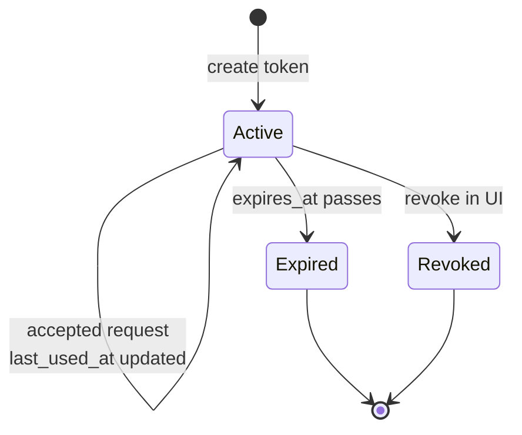
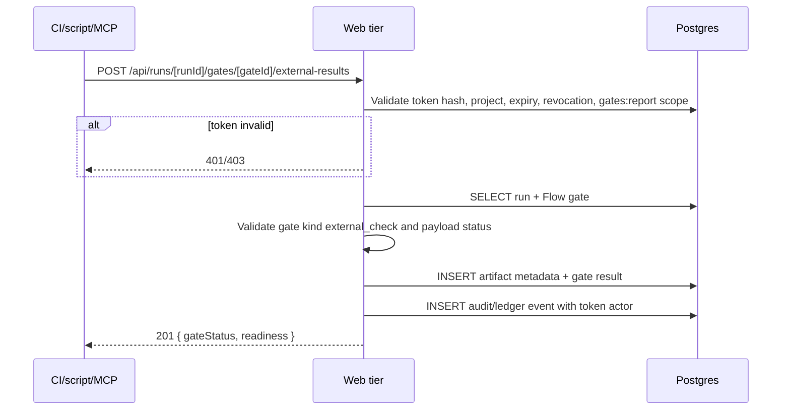
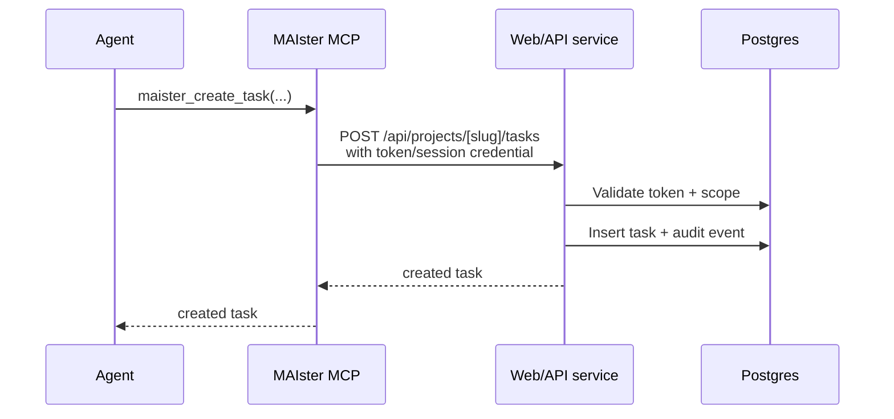

# External operations domain

## Purpose

External operations are the safe bridge between MAIster and non-UI actors:
CI, local scripts, repository automation, and running agents. The HTTP API is
the canonical contract. API tokens authorize and audit each operation. The
MAIster MCP server is a thin facade over the same service layer for agent
ergonomics, not a separate orchestration path.

## Domain entities

- **API token** — project-scoped service credential with hashed secret,
  scopes, expiry/revocation state, creator, and last-used metadata.
- **External actor** — CI job, script, MCP client, or other integration using a
  token.
- **External operation** — audited action such as task create, run launch,
  readiness read, artifact attach, or gate report.
- **External check gate** — Flow-declared gate whose result is reported by an
  external actor instead of executed by the runner.
- **External artifact** — typed metadata/payload attached by an external actor,
  such as CI status, log URL, checked commit, or test summary.

## State machine

## Process flows

### Report external gate result

### Agent uses MCP facade

## Expectations

- API tokens are managed in Project Settings, not `maister.yaml`.
- Raw token secrets are shown once and stored only as hashes.
- Tokens are scoped to one project and a finite set of operation scopes.
- Initial scopes are `tasks:create`, `tasks:read`, `tasks:update`,
  `runs:launch`, `runs:read`, `readiness:read`, `artifacts:attach`, and
  `gates:report`.
- Every accepted token request updates `last_used_at` and records an audit or
  run-ledger event with token id, actor label, project id, operation, scope,
  target resource, and result.
- External task creation and run launch use the same validation and domain
  services as the UI.
- CI and scripts report `external_check` gate results; they never mark a run
  done or promote a branch directly.
- External gate reports become normal artifacts in the evidence graph.
- Readiness treats external gate results like native gate results, including
  missing, failed, stale, skipped, and overridden states.
- The MCP server exposes only a narrow facade over the same API/service layer:
  create/list/get/update task, launch run, get run, get readiness, and report
  gate result where scope permits.
- MCP cannot bypass token scopes, Flow validation, readiness, artifact
  recording, assignment rules, or run ledger writes.
- Full RBAC remains deferred. In the current target, any project teammate can
  manage tokens; token scopes are the control boundary for integrations.

## Edge cases

- **Missing token** -> `PRECONDITION` or authentication failure response before
  domain mutation.
- **Invalid token hash** -> authentication failure response; no resource
  existence details leak.
- **Expired or revoked token** -> authentication failure response; no mutation.
- **Wrong project** -> authorization failure response; no mutation.
- **Missing scope** -> authorization failure response naming the missing scope.
- **Unknown run or gate** -> `PRECONDITION`; no artifact write.
- **Gate is not `external_check`** -> `PRECONDITION`; external actors cannot
  overwrite native command, skill, AI, artifact, or human gates.
- **Reported commit no longer matches gate input** -> result is stored but
  marked stale, and readiness remains blocked if the gate is blocking.
- **Duplicate report for the same gate/input** -> idempotent update or append
  according to the gate retry policy; never creates duplicate current results.

## Linked artifacts

- Roadmap: [`../../.ai-factory/ROADMAP.md`](../../.ai-factory/ROADMAP.md) M16.
- Product view: [`../PRODUCT_VIEW.md`](../PRODUCT_VIEW.md).
- Flow DSL: [`../flow-dsl.md`](../flow-dsl.md) Planned M16.
- Related domains: [`tasks.md`](tasks.md), [`flows.md`](flows.md),
  [`runs.md`](runs.md), [`workspaces.md`](workspaces.md).
