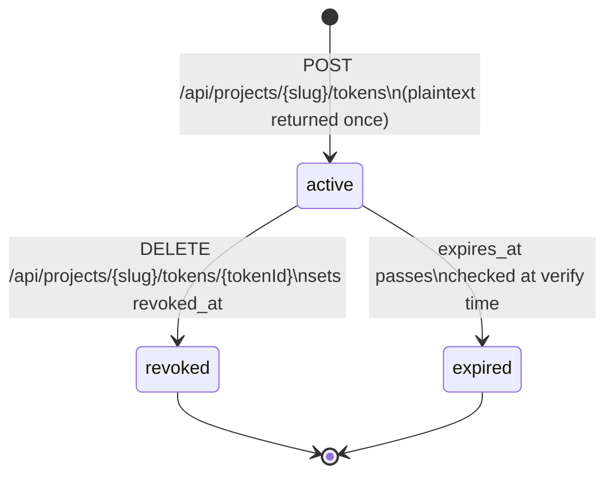
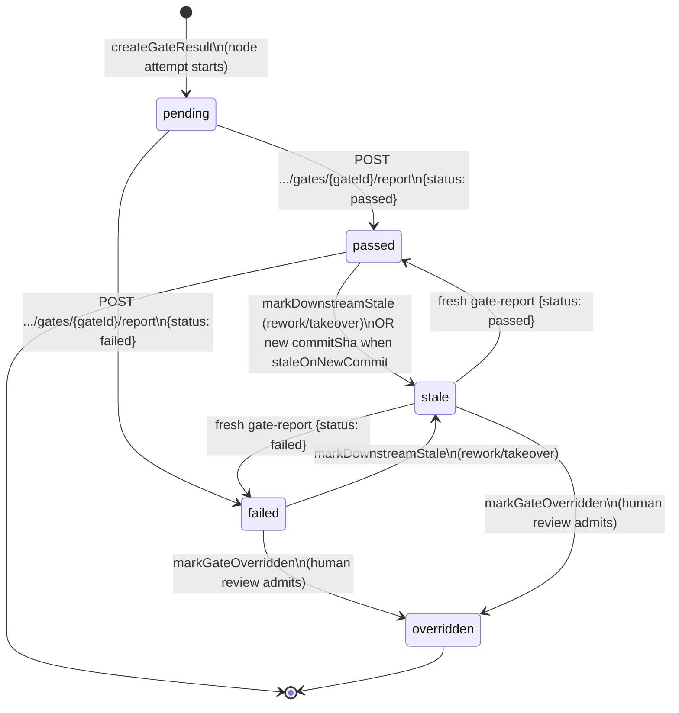
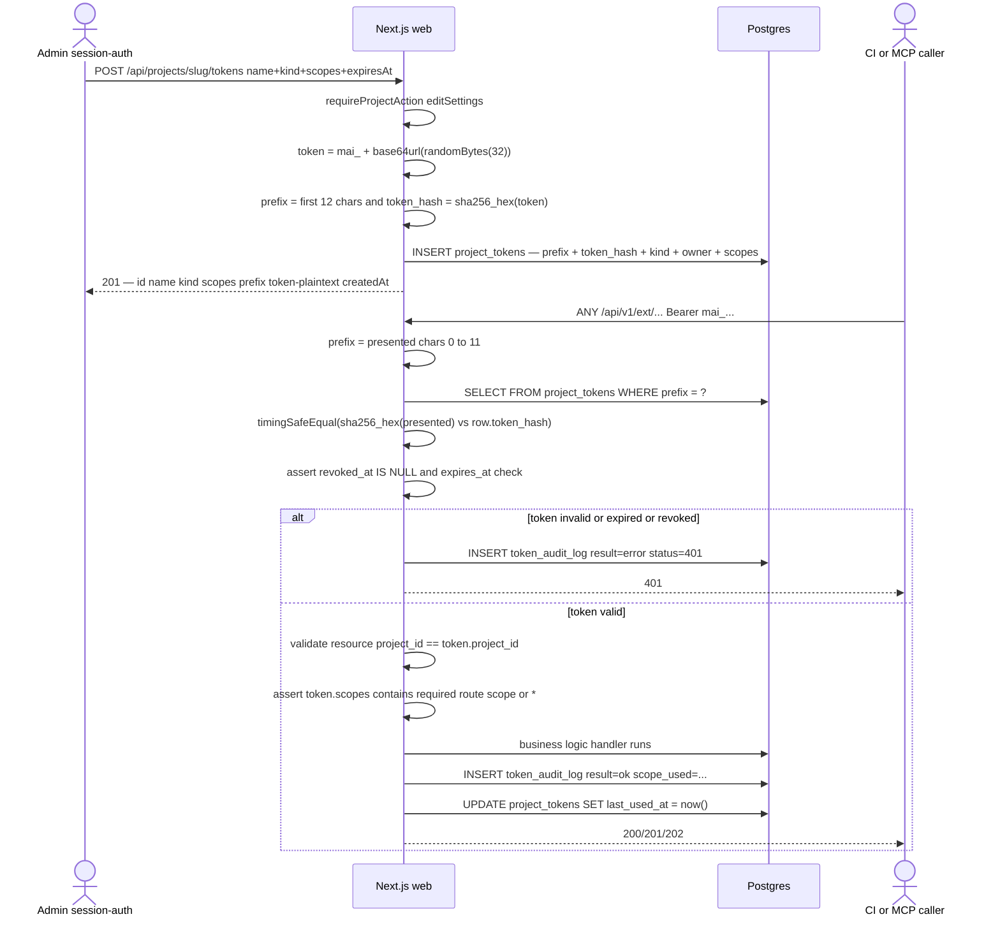
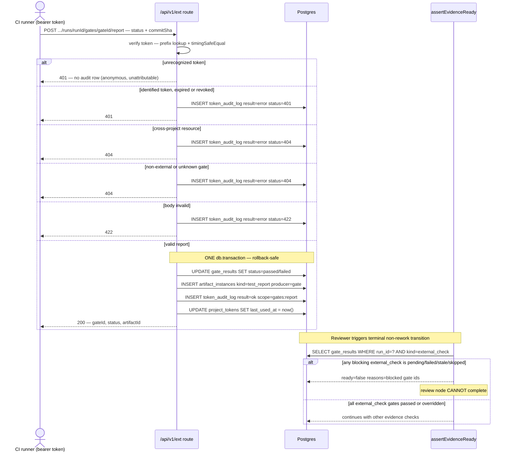
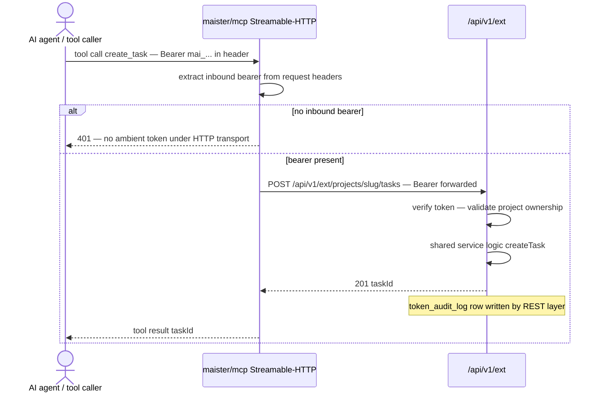

# External operations domain (M16)

> **Status: Implemented (M16), expanded by migration `0031_token_actor_scope_support.sql`.**
> Project API tokens, user-owned tokens, route-scope enforcement, token audit log,
> the `/api/v1/ext` external REST surface, the `external_check` gate report loop,
> and the thin MCP facade. Locked decisions: [ADR-040](../decisions.md#adr-040),
> [ADR-041](../decisions.md#adr-041), [ADR-042](../decisions.md#adr-042).

## Purpose

This domain covers how external callers — CI/CD pipelines, automation scripts, and
AI tool-calling agents via the MCP facade — authenticate to MAIster and interact
with the project API. A `project_tokens` row carries a sha256-hashed secret,
token kind (`project` or `user`), optional human owner, and route scopes for
`/api/v1/ext`. Every token call is recorded in `token_audit_log`. The
`external_check` gate kind closes the
CI feedback loop: an external runner posts a pass/fail report to the gate-report
endpoint, which atomically flips the gate, records a `test_report` artifact, and
writes an audit entry; `assertEvidenceReady` then enforces the result at the
review chokepoint. The thin MCP facade (`@maister/mcp`) is a standalone REST
client of `/api/v1/ext` and carries no ambient project token of its own under the
Streamable-HTTP transport.

Domain boundary: token lifecycle management (issue/verify/revoke), the
`token_audit_log` write path, the `/api/v1/ext` versioned external surface,
the `external_check` gate-report→artifact→review-refusal loop, and the MCP
transport-scoped auth model. Out of scope: session-auth routes, promotion
(M18), readiness DSL calibration (M15), HITL `confidence`/`criticality` (M17),
and platform-wide tokens. Platform tokens remain a design question until a
platform-authenticated external surface exists.

## Domain entities

- **`project_tokens`** — one row per issued token. Stores `prefix` (first 12
  chars of the token string, indexed) + `token_hash` (sha256 hex), never the
  plaintext. `token_kind='project'` represents a project automation identity.
  `token_kind='user'` records `owner_user_id` so actions can be attributed to
  the human who owns a personal agent or webhook token. `scopes` authorizes the
  matching `/api/v1/ext` route label; `*` remains the broad project API wildcard.
  See [`../db/integrations-domain.md`](../db/integrations-domain.md).
  (Implemented)
- **Agent tokens** (M34 — Implemented, ADR-089) — `token_kind='agent'` rows with
  an `agent_id` FK: per-LAUNCH ephemeral credentials for platform-agent runs.
  Issued at agent-run spawn with exactly the fixed scope set `tasks:read,
  tasks:triage, comments:read, comments:create, relations:read,
  relations:create, relations:delete`; injected server-side into the
  session's MCP-facade `mcpServers` entry; revoked at the run's terminal
  transition, on attachment detach, and by GC. Verification maps them to the
  polymorphic actor `{type: 'agent', id: agent_id}` (ADR-083's first agent
  writer) and `token_audit_log.actor_label` records `agent:<id>`. See
  [agents.md](agents.md).
- **New scopes** (M34 — Implemented) — `tasks:triage` (the triage verdict op),
  `relations:read` / `relations:create` / `relations:delete` (typed-relation
  ops), `agents:trigger` (the inbound `POST /api/agents/{agentId}/event`
  webhook trigger — the only token-authenticated route outside
  `/api/v1/ext`).
- **`token_audit_log`** — append-only audit record per `/api/v1/ext` call.
  Captures actor label, scope label, endpoint, method, result, and HTTP status
  code. See [`../db/integrations-domain.md`](../db/integrations-domain.md).
  (Implemented)
- **Token string** — `mai_` + base64url(randomBytes(32)). `prefix` = first 12
  chars of the full string. Plaintext returned once at creation, never stored.
  (Implemented)
- **`/api/v1/ext`** — versioned external REST surface; token-auth only via
  `projectToken` HTTP bearer; session auth is not accepted here. (Implemented)
- **`external_check` gate** — a `gate_results` row of `kind: external_check`
  whose status starts `pending` and is driven to `passed`/`failed` by the
  gate-report endpoint. (Implemented)
- **`assertEvidenceReady`** — the review chokepoint guard
  (`web/lib/flows/graph/evidence-readiness.ts`) extended in M16 to treat
  a blocking `external_check` in `pending`, `failed`, `stale`, or `skipped` as NOT ready.
  (Implemented)
- **MCP facade (`@maister/mcp`)** — standalone `mcp/` workspace package; eight
  tools, each a thin REST client of `/api/v1/ext`; zero DB or web coupling.
  (Implemented) ADR-078 adds `comment_create` / `comment_list` over the ext
  comment routes, following the `hitl_*` idiom. (Implemented) M34 (Implemented,
  ADR-089) adds `triage_set` (the triager's verdict op over
  `POST .../tasks/{taskId}/triage`) and `relation_add` / `relation_remove` /
  `relation_list` over the ext relation routes.

## State machine — token lifecycle

A `project_tokens` row is active from creation until it is revoked or expires.
Revocation sets `revoked_at`; no row is deleted.

Transitions:
- `[*] → active`: session-auth `POST /api/projects/{slug}/tokens` with
  `requireProjectAction(editSettings)`. Generates a 256-bit random token string,
  stores `prefix` + `sha256` hash, returns the plaintext once; `expires_at` is
  optional.
- `active → revoked`: `DELETE /api/projects/{slug}/tokens/{tokenId}` sets
  `revoked_at`; verify of a revoked token → 401.
- `active → expired`: `expires_at` is compared at verify time; past expiry → 401.
  No sweeper; expiry is evaluated on each request.

## State machine — external_check gate

The gate-report endpoint drives a `gate_results` row from `pending` through its
verdict. Staleness and override reuse the existing flow-graph machinery.

Transitions:
- `pending → passed|failed`: the gate-report endpoint atomically updates the
  `gate_results` row, records a `test_report` artifact, and writes a success
  `token_audit_log` row — all in one `db.transaction`.
- `passed → stale`: either `markDownstreamStale` on rework/takeover, or a new
  gate-report arriving with a different `commitSha` when `staleOnNewCommit !== false`
  on the gate's `external` config. No sweeper; event-driven.
- `stale → passed|failed`: a fresh gate-report supersedes the stale result.
- `failed|stale → overridden`: `markGateOverridden` — original verdict preserved,
  never deleted.

## Process flows

### Token issue, verify, and audit

Session-auth token-management routes issue and revoke tokens. The external REST
surface verifies on every call and writes an audit row.

### Gate-report: gate flip, test_report artifact, review refusal

The success path is atomic. A blocking `external_check` gate that is `pending`,
`failed`, `stale`, or `skipped` blocks `assertEvidenceReady` at the review chokepoint.

### MCP tool call via Streamable-HTTP transport

The MCP facade forwards the inbound bearer verbatim to `/api/v1/ext`. The server
holds no ambient token under the HTTP transport.

For the stdio transport (local-only), the MCP server reads `MAISTER_PROJECT_TOKEN`
from the environment and forwards it to every `/api/v1/ext` call. No per-request
bearer extraction occurs.

## Expectations

- `project_tokens.token_hash` MUST be `sha256_hex(fullTokenString)` — never
  bcrypt, never peppered. Plaintext MUST be returned exactly once at creation
  and MUST NOT be stored, logged, or re-derivable. (Implemented)
- Token verification MUST use `timingSafeEqual(sha256_hex(presented), row.token_hash)`
  against the `prefix`-indexed row; timing-safe comparison is mandatory. (Implemented)
- A token whose `project_id` does not match the addressed resource's project MUST
  return 404 to existence-hide the resource, not 401. (Implemented)
- Every `/api/v1/ext` route MUST require the matching route scope (`tasks:create`,
  `tasks:read`, `tasks:update`, `runs:launch`, `runs:read`, `readiness:read`,
  `gates:report`, `hitl:read`, or `hitl:respond` — plus `comments:read` /
  `comments:create` for the ADR-078 comment routes, Implemented) unless the
  token holds `*`.
  Scope failures return 403 `UNAUTHORIZED`, write a failure `token_audit_log`
  row, and MUST NOT reveal the token's held scopes. (Implemented)
- User-owned tokens MUST store `token_kind='user'` and `owner_user_id`. External
  task creation and run launch through such a token MUST set the resulting
  `tasks.created_by_user_id` / `runs.created_by_user_id` to the owner. Project
  tokens keep those user-attribution fields null. (Implemented)
- Every `/api/v1/ext` call presenting an **identified** token MUST write exactly
  one `token_audit_log` row — on success and on identified-token failures
  (expired / revoked / wrong-project / validation). An **unidentifiable** token
  (no `prefix` match or hash mismatch) returns 401 with NO audit row: it cannot be
  attributed (`token_audit_log.token_id` is `NOT NULL`). (Implemented)
- The gate-report success path (gate UPDATE + `test_report` artifact INSERT +
  success `token_audit_log` INSERT) MUST execute in a single `db.transaction`;
  any failure MUST roll back all three writes. (Implemented)
- A blocking `external_check` gate in `pending`, `failed`, `stale`, or `skipped` status MUST
  cause `assertEvidenceReady(runId, "review")` to return `blocked`; the review
  node MUST NOT complete its terminal non-rework transition unless the gate is
  `overridden`. (Implemented)
- `staleOnNewCommit !== false` on a passed gate MUST flip the gate to `stale`
  when a new gate-report arrives with a different `commitSha`; this is
  event-driven — there is NEVER a periodic sweeper. Concurrent reports for the
  same run MUST be serialized (Postgres `SELECT ... FOR UPDATE` on the run row
  inside the report transaction) so a double-delivered report for the SAME
  `commitSha` updates one row in place instead of appending duplicate
  superseding rows. (Implemented)
- A gate-report on a terminal run (`runs.status` ∈ `Done`/`Abandoned`/
  `Crashed`/`Failed`) MUST return 409 `CONFLICT` and mutate no gate or artifact
  state — a late report cannot re-stale an already-decided run. (Implemented)
- The Streamable-HTTP MCP transport MUST require a per-request inbound bearer
  forwarded verbatim to `/api/v1/ext`; the MCP server MUST hold no ambient
  token and MUST return 401 if no bearer is present. (Implemented)
- Session-auth routes MUST NOT accept project tokens; `/api/v1/ext` routes MUST
  NOT accept session cookies. The two auth surfaces are mutually exclusive. (Implemented)
- Token `scopes` are enforced on every `/api/v1/ext` route. The `*` wildcard is
  the compatibility path for full-project automation. (Implemented)
- `token_audit_log` rows MUST cascade-delete with their `project_tokens` row;
  project deletion MUST cascade to both `project_tokens` and `token_audit_log`.
  (Implemented)

## Edge cases

- **Token expired** (`expires_at < now()`) → 401; failure `token_audit_log` row
  written after the verification attempt, outside any success transaction.
- **Token revoked** (`revoked_at IS NOT NULL`) → 401; same failure-audit path.
- **Cross-project resource** (token's `project_id` ≠ addressed slug/run/task) →
  404 (existence-hide); failure audit written; no resource mutation.
- **Non-external or unknown gate** (gate is not `kind: external_check`, or
  `gateId` does not exist) → 404; failure audit written; no gate or artifact
  mutation.
- **Body validation failure** → 422; failure audit written; no gate or artifact
  mutation.
- **Terminal run** (`runs.status` ∈ `Done`/`Abandoned`/`Crashed`/`Failed`) →
  409 `CONFLICT`; failure audit written; no gate or artifact mutation.
- **Gate already `overridden`** → gate-report on an overridden gate returns 404
  (gate is sealed); cannot reopen via the external surface. A concurrent
  override that seals the gate after the pre-check but before the transaction
  also returns 404 (`GateNotReportableError` → 404), never 500.
- **`staleOnNewCommit` re-report with same `commitSha`** → gate flips to
  `passed`/`failed` normally; no staleness triggered.
- **Concurrent gate-reports** → serialized by a run-row `FOR UPDATE` lock; two
  reports for the SAME new `commitSha` produce exactly one fresh superseding row
  (the second updates it in place), each still writing its own
  `token_audit_log` row.
- **MCP stdio transport** → reads `MAISTER_PROJECT_TOKEN` from env; ignores any
  inbound bearer header; local-only use.
- **User token owner deleted** → `project_tokens.owner_user_id` and derived
  attribution joins become `NULL`; token rows and audit rows remain for
  historical integrity.

## Linked artifacts

- ADRs: [ADR-045](../decisions.md#adr-045) (external_check enforcement via review
  chokepoint), [ADR-046](../decisions.md#adr-046) (project API token model),
  [ADR-047](../decisions.md#adr-047) (thin MCP facade).
- DB ERD: [`../db/integrations-domain.md`](../db/integrations-domain.md),
  [`../db/erd.md`](../db/erd.md).
- DB narrative: [`../database-schema.md`](../database-schema.md)
  (`project_tokens`, `token_audit_log` sections).
- API (external surface): `docs/api/external/operations.openapi.yaml`.
- API (token management): [`../api/web.openapi.yaml`](../api/web.openapi.yaml)
  (`POST/GET/DELETE /api/projects/{slug}/tokens`).
- Error taxonomy: [`../error-taxonomy.md`](../error-taxonomy.md)
  (Token / external-API auth: 401/403/404/422).
- Related domains: [`flow-graph.md`](flow-graph.md) (gate_results,
  markDownstreamStale, markGateOverridden), [`artifacts.md`](artifacts.md)
  (test_report artifact, assertEvidenceReady),
  [`social-board.md`](social-board.md) (ADR-083 ext comment routes, actor
  mapping, Implemented).
- Configuration: [`../configuration.md`](../configuration.md)
  (`gates[].external` schema, `MAISTER_API_BASE_URL`, `MAISTER_PROJECT_TOKEN`).
- Source files (Implemented): `web/lib/db/schema.ts` + migration
  `0020_m16_api_tokens.sql` + `0031_token_actor_scope_support.sql`,
  `web/lib/tokens/` (`issue.ts`, `verify.ts`,
  `secret.ts`, `audit.ts`, `revoke.ts`, `list.ts`, `ext-handler.ts` —
  `TokenAuthError`, `httpStatusForTokenAuth`, `verifyToken`, constant-time
  hash compare), `web/app/api/v1/ext/`, `web/app/api/projects/[slug]/tokens/`,
  `web/lib/flows/graph/evidence-readiness.ts` (extended for `external_check`),
  `mcp/` (`@maister/mcp` workspace package).
