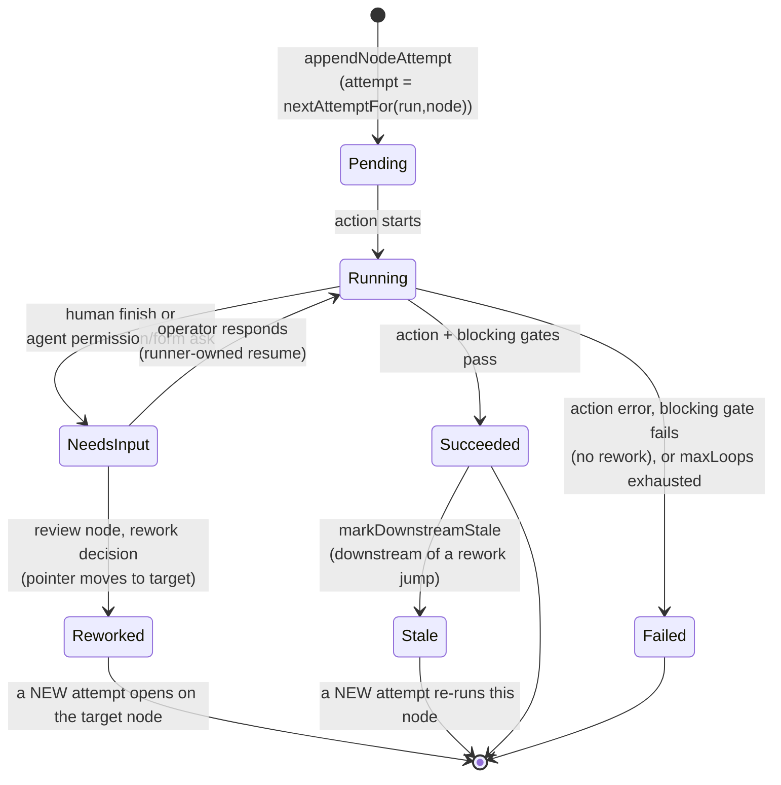
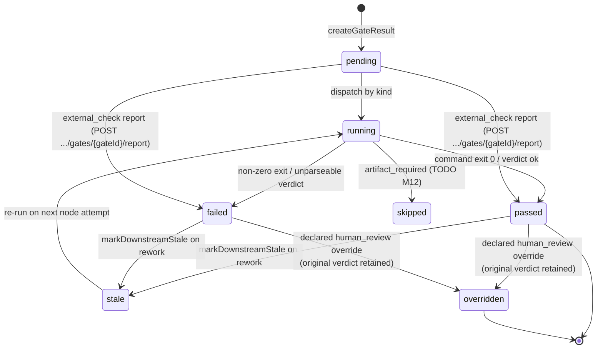
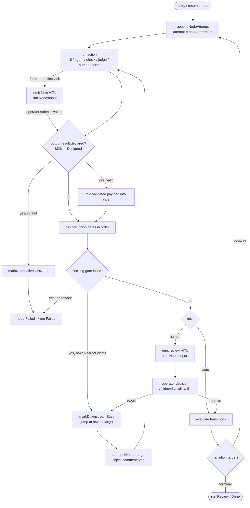
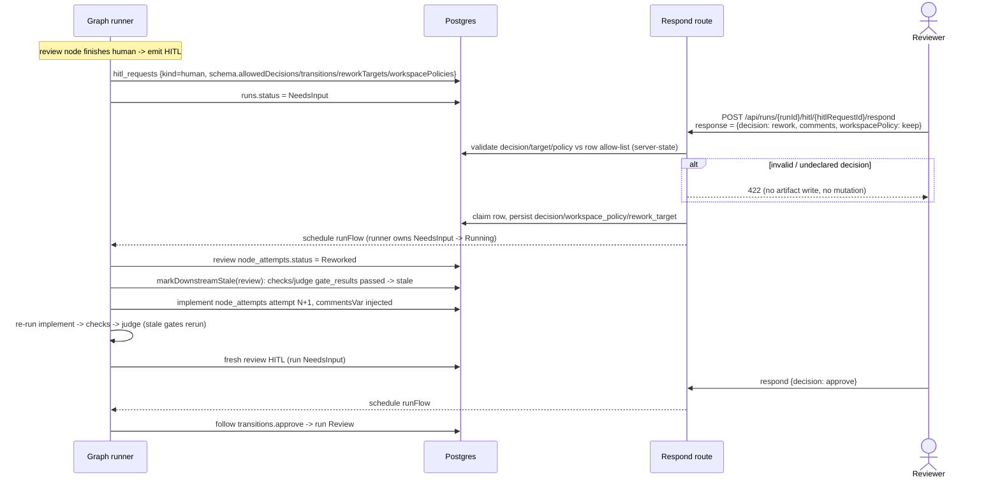
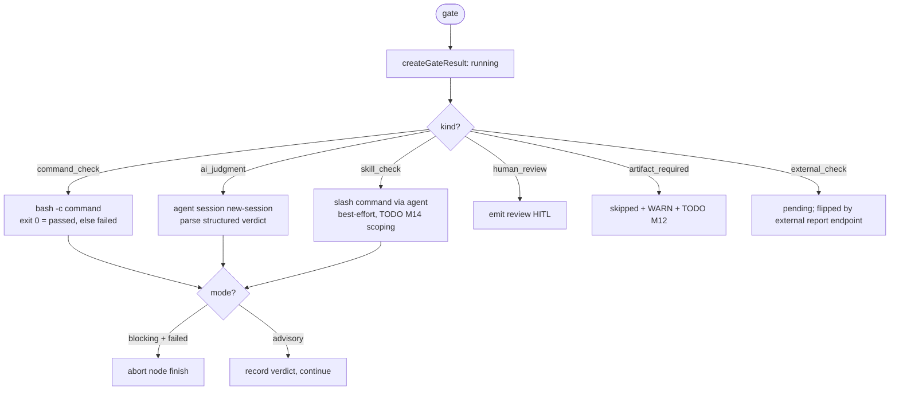
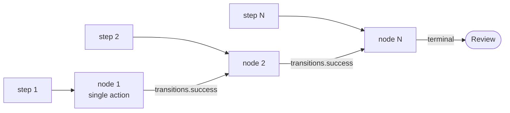

# Flow graph domain

> **Status: Implemented (M11a).** Everything in this file is the M11a Flow graph
> v1 execution model, shipped on the `feature/m11a-flow-graph-lifecycle` branch.
> Sub-parts owned by
> later milestones are tagged inline: manual takeover / `human_edit` → **M11b**;
> node `settings` enforcement → **M11c**; typed artifact instances + the
> `artifact_required` gate → **M12**; `external_check` ingestion → **M16**;
> promotion-gating readiness policy → **M15**. Decisions:
> [ADR-026](../decisions.md#adr-026-flow-graph-manifest-v1-nodes--engine-version-bump),
> [ADR-027](../decisions.md#adr-027-append-only-node_attempts-run-ledger),
> [ADR-028](../decisions.md#adr-028-full-featured-gate-execution-in-m11a-m15-re-scoped),
> [ADR-029](../decisions.md#adr-029-split-m11-into-m11a--m11b--m11c).

## Purpose

The **flow graph** domain is M11a's execution-model foundation: it replaces the
strictly linear `for (const step of steps)` walker with a validated **node
graph**, an append-only **`node_attempts`** ledger, **gate execution**, and a
**review-driven rework loop**. Its boundary is the *runtime* of a single run's
traversal — how a node enters, acts, gates, finishes, and transitions, and how a
reviewer's `rework` decision jumps the pointer back and re-stales downstream
work. Package install/trust/enablement is [`flows.md`](flows.md) /
[`flow-packages.md`](flow-packages.md); the run status machine and
keep-alive/checkpoint are [`runs.md`](runs.md); the human-ask protocol is
[`hitl.md`](hitl.md); promotion readiness is M15/M18. Linear `steps[]` flows stay
valid by compiling to single-action nodes, so this domain governs **all** runs.

## Domain entities

- **Node** — a typed unit of work in a graph manifest (`nodes[]`):
  `ai_coding | cli | check | judge | human | form`. Carries `input.requires?`,
  `output.produces?` (typed artifact decls, **M12**), a type-specific `action`,
  `pre_finish.gates?`, `finish` (auto or `human`), `transitions`, and `rework?`.
- **FlowGraph** — the normalized in-memory graph produced by `compileManifest`:
  nodes + adjacency + entry node. **Both** `steps[]` (compiled to a linear chain)
  and `nodes[]` produce one.
- **Node attempt** — `node_attempts` row; one immutable record per execution of a
  node. `attempt` auto-increments per `(run_id, node_id)`. See ERD
  [`../db/runs-domain.md`](../db/runs-domain.md).
- **Gate** — a `pre_finish` readiness check on a node:
  `command_check | skill_check | ai_judgment | artifact_required | external_check
  | human_review`, with `mode: blocking | advisory`.
- **Gate result** — `gate_results` row; one per gate execution, holding the
  structured verdict and lifecycle status. FK to the producing `node_attempts`
  row.
- **Decision** — a declared human outcome on a `finish.human` node (e.g.
  `approve`, `rework`); maps through `transitions` to a target node id.
- **Workspace policy** — declared rework worktree treatment: `keep` (M11a),
  `rewind-to-node-checkpoint` / `fresh-attempt` (validated + recorded, execution
  **M11b**).
- **Rework config** — `rework.{ allowedTargets[], workspacePolicies[], maxLoops,
  commentsVar }` on a node; bounds and routes the loop.

## State machine — node attempt (execution axis)

A node attempt is one immutable ledger row. PascalCase, extending the
`step_runs` vocabulary (see [Status vocabularies](#status-vocabularies-dual-casing--intentional)).



## State machine — gate result (verdict axis)

A gate result is lowercase — the M15 gate-verdict vocabulary
([ADR-028](../decisions.md#adr-028-full-featured-gate-execution-in-m11a-m15-re-scoped)).



### Status vocabularies (dual-casing — intentional)

The two ledgers use **different casing on purpose** — they model distinct
domains (node lifecycle vs. gate verdict), and the casing keeps them
un-confusable in code and queries:

| Ledger | Casing | Values |
| ------ | ------ | ------ |
| `node_attempts.status` | **PascalCase** | `Pending \| Running \| Succeeded \| Failed \| NeedsInput \| Reworked \| Stale` |
| `gate_results.status` | **lowercase** | `pending \| running \| passed \| failed \| stale \| skipped \| overridden` |

`node_attempts.status` **extends** the existing `step_runs.status` vocabulary
(`Pending | Running | Succeeded | Failed | Skipped | NeedsInput`): it **adds**
`Reworked` and `Stale`, and **omits** `Skipped` (a *node* is never skipped — only
a *gate* is, via `gate_results.status = 'skipped'`).

**Legacy `step_runs` → `node_attempts` mapping** (templating
highest-attempt-wins union, [ADR-027](../decisions.md#adr-027-append-only-node_attempts-run-ledger)):
the five overlapping values map **identically** (`Pending→Pending`,
`Running→Running`, `Succeeded→Succeeded`, `Failed→Failed`,
`NeedsInput→NeedsInput`). `step_runs.Skipped` has no `node_attempts` counterpart;
`node_attempts.Reworked`/`Stale` have no `step_runs` counterpart. Because the
overlap is value-identical, the templating union needs no value remapping — it
reads the highest-`attempt` `node_attempts` row for `steps.<id>` and falls back
to the `step_runs` row only when no `node_attempts` exist (legacy runs).

## Process flows

### Graph traversal + finish + transition



The `Validate` decision and its three branches are the **M26 post-action seam**
(below). For nodes without `output.result` the seam is a no-op and traversal is
unchanged.

### Structured output validate seam (M26 — Designed)

> **Status (M26 — Designed.)** Opt-in schema-validated structured output, folded
> into the existing `node_attempts.vars`. Decision:
> [ADR-063](../decisions.md#adr-063-structured-node-output-channel-p1--run-context-file-p7);
> frozen SSOT:
> `../../.ai-factory/specs/feature-m26-structured-output-run-context.md`. DSL
> field + transport contract: [`../flow-dsl.md`](../flow-dsl.md) §M26. Env wiring:
> [`../configuration.md`](../configuration.md).

After a node's action **succeeds** and **before** `pre_finish.gates` run, when the
node declares `output.result` (and `compat.engine_min >= 1.3.0`), the runner
applies a post-action validation pipeline at the existing post-action seam, then
folds the validated object into the attempt's `vars`. A node **without**
`output.result` skips the whole seam — its behavior is byte-identical to today
(`vars: {}`, no transport provisioning, no parsing).

1. **Acquire the raw payload by execution mechanism.** Agent-executed
   (`ai_coding`/`judge`) → the **last** ` ```json maister:output ` fenced block in
   the **1 MiB-capped** `result.stdout` capture (`STDOUT_CAP_BYTES`); a block
   pushed past the 1 MiB stdout cap is treated as **absent**. Cli-executed
   (`cli`/`check`) → the contents of `MAISTER_OUTPUT_FILE=<runDir>/output-<nodeId>-<attempt>.json`
   (per-attempt filename, so attempt N never inherits attempt N-1's file).
2. **Enforce `MAISTER_NODE_OUTPUT_MAX_BYTES`** (default 256 KiB) on the raw
   payload bytes.
3. **`JSON.parse`** defensively.
4. **Validate** against the declared `formSchemaSchema` `./path`. M26 **adds** a
   nested `object` type to that grammar (flat today: `string \| number \| boolean
   \| enum \| array`) — net-new work, still no `ajv` and no new dep.
5. **On success,** fold the validated object into the attempt's `vars`, persisted
   by the **existing single** `markNodeSucceeded(..., { vars })` UPDATE — no new
   write, no new crash window. A downstream node then resolves
   `{{steps.<nodeId>.vars.<key>}}` through the unchanged `reduceLedger`
   highest-attempt-wins union.
6. **On any failure** — payload absent while `required: true`, oversize past the
   cap, invalid JSON, or schema mismatch — the attempt fails with
   `markNodeFailed` + `MaisterError("CONFIG")` and the run stays unpromotable. This
   seam runs only after the agent turn reached `end_turn` (`result.ok`), at which
   point `sendPrompt` has already drained every permission deferred —
   `markNodeFailed` here leaks nothing. Payload absent while `required: false` →
   `vars` stays `{}` and the node proceeds.

### Run-context file (M26 — Designed)

> **Status (M26 — Designed.)** A session-independent JSON blackboard projecting
> run-level state, injected as a pointer into each agent node's prompt. Decision:
> [ADR-063](../decisions.md#adr-063-structured-node-output-channel-p1--run-context-file-p7).

`run.json` lives at `<worktreePath>/.maister/run.json`, written via
`atomicWriteJson` **inside the agent's worktree cwd** so both `claude` and `codex`
read it from their own working dir (no out-of-cwd-read assumption, no dependence on
`.claude` settings). The runner excludes `.maister/` for the repo by idempotently
appending it to the repo's git exclude file (resolved via `git rev-parse --git-path
info/exclude`). That file lives in the **shared common git dir**, so the exclude is
**repo-wide** (every worktree + the main checkout) and persists after worktree
removal — benign because `.maister/` is MAIster's runtime dir and is never committed.
So `run.json` never enters `git status` or the base→run diff. The
run logs (`<stepId>.log`, `run.events.jsonl`, `cost.jsonl`) stay at `<runDir>`;
only `run.json` lives in the worktree. Its shape (M26 hardcoded "all"):

```json
{
  "intent": "<task.prompt>",
  "nodes": { "<nodeId>": { "summary": "<truncated node output text>", "vars": { } } },
  "gates": { "<gateId>": { "status": "passed", "verdict": { } } },
  "promoted": { }
}
```

- `intent` = `task.prompt`.
- `nodes.<id>.summary` = the node's truncated output text (the existing
  `reduceLedger` `output` field); `nodes.<id>.vars` = the node's structured vars
  (P1; `{}` for nodes that declared none).
- `gates.<id>` = `{ status, verdict? }` for the latest result per gate — `status`
  (from `gate_results.status`) is **always present** (the only signal for
  `command_check`/`human_review`, whose `verdict` is null); `verdict` is included
  only when non-null.
- `promoted` = a flat union of every node's `vars` (the single place an agent reads
  all structured state); the key-collision tiebreak is **last-wins by `reduceLedger`
  node-iteration order** (stable for a given ledger, so regeneration is
  byte-identical). Reserved to become selective when the P7 selector lands (later
  wave).

`run.json` is a **pure projection** of `node_attempts` + `gate_results` +
`task.prompt`, rebuilt by `buildRunContext(...)` and rewritten (a) once at run
start (intent only) and (b) after every node-attempt terminal ledger write.
Because it is derived, it is **idempotent and self-healing**: a missing/stale
file is regenerated on the next node, and **correctness never depends on it** — a
fresh, cleared, or resumed session reconstructs identical state from the ledger +
worktree. The runner appends a one-line pointer `[Run context: <abs run.json path>]`
to each agent node's resolved prompt (after `renderStrict`, before dispatch — both
`new-session` and `slash-in-existing`). `run.json` is built only from `vars` +
gate results + `task.prompt` — **never** from `context.env`, so no env secret can
enter the file.

### Review-driven rework loop (criterion #3)

The migrated `aif` flow runs `plan → implement → checks → judge → review`. A
`rework` decision at `review` re-stales `checks`/`judge` and re-runs them before
the run can reach a fresh `review`.



### Gate dispatch by kind



### `steps[]` → nodes compile (back-compat)



A `steps[]` step compiles to a single-action node with
`transitions.success → next` and **no rework**; the legacy
`on_reject.goto_step` stays recorded-but-unexecuted for linear flows. Linear
flows write `node_attempts` and behave identically to the pre-M11a runner.

## Expectations

- A graph manifest declares **exactly one** of `steps` or `nodes`; both-present
  and neither-present are refused with `MaisterError("CONFIG")`.
- A graph flow (`nodes[]`) MUST declare `compat.engine_min >= 1.1.0`; otherwise
  enablement/launch refuses it with `CONFIG`.
- `node_attempts` is **append-only**: rework and retries never mutate a prior
  row; `attempt` auto-increments per `(run_id, node_id)` under
  `UNIQUE (run_id, node_id, attempt)`.
- Templating `steps.<id>.output`/`.vars`/`.exitCode` resolves the
  **highest-`attempt`** `node_attempts` row, falling back to `step_runs` only for
  legacy runs with no `node_attempts`.
- Rework is a **node-pointer move within `runs.status = 'Running'`** — never a
  new run status; there is no `HumanWorking` in M11a (that is M11b).
- `runs.current_step_id` carries the **node id** (≡ step id for compiled-linear
  nodes); the existing fail-closed resume check (unknown id in the pinned
  manifest → `Crashed` + `CONFIG`) applies to the compiled graph.
- A `blocking` gate failure aborts the node finish (run → `Failed` unless a
  rework target exists); an `advisory` gate records its verdict and the node
  continues.
- On a rework jump, `markDownstreamStale` flips dependent `gate_results`
  `passed → stale` and stale blocking gates MUST re-run before the node finishes
  again.
- A human override sets `gate_results.status = 'overridden'` and **never deletes**
  the original failed/stale verdict (override-without-erasure).
- A review `decision`/`workspacePolicy`/`reworkTarget` is validated against the
  manifest-derived allow-list stored on the `hitl_requests` row at creation time
  (server-state); an undeclared decision is refused **before** any artifact write
  or state mutation.
- `rework.maxLoops` bounds the loop (plus a hard const ceiling); exhausting it
  ends the run `Failed` with a clear error — never an unbounded cycle.
- M11a `gate_results` **feed but do not gate promotion**; refusing a merge on an
  unsatisfied required gate is the M15/M18 readiness policy, not M11a.
- **(M26 — Designed)** A node declaring `output.result` MUST have its payload
  acquired by execution mechanism (agent → last ` ```json maister:output ` block in
  the 1 MiB-capped `result.stdout`, a block past that cap treated as absent; cli →
  per-attempt `MAISTER_OUTPUT_FILE`), size-capped at
  `MAISTER_NODE_OUTPUT_MAX_BYTES`, JSON-parsed, and validated against the resolved
  `formSchemaSchema` `./path` (extended this milestone with a nested `object` type)
  BEFORE `Succeeded`, folding into the **existing** `markNodeSucceeded` `vars`
  UPDATE (no new write/migration/error code); any failure (absent-while-`required`,
  oversize, bad JSON, schema mismatch) MUST fail the attempt with
  `MaisterError("CONFIG")` and leave the run unpromotable (the seam runs after
  `end_turn`, so no ACP deferred is open and `markNodeFailed` leaks nothing) — while
  a node WITHOUT `output.result` stays byte-identical to today (`vars: {}`) and
  requires `compat.engine_min >= 1.3.0`.
- **(M26 — Designed)** `run.json` MUST exist per run at
  `<worktreePath>/.maister/run.json`, separate from logs (which stay at `<runDir>`),
  with `.maister/` appended to the repo's git exclude
  (`$(git rev-parse --git-path info/exclude)`, repo-wide and benign) so `run.json`
  is absent from `git status` and the base→run diff, as a pure idempotent projection
  of `node_attempts` + `gate_results` +
  `task.prompt` (`{intent, nodes(summary+vars), gates(status+verdict?), promoted}`)
  that a fresh/cleared/resumed session reconstructs identically; correctness MUST
  never depend on it, every agent node's prompt MUST carry the `[Run context: <abs
  path>]` pointer in both session modes, and it MUST NOT contain any value sourced
  from `context.env`.

## Edge cases

- **Unknown node id** in `transitions` / `rework.allowedTargets` / `staleFrom` /
  `input.requires` → `CONFIG` at `loadFlowManifest`.
- **Duplicate node id or gate id** → `CONFIG`.
- **Unknown gate kind** → `CONFIG`.
- **Cycle without `rework.maxLoops`** (graph cycle detection) → `CONFIG`.
- **Unsupported workspace policy** → `CONFIG`.
- **Human `decisions` targeting an undeclared transition** → `CONFIG` at load.
- **Both / neither of `steps`/`nodes`** → `CONFIG`.
- **Graph flow without `compat.engine_min >= 1.1.0`** → `CONFIG`.
- **Invalid / undeclared review decision at respond time** → 422 with no artifact
  write and no state mutation (validated against the row's server-state
  allow-list). No new `MaisterError` code.
- **`maxLoops` exhausted** → run `Failed` with a clear error.
- **Unparseable `ai_judgment` verdict** → `gate_results.status = 'failed'` with
  raw prose kept as evidence — **not** a thrown domain code
  ([ADR-008](../decisions.md#adr-008-typed-error-taxonomy-maistererror) closed
  union).
- **`artifact_required` gate** → `skipped` + WARN + `TODO(M12)` (no artifact
  instances until M12). **`external_check` gate** → starts `pending`; an external
  runner flips it via `POST /api/v1/ext/runs/{runId}/gates/{gateId}/report`, which
  drives the gate `pending → passed|failed`, records a `test_report` artifact, and
  gates review through `assertEvidenceReady` (M16).
- **Untrusted revision** → launch is refused by the M10 trust precondition
  ([ADR-021](../decisions.md#adr-021-flow-package-lifecycle-multi-revision-trust-and-compatibility))
  **before** any gate command/agent runs — no gate side-effect occurs.
- **Legacy pre-M11a `NeedsInput` run** (has `step_runs`, no `node_attempts`) →
  graph runner seeds the resume entry from the latest `step_runs` row for
  `current_step_id`; resumes without fail-closed/restart.
- **Node `settings` block present** → preserved as opaque passthrough (never
  silently stripped), `SETTINGS_NOT_ENFORCED_WARN` fires once; enforcement is
  M11c.
- **(M26 — Designed) Structured-output validation failures** at the post-action
  seam, each → attempt `Failed` + `MaisterError("CONFIG")`, run unpromotable:
  missing fenced block (agent) or absent `MAISTER_OUTPUT_FILE` (cli) while
  `required: true`; a `maister:output` block pushed past the 1 MiB `result.stdout`
  cap (treated as absent → `CONFIG` if `required`); invalid JSON; schema mismatch
  against the resolved `formSchemaSchema`; payload oversize past
  `MAISTER_NODE_OUTPUT_MAX_BYTES`. The seam runs after `end_turn`, so no ACP
  deferred is open on this path.
- **(M26 — Designed) Stale per-attempt cli output file** → a rework attempt N that
  does not re-write `output-<nodeId>-N.json` MUST NOT inherit attempt N-1's file;
  the per-attempt filename isolates it (absent-while-`required` → `CONFIG`,
  absent-while-optional → `vars: {}`).
- **(M26 — Designed) Node with no `output.result`** → the validate seam is a
  no-op; the attempt is byte-identical to pre-M26 (`vars: {}`), no transport is
  provisioned, and no `CONFIG` can arise from the seam.
- **(M26 — Designed) `array` field element shape is unconstrained** → an
  `{ type: "array" }` output field validates only `Array.isArray`; the grammar has
  no `items` slot, so element type is not checked and any array (incl. mixed/empty)
  passes. Phase-2 `items?` is the candidate. Not a `CONFIG` — an accepted
  loose-validation gap.
- **(M26 — Designed) Bad `output.result.schema` path not caught at flow load** →
  `resolveOutputResultSchema` resolves + parses + validates the schema `./path` at
  the runtime parse seam (Phase 2), NOT at manifest load
  (`validateGraphManifest`); a missing/non-JSON/malformed schema file surfaces as a
  run-time `CONFIG` at the post-action seam, not at flow install/load.
- **(M26 — Designed) `enum` field declared with no `options`** → validation matches
  the value against an empty option list, so **every** value fails and the attempt
  fails `CONFIG` at the seam. A schema-authoring footgun (pre-existing in the
  `formSchemaSchema` grammar, now reachable via `output.result`); declare
  `options` for every `enum` field.

## Linked artifacts

- ADRs:
  [ADR-026 Graph manifest](../decisions.md#adr-026-flow-graph-manifest-v1-nodes--engine-version-bump),
  [ADR-027 node_attempts ledger](../decisions.md#adr-027-append-only-node_attempts-run-ledger),
  [ADR-028 Gate execution](../decisions.md#adr-028-full-featured-gate-execution-in-m11a-m15-re-scoped),
  [ADR-029 M11 split](../decisions.md#adr-029-split-m11-into-m11a--m11b--m11c),
  [ADR-063 Structured output + run-context (M26 — Designed)](../decisions.md#adr-063-structured-node-output-channel-p1--run-context-file-p7).
- Spec (M26 — Designed):
  `../../.ai-factory/specs/feature-m26-structured-output-run-context.md` (frozen SSOT).
- ERD: [`../db/runs-domain.md`](../db/runs-domain.md),
  narrative [`../database-schema.md`](../database-schema.md).
- DSL: [`../flow-dsl.md`](../flow-dsl.md) §Flow graph node lifecycle, §Gate
  execution, §M26 (`output.result`).
- Config: [`../configuration.md`](../configuration.md) §Package contract +
  compatibility (engine bump).
- API: [`../api/web.openapi.yaml`](../api/web.openapi.yaml) (`respond` review
  decision).
- Related: [`runs.md`](runs.md), [`hitl.md`](hitl.md), [`flows.md`](flows.md),
  [`workbench.md`](workbench.md) (M22 — the read-only graph **view** + live
  node-status coloring that renders this topology).
- **(Designed, M27)** The read-only M22 graph view now has an **editor write
  path**: canvas edits serialize the manifest, run `validateGraphManifest` +
  `compileManifest` as a hard-gate (invalid manifest → `CONFIG`, not persisted),
  then PATCH the draft via the M25 `draft_version` CAS. Publishing the authored
  flow bridges it into `flows` + `flow_revisions` via
  `installAuthoredFlowPackageBridge`. See
  [`workbench.md`](workbench.md) §M27 and
  [`../system-analytics/flow-studio.md`](flow-studio.md) + ADR-067.
- Source (Implemented): `web/lib/config.schema.ts` (node/gate schema),
  `web/lib/config.ts` (`loadFlowManifest`),
  `web/lib/flows/graph/compile.ts`, `web/lib/flows/graph/runner-graph.ts`,
  `web/lib/flows/graph/ledger.ts`, `web/lib/flows/graph/gate-store.ts`,
  `web/lib/flows/graph/gates-exec.ts`, `web/lib/db/schema.ts`
  (`node_attempts`, `gate_results`).
```
