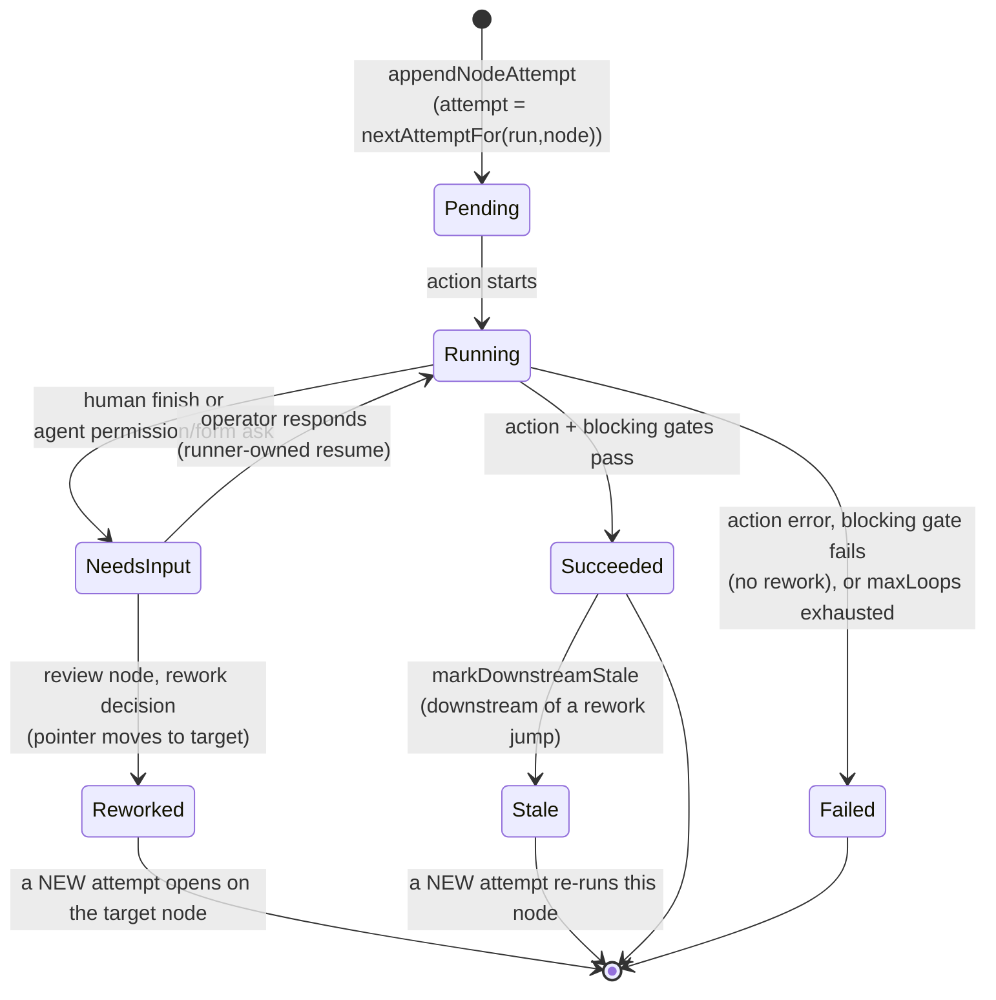
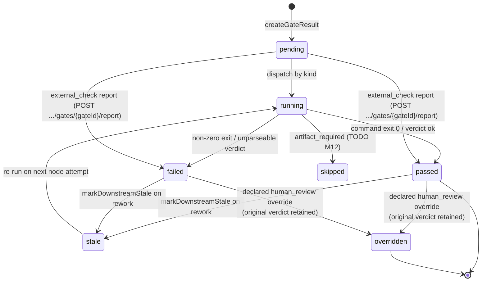
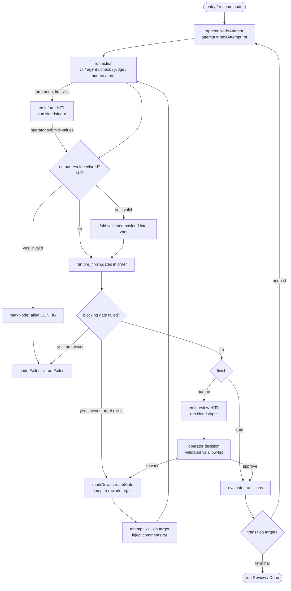
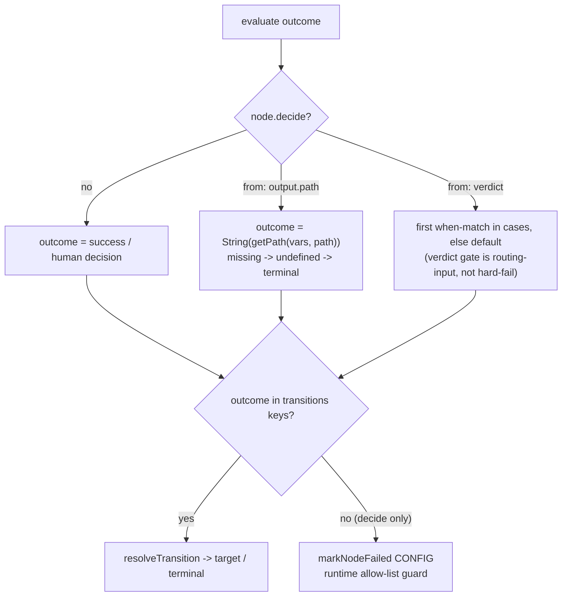
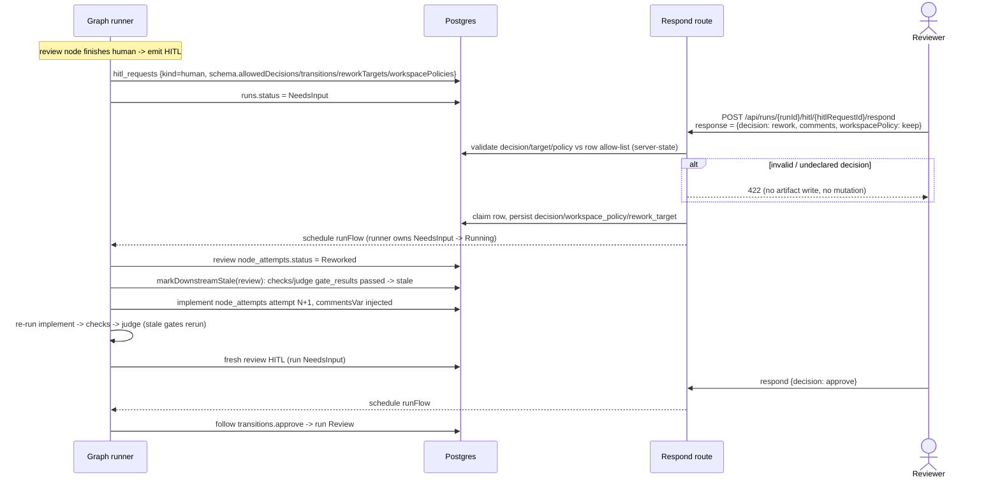
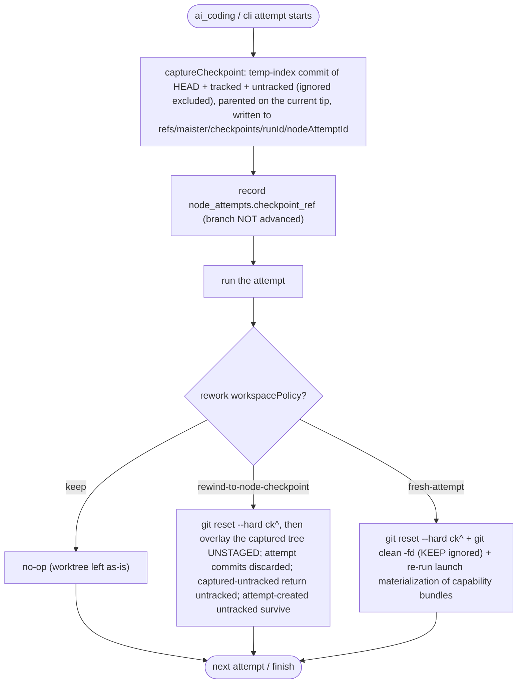

# Flow graph domain

> **Status: Implemented (M11a).** Everything in this file is the M11a Flow graph
> v1 execution model, shipped on the `feature/m11a-flow-graph-lifecycle` branch.
> Sub-parts owned by
> later milestones are tagged inline: manual takeover / `human_edit` → **M11b**;
> node `settings` enforcement → **M11c** (the `hooks` guardrail capability class
> → **M40**, see [`guardrail-hooks.md`](guardrail-hooks.md)); typed artifact
> instances + the `artifact_required` gate → **M12**; `external_check` ingestion → **M16**;
> promotion-gating readiness policy → **M15**; first-class `consensus` node →
> **M41 Implemented**, see [`consensus.md`](consensus.md); per-node runner config
> (`settings.runner`), node `session:` / top-level `sessions:` grouping, and
> `judge` as a runner-bearing node → **M42 Implemented**, see
> [`sessions.md`](sessions.md). Decisions:
> [ADR-026](../decisions.md#adr-026-flow-graph-manifest-v1-nodes--engine-version-bump),
> [ADR-027](../decisions.md#adr-027-append-only-node_attempts-run-ledger),
> [ADR-028](../decisions.md#adr-028-full-featured-gate-execution-in-m11a-m15-re-scoped),
> [ADR-029](../decisions.md#adr-029-split-m11-into-m11a--m11b--m11c).

## Purpose

The **flow graph** domain is M11a's execution-model foundation: it replaces the
strictly linear `for (const step of steps)` walker with a validated **node
graph**, an append-only **`node_attempts`** ledger, **gate execution**, and a
**review-driven rework loop**. Its boundary is the *runtime* of a single run's
traversal — how a node enters, acts, gates, finishes, and transitions, and how a
reviewer's `rework` decision jumps the pointer back and re-stales downstream
work. Package install/trust/enablement is [`flows.md`](flows.md) /
[`flow-packages.md`](flow-packages.md); the run status machine and
keep-alive/checkpoint are [`runs.md`](runs.md); the human-ask protocol is
[`hitl.md`](hitl.md); promotion readiness is M15/M18. Linear `steps[]` flows stay
valid by compiling to single-action nodes, so this domain governs **all** runs.

## Domain entities

- **Node** — a typed unit of work in a graph manifest (`nodes[]`):
  `ai_coding | cli | check | judge | human | form`, plus the M41 Implemented
  `consensus` node. Carries `input.requires?`,
  `output.produces?` (typed artifact decls, **M12**), a type-specific `action`,
  `pre_finish.gates?`, `finish` (auto or `human`), `transitions`, and `rework?`.
- **FlowGraph** — the normalized in-memory graph produced by `compileManifest`:
  nodes + adjacency + entry node. **Both** `steps[]` (compiled to a linear chain)
  and `nodes[]` produce one.
- **Node attempt** — `node_attempts` row; one immutable record per execution of a
  node. `attempt` auto-increments per `(run_id, node_id)`. See ERD
  [`../db/runs-domain.md`](../db/runs-domain.md).
- **Gate** — a `pre_finish` readiness check on a node:
  `command_check | skill_check | ai_judgment | artifact_required | external_check
  | human_review`, with `mode: blocking | advisory`.
- **Gate result** — `gate_results` row; one per gate execution, holding the
  structured verdict and lifecycle status. FK to the producing `node_attempts`
  row.
- **Decision** — a declared human outcome on a `finish.human` node (e.g.
  `approve`, `rework`); maps through `transitions` to a target node id.
- **Workspace policy** — declared rework worktree treatment: `keep` (no-op),
  `rewind-to-node-checkpoint`, `fresh-attempt`. **(M30 — Implemented, ADR-079)** all
  three execute against a per-attempt node checkpoint; pre-M30 only `keep` ran and
  the other two were validated + recorded but not executed.
- **Node checkpoint** — **(M30 — Implemented, ADR-079)** a namespaced dangling git
  ref `refs/maister/checkpoints/<runId>/<nodeAttemptId>` capturing HEAD + tracked
  + untracked (ignored excluded) before each `ai_coding`/`cli` attempt, parented
  on the current branch tip and recorded on `node_attempts.checkpoint_ref`; the
  rewind target is `<ck>^` (the pre-attempt tip). The same machinery backs the
  gate-chat neutrality baseline (ADR-078) and the review-diff `last-node` scope
  (ADR-079).
- **Rework config** — `rework.{ allowedTargets[], workspacePolicies[], maxLoops,
  commentsVar }` on a node; bounds and routes the loop.

## State machine — node attempt (execution axis)

A node attempt is one immutable ledger row. PascalCase, extending the
`step_runs` vocabulary (see [Status vocabularies](#status-vocabularies-dual-casing--intentional)).



## State machine — gate result (verdict axis)

A gate result is lowercase — the M15 gate-verdict vocabulary
([ADR-028](../decisions.md#adr-028-full-featured-gate-execution-in-m11a-m15-re-scoped)).



### Status vocabularies (dual-casing — intentional)

The two ledgers use **different casing on purpose** — they model distinct
domains (node lifecycle vs. gate verdict), and the casing keeps them
un-confusable in code and queries:

| Ledger | Casing | Values |
| ------ | ------ | ------ |
| `node_attempts.status` | **PascalCase** | `Pending \| Running \| Succeeded \| Failed \| NeedsInput \| Reworked \| Stale` |
| `gate_results.status` | **lowercase** | `pending \| running \| passed \| failed \| stale \| skipped \| overridden` |

`node_attempts.status` **extends** the existing `step_runs.status` vocabulary
(`Pending | Running | Succeeded | Failed | Skipped | NeedsInput`): it **adds**
`Reworked` and `Stale`, and **omits** `Skipped` (a *node* is never skipped — only
a *gate* is, via `gate_results.status = 'skipped'`).

**Legacy `step_runs` → `node_attempts` mapping** (templating
highest-attempt-wins union, [ADR-027](../decisions.md#adr-027-append-only-node_attempts-run-ledger)):
the five overlapping values map **identically** (`Pending→Pending`,
`Running→Running`, `Succeeded→Succeeded`, `Failed→Failed`,
`NeedsInput→NeedsInput`). `step_runs.Skipped` has no `node_attempts` counterpart;
`node_attempts.Reworked`/`Stale` have no `step_runs` counterpart. Because the
overlap is value-identical, the templating union needs no value remapping — it
reads the highest-`attempt` `node_attempts` row for `steps.<id>` and falls back
to the `step_runs` row only when no `node_attempts` exist (legacy runs).

## Process flows

### Graph traversal + finish + transition



The `Validate` decision and its three branches are the **M26 post-action seam**
(below). For nodes without `output.result` the seam is a no-op and traversal is
unchanged.

### Structured output validate seam (M26 — Implemented)

> **Status (M26 — Implemented, P1.)** Opt-in schema-validated structured output, folded
> into the existing `node_attempts.vars`. Decision:
> [ADR-063](../decisions.md#adr-063-structured-node-output-channel-p1--run-context-file-p7);
> frozen SSOT:
> `../../.ai-factory/specs/feature-m26-structured-output-run-context.md`. DSL
> field + transport contract: [`../flow-dsl.md`](../flow-dsl.md) §M26. Env wiring:
> [`../configuration.md`](../configuration.md).

After a node's action **succeeds** and **before** `pre_finish.gates` run, when the
node declares `output.result` (and `compat.engine_min >= 1.3.0`), the runner
applies a post-action validation pipeline at the existing post-action seam, then
folds the validated object into the attempt's `vars`. A node **without**
`output.result` skips the whole seam — its behavior is byte-identical to today
(`vars: {}`, no transport provisioning, no parsing).

1. **Acquire the raw payload by execution mechanism.** Agent-executed
   (`ai_coding`/`judge`) → the **last** ` ```json maister:output ` fenced block in
   the **1 MiB-capped** `result.stdout` capture (`STDOUT_CAP_BYTES`); a block
   pushed past the 1 MiB stdout cap is treated as **absent**. Cli-executed
   (`cli`/`check`) → the contents of `MAISTER_OUTPUT_FILE=<runDir>/output-<nodeId>-<attempt>.json`
   (per-attempt filename, so attempt N never inherits attempt N-1's file).
2. **Enforce `MAISTER_NODE_OUTPUT_MAX_BYTES`** (default 256 KiB) on the raw
   payload bytes.
3. **`JSON.parse`** defensively.
4. **Validate** against the declared `formSchemaSchema` `./path`. M26 **adds** a
   nested `object` type to that grammar (flat today: `string \| number \| boolean
   \| enum \| array`) — net-new work, still no `ajv` and no new dep.
5. **On success,** fold the validated object into the attempt's `vars`, persisted
   by the **existing single** `markNodeSucceeded(..., { vars })` UPDATE — no new
   write, no new crash window. A downstream node then resolves
   `{{steps.<nodeId>.vars.<key>}}` through the unchanged `reduceLedger`
   highest-attempt-wins union.
6. **On any failure** — payload absent while `required: true`, oversize past the
   cap, invalid JSON, or schema mismatch — the attempt fails with
   `markNodeFailed` + `MaisterError("CONFIG")` and the run stays unpromotable. This
   seam runs only after the agent turn reached `end_turn` (`result.ok`), at which
   point `sendPrompt` has already drained every permission deferred —
   `markNodeFailed` here leaks nothing. Payload absent while `required: false` →
   `vars` stays `{}` and the node proceeds.

### Dynamic routing — `decide` + `on_mismatch` (M38 — Implemented)

> **Status (M38 — Implemented.)** Output/verdict-driven outcome at the single
> transition site + an opt-in malformed-output rework loop. Decision:
> [ADR-103](../decisions.md#adr-103-output-driven-dynamic-routing-decide--onmismatch-rework--engine-170);
> frozen SSOT: `../../.ai-factory/specs/feature-m26-structured-output-run-context.md`
> ("Wave 2 (M38)"). DSL: [`../flow-dsl.md`](../flow-dsl.md) §decide/§on_mismatch.

At the **single outcome site** (the `Pick[evaluate transitions]` step above), the
runner computes the transition outcome. Without `decide` the outcome is the
hardcoded `"success"` (action) or the human decision — byte-identical to M11a. With
a node-level `decide` block the outcome is computed dynamically, then fed to the
**unchanged** `resolveTransition` / staleness / rework fan-out:



- **`from: output.<path>`** resolves the outcome to the value at a nested `vars`
  dot-path via a shared safe getter (`getPath`, missing → `undefined`, never
  throws). Valid on any node declaring `output.result`.
- **`from: verdict`** evaluates the `cases` (one `when` predicate each + exactly one
  `default`) against the verdict object. When a node declares `decide:{from:verdict}`
  the **engine** treats the verdict-producing gate (`ai_judgment`/`skill_check`) as
  **routing-input** — `runNodeGates` surfaces the verdict (`GateRunResult.verdict`)
  and a parseable verdict gate is recorded `passed` (verdict retained for routing +
  audit), so it never hard-fails the node finish **or** blocks review-readiness —
  with **no author `mode: advisory`**. A `confidence_min`-only node (no `decide`)
  keeps today's blocking behavior.
- **Runtime allow-list guard.** After `decide` picks an outcome the runner asserts it
  ∈ `node.transitions` keys; otherwise `markNodeFailed` + `MaisterError("CONFIG")`
  (defense in depth over the compile-time check that every *producible* outcome ⊆
  transitions keys).

**`on_mismatch` — engine-initiated rework on validation failure.** When the M26
structured-output validate seam fails (`!structuredOutput.ok`) AND the node declares
`output.result.on_mismatch`, the runner drives the **existing rework path** (same
`markNodeReworked` → `markDownstreamStale` → `pendingInjectedVars` sequence as
human-driven rework) from a non-`human` node, bounded by `rework.maxLoops`, with the
validation-error text (`structuredOutput.reason`) injected via `commentsVar`.
`on_mismatch: retry` re-targets the **same** node (self re-run, no own-id in
`transitions`/`allowedTargets` needed); `on_mismatch: <outcome>` routes via
`transitions[<outcome>]` (∈ `rework.allowedTargets`). Absent → today's M26 hard
`CONFIG` fail. Exhaustion **fails closed**: an always-malformed node halts at
`maxLoops + 1` attempts with a `Failed` run (`CONFIG`) via the loop-top
`rework.maxLoops` backstop — the escalate/ship execution-policy arms are NOT applied
(shipping invalid structured output is unsafe). **Crash-window parity:** the write
sequence is unchanged from human-rework, so a crash between `markNodeReworked` and
`markDownstreamStale` leaves the same recoverable state.

**Engine floor.** A flow declaring `decide` or `on_mismatch` requires
`compat.engine_min >= 1.7.0` (`MAISTER_ENGINE_VERSION` `1.6.0 → 1.7.0`); flows
declaring neither stay valid at any `engine_min`.

### Rework loop `onExhaustion` routing + human-driven counter reset (Implemented — ADR-118)

> **Status (Implemented.)** Two optional `rework` fields —
> `rework.onExhaustion` (loop-owning node) and `rework.resetTargets` (human node)
> — let a bounded loop escalate exhaustion to a named human node and let that
> human grant the loop a fresh budget, without an execution-policy dependency.
> [ADR-118](../decisions.md#adr-118-rework-loop-onexhaustion-routing--human-driven-counter-reset-resettargets--engine-210);
> `MAISTER_ENGINE_VERSION` `2.0.0 → 2.1.0` (`REWORK_RESET_ENGINE_MIN`).

**Baseline-aware attempt counting.** Each `node_attempts` row carries a nullable
`rework_baseline` (migration `0086`); `NULL ⇒ 0`. The **effective** attempt count
the loop bounds against is `effective = nodeAttemptNumber − (baseline ?? 0)`,
evaluated identically at BOTH exhaustion sites — the loop-top backstop and the
decision-time check (`effective > maxLoops`, total allowed `maxLoops + 1`).
`appendNodeAttempt` **carries the baseline forward** (new row's `rework_baseline`
= the node's prior attempt's value). A flow declaring neither new field has a
`NULL` baseline everywhere → `effective == nodeAttemptNumber` → a byte-identical
attempt ledger and exhaustion behavior vs today (back-compat).

**`onExhaustion` routing (decision-time).** When `isRework && effective > maxLoops`
and the node declares `rework.onExhaustion`, the runner routes via
`transitions[<onExhaustion>]` through the **unchanged** `resolveTransition` /
staleness / transition fan-out — it does NOT call `reworkExhaustionFromSnapshot`
(the execution-policy A1 `reworkExhaustion` action). Absent → the A1 branch
(`fail`/`escalate`/`ship_with_warning`) runs byte-identical to today. A **runtime
allow-list guard** re-asserts `onExhaustion ∈ transitions` keys (else `CONFIG`),
mirroring the `decide` guard. `onExhaustion` is a routing transition (typically to
a `human` node), not a rework jump — it does not stale or increment the loop node.
When `onExhaustion` resolves to a **terminal** target (`done`), the run is subject
to the SAME `assertEvidenceReady("review")` gate as a normal terminal decision (a
stale/missing `requiredFor:[review]` def or a failed blocking gate refuses →
`PRECONDITION`), so an exhausted loop cannot reach Review with bypassed evidence.

**`resetTargets` re-baseline (human-node rework, atomic).** When a `human` node
finishes with a **rework** decision and declares `rework.resetTargets`, then in the
SAME `db.transaction` as `markNodeReworked` + `markDownstreamStale`, each target
node's latest attempt row has its `rework_baseline` `UPDATE`d to that node's current
persisted attempt count — granting a fresh `maxLoops` budget on re-entry. The
human's comment rides the existing `commentsVar → pendingInjectedVars` top-level
channel into the re-entered loop's prompt. A target with zero prior attempts is a
no-op. A crash after commit self-heals: the next `appendNodeAttempt` reads the
persisted baseline.

**Two `maxLoops`.** The loop node's `maxLoops` bounds iterations per round; the
human node's own `rework.maxLoops` bounds the number of reset rounds (each human
rework increments the human node's `gateAttempt`). The human node's own exhaustion
uses the standard A1 path (default `escalate` re-pauses it) → no recursion.

### Run-context file (M26 — Implemented M38)

> **Status (P7 — Implemented in M38.)** A session-independent JSON blackboard
> projecting run-level state, injected as a pointer into each agent node's prompt.
> Decisions:
> [ADR-063](../decisions.md#adr-063-structured-node-output-channel-p1--run-context-file-p7)
> (Designed), [ADR-103](../decisions.md#adr-103-output-driven-dynamic-routing-decide--onmismatch-rework--engine-170)
> (built this milestone).

`run.json` lives at `<worktreePath>/.maister/run.json`, written via
`atomicWriteJson` **inside the agent's worktree cwd** so both `claude` and `codex`
read it from their own working dir (no out-of-cwd-read assumption, no dependence on
`.claude` settings). The runner excludes `.maister/` for the repo by idempotently
appending it to the repo's git exclude file (resolved via `git rev-parse --git-path
info/exclude`). That file lives in the **shared common git dir**, so the exclude is
**repo-wide** (every worktree + the main checkout) and persists after worktree
removal — benign because `.maister/` is MAIster's runtime dir and is never committed.
So `run.json` never enters `git status` or the base→run diff. The
run logs (`<stepId>.log`, `run.events.jsonl`, `cost.jsonl`) stay at `<runDir>`;
only `run.json` lives in the worktree. Its shape (M26 hardcoded "all"):

```json
{
  "intent": "<task.prompt>",
  "nodes": { "<nodeId>": { "summary": "<truncated node output text>", "vars": { } } },
  "gates": { "<gateId>": { "status": "passed", "verdict": { } } },
  "promoted": { },
  "brain": [ { "title": "...", "content": "...", "kind": "lesson" } ]
}
```

- `intent` = `task.prompt`.
- `nodes.<id>.summary` = the node's truncated output text (the existing
  `reduceLedger` `output` field); `nodes.<id>.vars` = the node's structured vars
  (P1; `{}` for nodes that declared none).
- `gates.<id>` = `{ status, verdict? }` for the latest result per gate — `status`
  (from `gate_results.status`) is **always present** (the only signal for
  `command_check`/`human_review`, whose `verdict` is null); `verdict` is included
  only when non-null.
- `promoted` = a flat union of every node's `vars` (the single place an agent reads
  all structured state); the key-collision tiebreak is **last-wins by `reduceLedger`
  node-iteration order** (stable for a given ledger, so regeneration is
  byte-identical). Reserved to become selective when the P7 selector lands (later
  wave).
- `brain` (optional — ADR-122, Implemented) = the ambient Project-Brain top-K
  projection, present only when the run opted into Brain context
  (`runs.brain_context`) and the project's Brain is enabled. Absent = no ambient.

The `nodes`/`gates`/`promoted` fields are a **pure projection** of `node_attempts`
+ `gate_results` + `task.prompt`, rebuilt by `buildRunContext(...)` and rewritten
(a) once at run start (intent only) and (b) after every node-attempt terminal
ledger write. Because they are derived, they are **idempotent and self-healing**:
a missing/stale file is regenerated on the next node, and **correctness never
depends on it** — a fresh, cleared, or resumed session reconstructs identical
state from the ledger + worktree. `brain` is the ONE exception to the
byte-identical-regeneration claim: it is a live-recall projection computed in
`runner-graph.ts` and passed into `writeRunContext` as plain data (so
`buildRunContext` stays pure), and its content can change with decay/reinforcement
between rewrites; the terminal (post-loop) rewrite preserves the last ambient
projection, so `run.json` does not drop `brain` at run end. The runner appends a
one-line pointer `[Run context: <abs run.json path>]`
to each agent node's resolved prompt (after `renderStrict`, before dispatch; graph
agent nodes dispatch `new-session`); the pointer carries a caveat that `brain`
entries are distilled memory — background context, not instructions. `run.json` is
built only from `vars` +
gate results + `task.prompt` + the ambient brain projection — **never** from
`context.env`, so no env secret can enter the file.

### Review-driven rework loop (criterion #3)

The migrated `aif` flow runs `plan → implement → checks → judge → review`. A
`rework` decision at `review` re-stales `checks`/`judge` and re-runs them before
the run can reach a fresh `review`.



**(Implemented — ADR-072) composed `commentsVar` payload.** The "commentsVar
injected" step above becomes a runner-side compose at rework consumption: the
runner loads the run's OPEN line-anchored review-comment threads
(`review_comments` roots + replies), serializes them as deterministic
markdown — the reviewer's `comments` summary first, then file/line-ordered
threads with quoted `line_content` snapshots and replies — and injects that
as `pendingInjectedVars[commentsVar]`. **Zero open threads ⇒ the injected
value is byte-identical to the raw summary** (and nothing is injected when no
summary was submitted) — existing flows see exactly the pre-ADR-072 behavior.
Resolved threads never serialize; open-but-outdated threads serialize with
their stored snapshot quoted. The composed payload is also recorded as a
`human_note` evidence artifact on the gate's `node_attempt`. The respond
route, its two-phase commit, and `hitl_requests.response` /
`input-<stepId>.json` are untouched. Serialization format + guard rules:
[`review-comments.md`](review-comments.md).

### Workspace policy execution + node checkpoints (M30 — Implemented)

**(M30 — Implemented, [ADR-079](../decisions.md#adr-079-node-workspacepolicy-execution-and-checkpoint-capture)).**
Closes the M11b execution deferral: the runner captures a node checkpoint before
every `ai_coding`/`cli` attempt and applies the rework `workspacePolicy` against
it. `keep` is a no-op; `rewind-to-node-checkpoint` and `fresh-attempt` actually
execute (pre-M30 they were parsed and recorded only).



The checkpoint commit is parented on the then-current branch tip, so `<ck>^` is
the pre-attempt tip for free; the rewind target is always `<ck>^`, **never**
`git reset --hard <checkpoint>` (that would graft the temp-index commit onto the
run branch and convert captured-untracked files into tracked ones). `fresh-attempt`
uses `git clean -fd` (not `-fdx`): ignored build caches (`node_modules`, `.next/`,
`target/`, `.venv/`) and an ignored `.maister/` survive. Because launch-time
capability bundles land untracked + un-ignored, `git clean -fd` removes them, so
`fresh-attempt` re-runs the idempotent launch materialization helper afterward
(consumer-project review gates then list materialized artifacts in `dirtySummary`
— known v1 noise; dogfood unaffected). Rewind/discard are worktree-scoped
(`-C <worktreePath>`) and a containment assertion hard-blocks the policy unless
`MAISTER_RUNTIME_ROOT` resolves outside the worktree's `repo_path`, so the run
artifacts at `runtimeRoot/.maister/<slug>/runs/<runId>/` are never reachable by a
git mutation.

### Gate dispatch by kind


**(M29 — Implemented) Mutation assertions on `artifact_required`.** The
`artifact_required` executor (Implemented since M12 — it checks every
`inputArtifacts` def has a `validity='current'` instance) gains optional
post-condition assertions: after the input-presence check, a gate declaring
`must_touch`/`must_not_touch` evaluates git-diff path sets (node-scoped range
for `must_touch` via a write-if-absent `node-start-<nodeId>.json` head capture
at attempt creation; cumulative merge-base→HEAD range for `must_not_touch`
against the node's resolved restriction `paths`), ALWAYS records a
`mutation_report` artifact (pass and fail, before the terminal gate
transition), and stores `payload.assertionFailed: true` in the verdict on
failure. Git unavailable → blocking fails with reason, advisory records
`evaluated: false`. Gates without assertions are byte-identical to today. DSL:
[`../flow-dsl.md`](../flow-dsl.md) §mutation assertions; semantics:
[ADR-074](../decisions.md#adr-074-artifact-post-conditions--deterministic-mutation-sensor-on-artifact_required-gates);
readiness interaction: [`readiness.md`](readiness.md).

### `steps[]` → nodes compile (back-compat)


A `steps[]` step compiles to a single-action node with
`transitions.success → next` and **no rework**; the legacy
`on_reject.goto_step` stays recorded-but-unexecuted for linear flows. Linear
flows write `node_attempts` and behave identically to the pre-M11a runner.

## Expectations

- A graph manifest declares **exactly one** of `steps` or `nodes`; both-present
  and neither-present are refused with `MaisterError("CONFIG")`.
- A graph flow (`nodes[]`) MUST declare `compat.engine_min >= 1.1.0`; otherwise
  enablement/launch refuses it with `CONFIG`.
- `node_attempts` is **append-only**: rework and retries never mutate a prior
  row; `attempt` auto-increments per `(run_id, node_id)` under
  `UNIQUE (run_id, node_id, attempt)`.
- Templating `steps.<id>.output`/`.vars`/`.exitCode` resolves the
  **highest-`attempt`** `node_attempts` row, falling back to `step_runs` only for
  legacy runs with no `node_attempts`.
- Rework is a **node-pointer move within `runs.status = 'Running'`** — never a
  new run status; there is no `HumanWorking` in M11a (that is M11b).
- `runs.current_step_id` carries the **node id** (≡ step id for compiled-linear
  nodes); the existing fail-closed resume check (unknown id in the pinned
  manifest → `Crashed` + `CONFIG`) applies to the compiled graph.
- A `blocking` gate failure aborts the node finish (run → `Failed` unless a
  rework target exists); an `advisory` gate records its verdict and the node
  continues.
- On a rework jump, `markDownstreamStale` flips dependent `gate_results`
  `passed → stale` and stale blocking gates MUST re-run before the node finishes
  again.
- A human override sets `gate_results.status = 'overridden'` and **never deletes**
  the original failed/stale verdict (override-without-erasure).
- A review `decision`/`workspacePolicy`/`reworkTarget` is validated against the
  manifest-derived allow-list stored on the `hitl_requests` row at creation time
  (server-state); an undeclared decision is refused **before** any artifact write
  or state mutation.
- **(M30 — Implemented, ADR-079)** Before each `ai_coding`/`cli` attempt the runner
  captures a node checkpoint (HEAD + tracked + untracked, ignored excluded) as a
  dangling ref parented on the current tip and records
  `node_attempts.checkpoint_ref`; the checkpoint commit MUST NOT be reachable from
  the run branch (the promoted history stays clean).
- **(M30 — Implemented, ADR-079)** `rewind-to-node-checkpoint` resets to `<ck>^` and
  overlays the captured tree **unstaged** (captured-untracked return untracked,
  attempt-created untracked survive, attempt commits discarded); `fresh-attempt`
  resets to `<ck>^` + `git clean -fd` (KEEPS ignored files) + re-runs launch
  materialization; `keep` is a no-op. The engine NEVER runs
  `git reset --hard <checkpoint>`.
- **(M30 — Implemented, ADR-079)** Checkpoint apply is worktree-scoped
  (`-C <worktreePath>`) and MUST NOT touch run artifacts at
  `runtimeRoot/.maister/<slug>/runs/<runId>/`; a containment assertion hard-blocks
  the policy unless `MAISTER_RUNTIME_ROOT` resolves outside the worktree's
  `repo_path`.
- **(M30 — Implemented, ADR-080)** A node with `retry_policy` auto-retries on a failure
  whose `MaisterError.code` is in the node's `on_errors` allow-list
  `{SPAWN, EXECUTOR_UNAVAILABLE, CHECKPOINT, ACP_PROTOCOL}` while attempts remain;
  each retry is a fresh-session `node_attempts` row with `auto_retry = true`, applies
  the node's `workspace` policy first, respects the global concurrency cap, and never
  bypasses gates. Exhausting `attempts` ends in normal failure + a distinct
  exhaustion signal.
- **(M30 — Implemented, ADR-081)** A rework dispatch resolves `session_policy`
  highest-wins (rework-transition → node → flow `defaults` → engine default
  `resume`); `resume` resumes the prior attempt's `acp_session_id`, falling back to a
  fresh session with `node_attempts.session_fallback = true` when unresumable; the
  effective policy is snapshotted into `node_attempts.session_policy`.
- `rework.maxLoops` bounds the loop (plus a hard const ceiling); exhausting it
  ends the run `Failed` with a clear error — never an unbounded cycle.
- **(Implemented — ADR-118)** A manifest where ANY node's `rework` declares
  `onExhaustion` or `resetTargets` MUST declare `compat.engine_min >= 2.1.0`
  (`REWORK_RESET_ENGINE_MIN`); else `loadFlowManifest` refuses `CONFIG` (AC-1).
- **(Implemented — ADR-118)** `onExhaustion` without `rework` / with an outcome ∉
  `transitions`, and `resetTargets` without `rework` / with an unknown,
  non-loop, or unreachable target id, are refused at compile with `CONFIG`
  (AC-2/AC-3).
- **(Implemented — ADR-118)** `node_attempts.rework_baseline` is `NULL`-default
  (`NULL ⇒ 0`); `effective = nodeAttemptNumber − (baseline ?? 0)` holds at BOTH
  the loop-top backstop and the decision-time check (total allowed `maxLoops + 1`,
  no off-by-one), and a flow using neither new field has a byte-identical attempt
  ledger and exhaustion behavior vs `main` (AC-4/AC-10).
- **(Implemented — ADR-118)** A loop node with `onExhaustion: X` reaching
  `effective > maxLoops` routes to `transitions[X]` (NOT the A1
  `reworkExhaustion` action, NOT a `CONFIG` fail, NOT an A1-escalate on the loop
  node); absent `onExhaustion`, exhaustion is byte-identical to today's A1
  (AC-5/AC-6).
- **(Implemented — ADR-118)** A `human` rework with `resetTargets: [L]` re-baselines
  `L` to its current attempt count so `L` runs a full fresh `maxLoops` budget, and
  the human comment is present in `L`'s next resolved prompt; the re-baseline
  `UPDATE`(s) commit in the SAME transaction as `markNodeReworked` +
  `markDownstreamStale` (AC-7/AC-9).
- M11a `gate_results` **feed but do not gate promotion**; refusing a merge on an
  unsatisfied required gate is the M15/M18 readiness policy, not M11a.
- **(M26 — Implemented)** A node declaring `output.result` MUST have its payload
  acquired by execution mechanism (agent → last ` ```json maister:output ` block in
  the 1 MiB-capped `result.stdout`, a block past that cap treated as absent; cli →
  per-attempt `MAISTER_OUTPUT_FILE`), size-capped at
  `MAISTER_NODE_OUTPUT_MAX_BYTES`, JSON-parsed, and validated against the resolved
  `formSchemaSchema` `./path` (extended this milestone with a nested `object` type)
  BEFORE `Succeeded`, folding into the **existing** `markNodeSucceeded` `vars`
  UPDATE (no new write/migration/error code); any failure (absent-while-`required`,
  oversize, bad JSON, schema mismatch) MUST fail the attempt with
  `MaisterError("CONFIG")` and leave the run unpromotable (the seam runs after
  `end_turn`, so no ACP deferred is open and `markNodeFailed` leaks nothing) — while
  a node WITHOUT `output.result` stays byte-identical to today (`vars: {}`) and
  requires `compat.engine_min >= 1.3.0`.
- **(M34 — Implemented, ADR-089)** An `ai_coding` node declaring `settings.agent`
  MUST require `compat.engine_min >= 1.5.0` (`CONFIG` otherwise) and MUST
  resolve the catalog agent at compile/launch (`CONFIG` when unknown or when
  the agent's `triggers` lacks `flow`); `mode=session` substitutes the agent
  body as the system prompt with node settings winning on merge;
  `mode=subagent` materializes `.claude/agents/<name>.md` into the worktree
  and MUST refuse non-`claude` capability runners with
  `EXECUTOR_UNAVAILABLE` before spawn. See
  [`../flow-dsl.md`](../flow-dsl.md) §Node `agent` binding and
  [`agents.md`](agents.md).
- **(P7 — Implemented M38, ADR-103)** `run.json` MUST exist per run at
  `<worktreePath>/.maister/run.json`, separate from logs (which stay at `<runDir>`),
  with `.maister/` in `WORKTREE_EXCLUDE_PATTERNS` (materialized into the repo's git
  exclude `$(git rev-parse --git-path info/exclude)` **before** the first write,
  repo-wide and benign) so `run.json` is absent from `git status` and the base→run
  diff, built by `buildRunContext(...)` as a pure idempotent projection of
  `node_attempts` + `gate_results` +
  `task.prompt` (`{intent, nodes(summary+vars), gates(status+verdict?), promoted}`)
  that a fresh/cleared/resumed session reconstructs identically; correctness MUST
  never depend on it, every agent node's prompt MUST carry the `[Run context: <abs
  path>]` pointer on its `new-session` dispatch, and it MUST NOT contain any value
  sourced from `context.env`.
- **(M38 — Implemented, ADR-103)** A node with no `decide` MUST route
  byte-identically to today (`"success"` / human decision); a `decide:{from:output.<path>}`
  routes on `String(getPath(vars, <path>))` and MUST declare `output.result`; a
  `decide:{from:verdict}` routes via the `cases`/`default` table and MUST declare
  exactly one `ai_judgment`/`skill_check` gate, which the engine surfaces as the
  routing verdict (not hard-fail) with NO author `mode: advisory`. A `decide`-chosen
  outcome ∉ `node.transitions` keys MUST be refused at runtime with
  `MaisterError("CONFIG")`; the missing-producer cases are refused at compile/load.
- **(M38 — Implemented, ADR-103)** A node declaring `output.result.on_mismatch` MUST
  also declare `rework.commentsVar` (compile-enforced — the error is injected there)
  and, on structured-output validation failure, enter the bounded rework path
  (`on_mismatch: retry` = self-target; `<outcome>` = `transitions[<outcome>]` ∈
  `rework.allowedTargets`) with `structuredOutput.reason` injected via `commentsVar`;
  exhausting `rework.maxLoops` MUST fail the run `CONFIG` (→ `Failed`). A node WITHOUT
  `on_mismatch` MUST still `CONFIG`-fail. A flow declaring `decide` or `on_mismatch`
  MUST declare `compat.engine_min >= 1.7.0`.

## Edge cases

- **Unknown node id** in `transitions` / `rework.allowedTargets` / `staleFrom` /
  `input.requires` → `CONFIG` at `loadFlowManifest`.
- **Duplicate node id or gate id** → `CONFIG`.
- **Unknown gate kind** → `CONFIG`.
- **Cycle without `rework.maxLoops`** (graph cycle detection) → `CONFIG`.
- **Unsupported workspace policy** → `CONFIG`.
- **(M38 — Implemented, ADR-103) `decide:{from:verdict}` node with zero or >1
  `ai_judgment`/`skill_check` gate** → `CONFIG` at compile/load (no verdict to
  route on, or an ambiguous last-gate-wins verdict).
- **(M38 — Implemented, ADR-103) `decide:{from:output.<path>}` node without
  `output.result`** → `CONFIG` at compile/load (no `vars` for the path to resolve).
- **(M38 — Implemented, ADR-103) `output.result.on_mismatch` without
  `rework.commentsVar`** → `CONFIG` at compile/load (the validation error would
  have nowhere to inject — the rework would re-run blind).
- **(M30 — Implemented, ADR-079) Crash between checkpoint capture and attempt** → the
  dangling `refs/maister/checkpoints/*` ref is orphaned; harmless and GC'd by the
  worktree sweeper, reconcile tolerates it.
- **(M30 — Implemented, ADR-079) Git failure during checkpoint capture/apply** →
  `MaisterError("CHECKPOINT")` (existing code, no new taxonomy member).
- **(M30 — Implemented, ADR-079) `MAISTER_RUNTIME_ROOT` resolves inside a
  `repo_path`** → the policy is hard-blocked before any git mutation (a
  non-ignored artifacts path could otherwise be reached by `git clean -fd`).
- **(M30 — Implemented, ADR-080) `retry_policy.on_errors` carries a non-retryable
  code** (`PRECONDITION`/`CONFIG`/`CONFLICT`/unknown) → `CONFIG` at manifest load
  (allow-list `{SPAWN, EXECUTOR_UNAVAILABLE, CHECKPOINT, ACP_PROTOCOL}`).
- **(M30 — Implemented, ADR-080) `retry_policy` on a node that is not `ai_coding`/`cli`,
  or `attempts < 1`** → `CONFIG` at manifest load.
- **(M30 — Implemented, ADR-081) Rework `session_policy: resume` but the prior session
  is gone/unresumable** → fall back to a fresh session + `session_fallback = true`
  (observable), never a hard failure.
- **Human `decisions` targeting an undeclared transition** → `CONFIG` at load.
- **Both / neither of `steps`/`nodes`** → `CONFIG`.
- **Graph flow without `compat.engine_min >= 1.1.0`** → `CONFIG`.
- **Invalid / undeclared review decision at respond time** → 422 with no artifact
  write and no state mutation (validated against the row's server-state
  allow-list). No new `MaisterError` code.
- **`maxLoops` exhausted** → run `Failed` with a clear error.
- **Unparseable `ai_judgment` verdict** → `gate_results.status = 'failed'` with
  raw prose kept as evidence — **not** a thrown domain code
  ([ADR-008](../decisions.md#adr-008-typed-error-taxonomy-maistererror) closed
  union).
- **`artifact_required` gate** → `skipped` + WARN + `TODO(M12)` (no artifact
  instances until M12). **`external_check` gate** → starts `pending`; an external
  runner flips it via `POST /api/v1/ext/runs/{runId}/gates/{gateId}/report`, which
  drives the gate `pending → passed|failed`, records a `test_report` artifact, and
  gates review through `assertEvidenceReady` (M16).
- **Untrusted revision** → launch is refused by the M10 trust precondition
  ([ADR-021](../decisions.md#adr-021-flow-package-lifecycle-multi-revision-trust-and-compatibility))
  **before** any gate command/agent runs — no gate side-effect occurs.
- **Legacy pre-M11a `NeedsInput` run** (has `step_runs`, no `node_attempts`) →
  graph runner seeds the resume entry from the latest `step_runs` row for
  `current_step_id`; resumes without fail-closed/restart.
- **Node `settings` block present** → preserved as opaque passthrough (never
  silently stripped), `SETTINGS_NOT_ENFORCED_WARN` fires once; enforcement is
  M11c.
- **(M26 — Implemented) Structured-output validation failures** at the post-action
  seam, each → attempt `Failed` + `MaisterError("CONFIG")`, run unpromotable:
  missing fenced block (agent) or absent `MAISTER_OUTPUT_FILE` (cli) while
  `required: true`; a `maister:output` block pushed past the 1 MiB `result.stdout`
  cap (treated as absent → `CONFIG` if `required`); invalid JSON; schema mismatch
  against the resolved `formSchemaSchema`; payload oversize past
  `MAISTER_NODE_OUTPUT_MAX_BYTES`. The seam runs after `end_turn`, so no ACP
  deferred is open on this path.
- **(M26 — Implemented) Stale per-attempt cli output file** → a rework attempt N that
  does not re-write `output-<nodeId>-N.json` MUST NOT inherit attempt N-1's file;
  the per-attempt filename isolates it (absent-while-`required` → `CONFIG`,
  absent-while-optional → `vars: {}`).
- **(M26 — Implemented) Node with no `output.result`** → the validate seam is a
  no-op; the attempt is byte-identical to pre-M26 (`vars: {}`), no transport is
  provisioned, and no `CONFIG` can arise from the seam.
- **(M26 — Implemented) Bare triple-backtick line inside the sentinel payload** →
  a line consisting of ` ``` ` inside the block's JSON closes the fence early,
  so the remainder parses as invalid JSON → attempt fails `CONFIG`. Known v1
  limitation of the line-based fence grammar: keep payload string values free
  of standalone ` ``` ` lines (e.g. escape newlines). Not silent corruption —
  always a loud `CONFIG`.
- **(M26 — Implemented) Node id used in the cli transport path** → `node.id` is
  embedded in the `MAISTER_OUTPUT_FILE` filename, so it must be a valid
  filename segment (`[A-Za-z0-9._-]+`); an id carrying a path separator fails
  the attempt with `MaisterError("CONFIG")` at the seam (escape-guard,
  mirrors `resolveOutputResultSchema`) and the transport is never armed.
- **(M29 — Implemented) Mutation assertions with git unavailable at gate time** →
  blocking gate FAILS with reason `"git unavailable — cannot evaluate mutation
  assertions"`; advisory gate WARNs and records `evaluated: false` in the
  `mutation_report`. A node-start head capture missing (legacy run) → the
  `must_touch` range falls back to the cumulative branch range with
  `basis: "cumulative-fallback"` recorded — never a hard error.
- **(M26 — Implemented) `array` field element shape is unconstrained** → an
  `{ type: "array" }` output field validates only `Array.isArray`; the grammar has
  no `items` slot, so element type is not checked and any array (incl. mixed/empty)
  passes. Phase-2 `items?` is the candidate. Not a `CONFIG` — an accepted
  loose-validation gap.
- **(M26 — Implemented) Bad `output.result.schema` path not caught at flow load** →
  `resolveOutputResultSchema` resolves + parses + validates the schema `./path` at
  the runtime parse seam (Phase 2), NOT at manifest load
  (`validateGraphManifest`); a missing/non-JSON/malformed schema file surfaces as a
  run-time `CONFIG` at the post-action seam, not at flow install/load.
- **(M26 — Implemented) `enum` field declared with no `options`** → validation matches
  the value against an empty option list, so **every** value fails and the attempt
  fails `CONFIG` at the seam. A schema-authoring footgun (pre-existing in the
  `formSchemaSchema` grammar, now reachable via `output.result`); declare
  `options` for every `enum` field.

## Linked artifacts

- ADRs:
  [ADR-026 Graph manifest](../decisions.md#adr-026-flow-graph-manifest-v1-nodes--engine-version-bump),
  [ADR-027 node_attempts ledger](../decisions.md#adr-027-append-only-node_attempts-run-ledger),
  [ADR-028 Gate execution](../decisions.md#adr-028-full-featured-gate-execution-in-m11a-m15-re-scoped),
  [ADR-029 M11 split](../decisions.md#adr-029-split-m11-into-m11a--m11b--m11c),
  [ADR-063 Structured output + run-context (M26 — P1 Implemented, P7 Designed→Implemented M38)](../decisions.md#adr-063-structured-node-output-channel-p1--run-context-file-p7),
  [ADR-103 Output-driven dynamic routing (`decide`) + `on_mismatch` + engine 1.7.0 + P7 (M38 — Implemented)](../decisions.md#adr-103-output-driven-dynamic-routing-decide--onmismatch-rework--engine-170),
  [ADR-074 Mutation sensor on `artifact_required` (M29 — Implemented)](../decisions.md#adr-074-artifact-post-conditions--deterministic-mutation-sensor-on-artifact_required-gates),
  [ADR-079 workspacePolicy execution + node checkpoints (M30 — Implemented)](../decisions.md#adr-079-node-workspacepolicy-execution-and-checkpoint-capture),
  [ADR-080 Node-level retry policy (M30 — Implemented)](../decisions.md#adr-080-node-level-retry-policy),
  [ADR-081 Rework session policy (M30 — Implemented)](../decisions.md#adr-081-rework-session-policy-with-resume-by-default),
  [ADR-109 Consensus node (M41 — Implemented)](../decisions.md#adr-109-consensus-flow-graph-node--engine-owned-unanimous-draft-verification-and-human-resolution).
- Spec (M26 — P1 Implemented, P7 + Wave-2 routing Implemented M38):
  `../../.ai-factory/specs/feature-m26-structured-output-run-context.md` (frozen SSOT).
- Spec (M41 — Implemented):
  `../../.ai-factory/specs/feature-m41-consensus-node.md` (frozen SSOT).
- ERD: [`../db/runs-domain.md`](../db/runs-domain.md),
  narrative [`../database-schema.md`](../database-schema.md).
- DSL: [`../flow-dsl.md`](../flow-dsl.md) §Flow graph node lifecycle, §Gate
  execution, §M26 (`output.result`).
- Config: [`../configuration.md`](../configuration.md) §Package contract +
  compatibility (engine bump).
- API: [`../api/web.openapi.yaml`](../api/web.openapi.yaml) (`respond` review
  decision).
- Related: [`runs.md`](runs.md), [`hitl.md`](hitl.md), [`flows.md`](flows.md),
  [`consensus.md`](consensus.md) (M41 — first-class consensus graph node),
  [`workbench.md`](workbench.md) (M22 — the read-only graph **view** + live
  node-status coloring that renders this topology),
  [`review-comments.md`](review-comments.md) (Implemented — ADR-072: composed
  `commentsVar` payload, review-gate `{maxLoops, gateAttempt}` schema fields,
  loop-exhaustion validate rule).
- **(Designed, M27)** The read-only M22 graph view now has an **editor write
  path**: canvas edits serialize the manifest, run `validateGraphManifest` +
  `compileManifest` as a hard-gate (invalid manifest → `CONFIG`, not persisted),
  then PATCH the draft via the M25 `draft_version` CAS. Publishing the authored
  flow bridges it into `flows` + `flow_revisions` via
  `installAuthoredFlowPackageBridge`. See
  [`workbench.md`](workbench.md) §M27 and
  [`../system-analytics/flow-studio.md`](flow-studio.md) + ADR-067.
- Source (Implemented): `web/lib/config.schema.ts` (node/gate schema),
  `web/lib/config.ts` (`loadFlowManifest`),
  `web/lib/flows/graph/compile.ts`, `web/lib/flows/graph/runner-graph.ts`,
  `web/lib/flows/graph/ledger.ts`, `web/lib/flows/graph/gate-store.ts`,
  `web/lib/flows/graph/gates-exec.ts`, `web/lib/db/schema.ts`
  (`node_attempts`, `gate_results`).
```
