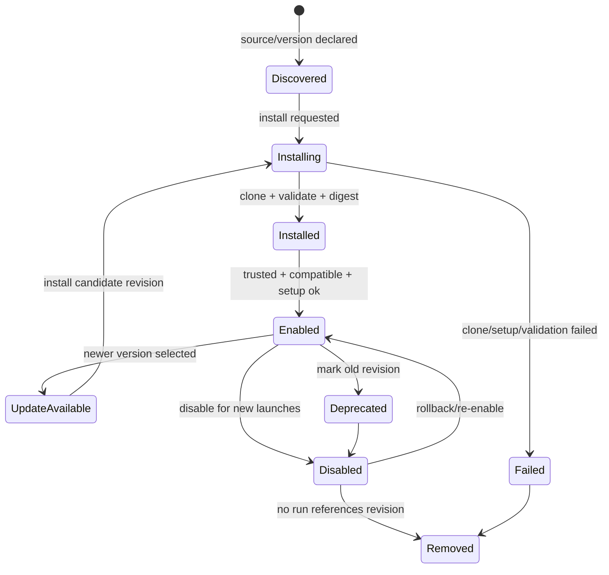
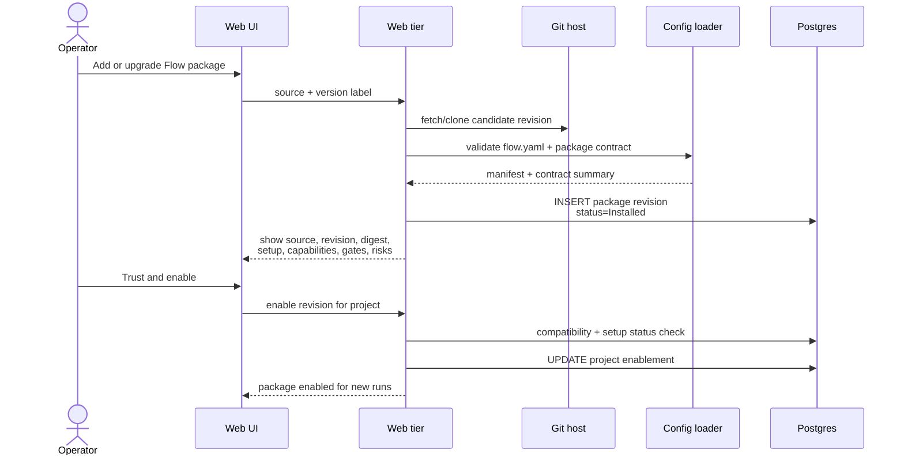
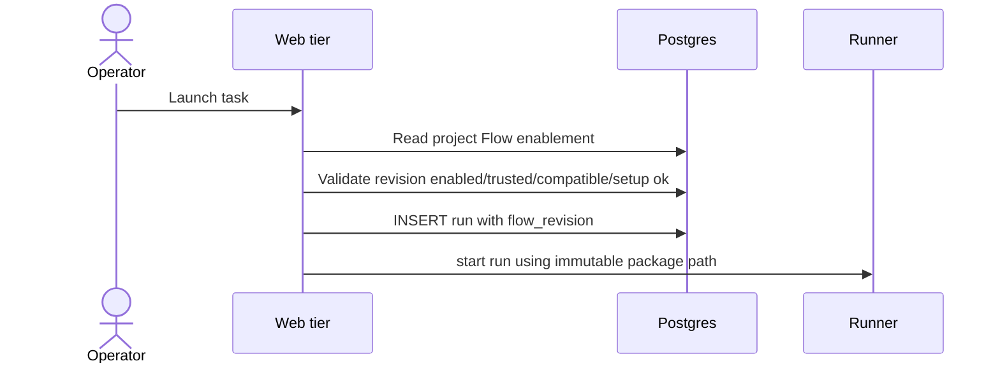
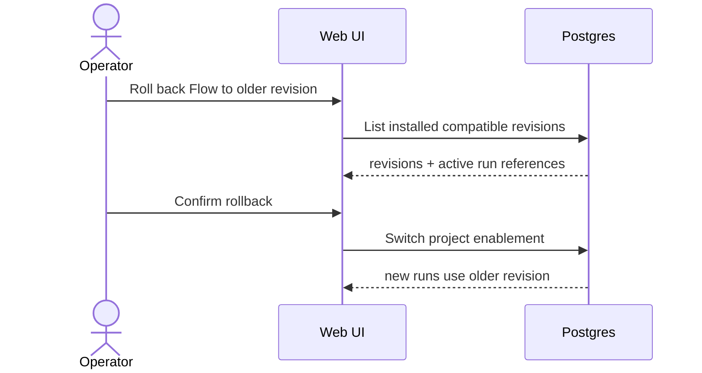

# Flow packages domain

## Purpose

Flow packages are the distribution unit for MAIster delivery processes. This
domain covers package discovery, install, trust review, compatibility,
enablement, upgrade, rollback, deprecation, removal, and how runs stay pinned
to the exact immutable package revision they launched with.

## Domain entities

- **Flow package** — logical delivery process identified by stable
  `flow_ref_id`, source, and human-facing version labels.
- **Package revision** — immutable installed source revision with resolved git
  SHA, manifest digest, install path, compatibility result, setup state, trust
  state, and package contract summary.
- **Project enablement** — project-level pointer to the package revision that
  new runs should use for a given Flow id.
- **Package contract** — declared nodes, artifacts, gates, capabilities,
  shipped skills/agents, setup hooks, optional migrations, external operation
  needs, and supported MAIster engine/API version range.
- **Package trust decision** — operator or policy decision that allows setup
  and enablement for a revision.
- **Package update** — candidate revision installed beside the currently
  enabled revision and compared before switch-over.

## State machine

## Process flows

### Install or upgrade package

### Launch with pinned package revision

### Rollback package

## Expectations

- Current M4 loader remains the low-level installer, but M10 adds product
  lifecycle state above it.
- Tags are user-facing pins. Resolved git SHA and manifest digest are runtime
  truth.
- Installed package revisions are immutable and can coexist for the same Flow
  id.
- New runs use the project-enabled package revision.
- Active and completed runs keep using the revision snapshotted into
  `runs.flow_revision`, regardless of later upgrade, rollback, disable, or
  deprecation.
- Package install validates manifest schema, package contract, compatibility
  range, declared capabilities, gates, artifacts, setup hooks, and external
  operation needs before enablement.
- Setup scripts are revision-scoped, idempotent, and run only after trust
  confirmation.
- Install/upgrade UI shows source, version, resolved revision, manifest digest,
  compatibility result, trust status, setup status, declared nodes, artifacts,
  gates, capabilities, shipped skills/agents, and active run references.
- Upgrade preview shows added, removed, and changed package contract elements.
- Rollback changes project enablement only. It does not mutate existing runs or
  delete the newer package revision.
- Package removal is refused while any run references the revision.
- Full marketplace, signatures, reputation, dependency solving, org-wide
  package policy, and automatic rollout remain deferred.

## Edge cases

- **Clone/fetch fails** -> `FLOW_INSTALL` with source, version, stage, exit
  status, and captured output.
- **Manifest invalid** -> `CONFIG`; package revision cannot be enabled.
- **Setup script exits non-zero** -> `FLOW_INSTALL`; revision remains failed
  or installed-but-not-enabled according to stage.
- **Resolved revision differs for the same tag** -> install as a new immutable
  revision; do not overwrite the old revision.
- **Package requires unsupported MAIster engine/API/capability** -> revision
  is installed for inspection but cannot be enabled.
- **Launch references disabled/failed/untrusted package** -> `PRECONDITION`
  before workspace creation.
- **Remove referenced revision** -> `PRECONDITION`; keep revision until no run
  references it.
- **Rollback target incompatible with current project config** ->
  `PRECONDITION`; user must resolve config/capability mismatch first.

## Linked artifacts

- Roadmap: [`../../.ai-factory/ROADMAP.md`](../../.ai-factory/ROADMAP.md) M10.
- Flow DSL: [`../flow-dsl.md`](../flow-dsl.md).
- Configuration: [`../configuration.md`](../configuration.md).
- Related domains: [`flows.md`](flows.md), [`projects.md`](projects.md),
  [`runs.md`](runs.md), [`external-operations.md`](external-operations.md).
