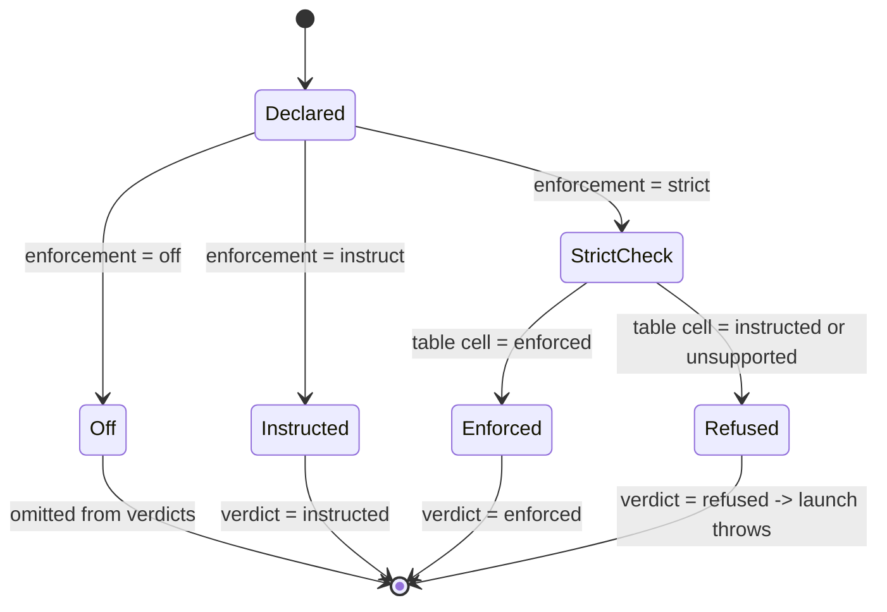
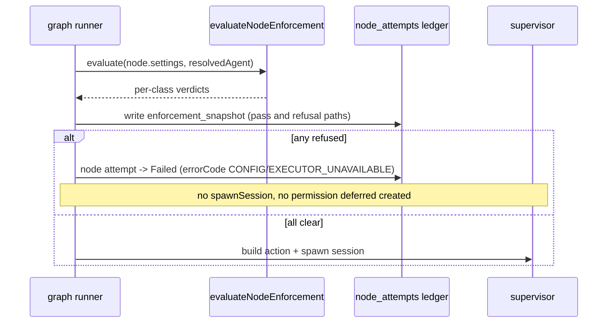

# Flow node settings & the enforcement boundary (M11c)

> **Status:** Implemented (M11c subset). The typed settings schema, node-level
> shape validation, the launch-time **refusal boundary**, the
> `enforcement_snapshot` audit record, the time-limit watchdog, and the
> run-detail visibility panel are **Implemented** in M11c. Capability-reference
> resolution against a registry, agent-aware mapping, and per-session
> materialization are **M14 (Designed)** — see
> [ADR-031](decisions.md) / [ADR-032](decisions.md). This file FREEZES the
> `ENFORCEABILITY_BY_AGENT` table and the `evaluateNodeEnforcement` truth table
> as a code-shaped spec; the M11c unit tests encode both verbatim.

## Purpose

This domain covers how a Flow graph node's typed `settings` block is parsed,
validated, evaluated against MAIster's *current* enforcement capability, and
either allowed to launch or **refused before launch** — with the resolved
verdicts made visible in the run-detail UI and snapshotted for audit. The
boundary is honest about the M11c↔M14 split: M11c gates launch on a **static**
table and never silently weakens a declared `strict` requirement; M14 later
*materializes* capabilities and flips classes from `instructed` to `enforced`.
Scope is the `web/` tier only — the supervisor `spawn.ts` env layer is unchanged
in M11c.

## Domain entities

- **Node `settings`** — typed, per-node-type block on a graph node
  (`web/lib/config.schema.ts`). `ai_coding` / `judge` carry the agent-capability
  shape; `human` carries decision/role/takeover shape; `cli` / `check` carry the
  command shape. Optional on every node type. Lives in the pinned
  `flow_revisions.manifest` (persisted; see [runs-domain ERD](db/runs-domain.md)).
- **Capability class** — one of the six capability-bearing settings subject to
  the `enforcement` intent: `mcps`, `tools`, `skills`, `restrictions`,
  `permissionMode`, `workspaceAccess`.
- **`enforcement` intent** — per-class `strict | instruct | off`, default
  `instruct`, declared by the flow author in `settings.enforcement`.
- **`ENFORCEABILITY_BY_AGENT`** — the static, code-constant table
  (`web/lib/flows/enforcement.ts`) recording what MAIster's *current build* can
  do per `agent` × `capabilityClass`: `enforced | instructed | unsupported`.
- **Enforcement verdict** — the per-class resolution `enforced | instructed |
  refused` returned by `evaluateNodeEnforcement`.
- **`enforcement_snapshot`** — append-only `node_attempts` jsonb column
  (migration `0013`) recording `{ class, declared, capability, verdict }[]` at
  launch / first attempt.

## State machine — per-class enforcement verdict

The verdict for one capability class is a pure function of the declared intent
and the static table cell for the resolved agent.



## FROZEN SPEC — `ENFORCEABILITY_BY_AGENT` (M11c seed)

The M11c table is **all `instructed`** (no `enforced` cell). The Phase-3 RED
tests assert this table value-for-value. M14 flips cells to `enforced` as
materialization lands; every cell carries a `TODO(M14)` in code.

| agent → class | `mcps` | `tools` | `skills` | `restrictions` | `permissionMode` | `workspaceAccess` |
| ------------- | ------ | ------- | -------- | -------------- | ---------------- | ----------------- |
| `claude`      | instructed | instructed | instructed | instructed | instructed | instructed |
| `codex`       | instructed | instructed | instructed | instructed | instructed | instructed |

```ts
// FROZEN — web/lib/flows/enforcement.ts (M11c). Every cell instructed; no
// `enforced` cell ships without an end-to-end adapter-flag verification.
export const ENFORCEABILITY_BY_AGENT: Record<
  "claude" | "codex",
  Record<CapabilityClass, "enforced" | "instructed" | "unsupported">
> = {
  claude: {
    mcps: "instructed",            // TODO(M14): enforced once MCP config is materialized per session
    tools: "instructed",           // TODO(M14): enforced once agent-aware tool map is materialized
    skills: "instructed",          // TODO(M14): enforced once skills are materialized per session
    restrictions: "instructed",    // TODO(M14): enforced once restriction policy is materialized
    permissionMode: "instructed",  // TODO(M14): enforced iff --permission-mode honored (spike 0.10: NOT verified in M11c)
    workspaceAccess: "instructed", // TODO(M14): enforced once workspace scoping is materialized
  },
  codex: {
    mcps: "instructed",            // TODO(M14)
    tools: "instructed",           // TODO(M14)
    skills: "instructed",          // TODO(M14)
    restrictions: "instructed",    // TODO(M14)
    permissionMode: "instructed",  // TODO(M14)
    workspaceAccess: "instructed", // TODO(M14)
  },
};
```

### Spike 0.10 verdict (permissionMode)

**Verdict: NOT verified in M11c — no live adapter.** `claude-agent-acp@0.37.0`
honoring `--permission-mode deny|ask` end-to-end was not verifiable without a
live adapter, so the `permissionMode`-on-`claude` cell stays `instructed`. A
wrongly-`enforced` cell would let a `strict permissionMode` declaration PASS the
launch gate while nothing enforces it — the exact silent escape hatch criterion
#6 forbids. Re-run the spike in M14 before flipping the cell.

## FROZEN SPEC — `evaluateNodeEnforcement` truth table

For each capability class the node *declares* (the data field is present OR an
`enforcement` entry is present), with `declared = settings.enforcement?.[class]
?? "instruct"` and `capability = table[agent][class]`:

| `declared` | `capability` | `verdict` |
| ---------- | ------------ | --------- |
| `off`      | (any)        | *(omitted from result)* |
| `instruct` | `enforced`   | `instructed` |
| `instruct` | `instructed` | `instructed` |
| `instruct` | `unsupported`| `instructed` |
| `strict`   | `enforced`   | `enforced` |
| `strict`   | `instructed` | `refused` |
| `strict`   | `unsupported`| `refused` |

Rule, stated once: `verdict = "refused"` iff `declared === "strict" &&
capability !== "enforced"`; `verdict = "enforced"` iff `declared === "strict" &&
capability === "enforced"`; otherwise `verdict = "instructed"`; `off` is omitted.
The evaluator is pure — no DB, no logging — and takes the table as an injectable
parameter defaulting to `ENFORCEABILITY_BY_AGENT`.

## FROZEN SPEC — launch-refusal allow-list & error branch

**Launch proceeds iff** for every `ai_coding` / `judge` node and for every
capability-bearing setting on it with `enforcement: strict`,
`ENFORCEABILITY_BY_AGENT[resolvedAgent][class] === "enforced"`. Any other
`strict` class is `refused` and launch throws. (Equivalently: no class with
verdict `refused`.)

`assertNodeLaunchable(node, agent, table)` maps each `refused` class to a code:

- **`MaisterError("CONFIG")`** — no agent in the table has the class `enforced`
  (the build cannot strictly enforce this class **at all**; internal
  over-declaration). With the M11c all-`instructed` table this is **every**
  refusal.
- **`MaisterError("EXECUTOR_UNAVAILABLE")`** — some agent has the class
  `enforced` but the *resolved* executor's agent has it `instructed` /
  `unsupported`. Unreachable with the M11c table; exercised by tests injecting a
  table with an `enforced` cell, and the live branch once M14 flips cells.

The error message names the offending node id + class + resolved agent + the
`declared`/`capability` pair. **No new error code** (ADR-008 closed union).

## Process flows

### Launch precondition order (`POST /api/runs`)

The settings-enforcement check runs as a whole-manifest static gate, after trust
and executor resolution and **before** any worktree/run/workspace side-effect.


### Per-node runtime gate + snapshot (`runner-graph.ts`)



### Time-limit watchdog (`limits.maxDurationMinutes`)

Agent-agnostic, inherently enforced, NOT subject to the strict/instruct table.
The existing keep-alive / scheduler sweep computes elapsed from the active
`node_attempts.started_at` (full-µs, per the M11b fix) and on cap terminates via
the existing supervisor `DELETE /sessions/:id` (no new supervisor route; the
`DELETE` drives teardown so no permission deferred leaks), marks the node
`Failed`, and ends the run terminal. Cost limits stay record-only.

## Expectations

- A node `settings` block MUST be parsed into the typed per-node-type shape; the
  M11a opaque passthrough and `SETTINGS_NOT_ENFORCED_WARN` MUST NOT exist.
- A node with no `settings` MUST validate and run unchanged; absence of
  `settings` NEVER triggers a refusal.
- Launch MUST proceed iff every `strict` capability-bearing setting on every
  `ai_coding`/`judge` node resolves to `ENFORCEABILITY_BY_AGENT[agent][class] ===
  "enforced"`; otherwise launch MUST throw and create NO worktree/run/workspace.
- A `refused` class MUST throw `MaisterError("CONFIG")` when no agent can enforce
  the class, else `MaisterError("EXECUTOR_UNAVAILABLE")`; NEVER a new error code.
- The refusal MUST run at BOTH the launch precondition and the per-node runtime
  build; the per-node gate MUST fire before any `spawnSession` / permission
  deferred is created.
- `node_attempts.enforcement_snapshot` MUST be written at launch/first-attempt
  on BOTH the pass and refusal paths and is append-only (never a mutable mirror).
- The M11c `ENFORCEABILITY_BY_AGENT` table MUST contain no `enforced` cell; M14
  only ever flips `instructed → enforced` (the contract tightens, never loosens).
- Node-level validation MUST reject unknown `permissionMode` / `failureClass` /
  `thinkingEffort` / `environmentPolicy` / `enforcement` enum values, malformed
  `tools` map, out-of-range `limits`, `settings.executors[]` ids absent from
  `maister.yaml executors[]`, and `human.decisions[]` absent from `transitions`.
- M11c MUST NOT validate MCP/tool/skill/agent/restriction *registry* references
  (M14) nor `human` role refs against a registry (M13).
- The trust gate MUST run before the enforcement evaluator: an `untrusted`
  revision carrying `enforcement: strict` is refused on trust first.
- The run-detail panel MUST render each `ai_coding`/`judge` node's classes tagged
  `enforced / instructed / refused` and MUST NOT serialize any secret
  (`*TOKEN*`/`*KEY*`/`*SECRET*`) field.
- A run whose elapsed exceeds `limits.maxDurationMinutes` MUST be terminated
  `Failed`; a run under cap MUST NOT be killed; absence of `limits` MUST NOT arm
  the watchdog. Cost caps remain record-only.

## Edge cases

- **`strict` on a class the build can only instruct** → refused at launch,
  `MaisterError("CONFIG")` (409). The M11c default for every class.
- **`strict` on a class enforced for one agent, unsupported for the resolved
  agent** → `MaisterError("EXECUTOR_UNAVAILABLE")` (503). M14-era / test-injected.
- **`untrusted` revision with `enforcement: strict`** → refused on the M10 trust
  gate (`PRECONDITION`) before the evaluator runs.
- **`enforcement` key on a node type that has no such class** (e.g. `mcps` on
  `human`) → rejected by node-level validation, `MaisterError("CONFIG")`.
- **Per-node executor override smuggling an unenforceable class** → caught by the
  per-node runtime gate even if the launch precondition passed.
- **Process dies after a refusal snapshot but before the run is marked terminal**
  → the M11a/M11b recovery sweep reconciles the run; the append-only snapshot is
  never double-written for the same attempt.

## Linked artifacts

- ADRs: [ADR-031](decisions.md) (typed settings, carve (b)),
  [ADR-032](decisions.md) (refusal boundary), [ADR-008](decisions.md) (error
  taxonomy), [ADR-026/027/028](decisions.md) (graph manifest, ledger, gates).
- Schema / validation: `web/lib/config.schema.ts`, `web/lib/config.ts`.
- Enforcement: `web/lib/flows/enforcement.ts`,
  `web/lib/flows/graph/compile.ts`, `web/lib/flows/graph/runner-graph.ts`.
- Launch: `web/app/api/runs/route.ts`.
- DB: [database-schema.md](database-schema.md),
  [db/runs-domain.md](db/runs-domain.md) (`node_attempts.enforcement_snapshot`).
- Errors: [error-taxonomy.md](error-taxonomy.md) (`CONFIG`,
  `EXECUTOR_UNAVAILABLE` M11c callers).
- DSL: [flow-dsl.md](flow-dsl.md) (node `settings` block).
