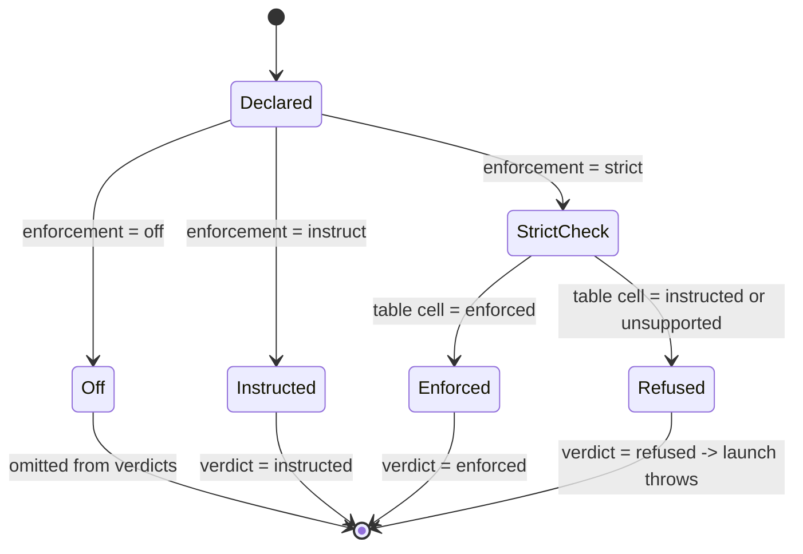
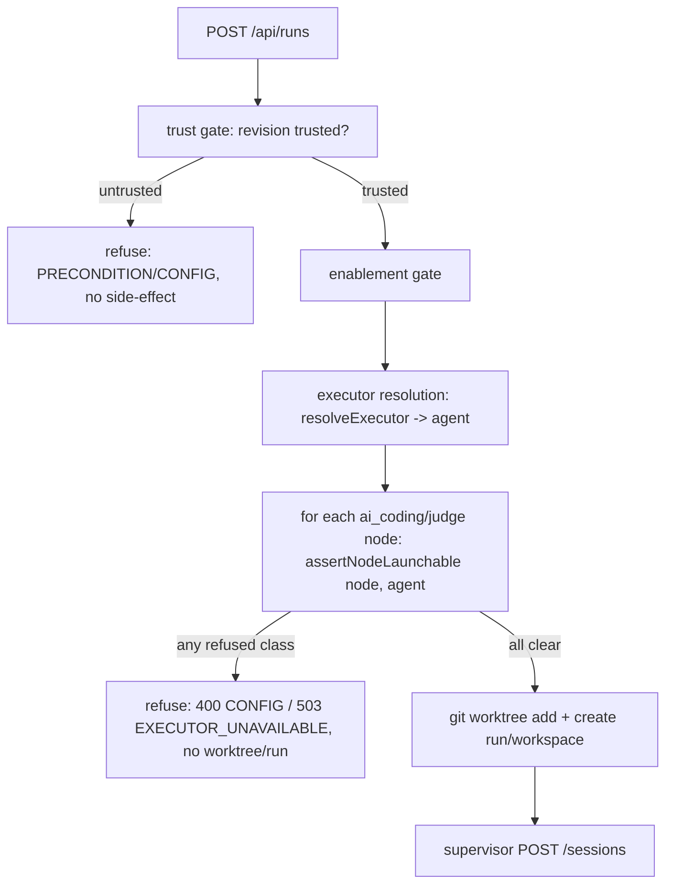
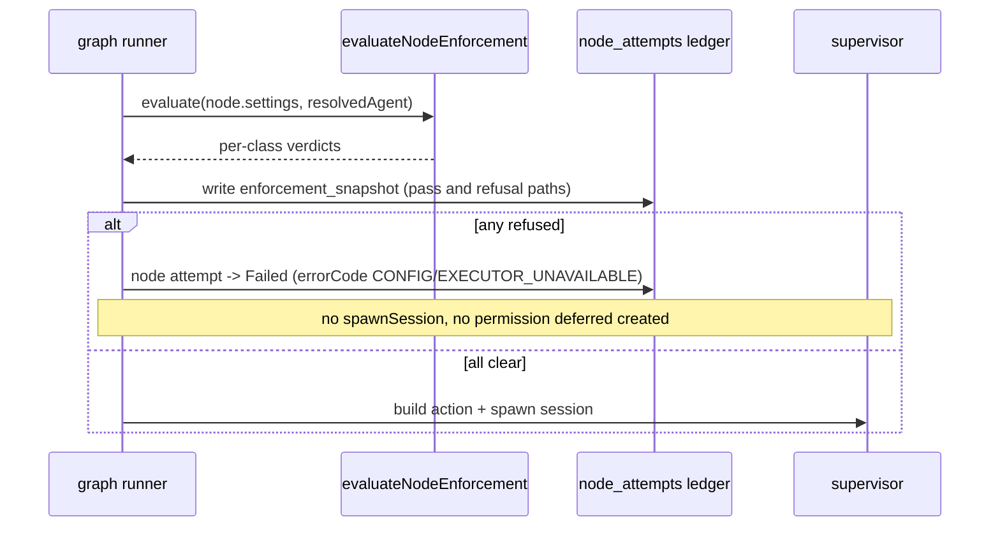

# Flow node settings & the enforcement boundary (M11c)

> **Status:** Implemented (M11c subset). M14 materialization **Implemented through
> Phase 4.5** (delivery mechanism built + CI-verified); the enforcement flip is
> **deferred**.
>
> The typed settings schema, node-level shape validation, the launch-time
> **refusal boundary**, the `enforcement_snapshot` audit record, the time-limit
> watchdog, and the run-detail visibility panel are **Implemented** in M11c.
> Capability-reference resolution against a registry (carve-b), agent-aware
> mapping, and per-session native materialization are **Implemented (M14)** — see
> ADR-041 / ADR-042 / ADR-043 in [`decisions.md`](decisions.md). Capability config
> is now genuinely **delivered** to the claude agent via
> `<worktree>/.claude/settings.local.json` (`tools` → `permissions.allow`,
> `permissionMode` → `permissions.defaultMode`) and ACP `newSession`
> `params.mcpServers` (env resolved supervisor-side); the CLI-flag channel
> was disproven against `claude-agent-acp@0.37.0` and corrected — see ADR-044.
> Per-class delivery: `tools`, `permissionMode`, `mcps` are **delivered**
> (mechanism CI-verified); `skills`, `restrictions`, `workspaceAccess` are **not
> emitted this milestone** (stay `instructed`, Phase 2); all `codex` classes stay
> `instructed` (Phase 2).
>
> **M14 enforcement note:** delivery is built, but the `instructed → enforced`
> flip is **deferred** — no cell is flipped this milestone. The flip is gated on a
> **live-adapter spike that cannot run in CI** (see ADR-042), so
> `ENFORCEABILITY_BY_AGENT` stays **all `instructed`**. The run-detail UI labels
> dispositions as "Enforced (plan)" / "Instructed (plan)", NOT live verdicts. Do
> NOT flip `ENFORCEABILITY_BY_AGENT` cells in this file — only a passing live spike
> (claude-first; codex stays `instructed`) may flip a cell, and the
> `permissionMode` cell MUST be re-run live.
>
> This file FREEZES the `ENFORCEABILITY_BY_AGENT` table and the
> `evaluateNodeEnforcement` truth table as a code-shaped spec; the M11c unit
> tests encode both verbatim.

## Purpose

This domain covers how a Flow graph node's typed `settings` block is parsed,
validated, evaluated against MAIster's *current* enforcement capability, and
either allowed to launch or **refused before launch** — with the resolved
verdicts made visible in the run-detail UI and snapshotted for audit. The
boundary is honest about the M11c↔M14 split: M11c gates launch on a **static**
table and never silently weakens a declared `strict` requirement; M14 later
*materializes* capabilities and flips classes from `instructed` to `enforced`.
Scope is the `web/` tier only — the supervisor `spawn.ts` env layer is unchanged
in M11c.

## Domain entities

- **Node `settings`** — typed, per-node-type block on a graph node
  (`web/lib/config.schema.ts`). `ai_coding` / `judge` carry the agent-capability
  shape; `human` carries decision/role/takeover shape; `cli` / `check` carry the
  command shape. Optional on every node type. Lives in the pinned
  `flow_revisions.manifest` (persisted; see [runs-domain ERD](db/runs-domain.md)).
- **Capability class** — one of the seven capability-bearing settings subject to
  the `enforcement` intent: `mcps`, `tools`, `skills`, `restrictions`,
  `permissionMode`, `workspaceAccess`, `hooks` (`hooks` Designed — ADR-108, M40;
  see "Hook engine capability class" below).
- **`enforcement` intent** — per-class `strict | instruct | off`, default
  `instruct`, declared by the flow author in `settings.enforcement`.
- **`ENFORCEABILITY_BY_AGENT`** — the static, code-constant table
  (`web/lib/flows/enforcement.ts`) recording what MAIster's *current build* can
  do per `agent` × `capabilityClass`: `enforced | instructed | unsupported`.
- **Enforcement verdict** — the per-class resolution `enforced | instructed |
  refused` returned by `evaluateNodeEnforcement`.
- **`enforcement_snapshot`** — append-only `node_attempts` jsonb column
  (migration `0013`) recording `{ class, declared, capability, verdict }[]` at
  launch / first attempt.

## State machine — per-class enforcement verdict

The verdict for one capability class is a pure function of the declared intent
and the static table cell for the resolved agent.



## FROZEN SPEC — `ENFORCEABILITY_BY_AGENT` (still all `instructed`; flip deferred pending live spike)

The table is **all `instructed`** (no `enforced` cell) and remains so through M14:
the delivery mechanism is built and CI-verified (capability config is materialized
and delivered via settings.local.json + ACP `mcpServers`, see ADR-044), but the
`instructed → enforced` flip is **deferred** — it is gated on a live-adapter spike
that cannot run in CI (see ADR-042). A cell flips to `enforced` only after a
per-class/per-agent live spike proves enforcement. Every cell carries a `TODO(M14)`
in code. **Codex stays `instructed` for all six classes in M14** (Q2 decision, see
ADR-042).

| agent → class | `mcps` | `tools` | `skills` | `restrictions` | `permissionMode` | `workspaceAccess` |
| ------------- | ------ | ------- | -------- | -------------- | ---------------- | ----------------- |
| `claude`      | instructed | instructed | instructed | instructed | instructed | instructed |
| `codex`       | instructed | instructed | instructed | instructed | instructed | instructed |

```ts
// FROZEN — web/lib/flows/enforcement.ts (M11c). Every cell instructed; no
// `enforced` cell ships without an end-to-end adapter-flag verification.
export const ENFORCEABILITY_BY_AGENT: Record<
  "claude" | "codex",
  Record<CapabilityClass, "enforced" | "instructed" | "unsupported">
> = {
  claude: {
    mcps: "instructed",            // TODO(M14): enforced once MCP config is materialized per session
    tools: "instructed",           // TODO(M14): enforced once agent-aware tool map is materialized
    skills: "instructed",          // TODO(M14): enforced once skills are materialized per session
    restrictions: "instructed",    // TODO(M14): enforced once restriction policy is materialized
    permissionMode: "instructed",  // TODO(M14): enforced iff --permission-mode honored (spike 0.10: NOT verified in M11c)
    workspaceAccess: "instructed", // TODO(M14): enforced once workspace scoping is materialized
  },
  codex: {
    mcps: "instructed",            // TODO(M14)
    tools: "instructed",           // TODO(M14)
    skills: "instructed",          // TODO(M14)
    restrictions: "instructed",    // TODO(M14)
    permissionMode: "instructed",  // TODO(M14)
    workspaceAccess: "instructed", // TODO(M14)
  },
};
```

## Gemini/OpenCode/MiMo enforcement extension (Designed, ADR-084/ADR-085)

Gemini, OpenCode, and MiMo widen the agent axis only after the schema and
enforcement table are updated together. The extension is conservative:

| agent → class | `mcps` | `tools` | `skills` | `restrictions` | `permissionMode` | `workspaceAccess` |
| ------------- | ------ | ------- | -------- | -------------- | ---------------- | ----------------- |
| `gemini`      | instructed | instructed | instructed | instructed | instructed | instructed |
| `opencode`   | instructed | instructed | instructed | instructed | instructed | instructed |
| `mimo`        | instructed | instructed | instructed | instructed | instructed | instructed |

No Gemini/OpenCode/MiMo cell may ship as `enforced` in this feature. A future live
spike may tighten a cell from `instructed` to `enforced`, but it must never
weaken an existing `enforced` claim. If a class is proven impossible for an
adapter, the implementation may use `unsupported`; `strict` still refuses.

The schema and table changes are atomic SDD/TDD work:

- `capabilityAgentSchema`, tool maps, capability records, MCP supported-agent
  arrays, runner snapshots, and the enforcement table must accept the same
  adapter ids in the same commit.
- Unknown agent keys continue to fail validation.
- `evaluateNodeEnforcement` remains pure and table-driven; it must not branch on
  adapter names outside the table.
- Runtime refusals log `nodeId`, `adapter`, `class`, `declared`, `capability`,
  and error code only. They never log full settings payloads or secrets.

### Spike 0.10 verdict (permissionMode)

**Verdict: still not verified — flip deferred pending a live-adapter spike.** The
M11c `--permission-mode` CLI mechanism was disproven against
`claude-agent-acp@0.37.0` (the adapter ignores those flags); `permissionMode` is
now delivered via `<worktree>/.claude/settings.local.json` `permissions.defaultMode`
(`ask→default`/`allow→bypassPermissions`/`deny→plan`, see ADR-044). Whether the
delivered value actually CONSTRAINS the agent end-to-end remains unverified without
a live adapter (it cannot run in CI, see ADR-042), so the
`permissionMode`-on-`claude` cell stays `instructed`. A wrongly-`enforced` cell
would let a `strict permissionMode` declaration PASS the launch gate while nothing
enforces it — the exact silent escape hatch criterion #6 forbids. Re-run the live
spike before flipping the cell.

## FROZEN SPEC — `evaluateNodeEnforcement` truth table

For each capability class the node *declares* (the data field is present OR an
`enforcement` entry is present), with `declared = settings.enforcement?.[class]
?? "instruct"` and `capability = table[agent][class]`:

| `declared` | `capability` | `verdict` |
| ---------- | ------------ | --------- |
| `off`      | (any)        | *(omitted from result)* |
| `instruct` | `enforced`   | `instructed` |
| `instruct` | `instructed` | `instructed` |
| `instruct` | `unsupported`| `instructed` |
| `strict`   | `enforced`   | `enforced` |
| `strict`   | `instructed` | `refused` |
| `strict`   | `unsupported`| `refused` |

Rule, stated once: `verdict = "refused"` iff `declared === "strict" &&
capability !== "enforced"`; `verdict = "enforced"` iff `declared === "strict" &&
capability === "enforced"`; otherwise `verdict = "instructed"`; `off` is omitted.
The evaluator is pure — no DB, no logging — and takes the table as an injectable
parameter defaulting to `ENFORCEABILITY_BY_AGENT`.

## FROZEN SPEC — launch-refusal allow-list & error branch

**Launch proceeds iff** for every `ai_coding` / `judge` node and for every
capability-bearing setting on it with `enforcement: strict`,
`ENFORCEABILITY_BY_AGENT[resolvedAgent][class] === "enforced"`. Any other
`strict` class is `refused` and launch throws. (Equivalently: no class with
verdict `refused`.)

`assertNodeLaunchable(node, agent, table)` maps each `refused` class to a code:

- **`MaisterError("CONFIG")`** — no agent in the table has the class `enforced`
  (the build cannot strictly enforce this class **at all**; internal
  over-declaration). With the M11c all-`instructed` table this is **every**
  refusal.
- **`MaisterError("EXECUTOR_UNAVAILABLE")`** — some agent has the class
  `enforced` but the *resolved* executor's agent has it `instructed` /
  `unsupported`. Unreachable with the M11c table; exercised by tests injecting a
  table with an `enforced` cell, and the live branch once M14 flips cells.

The error message names the offending node id + class + resolved agent + the
`declared`/`capability` pair. **No new error code** (ADR-008 closed union).

## Hook engine capability class (Designed — ADR-108)

The **seventh** capability class `hooks` ([ADR-108](../decisions.md#adr-108-declarative-guardrailhook-engine--universal-supervisor-acp-seam-interceptor-native-materializer-seam-and-hook-trip-hitl-escalation),
M40) declares the per-tool-call guardrail rules (`path_guard` / `repetition` /
`no_progress`) enforced at the supervisor↔ACP seam. Full design:
[`guardrail-hooks.md`](guardrail-hooks.md). Engine floor: a node/agent declaring
`hooks` requires `compat.engine_min >= 1.8.0`.

`hooks` is `instructed` for every agent in `ENFORCEABILITY_BY_AGENT` (a 7th
column, all `instructed`):

| agent → class | `hooks` |
| ------------- | ------- |
| `claude`   | instructed |
| `codex`    | instructed |
| `gemini`   | instructed |
| `opencode` | instructed |
| `mimo`     | instructed |

**Why `instructed`, not `enforced` (honest visibility).** Unlike `mcps` / `tools`
(instructed because the materialized delivery is built but the flip awaits a live
spike), the supervisor's hook interceptor enforces `hooks` *deterministically*. It
is still modeled `instructed` on purpose: marking it `enforced` would reopen the
frozen ADR-041 strict-capability flip and let a `strict` hooks declaration pass the
launch gate keyed on the static table. So a `strict` `enforcement.hooks` is
**refused** at launch (the refusal branch above), and the deterministic supervisor
enforcement is documented behavior — not a static-table `enforced` claim.

**Two-tier default.** The resolver seeds the two liveness breakers (`repetition` =
5, `noProgress` = 15, from `MAISTER_HOOK_*`) for runs under the `unattended`
execution-policy preset unless the node opts out; `supervised` / `assisted` are
opt-in; `path_guard` is always opt-in. See [`guardrail-hooks.md`](guardrail-hooks.md)
and [`execution-policy.md`](execution-policy.md).

**Supervisor-vs-native split + materialization.** All three rules are enforced
universally supervisor-side. A claude-only `NativeHookMaterializer` (spike-gated)
may *additionally* write a `PreToolUse` path-guard hook into
`<worktree>/.claude/settings.local.json` (the same M14 channel that delivers
`tools` / `permissionMode`, ADR-044), covering only `path_guard` and degrading to
documented-N/A if the bundled adapter does not honor settings-file hooks. The
native hook's `allowedPaths` derive from the same resolved `hooksConfig.pathGuard`
(one source of truth).

## FROZEN SPEC — capability-token normalizer & matcher (Designed — capability composer, FR-E)

The composer authors capabilities as **canonical tokens**; the normalizer expands
them to each runner's **wire form** in the templating pass (nodes) and at scratch
send. **Web-side only — the supervisor forwards the assembled prompt verbatim**
(verified ground truth §1). Surface forms are read **table-driven** from the
adapter registry's materialization descriptor (`supports`,
[acp-runners.md](acp-runners.md)) — NOT a claude/codex constant.

**Canonical grammar (storage layer, portable):**

- `@skill:<slug>` — a project skill (`capabilityRecords`, kind=skill).
- `@agent:<slug>` — a coder subagent (`agents`, mode=subagent; claude-only).
- `<slug>` matches `^[a-z0-9][a-z0-9._-]*$`. Anything else is not a token.

**Surface forms (wire layer) — `surfaceForm(kind, slug, agent)`:**

| Entity | claude | codex | gemini / opencode / mimo |
| --- | --- | --- | --- |
| skill | `/<slug>` (bare name; `/` added client-side) | `$<slug>` (`$` baked into the ACP name) | `/<slug>` *(T3.5)* |
| subagent | `@<name>` | — unsupported → advisory (FR-E5) | — unsupported → advisory (FR-E5) |
| MCP command | `mcp:<server>` | built-in `/mcp` | per live `availableCommands` |

`normalizeCapabilityTokens(content, agent, catalog)` replaces each canonical token
(or composer chip) with `surfaceForm(kind, slug, agent)` **iff** the catalog marks
it `supported` for `agent`; an unsupported reference is left as its display text
and raises a run-time **WARN** (FR-E5) — no hard `CONFIG`, no silent rewrite.

**Matcher truth table — promote raw text `tok` to a canonical ref:**

| Input | Catalog state | Result |
| --- | --- | --- |
| `/<slug>` / `$<slug>` / `@<slug>` | `slug` ∈ catalog (exact) | promote → canonical ref for that kind |
| `/<slug>` **and** `$<slug>` (either sigil) | same `slug` ∈ catalog | promote → **same** ref (sigil-agnostic) |
| `/usr/bin`, `$HOME`, `$PATH`, `/foo/bar` | not an exact catalog slug | **literal** (never promoted) |
| `/<unknown>` | `unknown` ∉ catalog | **literal** (reaches the agent verbatim) |
| any token inside an inline-code span or fenced block | (any) | **suppressed** (never promoted) |

Matcher rules (stated once): a candidate is `sigil + slug` that is
**boundary-anchored** (preceded by start/whitespace/`(`; followed by
end/whitespace/punctuation), whose slug **exactly** equals a catalog entry's
`slug`, and is **not** inside a `` ` `` span or ` ``` ` fence. Non-matches are
never deleted or mangled. **Send/compile is the correctness backstop** — it
normalizes any un-chipified pasted token; chips are an enhancement, not a
correctness requirement (D6).

**Call sites (FR-E4):** load (chipify a node prompt), paste (promote, undoable),
blur/save (safety net), send/compile (backstop). Node prompts store the canonical
grammar in `flow.yaml` (a string); the composer serializes chips → canonical
string on change.

## Process flows

### Launch precondition order (`POST /api/runs`)

The settings-enforcement check runs as a whole-manifest static gate, after trust
and executor resolution and **before** any worktree/run/workspace side-effect.



### Per-node runtime gate + snapshot (`runner-graph.ts`)



### Time-limit watchdog (`limits.maxDurationMinutes`)

Agent-agnostic, inherently enforced, NOT subject to the strict/instruct table.
The existing keep-alive / scheduler sweep computes elapsed from the active
`node_attempts.started_at` (full-µs, per the M11b fix) and on cap terminates via
the existing supervisor `DELETE /sessions/:id` (no new supervisor route; the
`DELETE` drives teardown so no permission deferred leaks), marks the node
`Failed`, and ends the run terminal. Cost limits stay record-only.

## Expectations

- A node `settings` block MUST be parsed into the typed per-node-type shape; the
  M11a opaque passthrough and `SETTINGS_NOT_ENFORCED_WARN` MUST NOT exist.
- A node with no `settings` MUST validate and run unchanged; absence of
  `settings` NEVER triggers a refusal.
- Launch MUST proceed iff every `strict` capability-bearing setting on every
  `ai_coding`/`judge` node resolves to `ENFORCEABILITY_BY_AGENT[agent][class] ===
  "enforced"`; otherwise launch MUST throw and create NO worktree/run/workspace.
- A `refused` class MUST throw `MaisterError("CONFIG")` when no agent can enforce
  the class, else `MaisterError("EXECUTOR_UNAVAILABLE")`; NEVER a new error code.
- The refusal MUST run at BOTH the launch precondition and the per-node runtime
  build; the per-node gate MUST fire before any `spawnSession` / permission
  deferred is created.
- `node_attempts.enforcement_snapshot` MUST be written at launch/first-attempt
  on BOTH the pass and refusal paths and is append-only (never a mutable mirror).
- The M11c `ENFORCEABILITY_BY_AGENT` table MUST contain no `enforced` cell; M14
  only ever flips `instructed → enforced` (the contract tightens, never loosens).
- Gemini/OpenCode/MiMo rows, when implemented, MUST start with only `instructed`
  or `unsupported` cells. `strict` on those cells MUST refuse with `CONFIG` or
  `EXECUTOR_UNAVAILABLE` using the same truth table as Claude/Codex. (Designed,
  ADR-078/ADR-085)
- Node-level validation MUST reject unknown `permissionMode` / `failureClass` /
  `thinkingEffort` / `environmentPolicy` / `enforcement` enum values, malformed
  `tools` map, out-of-range `limits`, legacy `settings.executors[]`, and
  `human.decisions[]` absent from `transitions`. AI-coding nodes use
  `settings.runner` as the portable runner target; project/platform remapping
  happens when the Flow is loaded or attached.
- M11c MUST NOT validate MCP/tool/skill/agent/restriction *registry* references
  (M14) nor `human` role refs against a registry (M13).
- The trust gate MUST run before the enforcement evaluator: an `untrusted`
  revision carrying `enforcement: strict` is refused on trust first.
- The run-detail panel MUST render each `ai_coding`/`judge` node's classes tagged
  `enforced / instructed / refused` and MUST NOT serialize any secret
  (`*TOKEN*`/`*KEY*`/`*SECRET*`) field.
- A run whose elapsed exceeds `limits.maxDurationMinutes` MUST be terminated
  `Failed`; a run under cap MUST NOT be killed; absence of `limits` MUST NOT arm
  the watchdog. Cost caps remain record-only.

## Edge cases

- **`strict` on a class the build can only instruct** → refused at launch,
  `MaisterError("CONFIG")` (400). The M11c default for every class.
- **`strict` on a class enforced for one agent, unsupported for the resolved
  agent** → `MaisterError("EXECUTOR_UNAVAILABLE")` (503). M14-era / test-injected.
- **`untrusted` revision with `enforcement: strict`** → refused on the M10 trust
  gate (`PRECONDITION`) before the evaluator runs.
- **`enforcement` key on a node type that has no such class** (e.g. `mcps` on
  `human`) → rejected by node-level validation, `MaisterError("CONFIG")`.
- **Per-node executor override smuggling an unenforceable class** → caught by the
  per-node runtime gate even if the launch precondition passed.
- **Gemini/OpenCode/MiMo strict capability before live proof** → refused exactly like
  any other non-enforced cell; no adapter-specific fallback, warning-only pass,
  or implicit downgrade is allowed.
- **Process dies after a refusal snapshot but before the run is marked terminal**
  → the M11a/M11b recovery sweep reconciles the run; the append-only snapshot is
  never double-written for the same attempt.

## Linked artifacts

- ADRs: [ADR-031](decisions.md) (typed settings, carve (b)),
  [ADR-032](decisions.md) (refusal boundary), [ADR-008](decisions.md) (error
  taxonomy), [ADR-026/027/028](decisions.md) (graph manifest, ledger, gates),
  [ADR-084](../decisions.md#adr-084-acp-adapter-families-for-gemini-cli-and-opencode).
- Schema / validation: `web/lib/config.schema.ts`, `web/lib/config.ts`.
- Enforcement: `web/lib/flows/enforcement.ts`,
  `web/lib/flows/graph/compile.ts`, `web/lib/flows/graph/runner-graph.ts`.
- Launch: `web/app/api/runs/route.ts`.
- DB: [database-schema.md](database-schema.md),
  [db/runs-domain.md](db/runs-domain.md) (`node_attempts.enforcement_snapshot`).
- Errors: [error-taxonomy.md](error-taxonomy.md) (`CONFIG`,
  `EXECUTOR_UNAVAILABLE` M11c callers).
- DSL: [flow-dsl.md](flow-dsl.md) (node `settings` block).
