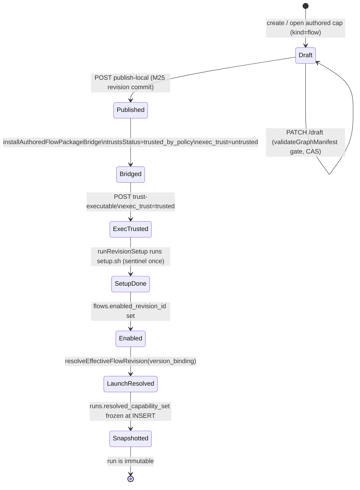
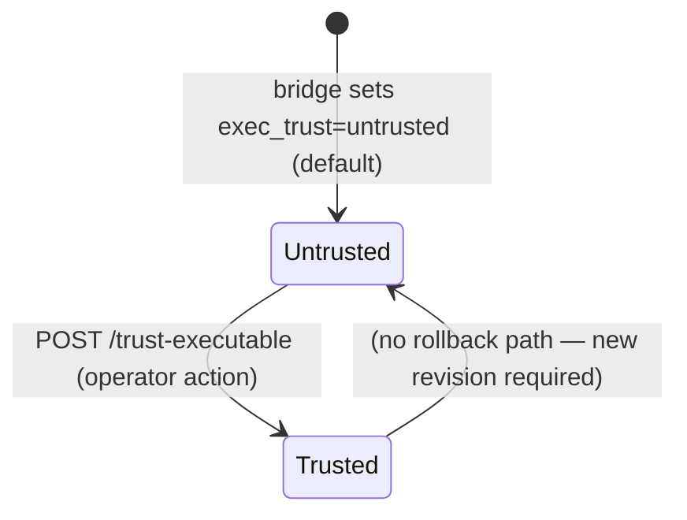
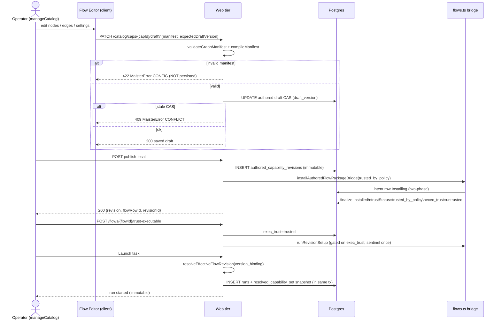
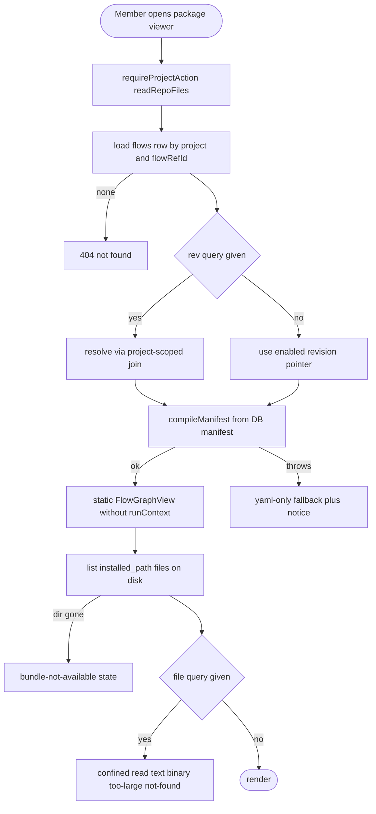
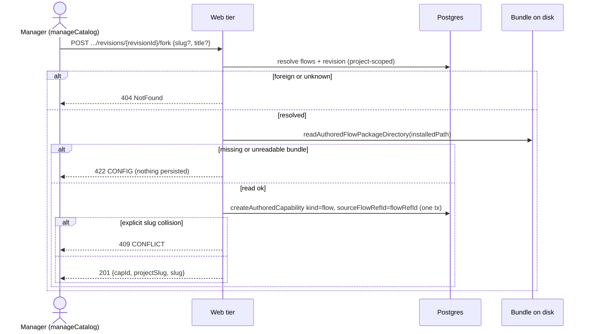

# Flow Studio domain

> **Status: Implemented (M27 Stage 1).** The editor write path, the
> authored→executable bridge with the two-axis trust gate, `version_binding`
> resolve-at-launch, the resolved-capability-set snapshot (in-flight
> immutability), and the MCP management surfaces described here have shipped.
> Source of truth: [`.ai-factory/specs/feature-m27-flow-studio-stage-1.md`](../../.ai-factory/specs/feature-m27-flow-studio-stage-1.md).

## Purpose

The **Flow Studio** domain covers in-app authoring and executable resolution for
flows: turning the read-only M22 workbench graph view into a graph editor that
persists validated authored drafts, publishing those drafts through an
executable bridge that creates runnable `flows` / `flow_revisions` rows, managing
the two independent trust axes (`flows.trustStatus` and
`flow_revisions.exec_trust`) that gate setup and MCP-stdio spawning, resolving
the effective revision at launch via `version_binding`, and snapshotting the
resolved capability set so in-flight runs stay immutable. Its boundary starts
at the edit canvas and ends at the frozen `runs.resolved_capability_set` written
at launch. MCP capability management at platform scope is covered here in so far
as it interacts with the capability-resolution precedence and the executable
bridge; per-run workbench visualization remains in
[`workbench.md`](workbench.md) and flow-graph execution semantics remain in
[`flow-graph.md`](flow-graph.md).

## Domain entities

- **Authored flow draft / revision** — `authored_capabilities` row (kind=`flow`)
  with a mutable draft body, plus immutable `authored_capability_revisions` rows
  (`manifest`, `content_hash`). Source: `web/lib/catalog/authored-service.ts`.
  Persisted in the capabilities schema — see
  [`../db/capabilities-domain.md`](../db/capabilities-domain.md).
- **`source_flow_ref_id` link** — NEW column `authored_capabilities.source_flow_ref_id
  text NULL` (DDL migration `0033+`). When an operator edits an already-installed
  flow the link records its `flow_ref_id` so publish→bridge targets the same
  `flows` lineage. A net-new authored flow mints a fresh `flow_ref_id`.
- **Bridged `flows` / `flow_revisions` rows** — the existing executable-package
  rows produced by `installAuthoredFlowPackageBridge` in `web/lib/flows.ts`.
  Bridge sets `flows.trustStatus=trusted_by_policy` and
  `flow_revisions.exec_trust=untrusted` on publish.
- **`version_binding`** — NEW column `flows.version_binding text NOT NULL DEFAULT
  'latest'` with CHECK `pinned|latest`. **(Stage-1)** `resolveEffectiveFlowRevision`
  resolves `flows.enabled_revision_id` for BOTH bindings; authored "latest"
  auto-follows because publish→bridge (T-B2) repoints `enabled_revision_id` to
  the newest published revision. **(Phase 2 — deferred)** `latest` resolves the
  newest PUBLISHED `flow_revisions` for the `flow_ref_id` (authored-wins
  tie-break; never a draft) — the global `flow_revisions` pool needs a
  project-scoped published index first. The column + toggle (T-B1) persist
  intent now.
- **`flow_revisions.exec_trust`** — NEW second trust axis per-revision (`untrusted
  | trusted`, DDL `0033+`). Gates `runRevisionSetup` (setup.sh) and MCP-stdio
  `command` spawn. Independent of `flows.trustStatus`; a logic-trusted flow is
  never exec-trusted automatically.
- **`runs.resolved_capability_set`** — NEW column `jsonb NULL` (DDL `0033+`).
  Shape: `{ flowRevisionId, flowOrigin, capabilities[], mcps[] }`. Frozen at
  launch, read by the runner. See [`../db/runs-domain.md`](../db/runs-domain.md).
- **Platform MCP server** — NEW table `platform_mcp_servers` (DDL `0033+`), mirroring
  `platform_acp_runners`. Carries transport (`stdio|sse|http`), secrets as
  `env:NAME` references, and its own `trust_status` / `readiness_status`.
- **MCP capability record** — existing `capability_records` (kind=`mcp`,
  source∈`{platform,project,flow-package}`), extended with discriminated
  transport shape (`stdio|sse|http`). Resolution precedence: project > platform >
  flow-package (exactly one winner per `(kind, refId)`, no duplicate
  materialization).

Full ERD: [`../db/capabilities-domain.md`](../db/capabilities-domain.md),
[`../db/projects-domain.md`](../db/projects-domain.md),
[`../db/runs-domain.md`](../db/runs-domain.md).

## State machines

### Authored-flow lifecycle

The lifecycle of an authored flow from first edit through launch, covering both
in-app and bridge states.

### exec_trust axis

The executable-trust state machine is per-revision and independent of
`flows.trustStatus`; explicit operator action is the only transition.

## Process flows

### Edit → validate → save-draft → publish → bridge → trust → setup → launch-resolve → snapshot

The full happy-path from the canvas editor to a frozen immutable run, showing
the hard-gate, two-phase bridge, and snapshot insertion.

## Expectations

The following bullets are copied verbatim from SDD §7.1 (RFC-2119 spirit, each
testable):

1. A draft save MUST run `validateGraphManifest`+`compileManifest` BEFORE the `draft_version` CAS write; an invalid manifest MUST throw `CONFIG` and MUST NOT mutate the draft row.
2. A stale `expectedDraftVersion` MUST fail with `CONFLICT` (409) and MUST NOT write.
3. Editing an installed flow MUST record its `source_flow_ref_id` so publish→bridge targets the SAME `flows` lineage; a net-new authored flow MUST mint a fresh `flow_ref_id`.
4. Publishing an authored `flow` MUST bridge it into a `flows` row + `flow_revisions` row via `installAuthoredFlowPackageBridge`, `trustStatus=trusted_by_policy`, `exec_trust=untrusted`.
5. `setup.sh` MUST NOT run on publish/bridge; it runs ONLY after an explicit `exec_trust` flip, via `runRevisionSetup` (physically separate, sentinel once-only).
6. An MCP stdio `command` MUST NOT be spawned for a revision whose `exec_trust≠trusted`.
7. Launch resolves the effective revision via `resolveEffectiveFlowRevision`. **(Stage-1)** BOTH `pinned` and `latest` resolve `flows.enabled_revision_id` (never a draft); authored "latest" auto-follow is realized by publish→bridge repointing the pointer (T-B2). **(Phase 2 — deferred)** `latest` → newest PUBLISHED revision, authored-wins on tie.
8. Launch MUST snapshot the resolved set into `runs.resolved_capability_set`; the runner MUST read the snapshot, never the live catalog; an edit/publish during a run MUST NOT mutate that run.
9. The editor MUST be read-write only for users with `manageCatalog`; the run-scoped view stays read-only (`readBoard`).
10. No engine bump; no new `runs.status`; presentation stays additive/runner-ignored.

## Edge cases

These map to the authoring and bridge rows from SDD §8:

| Case | `MaisterError` code | HTTP |
|---|---|---|
| Invalid manifest on draft save or publish (not persisted) | `CONFIG` | 422 |
| Stale `expectedDraftVersion` on PATCH /draft | `CONFLICT` | 409 |
| Unknown MCP/skill ref in manifest at validation | `CONFIG` | 422 |
| Required MCP unresolved at launch (`launchRun` insertion point #2) | `CONFIG` | 409 |
| Required MCP agent-unsupported at launch | `EXECUTOR_UNAVAILABLE` | 503 |
| `setup.sh` or MCP stdio spawn attempted before `exec_trust` flip | guarded (no exec, no error raised) | n/a |
| Bridge of an invalid package | `CONFIG` | 422 |
| `version_binding` set to an unknown enum value | `CONFIG` | 422 |

For platform MCP CRUD edge cases (delete while referenced, duplicate id), see
[`acp-runners.md`](acp-runners.md) for the mirror pattern; the MCP server CRUD
follows the same usage-guard and dup-id rules as ADR-065.

## Phase 2 (part 1): package viewing, reachability, fork, and artifact-aware editing (Implemented)

> **Status: Implemented (Flow Studio Phase 2, part 1).** Source of truth:
> [`.ai-factory/specs/feature-flow-studio-phase2-viewing-editing.md`](../../.ai-factory/specs/feature-flow-studio-phase2-viewing-editing.md);
> decision [ADR-075](../decisions.md#adr-075). This part makes an INSTALLED
> (git-pinned, immutable) flow package browsable + forkable and gives its
> bundled artifacts real editors. **No migration, no engine bump, no new
> `runs.status` / `MaisterError` code.** The sections below ADD to the M27
> Stage-1 contract above; they do not change it.

### Scope (Implemented)

**Track 0** — view an installed package's read-only graph (compiled from the DB
`manifest`) + raw `flow.yaml` + every bundled artifact file (read from disk at
`flow_revisions.installed_path`), kill the decoy `cursor-pointer` cards, and add
"Fork to edit" (immutable revisions always fork to an M25 authored draft with
`source_flow_ref_id` lineage). **Track 1** — a derived file tree + per-kind
artifact editors (skill/rule/agent frontmatter forms, shell editor + heuristic
lint, `form_schema` builder with live preview), per-kind content validation wired
into the draft-save hard-gate, a CodeMirror `flow.yaml` editor with live
YAML→graph re-seed, and a typed-edge modal-on-connect.

### Domain deltas (Implemented)

- **No DDL.** Every column relied on already exists: `flow_revisions.installed_path`
  (disk root for file bodies), `flow_revisions.manifest` (compiled to the static
  graph), `flow_revisions.exec_trust` (DISPLAYED, never flipped here),
  `flows.flow_ref_id` (viewer URL segment + fork lineage target),
  `flows.enabled_revision_id` (default revision), `authored_capabilities.source_flow_ref_id`
  (written by the fork). This feature adds no migration.
- **`installed_path` is a server-only handle** — it MUST NOT appear in any
  client-visible DTO, RSC-serialized prop, browser-streamed log line, or error
  message.
- **NEW client-safe modules (no DB, no new dep):** `lib/flows/package-content.ts`
  (confined disk reader, §below), `lib/flows/artifact-frontmatter.ts`
  (split/serialize + `skillFrontmatterSchema` / `agentFrontmatterSchema` /
  `ruleGuardrailSchema`, unknown keys preserved), `lib/flows/artifact-validate.ts`
  (per-kind content issues). `source_flow_ref_id` is server-seeded by the fork via
  a direct `createAuthoredCapability` call (the public `POST /caps` body is NOT
  widened; `createAuthoredCapabilitySchema` is unchanged).
- **File model** stays `files[{path, content}]`; the tree is a derived client
  view; **kind is inferred from path** via `classifyPackageFile` (the manual kind
  `<select>` is removed — install/bridge classify by path only).

### Process flows (Implemented)

Installed-package read path — authz precedes every read; disk loss degrades, never
throws; `?file=` is confined before any fs call.

Fork-to-edit — all reads precede ONE transaction; nothing executes; the fork
lands the caller in the existing editor.

### Per-kind content-validation severity (Implemented)

One shared module emits `{severity, code, path, message}`. The BLOCK subset is
wired into the server draft-save hard-gate (alongside
`assertAuthoredFlowManifestValid`, BEFORE the `draft_version` CAS → `CONFIG` 422),
mirrored client-side; the WARN subset is advisory only. New codes EXTEND the
existing `AuthoredFlowPackageValidationIssueCode` union (`yaml_parse | schema |
graph | unsafe_path | duplicate_path | path_conflict | unsupported_kind |
binary_content`).

| Severity | Code | Fires when |
|---|---|---|
| BLOCK | `schema_json_invalid` | a `schemas/**/*.json` file fails `JSON.parse` |
| BLOCK | `form_schema_invalid` | a schema file REFERENCED by the manifest (`form_schema:` / `output.result.schema:`) fails `formSchemaSchema` |
| BLOCK | `frontmatter_missing` | `skills/**/SKILL.md` or `agents/*.md` with missing/unparseable frontmatter |
| BLOCK | `frontmatter_field_missing` | such a file missing `name` or `description` |
| WARN | `rule_guardrail_shape` | rule guardrail frontmatter malformed (no web runtime parser → cannot block) |
| WARN | `shell_lint` | a shell heuristic-lint finding (pure JS, no shellcheck) |
| WARN | `form_schema_unreferenced` | `formSchemaSchema` issue on a schema file NOT referenced by the manifest |
| WARN | `frontmatter_unknown_key` | unknown frontmatter key (preserved verbatim) |

Manifest-reference resolution runs ONLY when the manifest parses (an unparseable
yaml persists RAW with `manifest=null` by design); file-level BLOCK checks run
regardless. Both save paths gate: the `updateAuthoredFlowAction` server action and
`PATCH /caps/[capId]/draft`. An installed package with pre-existing BLOCK-violating
artifacts still FORKS; the first SAVE surfaces the blocks.

### Editor behavior contracts (Implemented)

- **Static graph:** `FlowGraphView` gains optional `runContext?`; absent → no SSE
  subscription, no `/graph-status` fetch, no status chips / current-node ring.
- **Live YAML→graph:** `FlowEditorTabs` becomes the single manifest-state owner;
  a debounced (~400ms) parse re-seeds the canvas; a parse/validate error keeps the
  last-good graph + an inline banner. Requires `compileManifest` + the topology
  builder to be client-safe (errors-core swap; `server-only` leaks caught only by
  the e2e client-bundle smoke).
- **Typed edges:** `handleConnect` opens a modal collecting the outcome (default
  `success`; duplicate outcome → retarget warning) and writes through
  `setTransition` — the SAME action the side-form uses; no second edge store.
- **Presentation:** `addNode` persists the canvas spawn x/y into `presentation`;
  `width/height/color` round-trip and are applied in both the editor canvas and
  the read-only view. No canvas resize-handles / colour palette.

### Expectations (Implemented)

1. The viewer MUST gate on `readRepoFiles` before any read; a missing-on-disk bundle MUST degrade (metadata + graph from the DB `manifest`) and MUST NOT throw.
2. The read-only graph MUST render OUTSIDE any run with NO SSE subscription and NO `/graph-status` fetch, honouring `presentation` (dagre fallback).
3. Every `?file=` read MUST be path-confined (`repoRelPathSchema` sink-invariant → lexical prefix → `realpath`) before any fs call; files > 1 MiB → `too-large`; NO client surface MUST contain `installed_path`.
4. "Fork to edit" MUST seed an authored `flow` draft with `flow.yaml` + files + `source_flow_ref_id = flowRefId` in ONE transaction, executing NOTHING, then land in the editor.
5. Fork slug MUST default to `flowRefId` and probe `-fork`/`-fork-N` on `(project_id, kind, slug)` collision; an EXPLICIT colliding slug MUST return 409; a missing/unreadable bundle MUST return 422 with nothing persisted; a foreign revision/flow MUST return 404.
6. A draft save MUST run the per-kind BLOCK content validation alongside `assertAuthoredFlowManifestValid`, BEFORE the `draft_version` CAS; a BLOCK issue MUST throw `CONFIG` (422) and MUST NOT mutate the draft row; BOTH save paths MUST gate.
7. Artifact kind MUST be inferred from path; frontmatter round-trip MUST be byte-stable for untouched fields and preserve unknown keys.
8. Editing `flow.yaml` text MUST re-seed the canvas without reload; a parse error MUST keep the last-good graph; `handleConnect` MUST write through `setTransition`.
9. `addNode` MUST persist spawn x/y; `width/height/color` MUST round-trip and be applied in editor + read-only view.
10. The editor MUST be read-write only for `manageCatalog`; the run-scoped view stays `readBoard`. No engine bump, no new `runs.status`.

### Edge cases (Implemented)

| Case | `MaisterError` code | HTTP |
|---|---|---|
| Fork: missing/unreadable bundle dir | `CONFIG` | 422 |
| Fork: explicit colliding slug | `CONFLICT` | 409 |
| Fork: foreign/unknown `flowRefId` or `revisionId` | (not-found) | 404 |
| Draft save: BLOCK content issue (frontmatter/JSON/`form_schema`) | `CONFIG` | 422 (not persisted) |
| `?file=` traversal/symlink/NUL/abs/leading-`-` | rejected pre-fs | not-found state (no throw) |
| Compile failure of stored `manifest` | yaml-only fallback | n/a (no 500) |

## Reference picker authoring polish (Implemented)

> **Status: Implemented.** Source of truth:
> [`.ai-factory/specs/feature-flow-studio-reference-pickers.md`](../../.ai-factory/specs/feature-flow-studio-reference-pickers.md).
> This is a local-package editor UX refinement over the implemented package
> authoring surface above. **No new endpoint, no OpenAPI change, no migration,
> no engine bump, no AsyncAPI/SSE event, and no new `MaisterError` code.**

### Scope (Implemented)

The local package editor replaces raw reference text fields with pickers while
leaving the persisted `flow.yaml` grammar unchanged:

- `consensus.participants[]` and `consensus.synthesizer` use one source picker
  per slot. The picker writes exactly one of `agent` or `runner`.
- `settings.form_schema` and `output.result.schema` use one schema reference
  picker per slot. The picker writes a string ref such as
  `./schemas/review.json`.
- Inline schema create, paste, and edit mutates the local package draft file set
  only. Files persist through the existing Save path.

### Source groups (Implemented)

- **Runners** come from the existing member route
  `GET /api/studio/local-packages/{id}/assistant/runners`, already documented in
  `docs/api/web.openapi.yaml`.
- **Agents** are derived in the client from the same package draft files the
  editor is already authoring: `maister-agents/<stem>.md` becomes
  `<packageName>:<stem>`. Capability-local subagents under
  `capability/<id>/agents/` are not shown in this group.
- Free-text remains available. Exact known runner ids write `runner`; exact known
  agent ids write `agent`; unmatched values default to `runner` and expose an
  inline `as runner` / `as agent` toggle.

### Shared draft state (Implemented)

`LocalPackageEditor` owns one `draftFiles` array for the edit session. That
draft feeds `PackageHome`, the `FlowEditorTabs` Files drawer, package-local
agent options, schema options, `onWriteSchemaFile`, and the existing
`packageFilesJson` hidden input. Schema create/edit never performs an immediate
`PUT /files/{path}`; it upserts into `draftFiles` and waits for Save.

### Expectations (Implemented)

1. A consensus source picker MUST preserve the exact existing DSL shape by
   writing exactly one of `agent` or `runner`.
2. A schema reference picker MUST write manifest refs as
   `./schemas/<name>.json` while package files remain `schemas/<name>.json`.
3. Schema create, paste, and edit MUST validate with `formSchemaSchema` before
   changing the draft file set.
4. `PackageHome` and the flow editor Files drawer MUST read and write the same
   local package draft during one edit session.
5. Read-only viewer mounts MUST NOT fetch runner, agent, or schema sources.
6. The feature MUST NOT add an API route, DB migration, engine bump, SSE event,
   deployment setting, or `MaisterError` code.

### Edge cases (Implemented)

| Case | Handling |
|---|---|
| Runner list fetch fails | Source picker keeps free-text available; no client console logging |
| Unknown free-text participant source | Defaults to `runner`; inline toggle can switch to `agent` |
| Schema filename already exists | Derived filename gets a numeric suffix such as `-2` |
| Pasted JSON is invalid or violates `formSchemaSchema` | Inline alert, no draft file write |
| `schemaFiles` / writer props absent | Picker degrades to free-text/read-only with no create/edit affordances |

## Assistant grammar + structured node-form controls (Implemented)

> **Status: Implemented.** An authoring-UI + assistant-context refinement over
> the editor above. **No new endpoint, no OpenAPI change, no migration, no
> engine bump, no AsyncAPI/SSE event, and no new `MaisterError` code** — the only
> contract surfaces are i18n and these docs.

### Scope (Implemented)

- **Authoritative Flow DSL grammar, every turn.** `buildFlowDslGrammar()`
  (`web/lib/flows/flow-dsl-grammar.ts`) emits one complete grammar — every node
  type (including first-class `consensus` and `orchestrator`), every typed
  `settings` key, every enum, and the gate / transition / rework / output /
  `decide` shapes. It is injected into `buildFlowAssistantContext` (the per-turn,
  always-sent context) and rendered into the `/flow-authoring` skill's
  `references/flow-dsl.md`. A vitest drift guard introspects `config.schema.ts`
  and fails the build if any node type, settings key, or enum value is absent
  from the grammar, so the assistant statement stays complete as the schema
  moves. This is the root-cause fix for "consensus authored as two judges": the
  assistant now carries the authoritative `type: consensus` directive on input.
- **`/`-autosuggest prompt composers.** The assistant first-prompt input and the
  node `action.prompt` editor are the shared `CapabilityComposer`. Skills are
  offered from a project-less catalog derived client-side from the package's own
  `skills/<slug>/SKILL.md` files (`buildPackageCapabilityCatalog`). The composer
  stores canonical `@skill:<slug>` tokens; the existing runtime normalizer adapts
  them per adapter (claude `/`, codex `$`) — no runtime change.
- **Structured node-form controls.** Catalog `string[]` fields (`skills`,
  `mcps`) and the fixed-enum `rework.workspacePolicies` use a chips + add
  `MultiSelectField`; free-text list fields (`restrictions`, `roles`,
  `assignees`, `decisions`, `material_axes`, `rework.allowedTargets`,
  `hooks.pathGuard.allowedPaths`) use a row-list `StringListField`. The persisted
  `flow.yaml` shapes are unchanged (`config.schema.ts` is read, never modified).
- **Overlaid follow-up Send.** The docked assistant's follow-up composer renders
  Send overlaid bottom-right over the input (attachment/busy chips bottom-left),
  not as a row above it.

### Expectations (Implemented)

1. The Flow DSL grammar MUST be present on EVERY assistant turn (launch and
   follow-up) and MUST contain the literal `type: consensus` directive.
2. The drift guard MUST fail the build when a node type, settings-schema key, or
   enum value in `config.schema.ts` is absent from `buildFlowDslGrammar()`.
3. A node `action.prompt` composer MUST store canonical `@skill:<slug>` tokens;
   an existing plain-text prompt MUST render byte-identically until the user
   inserts a token.
4. Node-form controls MUST emit manifests that still parse under
   `flowYamlV1Schema` (`skills`/`mcps` as `string[]`, `workspacePolicies` as the
   enum array, list fields as `string[]`); an empty list MUST omit the field.
5. Read-only viewer mounts (no catalog/options) MUST degrade to read-only text /
   chips with no fetch — byte-identical to the prior render.
6. The feature MUST NOT add an API route, DB migration, engine bump, SSE event,
   deployment setting, or `MaisterError` code.

## Coding-node prompt assists (Designed)

> **Status: Designed.** Spec:
> [`.ai-factory/specs/feature-flow-editor-prompt-assists.md`](../../.ai-factory/specs/feature-flow-editor-prompt-assists.md).
> This extends the existing `CapabilityComposer` prompt editor. It adds no API
> route, DB migration, AsyncAPI/SSE event, deployment setting, or new
> `MaisterError` code. The only runtime behavior change is the render-time
> default operator in `renderStrict` (`{{ path ?? '' }}`, ADR-115).

### Scope (Designed)

- **Package-local skill autocomplete.** Editable `ai_coding`, `judge`, and
  `orchestrator` node prompts continue to use the package-local skill catalog
  derived from `skills/<slug>/SKILL.md`. Selected chips store
  `@skill:<slug>`. Raw typed or pasted `/skill` and `$skill` are promoted to
  `@skill:<slug>` only at the prompt blur/save commit boundary and only when the
  token exactly matches a package-local skill. No YAML-wide normalizer is added.
- **Node-aware `{{ }}` variable catalog.** Typing `{{` opens variable
  suggestions sourced from the current manifest, selected node, package draft
  schemas, declared structured outputs, form schemas, rework comments vars, and
  upstream declared artifacts.
- **Two-axis safety classification.** Suggestions carry graph availability
  (`definite | conditional`) and value presence (`required | optional`).
  Optional values include `executor.router`, non-`cli`/`check`
  `steps.<id>.exitCode`, schema fields absent from JSON Schema `required`, and
  `artifacts.<id>.uri`. `definite + required` inserts `{{ path }}`; every
  `conditional` or `optional` suggestion inserts `{{ path ?? '' }}`.
- **Warnings stay authoring-only.** Unknown/future/current-node variables and
  bare optional/conditional references surface non-blocking editor warnings.
  Runtime strict rendering remains the hard gate for bare `{{ path }}`.

### Expectations (Designed)

1. Future nodes and the selected node's own outputs MUST NOT be suggested for an
   action prompt.
2. Rework edges MUST include `rework.allowedTargets`; `decide`,
   `output.result.on_mismatch`, and `finish.human.decisions` route through
   matching `transitions` outcomes.
3. Legacy linear `steps[]` manifests MUST degrade to a predecessor chain rather
   than throwing in the editor.
4. Schema refs MUST resolve only from package draft files under root
   `schemas/*.json`; invalid or missing schema files produce warnings.
5. The hidden `flowYaml` value MUST still parse after skill and variable edits.
6. Read-only viewer mounts MUST NOT fetch or compute edit-only catalogs.

## Studio redesign (Phase A IA + editable-local-package direction)

> **Status: Phase A — IA & surfacing (Implemented).** Surface SSOT: [`../screens/studio/README.md`](../screens/studio/README.md).
> SDD spec: [`../../.ai-factory/specs/feature-flow-studio-redesign.md`](../../.ai-factory/specs/feature-flow-studio-redesign.md).
> Decision: [ADR-092](../decisions.md#adr-092). The editor redesign (Phase B) is
> now **(Implemented)** — see §"Editor redesign (Phase B)" below; the
> editable-local-package backend (Phase C) is **(Designed)** and ships as its own plan.

The redesign unifies the scattered catalog surfaces (the `/flows` landing, admin
`/settings` sources, board `?tab=packages`, and the
`/projects/{slug}/packages/{flowRefId}` viewer) into one **Studio** section walking
sources → packages → artifacts → authoring. Phase A surfaces the IA over the
existing backend — **no migration, no new HTTP/SSE route, no new `MaisterError`
code**: every read reuses `getAvailablePackageInstalls` /
`getProjectPackageAttachments` / `getFlowPackageDetail` and the existing
`PackageSourcesPanel` + static `FlowGraphView`, and a pure `groupPackages` shaper
turns the flow-flat install list into a package-grouped view.

### IA & status split

| Route | Surface | Phase | Status |
| --- | --- | --- | --- |
| `/studio` | Overview (at-a-glance + area cards + needs-attention) | A | Implemented |
| `/studio/sources` | Sources (relocated `PackageSourcesPanel`, admin) | A | Implemented |
| `/studio/packages` | Packages list grouped by package | A | Implemented |
| `/studio/packages/{ref}` | Package detail (BoM · read-only preview · versions · attach · fork) | A | Implemented |
| `/studio/edit/{...}` | Big-canvas artifact editor redesign | B | Designed |
| `/studio/local` | Local / virtual package | C | Designed |

The rail's **Flows** item becomes **Studio** (`/studio`); the `/flows` **landing is
removed** (the editor sub-routes `/flows/{slug}/{capId}` + `/flows/new` stay until
Phase B moves them to `/studio/edit`). Studio is member-level for anyone with
`manageCatalog` on ≥1 project; **Sources** stays global-admin-gated and is
**removed from `/settings`** (now only at `/studio/sources`).

### Config vs content split

*Project context* keeps package **configuration** (attach/detach/upgrade/trust/
enable/version-or-strategy) — it stays on the board `?tab=packages`. *Studio* owns
**content** (the designer + every artifact editor). They are joined by a project
filter in Studio and an "Open in Studio" deep-link from each attached package
(board → `/studio/packages/{ref}`). See [`packages.md`](packages.md) for the
install/attach/trust lifecycle and [`agents.md`](agents.md) for the agent kinds
Studio will eventually author (R7 — not restated here).

### Editable local package — the spine (Designed; Phase C)

A local-source install already produces an immutable `local-<digest>` revision
(ADR-088). The redesign adds the *editable* layer above it — **Variant B**: a
`local_packages` table whose row points at a mutable working directory; the
file/graph editors edit files in it, and **cut version** runs the existing
installer over the dir → a `local-<digest>` `package_installs` revision that
projects attach. The "virtual package" is the default local package for loose
artifacts; **move-to-package** relocates artifacts between local packages.
Standalone artifact kinds (`agent`/`mcp`, beyond today's `rule|skill|flow`) become
files in the working dir. This whole layer is **(Designed)** — built in Phase C;
git write-back to an upstream source is **(Phase 2)**.

### Editor redesign (Phase B) — Implemented

> **Status: Implemented (Phase B).** Spec:
> [`../../.ai-factory/specs/feature-flow-studio-editor.md`](../../.ai-factory/specs/feature-flow-studio-editor.md).
> Surface: [`../screens/studio/editor.md`](../screens/studio/editor.md). The
> storage-agnostic editor redesign over the **unchanged** draft/publish/trust
> backend — **no migration, no new HTTP/SSE route, no new `MaisterError` code, no
> new env**. It restyles the shared node renderer, restructures the editor page
> into a 3-pane layout, and adds a load/save seam Phase C plugs into. The
> embedded read-only canvas on the Phase-A package detail
> (`/studio/packages/{ref}`) is its read-only twin and also lands in Phase B; the
> per-project `/projects/{slug}/packages/{flowRefId}` viewer keeps the graph +
> fork meanwhile (both project-scoped).

**3-pane layout.** A compact **top bar** (identity · lifecycle · validation chip
from the pure `validateEditorManifest` · readiness · Save draft · Publish · drawer
toggles) + a dominant full-height **canvas** (palette, color-coded node cards,
named-outcome handles, MiniMap) + a collapsible right **properties panel**
(`NodeSideForm` grouped under Identity · Behavior · Runner · Gates · Transitions ·
Presentation). The Graph/YAML/Diff tabs become top-bar **drawers** (`[YAML]`
CodeEditor, `[Diff]` FlowDraftDiffText, `[Files]` the existing — not redesigned —
`PackageFilesEditor`); the canvas stays mounted while a drawer is open and the
400 ms YAML↔canvas reseed is preserved. The app rail is **hideable** (persisted
toggle, see [`../screens/chrome/left-rail.md`](../screens/chrome/left-rail.md)).

**Load/save seam.** Save/publish stay **server actions** with the
`expectedDraftVersion` CAS + progressive enhancement, made **injectable**
(`saveAction`/`publishAction` props, default = `updateAuthoredFlowAction` /
`publishAuthoredFlowAction`) so Phase C passes a local-package-targeting action —
never converted to a client `onSave` callback (that drops the CAS).

**Editor route stays `/flows/{projectSlug}/{capId}` in Phase B.** The IA-split
table's `/studio/edit/{...}` row is the **Phase C** relocation (when the editor
addresses local-package artifacts), not Phase B.

#### Node visual language (canonical; implemented in `web/lib/flows/node-visuals.ts`)

This is the **as-implemented canonical** scheme — it refines the design SSOT's
role/hue table ([`../screens/studio/README.md`](../screens/studio/README.md)
§"Node visual language", cited by R7) with concrete icons + tokens. A
**dedicated, brand-neutral canvas palette** (`--cv-*` in `styles/globals.css`,
light + dark) gives each node type and gate kind a **distinct muted hue** so the
graph reads at a glance — separate from the forest brand chrome. On the shared
`FlowNodeBody` the type hue paints the **icon** (`style={{ color: var(--cv-*) }}`,
`stroke="currentColor"`), a **soft icon-chip background** (`var(--cv-*-soft)`),
and a **bold 2px hue border + a wash** (`color-mix` toward the hue) — strong enough
to read on the near-black dark surface, not a faint tint — unless an author
`presentationColor` (ADR-064) overrides the border. It lands on the
**shared** `FlowNodeBody`, so the editor canvas, the read-only package preview
(now rendered, not a placeholder), AND the run-workbench graph inherit it; the
run-status chip (`colorForNodeStatus`) is unchanged and **composes** with the
additive type accent.

| Node type | Icon | Color token | hue |
| --- | --- | --- | --- |
| `ai_coding` | bot | `--cv-green` | green |
| `judge` | gavel | `--cv-violet` | violet |
| `cli` | terminal `>_` | `--cv-gray` | neutral gray |
| `check` | shield-check | `--cv-amber` | amber |
| `human` | person | `--cv-blue` | blue |

| Gate kind | Icon | Color token | hue |
| --- | --- | --- | --- |
| `command_check` | `>_` | `--cv-gray` | gray |
| `skill_check` | puzzle | `--cv-teal` | teal |
| `ai_judgment` | gavel | `--cv-violet` | violet |
| `artifact_required` | file | `--cv-amber` | amber |
| `external_check` | link | `--cv-blue` | blue |
| `human_review` | person | `--cv-rose` | rose |

Gate kinds carry their hue as a colored dot + label in the node side-form gate
list (`gate-form.tsx`).

- Blocking gate → **solid** chip; advisory → **outline** chip.
- Edge styling is shared (`lib/flows/edge-style.ts`, used by both the read-only
  viewer and the editor): forward / success → **solid green-gray**
  (`--edge-success`); failure → **solid red** (`--danger`); **rework / takeover /
  reject back-edge → dashed + animated amber** (`--attention`) with the outcome
  label on the edge.
- Run/preview status keeps the existing `FlowGraphView` coloring; the static
  editor canvas has no status ring.

## Linked artifacts

- **Studio redesign (Phase A — Designed→Implemented on merge):**
  [`../screens/studio/README.md`](../screens/studio/README.md) (surface SSOT),
  [`../../.ai-factory/specs/feature-flow-studio-redesign.md`](../../.ai-factory/specs/feature-flow-studio-redesign.md) (SDD spec),
  [ADR-092](../decisions.md#adr-092) (unified-Studio IA + editable-local-package direction).
- **SDD (FROZEN SSOT):** [`.ai-factory/specs/feature-m27-flow-studio-stage-1.md`](../../.ai-factory/specs/feature-m27-flow-studio-stage-1.md)
- **SDD Phase 2 (FROZEN SSOT, Implemented):** [`.ai-factory/specs/feature-flow-studio-phase2-viewing-editing.md`](../../.ai-factory/specs/feature-flow-studio-phase2-viewing-editing.md) — viewer/fork/artifact-editor contracts.
- **ADRs (Accepted):**
  ADR-067 (flow editor write path — authored drafts + hard-gate),
  ADR-068 (authored→executable bridge + two-axis trust gate),
  ADR-069 (version_binding + resolve-at-launch + resolved-set snapshot),
  ADR-070 (MCP + capability management model),
  [ADR-075](../decisions.md#adr-075) (Phase 2 viewer, fork, kind-by-path, content-validation severity) —
  all accepted in [`../decisions.md`](../decisions.md).
- **OpenAPI route (Implemented, Phase 2):**
  `POST /api/projects/{slug}/flow-packages/{flowRefId}/revisions/{revisionId}/fork` —
  see [`../api/web.openapi.yaml`](../api/web.openapi.yaml). The viewer page
  (`/projects/{slug}/packages/{flowRefId}` + `?rev=`/`?file=`) is page params, NOT
  OpenAPI (ADR-066 RSC-reads precedent) — see [`flow-packages.md`](flow-packages.md).
- **ADR-065 (Implemented):** [`../decisions.md#adr-065`](../decisions.md#adr-065-platform-acp-runner-crud-in-settings--hard-delete-blocked-by-any-usage-reference) — admin CRUD pattern mirrored for `platform_mcp_servers`.
- **ADR-064 (Implemented):** authored layout in `flow.yaml` `presentation` section — consumed by the editor, described in [`workbench.md`](workbench.md).
- **ADR-061 (Implemented):** [`../decisions.md#adr-061`](../decisions.md#adr-061-local-authored-capability-catalog-lifecycle) — local authored capability catalog lifecycle (reused M25 draft/CAS).
- **ERDs:**
  [`../db/capabilities-domain.md`](../db/capabilities-domain.md),
  [`../db/projects-domain.md`](../db/projects-domain.md),
  [`../db/runs-domain.md`](../db/runs-domain.md).
- **Web tier source (Implemented):**
  `web/lib/flows.ts` (`installAuthoredFlowPackageBridge`, `runRevisionSetup`), `web/lib/flows/lifecycle.ts` (`resolveEffectiveFlowRevision`),
  `web/lib/catalog/authored-service.ts` (`updateAuthoredDraft`, CAS logic),
  `web/lib/capabilities/resolver.ts` (winner-picking precedence),
  `web/lib/capabilities/materialize.ts` (MCP materialization, reused M14),
  `web/lib/services/runs.ts` (`launchRun` insertion points).
- **OpenAPI routes (Implemented):**
  `PATCH /api/projects/{slug}/catalog/caps/{capId}/draft`,
  `POST /api/projects/{slug}/catalog/caps/{capId}/publish-local`,
  `PATCH /api/projects/{slug}/flows/{flowId}/version-binding`,
  `POST /api/projects/{slug}/flows/{flowId}/trust-executable`,
  `GET|POST /api/admin/mcp-servers`,
  `PATCH|DELETE /api/admin/mcp-servers/{id}` —
  see [`../api/web.openapi.yaml`](../api/web.openapi.yaml).
- **Error taxonomy:** [`../error-taxonomy.md`](../error-taxonomy.md) (`CONFIG`, `CONFLICT`, `EXECUTOR_UNAVAILABLE`).
- **Related domains:**
  [`flow-graph.md`](flow-graph.md) (execution model, node-attempts ledger),
  [`workbench.md`](workbench.md) (read-only graph view the editor extends),
  [`flow-packages.md`](flow-packages.md) (git-sourced install lifecycle, trust/setup precedent),
  [`acp-runners.md`](acp-runners.md) (admin CRUD pattern mirrored for MCP servers),
  [`runs.md`](runs.md) (run state machine, launch preconditions).
