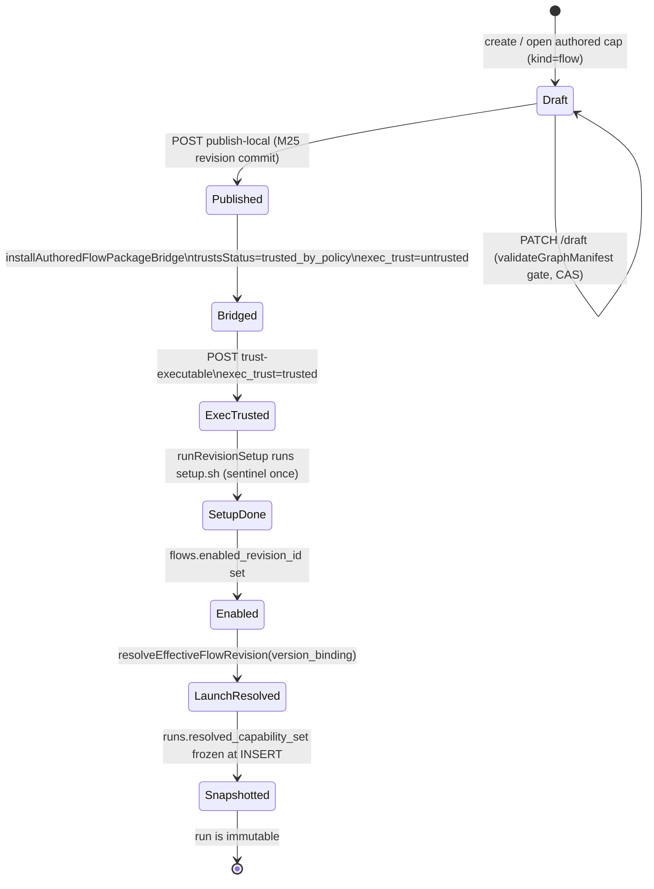
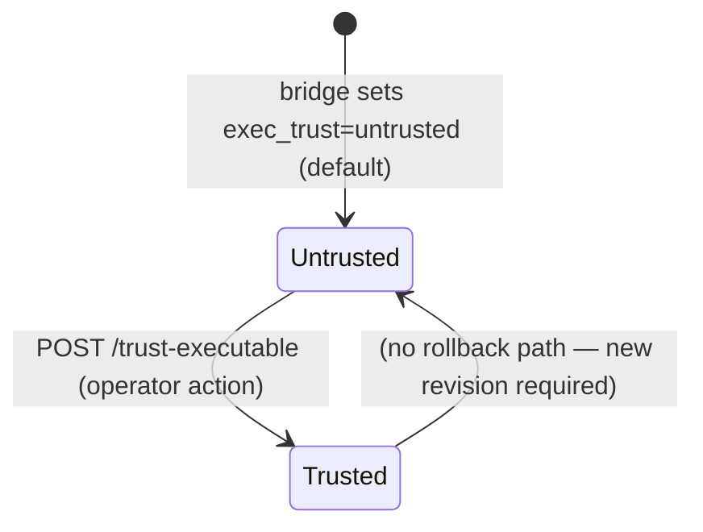
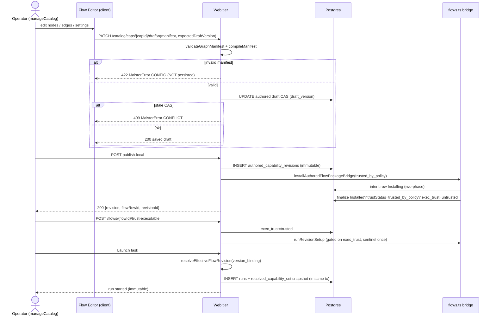

# Flow Studio domain

> **Status: Implemented (M27 Stage 1).** The editor write path, the
> authored→executable bridge with the two-axis trust gate, `version_binding`
> resolve-at-launch, the resolved-capability-set snapshot (in-flight
> immutability), and the MCP management surfaces described here have shipped.
> Source of truth: [`.ai-factory/specs/feature-m27-flow-studio-stage-1.md`](../../.ai-factory/specs/feature-m27-flow-studio-stage-1.md).

## Purpose

The **Flow Studio** domain covers in-app authoring and executable resolution for
flows: turning the read-only M22 workbench graph view into a graph editor that
persists validated authored drafts, publishing those drafts through an
executable bridge that creates runnable `flows` / `flow_revisions` rows, managing
the two independent trust axes (`flows.trustStatus` and
`flow_revisions.exec_trust`) that gate setup and MCP-stdio spawning, resolving
the effective revision at launch via `version_binding`, and snapshotting the
resolved capability set so in-flight runs stay immutable. Its boundary starts
at the edit canvas and ends at the frozen `runs.resolved_capability_set` written
at launch. MCP capability management at platform scope is covered here in so far
as it interacts with the capability-resolution precedence and the executable
bridge; per-run workbench visualization remains in
[`workbench.md`](workbench.md) and flow-graph execution semantics remain in
[`flow-graph.md`](flow-graph.md).

## Domain entities

- **Authored flow draft / revision** — `authored_capabilities` row (kind=`flow`)
  with a mutable draft body, plus immutable `authored_capability_revisions` rows
  (`manifest`, `content_hash`). Source: `web/lib/catalog/authored-service.ts`.
  Persisted in the capabilities schema — see
  [`../db/capabilities-domain.md`](../db/capabilities-domain.md).
- **`source_flow_ref_id` link** — NEW column `authored_capabilities.source_flow_ref_id
  text NULL` (DDL migration `0031+`). When an operator edits an already-installed
  flow the link records its `flow_ref_id` so publish→bridge targets the same
  `flows` lineage. A net-new authored flow mints a fresh `flow_ref_id`.
- **Bridged `flows` / `flow_revisions` rows** — the existing executable-package
  rows produced by `installAuthoredFlowPackageBridge` in `web/lib/flows.ts`.
  Bridge sets `flows.trustStatus=trusted_by_policy` and
  `flow_revisions.exec_trust=untrusted` on publish.
- **`version_binding`** — NEW column `flows.version_binding text NOT NULL DEFAULT
  'latest'` with CHECK `pinned|latest`. `pinned` resolves
  `flows.enabled_revision_id`; `latest` resolves the newest PUBLISHED
  `flow_revisions` for the `flow_ref_id` (authored-wins tie-break; never a
  draft).
- **`flow_revisions.exec_trust`** — NEW second trust axis per-revision (`untrusted
  | trusted`, DDL `0031+`). Gates `runRevisionSetup` (setup.sh) and MCP-stdio
  `command` spawn. Independent of `flows.trustStatus`; a logic-trusted flow is
  never exec-trusted automatically.
- **`runs.resolved_capability_set`** — NEW column `jsonb NULL` (DDL `0031+`).
  Shape: `{ flowRevisionId, flowOrigin, capabilities[], mcps[] }`. Frozen at
  launch, read by the runner. See [`../db/runs-domain.md`](../db/runs-domain.md).
- **Platform MCP server** — NEW table `platform_mcp_servers` (DDL `0031+`), mirroring
  `platform_acp_runners`. Carries transport (`stdio|sse|http`), secrets as
  `env:NAME` references, and its own `trust_status` / `readiness_status`.
- **MCP capability record** — existing `capability_records` (kind=`mcp`,
  source∈`{platform,project,flow-package}`), extended with discriminated
  transport shape (`stdio|sse|http`). Resolution precedence: project > platform >
  flow-package (exactly one winner per `(kind, refId)`, no duplicate
  materialization).

Full ERD: [`../db/capabilities-domain.md`](../db/capabilities-domain.md),
[`../db/projects-domain.md`](../db/projects-domain.md),
[`../db/runs-domain.md`](../db/runs-domain.md).

## State machines

### Authored-flow lifecycle

The lifecycle of an authored flow from first edit through launch, covering both
in-app and bridge states.

### exec_trust axis

The executable-trust state machine is per-revision and independent of
`flows.trustStatus`; explicit operator action is the only transition.

## Process flows

### Edit → validate → save-draft → publish → bridge → trust → setup → launch-resolve → snapshot

The full happy-path from the canvas editor to a frozen immutable run, showing
the hard-gate, two-phase bridge, and snapshot insertion.

## Expectations

The following bullets are copied verbatim from SDD §7.1 (RFC-2119 spirit, each
testable):

1. A draft save MUST run `validateGraphManifest`+`compileManifest` BEFORE the `draft_version` CAS write; an invalid manifest MUST throw `CONFIG` and MUST NOT mutate the draft row.
2. A stale `expectedDraftVersion` MUST fail with `CONFLICT` (409) and MUST NOT write.
3. Editing an installed flow MUST record its `source_flow_ref_id` so publish→bridge targets the SAME `flows` lineage; a net-new authored flow MUST mint a fresh `flow_ref_id`.
4. Publishing an authored `flow` MUST bridge it into a `flows` row + `flow_revisions` row via `installAuthoredFlowPackageBridge`, `trustStatus=trusted_by_policy`, `exec_trust=untrusted`.
5. `setup.sh` MUST NOT run on publish/bridge; it runs ONLY after an explicit `exec_trust` flip, via `runRevisionSetup` (physically separate, sentinel once-only).
6. An MCP stdio `command` MUST NOT be spawned for a revision whose `exec_trust≠trusted`.
7. Launch with `version_binding=latest` MUST resolve the newest PUBLISHED revision, NEVER a draft; authored-wins on tie.
8. Launch MUST snapshot the resolved set into `runs.resolved_capability_set`; the runner MUST read the snapshot, never the live catalog; an edit/publish during a run MUST NOT mutate that run.
9. The editor MUST be read-write only for users with `manageCatalog`; the run-scoped view stays read-only (`readBoard`).
10. No engine bump; no new `runs.status`; presentation stays additive/runner-ignored.

## Edge cases

These map to the authoring and bridge rows from SDD §8:

| Case | `MaisterError` code | HTTP |
|---|---|---|
| Invalid manifest on draft save or publish (not persisted) | `CONFIG` | 422 |
| Stale `expectedDraftVersion` on PATCH /draft | `CONFLICT` | 409 |
| Unknown MCP/skill ref in manifest at validation | `CONFIG` | 422 |
| Required MCP unresolved at launch (`launchRun` insertion point #2) | `CONFIG` | 409 |
| Required MCP agent-unsupported at launch | `EXECUTOR_UNAVAILABLE` | 503 |
| `setup.sh` or MCP stdio spawn attempted before `exec_trust` flip | guarded (no exec, no error raised) | n/a |
| Bridge of an invalid package | `CONFIG` | 422 |
| `version_binding` set to an unknown enum value | `CONFIG` | 422 |

For platform MCP CRUD edge cases (delete while referenced, duplicate id), see
[`acp-runners.md`](acp-runners.md) for the mirror pattern; the MCP server CRUD
follows the same usage-guard and dup-id rules as ADR-065.

## Linked artifacts

- **SDD (FROZEN SSOT):** [`.ai-factory/specs/feature-m27-flow-studio-stage-1.md`](../../.ai-factory/specs/feature-m27-flow-studio-stage-1.md)
- **ADRs (Accepted):**
  ADR-066 (flow editor write path — authored drafts + hard-gate),
  ADR-067 (authored→executable bridge + two-axis trust gate),
  ADR-068 (version_binding + resolve-at-launch + resolved-set snapshot),
  ADR-069 (MCP + capability management model) —
  all accepted in [`../decisions.md`](../decisions.md).
- **ADR-065 (Implemented):** [`../decisions.md#adr-065`](../decisions.md#adr-065-platform-acp-runner-crud-in-settings--hard-delete-blocked-by-any-usage-reference) — admin CRUD pattern mirrored for `platform_mcp_servers`.
- **ADR-064 (Implemented):** authored layout in `flow.yaml` `presentation` section — consumed by the editor, described in [`workbench.md`](workbench.md).
- **ADR-061 (Implemented):** [`../decisions.md#adr-061`](../decisions.md#adr-061-local-authored-capability-catalog-lifecycle) — local authored capability catalog lifecycle (reused M25 draft/CAS).
- **ERDs:**
  [`../db/capabilities-domain.md`](../db/capabilities-domain.md),
  [`../db/projects-domain.md`](../db/projects-domain.md),
  [`../db/runs-domain.md`](../db/runs-domain.md).
- **Web tier source (Implemented):**
  `web/lib/flows.ts` (`installAuthoredFlowPackageBridge`, `runRevisionSetup`), `web/lib/flows/lifecycle.ts` (`resolveEffectiveFlowRevision`),
  `web/lib/catalog/authored-service.ts` (`updateAuthoredDraft`, CAS logic),
  `web/lib/capabilities/resolver.ts` (winner-picking precedence),
  `web/lib/capabilities/materialize.ts` (MCP materialization, reused M14),
  `web/lib/services/runs.ts` (`launchRun` insertion points).
- **OpenAPI routes (Implemented):**
  `PATCH /api/projects/{slug}/catalog/caps/{capId}/draft`,
  `POST /api/projects/{slug}/catalog/caps/{capId}/publish-local`,
  `PATCH /api/projects/{slug}/flows/{flowId}/version-binding`,
  `POST /api/projects/{slug}/flows/{flowId}/trust-executable`,
  `GET|POST /api/admin/mcp-servers`,
  `PATCH|DELETE /api/admin/mcp-servers/{id}` —
  see [`../api/web.openapi.yaml`](../api/web.openapi.yaml).
- **Error taxonomy:** [`../error-taxonomy.md`](../error-taxonomy.md) (`CONFIG`, `CONFLICT`, `EXECUTOR_UNAVAILABLE`).
- **Related domains:**
  [`flow-graph.md`](flow-graph.md) (execution model, node-attempts ledger),
  [`workbench.md`](workbench.md) (read-only graph view the editor extends),
  [`flow-packages.md`](flow-packages.md) (git-sourced install lifecycle, trust/setup precedent),
  [`acp-runners.md`](acp-runners.md) (admin CRUD pattern mirrored for MCP servers),
  [`runs.md`](runs.md) (run state machine, launch preconditions).
