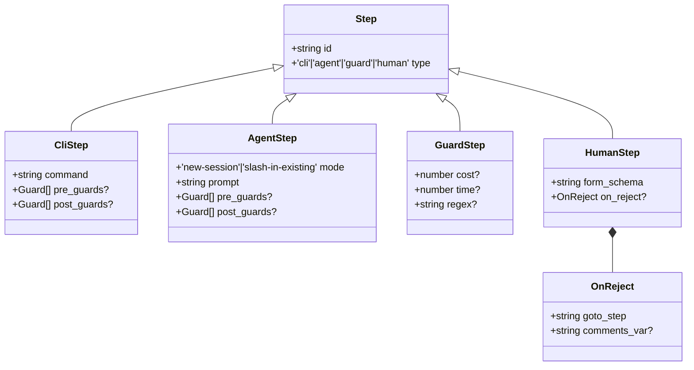
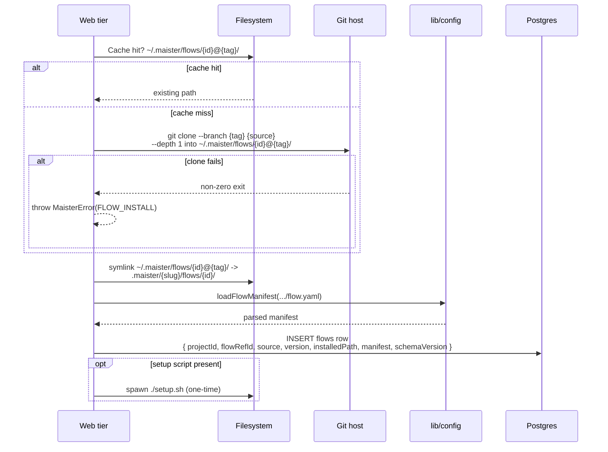
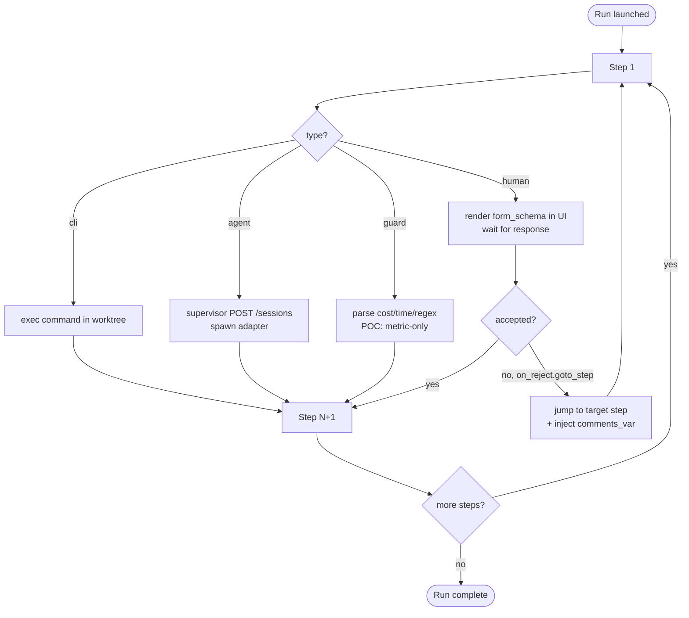
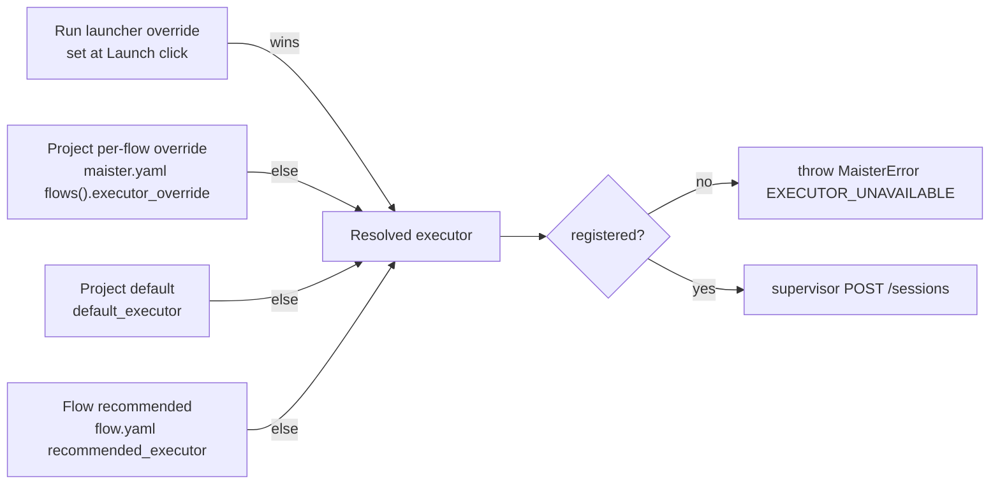

# Flows domain

## Purpose

A **Flow** is a versioned plugin bundle that describes how to execute
one kind of task — bugfix, feature, spec-kit, review, etc. It ships as
a git repository with a manifest (`flow.yaml` v1), shipped CLIs, an
optional `setup.sh`, and a step-typed YAML DSL. MAIster orchestrates
the steps; it does NOT design Flows itself.

## Domain entities

- **Flow plugin** — git repo with `flow.yaml` at root. Pinned by tag.
- **Step** — one of four typed entries in the Flow's `steps[]`:
  `cli`, `agent`, `guard`, `human`.
- **Manifest** — parsed `flow.yaml`. Persisted to `flows.manifest`
  (jsonb).
- **Recommended executor** — optional pointer in the manifest. Lowest
  priority in the override chain ([`executors.md`](executors.md)).

## Step taxonomy

## Process flows

### Install a Flow plugin (Designed M5)

### Step DSL execution model (Designed M7)

Steps run sequentially. A `human` step's `on_reject.goto_step` can loop
back to an earlier step, carrying the user's comments into
`comments_var`.

### Executor override resolution

The executor for an `agent` step is the highest-priority match:

## Expectations

- A Flow plugin is identified by `{id}@{tag}`; install is idempotent on
  that tuple and the cache at `~/.maister/flows/<id>@<tag>/` is
  immutable once written.
- `flow.yaml` is parsed exactly once at install and persisted verbatim
  to `flows.manifest` (jsonb); runtime NEVER re-reads `flow.yaml`.
- `flow.yaml schemaVersion: 1` mismatch refused with `CONFIG` BEFORE
  any filesystem side effect.
- `steps[]` ids are unique within a Flow; duplicates refused with
  `CONFIG`.
- Step types are exactly `cli | agent | guard | human`; unknown type
  refused with `CONFIG`.
- Steps execute sequentially in declaration order; no parallelism on
  POC.
- `agent` step MUST declare `mode`; `human` step MUST declare
  `form_schema`; `guard` step MUST declare at least one of
  `cost | time | regex` — else `CONFIG`.
- `on_reject.goto_step` MUST resolve to an earlier step `id`; jumps to
  a later or missing step refused with `CONFIG`.
- `setup.sh` runs exactly once per `{id}@{tag}` install.
- Executor resolution for every `agent` step is total — produces a
  registered executor or fails with `EXECUTOR_UNAVAILABLE`.
- Guard caps (`cost | time | regex`) are parsed and persisted as
  metrics ONLY on POC; no kill-on-cap (Phase 2).
- Templating in `prompt` is Mustache-style and resolves session
  context, task fields, per-step output vars, and executor metadata.

## Edge cases

- **`schemaVersion: 1` mismatch in `flow.yaml`** → `MaisterError("CONFIG")` on load.
- **Duplicate step id within `steps[]`** → `CONFIG`.
- **`on_reject.goto_step` references a missing step id** → `CONFIG`.
- **`human` step without `form_schema`** → `CONFIG`.
- **`guard` step without any of `cost`/`time`/`regex`** → `CONFIG`.
- **`agent` step missing `mode`** → `CONFIG`.
- **`git clone --branch <tag>` fails** → `FLOW_INSTALL` (502).
- **Tag mutated upstream after install** — MAIster does NOT re-validate
  on each launch (cache hit short-circuits). Operator forces refresh by
  bumping the tag in `maister.yaml`.
- **`setup.sh` exits non-zero** → `FLOW_INSTALL` (502); manifest stays
  uninstalled.
- **Step output token cost exceeds guard cap (POC)** — metric only,
  no kill. Phase 2 adds enforcement.

## Linked artifacts

- ADRs: [ADR-010 Flow Engine v2](../decisions.md#adr-010-flow-engine-v2-plugin-packaging--step-dsl).
- Config reference: [`../configuration.md`](../configuration.md) §`flow.yaml v1`.
- ERD: [`../db/projects-domain.md`](../db/projects-domain.md) (flows table).
- Schemas: `web/lib/config.schema.ts` (zod step union).
- Source: `web/lib/config.ts` (`loadFlowManifest`).
