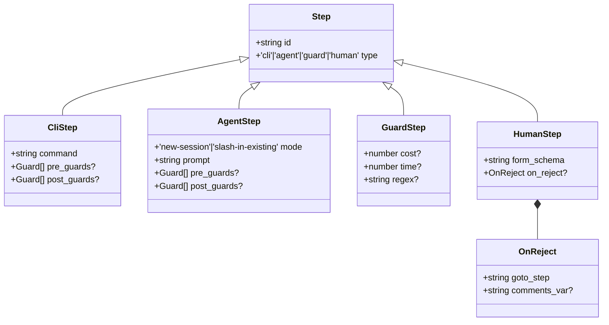
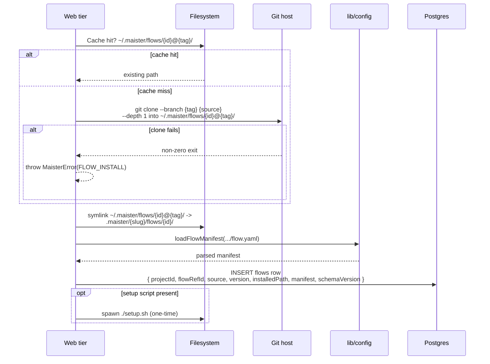
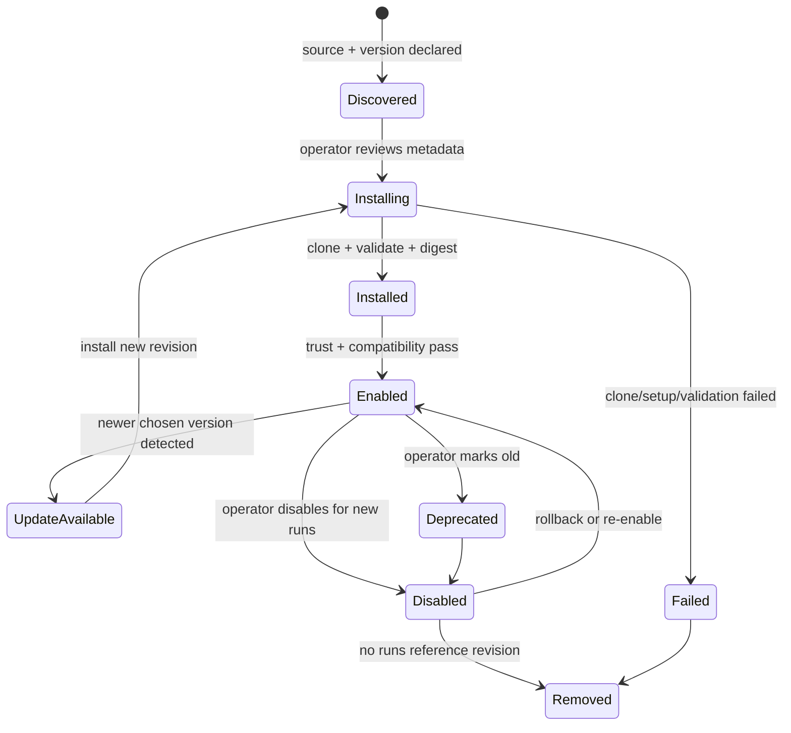
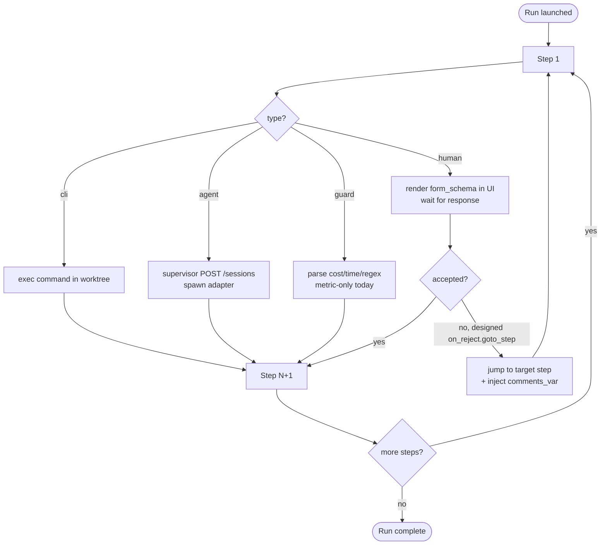
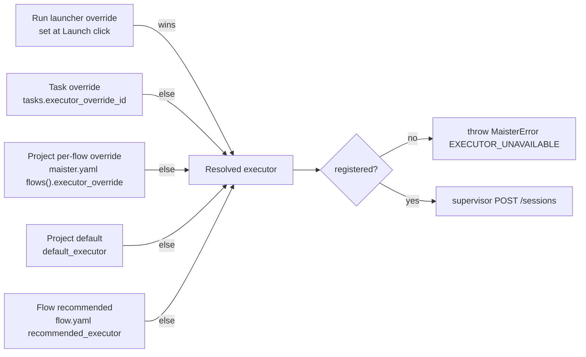

# Flows domain

## Purpose

A **Flow** is a versioned plugin bundle that describes how to execute
one kind of task — bugfix, feature, spec-kit, review, etc. It ships as
a git repository with a manifest (`flow.yaml` v1), shipped CLIs, an
optional `setup.sh`, and a step-typed YAML DSL. MAIster orchestrates
the steps; it does NOT design Flows itself.

## Domain entities

- **Flow plugin** — git repo with `flow.yaml` at root. Pinned by tag.
- **Flow package revision** — immutable installed revision of a Flow package,
  keyed by resolved commit SHA and manifest digest. Planned M10 makes this a
  first-class lifecycle object with trust, compatibility, setup, enablement,
  upgrade, rollback, and deprecation state.
- **Project Flow enablement** — project-level pointer to the Flow package
  revision new runs should use. Existing runs keep their snapshotted revision.
- **Step** — one of four typed entries in the Flow's `steps[]`:
  `cli`, `agent`, `guard`, `human`.
- **Manifest** — parsed `flow.yaml`. Persisted to `flows.manifest`
  (jsonb).
- **Recommended executor** — optional pointer in the manifest. Lowest
  priority in the override chain ([`executors.md`](executors.md)).
- **Gate** — planned Flow-distributed readiness decision over artifacts:
  command check, internal skill/command check, AI judgment, external
  CI/system check, required artifact, or human review.

## Step taxonomy

## Process flows

### Install a Flow plugin (Implemented)

### Package lifecycle (Planned M10)

### Step DSL execution model (Partly implemented)

Steps run sequentially. The `on_reject.goto_step` loop is designed; today
`human` responses are captured and the runner continues to the next step.

### Executor override resolution

The executor for an `agent` step is the highest-priority match:

## Expectations

- A Flow plugin is identified at install time by its upstream **git
  commit SHA**, captured via `git rev-parse HEAD` after the
  tag-pinned clone. The system cache is keyed by the resolved SHA:
  `~/.maister/flows/<flow_ref_id>@<short_sha>/`. The directory is
  content-addressed and immutable once written — re-installing the
  same tag at a different commit (force-pushed tag, replaced tag)
  lands at a new directory, leaving the prior install untouched.
- **(Implemented)** A run executes against an immutable,
  content-addressed flow bundle. At launch the SHA is snapshotted into
  `runs.flow_revision`; the runner derives the bundle path from
  `(flows.flow_ref_id, runs.flow_revision)` via
  `systemCachePath` — **never** from the mutable
  `flows.installed_path` column. A flow upgrade is therefore safe even
  for runs in flight: the new install lands at a new SHA-keyed
  directory and existing runs keep reading their pinned directory.
  Local-source installs (file:// to a non-git directory, used by
  test fixtures) use the literal `"unknown"` sentinel as the
  revision; production flows are git-only.
- `flow.yaml` is parsed exactly once at install and persisted verbatim
  to `flows.manifest` (jsonb); runtime NEVER re-reads `flow.yaml`.
- **(Planned M10)** Package revisions are persisted separately from project
  enablement. A project may have several installed revisions of one Flow id,
  but only one enabled revision is used for new launches.
- **(Planned M10)** Install and upgrade are explicit product actions. Reading
  `maister.yaml` can discover a desired Flow source/version, but it must not
  silently trust, enable, run setup, or replace the project-enabled revision.
- **(Planned M10)** Package metadata includes source, version label, resolved
  revision, manifest digest, compatibility result, trust status, setup status,
  declared nodes, artifacts, gates, capabilities, external operation needs, and
  active run references.
- **(Planned M10)** Upgrade installs a new immutable revision beside the old
  one, validates compatibility, shows a diff of package contract changes, and
  then switches the project enablement only after user confirmation.
- **(Planned M10)** Rollback switches project enablement to an older installed
  revision. Active and completed runs continue to resolve the revision they
  snapshotted at launch.
- **(Planned M10)** Package removal is refused while any run references the
  revision. GC can remove only unreferenced disabled/failed revisions.
- `flow.yaml schemaVersion: 1` mismatch refused with `CONFIG` BEFORE
  any filesystem side effect.
- `steps[]` ids are unique within a Flow; duplicates refused with
  `CONFIG`.
- Step types are exactly `cli | agent | guard | human`; unknown type
  refused with `CONFIG`.
- Steps execute sequentially in declaration order; no parallelism today.
- `agent` step MUST declare `mode`; `human` step MUST declare
  `form_schema`; `guard` step MUST declare at least one of
  `cost | time | regex` — else `CONFIG`.
- `on_reject.goto_step` MUST resolve to an earlier step `id`; jumps to
  a later or missing step refused with `CONFIG`.
- `setup.sh` runs exactly once per `{id}@{tag}` install.
- Executor resolution for every `agent` step is total — produces a
  registered executor or fails with `EXECUTOR_UNAVAILABLE`.
- Guard caps (`cost | time | regex`) are parsed and persisted as
  metrics only; no kill-on-cap today (Phase 2).
- **(Planned)** Flow graph gates replace observational guard-only readiness.
  Gates ship with the Flow plugin, while project config supplies reusable
  command profiles, skill mappings, capability profiles, env profiles, and
  default limits.
- **(Planned)** Gate kinds are `command_check | skill_check | ai_judgment |
  external_check | artifact_required | human_review`; each gate has
  `mode: blocking | advisory` and status `pending | running | passed |
  failed | stale | skipped | overridden`.
- **(Planned M16)** `external_check` gates are satisfied through the
  token-authenticated operations API or the thin MCP facade. Reports become
  typed gate artifacts and participate in readiness, staleness, review, and
  promotion refusal like native gate results.
- **(Planned)** Internal skill/command gates, such as `/aif-review` or
  project QA/checklist skills, run through the same capability materialization
  and artifact recording path as AI nodes when they use an agent session.
- **(Planned)** Review and merge refuse when any required blocking gate is
  missing, pending, running, failed, stale, or skipped. Overrides require a
  declared human review decision and never delete failed evidence.
- Templating in `prompt` is Mustache-style and resolves session
  context, task fields, per-step output vars, and executor metadata.

## Edge cases

- **`schemaVersion: 1` mismatch in `flow.yaml`** → `MaisterError("CONFIG")` on load.
- **Duplicate step id within `steps[]`** → `CONFIG`.
- **`on_reject.goto_step` references a missing step id** → `CONFIG`.
- **`human` step without `form_schema`** → `CONFIG`.
- **`guard` step without any of `cost`/`time`/`regex`** → `CONFIG`.
- **`agent` step missing `mode`** → `CONFIG`.
- **`git clone --branch <tag>` fails** → `FLOW_INSTALL` (502).
- **Tag mutated upstream after install** — MAIster does NOT re-validate
  on each launch (cache hit short-circuits). Operator forces refresh by
  bumping the tag in `maister.yaml`.
- **Package revision disabled after launch** — in-flight runs keep using their
  snapshotted revision; only new launches are refused.
- **Package revision removed while referenced by a run** → `PRECONDITION`;
  referenced immutable revisions are retained.
- **Package requires unsupported MAIster engine/API/capability** → cannot be
  enabled; launch fails before workspace creation.
- **`setup.sh` exits non-zero** → `FLOW_INSTALL` (502); manifest stays
  uninstalled.
- **Step output token cost exceeds guard cap** — metric only,
  no kill. Phase 2 adds enforcement.

## Linked artifacts

- ADRs: [ADR-010 Flow Engine v2](../decisions.md#adr-010-flow-engine-v2-plugin-packaging--step-dsl).
- Package lifecycle: [`flow-packages.md`](flow-packages.md).
- Config reference: [`../configuration.md`](../configuration.md) §`flow.yaml v1`.
- ERD: [`../db/projects-domain.md`](../db/projects-domain.md) (flows table).
- Schemas: `web/lib/config.schema.ts` (zod step union).
- Source: `web/lib/config.ts` (`loadFlowManifest`).
