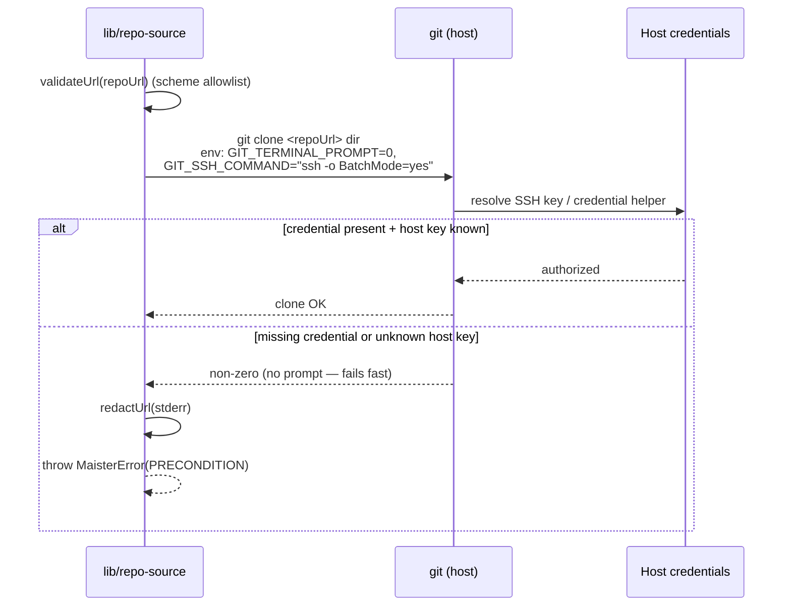
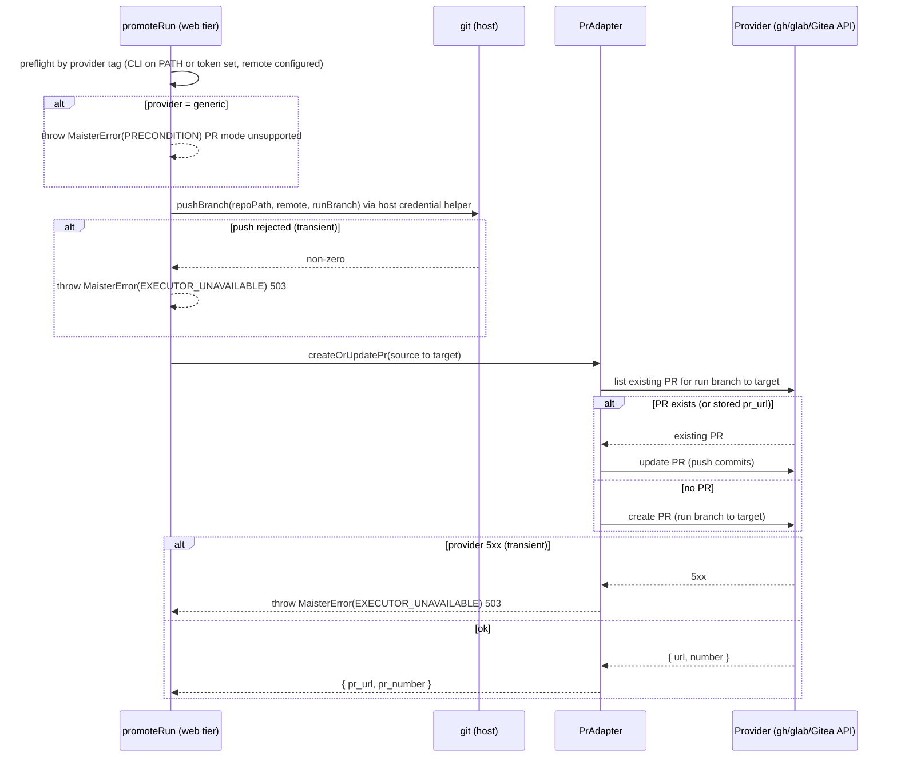

# Git integration domain

## Purpose

Git integration is the host-credential, provider-neutral git layer MAIster
uses to clone repos, initialize them, read remotes, and run worktree /
merge operations. The boundary covers how MAIster talks to git and how it
auto-detects a provider tag from a URL — NOT the project lifecycle that
consumes it (see [`projects.md`](projects.md)). The layer is host-credential
only: clone/push use the host's SSH key or git credential helper and MAIster
holds zero git provider secrets (credential **model B**). See
[ADR-025](../decisions.md#adr-025-project-repo-onboarding--url-clone-or-local-path-host-credential-auth-configurable-roots).
M18 extends this layer with `git push` and **conditional, provider-dispatched
PR creation** for `pull_request` promotion (**Designed**) — see
[ADR-049](../decisions.md#adr-049-pr-promotion-via-a-hybrid-provider-pradapter-credential-model-b-reverses-the-gh-is-never-invoked-invariant).

## Domain entities

- **Provider tag** — `github | gitlab | gitea | gitverse | generic`,
  derived from the URL host by `detectProvider()`. Metadata for web links and,
  from M18, the **PR-mode dispatch key**; GitVerse is Gitea-family.
- **Host credentials** — the OS user's SSH key (`~/.ssh`) or git
  credential helper. Owned by the host, never by MAIster.
- **Generic git-ops layer** — the provider-neutral operations in
  `web/lib/repo-source.ts`: `cloneRepo`, `gitInit`, `readRemoteOrigin`,
  `isGitRepo`, `assertGitAvailable` (plus the worktree / merge wrappers
  elsewhere). All run against a resolved local path.
- **Branch push (`pushBranch`)** — **Designed (M18)**. Pushes the run branch
  to the configured remote via the host git credential helper (no MAIster
  secret). Used by `pull_request` promotion before PR creation.
- **`PrAdapter` (provider PR dispatch)** — **Designed (M18)**. One interface,
  three implementations selected by the project's provider tag:
  `github`→`GhCliAdapter` (`gh` CLI), `gitlab`→`GlabCliAdapter` (`glab` CLI),
  `gitea`+`gitverse`→a shared `GiteaApiAdapter` (Gitea-compatible REST API,
  host-env bearer token `GITEA_TOKEN`/`GITVERSE_TOKEN`). `generic` (unknown
  host) → `PRECONDITION` "PR mode unsupported for provider". See
  [ADR-049](../decisions.md#adr-049-pr-promotion-via-a-hybrid-provider-pradapter-credential-model-b-reverses-the-gh-is-never-invoked-invariant).

## State machine

N/A — git integration is a stateless operation layer. Each git invocation
is independent; there is no persisted lifecycle to model.

## Process flows

### Provider detection (Implemented)

`detectProvider()` parses the host from both URL and scp (`git@host:org/repo`)
forms, then classifies it. Anything unrecognized — including self-hosted
GitLab/Gitea — falls through to `generic`.

### Credentialed clone (Implemented)

Clone runs non-interactive against the host's credentials. A missing or
wrong credential, or an unknown host key, fails fast instead of hanging on a
prompt. Any URL is credential-redacted before it reaches a log or error.

Status: **Implemented** — `web/lib/repo-source.ts`.

### Push + provider-dispatched PR creation (Designed, M18)

`pull_request` promotion pushes the run branch (host credentials) and then
dispatches PR creation on the project's provider tag. The CLI adapters shell
`gh`/`glab` with array args + `--end-of-options` (no shell interpolation); the
Gitea adapter calls the REST API with a host-env bearer token. The operation is
idempotent: when a PR already exists for `(run branch → target)` it is updated,
never duplicated (the promotion service stores `pr_url`; the provider query is
the crash-window fallback — see [`workspaces.md`](workspaces.md)). Tokens,
credentials, and secret-bearing URLs are NEVER logged.

Status: **Designed (M18)** — `web/lib/worktree.ts` (`pushBranch`) +
`web/lib/runs/pr-adapter.ts` (`GhCliAdapter`, `GlabCliAdapter`,
`GiteaApiAdapter`). Wired by the shared promotion service in
[`workspaces.md`](workspaces.md).

## Expectations

- MAIster stores zero git provider secrets at rest; auth is host-credential
  only ([ADR-025](../decisions.md#adr-025-project-repo-onboarding--url-clone-or-local-path-host-credential-auth-configurable-roots)).
- All git operations are local and provider-neutral — clone, init, remote
  read, worktree, and merge run against a resolved local path.
- Git runs non-interactive (`GIT_TERMINAL_PROMPT=0`, `BatchMode=yes`) so a
  missing credential or unknown host key fails fast rather than hanging.
- Any URL is credential-redacted (`redactUrl`) before it reaches a log or
  an error message.
- Provider detection is best-effort metadata and NEVER gates cloning;
  `detectProvider()` returns `generic` on any unrecognized host.
- **(Designed, M18)** `gh`/`glab` and the Gitea REST API are invoked ONLY for
  `pull_request` promotion, dispatched on the provider tag: `github`→`gh`,
  `gitlab`→`glab`, `gitea`+`gitverse`→Gitea REST API, `generic`→`PRECONDITION`
  unsupported. `local_merge` promotion and every clone/worktree/merge path
  NEVER invoke a provider CLI or PR API.
- **(Designed, M18)** PR creation MUST be idempotent: an existing PR for
  `(run branch → target)` is updated, never duplicated; the run's stored
  `pr_url` plus a provider query are the dedup keys.
- **(Designed, M18)** `git push` and PR creation MUST use host credentials /
  host-env provider tokens only (credential model B); no provider secret is
  stored by MAIster, and tokens / secret-bearing URLs are NEVER logged.

## Edge cases

- **Unknown SSH host key** → with `BatchMode=yes` the clone fails fast
  rather than prompting; `known_hosts` must be seeded — see
  [`../deployment.md`](../deployment.md).
- **Token embedded in the URL** → redacted by `redactUrl()` before logging
  or surfacing in any `PRECONDITION` error. The URL is still **persisted as
  entered** in `projects.repo_url` (a user-supplied credential is the user's
  choice, not a MAIster-managed secret); the Add-Project form warns when
  credentials are present and recommends host SSH keys / a credential helper.
- **Self-hosted GitLab / Gitea host** → classified as `generic`; cloning is
  unaffected (provider is metadata only). **(Designed, M18)** a `generic`
  provider cannot use `pull_request` promotion (`PRECONDITION`); `local_merge`
  is always available.
- **Cloned default branch ≠ `project.main_branch`** → not caught here;
  surfaces at Launch when the run branch base is resolved.
- **(Designed, M18) PR-mode prerequisite missing** → `gh`/`glab` absent on PATH
  (github/gitlab) or `GITEA_TOKEN`/`GITVERSE_TOKEN` unset (gitea-family), or no
  configured remote → `PRECONDITION`; the run stays `Review`.
- **(Designed, M18) push rejected / PR-API 5xx** → transient →
  `EXECUTOR_UNAVAILABLE` (HTTP 503); the promotion is idempotently retryable.

## Linked artifacts

- ADRs: [ADR-025 Project repo onboarding](../decisions.md#adr-025-project-repo-onboarding--url-clone-or-local-path-host-credential-auth-configurable-roots),
  [ADR-049 PR promotion via a hybrid provider `PrAdapter`](../decisions.md#adr-049-pr-promotion-via-a-hybrid-provider-pradapter-credential-model-b-reverses-the-gh-is-never-invoked-invariant)
  (Designed, M18).
- Deployment (host credentials, `known_hosts` seeding):
  [`../deployment.md`](../deployment.md).
- Related domains: [`projects.md`](projects.md),
  [`instance-config.md`](instance-config.md) (gh/glab + Gitea-API token status),
  [`workspaces.md`](workspaces.md) (promotion service that drives push + PR).
- Source: `web/lib/repo-source.ts`; **(Designed, M18)** `web/lib/worktree.ts`
  (`pushBranch`), `web/lib/runs/pr-adapter.ts`.
