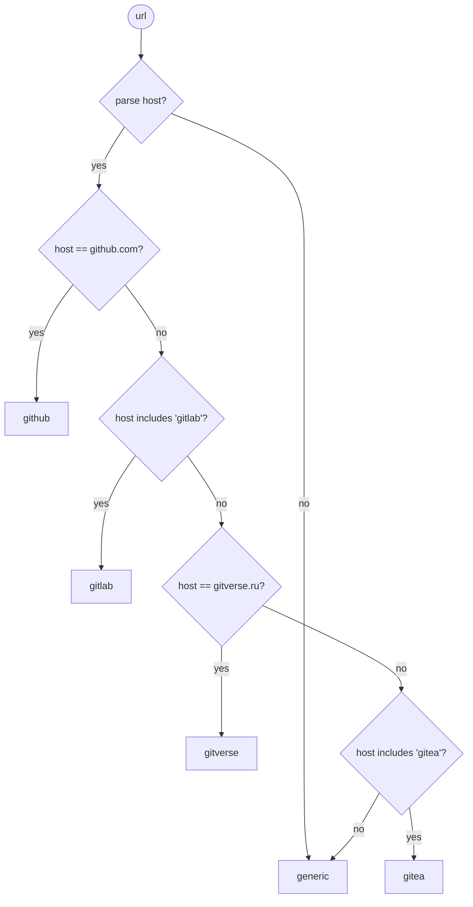
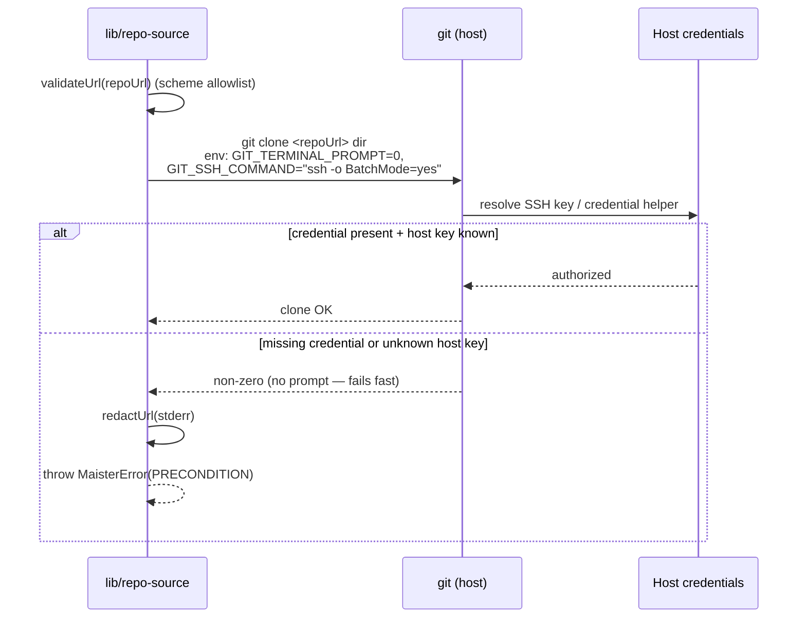
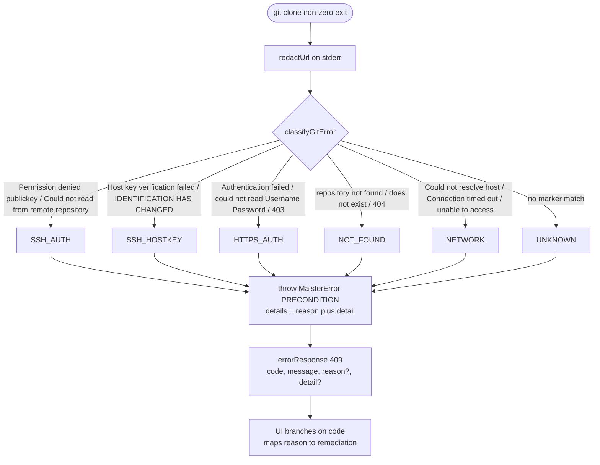
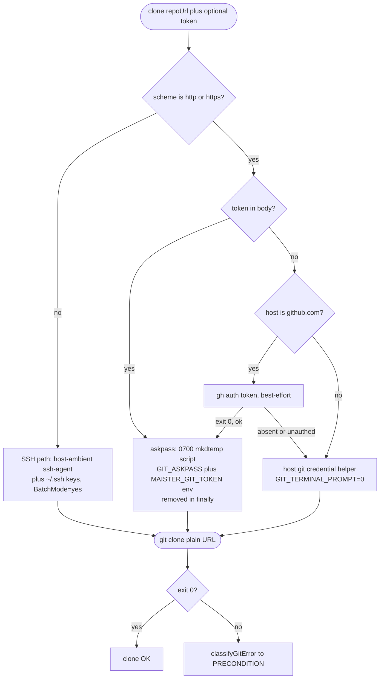
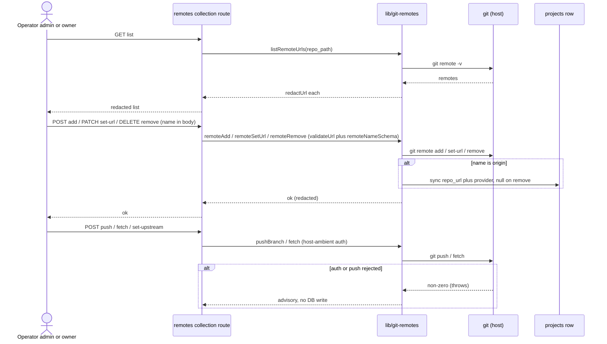
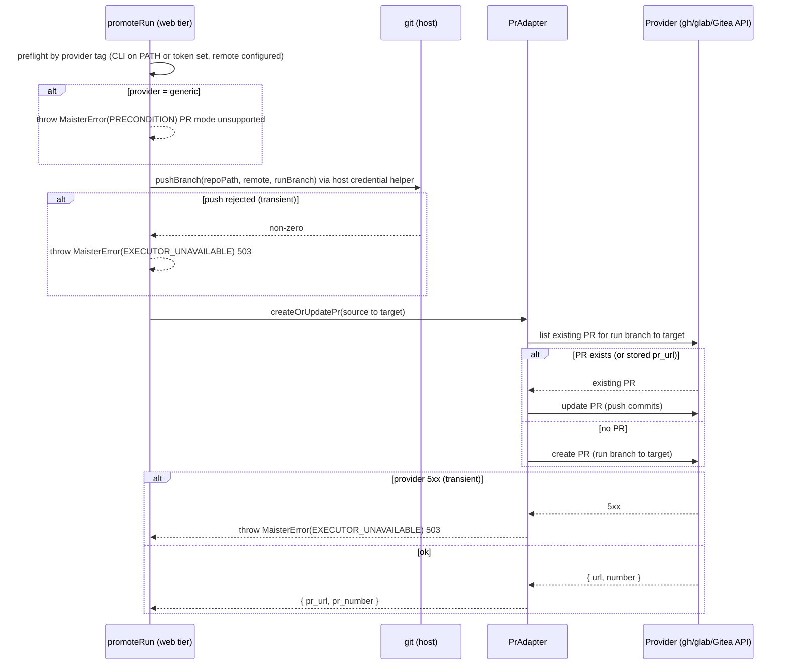
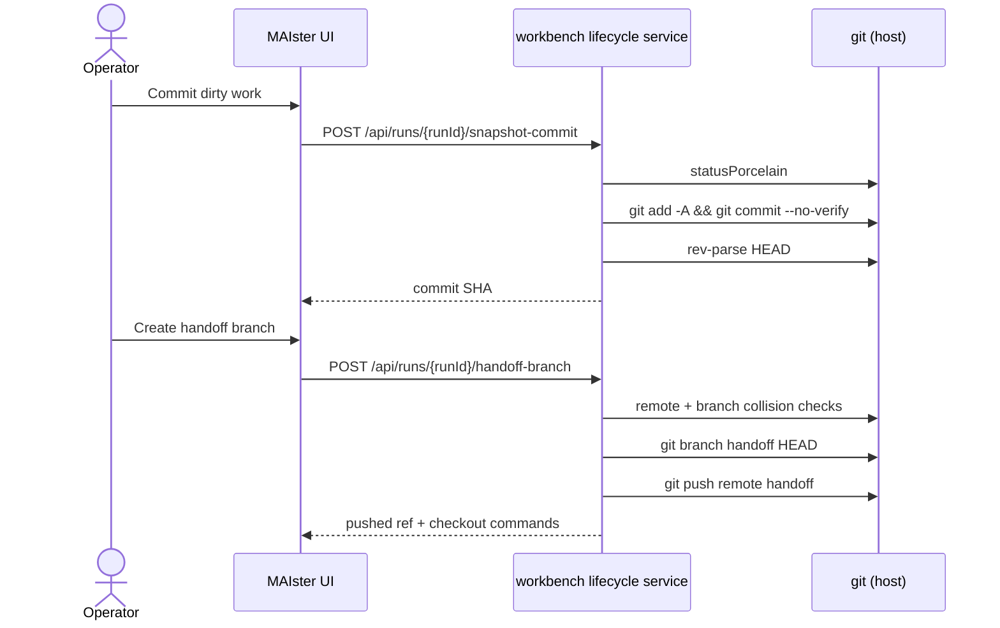

# Git integration domain

## Purpose

Git integration is the host-credential, provider-neutral git layer MAIster
uses to clone repos, initialize them, read remotes, and run worktree /
merge operations. The boundary covers how MAIster talks to git and how it
auto-detects a provider tag from a URL — NOT the project lifecycle that
consumes it (see [`projects.md`](projects.md)). The layer is host-credential
only: clone/push use the host's SSH key or git credential helper and MAIster
holds zero git provider secrets (credential **model B**). See
[ADR-025](../decisions.md#adr-025-project-repo-onboarding--url-clone-or-local-path-host-credential-auth-configurable-roots).
M18 extends this layer with `git push` and **conditional, provider-dispatched
PR creation** for `pull_request` promotion (**Implemented (M18)**) — see
[ADR-049](../decisions.md#adr-049-pr-promotion-via-a-hybrid-provider-pradapter-credential-model-b-reverses-the-gh-is-never-invoked-invariant).

## Domain entities

- **Provider tag** — `github | gitlab | gitea | gitverse | generic`,
  derived from the URL host by `detectProvider()`. Metadata for web links and,
  from M18, the **PR-mode dispatch key**; GitVerse is Gitea-family.
- **Host credentials** — the OS user's SSH key (`~/.ssh`) or git
  credential helper. Owned by the host, never by MAIster.
- **Generic git-ops layer** — the provider-neutral operations in
  `web/lib/repo-source.ts`: `cloneRepo`, `gitInit`, `readRemoteOrigin`,
  `isGitRepo`, `assertGitAvailable` (plus the worktree / merge wrappers
  elsewhere). All run against a resolved local path.
- **Clone-failure reason (`CloneFailureReason`)** — **(Designed, ADR-093)**. A
  classification of a failed `git clone`, computed from the redacted git stderr
  by the pure `classifyGitError(stderr)` helper:
  `SSH_AUTH | SSH_HOSTKEY | HTTPS_AUTH | NOT_FOUND | NETWORK | UNKNOWN`. It is
  **advisory context on the unchanged `PRECONDITION` code**, never a new error
  code — the shape and UI contract live in
  [`../error-taxonomy.md`](../error-taxonomy.md) (R7).
- **Host-ambient git auth** — **(Designed, ADR-093)**. The host's own
  mechanisms: ssh-agent + `~/.ssh` keys (SSH URLs), the host git credential
  helper (HTTP(S) URLs), optional GitHub `gh` (best-effort `gh auth token`),
  and the one-off **HTTPS token** field. No managed credential store; MAIster
  holds zero git provider secrets at rest (credential model B / Q2=A, ADR-093).
- **One-off HTTPS token (`MAISTER_GIT_TOKEN`)** — **(Designed, ADR-093)**. An
  optional per-clone token, askpass-injected into the git child-process env and
  a `0700` temp script only, **never persisted** (not in argv, a key file,
  `.git/config`, `projects.repo_url`, or any log). It is **not** a host-read env
  var — see [`../configuration.md`](../configuration.md).
- **Remote management layer (`web/lib/git-remotes.ts`)** — **(Designed,
  ADR-093)**. Orchestrates `git remote` list/add/set-url/remove + push/fetch/
  set-upstream over the validated `worktree.ts` primitives, path-confined to
  `projects.repo_path`; adding/setting `origin` syncs `projects.repo_url` +
  `provider` (`detectProvider`). Backs the single collection route
  `GET/POST/PATCH/DELETE /api/projects/{slug}/remotes`.
- **Branch push (`pushBranch`)** — **Implemented (M18)**. Pushes the run branch
  to the configured remote via the host git credential helper (no MAIster
  secret). Used by `pull_request` promotion before PR creation.
- **Workbench lifecycle git helpers (`listRemotes`, `headCommit`,
  `localBranchExists`, `remoteBranchExists`, `createBranchAtHead`)** —
  **Implemented (M27)**. Used by workbench snapshot/handoff/export actions.
  They validate remote and branch names before invoking git, keep the current
  MAIster worktree on its server-owned run branch, and never create or update a
  provider PR.
- **`PrAdapter` (provider PR dispatch)** — **Implemented (M18)**. One interface,
  three implementations selected by the project's provider tag:
  `github`→`GhCliAdapter` (`gh` CLI), `gitlab`→`GlabCliAdapter` (`glab` CLI),
  `gitea`+`gitverse`→a shared `GiteaApiAdapter` (Gitea-compatible REST API,
  host-env bearer token `GITEA_TOKEN`/`GITVERSE_TOKEN`). `generic` (unknown
  host) → `PRECONDITION` "PR mode unsupported for provider". See
  [ADR-049](../decisions.md#adr-049-pr-promotion-via-a-hybrid-provider-pradapter-credential-model-b-reverses-the-gh-is-never-invoked-invariant).

## State machine

N/A — git integration is a stateless operation layer. Each git invocation
is independent; there is no persisted lifecycle to model.

## Process flows

### Provider detection (Implemented)

`detectProvider()` parses the host from both URL and scp (`git@host:org/repo`)
forms, then classifies it. Anything unrecognized — including self-hosted
GitLab/Gitea — falls through to `generic`.

### Credentialed clone (Implemented)

Clone runs non-interactive against the host's credentials. A missing or
wrong credential, or an unknown host key, fails fast instead of hanging on a
prompt. Any URL is credential-redacted before it reaches a log or error.

Status: **Implemented** — `web/lib/repo-source.ts`.

### Clone-failure classification (Designed, ADR-093)

A failed clone no longer collapses to a generic `PRECONDITION`. `cloneRepo`'s
catch redacts the git stderr, runs `classifyGitError` over it to derive a
`CloneFailureReason`, and attaches advisory `{ reason, detail }` context to the
**unchanged** `PRECONDITION` error. The route serializes it; the UI branches on
`code` and maps `reason` to a specific remediation (it NEVER string-matches
stderr). Marker strings per design §5.1.

Status: **Designed (ADR-093)** — `classifyGitError` + `cloneRepo` catch in
`web/lib/repo-source.ts`; shape in [`../error-taxonomy.md`](../error-taxonomy.md).

### Auth resolution + one-off HTTPS token (Designed, ADR-093)

Clone auth is host-ambient. SSH URLs use the host ssh-agent + `~/.ssh` keys.
HTTP(S) URLs use the host git credential helper, unless the user supplies a
one-off **token** (any host) or the URL host is `github.com` and `gh auth token`
succeeds — both feed a `0700` `mkdtemp` **askpass** script
(`GIT_ASKPASS` + `MAISTER_GIT_TOKEN` env), clone the **plain** URL, and remove
the temp dir in `finally`. The token is never in argv, a key file, `.git/config`,
`projects.repo_url`, or any log, and is **not persisted**. `gh` is best-effort:
absent or unauthed degrades to the credential-helper path (likely `HTTPS_AUTH`,
whose remediation surfaces the `gh` fork for `github.com`).

**SSH guidance (messages only, no in-app keygen).** When the reason is
`SSH_AUTH`, the remediation copy leads with (1) `ssh-add --apple-use-keychain
~/.ssh/<key>` (load an existing key — the most likely fix), then (2) switch to
HTTPS + a token, then (3) create a **passphrase-less deploy key**
(`ssh-keygen -t ed25519 -N "" -f ~/.ssh/maister_<host>`, add the `.pub` to the
provider, load it). MAIster generates no keys itself.

Status: **Designed (ADR-093)** — `cloneRepo` token/askpass path + `detectGhAuth`
in `web/lib/repo-source.ts`.

### Remote management (Designed, ADR-093)

A local-only project (`no-remote` / new-empty) attaches a remote later through
Project Settings → Git, served by the single collection route
`GET/POST/PATCH/DELETE /api/projects/{slug}/remotes` (admin/owner). `GET` lists
`git remote -v` with URLs redacted; `POST`/`PATCH`/`DELETE` add/set-url/remove;
the route also drives push/fetch/set-upstream (host-ambient auth, advisory on
failure). The remote `name` travels in the **body** for `PATCH`/`DELETE` (a
`[name]` path segment cannot represent `/`-containing names), validated by the
existing `remoteNameSchema`; the `url` is scheme-validated by `validateUrl`.
Adding/setting `origin` syncs `projects.repo_url` + `provider`; removing it nulls
them.

Status: **Designed (ADR-093)** — `web/lib/git-remotes.ts` over `worktree.ts`
remote primitives; route `web/app/api/projects/[slug]/remotes/route.ts`.

### Push + provider-dispatched PR creation (Implemented, M18)

`pull_request` promotion pushes the run branch (host credentials) and then
dispatches PR creation on the project's provider tag. The CLI adapters shell
`gh`/`glab` with array args + `--end-of-options` (no shell interpolation); the
Gitea adapter calls the REST API with a host-env bearer token. The operation is
idempotent: when a PR already exists for `(run branch → target)` it is updated,
never duplicated (the promotion service stores `pr_url`; the provider query is
the crash-window fallback — see [`workspaces.md`](workspaces.md)). Tokens,
credentials, and secret-bearing URLs are NEVER logged.

Status: **Implemented (M18)** — `web/lib/worktree.ts` (`pushBranch`) +
`web/lib/runs/pr-adapter.ts` (`GhCliAdapter`, `GlabCliAdapter`,
`GiteaApiAdapter`). Wired by the shared promotion service in
[`workspaces.md`](workspaces.md).

> **Manual verification (not in CI).** The provider boundary is MOCKED in CI:
> the `gh`/`glab` CLI exec AND the Gitea-API `fetch` are stubbed, so no real
> remote is touched. A live `gh`/`glab` push + PR and a live Gitea/GitVerse PR
> MUST be exercised in manual verification against a real remote (credential
> **model B** — host credentials + provider tooling). GitVerse's
> Gitea-API compatibility was confirmed: `gitverse` rides the shared
> `GiteaApiAdapter`; only the token var (`GITVERSE_TOKEN`) and `apiBase` differ.

### Workbench snapshot and handoff git operations (Implemented, M27)

Workbench lifecycle actions reuse the same host-credential model but do not
mean promotion. `snapshot-commit` writes one commit on the run branch;
`handoff-branch` creates a new branch at the workbench HEAD, checks local and
remote collisions, pushes that branch, and returns checkout commands.

Status: **Implemented (M27)** — `web/lib/workbench-lifecycle/service.ts` +
`web/lib/worktree.ts`. Branch/remote/path inputs are validated by typed helper
schemas, and secret-bearing remote output is redacted before errors surface.

## Expectations

- MAIster stores zero git provider secrets at rest; auth is host-credential
  only ([ADR-025](../decisions.md#adr-025-project-repo-onboarding--url-clone-or-local-path-host-credential-auth-configurable-roots)).
- All git operations are local and provider-neutral — clone, init, remote
  read, worktree, and merge run against a resolved local path.
- Git runs non-interactive (`GIT_TERMINAL_PROMPT=0`, `BatchMode=yes`) so a
  missing credential or unknown host key fails fast rather than hanging.
- Any URL is credential-redacted (`redactUrl`) before it reaches a log or
  an error message.
- Provider detection is best-effort metadata and NEVER gates cloning;
  `detectProvider()` returns `generic` on any unrecognized host.
- **(Implemented, M18)** `gh`/`glab` and the Gitea REST API are invoked ONLY for
  `pull_request` promotion, dispatched on the provider tag: `github`→`gh`,
  `gitlab`→`glab`, `gitea`+`gitverse`→Gitea REST API, `generic`→`PRECONDITION`
  unsupported. `local_merge` promotion and every clone/worktree/merge path
  NEVER invoke a provider CLI or PR API.
- **(Implemented, M18)** PR creation MUST be idempotent: an existing PR for
  `(run branch → target)` is updated, never duplicated; the run's stored
  `pr_url` plus a provider query are the dedup keys.
- **(Implemented, M18)** `git push` and PR creation MUST use host credentials /
  host-env provider tokens only (credential model B); no provider secret is
  stored by MAIster, and tokens / secret-bearing URLs are NEVER logged.
- **(Designed, ADR-093)** A failed clone MUST keep `code = "PRECONDITION"` and
  carry advisory `{ reason, detail }` only; the one-off `MAISTER_GIT_TOKEN` MUST
  live solely in the git child-process env + a `0700` askpass file removed in
  `finally` (never argv / key file / `.git/config` / `projects.repo_url` / log),
  MUST NOT be persisted, and adding/setting `origin` via `/remotes` MUST sync
  `projects.repo_url` + `provider` while a remove MUST null them.

## Edge cases

- **Unknown SSH host key** → with `BatchMode=yes` the clone fails fast
  rather than prompting; `known_hosts` must be seeded — see
  [`../deployment.md`](../deployment.md).
- **Token embedded in the URL** → redacted by `redactUrl()` before logging
  or surfacing in any `PRECONDITION` error. The URL is still **persisted as
  entered** in `projects.repo_url` (a user-supplied credential is the user's
  choice, not a MAIster-managed secret); the Add-Project form warns when
  credentials are present and recommends host SSH keys / a credential helper.
- **Self-hosted GitLab / Gitea host** → classified as `generic`; cloning is
  unaffected (provider is metadata only). **(Implemented, M18)** a `generic`
  provider cannot use `pull_request` promotion (`PRECONDITION`); `local_merge`
  is always available.
- **Cloned default branch ≠ `project.main_branch`** → not caught here;
  surfaces at Launch when the run branch base is resolved.
- **(Implemented, M18) PR-mode prerequisite missing** → `gh`/`glab` absent on PATH
  (github/gitlab) or `GITEA_TOKEN`/`GITVERSE_TOKEN` unset (gitea-family), or no
  configured remote → `PRECONDITION`; the run stays `Review`.
- **(Implemented, M18) push rejected / PR-API 5xx** → transient →
  `EXECUTOR_UNAVAILABLE` (HTTP 503); the promotion is idempotently retryable.
- **(Implemented, M27) workbench handoff remote missing or branch collision** →
  `PRECONDITION`/`CONFLICT` (HTTP 409); the workbench remains in its current
  state and no provider PR is created.
- **(Implemented, M27) handoff remote check or push transiently fails** →
  `EXECUTOR_UNAVAILABLE` (HTTP 503); the lifecycle claim is left retryable and
  the operator can re-run the action.
- **(Designed, ADR-093) clone fails on SSH auth** (`Permission denied
  (publickey)` — e.g. a passphrase key absent from the ssh-agent under
  `BatchMode=yes`) → `PRECONDITION` (HTTP 409) with `reason: "SSH_AUTH"`; the UI
  leads with `ssh-add --apple-use-keychain`.
- **(Designed, ADR-093) clone fails on HTTPS auth** (`Authentication failed` /
  `403`, no/expired token) → `PRECONDITION` with `reason: "HTTPS_AUTH"`; for a
  `github.com` host the remediation surfaces the `gh auth login` / paste-token /
  SSH fork.
- **(Designed, ADR-093) clone fails on unknown host key, missing repo, or
  network** → `PRECONDITION` with `reason: "SSH_HOSTKEY" | "NOT_FOUND" |
  "NETWORK"` respectively; an unrecognized stderr → `reason: "UNKNOWN"` with the
  redacted `detail` still surfaced.
- **(Designed, ADR-093) one-off HTTPS token supplied** → injected via the `0700`
  askpass path and removed in `finally`; on success `projects.repo_url` stores
  the **plain** URL (token never persisted); a still-failing auth → `HTTPS_AUTH`
  `PRECONDITION`.
- **(Designed, ADR-093) `/remotes` add/set-url with an invalid url or name** →
  `PRECONDITION` (HTTP 409) from `validateUrl` / `remoteNameSchema`; a
  non-admin/owner caller → `UNAUTHORIZED` (HTTP 403); push/fetch auth failure is
  an **advisory** (no DB write, nothing to roll back).

## Linked artifacts

- ADRs: [ADR-025 Project repo onboarding](../decisions.md#adr-025-project-repo-onboarding--url-clone-or-local-path-host-credential-auth-configurable-roots),
  [ADR-049 PR promotion via a hybrid provider `PrAdapter`](../decisions.md#adr-049-pr-promotion-via-a-hybrid-provider-pradapter-credential-model-b-reverses-the-gh-is-never-invoked-invariant)
  (Implemented, M18),
  [ADR-093 Project onboarding — optional `maister.yaml`, host-ambient git auth, onboarding modes, advisory clone reasons](../decisions.md#adr-093-project-onboarding--optional-maisteryaml-host-ambient-git-auth-onboarding-modes-advisory-clone-reasons)
  (Designed).
- Clone-failure `{ reason, detail }` shape + UI contract:
  [`../error-taxonomy.md`](../error-taxonomy.md).
- Screens (Designed, ADR-093): [`../screens/projects/add-project.md`](../screens/projects/add-project.md)
  (classified clone remediation), [`../screens/projects/project-settings-git.md`](../screens/projects/project-settings-git.md)
  (remotes management).
- Deployment (host credentials, `known_hosts` seeding):
  [`../deployment.md`](../deployment.md).
- Related domains: [`projects.md`](projects.md),
  [`instance-config.md`](instance-config.md) (gh/glab + Gitea-API token status),
  [`workspaces.md`](workspaces.md) (promotion service that drives push + PR),
  [`workbench-lifecycle.md`](workbench-lifecycle.md) (snapshot, export, and
  handoff operations).
- Source: `web/lib/repo-source.ts`; **(Implemented, M18)** `web/lib/worktree.ts`
  (`pushBranch`), `web/lib/runs/pr-adapter.ts`; **(Implemented, M27)**
  `web/lib/worktree.ts` (`listRemotes`, `headCommit`, branch collision helpers,
  `createBranchAtHead`); **(Designed, ADR-093)** `web/lib/repo-source.ts`
  (`classifyGitError`, token/askpass clone, `detectGhAuth`),
  `web/lib/git-remotes.ts`, `web/app/api/projects/[slug]/remotes/route.ts`.
