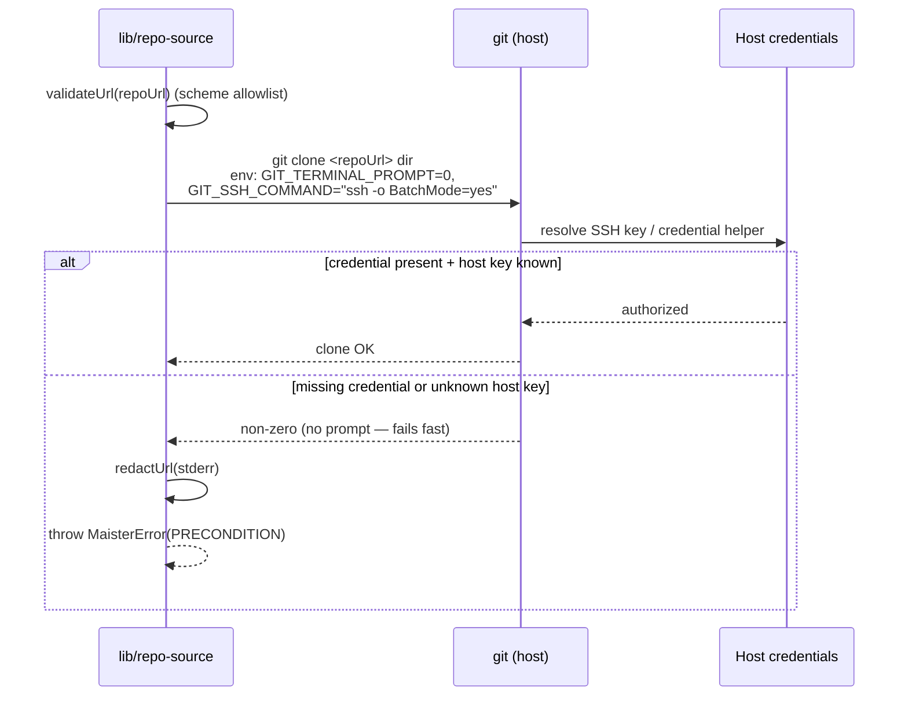

# Git integration domain

## Purpose

Git integration is the host-credential, provider-neutral git layer MAIster
uses to clone repos, initialize them, read remotes, and run worktree /
merge operations. The boundary covers how MAIster talks to git and how it
auto-detects a provider tag from a URL — NOT the project lifecycle that
consumes it (see [`projects.md`](projects.md)) and NOT push/PR mode (M18).
MAIster holds zero git provider secrets; auth is the host's. See
[ADR-025](../decisions.md#adr-025-project-repo-onboarding--url-clone-or-local-path-host-credential-auth-configurable-roots).

## Domain entities

- **Provider tag** — `github | gitlab | gitea | gitverse | generic`,
  derived from the URL host by `detectProvider()`. Best-effort metadata
  for future PR-mode and web links; GitVerse is Gitea-family.
- **Host credentials** — the OS user's SSH key (`~/.ssh`) or git
  credential helper. Owned by the host, never by MAIster.
- **Generic git-ops layer** — the provider-neutral operations in
  `web/lib/repo-source.ts`: `cloneRepo`, `gitInit`, `readRemoteOrigin`,
  `isGitRepo`, `assertGitAvailable` (plus the worktree / merge wrappers
  elsewhere). All run against a resolved local path.

## State machine

N/A — git integration is a stateless operation layer. Each git invocation
is independent; there is no persisted lifecycle to model.

## Process flows

### Provider detection (Implemented)

`detectProvider()` parses the host from both URL and scp (`git@host:org/repo`)
forms, then classifies it. Anything unrecognized — including self-hosted
GitLab/Gitea — falls through to `generic`.

### Credentialed clone (Implemented)

Clone runs non-interactive against the host's credentials. A missing or
wrong credential, or an unknown host key, fails fast instead of hanging on a
prompt. Any URL is credential-redacted before it reaches a log or error.

Status: **Implemented** — `web/lib/repo-source.ts`.

## Expectations

- MAIster stores zero git provider secrets at rest; auth is host-credential
  only ([ADR-025](../decisions.md#adr-025-project-repo-onboarding--url-clone-or-local-path-host-credential-auth-configurable-roots)).
- All git operations are local and provider-neutral — clone, init, remote
  read, worktree, and merge run against a resolved local path.
- Git runs non-interactive (`GIT_TERMINAL_PROMPT=0`, `BatchMode=yes`) so a
  missing credential or unknown host key fails fast rather than hanging.
- Any URL is credential-redacted (`redactUrl`) before it reaches a log or
  an error message.
- Provider detection is best-effort metadata and NEVER gates cloning;
  `detectProvider()` returns `generic` on any unrecognized host.
- `gh` is NEVER invoked by the git layer.

## Edge cases

- **Unknown SSH host key** → with `BatchMode=yes` the clone fails fast
  rather than prompting; `known_hosts` must be seeded — see
  [`../deployment.md`](../deployment.md).
- **Token embedded in the URL** → redacted by `redactUrl()` before logging
  or surfacing in any `PRECONDITION` error. The URL is still **persisted as
  entered** in `projects.repo_url` (a user-supplied credential is the user's
  choice, not a MAIster-managed secret); the Add-Project form warns when
  credentials are present and recommends host SSH keys / a credential helper.
- **Self-hosted GitLab / Gitea host** → classified as `generic`; cloning is
  unaffected (provider is metadata only).
- **Cloned default branch ≠ `project.main_branch`** → not caught here;
  surfaces at Launch when the run branch base is resolved.

## Linked artifacts

- ADR: [ADR-025 Project repo onboarding](../decisions.md#adr-025-project-repo-onboarding--url-clone-or-local-path-host-credential-auth-configurable-roots).
- Deployment (host credentials, `known_hosts` seeding):
  [`../deployment.md`](../deployment.md).
- Related domains: [`projects.md`](projects.md),
  [`instance-config.md`](instance-config.md).
- Source: `web/lib/repo-source.ts`.
