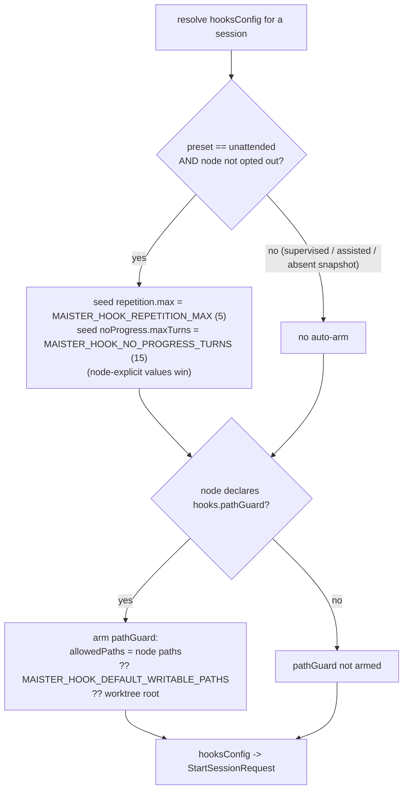
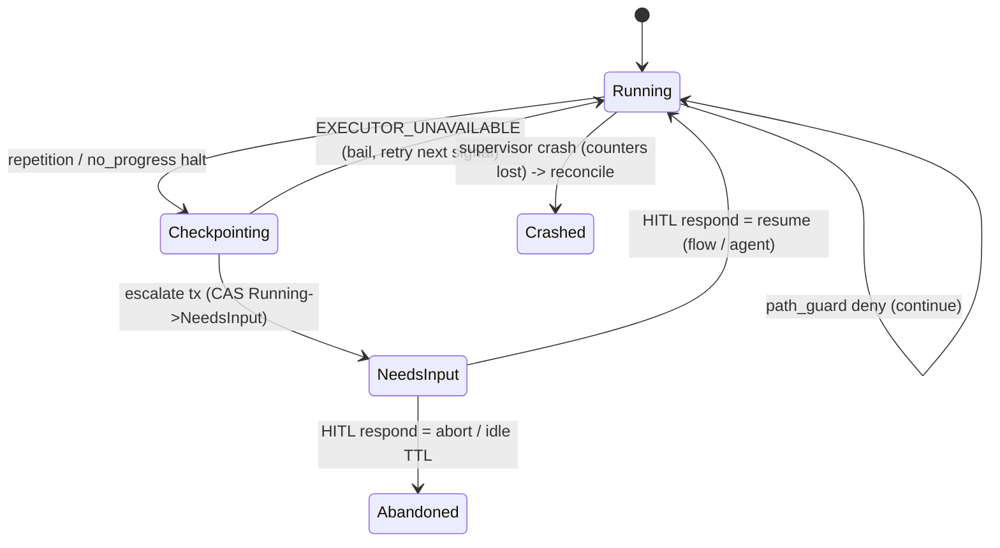
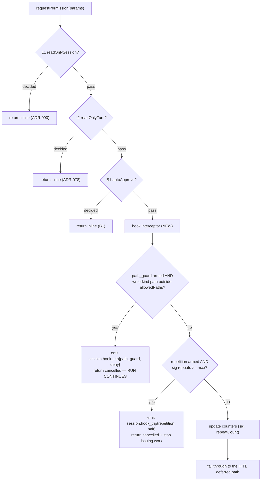
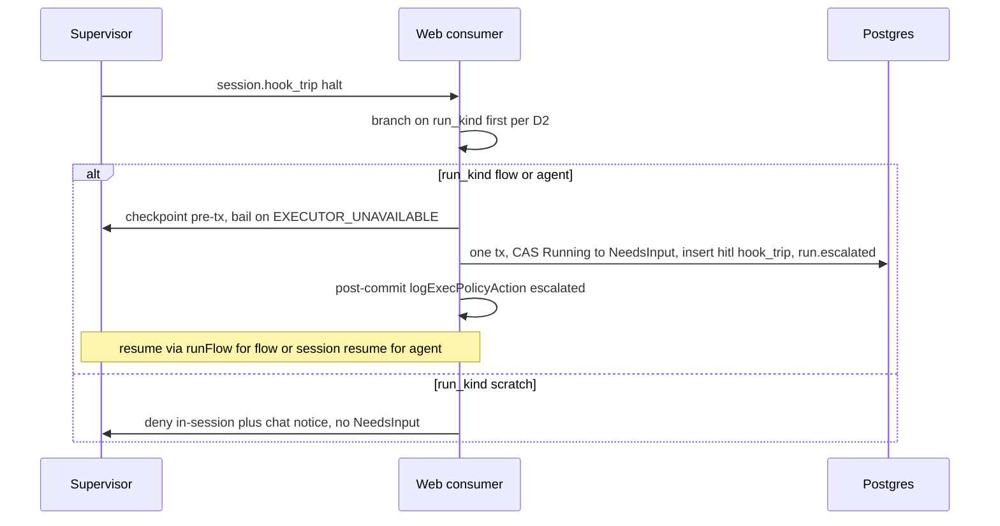

# Guardrail / hook engine (Designed — ADR-104)

> Status: **Designed — [ADR-104](../decisions.md#adr-104-declarative-guardrailhook-engine--universal-supervisor-acp-seam-interceptor-native-materializer-seam-and-hook-trip-hitl-escalation)** (M40). Contract frozen; not yet coded.
> This file is the design home for the mechanism. ADR rationale is in ADR-104 (R7 — cited, not restated).

## Purpose

The guardrail/hook engine adds **per-tool-call enforcement at the supervisor↔ACP
seam** — a deterministic rule set evaluated inside the supervisor's
`requestPermission` callback (`supervisor/src/acp-client.ts`) *before* a tool
runs, plus a post-turn liveness watchdog driven from `sessionUpdate`. It is the
one safety primitive MAIster lacks: Flow **gates** evaluate after a node
finishes and the ADR-101 **budget** meters totals, so neither can stop a run
that mid-node loops on the same tool call, writes outside its lane, or stalls
without producing a diff. The engine is the structural floor that makes
**unattended overnight loops** safe. It generalizes the hardcoded ADR-090
`readOnlySession` (a single allow-set, left intact) into a declarative,
vendor-neutral rule set that works across all five adapter families, with an
optional claude-native backend delivered through a clean seam.

## Domain entities

- **`hooks` node-settings block** — the authored, sparse rule declaration on a
  capability-bearing node's `settings` (`ai_coding | orchestrator | judge`) or
  on a platform agent. Validated in `web/lib/config.schema.ts`; documented in
  [`flow-dsl.md`](../flow-dsl.md) and [`flow-settings.md`](flow-settings.md).
- **`hooksConfig`** — the resolved, flat, materialized rule set delivered to the
  supervisor on `StartSessionRequest` (beside `readOnlySession`). Persistence:
  none — it is a per-session launch payload. See
  [`supervisor.openapi.yaml`](../api/supervisor.openapi.yaml).
- **Three rules** — `path_guard`, `repetition`, `no_progress` (the MVP set;
  secret-scan and others are fast-follow).
- **`session.hook_trip` event** — the supervisor SSE event emitted on a trip.
  See [`supervisor-sse.asyncapi.yaml`](../api/async/supervisor-sse.asyncapi.yaml)
  and the web mirror [`web-runs.asyncapi.yaml`](../api/async/web-runs.asyncapi.yaml).
- **`hook_trip` HITL kind** — the dedicated `hitl_requests.kind` /
  `assignments.action_kind` value created on a `halt` escalation (migration
  `0063`). Persisted; see [`database-schema.md`](../database-schema.md) +
  [`db/hitl-domain.md`](../db/hitl-domain.md).
- **Per-session counters** — `lastToolCallSig`, `repeatCount`,
  `turnsSinceProgress` on the in-memory `SessionRecord` (`supervisor/src/types.ts`).
  In-memory only; lost on supervisor crash; reset on resume.
- **`NativeHookMaterializer`** — the adapter→materializer seam (interface +
  registry). The universal core registers a no-op; the claude `PreToolUse`
  materializer is spike-gated (path_guard only).

## Rule × lifecycle matrix (frozen)

| Rule | Lifecycle | Disposition | Trip → action |
| --- | --- | --- | --- |
| `path_guard` | `pre_tool_call` | `deny` | Deny the tool call inline (cancelled outcome); **the run continues** (deny-and-continue). No web round-trip. |
| `repetition` | `pre_tool_call` | `halt` | Cancel the tool call, stop issuing work; the **web** consumer checkpoints + escalates. |
| `no_progress` | `post_turn` | `halt` | Stop issuing work; the **web** consumer checkpoints + escalates. (Driven from `sessionUpdate`, which fires after a tool already ran — post-hoc, never blocking.) |

`deny` is resolved entirely inside the supervisor `requestPermission` callback.
`halt` returns the cancelled outcome and stops further prompts; the supervisor
**never self-kills** — the runner owns the `NeedsInput` transition (D1).

## Canonical shapes (frozen)

### Authored node-settings `hooks` (sparse — every key optional)

```yaml
settings:
  hooks:
    disabled: false          # opt out entirely (suppresses the unattended auto-arm)
    repetition:
      max: 5                 # consecutive identical tool-call cap (liveness breaker)
    noProgress:
      maxTurns: 15           # turns-without-edit cap (liveness breaker)
    pathGuard:
      allowedPaths:          # ALWAYS opt-in; the writable set (globs)
        - "src/**"
        - "tests/**"
  enforcement:
    hooks: instruct          # strict | instruct (default) | off — folded at eval, not parse
```

The block is parsed sparse (keys `.optional()`, never per-key `.default()` — the
sparse-default rule); `enforcement.hooks` defaults to `instruct` at evaluation
(`enforcement?.hooks ?? "instruct"`), so "was this class explicitly declared?"
survives. A node/agent that declares `hooks` requires `compat.engine_min >=
1.8.0`.

### Resolved `hooksConfig` (wire — `StartSessionRequest`)

```json
{
  "repetition": { "max": 5 },
  "noProgress": { "maxTurns": 15 },
  "pathGuard": { "allowedPaths": ["src/**", "tests/**"] }
}
```

Each top-level key is optional; **absent = that rule is not armed.** The
supervisor enforces exactly what it is given (no policy interpretation
supervisor-side).

### `session.hook_trip` event

```json
{
  "type": "session.hook_trip",
  "sessionId": "5f3a8a2b-7e34-4f6d-9d2c-1d4e5f6a7b8c",
  "monotonicId": 42,
  "rule": "repetition",
  "lifecycle": "pre_tool_call",
  "disposition": "halt",
  "toolCall": { "toolCallId": "tc_07", "kind": "edit", "title": "Edit src/x.ts" }
}
```

`toolCall` is present for `pre_tool_call` rules (path_guard / repetition),
`null` for `no_progress`.

## Two-tier default resolution (D4)

The Phase-1 resolver folds the node/agent `hooks` block + env defaults into the
flat `hooksConfig`, keyed off the run's execution-policy **preset**
(`web/lib/runs/execution-policy.ts`: `supervised | assisted | unattended`):



- **`unattended` + no opt-out** → the two liveness breakers auto-arm from env
  (caps **5** / **15**); a node-explicit value overrides the env seed.
- **`supervised` / `assisted`** → opt-in only (a node must declare the rule).
- **Absent execution-policy snapshot** → treated as non-unattended (fail-safe to
  opt-in).
- **`path_guard`** is always opt-in (it needs an explicit writable set); an
  opt-in-without-paths node resolves `allowedPaths` from
  `MAISTER_HOOK_DEFAULT_WRITABLE_PATHS`, else the worktree root.
- **Opt-out** = `hooks.disabled: true` on the node (suppresses the unattended
  auto-arm for that node).

## State machine — a halting trip



Scratch runs never enter this machine: a scratch path_guard / breaker surfaces
as an in-session deny + chat notice (no `NeedsInput`).

## Process flow — pre_tool_call interceptor



Write-path extraction is adapter-agnostic: `toolCall.locations[0].path` (the
standardized ACP field — verified for claude, schema-backed for codex), with a
**kind-only fallback** for adapters that do not populate `locations`
(gemini / opencode / mimo): an armed `path_guard` then denies any write-kind
with no extractable path (conservative deny-and-continue).

## Process flow — halt → escalate → resume (per `run_kind`)



The escalate transaction reuses the ADR-101 budget `actBudgetEscalate` pattern
exactly — checkpoint pre-tx (bail on `EXECUTOR_UNAVAILABLE`, retry next signal),
write `needs-input.json` pre-tx (unlink on tx failure), then a single
`db.transaction`, then a post-commit `logExecPolicyAction`. It is **not**
flow-only: the budget's flow-only constraint is an artifact of its
`raise → runFlow` path, which a hook-trip resume does not use — an agent run
resumes through the same agent-permission-HITL path that already drives it.

## Supervisor-vs-native split + the `NativeHookMaterializer` seam (D7)

- **Universal supervisor layer (P2/P3)** — all three rules, all five adapters.
  Enforcement is 100% supervisor-side; the native registry resolves a **no-op**
  for every adapter. This layer is complete on its own.
- **Native claude backend (P4, spike-gated)** — registers a `claude` materializer
  that writes a `PreToolUse` hook into the M14-owned
  `<worktree>/.claude/settings.local.json` (respecting the
  ownership-marker / reclaim / cleanup protocol; the `hooks` key is reclaimed on
  cleanup, the guard script joins `WORKTREE_EXCLUDE_PATTERNS`). It covers **only
  `path_guard`**; `repetition` and `no_progress` stay supervisor-only (they need
  cross-turn session state). The hook's `allowedPaths` derive from the **same**
  resolved `hooksConfig.pathGuard` — the two backends share one source of truth
  and cannot diverge.
- **Spike + graceful degradation** — P4 leads with a spike confirming the bundled
  `@anthropic-ai/claude-agent-sdk` honors settings-file hooks (the type surface
  declares `hooks?: Partial<Record<HookEvent, …>>` with `PreToolUse`, but the
  settings-FILE channel is unverified). **If it does not honor them → register no
  native materializer, document "native backend N/A for the current claude
  adapter; the universal supervisor layer carries enforcement", ship no dead
  code, and stop P4.** The universal layer is unaffected either way.

## Expectations (Designed — ADR-104)

- The interceptor MUST run in `requestPermission` after L1 (`readOnlySession`) /
  L2 (`readOnlyTurn`) / B1 (`autoApprovePermissions`) and before the HITL
  deferred; a `pre_tool_call` decision MUST resolve before the SDK runs the tool.
- `path_guard` MUST deny (cancelled outcome) a write-class tool call whose
  `toolCall.locations[].path` is outside the resolved `allowedPaths` and MUST let
  the run continue (deny-and-continue) — never `halt`.
- `repetition` MUST `halt` at exactly `>= repetition.max` consecutive identical
  tool-call signatures and MUST reset the counter on a differing signature.
- `no_progress` MUST `halt` at `>= noProgress.maxTurns` `sessionUpdate` turns
  since the last edit/diff-producing tool call and MUST reset on real progress.
- A `halt` MUST be escalated by the web tier (checkpoint + `NeedsInput`); the
  supervisor MUST NOT self-kill on a trip.
- Escalation MUST branch on `run_kind` before routing: `flow`/`agent` →
  `NeedsInput` + a `hook_trip` HITL resumable via that kind's existing resume
  path; `scratch` → in-session deny, never `NeedsInput`.
- The escalate transaction MUST CAS `runs.status` `Running → NeedsInput` and
  write the `hitl_requests(kind:"hook_trip")` row, `run.needs_input`, and
  `run.escalated{reason:"hook_trip"}` in ONE `db.transaction`; the assignment is
  created iff `onStuck !== "notify_only"`.
- Under the `unattended` preset and absent a per-node opt-out, `repetition` and
  `noProgress` MUST auto-arm from `MAISTER_HOOK_REPETITION_MAX` (5) and
  `MAISTER_HOOK_NO_PROGRESS_TURNS` (15); `supervised` / `assisted` and an absent
  policy snapshot MUST NOT auto-arm.
- `path_guard` MUST always be opt-in (armed only when a node declares
  `hooks.pathGuard`); an opt-in-without-paths node resolves `allowedPaths` from
  `MAISTER_HOOK_DEFAULT_WRITABLE_PATHS`, else the worktree root.
- A node/agent declaring `hooks` MUST require `compat.engine_min >= 1.8.0`; a
  `strict` `enforcement.hooks` MUST be refused at launch (`hooks` is `instructed`
  in `ENFORCEABILITY_BY_AGENT`, the M11c boundary; ADR-041 stays frozen).
- The native (claude) materializer MUST cover only `path_guard`, derive
  `allowedPaths` from the same resolved `hooksConfig.pathGuard`, and degrade to
  documented-N/A (no dead code) when the adapter does not honor settings-file
  hooks; `repetition` / `no_progress` MUST remain supervisor-only.
- A trip MUST NOT raise a new `MaisterError` code; counters are per-session
  in-memory and a resumed run MUST start them fresh.

## Edge cases

- **Supervisor crash mid-trip** — in-memory counters are lost and the live
  session is gone → the existing reconcile sweep marks the run `Crashed` (no
  `MaisterError`; recovery path).
- **Web crash after checkpoint, before the escalate tx** — the run is still
  `Running` with a valid checkpoint and no live session → the existing
  crash-reconcile sweep handles it (a checkpointed-but-not-escalated trip is
  reconciled, never stranded).
- **`EXECUTOR_UNAVAILABLE` during the pre-escalate checkpoint** — bail and retry
  on the next signal; no state mutation (no split-brain).
- **Adapter omits `toolCall.locations[].path`** (gemini / opencode / mimo) →
  kind-only fallback: an armed `path_guard` denies any write-kind with no
  extractable path (conservative deny-and-continue).
- **Invalid `hooks` block at compile/load** (negative caps, empty
  `allowedPaths`, unknown lifecycle) → `MaisterError("CONFIG")` with the field
  path.
- **`enforcement.hooks: strict`** → launch refused at the M11c boundary
  (`CONFIG` / `EXECUTOR_UNAVAILABLE`), no agent spawned, no leaked deferred.
- **Native + supervisor both cover path_guard on a claude run** → no
  double-count / double-escalate: the native hook denies inline before the
  supervisor sees the permission; the supervisor remains the backstop for
  codex/etc. and the sole layer for `repetition` / `no_progress`.

## Linked artifacts

- **ADR:** [ADR-104](../decisions.md#adr-104-declarative-guardrailhook-engine--universal-supervisor-acp-seam-interceptor-native-materializer-seam-and-hook-trip-hitl-escalation).
- **Wire:** [`supervisor.openapi.yaml`](../api/supervisor.openapi.yaml) (`StartSessionRequest.hooksConfig`),
  [`supervisor-sse.asyncapi.yaml`](../api/async/supervisor-sse.asyncapi.yaml) +
  [`web-runs.asyncapi.yaml`](../api/async/web-runs.asyncapi.yaml) (`session.hook_trip`),
  [`web.openapi.yaml`](../api/web.openapi.yaml) (`hook_trip` HITL),
  [`outbound-webhooks.asyncapi.yaml`](../api/async/outbound-webhooks.asyncapi.yaml) (`DataRunEscalated.reason`).
- **Schema:** [`database-schema.md`](../database-schema.md) + [`db/hitl-domain.md`](../db/hitl-domain.md) +
  [`db/assignments-domain.md`](../db/assignments-domain.md) (`hook_trip`, migration `0063`).
- **DSL / settings / config:** [`flow-dsl.md`](../flow-dsl.md), [`flow-settings.md`](flow-settings.md),
  [`configuration.md`](../configuration.md) (env vars).
- **Related domains:** [`execution-policy.md`](execution-policy.md) (preset + `onStuck`),
  [`hitl.md`](hitl.md) (HITL respond), [`runs.md`](runs.md) (checkpoint/resume).
- **Source (Designed):** `supervisor/src/acp-client.ts` (interceptor),
  `supervisor/src/types.ts` (`SessionRecord` counters),
  `web/lib/runs/keepalive-sweeper.ts` (`actBudgetEscalate` precedent),
  `web/lib/capabilities/agent-map.ts` + `web/lib/capabilities/materialize.ts` (native backend),
  `web/lib/flows/enforcement.ts` (`ENFORCEABILITY_BY_AGENT`).
