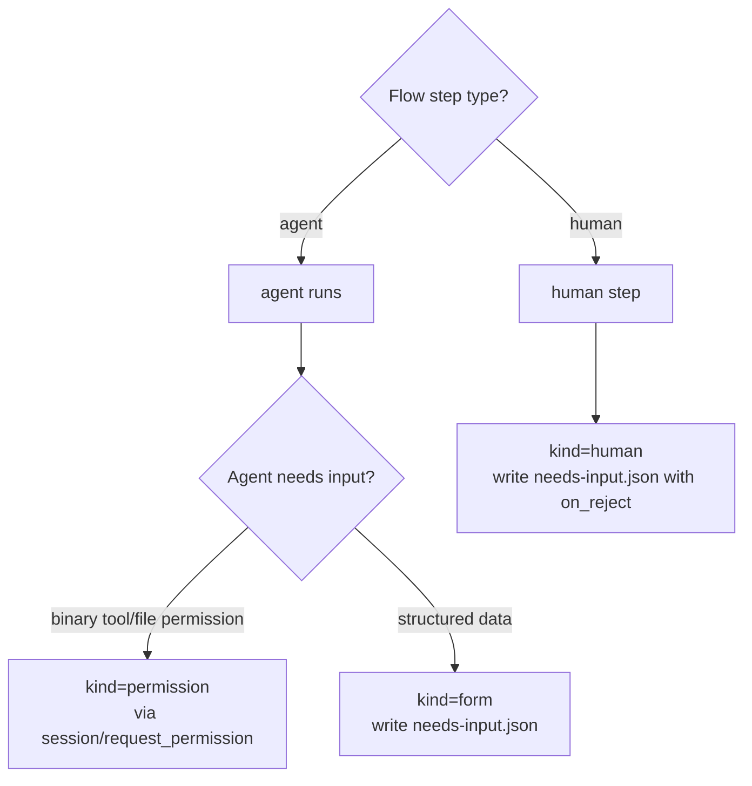
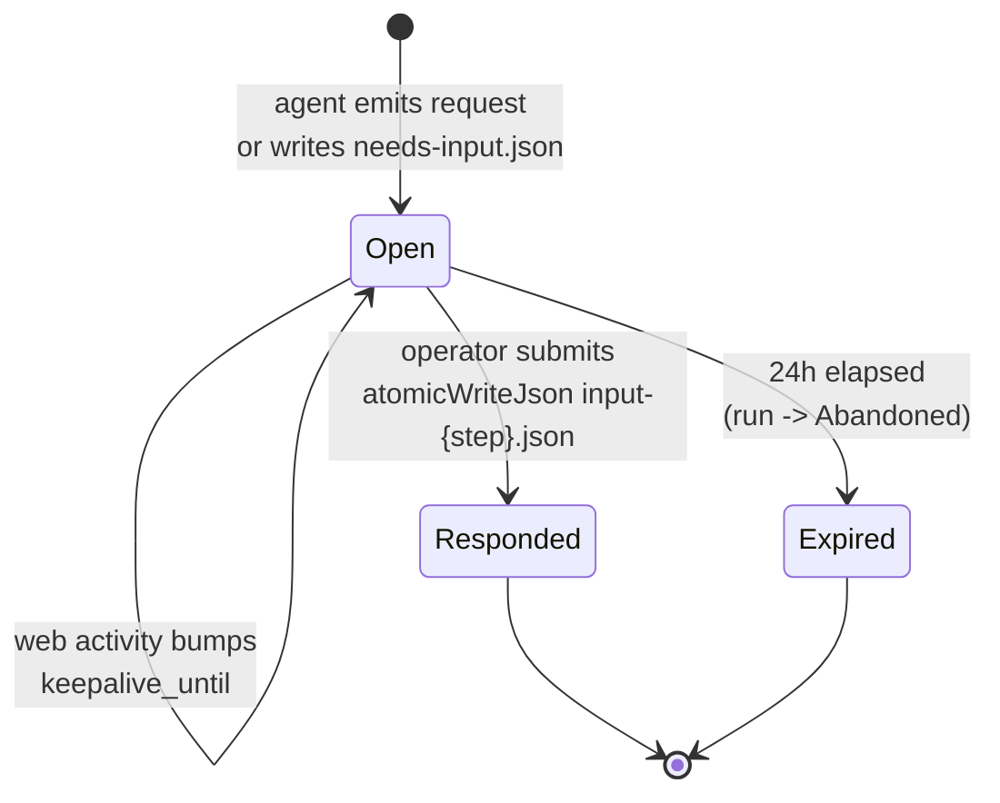
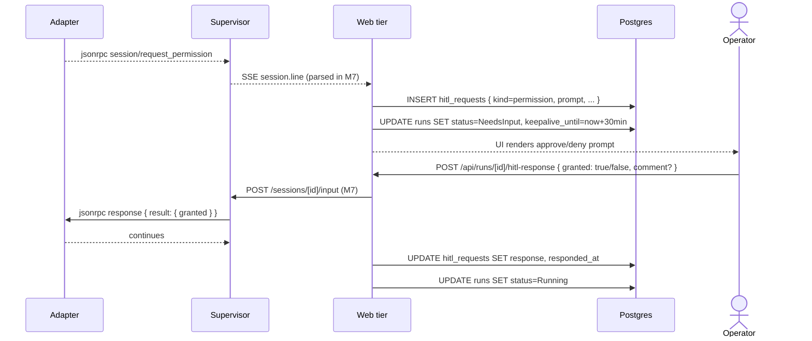
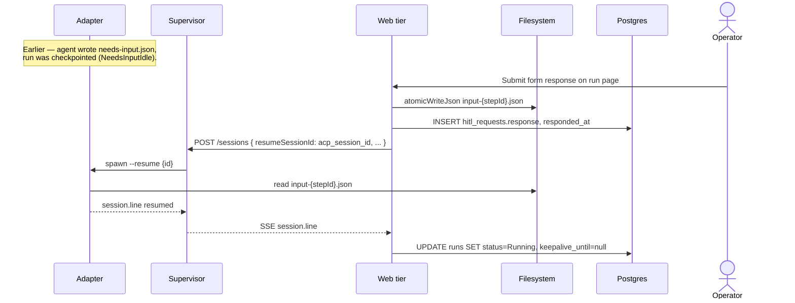
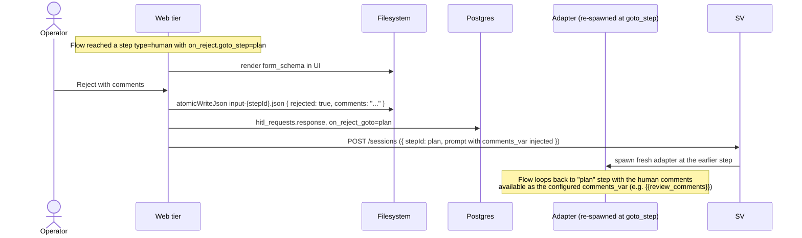
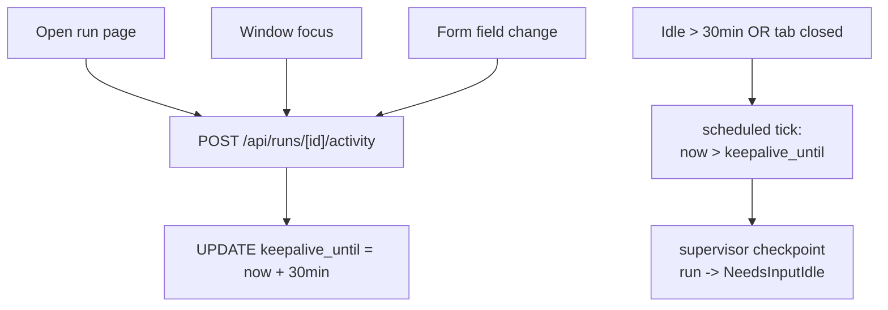

# HITL domain

## Purpose

**HITL** — human-in-the-loop — covers every transition where a run
needs an operator decision before it can continue. HITL is not a
sidecar feature; it is a first-class state of a run. The domain spans
three kinds of human ask, the lifecycle that surrounds them, and the
artifact protocol used when the worker is checkpointed.

## Domain entities

- **HITL request** — `hitl_requests` row. FK to `runs`.
- **Kind** — `'permission' | 'form' | 'human'`:
  - `permission` — binary approve/deny via ACP
    `session/request_permission`.
  - `form` — structured form, schema declared in the Flow's
    `human` step `form_schema`.
  - `human` — full human-review step with an `on_reject.goto_step`
    loopback.
- **Form schema** — JSON Schema-like object with required
  `schemaVersion: integer`. Field types: `string | number | boolean |
enum | array` on POC.
- **`needs-input.json`** — artifact written by the agent at
  `.maister/<slug>/runs/<runId>/needs-input.json` when raising a
  structured-form request from a checkpointable boundary.
- **`input-<stepId>.json`** — atomic-written response payload.

## Three kinds — when to use which

| Kind | Trigger | Form? | Loop on reject? | Wire |
| ---- | ------- | ----- | --------------- | ---- |
| `permission` | Agent emits `session/request_permission` mid-step | No (binary) | No | Live ACP request/response |
| `form` | Agent writes `needs-input.json` mid-step | Yes (`form_schema`) | No | Artifact + ACP message OR resume |
| `human` | Flow step `type: human` | Yes (`form_schema`) | Yes (`on_reject.goto_step`) | Artifact only |

The decision tree:



## State machine — HITL request



## Process flows

### Live path — permission request (Designed M7)



### Recovery path — structured form after checkpoint (Designed M8)



### Human-review send-back loop (Designed M7)



## Keep-alive activity tracking

While a run is in `NeedsInput`, the run-detail page is responsible for
keeping the worker alive:



## Form schema versioning

Every form payload includes a required `schemaVersion: integer`.
`validateFormSchemaVersion(payload, expected)` throws
`MaisterError("CONFIG")` on mismatch with both versions named.

```yaml
schemaVersion: 1
fields:
  - name: comment
    label: Reviewer comment
    type: string
    required: true
  - name: severity
    type: enum
    options: [low, medium, high]
  - name: confirm
    type: boolean
    default: false
```

## Edge cases

- **24h elapsed in `NeedsInputIdle`** → `HITL_TIMEOUT`. Run →
  `Abandoned`, task → `Backlog`.
- **Form payload `schemaVersion` mismatch** → `CONFIG`. Worker stays
  in `NeedsInput`; operator sees a validation error in the form.
- **Unsupported field type in `form_schema`** → `CONFIG` at Flow load
  time (`web/lib/config.ts`).
- **Operator submits twice in quick succession** — `atomicWriteJson`
  guarantees the second write replaces the first cleanly (tmp +
  rename). The supervisor receives the latest payload.
- **Agent reads a malformed `input-<stepId>.json`** — adapter exits
  non-zero → `Crashed`. Operator decides whether to Recover or
  Discard.
- **HITL on `human`-step rejected with no `on_reject` defined** →
  treated as `human_review` rejection but no loop-back; run goes to
  `Failed` (task returns to Backlog).
- **`session/request_permission` arrives while the supervisor is
  shutting down** — request lost; agent will retry on next launch
  through the standard `acp_session_id` resume.

## Linked artifacts

- ADRs: [ADR-006 Hybrid HITL](../decisions.md#adr-006-hybrid-hitl-keep-alive--checkpointresume),
  [ADR-008 Typed error taxonomy](../decisions.md#adr-008-typed-error-taxonomy-maistererror).
- ERD: [`../db/hitl-domain.md`](../db/hitl-domain.md).
- Config reference: [`../configuration.md`](../configuration.md)
  §`form_schema versioning`.
- API (external, planned for M7): [`../api/external/acp.asyncapi.yaml`](../api/external/acp.asyncapi.yaml)
  §`session.request_permission`.
- Related: [`runs.md`](runs.md), [`flows.md`](flows.md).
- Source: `web/lib/config.ts` (`validateFormSchemaVersion`),
  `web/lib/atomic.ts` (`atomicWriteJson`),
  `web/lib/db/schema.ts` (hitl_requests table).
