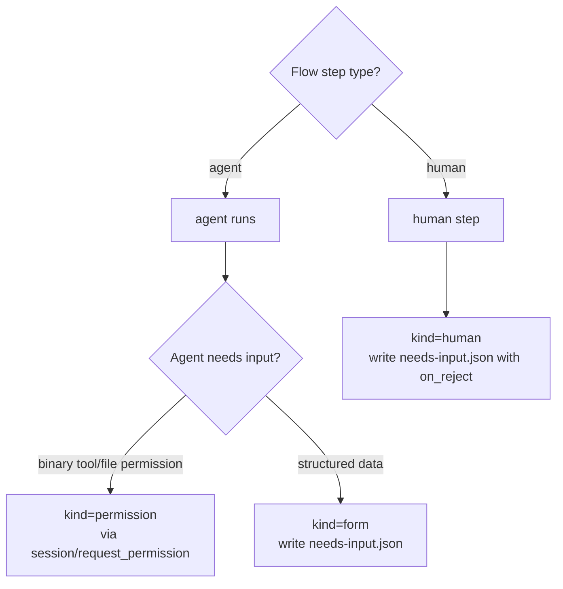
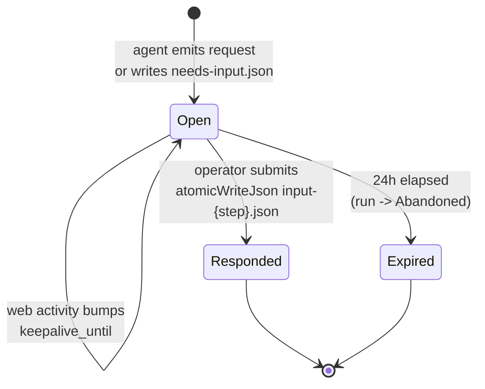
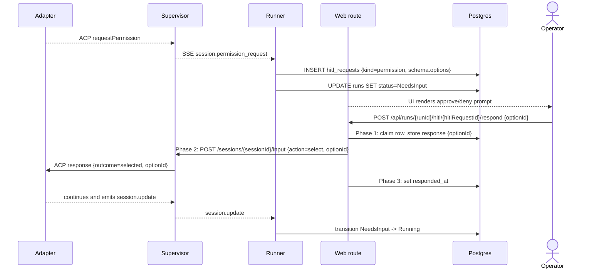
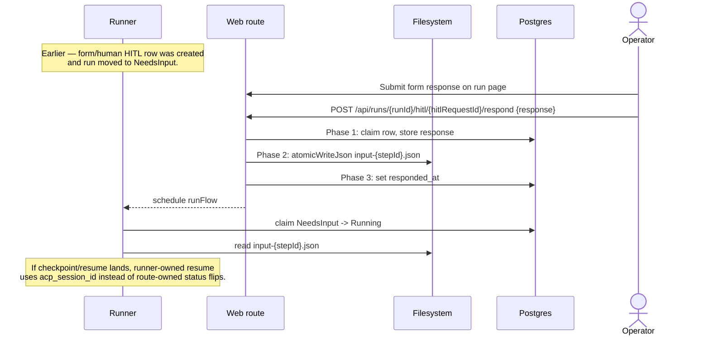
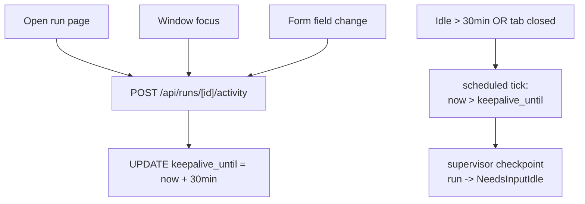

# HITL domain

## Purpose

**HITL** — human-in-the-loop — covers every transition where a run
needs an operator decision before it can continue. HITL is not a
sidecar feature; it is a first-class state of a run. The domain spans
three kinds of human ask, the lifecycle that surrounds them, and the
artifact protocol used when the worker is checkpointed.

## Domain entities

- **HITL request** — `hitl_requests` row. FK to `runs`.
- **Kind** — `'permission' | 'form' | 'human'`:
  - `permission` — binary approve/deny via ACP
    `session/request_permission`.
  - `form` — structured form, schema declared in the Flow's
    `human` step `form_schema`.
  - `human` — Flow step `type: human` with an `on_reject` clause
    declared in `flow.yaml`. Current behaviour: the row is persisted
    as `kind="human"` and the response is captured under the same
    atomic-claim + artifact-write contract as `kind="form"`. The
    loop-on-reject routing (`on_reject.goto_step` rerouting +
    `comments_var` propagation) is designed — until then,
    `kind="human"` behaves wire-equivalent to `kind="form"`. The
    distinction is preserved on the row so the loop can light up
    rerouting without a schema change.
- **Form schema** — JSON Schema-like object with required
  `schemaVersion: integer`. Field types: `string | number | boolean |
enum | array`.
- **`needs-input.json`** — artifact written when a checkpointable
  structured-form request is raised.
- **`input-<stepId>.json`** — atomic-written response payload.

## Three kinds — when to use which

| Kind | Trigger | Form? | Loop on reject? | Wire |
| ---- | ------- | ----- | --------------- | ---- |
| `permission` | Agent emits `session/request_permission` mid-step | No (binary) | No | Live ACP request/response |
| `form` | Agent writes `needs-input.json` mid-step | Yes (`form_schema`) | No | Artifact + ACP message OR resume |
| `human` | Flow step `type: human` with `on_reject` | Yes (`form_schema`) | Designed (`on_reject.goto_step` not yet executed) | Artifact only |

The decision tree:



## State machine — HITL request



## Process flows

### Live path — permission request (Implemented)



### Structured form response (Implemented, checkpoint resume Designed)



### Human-review response (Implemented; loop Designed)

```mermaid
sequenceDiagram
    actor U as Operator
    participant W as Web route
    participant R as Runner
    participant FS as Filesystem
    participant DB as Postgres

    Note over W: Flow reached a step type=human with on_reject.goto_step=plan
    W->>FS: render form_schema in UI
    U->>W: Reject with comments
    W->>DB: Phase 1: claim row, store response
    W->>FS: Phase 2: atomicWriteJson input-{stepId}.json
    W->>DB: Phase 3: set responded_at
    W-->>R: schedule runFlow
    R->>DB: claim NeedsInput -> Running
    R->>R: continue next step; rejection is audit data
    Note over R: Designed loop: on_reject.goto_step + comments_var<br/>will route to an earlier step when implemented.
```

## Keep-alive activity tracking (Designed)

The flow below describes the designed target state. Current code does
not implement the activity route or checkpoint transition:
`runs.keepalive_until` ships unused, no
`POST /api/runs/[id]/activity` route exists, supervisor
`POST /sessions/:id/checkpoint` still returns the deferred stub, and
no `NeedsInput → NeedsInputIdle` transition fires today. The diagram is
kept as the design contract for checkpoint/resume work.

While a run is in `NeedsInput`, the run-detail page is responsible for
keeping the worker alive:



## Form schema versioning

Every form payload includes a required `schemaVersion: integer`.
`validateFormSchemaVersion(payload, expected)` throws
`MaisterError("CONFIG")` on mismatch with both versions named.

```yaml
schemaVersion: 1
fields:
  - name: comment
    label: Reviewer comment
    type: string
    required: true
  - name: severity
    type: enum
    options: [low, medium, high]
  - name: confirm
    type: boolean
    default: false
```

## Expectations

- HITL kind is exactly `permission | form | human`; mapping to wire
  matches the three-kinds table verbatim.
- Every HITL request is persisted as a `hitl_requests` row before the
  run transitions to `NeedsInput`; UI never derives HITL state from
  supervisor in-memory state.
- **(Designed)** A run in `NeedsInput` extends `keepalive_until` by
  `MAISTER_KEEPALIVE_MINUTES` (default 30) on every operator activity
  event (page open, focus, form change). Current code has neither the
  `POST /api/runs/[id]/activity` route nor a writer for
  `runs.keepalive_until`; the column ships unused.
- **(Designed)** Idle past `keepalive_until` triggers checkpoint →
  run becomes `NeedsInputIdle` with `acp_session_id` retained.
  Supervisor `POST /sessions/:id/checkpoint` still returns the current
  deferred compatibility response, so `NeedsInputIdle` is never reached
  today.
- **(Designed)** 24 h elapsed in `NeedsInputIdle` without response
  → `HITL_TIMEOUT`, run `Abandoned`, task → `Backlog`. Depends on the
  checkpoint path above; no timeout watcher exists.
- Every form payload includes `schemaVersion: integer`; mismatch with
  the Flow's declared version raises `CONFIG` with both versions
  named.
- Form-schema field types are exactly `string | number |
  boolean | enum | array`; unknown type refused with `CONFIG` at Flow
  load.
- **(Implemented)** Operator responses go through
  `POST /api/runs/[runId]/hitl/[hitlRequestId]/respond`. Permission
  responses are routed through the supervisor's
  `POST /sessions/:id/input` (permission-only, discriminated `action:
  "select" | "cancel"`). Form / `human` responses are written via
  `atomicWriteJson` (tmp + rename) to
  `.maister/<slug>/runs/<runId>/input-<stepId>.json` by the web tier
  AFTER the row-level CAS claim succeeds — concurrent double-submits
  with conflicting payloads return 409 before any artifact is
  touched, and same-payload retries are idempotent. The supervisor
  never writes input artifacts.
- **(Implemented)** `human` step responses are captured under the
  same two-phase commit + artifact-write contract as `form`. The
  `on_reject` clause on the Flow step is preserved in the row's kind
  (`hitl_requests.kind = "human"`) and may also be carried in the
  response payload as `{ rejected: bool, comments?: string }`, but the
  runner does NOT branch on it today — it advances to the next step
  with the response captured as ordinary `steps.<id>.vars`. The
  reviewer UI MUST therefore treat rejection as informational
  (recorded for audit, the run continues), not as a routing action.
- **(Designed)** Full `on_reject.goto_step` rerouting in
  `runHumanStep`: when the response indicates rejection, the runner
  jumps to the declared `goto_step` with `comments_var` populated
  from the response. Until it lands, the API surface MUST NOT
  represent rejection as a loop-back action — see `web.openapi.yaml`
  and the UI MUST disable loop-back affordances.
- **(Implemented)** `hitl_requests.response` and `.responded_at`
  use two-phase commit semantics:
  * **Phase 1 (atomic claim).** `response` is stored under a row-level
    `SELECT ... FOR UPDATE` only if the row is unclaimed, or claimed
    with the same payload (idempotent retry). Different payload on
    retry → 409.
  * **Phase 2 (durable side-effect).** For permission, the supervisor
    deferred is resolved; for form/human, `input-<stepId>.json` is
    written from the STORED response.
  * **Phase 3 (delivered marker).** `responded_at` is set ONLY after
    the side-effect succeeds. The route does NOT flip `runs.status`
    back to `Running` — the runner owns that transition on resume so
    its `isResume` gate can match.
  * Retry classification: supervisor 410 → `HITL_TIMEOUT` terminal
    (run → `Failed`); supervisor 503 / network → `EXECUTOR_UNAVAILABLE`
    retryable (row stays claimed, `responded_at` NULL); artifact
    write I/O failure → 503 retryable.
  * Same-payload retry on an already-delivered row re-queues
    `runFlow` so a process crash between Phase 3 commit and the
    original microtask cannot strand the run in `NeedsInput`.
- **(Designed)** HITL request lost during supervisor shutdown is
  recoverable via the standard `acp_session_id` resume on next launch —
  no separate reconciliation needed. Depends on checkpoint/resume
  landing the `--resume <id>` re-spawn path.

## Edge cases

- **24h elapsed in `NeedsInputIdle`** → `HITL_TIMEOUT`. Run →
  `Abandoned`, task → `Backlog`.
- **Form payload `schemaVersion` mismatch** → `CONFIG`. Worker stays
  in `NeedsInput`; operator sees a validation error in the form.
- **Unsupported field type in `form_schema`** → `CONFIG` at Flow load
  time (`web/lib/config.ts`).
- **Operator submits twice in quick succession** — the response
  route's row-level CAS (`SELECT ... FOR UPDATE` + conditional
  UPDATE) ensures only one submission claims the deferred. A
  same-payload retry is idempotent (200 + re-queue resume); a
  different-payload retry is rejected with 409 BEFORE any artifact
  or supervisor side-effect runs.
- **Supervisor restart while the user response is in-flight** —
  supervisor returns 503 `EXECUTOR_UNAVAILABLE` for the
  "unknown session" case (distinct from 410 `HITL_TIMEOUT` for
  expired deferred). The web tier treats 503 as retryable: the
  `responded_at` marker stays NULL, the response column holds the
  user's intent, and a retry replays through the normal flow.
- **Agent reads a malformed `input-<stepId>.json`** — adapter exits
  non-zero → `Crashed`. Operator decides whether to Recover or
  Discard.
- **HITL on `human` step is rejected** — rejection is stored as
  response payload. The runner does not branch on it until the
  designed `on_reject.goto_step` loop lands.
- **`session/request_permission` arrives while the supervisor is
  shutting down** — request lost; agent will retry on next launch
  through the standard `acp_session_id` resume.

## Linked artifacts

- ADRs: [ADR-006 Hybrid HITL](../decisions.md#adr-006-hybrid-hitl-keep-alive--checkpointresume),
  [ADR-008 Typed error taxonomy](../decisions.md#adr-008-typed-error-taxonomy-maistererror).
- ERD: [`../db/hitl-domain.md`](../db/hitl-domain.md).
- Config reference: [`../configuration.md`](../configuration.md)
  §`form_schema versioning`;
  §`Environment variables (server tier)` for
  `MAISTER_KEEPALIVE_MINUTES`.
- API (external): [`../api/external/acp.asyncapi.yaml`](../api/external/acp.asyncapi.yaml)
  §`session.request_permission`.
- Related: [`runs.md`](runs.md), [`flows.md`](flows.md).
- Source: `web/lib/config.ts` (`validateFormSchemaVersion`),
  `web/lib/atomic.ts` (`atomicWriteJson`),
  `web/lib/db/schema.ts` (hitl_requests table).
