# HITL domain

## Purpose

**HITL** — human-in-the-loop — covers every transition where a run
needs an operator decision before it can continue. HITL is not a
sidecar feature; it is a first-class state of a run. The domain spans
three kinds of human ask, the lifecycle that surrounds them, and the
artifact protocol used when the worker is checkpointed.

## Domain entities

- **HITL request** — `hitl_requests` row. FK to `runs`.
- **Assignment** — M13 `assignments` row linked by `hitl_request_id`; this is
  the inbox and ownership primitive for open HITL work. `hitl_requests` still
  owns the payload and `responded_at` marker.
- **Kind** — `'permission' | 'form' | 'human'`:
  - `permission` — binary approve/deny via ACP
    `session/request_permission`.
  - `form` — structured form, schema declared in the Flow's
    `human` step `form_schema` (linear) or a graph `form` node's
    `settings.form_schema` (intake — `runFormCollect`).
  - `human` — Flow step `type: human` with an `on_reject` clause
    declared in `flow.yaml`. Current behaviour: the row is persisted
    as `kind="human"` and the response is captured under the same
    atomic-claim + artifact-write contract as `kind="form"`. The
    loop-on-reject routing (`on_reject.goto_step` rerouting +
    `comments_var` propagation) is implemented — `kind="human"` now
    reparks atomically to the goto target on rejection. The distinction
    is preserved on the row so the loop can be traced per-kind.
- **Form schema** — JSON Schema-like object with required
  `schemaVersion: integer`. Field types: `string | number | boolean |
enum | array`.
- **`criticality`** — flow-author-declared importance of the HITL request.
  Stored on `hitl_requests.criticality` (text, nullable). Allowed values:
  `low | medium | high | critical`. Written ONCE at creation from the `human`
  node/step's `criticality` field; never updated after the row is inserted.
  Surfaces as a badge on the HITL form and as a sort key in the inbox (critical
  first). (Implemented — M17)
- **`human_confidence`** — responder self-reported certainty at response time.
  Real in `[0,1]`; stored on `hitl_requests.human_confidence` (real, nullable)
  and echoed in `hitl_requests.response` jsonb as `{ confidence }`. Validated
  server-side: values outside `[0,1]` are rejected with 422. Written in the
  Phase-1 transaction of `respondToHitl`. Distinct from
  `GateVerdict.calibration.confidence` (M15 AI-judge machine confidence on
  `gate_results.verdict`): `human_confidence` annotates a human decision;
  it does NOT re-gate readiness. (Implemented — M17)
- **`needs-input.json`** — artifact written when a checkpointable
  structured-form request is raised.
- **`input-<stepId>.json`** — atomic-written response payload.
- **`dirty_summary`** — **(M30 — Implemented, ADR-079)** computed when a review gate
  opens (`statusPorcelain`, incl. untracked): file list + staged/unstaged/untracked
  counts. Carried on the gate/HITL payload; a dirty worktree never blocks the gate.
- **`review_tip_sha`** — **(M30 — Implemented, ADR-079)** branch tip SHA stamped per
  review-gate visit on `hitl_requests.review_tip_sha`; the base for the
  `since-last-review` diff scope.
- **`dirty_resolution`** — **(M30 — Implemented, ADR-079)** the reviewer's chosen
  dirty-worktree treatment on `hitl_requests.dirty_resolution`:
  `commit | discard | proceed` (nullable).
- **Diff scope** — **(M30 — Implemented, ADR-079)** the `scope` query param on
  `GET /api/runs/{runId}/diff`: `run | since-last-review | last-node | uncommitted`.
- **Gate-chat message** — **(M30 — Implemented, ADR-075)** a `gate_chat_messages` row:
  an answer-only Q&A turn between a reviewer (`role=user`) and the parked agent
  (`role=agent`) at a HITL pause. Carries `hitl_request_id`, `node_id`,
  `gate_attempt`, `body`, `acp_session_id`, `seq`, and `mutation_reverted`.
- **Chat checkpoint** — **(M30 — Implemented, ADR-075)** the single L3 neutrality
  baseline ref `refs/maister/chat-checkpoints/<runId>/<hitlRequestId>` (bounded at 1,
  captured at the first chat turn) via the ADR-076 checkpoint machinery.

## Three kinds — when to use which

| Kind | Trigger | Form? | Loop on reject? | Wire |
| ---- | ------- | ----- | --------------- | ---- |
| `permission` | Agent emits `session/request_permission` mid-step | No (binary) | No | Live ACP request/response |
| `form` | Agent writes `needs-input.json` mid-step, OR a graph `form` (intake) node is reached (`runFormCollect` writes it) | Yes (`form_schema`) | No | Artifact + ACP message OR resume |
| `human` | Flow step `type: human` (linear) or `human_review` node finish (graph) | Yes (`form_schema`) | Linear: **Implemented — M17** (`on_reject.goto_step` atomic repark, bounded by `maxLoops=5`). Graph (M11a): **declared decisions** drive the rework loop | Artifact only |

The decision tree:

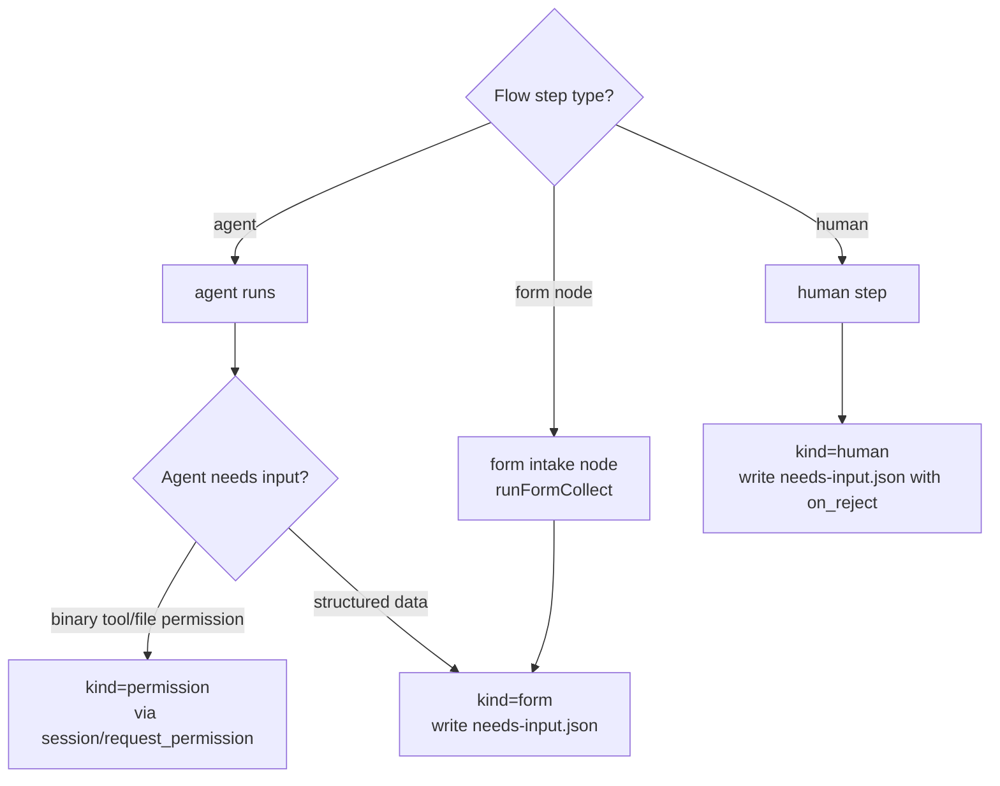

## State machine — HITL request

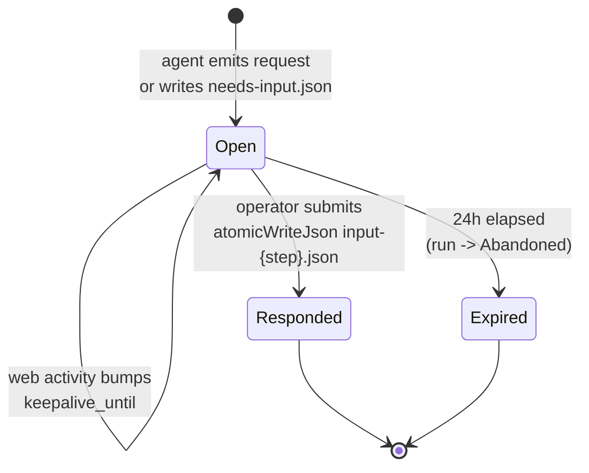

## Process flows

### Live path — permission request (Implemented)

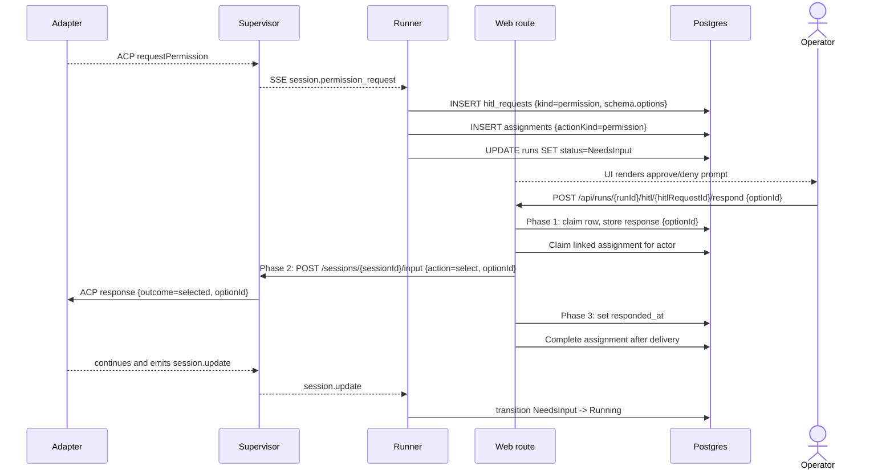

### Structured form response (Implemented, checkpoint resume Designed)

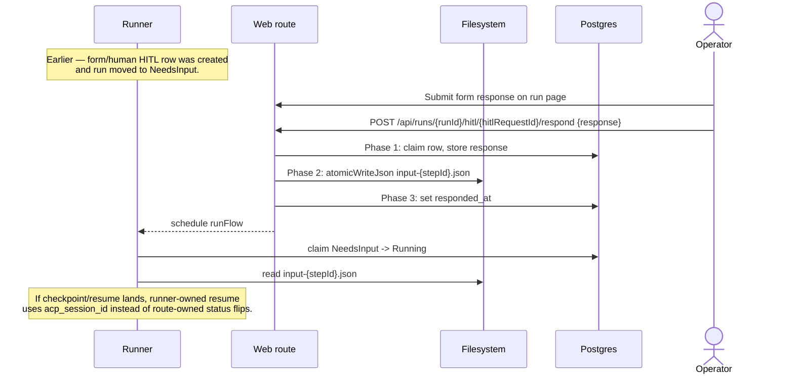

### Graph `form` (intake) node — UI + output vars (Implemented — T4)

A graph `form` node's collection is rendered by `HitlDecisionControls`
(`web/components/board/hitl-decision-controls.tsx`): each `form_schema` field
shows its `options[]` as buttons **and** a free-text input (pick or type),
falling back to a raw-JSON textarea when the schema declares no `fields[]`. The
server re-validates the submitted object against the stored `form_schema`
(`assertHitlResponse` → 422 `NEEDS_INPUT` on a missing required field) before
persisting `input-{stepId}.json`; on resume `runFormCollect` returns that object
as the node's output vars (`node_attempts.vars`), read downstream as
`{{ steps.<id>.vars.<field> }}`. Unlike a `human` review, a `form` node carries
no decision — it finishes on `transitions.success`.

### Human-review response with executed on_reject loop (Implemented — M17)

The sequence below describes the M17 linear `on_reject.goto_step`
repark (Implemented — landed in Phase 3). On a reject response the runner writes a dedicated rework-comments
artifact (never the completion sentinel), invalidates prior-pass sentinels for
the re-execution window, and atomically reparks `currentStepId` to the goto
target. The loop is bounded by `maxLoops` (default 5). An approve response
follows the normal structured-form path (advance to next step).

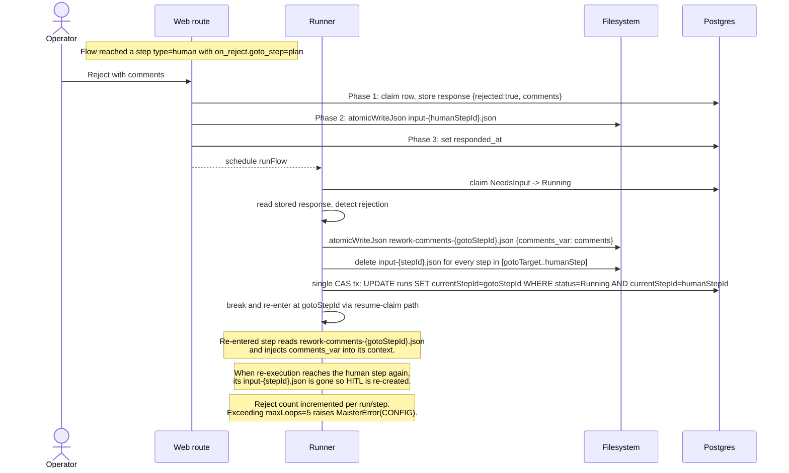

### Declared decisions vs raw `goto_step` (M11a — Designed)

The legacy `human` step reroutes via a single `on_reject.goto_step` that the
runner does not execute. A graph `human_review` node replaces that with
**declared decisions**: the manifest declares `finish.human.decisions` (e.g.
`approve`, `rework`) and a `transitions` map, and the runner stores the allowed
sets (`allowedDecisions`, `transitions`, `reworkTargets`, `workspacePolicies`)
in `hitl_requests.schema` at creation. The reviewer's `decision` /
`comments` / `workspacePolicy` ride **inside** the `response` payload; the
respond route validates them against that server-state allow-list **before** any
mutation (undeclared → 422), persists the resolved values to the
`decision`/`workspace_policy`/`rework_target` columns, and the graph runner reads
them on resume to drive the rework loop. No body field names a filesystem path
and no raw `goto_step` is accepted from the client. See
[`flow-graph.md`](flow-graph.md) and
[`../api/web.openapi.yaml`](../api/web.openapi.yaml).

**(Implemented — ADR-072) review-gate loop fields + line-anchored comments.** For
a review gate the stored `hitl_requests.schema` additionally carries the
server-state fields `{ maxLoops, gateAttempt }` (`gateAttempt` = the 1-based
visit number of the current gate, initial visit = 1; `maxLoops` from the
node's `rework.maxLoops`, `null` when no rework is declared). The respond
route's validation rejects a `rework` decision with 422 (`NEEDS_INPUT`) when
`gateAttempt > maxLoops` — total allowed gate visits = `maxLoops + 1`; the
engine's `CONFIG` re-entry throw stays as the backstop. Line-anchored review
comments are drafted incrementally through the separate
`/api/runs/{runId}/review-comments` route family BEFORE the decision — never
through the respond route, whose two-phase commit, idempotency CAS, and
pristine `response`/`input-<stepId>.json` payloads are UNTOUCHED. At rework
consumption the runner composes the open comment threads into the node's
`commentsVar` payload (zero open threads ⇒ byte-identical to the raw
`comments` summary). Domain detail:
[`review-comments.md`](review-comments.md).

### `takeover` decision → manual handoff (M11b — Implemented)

The `human_review` node's `takeover` decision is **not** an artifact-write HITL
response like `approve`/`rework`. It drives a **run-state transition**
(`NeedsInput → HumanWorking`) through a dedicated route pair —
`POST /api/runs/{runId}/takeover/claim` and `.../takeover/return` — not through
the `respond` route. The live `permission` / `form` / `human` (approve/rework)
paths above are **unchanged**. Domain detail lives in
[`manual-takeover.md`](manual-takeover.md);
[ADR-030](../decisions.md#adr-030-manual-takeover-as-a-local-worktree-handoff-humanworking-status)
is the locked decision.

The decision tree at a `human_review` finish:

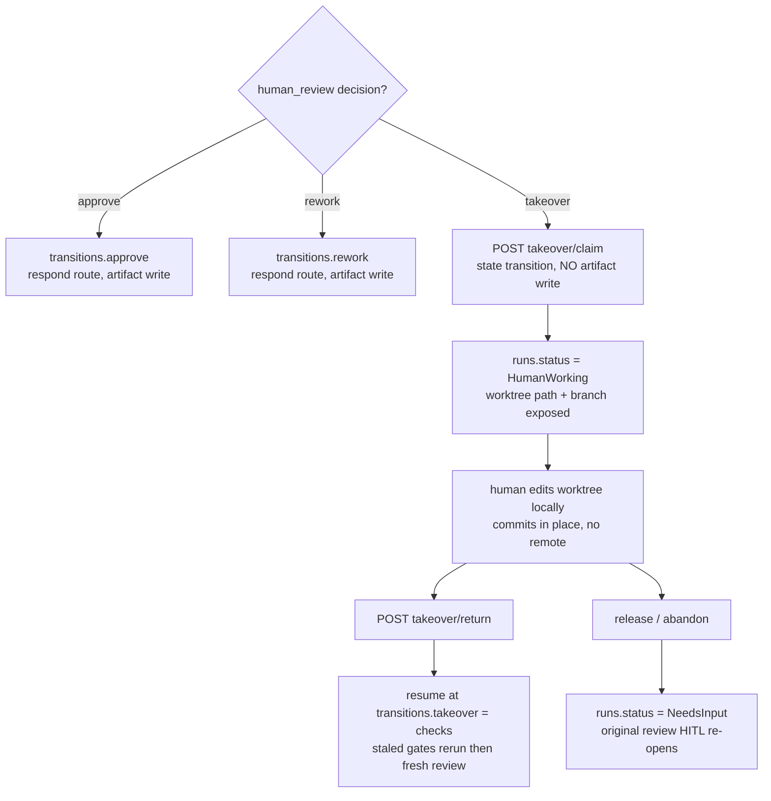

The **return** path is a **two-phase commit** (mirrors the form/idle two-phase
contract but against the worktree, not the supervisor): a Phase-1 claim intent,
a Phase-2 git/ledger side-effect, then a Phase-3 AFTER-side marker.

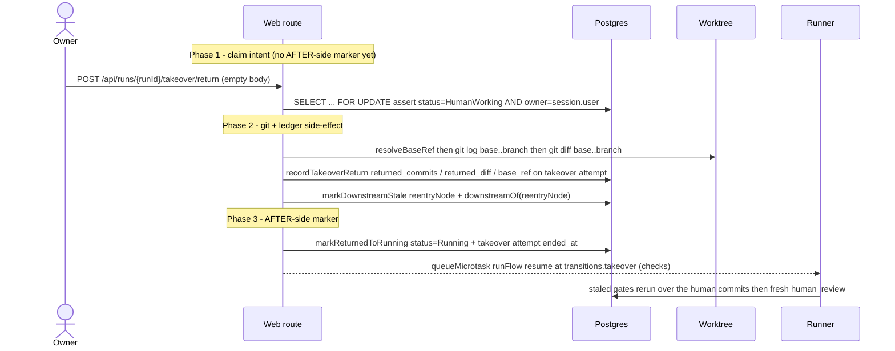

The `status='Running'` flip plus the takeover row's `ended_at` is the **AFTER-side
idempotency marker** — never set before the git/ledger side-effect completes. A
git-op failure in Phase 2 leaves the run `HumanWorking` with no ledger write and
no status flip (409 `CONFLICT`, retryable).

### Gate-chat at HITL pauses + workspace-neutrality (M30 — Implemented)

**(M30 — Implemented, [ADR-075](../decisions.md#adr-075-gate-chat-at-hitl-pauses-with-three-layer-workspace-neutrality).)**
At a `human`/`form` pause a reviewer can ask the parked agent an answer-only
question through **gate-chat**, persisted to `gate_chat_messages`. Chat NEVER
resolves the HITL and NEVER flips the run to `Running`.

**Availability (DD2)** — chat is enabled iff `runs.status ∈ {NeedsInput,
NeedsInputIdle}` AND the open HITL `kind ∈ {human, form}` AND
`runs.acp_session_id ≠ null`. Excluded by construction: `permission`-kind (the
session is mid-prompt-turn — the in-flight `conn.prompt()` promise owns the
session), `HumanWorking` (manual takeover owns the worktree, no live agent
session), and the no-session case (explanatory empty state).

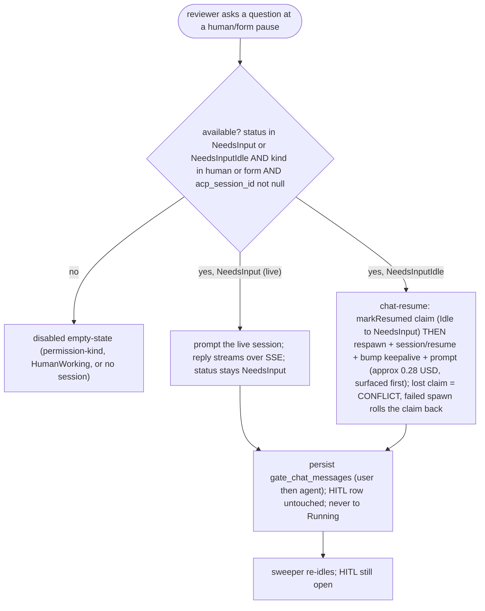

**Live vs idle (DD3).** `NeedsInput` (turn complete) → prompt the live session; the
reply streams over the SSE bridge as a `session.chat_turn` event; status stays
`NeedsInput`. `NeedsInputIdle` → **chat-resume**: `markResumed` claim
(Idle→NeedsInput) BEFORE the respawn with ACP `session/resume` on
`runs.acp_session_id`, then keepalive bump + prompt, then the sweeper re-idles —
the same claim-before-spawn order as `resumeRun`, so a concurrent `/respond`
resume or second chat turn loses the CAS with `CONFLICT` and never spawns a
duplicate session; a failed spawn rolls the claim back to `NeedsInputIdle`.
Chat-resume MUST NOT call the resumed-session driver and
MUST NOT touch the `hitl_requests` row. **Allow-list invariant (tested):** chat may
drive `Idle→NeedsInput`; it NEVER drives `→Running` and NEVER writes
`hitl_requests.responded_at`. The chat prompt is tagged with the server-derived
marker `stepId = "gate-chat-<hitlRequestId>"` (dash, not colon — the supervisor
`SAFE_PATH_SEGMENT` rejects a colon and the marker names the per-step log file).
Chat input is NEVER Mustache-evaluated.

**Workspace-neutrality (DD11) — three layers; L3 is the only hard guarantee**
(consistent with the ADR-041 instructed-only model and the ADR-074 detect-after
sensor):

- **L1 Instruct.** Every chat prompt is prefixed server-side with a "read-only Q&A,
  do not modify the workspace" preamble (not user text).
- **L2 Permission auto-deny (best-effort).** A `readOnlyTurn` flag on the prompt +
  session record makes the supervisor `requestPermission` callback auto-reject
  unambiguous mutating `toolCall.kind` (`edit | write/create | delete | move`)
  BEFORE any SSE emit or pending-permission registration — so no
  `session.permission_request` fires and no `hitl_requests` row is created.
  `read`/`fetch` pass; `execute` (bash) passes and relies on L3. L2 is a **no-op**
  under `--dangerously-skip-permissions` / `permissionMode:allow` — hence L3.
- **L3 Mutation sensor (hard guarantee).** ONE known-good baseline is captured at
  the FIRST chat turn (`refs/maister/chat-checkpoints/<runId>/<hitlRequestId>`,
  bounded at 1, via the ADR-076 machinery) and EVERY subsequent turn is verified
  against it (`statusPorcelain` + `git diff`). On a delta the workspace is restored
  to the baseline (overlay + targeted deletion of only the rogue untracked paths
  absent from the baseline tree — never a blanket `git clean`, never touching
  `.maister/`), `gate_chat_messages.mutation_reverted` is set `true`, an
  Observatory-ready audit signal is emitted, and a UI notice rides the turn. L3 runs
  **unconditionally** and **fail-closed** (a sensor that cannot sense must not pass);
  it covers permissive runners where L2 is a no-op. The ref is GC'd when the HITL
  resolves; a mid-pause dirty-resolution (ADR-079) deletes it so the next turn
  re-anchors (no false un-discard).

**Feature-3 interplay.** When a later rework resumes the SAME session
([ADR-078](../decisions.md#adr-078-rework-session-policy-with-resume-by-default)
`session_policy: resume`), the rework prompt MUST explicitly lift the chat-time
read-only restriction, else the agent may refuse legitimate edits. Rework compose
([ADR-072](../decisions.md#adr-072-pr-grade-review-comments--review_comments-table-snapshot-anchoring-runner-side-rework-compose-open-gate-guard))
folds the chat history into `commentsVar`.

### Review-diff completeness — dirty-state protocol + scope switcher (M30 — Implemented)

**(M30 — Implemented, [ADR-079](../decisions.md#adr-079-review-diff-completeness-with-dirty-state-protocol-and-scope-switcher).)**
When a review gate opens, the runner computes `dirtySummary` via `statusPorcelain`
(incl. untracked) — **no auto-commit**. A dirty worktree does NOT block the gate;
the summary rides on the gate/HITL payload so the reviewer sees uncommitted work
instead of silently missing it.

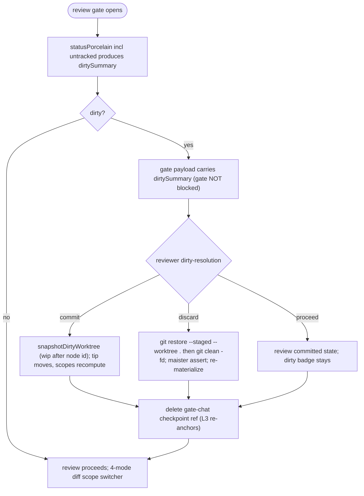

The reviewer's choice is recorded write-once on `hitl_requests.dirty_resolution`
(X-2PC: the intent is claimed via a guarded CAS before the git side-effect, so a
concurrent second resolution gets `CONFLICT` without running git; a git failure
rolls the claim back, returns 409, and leaves the gate open, unrecorded). **Discard is hard-guarded**:
`git clean -fd` (never `-fdx`), scoped `-C <worktree>`, with a `.maister/`
containment assertion, and re-runs launch materialization afterward
([ADR-076](../decisions.md#adr-076-node-workspacepolicy-execution-and-checkpoint-capture))
— `.maister/` is never touched. Every executed choice deletes the gate-chat
checkpoint ref (`refs/maister/chat-checkpoints/<runId>/<hitlRequestId>`) so the
ADR-075 L3 sensor re-anchors and never "reverts" an explicit Discard.

**4-mode diff scope switcher** — `scope` on `GET /api/runs/{runId}/diff`, all
sharing the
[ADR-066](../decisions.md#adr-066-editor-and-diff-rendering-stack-shiki-git-diff-view-codemirror)
`prepareDiff` pipeline + byte-cap guard:

| scope | base → head | base source |
| --- | --- | --- |
| `run` (default) | `workspace.baseCommit..branch` | current behavior |
| `since-last-review` | `<prev-review-visit-sha>..branch` | `hitl_requests.review_tip_sha` (stamped per review visit) |
| `last-node` | `<pre-attempt-checkpoint-sha>..branch` | ADR-076 checkpoint ref of the latest completed agent node |
| `uncommitted` | `HEAD` vs working tree + untracked as additions | temp `GIT_INDEX_FILE` intent-to-add; the real index is never mutated |

A scope whose base ref is missing (pre-feature run, first review visit) is
hidden/disabled with a reason, never an error. Consumer-project review gates list
launch-materialized capability bundles in `dirtySummary` — known v1 noise
(ADR-076); the dogfood project is unaffected (its skills/agents are repo-local).

### Cross-project Inbox block and numeric badge (Implemented — M17)

The portfolio home (`app/(app)/page.tsx`) renders a full cross-project
Inbox block listing every pending `HitlItem` across all projects visible
to the actor. The block absorbs the per-project `NeedsYouStrip`; the
compact numeric "Needs you (N)" badge on each `ProjectCard` and on the
portfolio header survives. The inline response component renders directly
inside the block so the operator can respond without navigating to the
run page. Access is RBAC-scoped: members see only their own projects;
admins see all.

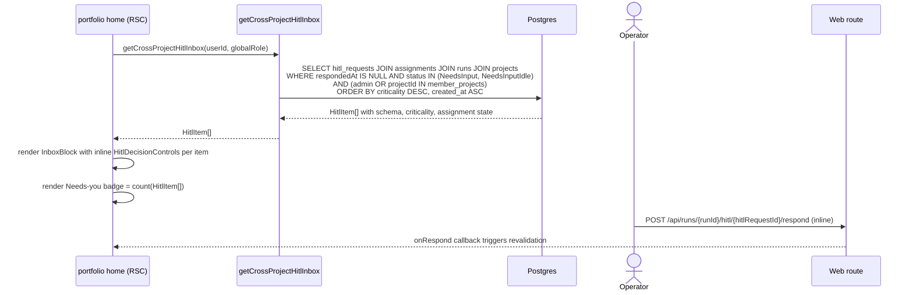

### HITL-over-MCP — hitl_list and hitl_respond (Implemented — M17)

External token-scoped agents query and answer pending HITL via two new
MCP tools (`hitl_list`, `hitl_respond`) backed by new external REST
routes. Both routes enforce scope (D8) and actor-kind (D7) gates and
emit audit rows via `handleExt`. A token/agent actor may answer
`permission` and `form` HITL only; `human`-kind requests require a human
actor. Cross-project isolation is enforced by existence-hiding: a
`runId` that belongs to a different project returns 404, not 403.

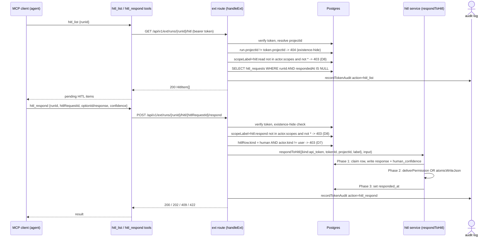

## Keep-alive activity tracking

The flow below describes the implemented checkpoint/resume path:
activity pings extend `runs.keepalive_until`, the sweeper checkpoints
idle `NeedsInput` runs, and a later HITL response resumes the ACP session
via the `session/resume` call on `acp_session_id` (not a CLI flag).

While a run is in `NeedsInput`, the run-detail page is responsible for
keeping the worker alive:

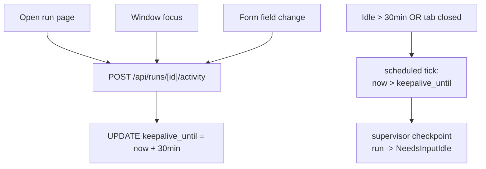

## Form schema versioning

Every form payload includes a required `schemaVersion: integer`.
`validateFormSchemaVersion(payload, expected)` throws
`MaisterError("CONFIG")` on mismatch with both versions named.

```yaml
schemaVersion: 1
fields:
  - name: comment
    label: Reviewer comment
    type: string
    required: true
  - name: severity
    type: enum
    options: [low, medium, high]
  - name: confirm
    type: boolean
    default: false
```

## Expectations

- HITL kind is exactly `permission | form | human`; mapping to wire
  matches the three-kinds table verbatim.
- Every HITL request is persisted as a `hitl_requests` row before the
  run transitions to `NeedsInput`; UI never derives HITL state from
  supervisor in-memory state.
- Every new permission/form/human wait creates an open M13 assignment; legacy
  HITL rows without assignments remain readable as compatibility data, but new
  inbox ownership/counts prefer assignments.
- **(M30 — Implemented, ADR-079)** A dirty worktree at a review gate NEVER blocks the
  gate; `dirtySummary` (from `statusPorcelain`, incl. untracked) rides on the gate
  payload and the reviewer's `commit | discard | proceed` choice is recorded on
  `hitl_requests.dirty_resolution` + audit in one transaction.
- **(M30 — Implemented, ADR-079)** Discard runs `git clean -fd` (never `-fdx`) scoped
  `-C <worktree>` with a `.maister/`-containment assert and re-materialization; it
  MUST NOT touch `.maister/`. Every executed dirty-resolution deletes the gate-chat
  checkpoint ref so the ADR-075 L3 sensor re-anchors.
- **(M30 — Implemented, ADR-079)** `GET /api/runs/{runId}/diff?scope=` accepts exactly
  `run | since-last-review | last-node | uncommitted` (allow-list); a missing-base
  scope is hidden/disabled with a reason, never an error; `uncommitted` renders via
  a temp `GIT_INDEX_FILE` and MUST NOT mutate the real index.
- **(M30 — Implemented, ADR-079)** `hitl_requests.review_tip_sha` is stamped with the
  branch tip (`headCommit`) at each review-gate visit; it is the base for the
  `since-last-review` scope.
- **(M30 — Implemented, ADR-075)** Gate-chat is available iff `runs.status ∈
  {NeedsInput, NeedsInputIdle}` AND the open HITL `kind ∈ {human, form}` AND
  `runs.acp_session_id ≠ null`; `permission`-kind and `HumanWorking` are excluded.
- **(M30 — Implemented, ADR-075)** A gate-chat turn NEVER resolves the HITL, NEVER
  writes `hitl_requests.responded_at`, and NEVER drives the run `→Running`; on
  `NeedsInputIdle` it may drive `Idle→NeedsInput` (chat-resume) and then re-idle.
- **(M30 — Implemented, ADR-075)** The L3 mutation sensor captures ONE baseline at the
  first chat turn, runs unconditionally + fail-closed on every turn, reverts any
  detected mutation to that baseline, sets `gate_chat_messages.mutation_reverted =
  true`, and emits an audit signal — even under permissive runners where L2 is a
  no-op; the baseline ref is GC'd on HITL resolve and deleted by any dirty-resolution.
- **(M30 — Implemented, ADR-075)** Chat input is NEVER Mustache-evaluated; the L1
  preamble is server-side; the chat-prompt `stepId` marker uses a dash
  (`gate-chat-<hitlRequestId>`), never a colon.
- **(Implemented)** A run in `NeedsInput` extends `keepalive_until` by
  `MAISTER_KEEPALIVE_MINUTES` (default 30) on operator activity through
  `POST /api/runs/[id]/activity`.
- **(Implemented)** Idle past `keepalive_until` triggers checkpoint →
  run becomes `NeedsInputIdle` with `acp_session_id` retained. Supervisor
  `POST /sessions/:id/checkpoint` cancels pending permission deferreds
  with reason `checkpoint`, terminates the live adapter session, and lets
  the runner observe `session.exited.reason = "checkpoint"`.
- **(Implemented)** 24 h elapsed in `NeedsInputIdle` without response →
  run `Abandoned`, task → `Backlog`. This sweeper transition does not
  raise `HITL_TIMEOUT`.
- Every form payload includes `schemaVersion: integer`; mismatch with
  the Flow's declared version raises `CONFIG` with both versions
  named.
- Form-schema field types are exactly `string | number |
  boolean | enum | array`; unknown type refused with `CONFIG` at Flow
  load.
- **(Implemented)** Operator responses go through
  `POST /api/runs/[runId]/hitl/[hitlRequestId]/respond`. Permission
  responses are routed through the supervisor's
  `POST /sessions/:id/input` (permission-only, discriminated `action:
  "select" | "cancel"`). Form / `human` responses are written via
  `atomicWriteJson` (tmp + rename) to
  `.maister/<slug>/runs/<runId>/input-<stepId>.json` by the web tier
  AFTER the row-level CAS claim succeeds — concurrent double-submits
  with conflicting payloads return 409 before any artifact is
  touched, and same-payload retries are idempotent. The supervisor
  never writes input artifacts.
- **(Implemented — M17)** `human` step responses are captured under the
  same two-phase commit + artifact-write contract as `form` (stored as
  `hitl_requests.kind = "human"`); the reject decision is carried in the
  response payload as `{ rejected: bool, comments?: string }`. On
  **approve** the runner advances to the next step; on **reject** the
  runner EXECUTES the step's `on_reject.goto_step` rerouting (see the
  `runHumanStep` rerouting bullet below), bounded by `maxLoops` — rejection
  is a routing action, NOT merely informational.
- **(Implemented — M17)** A conflicting re-submit on an already-claimed
  `hitl_requests` row (different payload, `respondedAt IS NULL`) MUST
  return 409 before any artifact or supervisor side-effect runs.
  A same-payload retry on a delivered row (`respondedAt IS NOT NULL`)
  MUST be idempotent (200 + re-queue resume). The respond route MUST
  reject any `runs.status` outside `PENDING_FORM_RUN_STATUS =
  {NeedsInput, NeedsInputIdle}` with 422.
- **(Implemented — M17)** `hitl_requests.criticality` MUST be written
  once at creation from the flow-author-declared `human` node/step
  `criticality` field (`low | medium | high | critical`) and MUST NOT
  be updated after insertion.
- **(Implemented — M17)** `hitl_requests.human_confidence` MUST be a
  real in `[0,1]`; values outside that range MUST be rejected
  server-side with 422. `human_confidence` and `criticality` ANNOTATE
  a human decision; they MUST NOT re-gate readiness. The escalate-to-
  human decision stays the Flow's `human_review` gate, never the
  external actor's.
- **(Implemented — M17)** A token or internal-agent actor MUST NOT
  satisfy a `hitl_requests.kind = "human"` request;
  `respondToHitl` MUST return 403 (`UNAUTHORIZED`) for any
  `actor.kind !== "user"` when `hitlRow.kind = "human"` (D7).
  Token actors are limited to answering `permission` and `form` HITL.
- **(Implemented — M17)** Both HITL ext routes (`GET …/hitl` scope
  `hitl:read`, `POST …/hitl/{id}/respond` scope `hitl:respond`) MUST
  enforce `handleExt({requireScope:true})`: the route's `scopeLabel`
  MUST be in `actor.scopes` or equal `"*"`; absent scope MUST return
  403. A token actor MUST NOT create or skip a gate; gate placement
  stays the Flow's.
- **(Implemented — M17)** The flat `steps[]` `on_reject` loop MUST be
  bounded by `maxLoops` (default 5). Exceeding `maxLoops` MUST raise
  `MaisterError("CONFIG")` (parity with the graph runner's `rework.maxLoops`
  breach) and terminate the run.
- **(Implemented — ADR-072)** A graph review gate's stored schema MUST carry
  server-state `{ maxLoops, gateAttempt }`; the respond route MUST reject a
  `rework` decision with 422 (`NEEDS_INPUT`) when `gateAttempt > maxLoops`
  (total gate visits = `maxLoops + 1`) BEFORE any artifact write or state
  mutation — the engine `CONFIG` throw remains the backstop only (it fires
  on a fresh-visit append, never on a resume-reuse re-entry). The
  rejection applies only when the stored schema carries both fields: a
  no-rework node stamps `maxLoops` null and legacy pre-ADR-072 rows lack
  the fields entirely, so the rule is vacuous there.
- **(Implemented — M17)** Full `on_reject.goto_step` rerouting in
  `runHumanStep`: on rejection the runner MUST write
  `rework-comments-{gotoStepId}.json` (NEVER `input-{gotoStepId}.json`),
  delete `input-{stepId}.json` for every step in
  `[gotoTarget..humanStep]`, and atomically repark
  `runs.currentStepId` to the goto target in a single CAS transaction.
- **(Implemented)** `hitl_requests.response` and `.responded_at`
  use two-phase commit semantics:
  * **Phase 1 (atomic claim).** `response` is stored under a row-level
    `SELECT ... FOR UPDATE` only if the row is unclaimed, or claimed
    with the same payload (idempotent retry). Different payload on
    retry → 409.
  * **Phase 2 (durable side-effect).** For permission, the supervisor
    deferred is resolved; for form/human, `input-<stepId>.json` is
    written from the STORED response.
  * **Phase 3 (delivered marker).** `responded_at` is set ONLY after
    the side-effect succeeds. The route does NOT flip `runs.status`
    back to `Running` — the runner owns that transition on resume so
    its `isResume` gate can match.
  * Retry classification: supervisor 410 → `HITL_TIMEOUT` terminal
    (run → `Failed`); supervisor 503 / network → `EXECUTOR_UNAVAILABLE`
    retryable (row stays claimed, `responded_at` NULL); artifact
    write I/O failure → 503 retryable.
  * Same-payload retry on an already-delivered row re-queues
    `runFlow` so a process crash between Phase 3 commit and the
    original microtask cannot strand the run in `NeedsInput`.
- **(Designed)** HITL request lost during supervisor shutdown is
  recoverable via the standard `acp_session_id` resume on next launch —
  no separate reconciliation needed. Depends on checkpoint/resume
  landing the `session/resume` re-spawn path.
- **(Implemented M8 — Codex review fix #1)** When the supervisor
  cancels a pending permission as part of a checkpoint flow (sweeper or
  `POST /sessions/:id/checkpoint`), the adapter resolves the deferred
  with `{outcome: "cancelled"}` and returns `stopReason: "end_turn"`
  from `prompt()` — the cancelled permission is journaled for replay
  on the next `session/resume`. The web runner-agent MUST observe
  `session.exited.reason="checkpoint"` on the SSE stream and suppress
  step success: it calls `markCheckpointedFromExit(runId)`
  (`NeedsInput → NeedsInputIdle`, same SQL as the sweeper's
  `markCheckpointed` with a distinct trigger marker in logs) and
  returns `errorCode: "STEP_CHECKPOINTED"` from the step. `runFlow`
  treats `STEP_CHECKPOINTED` as a pause (not a failure): mark the
  step_run NeedsInput, skip terminal write, `promoteNextPending` (slot
  is free, `NeedsInputIdle` does not count). Without this contract a
  checkpoint mid-permission would race the sweeper's idle transition
  and the step could be marked succeeded with an un-replayed
  permission.
- **(Implemented M8 — Codex review fix #2)** Claimed-but-undelivered
  HITL intents (`hitl_requests.response IS NOT NULL AND respondedAt
  IS NULL` joined to `runs.status='NeedsInput'`) are recovered on web
  boot via `web/lib/runs/resume-recovery.ts:runResumeRecoverySweep`.
  The sweep runs in `web/instrumentation.ts` BEFORE the keep-alive
  sweeper and either re-schedules `scheduleResumedSessionDrive`
  against a live supervisor session OR atomically rolls the run back
  to `NeedsInputIdle` (status-guarded; intent preserved). Supervisor
  5xx during recovery → skip-this-boot, the keep-alive sweeper's
  24 h TTL is the long-term safety net. Always-on, no flag.
- **(Implemented M8 — Codex review fix #3)** Every resume-driver
  terminal transition (`completeResumedStepAndHandoff` last-step
  `Review`, `failResumedRun`, `crashResumedRun`) calls
  `promoteNextPending` after a successful status-guarded write —
  mirrors `runFlow`'s normal-path pattern at
  `web/lib/flows/runner.ts:586`. Failed status-guard (race lost) is
  detected via `{ok: false}` and skipped, so no double-promotion.

## Edge cases

- **24h elapsed in `NeedsInputIdle`** → run `Abandoned`, task →
  `Backlog`. This is a sweeper state transition, not `HITL_TIMEOUT`.
- **Form payload `schemaVersion` mismatch** → `CONFIG`. Worker stays
  in `NeedsInput`; operator sees a validation error in the form.
- **Unsupported field type in `form_schema`** → `CONFIG` at Flow load
  time (`web/lib/config.ts`).
- **Operator submits twice in quick succession** — the response
  route's row-level CAS (`SELECT ... FOR UPDATE` + conditional
  UPDATE) ensures only one submission claims the deferred. A
  same-payload retry is idempotent (200 + re-queue resume); a
  different-payload retry is rejected with 409 BEFORE any artifact
  or supervisor side-effect runs.
- **(M30 — Implemented, ADR-079) Discard path escapes the worktree** → the
  `.maister/`-containment assert hard-fails the discard with a mapped 409
  (`CONFLICT`/`PRECONDITION`); the gate stays open and no `dirty_resolution` is
  recorded.
- **(M30 — Implemented, ADR-079) Diff scope base ref missing** (pre-feature run,
  first review visit, no completed agent node yet) → that scope is hidden/disabled
  with a reason; the default `run` scope always resolves. Never an error.
- **(M30 — Implemented, ADR-075) Gate-chat on a `permission`-kind pause or
  `HumanWorking` run** → unavailable; the UI shows a disabled empty-state, not a chat
  box (the session is mid-prompt-turn or human-owned).
- **(M30 — Implemented, ADR-075) Idle gate-chat respawn fails** → the chat prompt's
  deferred is released, the turn errors without resolving the HITL, and the run stays
  `NeedsInputIdle` (never a partial `→Running`).
- **(M30 — Implemented, ADR-075) Agent mutates the workspace during a chat turn** → L3
  reverts to the first-turn baseline, marks `mutation_reverted=true`, and emits an
  audit signal; the turn's answer still renders with a revert notice.
- **Supervisor restart while the user response is in-flight** —
  supervisor returns 503 `EXECUTOR_UNAVAILABLE` for the
  "unknown session" case (distinct from 410 `HITL_TIMEOUT` for
  expired deferred). The web tier treats 503 as retryable: the
  `responded_at` marker stays NULL, the response column holds the
  user's intent, and a retry replays through the normal flow.
- **Agent reads a malformed `input-<stepId>.json`** — adapter exits
  non-zero → `Crashed`. Operator decides whether to Recover or
  Discard.
- **HITL on `human` step is rejected** — rejection is stored as
  response payload. (Implemented — M17) The runner reparks
  `currentStepId` to `on_reject.goto_step` atomically, invalidates
  prior-pass completion sentinels for the re-execution window, and
  re-enters at the goto target with `comments_var` injected from
  `rework-comments-{gotoStepId}.json`. Exceeding `maxLoops` →
  `MaisterError("CONFIG")` (terminal).
- **`session/request_permission` arrives while the supervisor is
  shutting down** — request lost; agent will retry on next launch
  through the standard `acp_session_id` resume.
- **Token actor calls ext HITL respond on a `human`-kind request** —
  `respondToHitl` returns `MaisterError("UNAUTHORIZED")` → HTTP 403
  (D7). Response body MUST NOT reveal which HITL kind triggered the
  refusal. (Implemented — M17)
- **Token missing `hitl:read` or `hitl:respond` scope** →
  `handleExt({requireScope:true})` returns 403. Response MUST NOT
  leak which scopes the token holds (D8). (Implemented — M17)
- **Ext HITL route called with a `runId` from a different project** →
  existence-hide: 404, not 403. (Implemented — M17)
- **`human_confidence` body value outside `[0,1]`** → server-side Zod
  validation fails → 422 (`NEEDS_INPUT`). (Implemented — M17)
- **`on_reject.goto_step` re-entry guard exceeded** → `MaisterError("CONFIG")` →
  run `Failed`, task → `Backlog`. (Implemented — M17)
- **Graph review `rework` decision at an exhausted loop**
  (`schema.gateAttempt > schema.maxLoops`) → 422 (`NEEDS_INPUT`) at validate
  time — no artifact write, no state mutation; the reviewer can still
  approve. Without this rule a final-loop rework would die at the engine's
  fresh-append check when traversal returns to append visit `maxLoops + 2`
  and `CONFIG`-fail the whole run (that throw remains the backstop; it
  never fires on the resume re-entry processing a decision at the final
  allowed visit). (Implemented — ADR-072)

## M8 — live vs idle HITL response paths

The `POST /api/runs/:runId/hitl/:hitlRequestId/respond` route branches
on the locked `runs.status` read inside the M7 atomic-claim transaction:

```
                 lockedRun.status?
                       │
        ┌──────────────┴──────────────┐
        │                             │
   NeedsInput                  NeedsInputIdle
        │                             │
        ▼                             ▼
  Phase 2: deliverPermission     Phase 2: resumeRun
   (sync supervisor RPC)         (spawn fresh session)
        │                             │
        ▼                             ▼
   200 ok                         202 resume-in-progress
                                       │
                                       ▼
                             Phase 3 (async — runner-agent):
                             on next session.permission_request
                             from the resumed session, look up the
                             stored hitl_requests row and auto-deliver
                             the operator's intent against the NEW
                             requestId, then mark respondedAt with
                             audit { originalRequestId, reissuedRequestId,
                             deliveredViaResume: true }.
```

### Two-phase commit on the idle branch

| Phase | Layer | DB write | Side-effect |
|-------|-------|----------|-------------|
| 1 | web route | M7 atomic-claim: `UPDATE hitl_requests SET response=:intent WHERE id=:id AND respondedAt IS NULL` (FOR UPDATE) | none |
| 2 | web route → `resumeRun(runId)` | inside `markResumed`: `UPDATE runs SET status='NeedsInput', keepalive_until=now+N, checkpoint_at=null WHERE id=:id AND status='NeedsInputIdle'` | `POST /sessions` to supervisor with `resumeSessionId` |
| 3 | runner-agent permission_request handler | `UPDATE hitl_requests SET respondedAt=now(), response=<merged>` | `POST /sessions/:id/input` to supervisor with the new `requestId` |

The route NEVER awaits Phase 3 — it returns 202 immediately after
Phase 2's 201 from the supervisor. Phase 3 happens asynchronously
within the runner-agent's event loop over the next 5-60 s.

### Idempotency guards (idle branch)

- Retry with same payload while `respondedAt IS NULL` AND
  `runs.status='NeedsInput'` (resume already in progress; runner-agent
  hasn't auto-delivered yet): 202 `{state:"resume-in-progress"}`.
- Retry with same payload after successful auto-deliver
  (respondedAt set): 200 idempotent.
- Retry after terminal `Failed` (Phase 2 failed terminally):
  410 `{terminal:true}`.
- Retry with different payload: 409 (M7 CAS rule).

### Resume failures

The classification table mirrors `resumeRun(runId)` results:

| Supervisor status | MaisterError | HTTP | Run status |
|---|---|---|---|
| 5xx / network | EXECUTOR_UNAVAILABLE | 503 `{terminal:false}` | unchanged (NeedsInputIdle) |
| 400 spawn refused | CHECKPOINT | 410 `{terminal:true}` | Failed (via failResumedRun) |
| 201 empty acpSessionId | CHECKPOINT | 410 `{terminal:true}` | Failed |
| 404 unknown checkpoint | CHECKPOINT | 410 `{terminal:true}` | Failed |

### Resume-prompt watchdog (deferred enforcement)

`MAISTER_RESUME_PROMPT_TIMEOUT_SECONDS` (default 60) bounds the wait
for the resumed session's first `session.permission_request`. On
expiry the runner-agent must call `crashResumedRun(runId)` → run
transitions to `Crashed` and the stored intent is closed with
`respondedAt=now()` (audit: `{abandonedReason:"resume-prompt-timeout"}`).
The helper exists in `web/lib/runs/state-transitions.ts`; the
runner-agent enforcement is queued for a follow-up patch.

## Linked artifacts

- ADRs: [ADR-006 Hybrid HITL](../decisions.md#adr-006-hybrid-hitl-keep-alive--checkpointresume),
  [ADR-008 Typed error taxonomy](../decisions.md#adr-008-typed-error-taxonomy-maistererror),
  ADR-054 (HITL assessment taxonomy — `criticality`/`human_confidence`; Implemented — M17),
  ADR-055 (HITL response service + HITL-over-MCP + token-actor + D7/D8 gates; Implemented — M17),
  ADR-056 (flat-runner `on_reject` atomic repark; Implemented — M17),
  ADR-057 (HITL hybrid-surface composition — cross-project inbox; Implemented — M17),
  [ADR-066 Diff rendering stack](../decisions.md#adr-066-editor-and-diff-rendering-stack-shiki-git-diff-view-codemirror) (M30 scope-switcher reuse),
  [ADR-079 Review-diff completeness (M30 — Implemented)](../decisions.md#adr-079-review-diff-completeness-with-dirty-state-protocol-and-scope-switcher),
  [ADR-075 Gate-chat + workspace-neutrality (M30 — Implemented)](../decisions.md#adr-075-gate-chat-at-hitl-pauses-with-three-layer-workspace-neutrality).
- ERD: [`../db/hitl-domain.md`](../db/hitl-domain.md).
- Config reference: [`../configuration.md`](../configuration.md)
  §`form_schema versioning`;
  §`Environment variables (server tier)` for
  `MAISTER_KEEPALIVE_MINUTES`.
- API (external): [`../api/external/acp.asyncapi.yaml`](../api/external/acp.asyncapi.yaml)
  §`session.request_permission`.
- Related: [`runs.md`](runs.md), [`flows.md`](flows.md),
  [`flow-graph.md`](flow-graph.md) (M11a review decisions),
  [`review-comments.md`](review-comments.md) (Implemented — ADR-072:
  line-anchored review threads, `{maxLoops, gateAttempt}` schema fields,
  loop-exhaustion refusal).
- Source: `web/lib/config.ts` (`validateFormSchemaVersion`),
  `web/lib/atomic.ts` (`atomicWriteJson`),
  `web/lib/db/schema.ts` (hitl_requests table).
