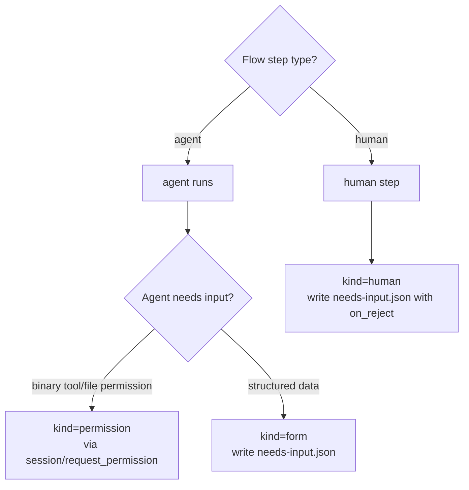
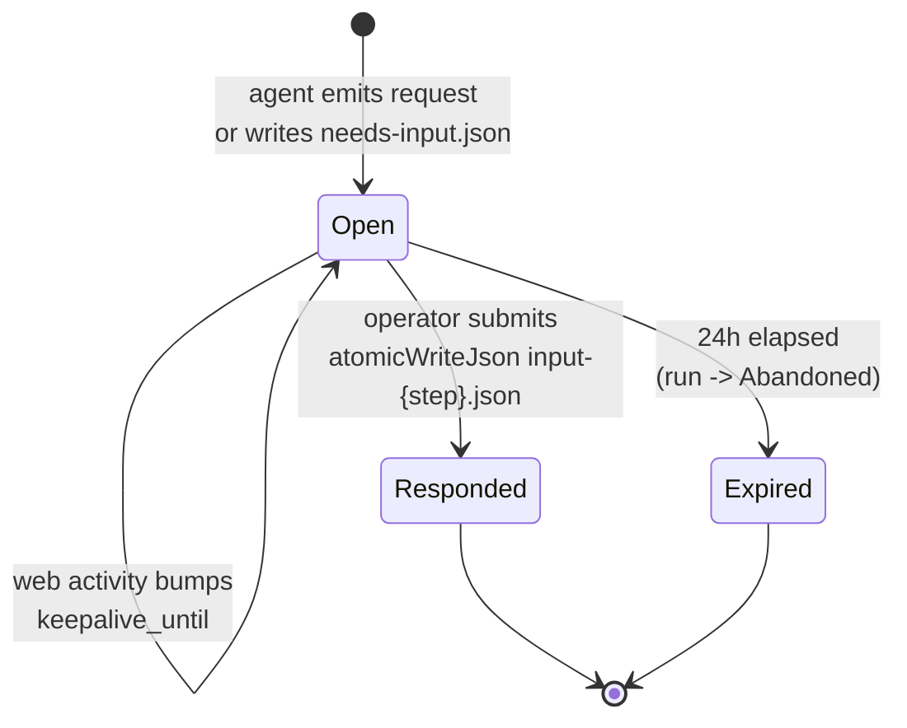
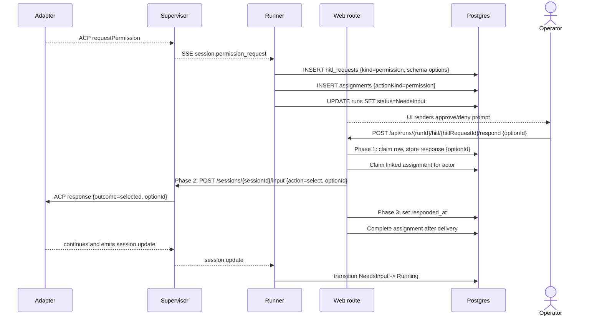
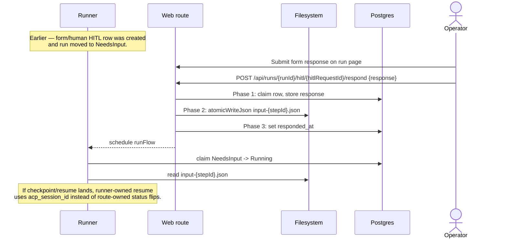
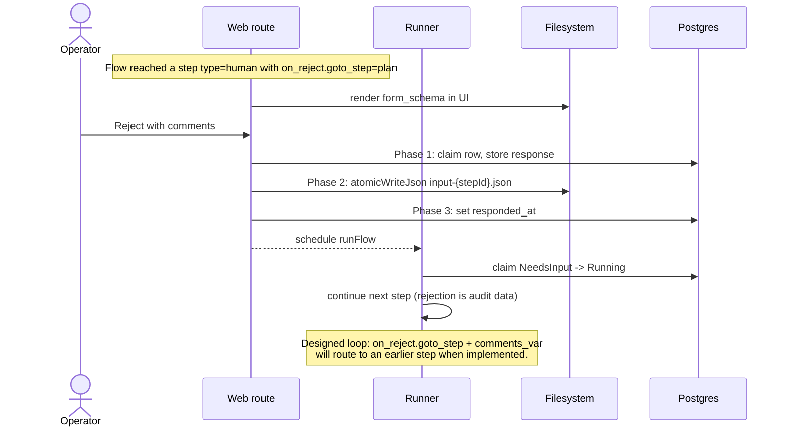
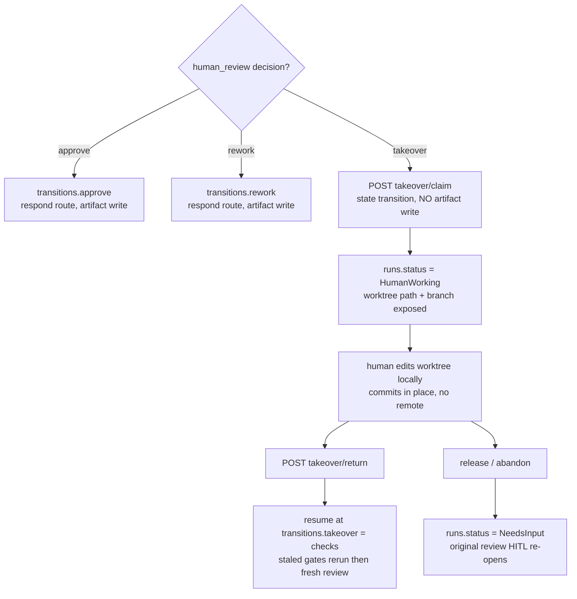
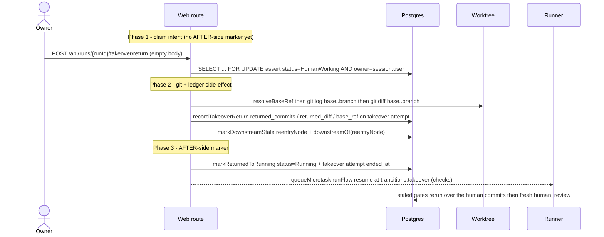
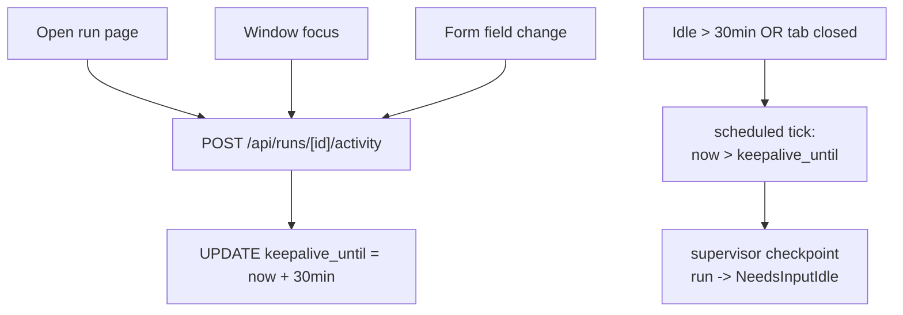

# HITL domain

## Purpose

**HITL** — human-in-the-loop — covers every transition where a run
needs an operator decision before it can continue. HITL is not a
sidecar feature; it is a first-class state of a run. The domain spans
three kinds of human ask, the lifecycle that surrounds them, and the
artifact protocol used when the worker is checkpointed.

## Domain entities

- **HITL request** — `hitl_requests` row. FK to `runs`.
- **Assignment** — M13 `assignments` row linked by `hitl_request_id`; this is
  the inbox and ownership primitive for open HITL work. `hitl_requests` still
  owns the payload and `responded_at` marker.
- **Kind** — `'permission' | 'form' | 'human'`:
  - `permission` — binary approve/deny via ACP
    `session/request_permission`.
  - `form` — structured form, schema declared in the Flow's
    `human` step `form_schema`.
  - `human` — Flow step `type: human` with an `on_reject` clause
    declared in `flow.yaml`. Current behaviour: the row is persisted
    as `kind="human"` and the response is captured under the same
    atomic-claim + artifact-write contract as `kind="form"`. The
    loop-on-reject routing (`on_reject.goto_step` rerouting +
    `comments_var` propagation) is designed — until then,
    `kind="human"` behaves wire-equivalent to `kind="form"`. The
    distinction is preserved on the row so the loop can light up
    rerouting without a schema change.
- **Form schema** — JSON Schema-like object with required
  `schemaVersion: integer`. Field types: `string | number | boolean |
enum | array`.
- **`needs-input.json`** — artifact written when a checkpointable
  structured-form request is raised.
- **`input-<stepId>.json`** — atomic-written response payload.

## Three kinds — when to use which

| Kind | Trigger | Form? | Loop on reject? | Wire |
| ---- | ------- | ----- | --------------- | ---- |
| `permission` | Agent emits `session/request_permission` mid-step | No (binary) | No | Live ACP request/response |
| `form` | Agent writes `needs-input.json` mid-step | Yes (`form_schema`) | No | Artifact + ACP message OR resume |
| `human` | Flow step `type: human` (linear) or `human_review` node finish (graph) | Yes (`form_schema`) | Linear: Designed (`on_reject.goto_step` not executed). Graph (M11a): **declared decisions** drive the rework loop | Artifact only |

The decision tree:



## State machine — HITL request



## Process flows

### Live path — permission request (Implemented)



### Structured form response (Implemented, checkpoint resume Designed)



### Human-review response (Implemented; loop Designed)



### Declared decisions vs raw `goto_step` (M11a — Designed)

The legacy `human` step reroutes via a single `on_reject.goto_step` that the
runner does not execute. A graph `human_review` node replaces that with
**declared decisions**: the manifest declares `finish.human.decisions` (e.g.
`approve`, `rework`) and a `transitions` map, and the runner stores the allowed
sets (`allowedDecisions`, `transitions`, `reworkTargets`, `workspacePolicies`)
in `hitl_requests.schema` at creation. The reviewer's `decision` /
`comments` / `workspacePolicy` ride **inside** the `response` payload; the
respond route validates them against that server-state allow-list **before** any
mutation (undeclared → 422), persists the resolved values to the
`decision`/`workspace_policy`/`rework_target` columns, and the graph runner reads
them on resume to drive the rework loop. No body field names a filesystem path
and no raw `goto_step` is accepted from the client. See
[`flow-graph.md`](flow-graph.md) and
[`../api/web.openapi.yaml`](../api/web.openapi.yaml).

### `takeover` decision → manual handoff (M11b — Implemented)

The `human_review` node's `takeover` decision is **not** an artifact-write HITL
response like `approve`/`rework`. It drives a **run-state transition**
(`NeedsInput → HumanWorking`) through a dedicated route pair —
`POST /api/runs/{runId}/takeover/claim` and `.../takeover/return` — not through
the `respond` route. The live `permission` / `form` / `human` (approve/rework)
paths above are **unchanged**. Domain detail lives in
[`manual-takeover.md`](manual-takeover.md);
[ADR-030](../decisions.md#adr-030-manual-takeover-as-a-local-worktree-handoff-humanworking-status)
is the locked decision.

The decision tree at a `human_review` finish:



The **return** path is a **two-phase commit** (mirrors the form/idle two-phase
contract but against the worktree, not the supervisor): a Phase-1 claim intent,
a Phase-2 git/ledger side-effect, then a Phase-3 AFTER-side marker.



The `status='Running'` flip plus the takeover row's `ended_at` is the **AFTER-side
idempotency marker** — never set before the git/ledger side-effect completes. A
git-op failure in Phase 2 leaves the run `HumanWorking` with no ledger write and
no status flip (409 `CONFLICT`, retryable).

## Keep-alive activity tracking

The flow below describes the implemented checkpoint/resume path:
activity pings extend `runs.keepalive_until`, the sweeper checkpoints
idle `NeedsInput` runs, and a later HITL response resumes the ACP session
with `--resume <acp_session_id>`.

While a run is in `NeedsInput`, the run-detail page is responsible for
keeping the worker alive:



## Form schema versioning

Every form payload includes a required `schemaVersion: integer`.
`validateFormSchemaVersion(payload, expected)` throws
`MaisterError("CONFIG")` on mismatch with both versions named.

```yaml
schemaVersion: 1
fields:
  - name: comment
    label: Reviewer comment
    type: string
    required: true
  - name: severity
    type: enum
    options: [low, medium, high]
  - name: confirm
    type: boolean
    default: false
```

## Expectations

- HITL kind is exactly `permission | form | human`; mapping to wire
  matches the three-kinds table verbatim.
- Every HITL request is persisted as a `hitl_requests` row before the
  run transitions to `NeedsInput`; UI never derives HITL state from
  supervisor in-memory state.
- Every new permission/form/human wait creates an open M13 assignment; legacy
  HITL rows without assignments remain readable as compatibility data, but new
  inbox ownership/counts prefer assignments.
- **(Implemented)** A run in `NeedsInput` extends `keepalive_until` by
  `MAISTER_KEEPALIVE_MINUTES` (default 30) on operator activity through
  `POST /api/runs/[id]/activity`.
- **(Implemented)** Idle past `keepalive_until` triggers checkpoint →
  run becomes `NeedsInputIdle` with `acp_session_id` retained. Supervisor
  `POST /sessions/:id/checkpoint` cancels pending permission deferreds
  with reason `checkpoint`, terminates the live adapter session, and lets
  the runner observe `session.exited.reason = "checkpoint"`.
- **(Implemented)** 24 h elapsed in `NeedsInputIdle` without response →
  run `Abandoned`, task → `Backlog`. This sweeper transition does not
  raise `HITL_TIMEOUT`.
- Every form payload includes `schemaVersion: integer`; mismatch with
  the Flow's declared version raises `CONFIG` with both versions
  named.
- Form-schema field types are exactly `string | number |
  boolean | enum | array`; unknown type refused with `CONFIG` at Flow
  load.
- **(Implemented)** Operator responses go through
  `POST /api/runs/[runId]/hitl/[hitlRequestId]/respond`. Permission
  responses are routed through the supervisor's
  `POST /sessions/:id/input` (permission-only, discriminated `action:
  "select" | "cancel"`). Form / `human` responses are written via
  `atomicWriteJson` (tmp + rename) to
  `.maister/<slug>/runs/<runId>/input-<stepId>.json` by the web tier
  AFTER the row-level CAS claim succeeds — concurrent double-submits
  with conflicting payloads return 409 before any artifact is
  touched, and same-payload retries are idempotent. The supervisor
  never writes input artifacts.
- **(Implemented)** `human` step responses are captured under the
  same two-phase commit + artifact-write contract as `form`. The
  `on_reject` clause on the Flow step is preserved in the row's kind
  (`hitl_requests.kind = "human"`) and may also be carried in the
  response payload as `{ rejected: bool, comments?: string }`, but the
  runner does NOT branch on it today — it advances to the next step
  with the response captured as ordinary `steps.<id>.vars`. The
  reviewer UI MUST therefore treat rejection as informational
  (recorded for audit, the run continues), not as a routing action.
- **(Designed)** Full `on_reject.goto_step` rerouting in
  `runHumanStep`: when the response indicates rejection, the runner
  jumps to the declared `goto_step` with `comments_var` populated
  from the response. Until it lands, the API surface MUST NOT
  represent rejection as a loop-back action — see `web.openapi.yaml`
  and the UI MUST disable loop-back affordances.
- **(Implemented)** `hitl_requests.response` and `.responded_at`
  use two-phase commit semantics:
  * **Phase 1 (atomic claim).** `response` is stored under a row-level
    `SELECT ... FOR UPDATE` only if the row is unclaimed, or claimed
    with the same payload (idempotent retry). Different payload on
    retry → 409.
  * **Phase 2 (durable side-effect).** For permission, the supervisor
    deferred is resolved; for form/human, `input-<stepId>.json` is
    written from the STORED response.
  * **Phase 3 (delivered marker).** `responded_at` is set ONLY after
    the side-effect succeeds. The route does NOT flip `runs.status`
    back to `Running` — the runner owns that transition on resume so
    its `isResume` gate can match.
  * Retry classification: supervisor 410 → `HITL_TIMEOUT` terminal
    (run → `Failed`); supervisor 503 / network → `EXECUTOR_UNAVAILABLE`
    retryable (row stays claimed, `responded_at` NULL); artifact
    write I/O failure → 503 retryable.
  * Same-payload retry on an already-delivered row re-queues
    `runFlow` so a process crash between Phase 3 commit and the
    original microtask cannot strand the run in `NeedsInput`.
- **(Designed)** HITL request lost during supervisor shutdown is
  recoverable via the standard `acp_session_id` resume on next launch —
  no separate reconciliation needed. Depends on checkpoint/resume
  landing the `--resume <id>` re-spawn path.
- **(Implemented M8 — Codex review fix #1)** When the supervisor
  cancels a pending permission as part of a checkpoint flow (sweeper or
  `POST /sessions/:id/checkpoint`), the adapter resolves the deferred
  with `{outcome: "cancelled"}` and returns `stopReason: "end_turn"`
  from `prompt()` — the cancelled permission is journaled for replay
  on the next `--resume`. The web runner-agent MUST observe
  `session.exited.reason="checkpoint"` on the SSE stream and suppress
  step success: it calls `markCheckpointedFromExit(runId)`
  (`NeedsInput → NeedsInputIdle`, same SQL as the sweeper's
  `markCheckpointed` with a distinct trigger marker in logs) and
  returns `errorCode: "STEP_CHECKPOINTED"` from the step. `runFlow`
  treats `STEP_CHECKPOINTED` as a pause (not a failure): mark the
  step_run NeedsInput, skip terminal write, `promoteNextPending` (slot
  is free, `NeedsInputIdle` does not count). Without this contract a
  checkpoint mid-permission would race the sweeper's idle transition
  and the step could be marked succeeded with an un-replayed
  permission.
- **(Implemented M8 — Codex review fix #2)** Claimed-but-undelivered
  HITL intents (`hitl_requests.response IS NOT NULL AND respondedAt
  IS NULL` joined to `runs.status='NeedsInput'`) are recovered on web
  boot via `web/lib/runs/resume-recovery.ts:runResumeRecoverySweep`.
  The sweep runs in `web/instrumentation.ts` BEFORE the keep-alive
  sweeper and either re-schedules `scheduleResumedSessionDrive`
  against a live supervisor session OR atomically rolls the run back
  to `NeedsInputIdle` (status-guarded; intent preserved). Supervisor
  5xx during recovery → skip-this-boot, the keep-alive sweeper's
  24 h TTL is the long-term safety net. Always-on, no flag.
- **(Implemented M8 — Codex review fix #3)** Every resume-driver
  terminal transition (`completeResumedStepAndHandoff` last-step
  `Review`, `failResumedRun`, `crashResumedRun`) calls
  `promoteNextPending` after a successful status-guarded write —
  mirrors `runFlow`'s normal-path pattern at
  `web/lib/flows/runner.ts:586`. Failed status-guard (race lost) is
  detected via `{ok: false}` and skipped, so no double-promotion.

## Edge cases

- **24h elapsed in `NeedsInputIdle`** → run `Abandoned`, task →
  `Backlog`. This is a sweeper state transition, not `HITL_TIMEOUT`.
- **Form payload `schemaVersion` mismatch** → `CONFIG`. Worker stays
  in `NeedsInput`; operator sees a validation error in the form.
- **Unsupported field type in `form_schema`** → `CONFIG` at Flow load
  time (`web/lib/config.ts`).
- **Operator submits twice in quick succession** — the response
  route's row-level CAS (`SELECT ... FOR UPDATE` + conditional
  UPDATE) ensures only one submission claims the deferred. A
  same-payload retry is idempotent (200 + re-queue resume); a
  different-payload retry is rejected with 409 BEFORE any artifact
  or supervisor side-effect runs.
- **Supervisor restart while the user response is in-flight** —
  supervisor returns 503 `EXECUTOR_UNAVAILABLE` for the
  "unknown session" case (distinct from 410 `HITL_TIMEOUT` for
  expired deferred). The web tier treats 503 as retryable: the
  `responded_at` marker stays NULL, the response column holds the
  user's intent, and a retry replays through the normal flow.
- **Agent reads a malformed `input-<stepId>.json`** — adapter exits
  non-zero → `Crashed`. Operator decides whether to Recover or
  Discard.
- **HITL on `human` step is rejected** — rejection is stored as
  response payload. The runner does not branch on it until the
  designed `on_reject.goto_step` loop lands.
- **`session/request_permission` arrives while the supervisor is
  shutting down** — request lost; agent will retry on next launch
  through the standard `acp_session_id` resume.

## M8 — live vs idle HITL response paths

The `POST /api/runs/:runId/hitl/:hitlRequestId/respond` route branches
on the locked `runs.status` read inside the M7 atomic-claim transaction:

```
                 lockedRun.status?
                       │
        ┌──────────────┴──────────────┐
        │                             │
   NeedsInput                  NeedsInputIdle
        │                             │
        ▼                             ▼
  Phase 2: deliverPermission     Phase 2: resumeRun
   (sync supervisor RPC)         (spawn fresh session)
        │                             │
        ▼                             ▼
   200 ok                         202 resume-in-progress
                                       │
                                       ▼
                             Phase 3 (async — runner-agent):
                             on next session.permission_request
                             from the resumed session, look up the
                             stored hitl_requests row and auto-deliver
                             the operator's intent against the NEW
                             requestId, then mark respondedAt with
                             audit { originalRequestId, reissuedRequestId,
                             deliveredViaResume: true }.
```

### Two-phase commit on the idle branch

| Phase | Layer | DB write | Side-effect |
|-------|-------|----------|-------------|
| 1 | web route | M7 atomic-claim: `UPDATE hitl_requests SET response=:intent WHERE id=:id AND respondedAt IS NULL` (FOR UPDATE) | none |
| 2 | web route → `resumeRun(runId)` | inside `markResumed`: `UPDATE runs SET status='NeedsInput', keepalive_until=now+N, checkpoint_at=null WHERE id=:id AND status='NeedsInputIdle'` | `POST /sessions` to supervisor with `resumeSessionId` |
| 3 | runner-agent permission_request handler | `UPDATE hitl_requests SET respondedAt=now(), response=<merged>` | `POST /sessions/:id/input` to supervisor with the new `requestId` |

The route NEVER awaits Phase 3 — it returns 202 immediately after
Phase 2's 201 from the supervisor. Phase 3 happens asynchronously
within the runner-agent's event loop over the next 5-60 s.

### Idempotency guards (idle branch)

- Retry with same payload while `respondedAt IS NULL` AND
  `runs.status='NeedsInput'` (resume already in progress; runner-agent
  hasn't auto-delivered yet): 202 `{state:"resume-in-progress"}`.
- Retry with same payload after successful auto-deliver
  (respondedAt set): 200 idempotent.
- Retry after terminal `Failed` (Phase 2 failed terminally):
  410 `{terminal:true}`.
- Retry with different payload: 409 (M7 CAS rule).

### Resume failures

The classification table mirrors `resumeRun(runId)` results:

| Supervisor status | MaisterError | HTTP | Run status |
|---|---|---|---|
| 5xx / network | EXECUTOR_UNAVAILABLE | 503 `{terminal:false}` | unchanged (NeedsInputIdle) |
| 400 spawn refused | CHECKPOINT | 410 `{terminal:true}` | Failed (via failResumedRun) |
| 201 empty acpSessionId | CHECKPOINT | 410 `{terminal:true}` | Failed |
| 404 unknown checkpoint | CHECKPOINT | 410 `{terminal:true}` | Failed |

### Resume-prompt watchdog (deferred enforcement)

`MAISTER_RESUME_PROMPT_TIMEOUT_SECONDS` (default 60) bounds the wait
for the resumed session's first `session.permission_request`. On
expiry the runner-agent must call `crashResumedRun(runId)` → run
transitions to `Crashed` and the stored intent is closed with
`respondedAt=now()` (audit: `{abandonedReason:"resume-prompt-timeout"}`).
The helper exists in `web/lib/runs/state-transitions.ts`; the
runner-agent enforcement is queued for a follow-up patch.

## Linked artifacts

- ADRs: [ADR-006 Hybrid HITL](../decisions.md#adr-006-hybrid-hitl-keep-alive--checkpointresume),
  [ADR-008 Typed error taxonomy](../decisions.md#adr-008-typed-error-taxonomy-maistererror).
- ERD: [`../db/hitl-domain.md`](../db/hitl-domain.md).
- Config reference: [`../configuration.md`](../configuration.md)
  §`form_schema versioning`;
  §`Environment variables (server tier)` for
  `MAISTER_KEEPALIVE_MINUTES`.
- API (external): [`../api/external/acp.asyncapi.yaml`](../api/external/acp.asyncapi.yaml)
  §`session.request_permission`.
- Related: [`runs.md`](runs.md), [`flows.md`](flows.md),
  [`flow-graph.md`](flow-graph.md) (M11a review decisions).
- Source: `web/lib/config.ts` (`validateFormSchemaVersion`),
  `web/lib/atomic.ts` (`atomicWriteJson`),
  `web/lib/db/schema.ts` (hitl_requests table).
