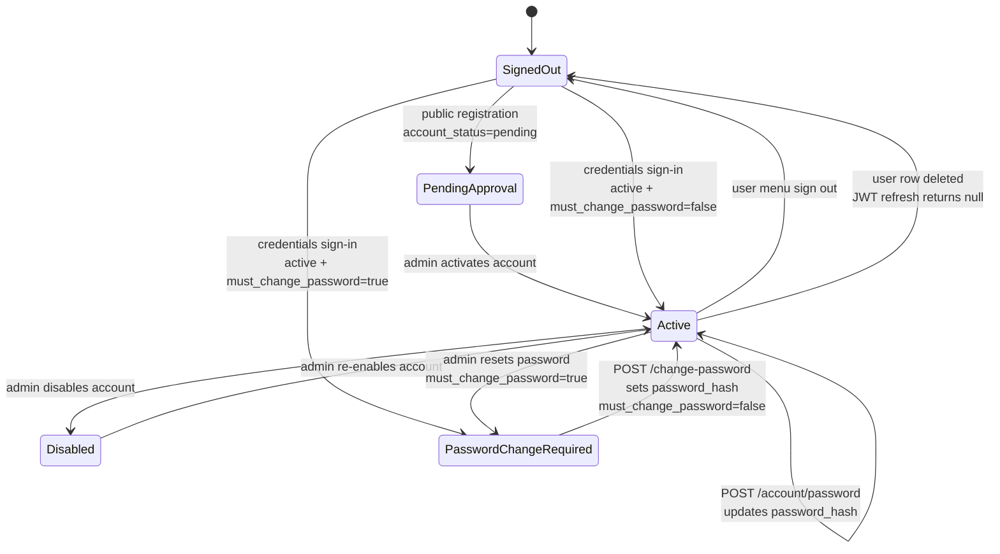
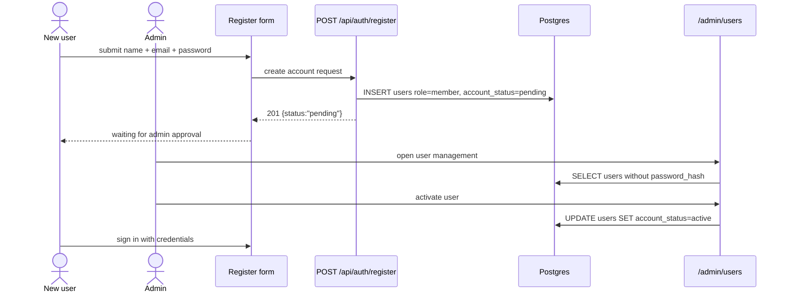
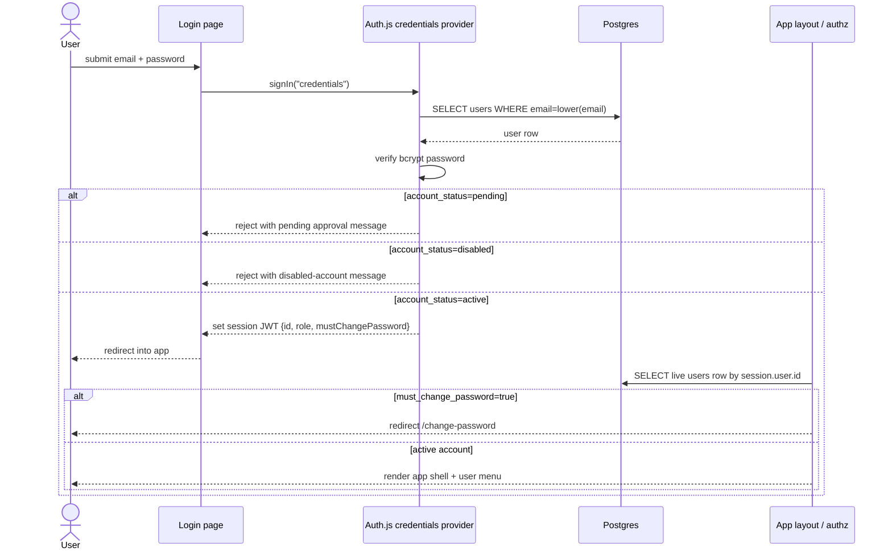
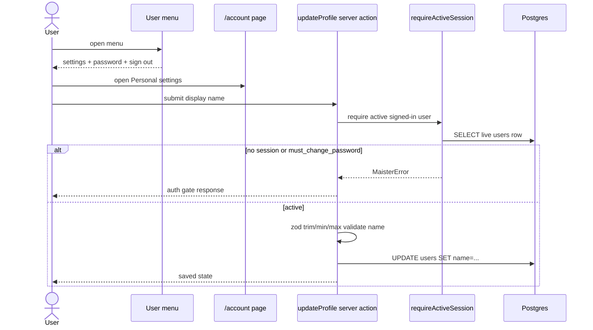
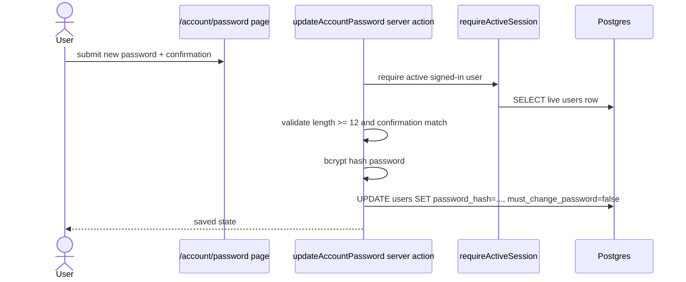
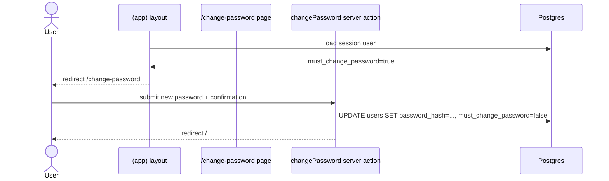
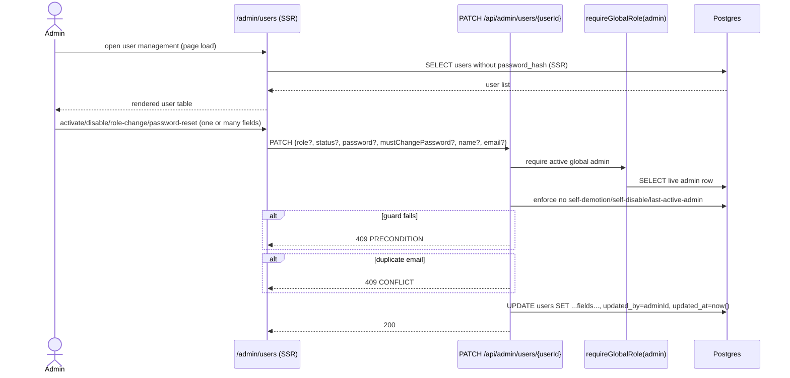
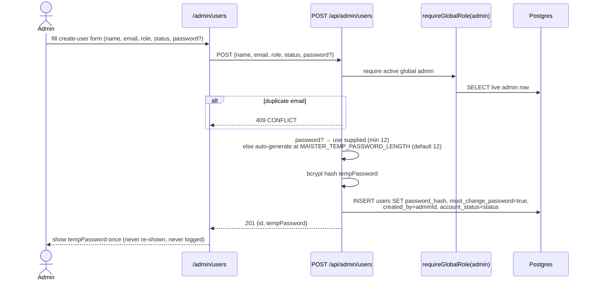
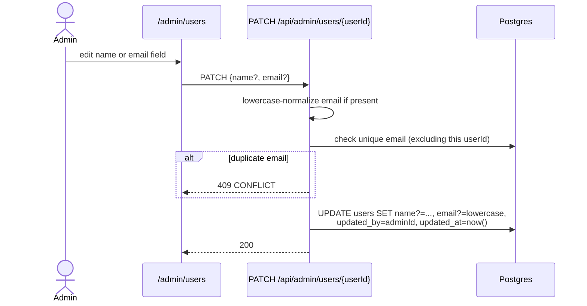
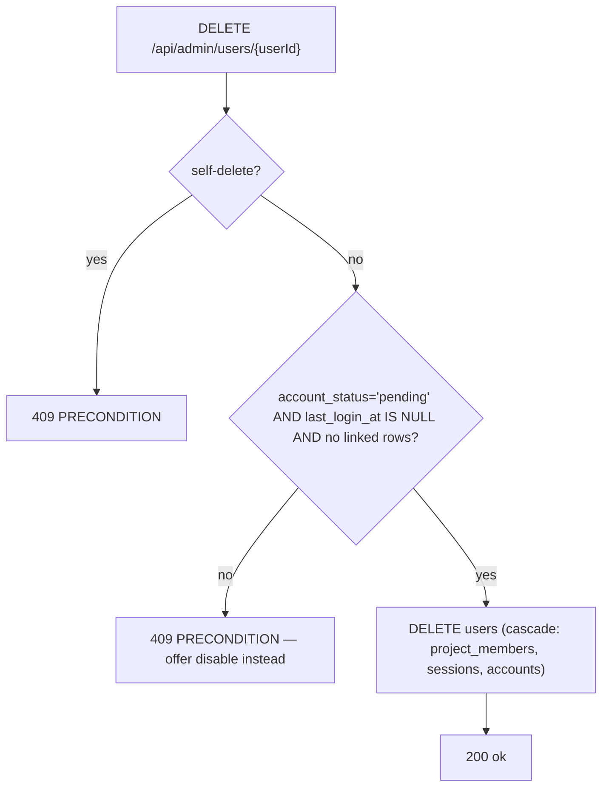

# Identity and access domain

## Purpose

The **identity and access** domain covers signed-in MAIster users, their
account settings, password lifecycle, Auth.js sessions, and role checks before
project or run actions. The domain boundary ends at project-specific
authorization decisions; per-project roster management lives in
[`project-membership.md`](project-membership.md).

Status: **Implemented (M9+)** — credentials auth, admin-approved account
activation, DB-authoritative roles/status, forced password change, the signed-in
user menu, personal settings, normal password changes, admin password reset, and
sign-out are wired in `web/`.

## Domain entities

- **User** — authenticated person persisted in `users`; owns display name,
  email, password hash, global role, `account_status`, and
  `must_change_password`.
  See [`../database-schema.md#users`](../database-schema.md#users).
- **Account status** — `users.account_status` with lifecycle
  `pending -> active -> disabled`. Only `active` can sign in or pass protected
  API gates.
- **Auth session** — Auth.js JWT-backed browser session; server code treats
  the JWT as an identity pointer and re-reads the user row before authority
  decisions.
- **Global role** — `users.role` with order `viewer < member < admin`;
  checked by `requireGlobalRole()`.
- **Project membership** — per-project role row in `project_members`;
  checked by `requireProjectRole()` and `requireProjectAction()`.
- **Account settings** — `/account` page and `updateProfile` server action;
  edits `users.name` only.
- **Password settings** — `/account/password` page and
  `updateAccountPassword` server action; updates `users.password_hash`.
- **User menu** — top-nav affordance that shows name, email, role, personal
  settings, password change, and sign-out.

## State machine

## Process flows

### Public registration and admin activation (Implemented)

### Credentials sign-in and DB-authoritative session (Implemented)

### Personal settings update (Implemented)

### Password change from account settings (Implemented)

### Forced password change (Implemented)

### Admin user management — list and edit (Implemented)

The admin user list is a **server-rendered page** (`/admin/users`); there is
no `GET /api/admin/users` JSON endpoint. Edits go through the single
aggregating `PATCH /api/admin/users/{userId}` route — one request may carry
any subset of `{role, status, password, mustChangePassword, name, email}`.

### Admin create user (Implemented)

The admin creates a user account without requiring public registration.
A temporary password is generated (or supplied), shown once in the response,
and never logged. The account is forced to change it on first login.

### Admin edit identity — name and email (Implemented)

Email is normalized to lowercase before uniqueness check and storage.

### Admin hard-delete unused account (Implemented)

Hard-delete is permitted only for accounts that have never been used:
`account_status='pending'`, `last_login_at IS NULL`, and no rows in
`runs`, `scratch_runs`, `node_attempts`, `actor_identities`,
`project_tokens`, `workspaces`, or `flow_graph_layouts`. Otherwise the
admin is offered disable.

## Expectations

- Every protected app page and route handler MUST re-read the live `users` row before rendering; JWT claims (`role`, `mustChangePassword`) MUST NOT be treated as authority.
- Role-gated server actions and route handlers MUST call `requireActiveSession()` before reading protected resources; non-active accounts are rejected with `ACCOUNT_INACTIVE`.
- Public registration MUST create `users.role = 'member'` and `users.account_status = 'pending'`; credentials sign-in MUST reject `pending` and `disabled` accounts with a specific UI message.
- Admin create (POST `/api/admin/users`) MUST set `must_change_password=true`; the temp password is returned only once in the 201 response body and MUST NEVER be logged or stored plain-text.
- `users.password_hash` MUST NEVER be returned by any API response.
- `users.email` MUST be stored lowercase; admin edit and public registration both normalize before uniqueness check and upsert.
- Admin mutations MUST NOT allow self-disable, self-demotion, or removing the last active global admin; each guard returns `PRECONDITION` (409).
- Admin hard-delete is permitted ONLY when `account_status='pending'` AND `last_login_at IS NULL` AND no rows reference the user in `runs`, `scratch_runs`, `node_attempts`, `actor_identities`, `project_tokens`, `workspaces`, or `flow_graph_layouts`; otherwise return `PRECONDITION`. `(Implemented)`
- Every admin mutation (create/edit) MUST stamp `created_by` on insert and `updated_by` + `updated_at` on update. `(Implemented)`
- A user with `users.must_change_password = true` MUST be redirected to `/change-password` by the app layout and blocked from role-gated APIs with `PASSWORD_CHANGE_REQUIRED`; the flag clears only after a valid password update.
- `/account/password` MUST update only the signed-in user's `users.password_hash`; `/account` MUST update only `users.name`.
- Deleting a user MUST invalidate authority on the next server request because `getSessionUser()` cannot resolve the live `users` row.

## Edge cases

- **No valid session** -> `MaisterError("UNAUTHENTICATED", ...)`; the UI
  redirects to `/login`. See [`../error-taxonomy.md`](../error-taxonomy.md).
- **Valid credentials but `account_status=pending`** -> sign-in is rejected
  with a pending-approval message; no session is created.
- **Valid credentials but `account_status=disabled`** -> sign-in is rejected
  with a disabled-account message; no session is created.
- **Old session after account disable** -> role-gated APIs reject with
  `ACCOUNT_INACTIVE` before project/run data is read.
- **Valid session but insufficient global or project role** ->
  `MaisterError("UNAUTHORIZED", ...)`; do not reveal protected resource details.
- **`must_change_password=true` on a role-gated action** ->
  `MaisterError("PASSWORD_CHANGE_REQUIRED", ...)`; route to `/change-password`.
- **Deleted user referenced by an old session** -> `getSessionUser()` returns
  null after the DB lookup; Auth.js JWT refresh returns null and signs the
  browser out.
- **Profile name is blank or longer than 120 chars** -> `updateProfile`
  returns the profile validation error and does not update `users.name`.
- **Password shorter than 12 chars or confirmation mismatch** -> password
  actions return a form error and do not update `users.password_hash`.
- **User changes their password from `/account/password`** -> existing sessions
  are not explicitly revoked in the current target; future session-revocation
  policy belongs in a separate security decision.
- **Duplicate email on admin create or edit** -> `MaisterError("CONFLICT", ...)`; 409. `(Implemented)`
- **Hard-delete of a user with linked rows (runs, workspaces, etc.)** -> `MaisterError("PRECONDITION", ...)`; 409; admin is offered disable instead. `(Implemented)`
- **Self-delete, self-disable, or self-demotion** -> `MaisterError("PRECONDITION", ...)`; 409. `(Implemented)`
- **Admin removes last active global admin** -> `MaisterError("PRECONDITION", ...)`; 409. `(Implemented)`

## Linked artifacts

- DB schema: [`../database-schema.md#users`](../database-schema.md#users),
  [`../database-schema.md#sessions`](../database-schema.md#sessions),
  [`../database-schema.md#project_members`](../database-schema.md#project_members).
- Project membership management: [`project-membership.md`](project-membership.md).
- API: [`../api/web.openapi.yaml`](../api/web.openapi.yaml) §Auth.js routes
  and authentication notes.
- Error taxonomy: [`../error-taxonomy.md`](../error-taxonomy.md)
  (`UNAUTHENTICATED`, `UNAUTHORIZED`, `PASSWORD_CHANGE_REQUIRED`,
  `ACCOUNT_INACTIVE`).
- Source: `web/auth.ts`, `web/auth.config.ts`, `web/lib/authz.ts`,
  `web/lib/users.ts`, `web/app/api/admin/users/route.ts`,
  `web/app/(app)/layout.tsx`, `web/components/chrome/user-menu.tsx`,
  `web/app/(app)/account/actions.ts`,
  `web/app/change-password/actions.ts`.
