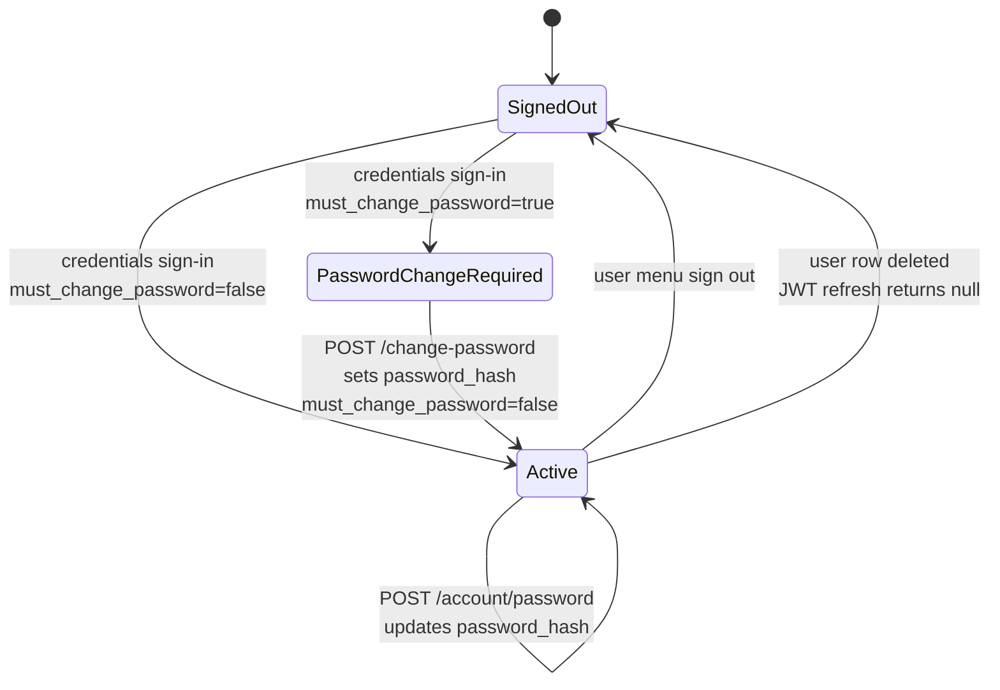
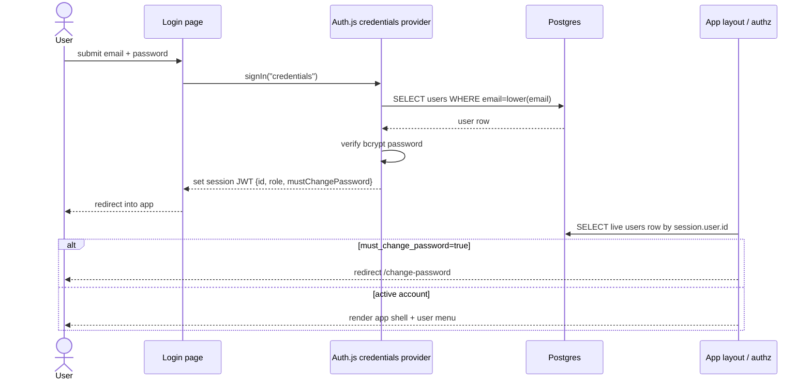
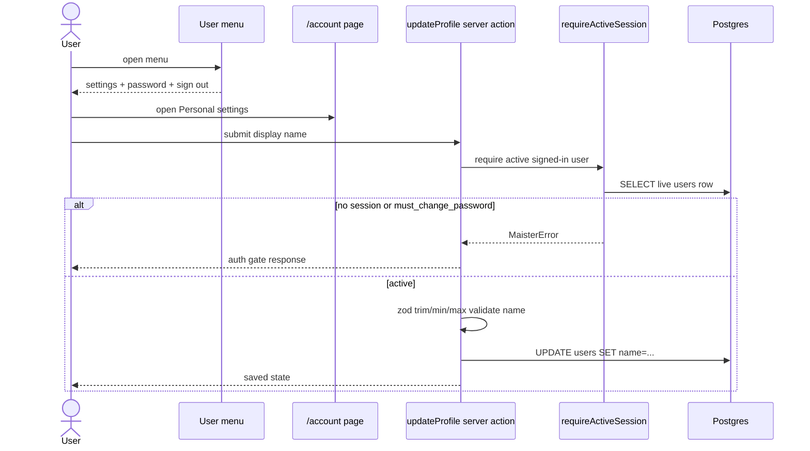
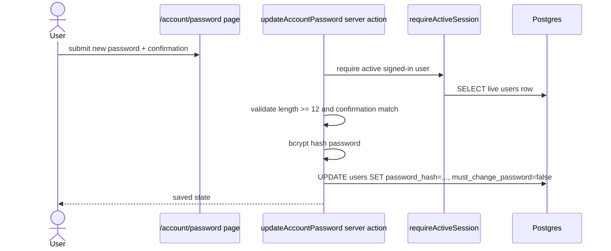
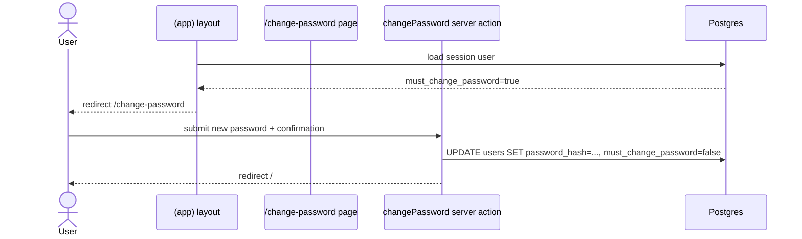

# Identity and access domain

## Purpose

The **identity and access** domain covers signed-in MAIster users, their
account settings, password lifecycle, Auth.js sessions, and role checks before
project or run actions. The domain boundary ends at project-specific
authorization decisions; project membership semantics live in
[`projects.md`](projects.md) and the DB schema.

Status: **Implemented (M9+)** — credentials auth, DB-authoritative roles,
forced password change, the signed-in user menu, personal settings, normal
password changes, and sign-out are wired in `web/`.

## Domain entities

- **User** — authenticated person persisted in `users`; owns display name,
  email, password hash, global role, and `must_change_password`.
  See [`../database-schema.md#users`](../database-schema.md#users).
- **Auth session** — Auth.js JWT-backed browser session; server code treats
  the JWT as an identity pointer and re-reads the user row before authority
  decisions.
- **Global role** — `users.role` with order `viewer < member < admin`;
  checked by `requireGlobalRole()`.
- **Project membership** — per-project role row in `project_members`;
  checked by `requireProjectRole()` and `requireProjectAction()`.
- **Account settings** — `/account` page and `updateProfile` server action;
  edits `users.name` only.
- **Password settings** — `/account/password` page and
  `updateAccountPassword` server action; updates `users.password_hash`.
- **User menu** — top-nav affordance that shows name, email, role, personal
  settings, password change, and sign-out.

## State machine

## Process flows

### Credentials sign-in and DB-authoritative session (Implemented)

### Personal settings update (Implemented)

### Password change from account settings (Implemented)

### Forced password change (Implemented)

## Expectations

- Every protected app page MUST load the live `users` row before rendering
  user-specific content.
- Role-gated server actions and Route Handlers MUST call
  `requireActiveSession()` through the authz helpers before reading protected
  project or run resources.
- JWT `role` and `mustChangePassword` claims MUST NOT be treated as authority;
  server authz MUST re-read `users.role` and `users.must_change_password`.
- Public registration MUST create `users.role = 'member'`; only the bootstrap
  migration or an existing admin path may create a global admin.
- A user with `users.must_change_password = true` MUST be redirected to
  `/change-password` by the app layout and blocked from role-gated APIs with
  `PASSWORD_CHANGE_REQUIRED`.
- `/change-password` MUST clear `users.must_change_password` only after a
  valid password update.
- `/account/password` MUST require an active session and update only the
  signed-in user's `users.password_hash`.
- `/account` MUST require an active session and update only the signed-in
  user's `users.name`.
- The signed-in user menu MUST expose personal settings, password change, and
  sign-out without sending secrets or role-changing controls to the browser.
- Deleting a user MUST invalidate authority on the next server request because
  `getSessionUser()` cannot resolve the live `users` row.

## Edge cases

- **No valid session** -> `MaisterError("UNAUTHENTICATED", ...)`; the UI
  redirects to `/login`. See [`../error-taxonomy.md`](../error-taxonomy.md).
- **Valid session but insufficient global or project role** ->
  `MaisterError("UNAUTHORIZED", ...)`; do not reveal protected resource
  details.
- **`must_change_password=true` on a role-gated action** ->
  `MaisterError("PASSWORD_CHANGE_REQUIRED", ...)`; route to
  `/change-password`.
- **Deleted user referenced by an old session** -> `getSessionUser()` returns
  null after the DB lookup; Auth.js JWT refresh returns null and signs the
  browser out.
- **Profile name is blank or longer than 120 chars** -> `updateProfile`
  returns the profile validation error and does not update `users.name`.
- **Password shorter than 12 chars or confirmation mismatch** -> password
  actions return a form error and do not update `users.password_hash`.
- **User changes their password from `/account/password`** -> existing sessions
  are not explicitly revoked in the current target; future session-revocation
  policy belongs in a separate security decision.

## Linked artifacts

- DB schema: [`../database-schema.md#users`](../database-schema.md#users),
  [`../database-schema.md#sessions`](../database-schema.md#sessions),
  [`../database-schema.md#project_members`](../database-schema.md#project_members).
- API: [`../api/web.openapi.yaml`](../api/web.openapi.yaml) §Auth.js routes
  and authentication notes.
- Error taxonomy: [`../error-taxonomy.md`](../error-taxonomy.md)
  (`UNAUTHENTICATED`, `UNAUTHORIZED`, `PASSWORD_CHANGE_REQUIRED`).
- Source: `web/auth.ts`, `web/auth.config.ts`, `web/lib/authz.ts`,
  `web/app/(app)/layout.tsx`, `web/components/chrome/user-menu.tsx`,
  `web/app/(app)/account/actions.ts`,
  `web/app/change-password/actions.ts`.
