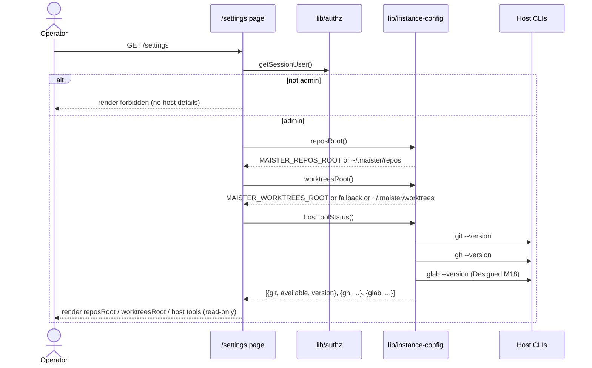

# Instance configuration domain

## Purpose

Instance configuration is the host-level, read-only settings surface of a
single MAIster deployment: where cloned repos live, where worktrees live,
and which host CLI tools are present. It is resolved from environment
variables (with `os.homedir()` defaults) and surfaced on an admin-gated
`/settings` page. The domain boundary covers exposing these values for
inspection — it does NOT own project rows, secrets, or any write path.
See [ADR-025](../decisions.md#adr-025-project-repo-onboarding--url-clone-or-local-path-host-credential-auth-configurable-roots).

## Domain entities

- **`repo_home`** — the directory new clones land in
  (`MAISTER_REPOS_ROOT`, default `~/.maister/repos`). Resolved by
  `reposRoot()`.
- **`worktrees_root`** — the directory run worktrees live in
  (`MAISTER_WORKTREES_ROOT`, default `~/.maister/worktrees`). The
  deprecated `MAISTER_WORKTREE_ROOT` is accepted as a fallback. Resolved
  by `worktreesRoot()`.
- **Host-tool status** — presence + version of host CLIs `git`, `gh`, and
  (Designed, M18) `glab`, probed by `hostToolStatus()` → `HostTool[]`. `git` is
  required by the git-ops layer.
- **PR-mode host prerequisites (Designed, M18)** — credential **model B** (host
  credentials + provider tooling on the host, no in-platform secret storage).
  `gh`/`glab` are **required-for-PR-mode**, per provider: a `github` project's
  `pull_request` promotion needs `gh` on PATH, a `gitlab` project needs `glab`;
  a `gitea`/`gitverse` project needs the host-env Gitea-API token
  (`GITEA_TOKEN`/`GITVERSE_TOKEN`) instead of a CLI. They stay **informational
  for `local_merge`** and for projects that never promote via PR. Absence
  surfaces only when a matching run promotes via `pull_request` (then
  `PRECONDITION`). See [ADR-049](../decisions.md#adr-049-pr-promotion-via-a-hybrid-provider-pradapter-credential-model-b-reverses-the-gh-is-never-invoked-invariant)
  and [`git-integration.md`](git-integration.md).

None of these are persisted in the database — they are env-derived at
request time. The Gitea-API token is a host-env value read server-side only,
never stored or rendered. The canonical env-var reference lives in
[`../configuration.md`](../configuration.md).

## State machine

N/A — instance configuration is read-only, env-derived state. There is no
lifecycle to model: values are computed on each `/settings` render and never
transition. Editable roots are `(Phase 2)`.

## Process flows

### Render the read-only settings page (Implemented)

The `/settings` page resolves the roots and host-tool status only for an
admin caller, then renders them. Non-admins get a forbidden message and no
host details.

Status: **Implemented** — `web/lib/instance-config.ts` +
`web/app/(app)/settings/page.tsx`.

## Expectations

- Instance config has NO DB table and NO write API; values are derived
  from environment variables on each read (Phase 2 adds editable roots).
- `reposRoot()` returns `MAISTER_REPOS_ROOT` when set, else
  `os.homedir()/.maister/repos`.
- `worktreesRoot()` returns `MAISTER_WORKTREES_ROOT`, else the deprecated
  `MAISTER_WORKTREE_ROOT`, else `os.homedir()/.maister/worktrees`.
- The `/settings` page renders host-tool and root details only for an
  `admin`; every other caller gets the forbidden branch with no host
  details.
- `hostToolStatus()` reports `git`, `gh`, and (Designed, M18) `glab` presence +
  version; a probe failure degrades to `{ available: false, version: null }` and
  never throws.
- `gh`/`glab` are informational for `local_merge` and for any run that never
  promotes via PR — their absence MUST NOT block launch, `local_merge`
  promotion, or any non-PR flow.
- **(Designed, M18)** `gh`/`glab` become **required-for-PR-mode** per provider:
  a `pull_request` promotion of a `github` run REQUIRES `gh` on PATH, a `gitlab`
  run REQUIRES `glab`, and a `gitea`/`gitverse` run REQUIRES the host-env
  `GITEA_TOKEN`/`GITVERSE_TOKEN`; a missing prerequisite refuses that promotion
  with `PRECONDITION` (run stays `Review`) — it never blocks anything else.
- No instance-config value is a secret; none is logged, streamed, or sent
  to a non-admin client. **(Designed, M18)** `GITEA_TOKEN`/`GITVERSE_TOKEN` are
  read server-side only and MUST NEVER be rendered on `/settings`, logged, or
  streamed.

## Edge cases

- **`git` missing on host** → `hostToolStatus()` reports `git` unavailable;
  any actual git operation fails downstream with `PRECONDITION`
  (`assertGitAvailable`, see [`git-integration.md`](git-integration.md)).
- **`gh`/`glab` absent** → reported as unavailable in Settings; no impact on
  launch or `local_merge`. **(Designed, M18)** impact ONLY when a matching
  `github`/`gitlab` run promotes via `pull_request` — that promotion is refused
  `PRECONDITION` (run stays `Review`); the same holds for an unset
  `GITEA_TOKEN`/`GITVERSE_TOKEN` on a `gitea`/`gitverse` run.
- **Non-admin opens `/settings`** → forbidden branch; roots and host-tool
  status are not resolved or rendered.

## Linked artifacts

- ADRs: [ADR-025 Project repo onboarding](../decisions.md#adr-025-project-repo-onboarding--url-clone-or-local-path-host-credential-auth-configurable-roots),
  [ADR-049 PR promotion via a hybrid provider `PrAdapter`](../decisions.md#adr-049-pr-promotion-via-a-hybrid-provider-pradapter-credential-model-b-reverses-the-gh-is-never-invoked-invariant)
  (Designed, M18 — gh/glab + Gitea-API token become required-for-PR).
- Config reference: [`../configuration.md`](../configuration.md) §Environment
  variables.
- Related domains: [`projects.md`](projects.md),
  [`git-integration.md`](git-integration.md) (provider PR dispatch).
- Source: `web/lib/instance-config.ts`,
  `web/app/(app)/settings/page.tsx`.
