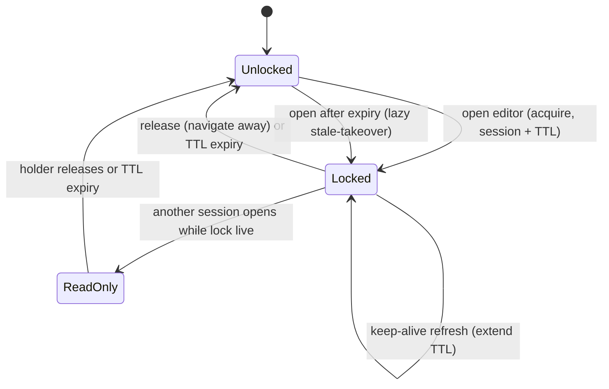
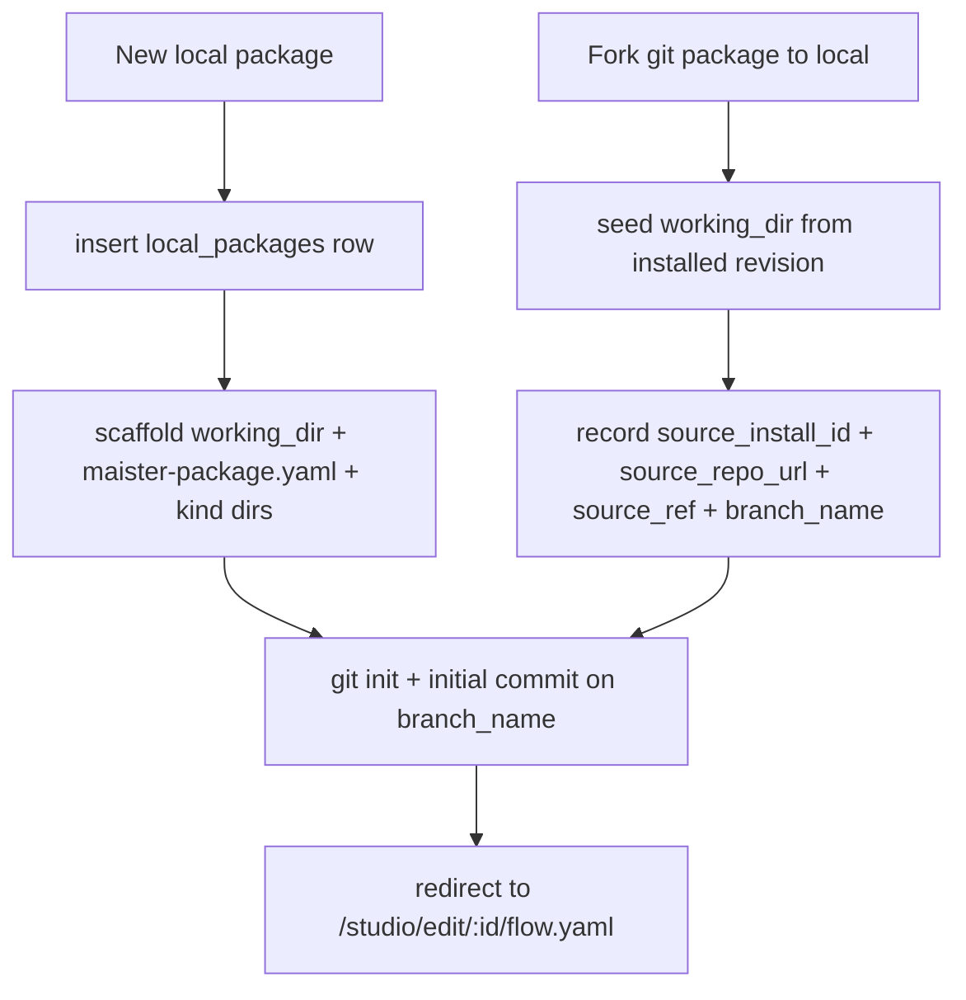
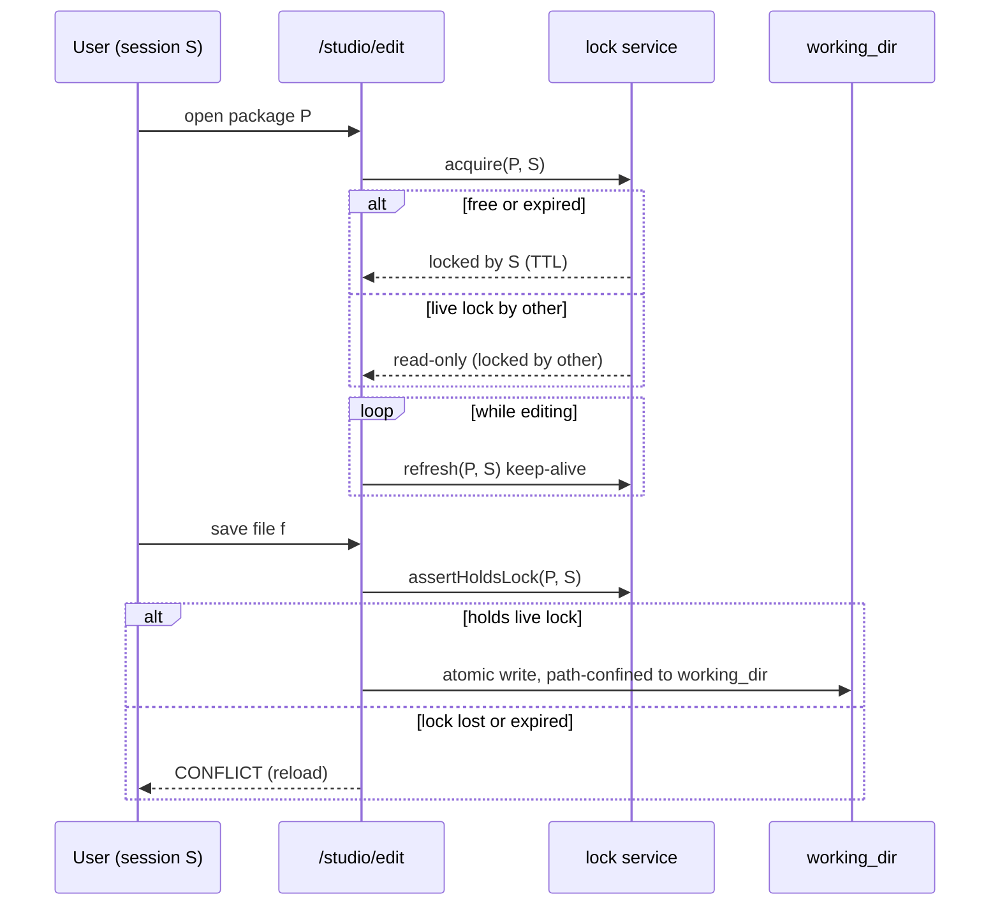
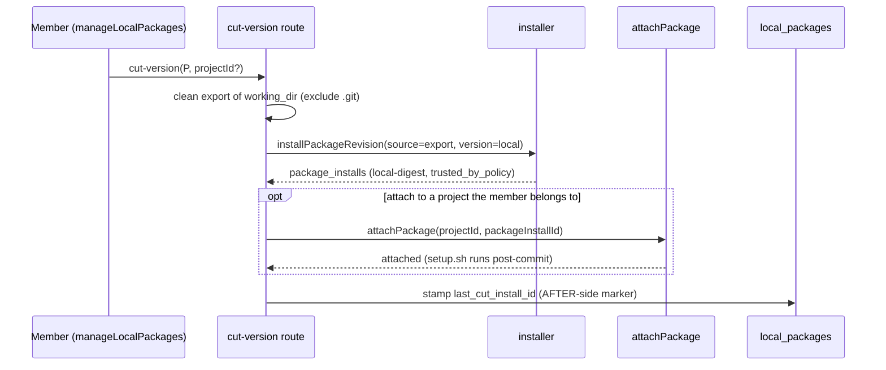

# Local packages (Flow Studio Phase C)

> Behavior SSOT for **editable local packages** — a platform-scoped, git-backed
> working directory a member authors/forks artifacts in, edits in Flow Studio
> under a session lock, and **cuts versions** from into the existing
> package-install substrate. **Status: Designed (ADR-095).** Surface:
> [`../screens/studio/README.md`](../screens/studio/README.md) §Local workspace +
> [`../screens/studio/editor.md`](../screens/studio/editor.md). Data:
> [`../db/projects-domain.md`](../db/projects-domain.md).

## Purpose

A **local package** is a platform-scoped working copy of a package: a mutable,
git-backed directory on the host that a member authors artifacts in (flows,
agents, skills, MCP templates, rules, schemas) or forks from an installed git
package, edits in Flow Studio, and **cuts immutable versions** from. A "cut"
reuses the *existing* installer (`installPackageRevision({ version: "local" })`)
to produce a `local-<digest>` `package_installs` revision that a project member
then attaches — so local packages plug into the same install → attach → run
pipeline as git packages (Variant B), without re-scoping the project-keyed
`authored_capabilities` drafts table.

Boundary: this domain owns the `local_packages` table, its working directory,
the session edit-lock, and the cut/move operations. It does NOT own the
install/attach/trust machinery (that is [`packages.md`](packages.md), reused) nor
git write-back to an upstream source (a PR from the fork branch — **Phase 2**).

## Domain entities

- **`local_packages`** (persisted — [`../db/projects-domain.md`](../db/projects-domain.md)):
  one row per local package, pointing at a `working_dir`. Carries fork lineage
  (`source_install_id`, `source_repo_url`, `source_ref`, `branch_name`), the most
  recent cut (`last_cut_install_id`), and the session lock (`locked_by_user_id`,
  `locked_by_session`, `lock_expires_at`).
- **Working directory** (`working_dir`, server-only): a git-backed dir under
  `localPackagesRoot()` holding `maister-package.yaml` + the kind dirs
  (`flows/ agents/ skills/ mcps/ rules/ schemas/`). Edited in place by the Studio
  file/graph editors.
- **Cut version**: an immutable `local-<digest>` `package_installs` row produced
  by the installer over a clean export of `working_dir`. A reused entity
  ([`packages.md`](packages.md)).
- **Session edit-lock**: a `(locked_by_session, lock_expires_at)` claim on a
  `local_packages` row; mirrors the `runs.keepalive_until` TTL pattern.
- **Reused**: `package_installs`, `project_package_attachments`, the installer,
  `resolveTrust`, the Phase B `FlowEditorTabs` seam, `lib/worktree.ts` git
  primitives, and the platform MCP catalog (`platform_mcp_servers`,
  [`mcp-management.md`](mcp-management.md)) the MCP-template editor sources from.

## State machine

Package lifecycle:

Per-package session edit-lock:

## Process flows

Create from scratch, or fork an installed git package:

Edit + save under the lock:

Cut a version and (optionally) attach to a project:

## Expectations

- A `local_packages` row MUST have a UNIQUE `slug`; its `working_dir` MUST
  resolve under `localPackagesRoot()` and MUST NEVER appear in any client
  response.
- Every file read/write/delete/move MUST resolve the artifact path within the
  row's `working_dir` (realpath containment; reject `..`, absolute paths,
  symlink escape, and any `.git/` path) → `MaisterError("PRECONDITION")` on
  violation, before any write.
- A write MUST be rejected with `MaisterError("CONFLICT")` unless the caller's
  session holds a live (non-expired) lock on the package.
- A lock MUST be acquirable only when the package is unlocked OR
  `lock_expires_at < now` (lazy stale-takeover); a live lock held by another
  session MUST yield a read-only editor and MUST NOT be stolen.
- Authoring (create/fork/edit/cut) MUST require only `requireSession`;
  **attaching** a cut version to a project MUST require project `member`
  (`manageLocalPackages`). Git-package install/attach/trust MUST stay
  admin-gated (unchanged).
- "Cut version" MUST install from a clean export of `working_dir` (no `.git`/VCS
  metadata) via the existing `installPackageRevision({ version: "local" })`,
  producing a `local-<digest>` `package_installs` revision; it MUST NOT introduce
  a second install path.
- A cut MUST stamp `last_cut_install_id` only AFTER the install (and any attach)
  succeeds — the stamp is the durable "cut succeeded" marker, never written
  before the side-effect.
- Local working-dir sources MUST resolve to `trusted_by_policy`; `setup.sh` MUST
  NOT run during install and MUST run only post-attach (ADR-021).
- Deleting a `local_packages` row MUST remove its `working_dir`; orphaned dirs
  and abandoned `Installing` installs are NOT auto-GC'd (manual cleanup, owner
  decision).
- Phase C MUST NOT extend the authored kind enum (`rule|skill|flow`) and MUST NOT
  add a new `MaisterError` code (ADR-008 closed union).
- (Phase 2) PR-to-source is NOT implemented; `source_repo_url`/`source_ref`/
  `branch_name` are stored only to enable it later.

## Edge cases

- Path traversal / symlink escape / `.git/` write → `MaisterError("PRECONDITION")`
  (the confinement guard); no file is written.
- Concurrent edit: a second session opening a locked package gets a read-only
  editor; a save after the lock expired or was taken over →
  `MaisterError("CONFLICT")` ("reload").
- Invalid or missing working dir (manual deletion, bad scaffold) →
  `MaisterError("CONFIG")`.
- Cut-version crash windows (ADR-095): death during install → row stuck
  `Installing`, the next cut re-drives idempotently; death after `Installed`
  before attach → re-attach is safe (install reused); death before the
  `last_cut_install_id` stamp → a re-cut re-stamps. No partial state is
  load-bearing.
- Fork seed of a private git source may need host git credentials; a clone
  failure surfaces as `FLOW_INSTALL` (reused). The exact fork mechanism
  (clone-source+worktree vs copy-installed+`git init`) is finalized in
  implementation.
- The lock holder's session dies → the lock simply expires at `lock_expires_at`;
  the next opener takes over lazily (no sweeper).

## Linked artifacts

- **ADRs:** ADR-095 (this domain), ADR-092 (unified Studio + editable-local-package
  direction), ADR-088 (package management), ADR-021 (fetch-then-execute trust
  separation) — see [`../decisions.md`](../decisions.md).
- **ERD:** [`../db/projects-domain.md`](../db/projects-domain.md),
  [`../database-schema.md`](../database-schema.md).
- **API:** [`../api/web.openapi.yaml`](../api/web.openapi.yaml)
  (`/api/studio/local-packages*`).
- **Reused behavior:** [`packages.md`](packages.md) (install/attach/trust),
  [`flow-studio.md`](flow-studio.md) (editor seam, fork),
  [`mcp-management.md`](mcp-management.md) (the MCP catalog the template editor
  sources from).
- **Source (Phase C):** `web/lib/local-packages/*`,
  `web/app/api/studio/local-packages/*`, `web/app/(app)/studio/local/`,
  `web/app/(app)/studio/edit/[id]/`.
