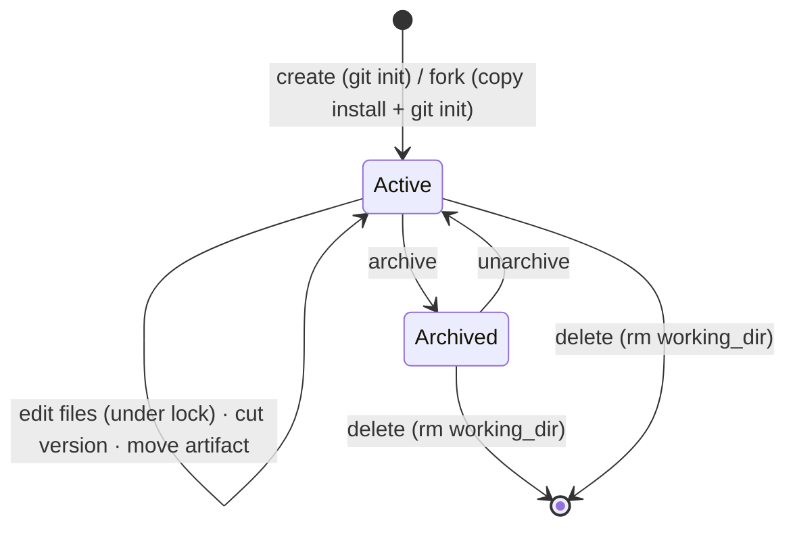
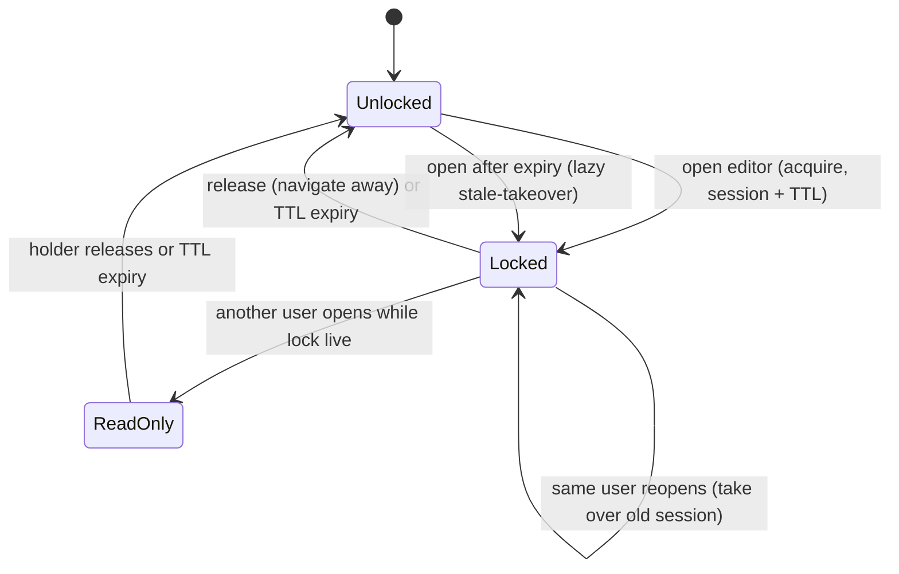
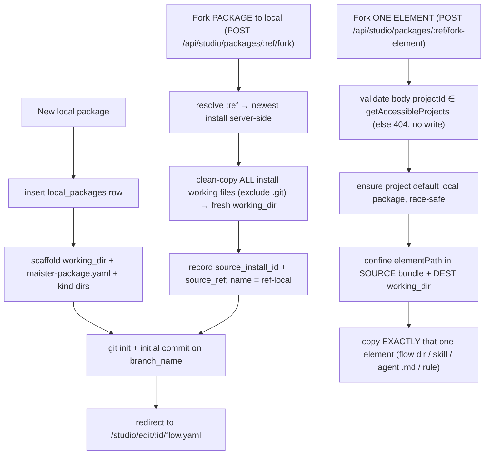
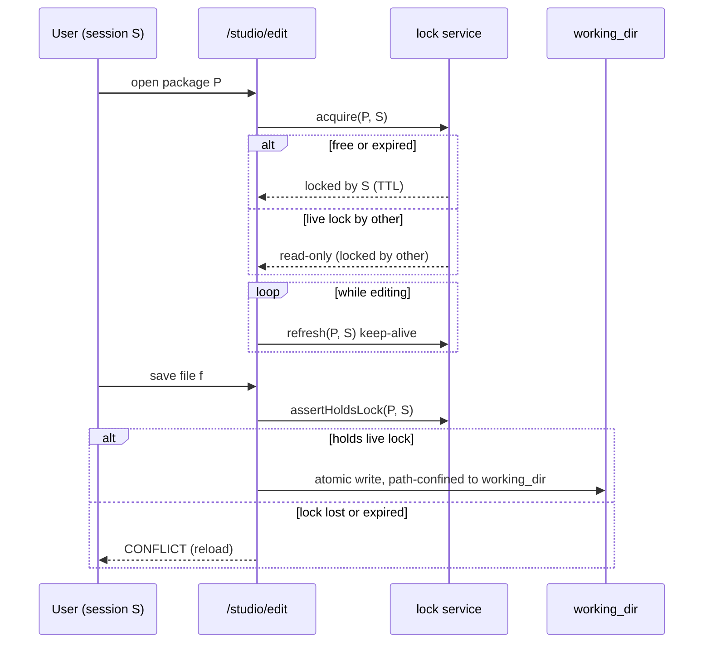
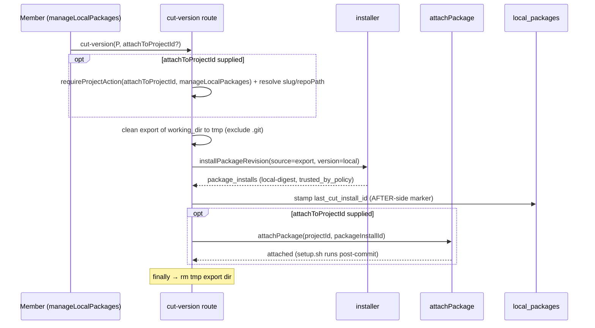
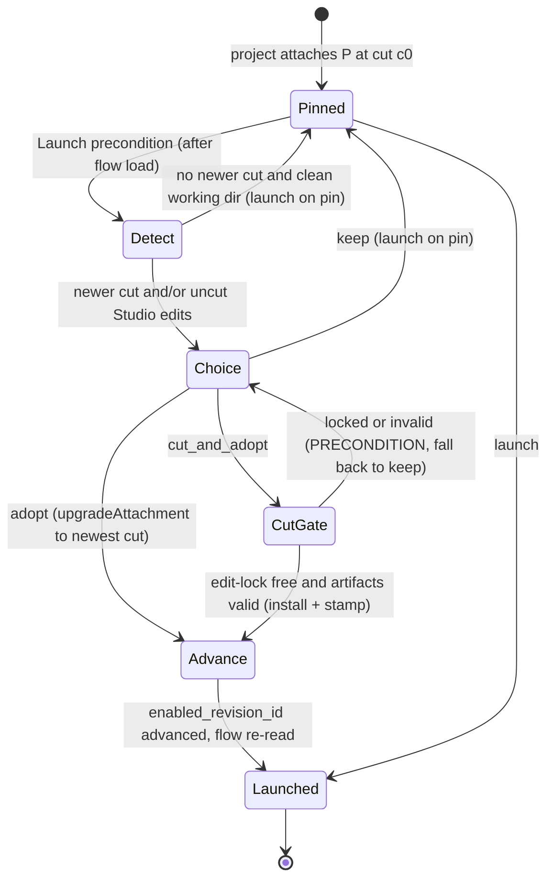
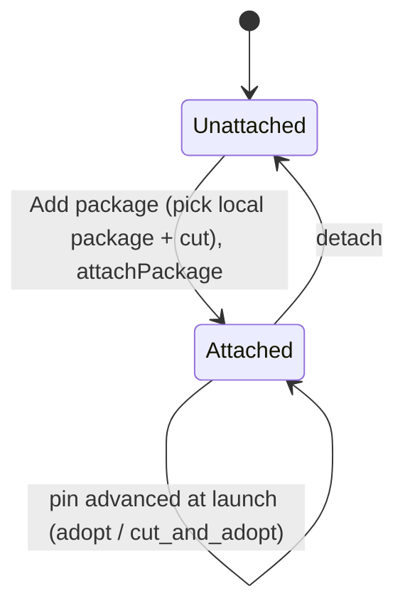
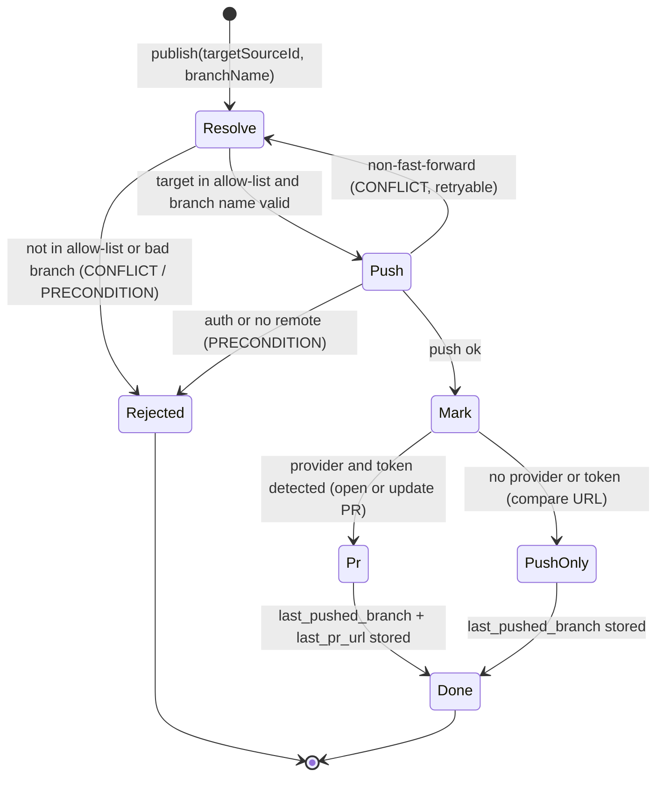

# Local packages (Flow Studio Phase C)

> Behavior SSOT for **editable local packages** — a platform-scoped, git-backed
> working directory a member authors/forks artifacts in, edits in Flow Studio
> under a session lock, and **cuts versions** from into the existing
> package-install substrate. **Status: Implemented (ADR-096 base; ADR-105 Stream A; ADR-107/110 Stream B — version-adopt launch + PR-to-source, migration 0074).** Surface:
> [`../screens/studio/README.md`](../screens/studio/README.md) §Local workspace +
> [`../screens/studio/editor.md`](../screens/studio/editor.md). Data:
> [`../db/projects-domain.md`](../db/projects-domain.md).

## Purpose

A **local package** is a platform-scoped working copy of a package: a mutable,
git-backed directory on the host that a member authors artifacts in (flows,
agents, skills, MCP templates, rules, schemas) or forks from an installed git
package, edits in Flow Studio, and **cuts immutable versions** from. A "cut"
reuses the *existing* installer (`installPackageRevision({ version: "local" })`)
to produce a `local-<digest>` `package_installs` revision that a project member
then attaches — so local packages plug into the same install → attach → run
pipeline as git packages (Variant B), without re-scoping the project-keyed
`authored_capabilities` drafts table.

Boundary: this domain owns the `local_packages` table, its working directory,
the session edit-lock, and the cut/move operations. It does NOT own the
install/attach/trust machinery (that is [`packages.md`](packages.md), reused) nor
git write-back to an upstream source (a PR from the fork branch — **Phase 2**).

## Domain entities

- **`local_packages`** (persisted — [`../db/projects-domain.md`](../db/projects-domain.md)):
  one row per local package, pointing at a `working_dir`. Carries fork lineage
  (`source_install_id`, `source_repo_url`, `source_ref`, `branch_name`), the most
  recent cut (`last_cut_install_id`), and the session lock (`locked_by_user_id`,
  `locked_by_session`, `lock_expires_at`).
- **Per-project default ("virtual") local package** (M36, ADR-096): a
  `local_packages` row with `is_default = true` and a non-NULL `project_id`. It
  is the landing spot for **element-level forks** — a member who forks one flow /
  skill / agent / rule out of an installed package does not name a package; the
  element drops into their project's single default, created on first use. The
  partial-unique index `local_packages_default_per_project`
  (`(project_id) WHERE is_default`) enforces at most one default per project; the
  FK is `ON DELETE CASCADE` (a deleted project drops its default). Named,
  platform-scoped local packages keep `project_id = NULL`, `is_default = false`.
- **Working directory** (`working_dir`, server-only): a git-backed dir under
  `localPackagesRoot()` holding `maister-package.yaml` + the kind dirs
  (`flows/ agents/ skills/ mcps/ rules/ schemas/`). Edited in place by the Studio
  file/graph editors.
- **Cut version**: an immutable `local-<digest>` `package_installs` row produced
  by the installer over a clean export of `working_dir`. A reused entity
  ([`packages.md`](packages.md)).
- **Session edit-lock**: a `(locked_by_session, lock_expires_at)` claim on a
  `local_packages` row; mirrors the `runs.keepalive_until` TTL pattern.
- **Reused**: `package_installs`, `project_package_attachments`, the installer,
  `resolveTrust`, the Phase B `FlowEditorTabs` seam, `lib/worktree.ts` git
  primitives, and the platform MCP catalog (`platform_mcp_servers`,
  [`mcp-management.md`](mcp-management.md)) the MCP-template editor sources from.

## State machine

Package lifecycle:

Per-package session edit-lock:

## Process flows

Create from scratch, or fork an installed package (two grains, M36):

**Fork mechanism (finalized, M36):** a fork **copies the installed revision's
on-disk content** (`package_installs.installedPath`, server-only) excluding any
`.git`/VCS dir, then `git init`s the destination fresh — it does NOT re-clone the
upstream source or reuse its history (a clone-source variant was rejected: the
install bytes are already content-addressed and present, so a copy is
deterministic and credential-free). A package fork copies the whole bundle into
a NEW `<ref>-local` package; an element fork copies exactly one confined element
into the project's default. **Neither executes anything** — no `setup.sh`, no MCP
spawn. A missing/unreadable source bundle → `CONFIG`, nothing persisted.

**Element-fork project selection:** the element fork is the only fork that names
a project, because its destination is that project's default package. The
`projectId` is body-controlled, so it is validated against the caller's
`getAccessibleProjects(userId, role)` set (admin → all non-archived; member →
their memberships) — an unknown or inaccessible project is a 404 with no write,
and the default is never created. The package fork takes no project (its output
is platform-scoped and named).

**Default-package race ("create on first use"):** the first element fork for a
project has no default yet. The ensure step scaffolds + `git init`s a working
dir, then `insert(...).onConflictDoNothing()` on the partial-unique
`(project_id) WHERE is_default`; a concurrent racer that lost re-selects the
winner's row and `rm`s its own orphan scaffold — never a read-then-write SELECT
(no TOCTOU).

Edit + save under the lock:

Cut a version and (optionally) attach to a project:

The attach gate (`manageLocalPackages` on `attachToProjectId`) is evaluated
**before** the irreversible export+install, so an inaccessible attach target
never leaves a cut install behind. The tmp export dir is removed in a `finally`.

**Batch import (M36).** `POST /api/studio/local-packages/:id/import`
(`multipart/form-data`) accepts a **folder** (files with relative paths) or one
**zip / tar.gz** archive. `mode=preview` returns the resolved tree without
writing (no lock); `mode=commit` asserts the session edit-lock, then writes.
Safety is **validate-all-then-write**: every entry is confined — `..` rejected
on the **original** segments (POSIX `../` + Windows `..\`, plus absolute /
drive-letter / NUL) BEFORE normalization, then `resolveWithinWorkingDir`
(`.git`/symlink/abs) — and the caps
(`MAISTER_IMPORT_MAX_{BYTES,ENTRIES,FILE_BYTES}`, defaults 50 MiB / 2000 /
10 MiB) are enforced; the archive blob is capped BEFORE parsing (zip-bomb
defense). A single violation rejects the whole import pre-write, so the working
dir is left UNCHANGED. Only regular files are written — tar dirs/symlinks/devices
are skipped at the source, closing the tar-symlink escape vector.

**Git-backed diff + Commit/Discard (M36).** The working dir is a git repo, so
every edit (form / YAML / import / AI) is a working-tree change. `GET
/api/studio/local-packages/:id/diff` returns the uncommitted
working-tree-vs-`HEAD` diff (2-dot, incl. untracked) as a `@git-diff-view` DTO +
a changed-count (a `truncated` flag degrades an oversized diff to summary-only —
never silently). `POST .../commit` (lock-guarded; `git add -A` + `git commit`,
optional message) clears the count; `POST .../discard` (lock-guarded; body
`paths[]` confined BEFORE git, omitted → all) restores to `HEAD`. All three work
with NO AI session present.

## M39 Stream A — first-class authoring (Implemented, ADR-105 — create wizards deferred)

Stream A is **web-only** (no migration, no new `MaisterError` code) and finishes
the in-app authoring surface M36 started.

**Centralized model + per-project version pins.** Packages stay **instance-level**
and Studio-edited (M36 platform-scoping, ADR-096/097, stands — project-scoping was
evaluated and rejected: it fights reuse). A project consumes a package at a **cut
version** (a pin), never a live edit; editing in Studio produces new cuts, and at
launch a project adopts a newer cut or keeps its pin (the adopt path is **Stream
B**, [`../decisions.md`](../decisions.md) ADR-107). Cross-project divergence is
rare + explicit — see "Customize for this project" below — so conflicts never
arise in the default flow.

**Package manifest form (`manifest` kind).** `maister-package.yaml` becomes a
first-class authored kind with a `PackageManifestForm` (name/description/version +
the kind lists) plus a raw-YAML toggle; a strict parse failure → `CONFIG`. Adding
`manifest` to `AuthoredFlowPackageFileKind` is an **8-site union fan-out** (label
map, en/ru `flows.packageFileKind`, content-editor dispatch, code-editor kind +
language, `SUPPORTED_FILE_KINDS`, the path classifier, `artifact-validate`). The
editor lands on a **package-home** overview (manifest form + file tree) when no
flow file is selected — not the empty flow canvas — which removes the spurious
"YAML is invalid" banner and the rework-empty symptom, with a real **End edit**
(release lock + navigate) and a correct initial `heldByMe`.

**Fork dedup + "Customize for this project."** `forkPackageToLocal` checks for an
existing fork by `source_install_id` before INSERTing: an existing fork returns
`{ localPackageId, alreadyExists: true }` (HTTP **200**) and the UI navigates to it
(+ an explicit "Fork a new copy"); a fresh fork is **201**. **"Customize"** is the
same whole-package fork forced fresh (`forceNew`) with an origin-reflecting name
`<ref> (custom)` — a name convention, **no schema field**, and **no project
target** (owner reframe: packages are centralized, edited in one place). The
project-side attach of a copy is Stream B.

**List management.** The local-packages list gains Delete (confirm; also `rm`s the
working dir), Rename, Archive/unarchive (archived hidden behind a toggle), Open,
and Cut-version — all over routes that already exist; the `LocalPackageListItem`
DTO is extended to carry the needed state.

**Commit is the validation gate.** A prominent top-bar **"Commit state"** action +
dirty indicator; **every** commit entry point (the diff-drawer Commit and
Commit-state) routes through `validatePackageArtifacts` (NEW
`web/lib/local-packages/validate.ts`), which validates the **changed** artifacts in
the commit — already-committed artifacts are assumed valid — covering flow.yaml
parse+compile, manifest parse, platform-agent strict frontmatter, subagent lenient
frontmatter, and skill `SKILL.md` presence, and **hard-blocks** the commit on any
invalid artifact (`PRECONDITION`/`CONFIG`) with an error list. Because a launch
needs a committed state, an invalid artifact is inherently un-launchable; WIP lives
in the uncommitted, lock-preserved working dir. A shared `ChangeReviewDialog` (diff
+ editable, prefilled commit message) is introduced here; Stream B's PR-to-source
adds a **sibling `PublishDialog`** modeled on its modal pattern (the commit dialog
itself is not extended — see ADR-113).

## M39 Stream B — version-adopt launch + PR-to-source (Implemented — ADR-107/110)

Stream B is the **runtime + publish** half of M39 and owns **migration 0074** — the
only schema change in M39's runtime. It closes two gaps left by Stream A's
centralized model: a project can pick up a **newer cut** of a package it pins, and a
member can **propose a local package's edits upstream** as a PR.

### Source link on the cut (migration 0074)

A project's attachment is an immutable `package_installs` row; a centralized package
is a mutable `local_packages` working dir. Today the only edge is the **forward**
`local_packages.last_cut_install_id` (package → its newest cut) — an attached install
does not know which local package + commit it was cut from. Migration 0074 adds the
**back-edge** plus the publish markers:

- `package_installs.source_local_package_id` — FK → `local_packages.id`
  (`ON DELETE SET NULL`); set when the Studio `cut-version` path mints the install.
- `package_installs.source_commit_sha` — the package working-dir `HEAD` at cut time.
- `local_packages.last_pushed_branch`, `local_packages.last_pr_url` — the PR-to-source
  result (written after a successful push).

No `runs` column: provenance is
`run.flowRevisionId → package_installs.(source_local_package_id, source_commit_sha)`,
and `runs.local_package_id` stays NULL on flow runs (the `run-kind-invariants` hard
block).

### Version-adopt launch (ADR-107)

A project pins a package at a cut. At launch, the `launchRunStaged` precondition
chain — **after the flow row loads, before the enablement check reads
`enabled_revision_id`** — detects, per backing package P of the task's flow, the
available-version state and prompts the launcher. The choice rides `POST /api/runs`'s
`packageVersions` (`packageInstallId → keep|adopt|cut_and_adopt`), **server-constrained**
to the detected set (an unknown or ineligible option → **409**).

**Choice table (exactly as the code gates).** For each backing package P, let
`hasNewerCut` mean `P.last_cut_install_id` differs from the attached install, and
`hasUncutEdits` mean P's working dir is dirty versus the pin's `source_commit_sha`:

| Detected state | Offered options | `keep` | `adopt` | `cut_and_adopt` |
| --- | --- | --- | --- | --- |
| neither (up to date, clean) | `keep` only | launch on pin | not offered (409) | not offered (409) |
| `hasNewerCut` only | `keep`, `adopt` | launch on pin | `upgradeAttachment(last_cut)` then launch | not offered (409) |
| `hasUncutEdits` only | `keep`, `cut_and_adopt` | launch on pin | not offered (409) | cut gate then `upgradeAttachment(new cut)` then launch |
| both | `keep`, `adopt`, `cut_and_adopt` | launch on pin | adopt the existing newest cut | mint a fresh cut from the edits, then adopt |

`adopt`/`cut_and_adopt` advance the project's `project_package_attachments` +
`flows.enabled_revision_id` (via the existing `upgradeAttachment`) **before** the
enablement check re-reads the flow, so the very launch uses the adopted cut. The
advance is its own transaction; the run-insert tx is unchanged (a board launch carries
no `trigger_event_id` and never conflicts on the dedup). Multi-package = one choice per
backing package.

### Cross-project version reuse

A project's **"Add package"** picks a Studio local package + a cut → the existing
`attachPackage` (per-project pin). "Pick this version into project B" = attach that cut
to B. The Stream-A **"Customize for this project"** copy is attached the same way (it is
just another local package). The launch prompt above is a light "version available"
dialog — NOT the commit `ChangeReviewDialog`; no commit happens at launch except the
explicit `cut_and_adopt` Studio gate.

### PR-to-source (ADR-113)

`publishLocalPackage(id, { targetSourceId, branchName })` proposes the local package's
committed working tree upstream. The target is resolved from the **registered
`package_sources` allow-list** (server-state — never a body-supplied raw URL); the
branch is a stable, reusable **`maister/<pkg-slug>`** (re-publish updates it and the
existing PR, never duplicates).

**Two-phase + failure table.** The push is the external side-effect;
`last_pushed_branch` / `last_pr_url` are written **only after** it acks.

| Failure | Code | Marker | Caller action |
| --- | --- | --- | --- |
| `targetSourceId` not in `package_sources` | `CONFLICT` (409) | unset | pick a registered source |
| invalid branch name (`branchNameSchema`) | `PRECONDITION` (409) | unset | fix the branch name |
| non-fast-forward push | `CONFLICT` (409) | unset | retry (updates the stable branch) |
| auth / no remote reachable | `PRECONDITION` (409) | unset | configure host credentials |
| no source url / unsupported provider for the PR | `CONFIG` / push-only | branch only | open the PR from the compare URL |
| push ok, provider + token | — | `last_pushed_branch` + `last_pr_url` | PR opened/updated |
| push ok, no provider/token | — | `last_pushed_branch` (+ compare URL shown) | open the PR manually |

PR automation needs the provider CLI (`gh`/`glab`) + a host-ambient token
(`GH_TOKEN` / `GITLAB_TOKEN` / `GITEA_TOKEN` / `GITVERSE_TOKEN`); absent → the push-only
fallback. See [`../configuration.md`](../configuration.md).

## Expectations

- A `local_packages` row MUST have a UNIQUE `slug`; its `working_dir` MUST
  resolve under `localPackagesRoot()` and MUST NEVER appear in any client
  response.
- Every file read/write/delete/move MUST resolve the artifact path within the
  row's `working_dir` (realpath containment; reject `..`, absolute paths,
  symlink escape, and any `.git/` path) → `MaisterError("PRECONDITION")` on
  violation, before any write.
- A write MUST be rejected with `MaisterError("CONFLICT")` unless the caller's
  session holds a live (non-expired) lock on the package.
- A lock MUST be acquirable only when the package is unlocked OR
  `lock_expires_at < now` (lazy stale-takeover); a live lock held by another
  session MUST yield a read-only editor and MUST NOT be stolen.
- Authoring (create/fork/edit/cut) MUST require only `requireSession`;
  **attaching** a cut version to a project MUST require project `member`
  (`manageLocalPackages`). Git-package install/attach/trust MUST stay
  admin-gated (unchanged).
- A fork MUST copy the source install's on-disk content **excluding any `.git`/
  VCS dir** and MUST `git init` the destination fresh; it MUST execute NOTHING
  (no `setup.sh`, no MCP). A missing/unreadable source bundle → `CONFIG`, nothing
  persisted.
- A package fork MUST copy the WHOLE bundle into a NEW `<ref>-local` package
  (recording `source_install_id` + `source_ref`); `forceNew` bypasses dedup and
  "Customize" names the copy `<ref> (custom)`. An element fork (M39 A4,
  `forkElementToNewLocal`) MUST copy EXACTLY ONE confined element into a NEW
  centralized local package named `<elementName> (local)` — **NO project target**
  (owner reframe: editing is centralized) — carrying NO `source_install_id`
  lineage (a partial copy), and MUST NOT copy the rest of the source.
- An element fork's `elementPath` MUST be confined inside BOTH the source bundle
  AND the destination working dir (reject `..`/abs/`.git`) → `PRECONDITION`, with
  NO package created on violation.
- The legacy per-project default (`forkElementToDefault` + the partial-unique
  `(project_id) WHERE is_default` race-safe ensure via
  `insert(...).onConflictDoNothing()` + re-select) is RETAINED for Stream B but is
  no longer the A4 element-fork target.
- "Cut version" MUST install from a clean export of `working_dir` (no `.git`/VCS
  metadata) via the existing `installPackageRevision({ version: "local" })`,
  producing a `local-<digest>` `package_installs` revision; it MUST NOT introduce
  a second install path.
- A cut MUST stamp `last_cut_install_id` only AFTER the install (and any attach)
  succeeds — the stamp is the durable "cut succeeded" marker, never written
  before the side-effect.
- The MCP-template editor (M36 T2.5) sources its prefill from the platform MCP
  catalog (`platform_mcp_servers`) and materializes a `mcps/*` template carrying
  ONLY transport/command/args/url + `env:NAME` references — secret VALUES MUST
  NEVER be read or written. MCP-template provenance is **display-only**: the
  picked catalog server's id is NOT persisted on the template (no schema column,
  no migration — T2.1 decision); re-opening the editor does not re-link it.
- Local working-dir sources MUST resolve to `trusted_by_policy`; `setup.sh` MUST
  NOT run during install and MUST run only post-attach (ADR-021).
- Deleting a `local_packages` row MUST remove its `working_dir`; orphaned dirs
  and abandoned `Installing` installs are NOT auto-GC'd (manual cleanup, owner
  decision).
- Phase C MUST NOT extend the authored CAPABILITY enum (`rule|skill|flow`,
  `authored_capabilities`) and MUST NOT add a new `MaisterError` code (ADR-008
  closed union). *(M39 note: the **file-kind** classifier union
  `AuthoredFlowPackageFileKind` is a DIFFERENT type — Stream A DOES extend it with
  `manifest` + `subagent` (file-based, Variant B), which is not a capability-enum
  change.)*
- (M39 Stream A, ADR-105) A package commit MUST validate the **changed** artifacts
  (flow parse+compile, manifest parse, platform-agent strict frontmatter, subagent
  lenient frontmatter, skill `SKILL.md` presence) and MUST **hard-block** on any
  invalid artifact (`PRECONDITION`/`CONFIG`) — no "commit anyway" override;
  already-committed artifacts are assumed valid, WIP stays in the working dir.
- (M39 Stream A, ADR-105) `forkPackageToLocal` MUST dedup by `source_install_id`
  (existing fork → 200 `{ alreadyExists: true }`; fresh fork → 201);
  "Customize for this project" MUST reuse that path and name the copy by
  convention (`P (for <project>)`) with NO schema field.
- (M39 Stream B, ADR-107 — Implemented) A launch MUST detect, per package backing the
  task's flow, whether a newer cut exists (`last_cut_install_id` differs from the pin)
  and/or uncut Studio edits exist (working dir dirty vs the pin's `source_commit_sha`),
  and offer `keep | adopt | cut_and_adopt`. `adopt`/`cut_and_adopt` MUST advance the
  project attachment via `upgradeAttachment` BEFORE the enablement check, and the flow
  run MUST keep `runs.local_package_id` NULL. An option not in the detected set → 409.
- (M39 Stream B, ADR-107 — Implemented) `cut_and_adopt` MUST run the Studio cut gate (free
  edit-lock + `validatePackageArtifacts` → `installPackageRevision` → `stampLastCutInstall`)
  before adopting; a package locked by another session or with invalid artifacts →
  `PRECONDITION` (the launcher can still `keep`).
- (M39 Stream B, ADR-107 — Implemented) A cut install MUST record `source_local_package_id`
  + `source_commit_sha`; provenance is derived (`flowRevisionId → install`), never a new
  `runs` column.
- (M39 Stream B, ADR-113 — Implemented) `publishLocalPackage` MUST resolve its target ONLY
  from the registered `package_sources` allow-list (never a body URL), validate the
  branch name at the git sink (`branchNameSchema`), push the package working tree on a
  stable `maister/<pkg-slug>` branch, and write `last_pushed_branch`/`last_pr_url` only
  AFTER a successful push (two-phase). `source_repo_url`/`source_ref`/`branch_name` feed
  the source preselect.

## Edge cases

- Path traversal / symlink escape / `.git/` write → `MaisterError("PRECONDITION")`
  (the confinement guard); no file is written.
- Concurrent edit: a second session opening a locked package gets a read-only
  editor; a save after the lock expired or was taken over →
  `MaisterError("CONFLICT")` ("reload").
- Invalid or missing working dir (manual deletion, bad scaffold) →
  `MaisterError("CONFIG")`.
- Cut-version crash windows (ADR-096), the irreversible export+install happening
  BEFORE the durable stamp/attach: **(a) export done, install not started** →
  only an orphan tmp dir (the `finally` rm covers the happy path), nothing
  persisted; **(b) install done, stamp not written** → an immutable
  content-addressed `package_installs` row exists but `last_cut_install_id` is
  stale — a re-cut reuses the identical install by digest and re-stamps (no
  duplicate, no leak); **(c) stamp done, attach pending** → the package is cut +
  recorded, only the attach did not happen — re-run with `attachToProjectId`, or
  attach later (`attachPackage` is itself one-tx with its own windows). No
  partial state is load-bearing.
- Fork crash: a fork is reads + one row insert; a death after the working-dir
  copy but before the insert leaves an orphan working dir (rolled back on a
  failed insert; otherwise cleaned manually like any orphan). The copy executes
  nothing, so there is no half-run side-effect.
- A cut of a flow-less package (e.g. an element-fork default holding only a
  skill) fails manifest validation at install (`flows` is `min(1)`) → `CONFIG`;
  add a flow before cutting.
- The lock holder's session dies → the lock simply expires at `lock_expires_at`;
  the next opener takes over lazily (no sweeper).

## Linked artifacts

- **ADRs:** ADR-096 (this domain), ADR-105 (Stream A — first-class kinds + centralized
  model), ADR-107 (Stream B — version-adopt launch), ADR-113 (Stream B — PR-to-source),
  ADR-092 (unified Studio + editable-local-package direction), ADR-088 (package
  management), ADR-021 (fetch-then-execute trust separation) — see
  [`../decisions.md`](../decisions.md).
- **ERD:** [`../db/projects-domain.md`](../db/projects-domain.md),
  [`../database-schema.md`](../database-schema.md).
- **API:** [`../api/web.openapi.yaml`](../api/web.openapi.yaml)
  (`/api/studio/local-packages*` incl. `/files/{path}` CRUD + `/cut-version` +
  `/publish` [Stream B]; `/api/studio/packages/{ref}/fork` + `/fork-element`;
  `POST /api/runs` `packageVersions` [Stream B]; `POST /api/projects/{slug}/packages`
  attach-a-version).
- **Reused behavior:** [`packages.md`](packages.md) (install/attach/trust),
  [`flow-studio.md`](flow-studio.md) (editor seam, fork),
  [`mcp-management.md`](mcp-management.md) (the MCP catalog the template editor
  sources from).
- **Source (Phase C):** `web/lib/local-packages/*` (incl. `fork.ts`,
  `service.ts` `ensureDefaultLocalPackage`/`cleanCopyExcludingGit`/
  `exportWorkingDir`/`stampLastCutInstall`),
  `web/app/api/studio/local-packages/*` (incl. `[id]/cut-version`),
  `web/app/api/studio/packages/[ref]/{fork,fork-element}/`,
  `web/app/(app)/studio/local/`, `web/app/(app)/studio/edit/[id]/`.
