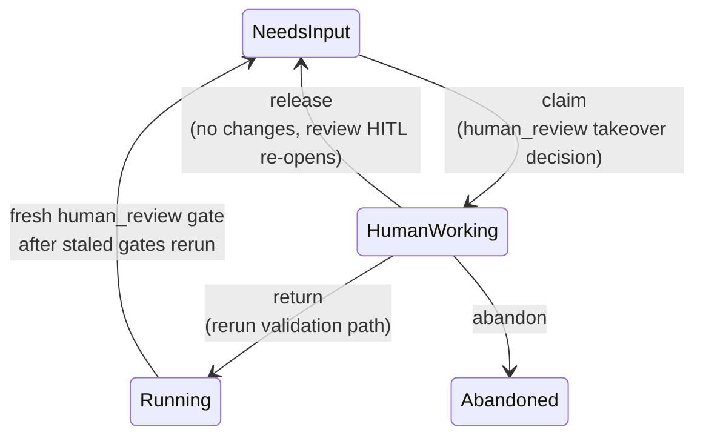
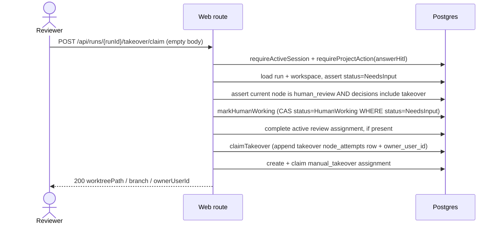
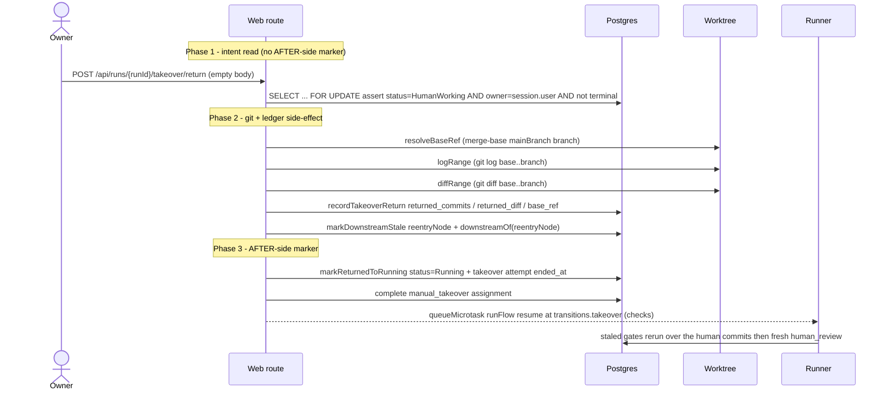
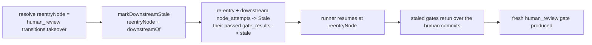

# Manual takeover domain

> **Status: Implemented in M11b.** Claim/return routes, migration `0011`
> (`node_attempts` takeover columns), and the `HumanWorking` status are all
> shipped. Implementation-status tags below reflect HEAD-after-M11b.

## Purpose

**Manual takeover** is a LOCAL worktree handoff (M11b — Implemented). A reviewer
parked at an M11a `human_review` node claims the run, edits its **existing**
worktree by hand on the same host, then returns it for re-validation. The domain
boundary is the takeover lifecycle (claim → human edit → return / release /
abandon), the read-only git ops that capture the human's work, the reuse of M11a
staleness to force a rerun, and the run-detail **timeline read model** that
renders the whole history. It does **not** cover branch targeting, PR promotion,
or the `merge`/`human_edit` node types (all **M18**), nor typed artifact
instances (**M12**). The locked decision is
[ADR-030](../decisions.md#adr-030-manual-takeover-as-a-local-worktree-handoff-humanworking-status).

## Domain entities

- **Takeover claim** — a run transition `NeedsInput → HumanWorking`
  (`runs.status`). Session-less by design; holds a concurrency slot and a
  worktree.
- **Manual takeover assignment** — M13 `assignments` row with
  `action_kind='manual_takeover'`, created and claimed by the takeover actor
  after the `HumanWorking` CAS succeeds.
- **Takeover attempt** — the `node_attempts` row of the `human_review` node that
  carries the takeover columns `owner_user_id`, `base_ref`, `returned_commits`,
  `returned_diff` (raw `git log`/`git diff` text; nullable, populated only on
  return). See [`../db/runs-domain.md`](../db/runs-domain.md).
- **Exposed worktree** — the existing `workspaces.worktree_path` on the existing
  run branch `workspaces.branch`. No new branch/target is created. See
  [`workspaces.md`](workspaces.md).
- **Owner** — `users.id` recorded in `node_attempts.owner_user_id` at claim. In
  M11b the owner is any project member with the `answerHitl` action; role-gated
  claim is **M13**.
- **Base ref** — the `merge-base` of the run branch and the project default
  branch, resolved server-side by `resolveBaseRef`. The `<base>` of both ranges.
- **Validation re-entry node** — the `human_review` node's
  `transitions.takeover` target (a gate-bearing validation node — `checks`),
  resolved from the pinned manifest, never `implement`, never `human_edit`.
- **Read-only git ops** — `logRange` (`git log <base>..<branch>`),
  `diffRange` (`git diff <base>..<branch>`), `resolveBaseRef`
  (`git merge-base <mainBranch> <branch>`) in `web/lib/worktree.ts`.
- **Timeline read model** — `getRunTimeline(runId)` over `node_attempts` +
  `gate_results`, distinguishing **current vs stale** gates.

## State machine

The takeover slice of the run state machine (full machine in
[`runs.md`](runs.md)):

`HumanWorking` is a REAL `runs.status` value (not an in-`Running` pointer move),
counts against the global cap, and is excluded from the startup recovery sweep —
see the four invariants in [`runs.md`](runs.md#m11b-manual-takeover-status-humanworking-implemented).

## Process flows

### Claim (Implemented)

The claim returns checkout context only; it creates **no** branch, worktree, PR,
or supervisor deferred (no agent spawns — the human works locally). A lost CAS
(concurrent claim) returns 409 `CONFLICT`; a wrong run state or non-`human_review`
node returns 409 `PRECONDITION`.

### Return — two-phase commit (Implemented)

The AFTER-side idempotency marker is the `status='Running'` flip plus the
takeover row's `ended_at` — never set before the git/ledger side-effect
completes. The full failure-classification table is in
[`../api/web.openapi.yaml`](../api/web.openapi.yaml) and the plan; the run
machine never partial-commits a return.

### Downstream staleness + rerun (Implemented)

On return, the re-entry node and everything after it go stale and rerun before
the run can reach a fresh review:

The explicit `reentryNode` inclusion is REQUIRED because the as-built
`downstreamOf` (in `web/lib/flows/graph/runner-graph.ts`, exported by M11b)
**excludes its start node**, but the re-entry is a gate-bearing node whose prior
PASS validated *pre-takeover* code and MUST flip stale. `markDownstreamStale` is
the M11a 2-arg helper; no new staleness machinery is added.

### Timeline read model — current vs stale (Implemented)

`getRunTimeline(runId)` (extends `web/lib/queries/run.ts`) returns one ordered
read model over the append-only ledger:

- **Node attempts** — every `node_attempts` row (highest-attempt-wins ordering
  matches M11a templating), with `decision`, `rework_from_node`, `acp_session_id`
  checkpoint refs, and the takeover columns `owner_user_id` / `returned_commits` /
  `returned_diff` / `base_ref`.
- **Gates** — joined `gate_results` (`kind` / `mode` / `status` / `verdict`),
  each flagged **current** or **stale** (`status='stale'`).
- **Handoff block** — for a takeover attempt: owner, elapsed time (from the
  takeover attempt `started_at`), branch, the returned commit list, and the
  returned raw diff (rendered in a `<pre>`, no syntax highlighting per the M9
  deferral).

The page reads M11a `node_attempts` + `gate_results` + the M11b takeover columns;
it never recomputes status from supervisor in-memory state. A minimal/legacy
linear run renders an empty-but-valid timeline (no crash).

## Expectations

- A takeover claim is allowed ONLY when `runs.status='NeedsInput'` AND the
  current `runs.current_step_id` node is a `human_review` node whose pinned
  manifest `finish.human.decisions` includes `takeover`; any other state →
  409 `PRECONDITION`.
- The claim transition is a status-guarded CAS
  (`status='HumanWorking' WHERE status='NeedsInput'`); a concurrent loser →
  409 `CONFLICT`. No two claims succeed for one run.
- The claim creates NO new branch, target, PR, remote, or supervisor deferred;
  it exposes the EXISTING `workspaces.worktree_path` + `workspaces.branch` and
  returns `{ worktreePath, branch, ownerUserId }`.
- `HumanWorking` counts toward `MAISTER_MAX_CONCURRENT_RUNS` exactly like
  `Running`/`NeedsInput` through BOTH scheduler cap-check predicates.
- `HumanWorking` is session-less and is NEVER classified `Crashed` by
  `runResumeRecoverySweep` (its SELECT filters `status='NeedsInput'`).
- **(M30 — Implemented, ADR-078)** Rework `session_policy` resolution does NOT affect
  the takeover-return path: a returned takeover has no live agent session to resume,
  so downstream re-validation always dispatches a fresh session regardless of
  `session_policy`; takeover claim/return semantics are unchanged.
- The return route accepts an EMPTY body; `worktreePath`, `branch`, `baseRef`,
  and `ownerUserId` are ALL derived from server-state — NEVER a body field.
- Return is allowed ONLY when `runs.status='HumanWorking'` AND the session user
  equals `node_attempts.owner_user_id`; otherwise 409 `PRECONDITION` (wrong
  state) or 403 `UNAUTHORIZED` (non-owner). Owner-only is hard in M11b; "take
  over stale work" by another user is **M13**.
- Return is a two-phase commit: the AFTER-side marker
  (`status='Running'` + takeover `ended_at`) is set ONLY after `git log`/`git
  diff` + `recordTakeoverReturn` + `markDownstreamStale` all succeed.
- M13 assignment completion is part of that after-side transaction: the manual
  takeover assignment is completed only after artifacts, staleness, cursor, and
  `Running` status have committed.
- A dirty worktree on return (`git status --porcelain=v1 --untracked-files=all`
  non-empty — uncommitted tracked edits OR untracked files) is rejected 409
  `CONFLICT` BEFORE any ledger write, because the recorded `base..branch`
  log/diff captures committed work ONLY; the run stays `HumanWorking`, retryable
  after the operator commits or discards.
- An empty return (`base..branch` has zero commits) is rejected 409 `CONFLICT`
  BEFORE any ledger write — the route NEVER records an empty return; the run
  stays `HumanWorking`, retryable after the operator commits (or releases).
- A git-op failure (`logRange`/`diffRange`/`resolveBaseRef`) on return leaves the
  run `HumanWorking` with NO ledger write and NO status flip (409 `CONFLICT`,
  retryable); a ledger/staleness write throwing mid-side-effect → 503
  `EXECUTOR_UNAVAILABLE`, run stays `HumanWorking`.
- On return the runner stales `[reentryNode, ...downstreamOf(graph, reentryNode)]`
  — re-entry INCLUDED — and resumes at the `human_review` node's
  `transitions.takeover` target (`checks`), never `implement`, never `human_edit`.
- Return records the returned commit set + raw diff MINIMALLY as text on the
  takeover `node_attempts` row (`returned_commits`, `returned_diff`, `base_ref`);
  it creates NO typed artifact instances (M12).
- Release without changes returns the run to `NeedsInput` (the original review
  HITL re-opens); abandon of a `HumanWorking` run runs `releaseHumanWorking`
  then the standard abandon transition and frees the slot via
  `promoteNextPending`.
- The run-detail timeline distinguishes current vs stale gates and shows ALL
  node attempts, decisions, checkpoints, handoffs, returned commits, and rerun
  results in ONE view.

## Edge cases

- **Claim on a non-`human_review` node or wrong status** → `PRECONDITION` (409).
  Run unchanged.
- **Concurrent claim (two reviewers)** — the CAS loser gets `CONFLICT` (409);
  exactly one owner is recorded.
- **Return by a non-owner** → `UNAUTHORIZED` (403). Run stays `HumanWorking`.
- **Return when already returned** (run now `Running`) → `PRECONDITION` (409),
  no re-import (idempotent terminal).
- **Abandon of a `HumanWorking` run** (`POST /api/runs/{runId}/abandon`) →
  `releaseHumanWorking` (`HumanWorking → NeedsInput`) precedes `markAbandoned`,
  because the abandon CAS guard excludes `HumanWorking`; then `promoteNextPending`
  frees the held slot. An already-terminal run loses the abandon CAS →
  `PRECONDITION` (409).
- **Dirty worktree on return** (uncommitted tracked edits OR untracked files —
  `git status --porcelain=v1 --untracked-files=all` non-empty) → `CONFLICT`
  (409); no ledger write, no status flip. The commit-ref-only `base..branch`
  log/diff would silently drop the work, so the route refuses; retryable after
  the operator commits or discards.
- **Empty return** (`base..branch` has zero commits) → `CONFLICT` (409); the
  route records NO empty return, no status flip, retryable after the operator
  commits or releases instead.
- **`git log`/`git diff`/`merge-base` fails** (worktree removed, git error) →
  `CONFLICT` (409); no ledger write, no status flip, retryable after the operator
  restores the worktree.
- **Ledger / `markDownstreamStale` throws mid-side-effect** →
  `EXECUTOR_UNAVAILABLE` (503); the `FOR UPDATE` re-read finds the run still
  `HumanWorking`, so a retry replays cleanly.
- **Oversized diff** — `diffRange` returns `{ text, truncated }` cut at
  `EXEC_MAX_BUFFER`; it does NOT throw. The takeover-return path re-appends the
  in-band marker to `returned_diff` so the stored evidence still flags the cut.
- **Ref/path injection** — `logRange`/`diffRange`/`resolveBaseRef` validate the
  branch (`branchNameSchema`), the worktree path (`absolutePathSchema`), and the
  base ref (`/^[A-Za-z0-9_./-]+$/`, no `..`); a bad ref → `CONFLICT`.
- **Process dies AFTER the return flip but BEFORE the runner attaches** — the
  return route flips `HumanWorking → Running` (the AFTER-side marker) and then
  `queueMicrotask(runFlow)`; a crash in that window strands the run in `Running`
  holding a cap slot, with no live runner. A startup **takeover-return recovery
  candidate** is a run in `Running` whose most-recent ledger activity is a
  RECORDED TAKEOVER RETURN (the takeover `node_attempts` row has `returned_diff`
  set / `ended_at` set, and the re-entry node's `gate_results` are still `stale`)
  AND that has NO subsequent re-entry (`checks`) `node_attempts` row — i.e. the
  post-return resume never progressed. **Action: RE-DISPATCH the graph runner**
  (resume at `runs.current_step_id` = the `transitions.takeover` re-entry). This
  is SAFE because M11a's resume is CAS-guarded and therefore idempotent: if a
  runner is already live the re-dispatch loses the claim and no-ops; if the resume
  pointer is genuinely stale the existing fail-closed path
  (`runner-graph.ts:379`) writes `Crashed`. A naive "`Running` + no live session
  → `Crashed`" sweep is REJECTED — it would false-positive on a legitimately
  session-less `command_check` gate executing after the return.

## Linked artifacts

- ADRs: [ADR-030 Manual takeover](../decisions.md#adr-030-manual-takeover-as-a-local-worktree-handoff-humanworking-status),
  [ADR-011 Workspace lifecycle](../decisions.md#adr-011-workspace-lifecycle-via-git-worktree),
  [ADR-009 Global concurrency cap](../decisions.md#adr-009-global-concurrency-cap--3),
  [ADR-008 Typed error taxonomy](../decisions.md#adr-008-typed-error-taxonomy-maistererror),
  [ADR-027 node_attempts ledger](../decisions.md#adr-027-append-only-node_attempts-run-ledger),
  [ADR-029 Split M11](../decisions.md#adr-029-split-m11-into-m11a--m11b--m11c),
  [ADR-078 Rework session policy (M30 — Implemented)](../decisions.md#adr-078-rework-session-policy-with-resume-by-default).
- API: [`../api/web.openapi.yaml`](../api/web.openapi.yaml)
  (`/api/runs/{runId}/takeover/claim`, `.../takeover/return`,
  `/api/runs/{runId}/abandon`).
- ERD: [`../db/runs-domain.md`](../db/runs-domain.md) (`node_attempts` takeover
  columns), [`../database-schema.md`](../database-schema.md).
- Related: [`runs.md`](runs.md), [`hitl.md`](hitl.md),
  [`flow-graph.md`](flow-graph.md) (M11a ledger/staleness/rework),
  [`workspaces.md`](workspaces.md) (worktree + read-only git ops),
  [`../flow-dsl.md`](../flow-dsl.md) (`transitions.takeover` wiring).
- Source: `web/lib/worktree.ts` (`logRange`/`diffRange`/`resolveBaseRef`),
  `web/lib/flows/graph/ledger.ts` (`claimTakeover`/`recordTakeoverReturn`/
  `markDownstreamStale`), `web/lib/flows/graph/runner-graph.ts` (`downstreamOf`),
  `web/lib/runs/state-transitions.ts` (`markHumanWorking`/`markReturnedToRunning`/
  `releaseHumanWorking`), `web/lib/queries/run.ts` (`getRunTimeline`),
  `web/lib/scheduler.ts` (cap predicates), `web/lib/runs/resume-recovery.ts`.
