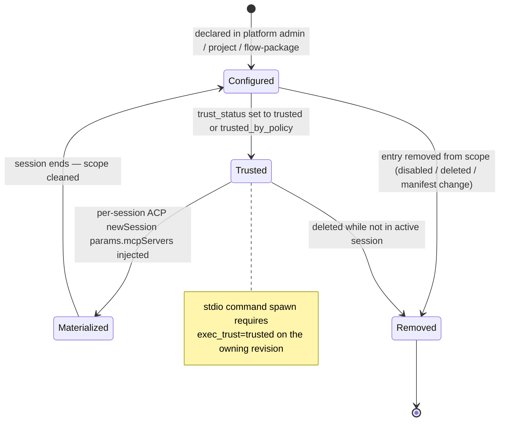
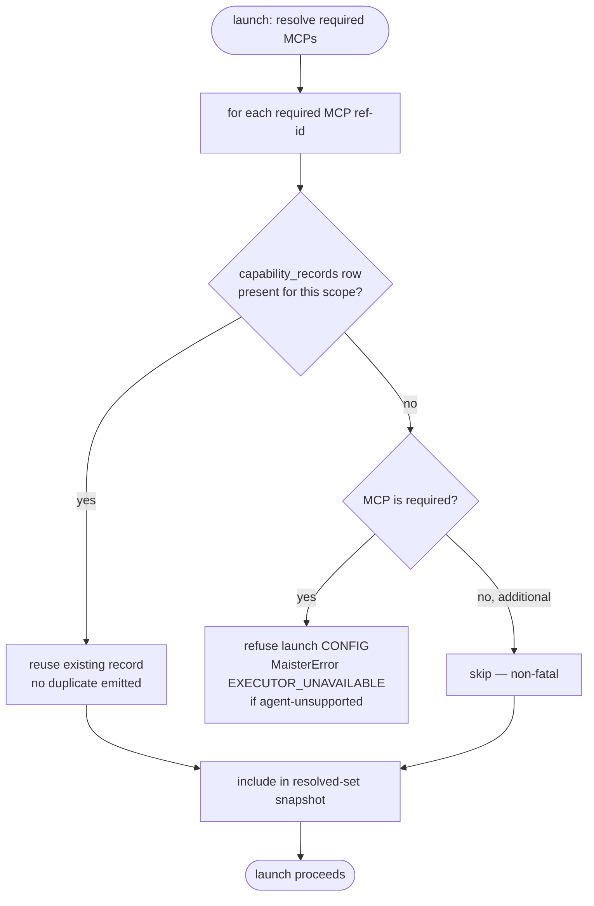
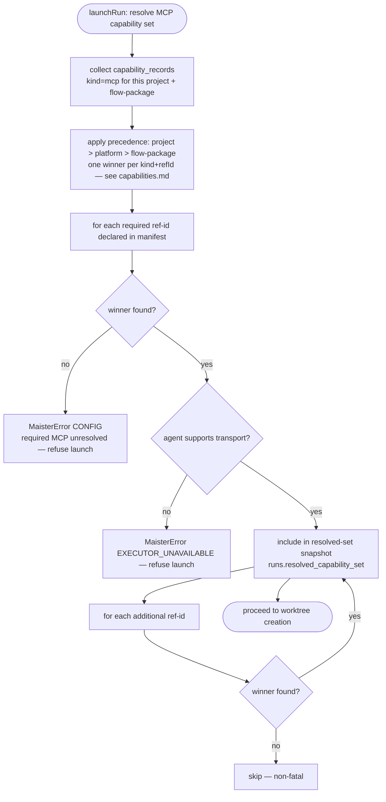
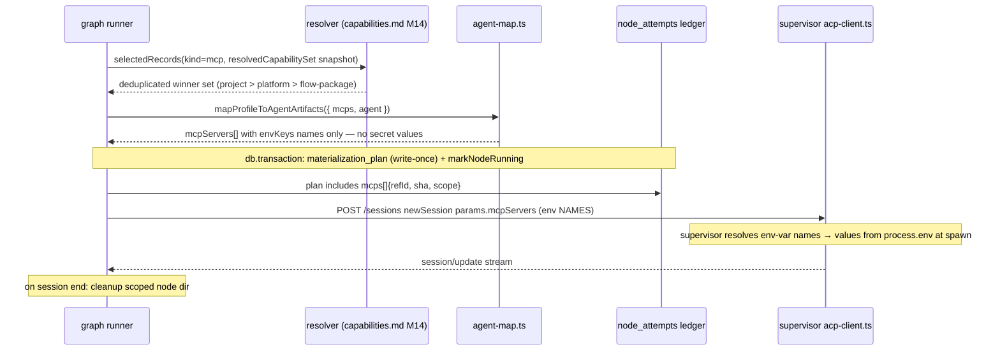

# MCP capability management domain

> **Status: Implemented (M27 Stage 1).** The entities, routes, and state
> machines below have shipped — contracted in the
> [M27 Stage-1 SDD](../../.ai-factory/specs/feature-m27-flow-studio-stage-1.md)
> and now coded. Locked decision: [ADR-070](../decisions.md#adr-070).
> Extends the M14 materialization surface documented in
> [capabilities.md](capabilities.md) and the M25 authored catalog documented in
> [capability-catalog.md](capability-catalog.md).

## Purpose

This domain covers how Model Context Protocol (MCP) servers are declared,
configured, and materialized across the three scopes of a MAIster deployment:
the **platform instance** (admin-owned, host-wide), a **project** (project-admin-
owned), and a **flow-package** (embedded in a `flow.yaml` manifest). It owns
the CRUD lifecycle for `platform_mcp_servers`, the resolution of scoped
`capability_records` rows of `kind=mcp`, and the per-session materialization
path that injects configured MCP servers into an ACP session. Secret values
are never stored — only `env:NAME` references. Out of scope: MCP marketplace /
reputation / malware scanning / sandboxing / org policy (Phase 2).

## Domain entities

- **`platform_mcp_servers`** (Implemented) — admin-managed, host-wide MCP catalog.
  One row per server: `{ id, transport ∈ {stdio,sse,http}, command (stdio),
  args, env_keys (names only), url (sse|http), header_keys (names only),
  supported_agents, trust_status ∈ {untrusted,trusted,trusted_by_policy},
  readiness_status ∈ {Unknown,Ready,NotReady}, readiness_reasons,
  enabled, created_at, updated_at }`. Mirrors `platform_acp_runners`.
  See [db/projects-domain.md](../db/projects-domain.md).
- **`capability_records` kind=mcp** (Implemented, M14; extended M27) — one row
  per declared MCP in the project registry, with `source ∈ {platform, project,
  flow-package}`. The `material` jsonb carries the transport shape and
  `env:NAME` references — never resolved secret values. See
  [capabilities.md](capabilities.md) and
  [db/capabilities-domain.md](../db/capabilities-domain.md).
- **MCP transport** — discriminated union in `mcpCapabilitySchema`:
  `stdio { command, args?, env? }` | `sse { url, headers? }` |
  `http { url, headers? }`. All credential fields accept `env:NAME` only
  (regex `^env:[A-Za-z_][A-Za-z0-9_]*$`). See
  [configuration.md](../configuration.md).
- **Required vs additional** — `flow.yaml` node settings declare
  `mcps: { required?: string[], additional?: string[] }` (a bare `string[]`
  is treated as `additional` for backward compatibility). An unresolvable
  `required` MCP blocks launch; an absent `additional` MCP degrades gracefully.
- **`env:NAME` secret refs** — env-var names stored in `env_keys`/`header_keys`
  on `platform_mcp_servers` and carried as `mcpServers[].envKeys` over ACP
  `newSession`. The supervisor resolves name → value from its `process.env` at
  spawn; the value never reaches the web tier, the DB, the wire, or any log.

## State machines

### MCP record lifecycle (Implemented)

The state of a `capability_records` row of `kind=mcp`, from declaration to
active use within a session.

### Setup-time resolve flow (Implemented)

When a run is launched, the setup-time resolver checks whether a required MCP
ref is already configured; if absent, it proposes configuration before
allowing launch to proceed.

## Process flows

### Setup-time resolve-by-id (Implemented)

Resolution precedence — **project wins over platform wins over flow-package** —
is documented canonically in [capabilities.md](capabilities.md); this flow
applies that rule to `kind=mcp` only. At most one winner is emitted per
`(kind, refId)` — no duplicate materialization.

### Per-session materialization (Implemented)

This flow reuses the M14 materialize → agent-map → supervisor wire path
([capabilities.md](capabilities.md) §Process flows). The M27 extension adds
`sse`/`http` transport and the resolved-set snapshot read.

### Platform MCP readiness (computed on write — WI-2, Implemented)

`platform_mcp_servers.readiness_status` / `readiness_reasons` describe whether a
declared server is actually launch-ready. The columns existed but were **never
computed before WI-2** (every row read `Unknown`). WI-2 computes readiness on
every write, mirroring the platform ACP-runner readiness path
([acp-runners.md](acp-runners.md), `web/lib/acp-runners/readiness.ts`).

`evaluateMcpReadiness(row, diagnostics)` (`web/lib/mcp/readiness.ts`) derives the
status from the row's transport config × the supervisor `/diagnostics` env
references (`checkSupervisorDiagnostics`):

- `stdio` — `command` present, else `NotReady` "missing command".
- `sse` / `http` — `url` present, else `NotReady` "missing url".
- every referenced `env_keys` / `header_keys` name present in diagnostics
  `envRefs`, else `NotReady` "env ref missing: NAME".
- all satisfied → `Ready`; diagnostics unavailable → `Unknown` with a reason.

It is invoked from the two write routes only — `POST /api/admin/mcp-servers` and
`PATCH /api/admin/mcp-servers/{id}` — so stored readiness is recomputed on every
create/edit. `DELETE` does not recompute (the row is gone). The evaluator runs
no side-effect and reads only `env:NAME` names — never a secret value.

## Expectations

The following normative bullets are copied verbatim from SDD §7.2 (Implemented):

1. MCP secret values MUST be stored/accepted ONLY as `env:NAME`; values MUST be resolved supervisor-side and MUST NEVER appear in any HTTP response, DB column, or `session/update` payload.
2. Capability id-collision MUST resolve project > platform > flow-package, picking exactly ONE winner per `(kind, refId)`, no duplicate materialization.
3. A platform MCP DELETE MUST be refused (409) while any usage reference exists (mirror `assertCanDisable`); zero refs → 204.
4. A platform MCP POST with a duplicate id MUST return 409 (via `onConflictDoNothing().returning()`), never a raw 500.
5. Setup-time resolve MUST reuse an already-present MCP by id (dedupe, no silent duplicate); an absent REQUIRED MCP MUST block launch until configured.
6. A REQUIRED MCP that cannot resolve+materialize MUST refuse launch; an ADDITIONAL MCP absence MUST NOT.
7. Resolved MCP revisions MUST be included in the launch resolved-set snapshot.
8. Materialization MUST reuse M14 (`materialize.ts`/`agent-map.ts`/supervisor wire) — no parallel materialization path.
9. Flow-package MCP declarations MUST honor config SET/CLEAR/re-SET symmetry (declared→required; removed→not required; re-added→required).
10. Codex MCP support MUST be either materialized (if `codex-acp` supports it) OR explicitly documented as a gap (no silent degrade).

This branch adds the readiness-on-write contract (the readiness columns were
recorded but never computed before WI-2):

- **(WI-2 — Implemented)** Platform MCP `readiness_status` / `readiness_reasons`
  MUST be recomputed by `evaluateMcpReadiness(row, diagnostics)` on every
  `POST /api/admin/mcp-servers` and `PATCH /api/admin/mcp-servers/{id}` write,
  and MUST NOT be recomputed on `DELETE`. A `stdio` row missing `command`, an
  `sse`/`http` row missing `url`, or any `env_keys`/`header_keys` name absent
  from supervisor `/diagnostics` `envRefs` MUST yield `NotReady` with a
  per-cause reason; diagnostics unavailable MUST yield `Unknown` with a reason;
  the evaluator MUST NOT read or store any secret value (only `env:NAME` names).

## Edge cases

| Case | MaisterError code | HTTP |
|---|---|---|
| Unknown MCP/skill ref-id in manifest | `CONFIG` | 422 (not persisted) |
| Required MCP unresolved at launch | `CONFIG` | 409 |
| Required MCP agent-unsupported (strict transport/agent check) | `EXECUTOR_UNAVAILABLE` | 503 |
| Platform MCP delete while any usage reference exists | `CONFLICT` | 409 |
| Platform MCP POST with a duplicate id | `CONFLICT` | 409 |
| MCP stdio `command` spawn before `exec_trust=trusted` on owning revision | refused (guard — no exec) | n/a |
| Raw (non-`env:`) secret in any MCP field | `CONFIG` | 422 |

## Linked artifacts

- **Decision:** [ADR-070](../decisions.md#adr-070) — platform MCP admin CRUD surface and delete guard.
- **SDD:** [`.ai-factory/specs/feature-m27-flow-studio-stage-1.md`](../../.ai-factory/specs/feature-m27-flow-studio-stage-1.md) §3.1 (`platform_mcp_servers` DDL), §3.2 (`mcpCapabilitySchema`, required/additional), §6.2 (required-vs-additional gate), §7.2 (normative MCP bullets), §8 (edge cases).
- **Capability resolution precedence:** [capabilities.md](capabilities.md) — the project > platform > flow-package winner rule applies to all `kind` values including `mcp`; this file does not restate the full rule.
- **M14 materialization path:** [capabilities.md](capabilities.md) §Process flows — reused unchanged by M27; M27 extends the transport shape only.
- **Authored catalog:** [capability-catalog.md](capability-catalog.md) — authored flow publish does not mutate `platform_mcp_servers`.
- **Admin surface precedent:** [acp-runners.md](acp-runners.md) — `platform_mcp_servers` CRUD mirrors `platform_acp_runners` CRUD and delete-guard pattern (ADR-065).
- **Instance config / settings page:** [instance-config.md](instance-config.md) §Platform MCP server admin — the `/settings` page hosts the platform-scoped MCP admin panel.
- **OpenAPI:** [`../api/web.openapi.yaml`](../api/web.openapi.yaml) — `GET/POST /api/admin/mcp-servers`, `PATCH/DELETE /api/admin/mcp-servers/{id}`, `GET/POST /api/projects/{slug}/mcp`, `PATCH/DELETE /api/projects/{slug}/mcp/{mcpId}`, `POST /api/projects/{slug}/mcp/resolve`.
- **ERD:** [`../db/capabilities-domain.md`](../db/capabilities-domain.md) — `capability_records` + `capability_imports` + new `platform_mcp_servers`.
- **Source (Implemented):** `web/lib/capabilities/resolver.ts`, `web/lib/capabilities/materialize.ts`, `web/lib/capabilities/agent-map.ts`, `supervisor/src/acp-client.ts`, `web/app/api/admin/mcp-servers/route.ts`, `web/app/api/admin/mcp-servers/[id]/route.ts`, `web/app/api/projects/[slug]/mcp/route.ts`, `web/app/api/projects/[slug]/mcp/[mcpId]/route.ts`, `web/app/api/projects/[slug]/mcp/resolve/route.ts`, `web/components/settings/mcp-servers-panel.tsx`, `web/components/settings/mcp-server-modal.tsx`.
